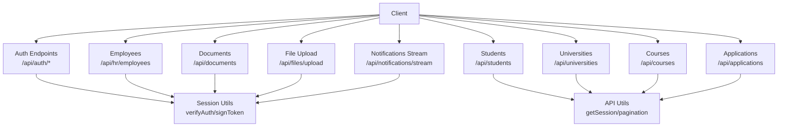
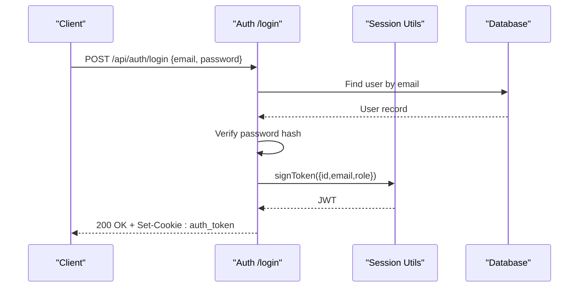
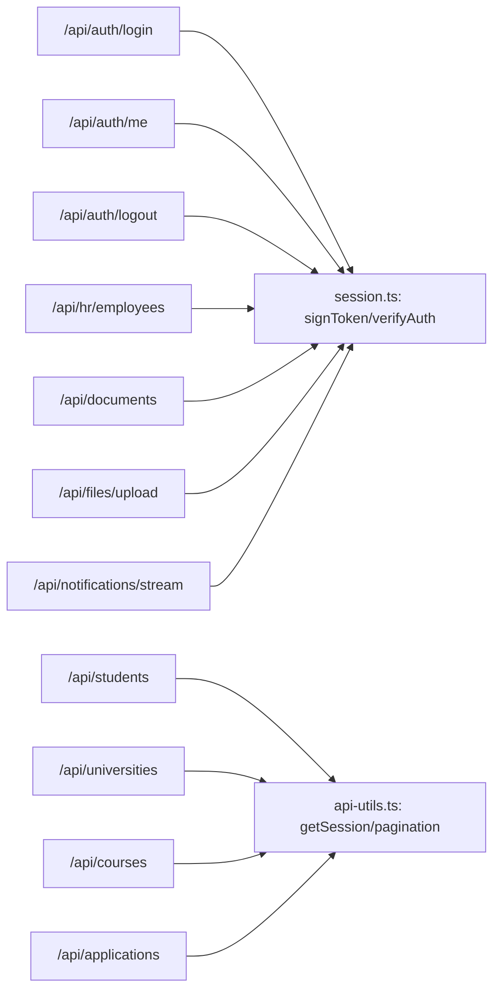
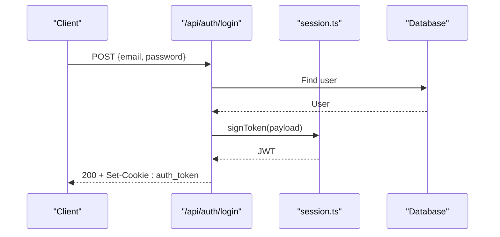

# API Reference

<cite>
**Referenced Files in This Document**
- [route.ts](file://src/app/api/auth/login/route.ts)
- [route.ts](file://src/app/api/auth/logout/route.ts)
- [route.ts](file://src/app/api/auth/me/route.ts)
- [route.ts](file://src/app/api/auth/forgot-password/route.ts)
- [route.ts](file://src/app/api/auth/reset-password/route.ts)
- [route.ts](file://src/app/api/students/route.ts)
- [route.ts](file://src/app/api/universities/route.ts)
- [route.ts](file://src/app/api/courses/route.ts)
- [route.ts](file://src/app/api/applications/route.ts)
- [route.ts](file://src/app/api/hr/employees/route.ts)
- [route.ts](file://src/app/api/documents/route.ts)
- [route.ts](file://src/app/api/files/upload/route.ts)
- [route.ts](file://src/app/api/notifications/stream/route.ts)
- [route.ts](file://src/app/api/users/route.ts)
- [api-utils.ts](file://src/lib/api-utils.ts)
- [session.ts](file://src/lib/session.ts)
</cite>

## Table of Contents
1. Introduction
2. Project Structure
3. Core Components
4. Architecture Overview
5. Detailed Component Analysis
6. Dependency Analysis
7. Performance Considerations
8. Troubleshooting Guide
9. Conclusion
10. Appendices

## Introduction
This document provides a comprehensive RESTful API reference for UniTrack, covering authentication, core entity management (students, universities, courses, applications, employees, documents), file uploads, and real-time notifications. It specifies HTTP methods, URL patterns, request/response schemas, authentication requirements, error handling, pagination, filtering, and practical usage guidance.

## Project Structure
UniTrack exposes Next.js Route Handlers under src/app/api/. Authentication is cookie-based using JWTs signed with HS256 and stored in an httpOnly cookie named auth_token. Shared utilities provide session verification, pagination helpers, and standardized error responses. Real-time updates are delivered via Server-Sent Events (SSE).

**Diagram sources**
- [route.ts:19-122](file://src/app/api/auth/login/route.ts#L19-L122)
- [route.ts:7-35](file://src/app/api/auth/logout/route.ts#L7-L35)
- [route.ts:7-68](file://src/app/api/auth/me/route.ts#L7-L68)
- [route.ts:9-59](file://src/app/api/students/route.ts#L9-L59)
- [route.ts:8-82](file://src/app/api/universities/route.ts#L8-L82)
- [route.ts:9-70](file://src/app/api/courses/route.ts#L9-L70)
- [route.ts:8-73](file://src/app/api/applications/route.ts#L8-L73)
- [route.ts:18-57](file://src/app/api/hr/employees/route.ts#L18-L57)
- [route.ts:19-36](file://src/app/api/documents/route.ts#L19-L36)
- [route.ts:86-191](file://src/app/api/files/upload/route.ts#L86-L191)
- [route.ts:21-104](file://src/app/api/notifications/stream/route.ts#L21-L104)
- [api-utils.ts:13-83](file://src/lib/api-utils.ts#L13-L83)
- [session.ts:19-36](file://src/lib/session.ts#L19-L36)

**Section sources**
- [route.ts:19-122](file://src/app/api/auth/login/route.ts#L19-L122)
- [api-utils.ts:13-83](file://src/lib/api-utils.ts#L13-L83)
- [session.ts:19-36](file://src/lib/session.ts#L19-L36)

## Core Components
- Authentication: Login, logout, current user profile, password reset flows.
- Entities: Students, Universities, Courses, Applications, Employees, Documents.
- File Management: Secure upload with validation and storage.
- Real-time Notifications: SSE stream for live updates.
- Utilities: Session verification, pagination, standardized errors.

**Section sources**
- [route.ts:19-122](file://src/app/api/auth/login/route.ts#L19-L122)
- [route.ts:7-35](file://src/app/api/auth/logout/route.ts#L7-L35)
- [route.ts:7-68](file://src/app/api/auth/me/route.ts#L7-L68)
- [route.ts:9-59](file://src/app/api/students/route.ts#L9-L59)
- [route.ts:8-82](file://src/app/api/universities/route.ts#L8-L82)
- [route.ts:9-70](file://src/app/api/courses/route.ts#L9-L70)
- [route.ts:8-73](file://src/app/api/applications/route.ts#L8-L73)
- [route.ts:18-57](file://src/app/api/hr/employees/route.ts#L18-L57)
- [route.ts:19-36](file://src/app/api/documents/route.ts#L19-L36)
- [route.ts:86-191](file://src/app/api/files/upload/route.ts#L86-L191)
- [route.ts:21-104](file://src/app/api/notifications/stream/route.ts#L21-L104)
- [api-utils.ts:13-83](file://src/lib/api-utils.ts#L13-L83)
- [session.ts:19-36](file://src/lib/session.ts#L19-L36)

## Architecture Overview
Authentication uses JWTs signed with HS256 and stored in an httpOnly cookie. Most endpoints require a valid session; some endpoints enforce role-based access. Pagination and search are standardized across list endpoints. File uploads validate MIME types and size limits. Notifications use SSE to push events to clients.

**Diagram sources**
- [route.ts:19-122](file://src/app/api/auth/login/route.ts#L19-L122)
- [session.ts:28-36](file://src/lib/session.ts#L28-L36)

**Section sources**
- [route.ts:19-122](file://src/app/api/auth/login/route.ts#L19-L122)
- [session.ts:19-36](file://src/lib/session.ts#L19-L36)

## Detailed Component Analysis

### Authentication
- POST /api/auth/login
  - Purpose: Authenticate user and issue session token.
  - Request body: email, password.
  - Response: 200 with success flag; sets httpOnly cookie auth_token.
  - Errors: 400 validation, 401 invalid credentials, 429 rate limit, 500 server error.
  - Notes: Updates last login, records login log, sets enabled modules cookie.

- POST /api/auth/logout
  - Purpose: Invalidate session by clearing cookies.
  - Response: 200 success.
  - Errors: 500 server error.

- GET /api/auth/me
  - Purpose: Return current authenticated user profile.
  - Auth: Requires valid auth_token cookie.
  - Response: User object with selected fields; sets enabled_modules cookie.
  - Errors: 401 unauthorized, 404 not found.

- POST /api/auth/forgot-password
  - Purpose: Send OTP to email for password reset.
  - Request body: email.
  - Response: 200 success message (safe response even if email not found).
  - Rate limiting: Enforced per IP.
  - Errors: 400 missing email, 429 too many requests, 500 server error.

- POST /api/auth/reset-password
  - Purpose: Reset password using verified OTP token.
  - Request body: token (verified OTP), password (min length enforced).
  - Response: 200 success message.
  - Rate limiting: Enforced per IP.
  - Errors: 400 invalid/expired token or weak password, 429 too many requests, 500 server error.

**Section sources**
- [route.ts:19-122](file://src/app/api/auth/login/route.ts#L19-L122)
- [route.ts:7-35](file://src/app/api/auth/logout/route.ts#L7-L35)
- [route.ts:7-68](file://src/app/api/auth/me/route.ts#L7-L68)
- [route.ts:7-93](file://src/app/api/auth/forgot-password/route.ts#L7-L93)
- [route.ts:6-63](file://src/app/api/auth/reset-password/route.ts#L6-L63)

### Students
- GET /api/students
  - Purpose: List students with filters and pagination.
  - Query params: page, perPage, search, status, country, counselor.
  - Auth: Required (session).
  - Response: Paginated result with student details and counts.
  - Errors: 401 unauthorized, 500 server error.

- POST /api/students
  - Purpose: Create a new student and optionally create/update associated user account.
  - Auth: Admin/Super Admin/Staff only.
  - Request body: Student fields including name parts, contact info, passport, education, scores, target university, etc.
  - Response: Created student with generatedPassword field when applicable.
  - Errors: 400 validation or duplicate email, 401 unauthorized, 500 server error.

**Section sources**
- [route.ts:9-59](file://src/app/api/students/route.ts#L9-L59)
- [route.ts:61-214](file://src/app/api/students/route.ts#L61-L214)

### Universities
- GET /api/universities
  - Purpose: List universities with filters and pagination.
  - Query params: page, perPage, search, status, country, type.
  - Auth: Required (session).
  - Response: Paginated result with transformed fields (e.g., accreditation parsed, computed initials/colors).
  - Errors: 401 unauthorized, 500 server error.

- POST /api/universities
  - Purpose: Create a new university.
  - Auth: Admin/Super Admin/Staff only.
  - Request body: University details including name, location, type, website, founding year, accreditation, images, commission settings, description, status.
  - Response: 201 created university.
  - Errors: 400 bad request, 401 unauthorized, 500 server error.

**Section sources**
- [route.ts:8-82](file://src/app/api/universities/route.ts#L8-L82)
- [route.ts:84-158](file://src/app/api/universities/route.ts#L84-L158)

### Courses
- GET /api/courses
  - Purpose: List courses with filters and pagination.
  - Query params: page, perPage, search, status, universityId, level, faculty, degreeType.
  - Auth: Required (session).
  - Response: Paginated result with course details and related university info.
  - Errors: 401 unauthorized, 500 server error.

- POST /api/courses
  - Purpose: Create a new course.
  - Auth: Admin/Super Admin/Staff only.
  - Request body: Course details including universityId, faculty, degreeType, level, credits, duration, dates, language, mode, academic requirements, fees, quick filters, requirements, deadlines, English test requirements, commission settings.
  - Response: 201 created course.
  - Errors: 400 bad request, 401 unauthorized, 500 server error.

**Section sources**
- [route.ts:9-70](file://src/app/api/courses/route.ts#L9-L70)
- [route.ts:72-161](file://src/app/api/courses/route.ts#L72-L161)

### Applications
- GET /api/applications
  - Purpose: List applications with filters and pagination.
  - Query params: page, perPage, search, studentId, status, universityId.
  - Auth: Not explicitly enforced here; returns paginated results.
  - Response: Paginated result with student, university, and course details.
  - Errors: 500 server error.

- POST /api/applications
  - Purpose: Create a new application for a student and course at a university.
  - Auth: Required (session).
  - Request body: studentId, universityId, courseId.
  - Response: 201 created application.
  - Errors: 400 missing fields, 401 unauthorized, 500 server error.

**Section sources**
- [route.ts:8-73](file://src/app/api/applications/route.ts#L8-L73)
- [route.ts:75-113](file://src/app/api/applications/route.ts#L75-L113)

### Employees (HR)
- GET /api/hr/employees
  - Purpose: List employees excluding Admin and Student roles.
  - Auth: Required (session).
  - Response: Array of employee profiles with department, designation, branch details.
  - Errors: 401 unauthorized, 500 server error.

- POST /api/hr/employees
  - Purpose: Update/create employee profile linked to a user.
  - Auth: Admin/Super Admin only.
  - Request body: userId, employeeId, contact info, address, bank details, salary, hire date, employment type, department/designation/branch IDs.
  - Response: Updated employee profile.
  - Errors: 401 unauthorized, 500 server error.

**Section sources**
- [route.ts:18-57](file://src/app/api/hr/employees/route.ts#L18-L57)
- [route.ts:59-108](file://src/app/api/hr/employees/route.ts#L59-L108)

### Documents
- GET /api/documents
  - Purpose: List scanned documents owned by the authenticated user.
  - Auth: Required (session).
  - Response: Array of scanned documents.
  - Errors: 401 unauthorized, 500 server error.

- POST /api/documents
  - Purpose: Create a scanned document entry.
  - Auth: Required (session).
  - Request body: url, filename, fileSize (optional), dpi (optional).
  - Response: 201 created document.
  - Errors: 400 missing fields, 401 unauthorized, 500 server error.

- DELETE /api/documents?id={id}
  - Purpose: Delete a scanned document owned by the authenticated user.
  - Auth: Required (session).
  - Response: 200 success.
  - Errors: 400 missing id, 404 not found, 401 unauthorized, 500 server error.

**Section sources**
- [route.ts:19-36](file://src/app/api/documents/route.ts#L19-L36)
- [route.ts:38-74](file://src/app/api/documents/route.ts#L38-L74)
- [route.ts:76-109](file://src/app/api/documents/route.ts#L76-L109)

### File Uploads
- POST /api/files/upload?folderId={folderId}
  - Purpose: Upload files to public/uploads with validation and database registration.
  - Auth: Required (session).
  - Form data: file (required), academicDocumentId (optional), folderId (query param required).
  - Constraints: Allowed MIME types, max 20MB, sanitized filenames, conflict resolution.
  - Behavior: If folderId starts with "student_", associates file with student and optional academic document; otherwise associates with a user-owned folder.
  - Response: 201 created file item or student document.
  - Errors: 400 missing parameters/file/type/size, 401 unauthorized, 404 not found, 500 server error.

**Section sources**
- [route.ts:86-191](file://src/app/api/files/upload/route.ts#L86-L191)

### Real-time Notifications (SSE)
- GET /api/notifications/stream
  - Purpose: Open a Server-Sent Events stream to receive notifications and heartbeat.
  - Auth: Requires auth_token cookie.
  - Response: text/event-stream with connected event, periodic notifications, and heartbeat events.
  - Errors: 401 unauthorized.

**Section sources**
- [route.ts:21-104](file://src/app/api/notifications/stream/route.ts#L21-L104)

### Users
- GET /api/users
  - Purpose: List users (name, email, role, avatar).
  - Auth: Required (session).
  - Response: Array of user summaries.
  - Errors: 401 unauthorized, 500 server error.

**Section sources**
- [route.ts:18-42](file://src/app/api/users/route.ts#L18-L42)

## Dependency Analysis
- Authentication relies on JWT signing/verification utilities.
- List endpoints use shared pagination helpers and session retrieval.
- Role checks are enforced in specific endpoints (e.g., students, universities, courses, employees).
- File uploads depend on filesystem operations and database models for tracking.
- SSE endpoint depends on database queries and streaming response.

**Diagram sources**
- [session.ts:19-36](file://src/lib/session.ts#L19-L36)
- [api-utils.ts:13-83](file://src/lib/api-utils.ts#L13-L83)
- [route.ts:19-122](file://src/app/api/auth/login/route.ts#L19-L122)
- [route.ts:7-68](file://src/app/api/auth/me/route.ts#L7-L68)
- [route.ts:7-35](file://src/app/api/auth/logout/route.ts#L7-L35)
- [route.ts:9-59](file://src/app/api/students/route.ts#L9-L59)
- [route.ts:8-82](file://src/app/api/universities/route.ts#L8-L82)
- [route.ts:9-70](file://src/app/api/courses/route.ts#L9-L70)
- [route.ts:8-73](file://src/app/api/applications/route.ts#L8-L73)
- [route.ts:18-57](file://src/app/api/hr/employees/route.ts#L18-L57)
- [route.ts:19-36](file://src/app/api/documents/route.ts#L19-L36)
- [route.ts:86-191](file://src/app/api/files/upload/route.ts#L86-L191)
- [route.ts:21-104](file://src/app/api/notifications/stream/route.ts#L21-L104)

**Section sources**
- [session.ts:19-36](file://src/lib/session.ts#L19-L36)
- [api-utils.ts:13-83](file://src/lib/api-utils.ts#L13-L83)

## Performance Considerations
- Use pagination parameters (page, perPage) to limit payload sizes.
- Apply filters (status, country, universityId, level, faculty, degreeType) to reduce query scope.
- Leverage server-side includes selectively to avoid over-fetching.
- SSE stream polls every 10 seconds; ensure client handles reconnection gracefully.
- File uploads enforce size limits and MIME validation to prevent heavy payloads.

[No sources needed since this section provides general guidance]

## Troubleshooting Guide
- Authentication failures: Ensure auth_token cookie is present and valid; verify JWT_SECRET environment variable is set.
- Rate limiting: 429 responses indicate too many attempts on sensitive endpoints (login, forgot-password, reset-password).
- Validation errors: 400 responses include descriptive messages; check required fields and formats.
- Permission errors: 401/403 indicate insufficient privileges; confirm user role and session validity.
- Database errors: 500 responses may indicate internal issues; review logs and constraints (e.g., unique email).

**Section sources**
- [route.ts:19-122](file://src/app/api/auth/login/route.ts#L19-L122)
- [route.ts:7-93](file://src/app/api/auth/forgot-password/route.ts#L7-L93)
- [route.ts:6-63](file://src/app/api/auth/reset-password/route.ts#L6-L63)
- [api-utils.ts:5-37](file://src/lib/api-utils.ts#L5-L37)
- [session.ts:19-36](file://src/lib/session.ts#L19-L36)

## Conclusion
UniTrack’s API provides secure, role-aware endpoints for managing students, universities, courses, applications, employees, and documents, along with robust file upload capabilities and real-time notifications via SSE. Standardized pagination, filtering, and error handling streamline integration. Follow the authentication flow and adhere to rate limits and input validations for reliable operation.

[No sources needed since this section summarizes without analyzing specific files]

## Appendices

### Authentication Flow

**Diagram sources**
- [route.ts:19-122](file://src/app/api/auth/login/route.ts#L19-L122)
- [session.ts:28-36](file://src/lib/session.ts#L28-L36)

### Pagination and Filtering
- Common query parameters:
  - page: integer >= 1
  - perPage: integer between 1 and 100
  - search: string for case-insensitive matching
  - Additional filters vary by endpoint (e.g., status, country, universityId, level, faculty, degreeType)
- Response envelope:
  - data: array of items
  - total: number of matching records
  - page: current page
  - perPage: items per page
  - totalPages: calculated total pages

**Section sources**
- [api-utils.ts:39-83](file://src/lib/api-utils.ts#L39-L83)

### Error Handling Patterns
- Consistent JSON error shape: { error: "message" }
- Status codes:
  - 400: Validation or bad request
  - 401: Unauthorized (missing/invalid session)
  - 403: Forbidden (insufficient permissions)
  - 404: Not found
  - 429: Too many requests (rate limited)
  - 500: Internal server error

**Section sources**
- [api-utils.ts:5-37](file://src/lib/api-utils.ts#L5-L37)
- [route.ts:19-122](file://src/app/api/auth/login/route.ts#L19-L122)
- [route.ts:7-93](file://src/app/api/auth/forgot-password/route.ts#L7-L93)
- [route.ts:6-63](file://src/app/api/auth/reset-password/route.ts#L6-L63)

### Practical Examples
- Login:
  - Method: POST
  - URL: /api/auth/login
  - Body: { email: "user@example.com", password: "yourpassword" }
  - Expected: 200 with success flag and Set-Cookie: auth_token
- Create University:
  - Method: POST
  - URL: /api/universities
  - Body: { name, country, city, type, websiteUrl, establishedYear, accreditationBody, ranking, logo, banner, imagesList, requirements, partnerId, partnershipAmount, commissionType, commissionValue, commissionCurrency, description, status }
  - Expected: 201 with created university
- Upload File:
  - Method: POST
  - URL: /api/files/upload?folderId={folderId}
  - Form: file (required), academicDocumentId (optional)
  - Expected: 201 with uploaded file metadata

[No sources needed since this section provides general guidance]

### Webhooks and Real-time Communication
- Webhooks: No webhook endpoints are implemented in the analyzed routes.
- Real-time: SSE stream at /api/notifications/stream provides live notifications and heartbeats.

**Section sources**
- [route.ts:21-104](file://src/app/api/notifications/stream/route.ts#L21-L104)

### API Versioning and Deprecation
- No explicit versioning or deprecation headers are present in the analyzed routes.
- Recommendation: Introduce a version prefix (e.g., /api/v1/) and deprecation headers when evolving the API.

[No sources needed since this section provides general guidance]

### Client Implementation Guidelines
- Store and send the auth_token cookie automatically for subsequent requests.
- Handle 401 by prompting re-login and refreshing the token via login.
- Implement pagination controls using page and perPage parameters.
- For SSE, connect to /api/notifications/stream and handle connected, notifications, and heartbeat events; reconnect on disconnect.

[No sources needed since this section provides general guidance]

### Testing Strategies
- Unit tests: Validate request parsing, role checks, and error responses.
- Integration tests: Assert database interactions and side effects (e.g., activity logs, notifications).
- E2E tests: Simulate full flows like login -> create student -> upload file -> read notifications.

[No sources needed since this section provides general guidance]