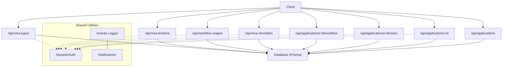
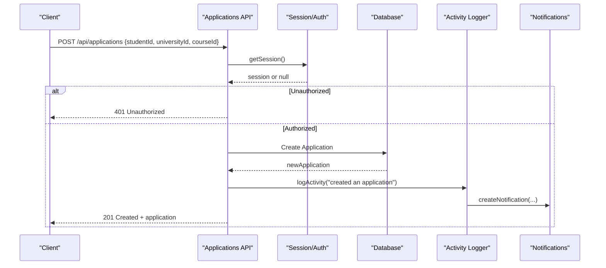
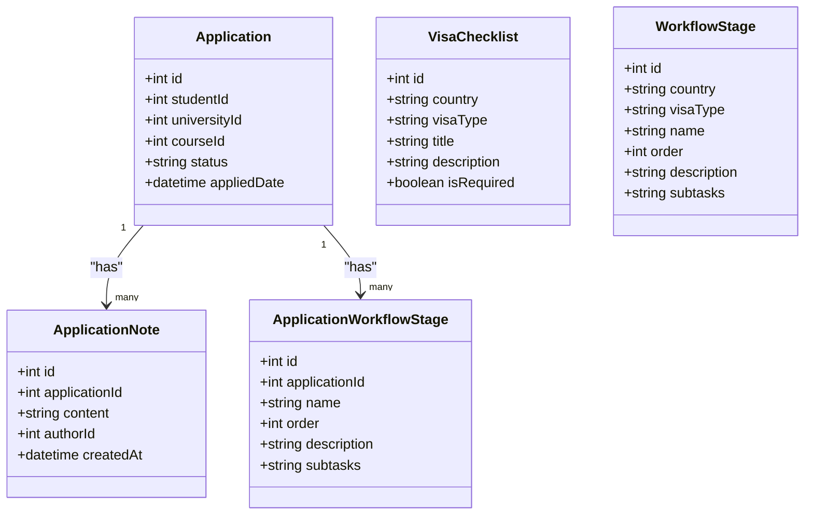

# Application Workflow API

<cite>
**Referenced Files in This Document**
- [route.ts](file://src/app/api/applications/route.ts)
- [route.ts](file://src/app/api/applications/[id]/route.ts)
- [route.ts](file://src/app/api/applications/[id]/notes/route.ts)
- [route.ts](file://src/app/api/applications/[id]/workflow/route.ts)
- [route.ts](file://src/app/api/visa-checklists/route.ts)
- [route.ts](file://src/app/api/workflow-stages/route.ts)
- [route.ts](file://src/app/api/visa-timeline/route.ts)
- [route.ts](file://src/app/api/visa-types/route.ts)
- [application-statuses.ts](file://src/lib/application-statuses.ts)
- [activity.ts](file://src/lib/activity.ts)
- [notifications.ts](file://src/lib/notifications.ts)
- [api-utils.ts](file://src/lib/api-utils.ts)
- [schema.prisma](file://prisma/schema.prisma)
</cite>

## Table of Contents
1. Introduction
2. Project Structure
3. Core Components
4. Architecture Overview
5. Detailed Component Analysis
6. Dependency Analysis
7. Performance Considerations
8. Troubleshooting Guide
9. Conclusion
10. Appendices

## Introduction
This document provides detailed API documentation for application workflow endpoints focused on student application processing and visa workflow management. It covers:
- Creating, listing, updating, and deleting applications
- Managing application notes
- Managing per-application workflow stages
- Visa checklist operations (CRUD)
- Global workflow stages by country and visa type
- Visa timeline aggregation
- Authentication requirements
- Audit logging and notifications
- State management for applications and visa processing stages
- Practical examples of lifecycle management, automation triggers, and status tracking

## Project Structure
The relevant endpoints are implemented as Next.js App Router route handlers under src/app/api. Data access is performed via Prisma against a SQLite database defined in prisma/schema.prisma. Shared utilities handle session validation, pagination, error responses, activity logging, and notifications.

**Diagram sources**
- [route.ts:1-113](file://src/app/api/applications/route.ts#L1-L113)
- [route.ts:1-118](file://src/app/api/applications/[id]/route.ts#L1-L118)
- [route.ts:1-113](file://src/app/api/applications/[id]/notes/route.ts#L1-L113)
- [route.ts:1-193](file://src/app/api/applications/[id]/workflow/route.ts#L1-L193)
- [route.ts:1-128](file://src/app/api/visa-checklists/route.ts#L1-L128)
- [route.ts:1-131](file://src/app/api/workflow-stages/route.ts#L1-L131)
- [route.ts:1-116](file://src/app/api/visa-timeline/route.ts#L1-L116)
- [route.ts:1-119](file://src/app/api/visa-types/route.ts#L1-L119)
- [api-utils.ts:13-22](file://src/lib/api-utils.ts#L13-L22)
- [activity.ts:60-113](file://src/lib/activity.ts#L60-L113)
- [notifications.ts:3-21](file://src/lib/notifications.ts#L3-L21)

**Section sources**
- [route.ts:1-113](file://src/app/api/applications/route.ts#L1-L113)
- [route.ts:1-118](file://src/app/api/applications/[id]/route.ts#L1-L118)
- [route.ts:1-113](file://src/app/api/applications/[id]/notes/route.ts#L1-L113)
- [route.ts:1-193](file://src/app/api/applications/[id]/workflow/route.ts#L1-L193)
- [route.ts:1-128](file://src/app/api/visa-checklists/route.ts#L1-L128)
- [route.ts:1-131](file://src/app/api/workflow-stages/route.ts#L1-L131)
- [route.ts:1-116](file://src/app/api/visa-timeline/route.ts#L1-L116)
- [route.ts:1-119](file://src/app/api/visa-types/route.ts#L1-L119)
- [api-utils.ts:13-22](file://src/lib/api-utils.ts#L13-L22)
- [activity.ts:60-113](file://src/lib/activity.ts#L60-L113)
- [notifications.ts:3-21](file://src/lib/notifications.ts#L3-L21)

## Core Components
- Applications CRUD with filtering and pagination
- Application notes (create, list, delete)
- Per-application workflow stages (create, read, update, delete)
- Visa checklists (CRUD)
- Global workflow stages by country and visa type (CRUD)
- Visa timeline aggregation across stages, tasks, and applications
- Visa types (list, create, update, delete)

Authentication: Most write endpoints require an authenticated session via cookie-based token verification. Some read endpoints (e.g., visa timelines) also enforce authentication.

Audit logging: All mutating endpoints log activities with actor names and change details where applicable. Notifications are automatically created for certain actions like creation or deletion.

**Section sources**
- [route.ts:1-113](file://src/app/api/applications/route.ts#L1-L113)
- [route.ts:1-118](file://src/app/api/applications/[id]/route.ts#L1-L118)
- [route.ts:1-113](file://src/app/api/applications/[id]/notes/route.ts#L1-L113)
- [route.ts:1-193](file://src/app/api/applications/[id]/workflow/route.ts#L1-L193)
- [route.ts:1-128](file://src/app/api/visa-checklists/route.ts#L1-L128)
- [route.ts:1-131](file://src/app/api/workflow-stages/route.ts#L1-L131)
- [route.ts:1-116](file://src/app/api/visa-timeline/route.ts#L1-L116)
- [route.ts:1-119](file://src/app/api/visa-types/route.ts#L1-L119)
- [activity.ts:60-113](file://src/lib/activity.ts#L60-L113)
- [notifications.ts:3-21](file://src/lib/notifications.ts#L3-L21)

## Architecture Overview
The system follows a RESTful pattern using Next.js route handlers. Each endpoint validates input, enforces authentication where required, performs database operations via Prisma, logs activities, and returns standardized JSON responses.

**Diagram sources**
- [route.ts:75-112](file://src/app/api/applications/route.ts#L75-L112)
- [api-utils.ts:13-22](file://src/lib/api-utils.ts#L13-L22)
- [activity.ts:60-113](file://src/lib/activity.ts#L60-L113)
- [notifications.ts:3-21](file://src/lib/notifications.ts#L3-L21)

## Detailed Component Analysis

### Applications API
- GET /api/applications
  - Purpose: List applications with filters and pagination
  - Query parameters: page, perPage, search, studentId, status, universityId
  - Response: Paginated list including student, university, and course details
  - Authentication: Not enforced for GET; use session if needed elsewhere
  - Example request: GET /api/applications?studentId=1&status=Submitted&page=1&perPage=20
  - Example response: { data: [...], total: number, page: number, perPage: number, totalPages: number }

- POST /api/applications
  - Purpose: Create a new application
  - Request body: { studentId: number, universityId: number, courseId: number }
  - Response: Created application object
  - Status codes: 201 Created, 400 Bad Request (missing fields), 401 Unauthorized (no session)
  - Example request: POST /api/applications { studentId: 1, universityId: 10, courseId: 5 }
  - Example response: { id, studentId, universityId, courseId, status: "Submitted", appliedDate, ... }

- GET /api/applications/:id
  - Purpose: Retrieve a single application by ID
  - Path parameter: id (number)
  - Response: Application with related student, university, and course
  - Status codes: 200 OK, 401 Unauthorized, 404 Not Found

- PATCH /api/applications/:id
  - Purpose: Update application status
  - Request body: { status: string }
  - Validation: Status must be one of configured application statuses from system settings
  - Response: Updated application
  - Status codes: 200 OK, 400 Bad Request (invalid status), 401 Unauthorized, 404 Not Found
  - Example request: PATCH /api/applications/1 { status: "Processing" }
  - Example response: { id, status: "Processing", ... }

- DELETE /api/applications/:id
  - Purpose: Delete an application
  - Path parameter: id (number)
  - Response: { success: true }
  - Status codes: 200 OK, 401 Unauthorized, 404 Not Found

State management:
- Default status when creating: "Submitted"
- Valid statuses are derived from system settings and normalized via utility functions

Audit logging:
- Creation, updates, and deletions log activities with actor name and target context

**Section sources**
- [route.ts:8-73](file://src/app/api/applications/route.ts#L8-L73)
- [route.ts:75-112](file://src/app/api/applications/route.ts#L75-L112)
- [route.ts:8-31](file://src/app/api/applications/[id]/route.ts#L8-L31)
- [route.ts:33-85](file://src/app/api/applications/[id]/route.ts#L33-L85)
- [route.ts:87-117](file://src/app/api/applications/[id]/route.ts#L87-L117)
- [application-statuses.ts:7-13](file://src/lib/application-statuses.ts#L7-L13)
- [application-statuses.ts:41-72](file://src/lib/application-statuses.ts#L41-L72)

### Application Notes API
- GET /api/applications/:id/notes
  - Purpose: List notes for an application
  - Path parameter: id (number)
  - Response: Array of notes with author details
  - Status codes: 200 OK, 401 Unauthorized, 404 Not Found

- POST /api/applications/:id/notes
  - Purpose: Add a note to an application
  - Request body: { content: string }
  - Validation: Content must be non-empty after trimming
  - Response: Created note with author
  - Status codes: 201 Created, 400 Bad Request, 401 Unauthorized, 404 Not Found
  - Example request: POST /api/applications/1/notes { content: "Documents verified" }
  - Example response: { id, applicationId, content, authorId, createdAt, author: { id, name } }

- DELETE /api/applications/:id/notes
  - Purpose: Delete a specific note
  - Request body: { noteId: number }
  - Response: { success: true }
  - Status codes: 200 OK, 400 Bad Request, 401 Unauthorized, 404 Not Found

Audit logging:
- Creation and deletion of notes are logged with actor name and target context

**Section sources**
- [route.ts:7-33](file://src/app/api/applications/[id]/notes/route.ts#L7-L33)
- [route.ts:35-78](file://src/app/api/applications/[id]/notes/route.ts#L35-L78)
- [route.ts:80-112](file://src/app/api/applications/[id]/notes/route.ts#L80-L112)

### Application Workflow Stages API
- GET /api/applications/:id/workflow
  - Purpose: List workflow stages for an application
  - Path parameter: id (number)
  - Response: Array of stages ordered by order field
  - Status codes: 200 OK, 401 Unauthorized

- POST /api/applications/:id/workflow
  - Purpose: Add a workflow stage to an application
  - Request body: { name: string, description?: string }
  - Validation: Name must be non-empty after trimming
  - Response: Created stage
  - Status codes: 201 Created, 400 Bad Request, 401 Unauthorized, 404 Not Found
  - Example request: POST /api/applications/1/workflow { name: "Document Review", description: "Verify passport and transcripts" }
  - Example response: { id, applicationId, name, description, order, createdAt, updatedAt }

- PATCH /api/applications/:id/workflow
  - Purpose: Update multiple stages at once
  - Request body: { stages: Array<{ id: number, name?: string, description?: string, order?: number, subtasks?: string }> }
  - Behavior: Updates only provided fields; uses transaction for consistency
  - Response: { success: true }
  - Status codes: 200 OK, 400 Bad Request, 401 Unauthorized, 404 Not Found

- DELETE /api/applications/:id/workflow
  - Purpose: Remove a stage and re-order remaining stages
  - Request body: { stageId: number }
  - Response: { success: true }
  - Status codes: 200 OK, 400 Bad Request, 401 Unauthorized, 404 Not Found

Audit logging:
- Creation, updates, and deletions are logged with actor name and changes where applicable

**Section sources**
- [route.ts:7-24](file://src/app/api/applications/[id]/workflow/route.ts#L7-L24)
- [route.ts:26-70](file://src/app/api/applications/[id]/workflow/route.ts#L26-L70)
- [route.ts:72-148](file://src/app/api/applications/[id]/workflow/route.ts#L72-L148)
- [route.ts:150-192](file://src/app/api/applications/[id]/workflow/route.ts#L150-L192)

### Visa Checklists API
- GET /api/visa-checklists
  - Purpose: Fetch checklists by country and visa type
  - Query parameters: country (required), visaType (required)
  - Response: Array of checklists
  - Status codes: 200 OK, 400 Bad Request (missing params), 500 Server Error

- POST /api/visa-checklists
  - Purpose: Create a checklist item
  - Request body: { country: string, visaType: string, title: string, description?: string, isRequired?: boolean }
  - Validation: Country, visaType, and title are required
  - Response: Created checklist
  - Status codes: 201 Created, 400 Bad Request, 401 Unauthorized, 500 Server Error
  - Example request: POST /api/visa-checklists { country: "USA", visaType: "F1", title: "I-20 Form", description: "Completed I-20", isRequired: true }
  - Example response: { id, country, visaType, title, description, isRequired, createdAt, updatedAt }

- PUT /api/visa-checklists
  - Purpose: Update a checklist item
  - Request body: { id: number, title: string, description?: string, isRequired?: boolean }
  - Validation: id and title are required
  - Response: Updated checklist
  - Status codes: 200 OK, 400 Bad Request, 401 Unauthorized, 500 Server Error

- DELETE /api/visa-checklists
  - Purpose: Delete a checklist item
  - Query parameter: id (number)
  - Response: { success: true }
  - Status codes: 200 OK, 400 Bad Request, 401 Unauthorized, 500 Server Error

Audit logging:
- Creation, updates, and deletions are logged with actor name and target context

**Section sources**
- [route.ts:7-27](file://src/app/api/visa-checklists/route.ts#L7-L27)
- [route.ts:29-63](file://src/app/api/visa-checklists/route.ts#L29-L63)
- [route.ts:65-98](file://src/app/api/visa-checklists/route.ts#L65-L98)
- [route.ts:100-127](file://src/app/api/visa-checklists/route.ts#L100-L127)

### Global Workflow Stages API
- GET /api/workflow-stages
  - Purpose: Fetch global workflow stages by country and visa type
  - Query parameters: country (required), visaType (required)
  - Response: Array of stages ordered by order
  - Status codes: 200 OK, 400 Bad Request (missing params), 500 Server Error

- POST /api/workflow-stages
  - Purpose: Create a global workflow stage
  - Request body: { country: string, visaType: string, name: string, order?: number, description?: string, subtasks?: any[] }
  - Validation: country, visaType, and name are required
  - Response: Created stage
  - Status codes: 201 Created, 400 Bad Request, 401 Unauthorized, 500 Server Error
  - Example request: POST /api/workflow-stages { country: "UK", visaType: "Student", name: "Biometrics", order: 1, description: "Attend biometric appointment", subtasks: [] }
  - Example response: { id, country, visaType, name, order, description, subtasks, createdAt, updatedAt }

- PATCH /api/workflow-stages
  - Purpose: Update a global workflow stage
  - Request body: { id: number, name?: string, description?: string, subtasks?: any[] }
  - Validation: id is required
  - Response: Updated stage
  - Status codes: 200 OK, 400 Bad Request, 401 Unauthorized, 500 Server Error

- DELETE /api/workflow-stages
  - Purpose: Delete a global workflow stage
  - Query parameter: id (number)
  - Response: { success: true }
  - Status codes: 200 OK, 400 Bad Request, 401 Unauthorized, 500 Server Error

Audit logging:
- Creation, updates, and deletions are logged with actor name and changes where applicable

**Section sources**
- [route.ts:8-28](file://src/app/api/workflow-stages/route.ts#L8-L28)
- [route.ts:30-65](file://src/app/api/workflow-stages/route.ts#L30-L65)
- [route.ts:67-101](file://src/app/api/workflow-stages/route.ts#L67-L101)
- [route.ts:103-130](file://src/app/api/workflow-stages/route.ts#L103-L130)

### Visa Timeline API
- GET /api/visa-timeline
  - Purpose: Aggregate visa-related stages, tasks, and applications into a timeline view
  - Query parameters: studentId (optional), country (optional), visaType (optional)
  - Response: { stages: [...], visaTasks: [...], applications: [...], summary: { totalStages, completedStages, overallProgress } }
  - Status codes: 200 OK, 401 Unauthorized, 500 Server Error
  - Example request: GET /api/visa-timeline?country=USA&visaType=F1
  - Example response:
    - stages: array of stage objects with tasks, progress, isActive
    - visaTasks: array of task objects filtered by country and visaType
    - applications: array of applications linked to the student or matching criteria
    - summary: counts and overall progress percentage

**Section sources**
- [route.ts:6-115](file://src/app/api/visa-timeline/route.ts#L6-L115)

### Visa Types API
- GET /api/visa-types
  - Purpose: List all visa types
  - Response: Array of visa types
  - Status codes: 200 OK, 500 Server Error

- POST /api/visa-types
  - Purpose: Create a visa type
  - Request body: { label: string, description?: string }
  - Validation: label is required and must be unique
  - Response: Created visa type
  - Status codes: 201 Created, 400 Bad Request, 401 Unauthorized, 500 Server Error
  - Example request: POST /api/visa-types { label: "F1", description: "Student visa" }
  - Example response: { id, label, description, createdAt }

- PATCH /api/visa-types
  - Purpose: Update a visa type
  - Request body: { id: number, label: string, description?: string }
  - Validation: id and label are required
  - Response: Updated visa type
  - Status codes: 200 OK, 400 Bad Request, 401 Unauthorized, 500 Server Error

- DELETE /api/visa-types
  - Purpose: Delete a visa type
  - Query parameter: id (number)
  - Response: { success: true }
  - Status codes: 200 OK, 400 Bad Request, 401 Unauthorized, 500 Server Error

Audit logging:
- Creation, updates, and deletions are logged with actor name and target context

**Section sources**
- [route.ts:7-17](file://src/app/api/visa-types/route.ts#L7-L17)
- [route.ts:19-55](file://src/app/api/visa-types/route.ts#L19-L55)
- [route.ts:57-84](file://src/app/api/visa-types/route.ts#L57-L84)
- [route.ts:86-118](file://src/app/api/visa-types/route.ts#L86-L118)

## Dependency Analysis
- Session authentication is handled centrally via api-utils.getSession which reads cookies and verifies tokens.
- Activity logging and notifications are shared across endpoints to ensure consistent audit trails and user feedback.
- Application statuses are validated against configured values from system settings, ensuring compliance with organizational workflows.
- Database schema defines relationships between applications, students, universities, courses, notes, workflow stages, and visa-related entities.

**Diagram sources**
- [schema.prisma:411-454](file://prisma/schema.prisma#L411-L454)
- [schema.prisma:608-629](file://prisma/schema.prisma#L608-L629)

**Section sources**
- [api-utils.ts:13-22](file://src/lib/api-utils.ts#L13-L22)
- [activity.ts:60-113](file://src/lib/activity.ts#L60-L113)
- [application-statuses.ts:41-72](file://src/lib/application-statuses.ts#L41-L72)
- [schema.prisma:411-454](file://prisma/schema.prisma#L411-L454)
- [schema.prisma:608-629](file://prisma/schema.prisma#L608-L629)

## Performance Considerations
- Pagination: Use page and perPage query parameters to limit result sets and reduce payload size.
- Filtering: Apply studentId, status, and universityId filters to narrow queries before pagination.
- Transactions: Bulk updates to workflow stages use transactions to maintain consistency and reduce lock contention.
- Indexing: Database indexes exist on common foreign keys (studentId, universityId, courseId) to optimize lookups.
- Aggregation: Visa timeline aggregates multiple queries; consider caching results for repeated requests with identical parameters.

[No sources needed since this section provides general guidance]

## Troubleshooting Guide
Common issues and resolutions:
- Unauthorized errors: Ensure a valid auth_token cookie is present and not expired. Re-authenticate if necessary.
- Invalid status: When updating application status, verify that the status matches configured values from system settings.
- Missing required fields: Validate request payloads for required fields such as studentId, universityId, courseId, status, and note content.
- Not found errors: Confirm that IDs passed in paths or bodies correspond to existing records.
- Server errors: Check server logs for database connectivity or constraint violations.

Audit and compliance:
- All mutations log activities with actor names and change details. Review activity logs for compliance audits.
- Notifications are created automatically for certain actions; verify notification delivery channels and preferences.

**Section sources**
- [api-utils.ts:13-22](file://src/lib/api-utils.ts#L13-L22)
- [route.ts:33-85](file://src/app/api/applications/[id]/route.ts#L33-L85)
- [route.ts:35-78](file://src/app/api/applications/[id]/notes/route.ts#L35-L78)
- [activity.ts:60-113](file://src/lib/activity.ts#L60-L113)
- [notifications.ts:3-21](file://src/lib/notifications.ts#L3-L21)

## Conclusion
The Application Workflow API provides a comprehensive set of endpoints to manage student applications, notes, workflow stages, and visa-related processes. It enforces authentication, validates inputs, maintains state through configurable statuses, and ensures auditability via activity logging and notifications. The visa timeline offers aggregated insights across stages, tasks, and applications, supporting operational visibility and decision-making.

[No sources needed since this section summarizes without analyzing specific files]

## Appendices

### Authentication Requirements
- Cookie-based session token: auth_token
- Verification function: verifyAuth(token)
- Unauthenticated requests to protected endpoints return 401 Unauthorized

**Section sources**
- [api-utils.ts:13-22](file://src/lib/api-utils.ts#L13-L22)

### Application Status Management
- Default statuses: Pending, Submitted, Processing, Rejected, Approved
- Configurable via system settings; validated on update
- Stage sequence derived from configured statuses for UI rendering

**Section sources**
- [application-statuses.ts:7-13](file://src/lib/application-statuses.ts#L7-L13)
- [application-statuses.ts:41-72](file://src/lib/application-statuses.ts#L41-L72)
- [application-statuses.ts:91-101](file://src/lib/application-statuses.ts#L91-L101)

### Practical Examples

- Create an application
  - Method: POST
  - URL: /api/applications
  - Body: { studentId: 1, universityId: 10, courseId: 5 }
  - Response: 201 Created with application object

- Update application status
  - Method: PATCH
  - URL: /api/applications/1
  - Body: { status: "Processing" }
  - Response: 200 OK with updated application

- Add a note
  - Method: POST
  - URL: /api/applications/1/notes
  - Body: { content: "Passport verified" }
  - Response: 201 Created with note object

- Add a workflow stage
  - Method: POST
  - URL: /api/applications/1/workflow
  - Body: { name: "Interview Scheduled", description: "Conduct interview" }
  - Response: 201 Created with stage object

- Create a visa checklist item
  - Method: POST
  - URL: /api/visa-checklists
  - Body: { country: "USA", visaType: "F1", title: "Visa Interview Prep", isRequired: true }
  - Response: 201 Created with checklist object

- Fetch global workflow stages
  - Method: GET
  - URL: /api/workflow-stages?country=UK&visaType=Student
  - Response: 200 OK with stages array

- Get visa timeline
  - Method: GET
  - URL: /api/visa-timeline?country=USA&visaType=F1
  - Response: 200 OK with stages, tasks, applications, and summary

[No sources needed since this section provides practical examples without analyzing specific files]