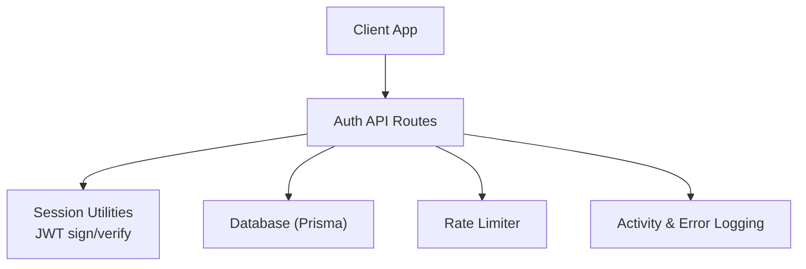
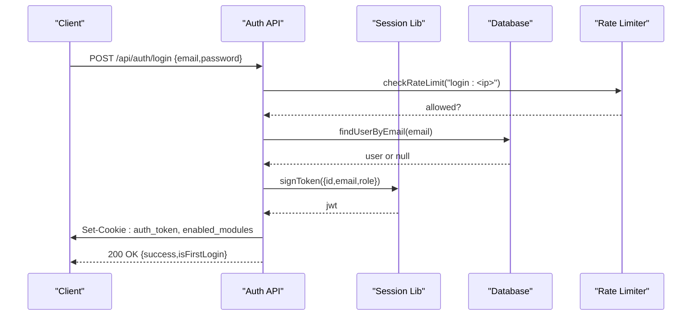
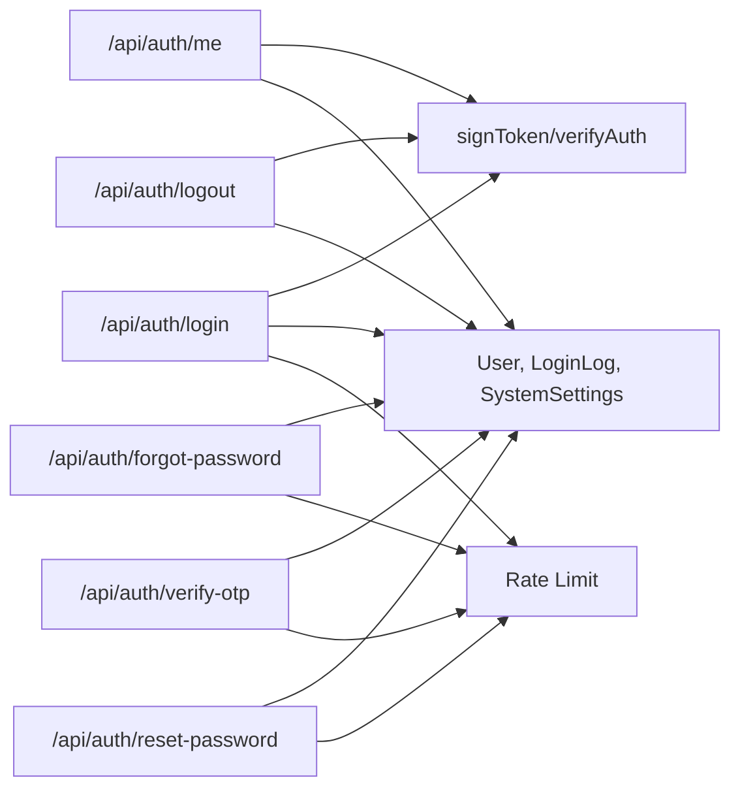
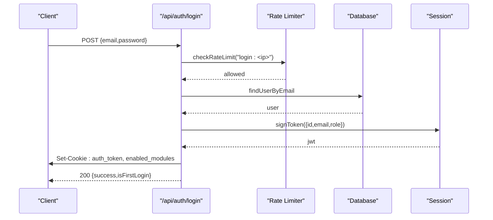
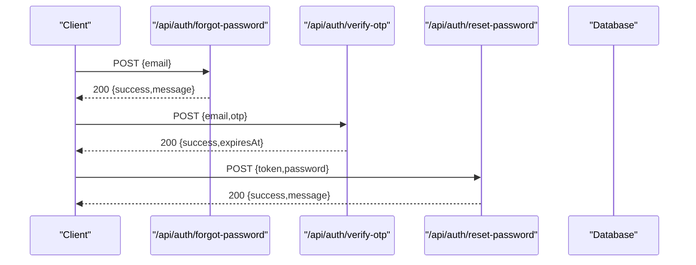
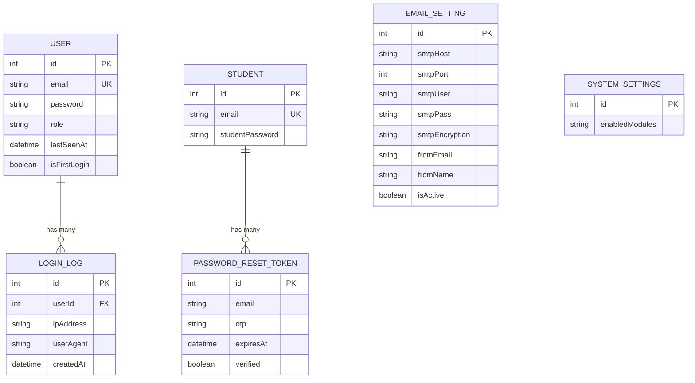

# Authentication API

<cite>
**Referenced Files in This Document**
- [route.ts](file://src/app/api/auth/login/route.ts)
- [route.ts](file://src/app/api/auth/logout/route.ts)
- [route.ts](file://src/app/api/auth/me/route.ts)
- [route.ts](file://src/app/api/auth/forgot-password/route.ts)
- [route.ts](file://src/app/api/auth/reset-password/route.ts)
- [route.ts](file://src/app/api/auth/verify-otp/route.ts)
- [session.ts](file://src/lib/session.ts)
- [rate-limit.ts](file://src/lib/rate-limit.ts)
- [schema.prisma](file://prisma/schema.prisma)
</cite>

## Table of Contents
1. Introduction
2. Project Structure
3. Core Components
4. Architecture Overview
5. Detailed Component Analysis
6. Dependency Analysis
7. Performance Considerations
8. Troubleshooting Guide
9. Conclusion

## Introduction
This document provides comprehensive API documentation for UniTrack’s authentication endpoints focused on user authentication and session management. It covers login, logout, current user profile retrieval, password reset flow (forgot password, OTP verification, and reset), and explains JWT token handling, session cookies, rate limiting, and security considerations. Each endpoint includes HTTP methods, URL patterns, request/response schemas, authentication requirements, error handling, and practical examples.

## Project Structure
Authentication is implemented as Next.js Route Handlers under src/app/api/auth with supporting utilities in src/lib:
- Login, logout, me, forgot-password, verify-otp, reset-password route handlers
- Session utilities for signing and verifying JWTs
- Rate limiting middleware using database-backed logs with in-memory fallback
- Prisma schema defining User, Student, PasswordResetToken, LoginLog, EmailSetting, SystemSettings

**Diagram sources**
- [route.ts:19-122](file://src/app/api/auth/login/route.ts#L19-L122)
- [route.ts:7-35](file://src/app/api/auth/logout/route.ts#L7-L35)
- [route.ts:7-68](file://src/app/api/auth/me/route.ts#L7-L68)
- [route.ts:7-93](file://src/app/api/auth/forgot-password/route.ts#L7-L93)
- [route.ts:6-63](file://src/app/api/auth/verify-otp/route.ts#L6-L63)
- [route.ts:6-63](file://src/app/api/auth/reset-password/route.ts#L6-L63)
- [session.ts:19-36](file://src/lib/session.ts#L19-L36)
- [rate-limit.ts:29-100](file://src/lib/rate-limit.ts#L29-L100)

**Section sources**
- [route.ts:19-122](file://src/app/api/auth/login/route.ts#L19-L122)
- [route.ts:7-35](file://src/app/api/auth/logout/route.ts#L7-L35)
- [route.ts:7-68](file://src/app/api/auth/me/route.ts#L7-L68)
- [route.ts:7-93](file://src/app/api/auth/forgot-password/route.ts#L7-L93)
- [route.ts:6-63](file://src/app/api/auth/verify-otp/route.ts#L6-L63)
- [route.ts:6-63](file://src/app/api/auth/reset-password/route.ts#L6-L63)
- [session.ts:19-36](file://src/lib/session.ts#L19-L36)
- [rate-limit.ts:29-100](file://src/lib/rate-limit.ts#L29-L100)

## Core Components
- JWT-based sessions: Tokens are signed with HS256 and stored in httpOnly cookies. Tokens expire after a fixed duration.
- Cookie-based auth: The auth_token cookie carries the JWT; enabled_modules cookie indicates feature flags.
- Rate limiting: Per-IP limits protect login, forgot-password, verify-otp, and reset-password endpoints.
- Audit logging: Login and logout actions are recorded in activity logs and login logs.
- Password reset flow: OTP generation via email, OTP verification, then secure password reset.

Security highlights:
- Tokens are set with httpOnly, secure (in production), and strict sameSite.
- Brute-force protection via rate limiting on sensitive endpoints.
- No email enumeration on forgot-password; always returns success even if email not found.

**Section sources**
- [session.ts:19-36](file://src/lib/session.ts#L19-L36)
- [route.ts:54-68](file://src/app/api/auth/login/route.ts#L54-L68)
- [route.ts:10-30](file://src/app/api/auth/logout/route.ts#L10-L30)
- [rate-limit.ts:43-100](file://src/lib/rate-limit.ts#L43-L100)
- [route.ts:23-31](file://src/app/api/auth/forgot-password/route.ts#L23-L31)

## Architecture Overview
The authentication system uses stateless JWTs validated server-side and persisted in httpOnly cookies. Protected routes read the cookie, verify the token, and return user data or perform actions. Sensitive operations are protected by per-IP rate limiting.

**Diagram sources**
- [route.ts:19-122](file://src/app/api/auth/login/route.ts#L19-L122)
- [session.ts:28-36](file://src/lib/session.ts#L28-L36)
- [rate-limit.ts:43-100](file://src/lib/rate-limit.ts#L43-L100)

## Detailed Component Analysis

### Login
- Method: POST
- URL: /api/auth/login
- Authentication: None
- Request body:
  - email: string (valid email format)
  - password: string (non-empty)
- Response:
  - 200 OK: { success: boolean, isFirstLogin: boolean }
  - 400 Bad Request: { error: string } (validation failure)
  - 401 Unauthorized: { error: string } (invalid credentials)
  - 429 Too Many Requests: { error: string } (rate limited)
  - 500 Internal Server Error: { error: string }
- Behavior:
  - Validates input via schema
  - Checks rate limit per IP
  - Verifies user exists and password matches
  - Signs JWT and sets httpOnly cookies (auth_token, enabled_modules)
  - Updates last login timestamp and last seen time
  - Creates login log and activity log entry
  - Sets enabled modules cookie from system settings

Example request:
- POST /api/auth/login
- Body: { "email": "user@example.com", "password": "yourpassword" }

Example response (200):
- { "success": true, "isFirstLogin": false }

**Section sources**
- [route.ts:14-17](file://src/app/api/auth/login/route.ts#L14-L17)
- [route.ts:19-122](file://src/app/api/auth/login/route.ts#L19-L122)
- [session.ts:28-36](file://src/lib/session.ts#L28-L36)
- [rate-limit.ts:43-100](file://src/lib/rate-limit.ts#L43-L100)

### Logout
- Method: POST
- URL: /api/auth/logout
- Authentication: Requires valid auth_token cookie
- Response:
  - 200 OK: { success: boolean }
  - 401 Unauthorized: { error: string } (invalid or missing session)
  - 500 Internal Server Error: { error: string }
- Behavior:
  - Reads auth_token from cookies
  - Attempts to verify token and log activity (gracefully ignores invalid tokens)
  - Deletes auth_token and enabled_modules cookies

Example request:
- POST /api/auth/logout

Example response (200):
- { "success": true }

**Section sources**
- [route.ts:7-35](file://src/app/api/auth/logout/route.ts#L7-L35)
- [session.ts:19-26](file://src/lib/session.ts#L19-L26)

### Current User Profile (Me)
- Method: GET
- URL: /api/auth/me
- Authentication: Requires valid auth_token cookie
- Response:
  - 200 OK: User object (fields include id, name, email, role, avatar, subscriptionPackage, subscriptionExpiry, isFirstLogin; student fallback may differ)
  - 401 Unauthorized: { error: string } (missing or invalid token)
  - 404 Not Found: { error: string } (user not found)
  - 500 Internal Server Error: { error: string }
- Behavior:
  - Reads and verifies auth_token
  - Fetches user by ID; falls back to student lookup if needed
  - Returns normalized enabled modules via cookie

Example request:
- GET /api/auth/me

Example response (200):
- { "id": 1, "name": "Jane Doe", "email": "jane@example.com", "role": "Admin", ... }

**Section sources**
- [route.ts:7-68](file://src/app/api/auth/me/route.ts#L7-L68)
- [session.ts:19-26](file://src/lib/session.ts#L19-L26)

### Forgot Password
- Method: POST
- URL: /api/auth/forgot-password
- Authentication: None
- Request body:
  - email: string
- Response:
  - 200 OK: { success: boolean, message: string }
  - 400 Bad Request: { error: string } (missing email)
  - 429 Too Many Requests: { error: string } (rate limited)
  - 500 Internal Server Error: { error: string }
- Behavior:
  - Rate-limits per IP
  - Looks up student by email
  - Always returns success to prevent enumeration
  - Generates 6-digit OTP, stores with expiry (10 minutes)
  - Sends email via configured SMTP settings (if available)

Example request:
- POST /api/auth/forgot-password
- Body: { "email": "student@example.com" }

Example response (200):
- { "success": true, "message": "If an account with that email exists, an OTP has been sent." }

**Section sources**
- [route.ts:7-93](file://src/app/api/auth/forgot-password/route.ts#L7-L93)
- [schema.prisma:218-225](file://prisma/schema.prisma#L218-L225)
- [schema.prisma:261-276](file://prisma/schema.prisma#L261-L276)

### Verify OTP
- Method: POST
- URL: /api/auth/verify-otp
- Authentication: None
- Request body:
  - email: string
  - otp: string
- Response:
  - 200 OK: { success: boolean, expiresAt: datetime }
  - 400 Bad Request: { error: string } (missing fields, no pending request, expired OTP, invalid OTP)
  - 429 Too Many Requests: { error: string } (rate limited)
  - 500 Internal Server Error: { error: string }
- Behavior:
  - Rate-limits per IP
  - Finds latest unverified OTP record for email
  - Validates expiry and OTP value
  - Marks OTP as verified and creates a new reset token record (expires in 15 minutes)
  - Returns the reset token expiry for client use

Example request:
- POST /api/auth/verify-otp
- Body: { "email": "student@example.com", "otp": "123456" }

Example response (200):
- { "success": true, "expiresAt": "2025-01-01T12:15:00Z" }

**Section sources**
- [route.ts:6-63](file://src/app/api/auth/verify-otp/route.ts#L6-L63)
- [schema.prisma:218-225](file://prisma/schema.prisma#L218-L225)

### Reset Password
- Method: POST
- URL: /api/auth/reset-password
- Authentication: None
- Request body:
  - token: string (the reset token created after OTP verification)
  - password: string (minimum length enforced)
- Response:
  - 200 OK: { success: boolean, message: string }
  - 400 Bad Request: { error: string } (missing fields, weak password, invalid/expired token)
  - 429 Too Many Requests: { error: string } (rate limited)
  - 500 Internal Server Error: { error: string }
- Behavior:
  - Rate-limits per IP
  - Validates token existence and expiry
  - Hashes and updates student password
  - Cleans up all reset tokens for the email

Example request:
- POST /api/auth/reset-password
- Body: { "token": "reset-token-here", "password": "newsecurepass" }

Example response (200):
- { "success": true, "message": "Password reset successfully. You can now log in." }

**Section sources**
- [route.ts:6-63](file://src/app/api/auth/reset-password/route.ts#L6-L63)
- [schema.prisma:218-225](file://prisma/schema.prisma#L218-L225)

### Token Refresh
- Status: Not implemented in this codebase.
- Notes: There is no dedicated refresh endpoint. Sessions rely on a single JWT with a fixed expiration stored in an httpOnly cookie. Clients should re-authenticate (login) when the token expires.

[No sources needed since this section summarizes absence of functionality]

## Dependency Analysis
Authentication endpoints depend on:
- Session utilities for JWT signing and verification
- Database models for users/students, password reset tokens, login logs, email settings, system settings
- Rate limiter for brute-force protection
- Activity logger for audit trails

**Diagram sources**
- [route.ts:19-122](file://src/app/api/auth/login/route.ts#L19-L122)
- [route.ts:7-68](file://src/app/api/auth/me/route.ts#L7-L68)
- [route.ts:7-35](file://src/app/api/auth/logout/route.ts#L7-L35)
- [route.ts:7-93](file://src/app/api/auth/forgot-password/route.ts#L7-L93)
- [route.ts:6-63](file://src/app/api/auth/verify-otp/route.ts#L6-L63)
- [route.ts:6-63](file://src/app/api/auth/reset-password/route.ts#L6-L63)
- [session.ts:19-36](file://src/lib/session.ts#L19-L36)
- [rate-limit.ts:43-100](file://src/lib/rate-limit.ts#L43-L100)

**Section sources**
- [session.ts:19-36](file://src/lib/session.ts#L19-L36)
- [rate-limit.ts:43-100](file://src/lib/rate-limit.ts#L43-L100)
- [schema.prisma:139-198](file://prisma/schema.prisma#L139-L198)
- [schema.prisma:200-225](file://prisma/schema.prisma#L200-L225)
- [schema.prisma:227-241](file://prisma/schema.prisma#L227-L241)
- [schema.prisma:261-276](file://prisma/schema.prisma#L261-L276)

## Performance Considerations
- Rate limiting uses a database-backed log table with periodic cleanup and an in-memory fallback to avoid blocking when the database is unavailable.
- JWT verification is lightweight and stateless; no server-side session store is required.
- Cookies are set once per login and reused until expiration, minimizing overhead on subsequent requests.
- For high-scale deployments, consider migrating rate limiting to Redis for distributed instances.

[No sources needed since this section provides general guidance]

## Troubleshooting Guide
Common issues and resolutions:
- Invalid or expired token: Ensure the auth_token cookie is present and not expired. Re-login if necessary.
- Rate limited: Wait for the window to reset; the endpoint will return 429 with a descriptive message.
- Forgot password email not received: Check SMTP configuration in email settings; failures are logged but do not block success responses.
- OTP expired: Request a new OTP; each OTP has a short lifetime.
- Reset token invalid/expired: Use the token returned by verify-otp within its validity window.

Error response patterns:
- 400 Bad Request: Validation errors or invalid inputs
- 401 Unauthorized: Missing or invalid session/token
- 404 Not Found: Resource not found (e.g., user)
- 429 Too Many Requests: Rate limit exceeded
- 500 Internal Server Error: Unexpected server errors

**Section sources**
- [route.ts:19-122](file://src/app/api/auth/login/route.ts#L19-L122)
- [route.ts:7-35](file://src/app/api/auth/logout/route.ts#L7-L35)
- [route.ts:7-68](file://src/app/api/auth/me/route.ts#L7-L68)
- [route.ts:7-93](file://src/app/api/auth/forgot-password/route.ts#L7-L93)
- [route.ts:6-63](file://src/app/api/auth/verify-otp/route.ts#L6-L63)
- [route.ts:6-63](file://src/app/api/auth/reset-password/route.ts#L6-L63)

## Security Considerations and Best Practices
- Use HTTPS in production to ensure secure cookie transmission.
- Keep JWT_SECRET environment variable secure and rotated periodically.
- Enforce strong passwords and minimum length on reset.
- Rate limiting protects against brute force and credential stuffing.
- Avoid information leakage: forgot-password always returns success regardless of email existence.
- Logins and logouts are audited for accountability.

[No sources needed since this section provides general guidance]

## Practical Authentication Flows

### Login Flow

**Diagram sources**
- [route.ts:19-122](file://src/app/api/auth/login/route.ts#L19-L122)
- [session.ts:28-36](file://src/lib/session.ts#L28-L36)
- [rate-limit.ts:43-100](file://src/lib/rate-limit.ts#L43-L100)

### Password Reset Flow

**Diagram sources**
- [route.ts:7-93](file://src/app/api/auth/forgot-password/route.ts#L7-L93)
- [route.ts:6-63](file://src/app/api/auth/verify-otp/route.ts#L6-L63)
- [route.ts:6-63](file://src/app/api/auth/reset-password/route.ts#L6-L63)

## Data Models Relevant to Authentication

**Diagram sources**
- [schema.prisma:139-198](file://prisma/schema.prisma#L139-L198)
- [schema.prisma:200-225](file://prisma/schema.prisma#L200-L225)
- [schema.prisma:261-276](file://prisma/schema.prisma#L261-L276)
- [schema.prisma:227-241](file://prisma/schema.prisma#L227-L241)

## Conclusion
UniTrack’s authentication system provides a robust, secure, and scalable foundation using JWTs and httpOnly cookies, complemented by rate limiting and comprehensive audit logging. The password reset flow ensures safe recovery with OTP verification and short-lived tokens. While there is no token refresh endpoint, clients can manage sessions by re-authenticating upon token expiration. Follow the documented endpoints, adhere to security best practices, and leverage rate limiting to protect sensitive operations.