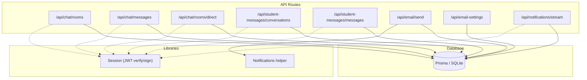
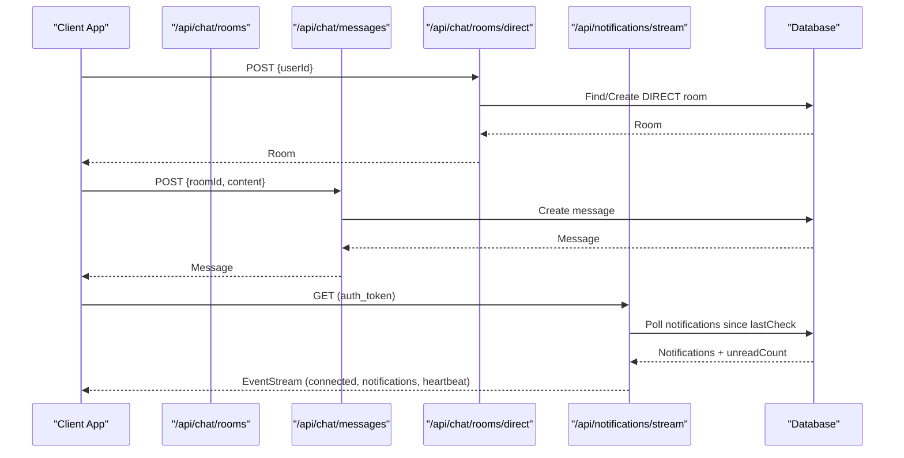
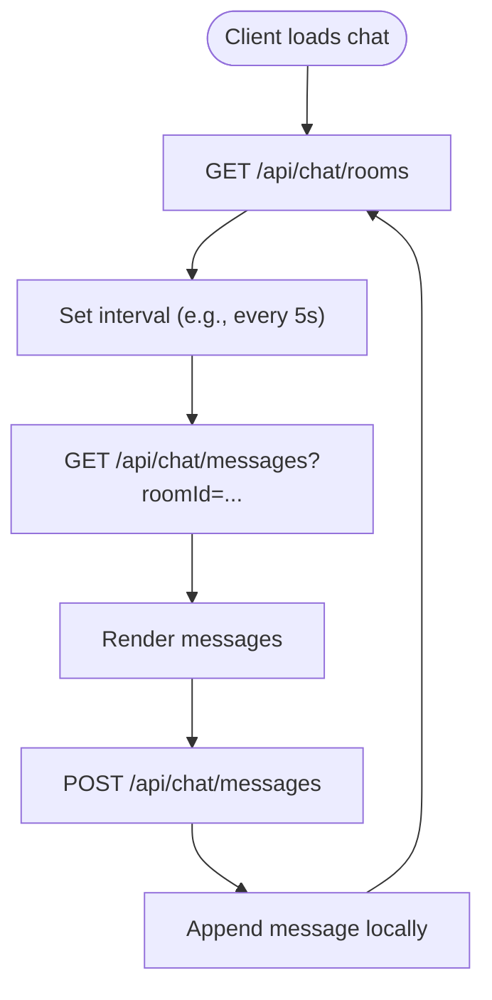
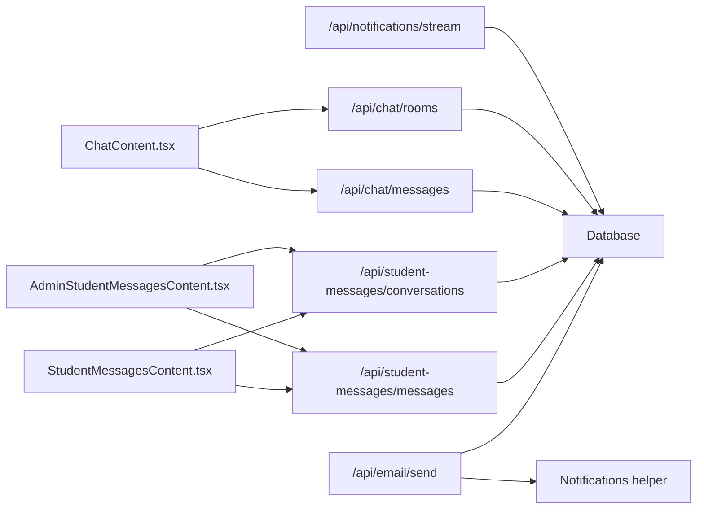

# Communication API

<cite>
**Referenced Files in This Document**
- [route.ts](file://src/app/api/chat/rooms/route.ts)
- [route.ts](file://src/app/api/chat/messages/route.ts)
- [route.ts](file://src/app/api/chat/rooms/direct/route.ts)
- [route.ts](file://src/app/api/student-messages/conversations/route.ts)
- [route.ts](file://src/app/api/student-messages/messages/route.ts)
- [route.ts](file://src/app/api/email/send/route.ts)
- [route.ts](file://src/app/api/email-settings/route.ts)
- [route.ts](file://src/app/api/notifications/stream/route.ts)
- [session.ts](file://src/lib/session.ts)
- [notifications.ts](file://src/lib/notifications.ts)
- [schema.prisma](file://prisma/schema.prisma)
- [ChatContent.tsx](file://src/app/chat/components/ChatContent.tsx)
- [AdminStudentMessagesContent.tsx](file://src/app/student-messages/components/AdminStudentMessagesContent.tsx)
- [StudentMessagesContent.tsx](file://src/app/student-portal/messages/components/StudentMessagesContent.tsx)
</cite>

## Table of Contents
1. Introduction
2. Project Structure
3. Core Components
4. Architecture Overview
5. Detailed Component Analysis
6. Dependency Analysis
7. Performance Considerations
8. Troubleshooting Guide
9. Conclusion
10. Appendices

## Introduction
This document provides detailed API documentation for communication endpoints that power real-time messaging, chat functionality, and email notifications. It covers:
- Chat room management (group and direct rooms)
- Message sending and receiving
- Conversation tracking for student-staff messaging
- Email delivery services and settings
- Real-time notification streaming via Server-Sent Events (SSE)
- Authentication using JWT tokens
- Data models and persistence
- Practical usage examples and best practices

Note: The current implementation uses HTTP polling for chat updates and SSE for notifications rather than WebSockets.

## Project Structure
Communication features are implemented as Next.js Route Handlers under src/app/api with supporting libraries for authentication and notifications. Frontend components demonstrate how to consume these APIs.

**Diagram sources**
- [route.ts](file://src/app/api/chat/rooms/route.ts)
- [route.ts](file://src/app/api/chat/messages/route.ts)
- [route.ts](file://src/app/api/chat/rooms/direct/route.ts)
- [route.ts](file://src/app/api/student-messages/conversations/route.ts)
- [route.ts](file://src/app/api/student-messages/messages/route.ts)
- [route.ts](file://src/app/api/email/send/route.ts)
- [route.ts](file://src/app/api/email-settings/route.ts)
- [route.ts](file://src/app/api/notifications/stream/route.ts)
- [session.ts](file://src/lib/session.ts)
- [notifications.ts](file://src/lib/notifications.ts)
- [schema.prisma](file://prisma/schema.prisma)

**Section sources**
- [route.ts](file://src/app/api/chat/rooms/route.ts)
- [route.ts](file://src/app/api/chat/messages/route.ts)
- [route.ts](file://src/app/api/chat/rooms/direct/route.ts)
- [route.ts](file://src/app/api/student-messages/conversations/route.ts)
- [route.ts](file://src/app/api/student-messages/messages/route.ts)
- [route.ts](file://src/app/api/email/send/route.ts)
- [route.ts](file://src/app/api/email-settings/route.ts)
- [route.ts](file://src/app/api/notifications/stream/route.ts)
- [session.ts](file://src/lib/session.ts)
- [notifications.ts](file://src/lib/notifications.ts)
- [schema.prisma](file://prisma/schema.prisma)

## Core Components
- Authentication: All chat and notification endpoints validate a JWT token stored in the auth_token cookie.
- Chat Rooms: Create/list group rooms; create or reuse direct one-to-one rooms.
- Messages: Persist messages per room or conversation; retrieve ordered by time.
- Student-Staff Messaging: Dedicated conversations between students and staff with message history.
- Email Delivery: Send emails using configured SMTP settings; log activity and create notifications.
- Notifications Stream: SSE endpoint pushes new notifications and unread counts to clients.

**Section sources**
- [session.ts](file://src/lib/session.ts)
- [route.ts](file://src/app/api/chat/rooms/route.ts)
- [route.ts](file://src/app/api/chat/messages/route.ts)
- [route.ts](file://src/app/api/chat/rooms/direct/route.ts)
- [route.ts](file://src/app/api/student-messages/conversations/route.ts)
- [route.ts](file://src/app/api/student-messages/messages/route.ts)
- [route.ts](file://src/app/api/email/send/route.ts)
- [route.ts](file://src/app/api/notifications/stream/route.ts)

## Architecture Overview
The system combines REST endpoints for data operations with an SSE stream for live notifications. Chat UIs poll endpoints periodically to simulate real-time behavior.

**Diagram sources**
- [route.ts](file://src/app/api/chat/rooms/direct/route.ts)
- [route.ts](file://src/app/api/chat/messages/route.ts)
- [route.ts](file://src/app/api/notifications/stream/route.ts)
- [schema.prisma](file://prisma/schema.prisma)

## Detailed Component Analysis

### Authentication
- Mechanism: JWT verification using HS256 with a secret from environment variables.
- Usage: Endpoints read the auth_token cookie and call the session verifier.
- Token lifecycle: Tokens are signed with expiration; expired tokens result in unauthorized responses.

**Section sources**
- [session.ts](file://src/lib/session.ts)
- [route.ts](file://src/app/api/chat/rooms/route.ts)
- [route.ts](file://src/app/api/chat/messages/route.ts)
- [route.ts](file://src/app/api/chat/rooms/direct/route.ts)
- [route.ts](file://src/app/api/notifications/stream/route.ts)

### Chat Rooms API
- List rooms
  - Method: GET
  - URL: /api/chat/rooms
  - Auth: Required (JWT in auth_token cookie)
  - Response: Array of rooms with members and latest message preview
- Create room
  - Method: POST
  - URL: /api/chat/rooms
  - Auth: Required
  - Request body: name, type (default DIRECT), memberIds (optional)
  - Response: Created room with members and messages

**Section sources**
- [route.ts](file://src/app/api/chat/rooms/route.ts)

### Direct Chat API
- Start or find direct chat
  - Method: POST
  - URL: /api/chat/rooms/direct
  - Auth: Required
  - Request body: userId
  - Behavior: Finds existing DIRECT room between current user and target; creates if none exists
  - Response: Room with members and latest message

**Section sources**
- [route.ts](file://src/app/api/chat/rooms/direct/route.ts)

### Messages API
- Get messages
  - Method: GET
  - URL: /api/chat/messages?roomId={id}
  - Auth: Required
  - Response: Ordered messages with sender details
- Send message
  - Method: POST
  - URL: /api/chat/messages
  - Auth: Required
  - Request body: roomId, content
  - Response: Created message with sender details

**Section sources**
- [route.ts](file://src/app/api/chat/messages/route.ts)

### Student-Staff Conversations API
- List conversations
  - Method: GET
  - URL: /api/student-messages/conversations
  - Auth: Required
  - Response: Conversations with student/staff info and latest message
- Create conversation
  - Method: POST
  - URL: /api/student-messages/conversations
  - Auth: Required
  - Request body: studentId, subject (optional)
  - Behavior: Returns existing conversation if present; otherwise creates new
  - Response: Conversation object
- Get messages
  - Method: GET
  - URL: /api/student-messages/messages?conversationId={id}
  - Auth: Required
  - Response: Ordered messages for the conversation
- Send message
  - Method: POST
  - URL: /api/student-messages/messages
  - Auth: Required
  - Request body: conversationId, content
  - Behavior: Creates message and updates conversation metadata (lastMessage, lastMessageAt, updatedAt)
  - Response: Created message

**Section sources**
- [route.ts](file://src/app/api/student-messages/conversations/route.ts)
- [route.ts](file://src/app/api/student-messages/messages/route.ts)

### Email Delivery API
- Send email
  - Method: POST
  - URL: /api/email/send
  - Auth: Required (Admin/Super Admin/Staff roles)
  - Request body: to, subject, body (HTML), studentId (optional)
  - Behavior: Uses active EmailSetting to send via SMTP; logs activity; creates success notification; updates student lastActivity
  - Response: Success payload
- Check email configuration
  - Method: GET
  - URL: /api/email/send
  - Auth: Required
  - Response: configured flag, fromEmail, fromName, host
- Update email settings
  - Method: POST
  - URL: /api/email-settings
  - Auth: Required (Admin/Super Admin)
  - Request body: smtpHost, smtpPort, smtpUser, smtpPass, smtpEncryption, fromEmail, fromName
  - Behavior: Creates or updates active EmailSetting; logs activity

**Section sources**
- [route.ts](file://src/app/api/email/send/route.ts)
- [route.ts](file://src/app/api/email-settings/route.ts)

### Notifications Stream (SSE)
- Connect to stream
  - Method: GET
  - URL: /api/notifications/stream
  - Auth: Required (JWT in auth_token or auth-token cookie)
  - Headers: Content-Type: text/event-stream
  - Behavior: Sends initial connected event; polls notifications for the authenticated user (or global); sends notifications events with formatted timestamps and unread count; sends heartbeat when no new notifications; closes on client abort
  - Response: Streaming events

**Section sources**
- [route.ts](file://src/app/api/notifications/stream/route.ts)
- [notifications.ts](file://src/lib/notifications.ts)

### Data Models
Key entities used by communication features:
- User: Identity and role information
- ChatRoom: Group or direct chat containers with members
- ChatMessage: Messages linked to a room and sender
- StudentConversation: One-to-one thread between student and staff
- StudentMessage: Messages within a student-staff conversation
- Notification: System-wide or user-specific notifications streamed via SSE
- EmailSetting: SMTP configuration for sending emails

**Section sources**
- [schema.prisma](file://prisma/schema.prisma)

### Real-Time Behavior and Polling
- Chat UIs use periodic polling to refresh rooms and messages.
- Notifications use SSE for push-based updates.

**Diagram sources**
- [ChatContent.tsx](file://src/app/chat/components/ChatContent.tsx)
- [route.ts](file://src/app/api/chat/rooms/route.ts)
- [route.ts](file://src/app/api/chat/messages/route.ts)

**Section sources**
- [ChatContent.tsx](file://src/app/chat/components/ChatContent.tsx)
- [AdminStudentMessagesContent.tsx](file://src/app/student-messages/components/AdminStudentMessagesContent.tsx)
- [StudentMessagesContent.tsx](file://src/app/student-portal/messages/components/StudentMessagesContent.tsx)

## Dependency Analysis
- Session dependency: All chat and notification endpoints depend on JWT verification to authorize requests.
- Database dependency: All endpoints rely on Prisma to persist and query chat, messages, conversations, notifications, and email settings.
- Notification dependency: Email sending triggers creation of notifications for audit and visibility.
- Frontend dependencies: Chat UIs depend on polling intervals and SSE connections for live updates.

**Diagram sources**
- [ChatContent.tsx](file://src/app/chat/components/ChatContent.tsx)
- [AdminStudentMessagesContent.tsx](file://src/app/student-messages/components/AdminStudentMessagesContent.tsx)
- [StudentMessagesContent.tsx](file://src/app/student-portal/messages/components/StudentMessagesContent.tsx)
- [route.ts](file://src/app/api/chat/rooms/route.ts)
- [route.ts](file://src/app/api/chat/messages/route.ts)
- [route.ts](file://src/app/api/student-messages/conversations/route.ts)
- [route.ts](file://src/app/api/student-messages/messages/route.ts)
- [route.ts](file://src/app/api/email/send/route.ts)
- [route.ts](file://src/app/api/notifications/stream/route.ts)
- [notifications.ts](file://src/lib/notifications.ts)
- [schema.prisma](file://prisma/schema.prisma)

**Section sources**
- [ChatContent.tsx](file://src/app/chat/components/ChatContent.tsx)
- [AdminStudentMessagesContent.tsx](file://src/app/student-messages/components/AdminStudentMessagesContent.tsx)
- [StudentMessagesContent.tsx](file://src/app/student-portal/messages/components/StudentMessagesContent.tsx)
- [route.ts](file://src/app/api/chat/rooms/route.ts)
- [route.ts](file://src/app/api/chat/messages/route.ts)
- [route.ts](file://src/app/api/student-messages/conversations/route.ts)
- [route.ts](file://src/app/api/student-messages/messages/route.ts)
- [route.ts](file://src/app/api/email/send/route.ts)
- [route.ts](file://src/app/api/notifications/stream/route.ts)
- [notifications.ts](file://src/lib/notifications.ts)
- [schema.prisma](file://prisma/schema.prisma)

## Performance Considerations
- Polling intervals: Chat UIs poll every few seconds; tune intervals based on expected message volume and network conditions.
- SSE efficiency: Notifications stream batches recent notifications and includes unread counts; consider increasing polling frequency only if necessary.
- Database queries: Ensure indexes exist on frequently filtered fields (e.g., roomId, conversationId, userId).
- Payload size: Limit included relations (e.g., latest message) to reduce response sizes.

[No sources needed since this section provides general guidance]

## Troubleshooting Guide
- Unauthorized errors: Ensure the auth_token cookie is present and valid; verify JWT_SECRET is set and tokens are not expired.
- Missing parameters: Endpoints return 400 when required fields (e.g., roomId, content, conversationId) are absent.
- Email failures: If no active EmailSetting is configured, email send returns a 400 error; configure SMTP settings first.
- SSE disconnections: Client-side should handle reconnection on abort or network errors; server clears intervals on request abort.

**Section sources**
- [session.ts](file://src/lib/session.ts)
- [route.ts](file://src/app/api/chat/messages/route.ts)
- [route.ts](file://src/app/api/student-messages/messages/route.ts)
- [route.ts](file://src/app/api/email/send/route.ts)
- [route.ts](file://src/app/api/notifications/stream/route.ts)

## Conclusion
The communication layer provides robust HTTP APIs for chat rooms, messaging, student-staff conversations, email delivery, and live notifications via SSE. Authentication is enforced through JWT tokens, and data persistence is handled via Prisma. While true WebSockets are not implemented, the combination of polling and SSE offers practical real-time experiences suitable for many use cases.

[No sources needed since this section summarizes without analyzing specific files]

## Appendices

### API Reference Summary

- Chat Rooms
  - GET /api/chat/rooms
    - Auth: JWT (auth_token cookie)
    - Response: Array of rooms with members and latest message
  - POST /api/chat/rooms
    - Auth: JWT
    - Body: name, type (default DIRECT), memberIds (optional)
    - Response: Created room

- Direct Chat
  - POST /api/chat/rooms/direct
    - Auth: JWT
    - Body: userId
    - Response: Existing or newly created DIRECT room

- Messages
  - GET /api/chat/messages?roomId={id}
    - Auth: JWT
    - Response: Ordered messages with sender details
  - POST /api/chat/messages
    - Auth: JWT
    - Body: roomId, content
    - Response: Created message

- Student-Staff Conversations
  - GET /api/student-messages/conversations
    - Auth: JWT
    - Response: Conversations with student/staff and latest message
  - POST /api/student-messages/conversations
    - Auth: JWT
    - Body: studentId, subject (optional)
    - Response: Existing or new conversation
  - GET /api/student-messages/messages?conversationId={id}
    - Auth: JWT
    - Response: Ordered messages
  - POST /api/student-messages/messages
    - Auth: JWT
    - Body: conversationId, content
    - Response: Created message

- Email
  - POST /api/email/send
    - Auth: JWT (Admin/Super Admin/Staff)
    - Body: to, subject, body (HTML), studentId (optional)
    - Response: Success payload
  - GET /api/email/send
    - Auth: JWT
    - Response: Configuration status and sender info
  - POST /api/email-settings
    - Auth: JWT (Admin/Super Admin)
    - Body: smtpHost, smtpPort, smtpUser, smtpPass, smtpEncryption, fromEmail, fromName
    - Response: Success

- Notifications Stream (SSE)
  - GET /api/notifications/stream
    - Auth: JWT (auth_token or auth-token cookie)
    - Response: Event stream with connected, notifications, heartbeat events

**Section sources**
- [route.ts](file://src/app/api/chat/rooms/route.ts)
- [route.ts](file://src/app/api/chat/messages/route.ts)
- [route.ts](file://src/app/api/chat/rooms/direct/route.ts)
- [route.ts](file://src/app/api/student-messages/conversations/route.ts)
- [route.ts](file://src/app/api/student-messages/messages/route.ts)
- [route.ts](file://src/app/api/email/send/route.ts)
- [route.ts](file://src/app/api/email-settings/route.ts)
- [route.ts](file://src/app/api/notifications/stream/route.ts)

### Practical Examples

- Start a direct chat
  - Request: POST /api/chat/rooms/direct with { userId }
  - Response: Room object including members and latest message

- Send a message
  - Request: POST /api/chat/messages with { roomId, content }
  - Response: Message object with sender details

- Retrieve messages
  - Request: GET /api/chat/messages?roomId={id}
  - Response: Array of messages sorted by createdAt ascending

- Send an email
  - Request: POST /api/email/send with { to, subject, body, studentId? }
  - Response: { success: true, messageId: null }

- Connect to notifications stream
  - Request: GET /api/notifications/stream with auth_token cookie
  - Response: Event stream with types: connected, notifications, heartbeat

**Section sources**
- [route.ts](file://src/app/api/chat/rooms/direct/route.ts)
- [route.ts](file://src/app/api/chat/messages/route.ts)
- [route.ts](file://src/app/api/email/send/route.ts)
- [route.ts](file://src/app/api/notifications/stream/route.ts)

### Security and Reliability Notes
- Authentication: Enforced via JWT; ensure secure cookie handling and token rotation.
- Email encryption: SMTP encryption can be configured (TLS/SSL/None) via email settings.
- Message encryption: No in-transit or at-rest encryption for chat messages is implemented in these endpoints; consider adding application-level encryption if required.
- Spam prevention: Rate limiting is not applied to chat/message endpoints; implement rate limiting at the gateway or middleware level to prevent abuse.
- Delivery guarantees: Messages are persisted on successful POST; SSE provides near-real-time notifications but does not guarantee delivery if clients disconnect. Implement retry logic and offline storage on the client side.

**Section sources**
- [session.ts](file://src/lib/session.ts)
- [route.ts](file://src/app/api/email-settings/route.ts)
- [route.ts](file://src/app/api/notifications/stream/route.ts)