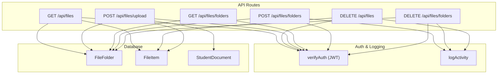
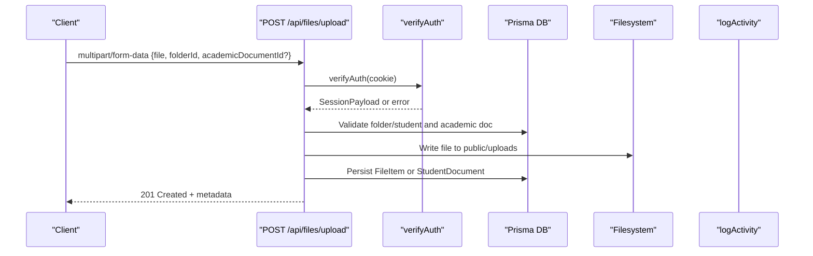
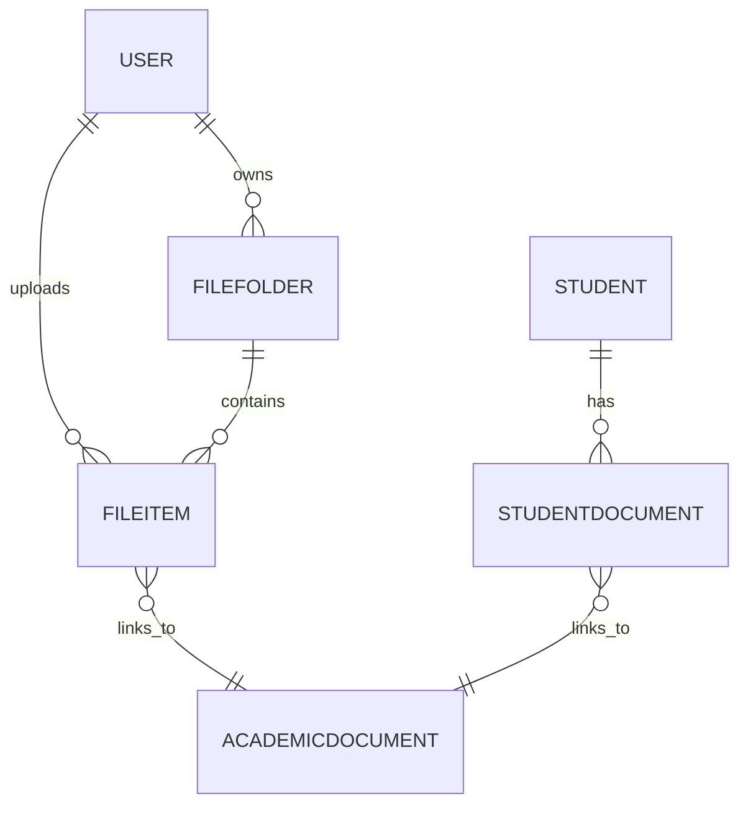
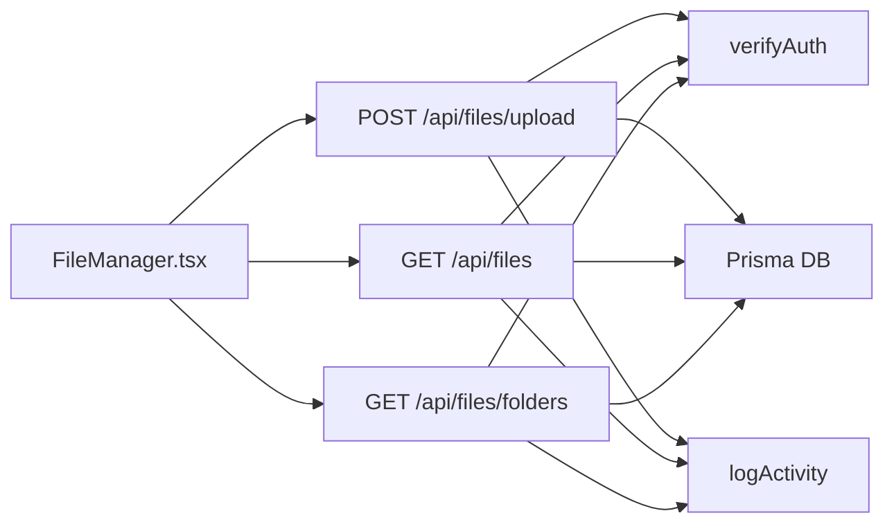

# File Management API

<cite>
**Referenced Files in This Document**
- [route.ts](file://src/app/api/files/route.ts)
- [route.ts](file://src/app/api/files/upload/route.ts)
- [route.ts](file://src/app/api/files/folders/route.ts)
- [schema.prisma](file://prisma/schema.prisma)
- [session.ts](file://src/lib/session.ts)
- [activity.ts](file://src/lib/activity.ts)
- [FileManager.tsx](file://src/app/files/components/FileManager.tsx)
- [route.ts](file://src/app/api/students/[id]/documents/route.ts)
</cite>

## Table of Contents
1. Introduction
2. Project Structure
3. Core Components
4. Architecture Overview
5. Detailed Component Analysis
6. Dependency Analysis
7. Performance Considerations
8. Troubleshooting Guide
9. Conclusion

## Introduction
This document provides comprehensive API documentation for file management endpoints focused on document upload, storage, and organization. It covers folder management, file metadata handling, access control via authentication, file type validation, size limits, and activity logging. It also includes practical usage patterns such as bulk operations and integration with student documents.

## Project Structure
The file management feature is implemented as Next.js Route Handlers under the api/files directory, with supporting utilities for authentication and activity logging. The data model is defined in Prisma schema.

**Diagram sources**
- [route.ts:18-50](file://src/app/api/files/route.ts#L18-L50)
- [route.ts:53-86](file://src/app/api/files/route.ts#L53-L86)
- [route.ts:86-191](file://src/app/api/files/upload/route.ts#L86-L191)
- [route.ts:18-91](file://src/app/api/files/folders/route.ts#L18-L91)
- [route.ts:94-127](file://src/app/api/files/folders/route.ts#L94-L127)
- [schema.prisma:785-814](file://prisma/schema.prisma#L785-L814)
- [session.ts:19-26](file://src/lib/session.ts#L19-L26)
- [activity.ts:60-113](file://src/lib/activity.ts#L60-L113)

**Section sources**
- [route.ts:18-86](file://src/app/api/files/route.ts#L18-L86)
- [route.ts:86-191](file://src/app/api/files/upload/route.ts#L86-L191)
- [route.ts:18-127](file://src/app/api/files/folders/route.ts#L18-L127)
- [schema.prisma:785-814](file://prisma/schema.prisma#L785-L814)
- [session.ts:19-26](file://src/lib/session.ts#L19-L26)
- [activity.ts:60-113](file://src/lib/activity.ts#L60-L113)

## Core Components
- Authentication: All endpoints validate a JWT token from the auth_token cookie using verifyAuth. Unauthenticated requests receive 401 Unauthorized.
- Folder management: List, create, and delete folders owned by the authenticated user.
- File listing and deletion: List files within a specific folder and delete files by ID with ownership checks.
- File upload: Accept multipart/form-data uploads with allowed MIME types and size limits; store files under public/uploads and persist metadata to the database. Supports both user folders and student-specific documents.
- Activity logging: Create actions (folder creation/deletion, file deletion) are logged via logActivity.

**Section sources**
- [route.ts:18-50](file://src/app/api/files/route.ts#L18-L50)
- [route.ts:53-86](file://src/app/api/files/route.ts#L53-L86)
- [route.ts:86-191](file://src/app/api/files/upload/route.ts#L86-L191)
- [route.ts:18-127](file://src/app/api/files/folders/route.ts#L18-L127)
- [activity.ts:60-113](file://src/lib/activity.ts#L60-L113)

## Architecture Overview
The system uses Next.js route handlers for RESTful endpoints. Each handler validates the session, performs authorization checks, interacts with the database through Prisma, and logs relevant activities. Uploaded files are stored on the filesystem under public/uploads and referenced by URLs in the database.

**Diagram sources**
- [route.ts:86-191](file://src/app/api/files/upload/route.ts#L86-L191)
- [session.ts:19-26](file://src/lib/session.ts#L19-L26)
- [schema.prisma:785-814](file://prisma/schema.prisma#L785-L814)

## Detailed Component Analysis

### Endpoints

#### List Files in Folder
- Method: GET
- URL: /api/files?folderId={number}
- Authentication: Required (JWT in auth_token cookie)
- Query Parameters:
  - folderId: number (required)
- Response: Array of file items with metadata and related academic document/user info
- Error Responses:
  - 401 Unauthorized if no valid session
  - 400 Bad Request if folderId missing
  - 404 Not Found if folder not found or not owned by user
  - 500 Internal Server Error on unexpected errors

**Section sources**
- [route.ts:18-50](file://src/app/api/files/route.ts#L18-L50)

#### Delete File
- Method: DELETE
- URL: /api/files?id={number}
- Authentication: Required
- Query Parameters:
  - id: number (required)
- Behavior: Deletes file record and logs activity
- Error Responses:
  - 401 Unauthorized
  - 400 Missing file ID
  - 404 Not Found if file not found or not owned by user
  - 500 Internal Server Error

**Section sources**
- [route.ts:53-86](file://src/app/api/files/route.ts#L53-L86)

#### Upload File
- Method: POST
- URL: /api/files/upload?folderId={string}
- Authentication: Required
- Content-Type: multipart/form-data
- Fields:
  - file: File (required)
  - folderId: string (required; supports numeric folder IDs or student_{studentId})
  - academicDocumentId: number (optional)
- Validation:
  - Allowed MIME types: PDF, images (JPEG/JPG/PNG/GIF/WebP/SVG), Word docs, Excel spreadsheets, text/plain, CSV, ZIP
  - Max file size: 20 MB
  - Filename sanitization and conflict resolution
- Storage:
  - Files written to public/uploads
  - URL set to /uploads/{filename}
- Database:
  - For user folders: creates FileItem with name, url, fileSize, fileType, folderId, userId, academicDocumentId
  - For student folders: creates StudentDocument with similar fields and status "In Review"
- Response: 201 Created with created entity metadata
- Error Responses:
  - 401 Unauthorized
  - 400 Missing folderId, no file uploaded, file too large, file type not allowed
  - 404 Student not found or folder not found/not owned
  - 500 Internal Server Error

**Section sources**
- [route.ts:86-191](file://src/app/api/files/upload/route.ts#L86-L191)

#### List Folders
- Method: GET
- URL: /api/files/folders
- Authentication: Required
- Response: Array of user-owned folders with file counts, plus virtual “folders” for each student (id prefixed with student_) with document counts
- Error Responses:
  - 401 Unauthorized
  - 500 Internal Server Error

**Section sources**
- [route.ts:18-58](file://src/app/api/files/folders/route.ts#L18-L58)

#### Create Folder
- Method: POST
- URL: /api/files/folders
- Authentication: Required
- Body: JSON with name (required, trimmed)
- Behavior: Creates folder owned by current user and logs activity
- Response: 201 Created with folder metadata including file count
- Error Responses:
  - 401 Unauthorized
  - 400 Missing or empty folder name
  - 500 Internal Server Error

**Section sources**
- [route.ts:60-91](file://src/app/api/files/folders/route.ts#L60-L91)

#### Delete Folder
- Method: DELETE
- URL: /api/files/folders?id={number}
- Authentication: Required
- Query Parameters:
  - id: number (required)
- Behavior: Deletes folder and logs activity
- Error Responses:
  - 401 Unauthorized
  - 400 Missing folder ID
  - 404 Not Found if folder not found or not owned by user
  - 500 Internal Server Error

**Section sources**
- [route.ts:94-127](file://src/app/api/files/folders/route.ts#L94-L127)

#### Student Documents (Related)
- Create Student Document
  - Method: POST
  - URL: /api/students/{id}/documents
  - Authentication: Required
  - Body: { name, url, fileSize?, fileType? }
  - Behavior: Creates StudentDocument with status "In Review" and logs activity
  - Error Responses: 401, 400 (missing fields), 500
- Delete Student Document
  - Method: DELETE
  - URL: /api/students/{id}/documents?documentId={number}
  - Authentication: Required
  - Behavior: Deletes document and logs activity
  - Error Responses: 401, 400 (missing documentId), 500

**Section sources**
- [route.ts:6-46](file://src/app/api/students/[id]/documents/route.ts#L6-L46)
- [route.ts:48-86](file://src/app/api/students/[id]/documents/route.ts#L48-L86)

### Data Models
- FileFolder: Represents a user-owned folder with name, userId, timestamps, and relation to FileItem.
- FileItem: Represents an uploaded file with name, url, fileSize, fileType, optional academicDocumentId, folderId, userId, and timestamps.
- StudentDocument: Represents a document linked to a student with name, url, fileSize, fileType, optional academicDocumentId, and status.

**Diagram sources**
- [schema.prisma:785-814](file://prisma/schema.prisma#L785-L814)
- [schema.prisma:456-472](file://prisma/schema.prisma#L456-L472)
- [schema.prisma:480-486](file://prisma/schema.prisma#L480-L486)

**Section sources**
- [schema.prisma:785-814](file://prisma/schema.prisma#L785-L814)
- [schema.prisma:456-472](file://prisma/schema.prisma#L456-L472)
- [schema.prisma:480-486](file://prisma/schema.prisma#L480-L486)

### Access Control and Security
- Authentication: All endpoints require a valid JWT token in the auth_token cookie. verifyAuth decodes and validates the token.
- Authorization:
  - Folder operations enforce ownership by checking folder.userId against session.id.
  - File deletion enforces ownership by checking file.userId against session.id.
  - Student document operations use separate session helpers but follow similar authorization patterns.
- Input Validation:
  - MIME type allowlist enforced during upload.
  - File size limit enforced (20 MB).
  - Filename sanitized to prevent path traversal and special characters.
- Activity Logging:
  - Key actions (create/delete folder, delete file) are logged with actor name and target details.

**Section sources**
- [session.ts:19-26](file://src/lib/session.ts#L19-L26)
- [route.ts:18-50](file://src/app/api/files/route.ts#L18-L50)
- [route.ts:53-86](file://src/app/api/files/route.ts#L53-L86)
- [route.ts:86-191](file://src/app/api/files/upload/route.ts#L86-L191)
- [route.ts:60-127](file://src/app/api/files/folders/route.ts#L60-L127)
- [activity.ts:60-113](file://src/lib/activity.ts#L60-L113)

### Practical Usage Examples

- Bulk Uploads:
  - Use the client-side FileManager to select multiple files and call the upload endpoint per file or batch via UI logic. The UI constructs FormData with file and optional academicDocumentId, then posts to /api/files/upload?folderId=...
  - Reference: [FileManager.tsx:989-1007](file://src/app/files/components/FileManager.tsx#L989-L1007)

- File Organization:
  - Create folders via POST /api/files/folders with a JSON body containing name.
  - List folders via GET /api/files/folders to populate the UI.
  - Upload files into a selected folder by appending folderId to the upload request.
  - Reference: [FileManager.tsx:974-1007](file://src/app/files/components/FileManager.tsx#L974-L1007)

- Document Workflow Integration:
  - For student contexts, use folderId starting with student_{studentId} to associate uploads with a student’s documents.
  - Alternatively, create StudentDocument directly via POST /api/students/{id}/documents with name and url.
  - Reference: [route.ts:122-157](file://src/app/api/files/upload/route.ts#L122-L157), [route.ts:6-46](file://src/app/api/students/[id]/documents/route.ts#L6-L46)

**Section sources**
- [FileManager.tsx:974-1007](file://src/app/files/components/FileManager.tsx#L974-L1007)
- [route.ts:122-157](file://src/app/api/files/upload/route.ts#L122-L157)
- [route.ts:6-46](file://src/app/api/students/[id]/documents/route.ts#L6-L46)

## Dependency Analysis
- Route handlers depend on:
  - Authentication via verifyAuth (JWT)
  - Database via Prisma models (FileFolder, FileItem, StudentDocument, AcademicDocument)
  - Activity logging via logActivity
- Frontend components interact with routes to perform CRUD operations and manage state locally.

**Diagram sources**
- [FileManager.tsx:974-1007](file://src/app/files/components/FileManager.tsx#L974-L1007)
- [route.ts:86-191](file://src/app/api/files/upload/route.ts#L86-L191)
- [route.ts:18-50](file://src/app/api/files/route.ts#L18-L50)
- [route.ts:18-58](file://src/app/api/files/folders/route.ts#L18-L58)
- [session.ts:19-26](file://src/lib/session.ts#L19-L26)
- [activity.ts:60-113](file://src/lib/activity.ts#L60-L113)

**Section sources**
- [FileManager.tsx:974-1007](file://src/app/files/components/FileManager.tsx#L974-L1007)
- [route.ts:18-191](file://src/app/api/files/route.ts#L18-L191)
- [route.ts:86-191](file://src/app/api/files/upload/route.ts#L86-L191)
- [route.ts:18-127](file://src/app/api/files/folders/route.ts#L18-L127)
- [session.ts:19-26](file://src/lib/session.ts#L19-L26)
- [activity.ts:60-113](file://src/lib/activity.ts#L60-L113)

## Performance Considerations
- File Size Limits: Enforced at 20 MB to avoid large payloads and memory pressure.
- MIME Type Validation: Reduces processing overhead by rejecting unsupported types early.
- Filename Sanitization and Conflict Resolution: Prevents filesystem errors and ensures unique filenames without blocking requests.
- Database Queries: Minimized to necessary selects and includes; consider pagination for large file lists in future enhancements.
- Concurrency: Uploading many files concurrently may stress disk I/O; consider rate limiting or queueing for high-throughput scenarios.

[No sources needed since this section provides general guidance]

## Troubleshooting Guide
- 401 Unauthorized: Ensure the auth_token cookie is present and valid. verifyAuth will throw if the token is invalid or expired.
- 400 Bad Request: Check required parameters (folderId, file, name) and payload formats. Verify MIME type and file size constraints.
- 404 Not Found: Confirm folder/file ownership and existence before operations.
- 500 Internal Server Error: Inspect server logs for stack traces; check filesystem permissions for writing to public/uploads and database connectivity.
- Activity Logs: If logs are missing, ensure logActivity is called and database write succeeds.

**Section sources**
- [route.ts:18-50](file://src/app/api/files/route.ts#L18-L50)
- [route.ts:53-86](file://src/app/api/files/route.ts#L53-L86)
- [route.ts:86-191](file://src/app/api/files/upload/route.ts#L86-L191)
- [route.ts:18-127](file://src/app/api/files/folders/route.ts#L18-L127)
- [session.ts:19-26](file://src/lib/session.ts#L19-L26)
- [activity.ts:60-113](file://src/lib/activity.ts#L60-L113)

## Conclusion
The File Management API provides secure, validated, and auditable endpoints for organizing and storing documents. It supports user folders and student-specific documents, enforces strict input validation, and integrates with activity logging for compliance. Future enhancements could include virus scanning, advanced sharing permissions, version control, and quota enforcement.

[No sources needed since this section summarizes without analyzing specific files]