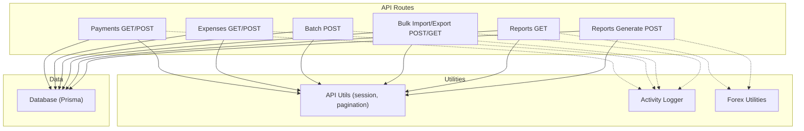
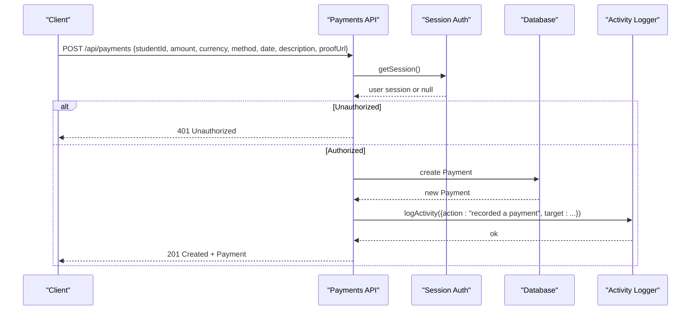
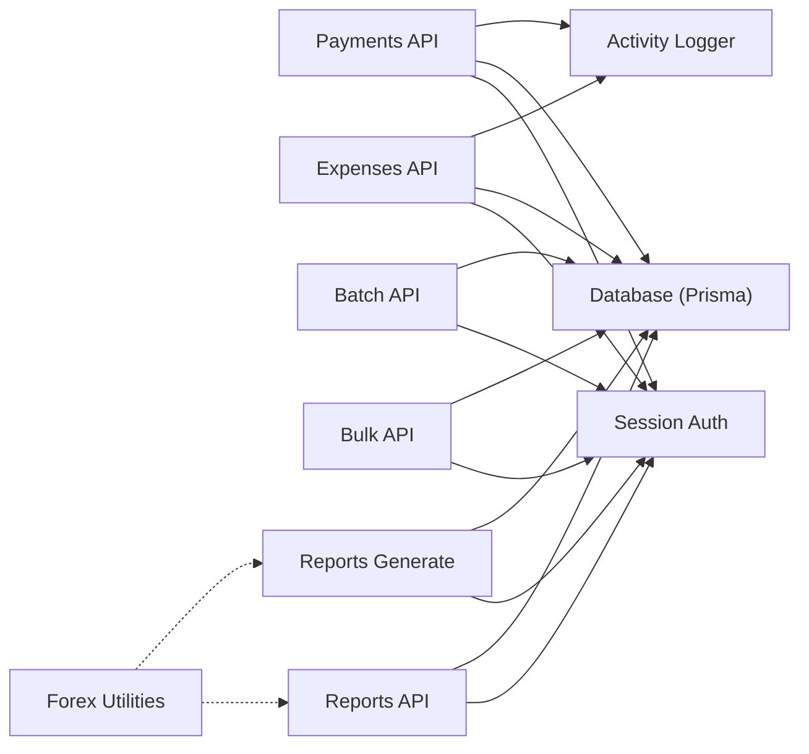
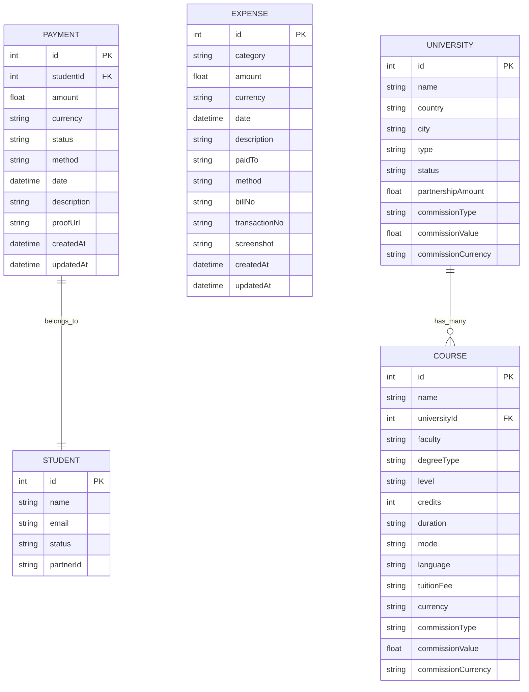

# Financial Management API

<cite>
**Referenced Files in This Document**
- [payments route](file://src/app/api/payments/route.ts)
- [expenses route](file://src/app/api/expenses/route.ts)
- [batch route](file://src/app/api/batch/route.ts)
- [bulk route](file://src/app/api/bulk/route.ts)
- [reports route](file://src/app/api/reports/route.ts)
- [reports generate route](file://src/app/api/reports/generate/route.ts)
- [forex utilities](file://src/lib/forex.ts)
- [activity logger](file://src/lib/activity.ts)
- [API utilities](file://src/lib/api-utils.ts)
- [Prisma schema](file://prisma/schema.prisma)
</cite>

## Table of Contents
1. Introduction
2. Project Structure
3. Core Components
4. Architecture Overview
5. Detailed Component Analysis
6. Dependency Analysis
7. Performance Considerations
8. Troubleshooting Guide
9. Conclusion
10. Appendices

## Introduction
This document provides detailed API documentation for financial management endpoints focused on payment processing, expense tracking, and commission-related capabilities. It covers HTTP methods, URL patterns, request/response schemas, authentication requirements, multi-currency support, batch operations, reporting, audit trails, and compliance considerations. Practical examples illustrate payment recording, expense creation, bulk imports, and report generation workflows.

## Project Structure
The financial management features are implemented as Next.js API routes under src/app/api with supporting utilities for session handling, pagination, activity logging, and currency conversion. Data models are defined in the Prisma schema.

**Diagram sources**
- [payments route:7-96](file://src/app/api/payments/route.ts#L7-L96)
- [expenses route:6-73](file://src/app/api/expenses/route.ts#L6-L73)
- [batch route:14-116](file://src/app/api/batch/route.ts#L14-L116)
- [bulk route:59-408](file://src/app/api/bulk/route.ts#L59-L408)
- [reports route:28-148](file://src/app/api/reports/route.ts#L28-L148)
- [reports generate route:7-99](file://src/app/api/reports/generate/route.ts#L7-L99)
- [API utilities:13-83](file://src/lib/api-utils.ts#L13-L83)
- [activity logger:60-113](file://src/lib/activity.ts#L60-L113)
- [forex utilities:27-77](file://src/lib/forex.ts#L27-L77)

**Section sources**
- [payments route:7-96](file://src/app/api/payments/route.ts#L7-L96)
- [expenses route:6-73](file://src/app/api/expenses/route.ts#L6-L73)
- [batch route:14-116](file://src/app/api/batch/route.ts#L14-L116)
- [bulk route:59-408](file://src/app/api/bulk/route.ts#L59-L408)
- [reports route:28-148](file://src/app/api/reports/route.ts#L28-L148)
- [reports generate route:7-99](file://src/app/api/reports/generate/route.ts#L7-L99)
- [API utilities:13-83](file://src/lib/api-utils.ts#L13-L83)
- [activity logger:60-113](file://src/lib/activity.ts#L60-L113)
- [forex utilities:27-77](file://src/lib/forex.ts#L27-L77)

## Core Components
- Payments: List and record student payments with pagination, filtering, and activity logging.
- Expenses: List and create expenses with role-based access control and activity logging.
- Batch Operations: Bulk update statuses or perform soft deletes across entities including payments.
- Bulk Import/Export: Import/export students, courses, leads, applications, payments, staff, partners, and expenses via Excel; export to JSON or XLSX.
- Reports: Query and filter data by date ranges; specialized payment report mapping.
- Forex: Fetch exchange rates and convert amounts to NPR for consistent reporting and display.
- Audit Trail: Activity logs capture actor, action, target, and details for compliance.

**Section sources**
- [payments route:7-96](file://src/app/api/payments/route.ts#L7-L96)
- [expenses route:6-73](file://src/app/api/expenses/route.ts#L6-L73)
- [batch route:14-116](file://src/app/api/batch/route.ts#L14-L116)
- [bulk route:59-408](file://src/app/api/bulk/route.ts#L59-L408)
- [reports route:28-148](file://src/app/api/reports/route.ts#L28-L148)
- [forex utilities:27-77](file://src/lib/forex.ts#L27-L77)
- [activity logger:60-113](file://src/lib/activity.ts#L60-L113)

## Architecture Overview
Financial endpoints follow a consistent pattern: authenticate via session cookie, validate inputs, interact with the database through Prisma, log activities where applicable, and return standardized responses. Reporting and bulk operations provide additional flexibility for analysis and data migration.

**Diagram sources**
- [payments route:55-91](file://src/app/api/payments/route.ts#L55-L91)
- [API utilities:13-22](file://src/lib/api-utils.ts#L13-L22)
- [activity logger:60-113](file://src/lib/activity.ts#L60-L113)

## Detailed Component Analysis

### Payments API
- Base path: /api/payments
- Authentication: Requires valid session cookie; returns 401 if missing.
- Methods:
  - GET: List payments with pagination and filters.
    - Query parameters: page, perPage, search, studentId, status, method.
    - Response: Paginated list including student name/email.
  - POST: Record a new payment.
    - Body fields: studentId (number), amount (number), currency (string, default NPR), status (string, default Pending), method (string, default Cash), date (ISO string), description (string), proofUrl (string).
    - Response: 201 Created with created payment object.
- Notes:
  - Searches across student name and email when search is provided.
  - Logs activity for each recorded payment.

Example request (POST):
- URL: POST /api/payments
- Headers: Cookie: auth_token=...
- Body: { "studentId": 123, "amount": 5000, "currency": "USD", "method": "Bank Transfer", "date": "2025-09-01T10:00:00Z", "description": "Application fee", "proofUrl": "https://example.com/receipt.pdf" }
- Expected response: 201 with payment object including id, amount, currency, status, method, date, description, proofUrl, createdAt, updatedAt, and student relation.

Example request (GET):
- URL: GET /api/payments?page=1&perPage=20&search=john&status=Pending&method=Cash
- Expected response: Paginated result with total, page, perPage, totalPages, and data array.

**Section sources**
- [payments route:7-96](file://src/app/api/payments/route.ts#L7-L96)
- [API utilities:39-83](file://src/lib/api-utils.ts#L39-L83)

### Expenses API
- Base path: /api/expenses
- Authentication: Requires valid session cookie; POST requires Admin, Super Admin, or Staff roles.
- Methods:
  - GET: List all expenses ordered by date descending.
  - POST: Create an expense.
    - Body fields: category (string), amount (number), currency (string, default NPR), date (ISO string), description (string), paidTo (string), method (string), billNo (string), transactionNo (string), screenshot (string).
    - Response: 201 Created with created expense object.
- Notes:
  - Logs activity for each recorded expense.

Example request (POST):
- URL: POST /api/expenses
- Headers: Cookie: auth_token=...
- Body: { "category": "Marketing", "amount": 1200, "currency": "NPR", "date": "2025-09-05", "description": "Ad campaign", "paidTo": "Agency X", "method": "Bank Transfer", "billNo": "INV-001" }
- Expected response: 201 with expense object including id, category, amount, currency, date, description, paidTo, method, billNo, transactionNo, screenshot, createdAt, updatedAt.

**Section sources**
- [expenses route:6-73](file://src/app/api/expenses/route.ts#L6-L73)

### Batch Operations
- Base path: /api/batch
- Authentication: Requires valid session cookie.
- Method:
  - POST: Perform batch actions on supported entities.
    - Body fields: entity (string), ids (array of numbers), action (string), data (object depending on action).
    - Supported actions:
      - delete: Soft-delete students, universities, courses, leads.
      - updateStatus: Update status for students, universities, courses, leads, applications, payments.
      - assignCounselor: Assign counselor to students and leads.
    - Response: 200 with { success: true, count }.
- Notes:
  - Logs activity for batch operations.
  - Creates a notification upon completion.

Example request (POST):
- URL: POST /api/batch
- Headers: Cookie: auth_token=...
- Body: { "entity": "payments", "ids": [101, 102], "action": "updateStatus", "data": { "status": "Paid" } }
- Expected response: { "success": true, "count": 2 }

**Section sources**
- [batch route:14-116](file://src/app/api/batch/route.ts#L14-L116)

### Bulk Import/Export
- Base path: /api/bulk
- Authentication: POST requires Admin, Super Admin, or Staff roles; GET requires session.
- Methods:
  - POST: Import data from an uploaded Excel file.
    - Form fields: file (Excel), type (students|universities|courses|leads|applications|payments|staff|partners|expenses).
    - Behavior: Parses rows, validates required fields, creates records, handles duplicates and errors, and reports imported count and row-level errors.
    - Response: { imported, errors[], total }.
  - GET: Export data to JSON or XLSX.
    - Query parameters: type (same set as import), format (json|xlsx).
    - Behavior: Queries data, maps to export shape, returns JSON or downloads XLSX.
    - Response: JSON array or binary XLSX file.

Example request (POST import payments):
- URL: POST /api/bulk
- Headers: Cookie: auth_token=...
- Form: { file: <xlsx>, type: "payments" }
- Expected columns include studentEmail, amount, currency, method, date, description, status.
- Expected response: { "imported": N, "errors": [...], "total": M }

Example request (GET export payments):
- URL: GET /api/bulk?type=payments&format=json
- Headers: Cookie: auth_token=...
- Expected response: Array of payment export objects with id, studentName, studentEmail, amount, currency, status, method, date, description.

**Section sources**
- [bulk route:59-408](file://src/app/api/bulk/route.ts#L59-L408)
- [bulk route:410-591](file://src/app/api/bulk/route.ts#L410-L591)

### Reports API
- Base path: /api/reports
- Authentication: Requires valid session cookie.
- Methods:
  - GET: Generate reports with optional date range filters.
    - Query parameters: type (universities|courses|users|applications|payments), startDate, endDate.
    - Behavior: Filters by createdAt or specific date fields, maps results to report-friendly shapes.
    - Response: JSON array of report rows.
  - POST /api/reports/generate: Customizable report generation.
    - Body fields: entity (Student|University|Course|Lead|Payment|Application), fields[] (selected fields), filters[] (field, op, value).
    - Behavior: Builds dynamic Prisma queries with includes and filters, limits to 500 rows.
    - Response: JSON array of mapped rows.

Example request (GET payments report):
- URL: GET /api/reports?type=payments&startDate=2025-01-01&endDate=2025-09-30
- Headers: Cookie: auth_token=...
- Expected response: Array with Payment ID, Student Name, Student Email, Amount, Currency, Method, Status, Transaction Date, Description, Proof Link.

Example request (POST custom report):
- URL: POST /api/reports/generate
- Headers: Cookie: auth_token=...
- Body: { "entity": "Payment", "fields": ["id","amount","currency","status","date"], "filters": [{ "field": "status", "op": "equals", "value": "Paid" }] }
- Expected response: Array of selected fields for matching payments.

**Section sources**
- [reports route:28-148](file://src/app/api/reports/route.ts#L28-L148)
- [reports generate route:7-99](file://src/app/api/reports/generate/route.ts#L7-L99)

### Multi-Currency Support and Forex Integration
- Currency fields:
  - Payment.currency defaults to NPR.
  - Expense.currency defaults to NPR.
  - Course.tuitionFee and currency stored per course.
  - University has commission fields for payouts.
- Forex utilities:
  - getLatestRates(): Fetches latest exchange rates from a central bank API and builds a rate map keyed by ISO currency code.
  - convertToNPR(): Converts an amount from a given currency to NPR using the rate map.
  - formatNPR(): Formats amounts in NPR locale.
- Usage:
  - Reports and exports include currency fields for transparency.
  - Conversion can be applied when aggregating totals or displaying normalized values.

Example usage concept:
- Retrieve rates and convert a USD payment amount to NPR for consolidated reporting.

**Section sources**
- [forex utilities:27-77](file://src/lib/forex.ts#L27-L77)
- [payments route:68-80](file://src/app/api/payments/route.ts#L68-L80)
- [expenses route:45-58](file://src/app/api/expenses/route.ts#L45-L58)
- [Prisma schema:488-520](file://prisma/schema.prisma#L488-L520)

### Commission Calculations
- Configuration:
  - University and Course models include commissionType (Percentage or Flat), commissionValue (numeric), and commissionCurrency (string).
  - UI supports setting per-university and per-course commissions; course-level overrides university defaults.
- Calculation logic:
  - Percentage: commission = tuition or agreed amount * (commissionValue / 100).
  - Flat: commission = commissionValue.
  - Currency: Use commissionCurrency for payout representation; convert to NPR if needed using forex utilities.
- Note:
  - The repository exposes configuration and UI for managing commissions; calculation formulas should be enforced server-side when generating settlement records.

**Section sources**
- [Prisma schema:19-50](file://prisma/schema.prisma#L19-L50)
- [Prisma schema:67-119](file://prisma/schema.prisma#L67-L119)
- [CommissionContent:210-255](file://src/app/commission/components/CommissionContent.tsx#L210-L255)

### Audit Trails and Compliance
- Activity logging:
  - logActivity() persists actorName, action, target, targetBy, details, and optional changes.
  - Used by payments and expenses to record financial actions.
- Access control:
  - getSession() enforces authentication via cookies.
  - Role checks restrict sensitive operations (e.g., expense creation).
- Notifications:
  - Important actions trigger notifications for visibility.
- Best practices:
  - Ensure all financial mutations call logActivity.
  - Retain logs for compliance periods and enable export for audits.

**Section sources**
- [activity logger:60-113](file://src/lib/activity.ts#L60-L113)
- [payments route:85-89](file://src/app/api/payments/route.ts#L85-L89)
- [expenses route:63-67](file://src/app/api/expenses/route.ts#L63-L67)
- [API utilities:13-22](file://src/lib/api-utils.ts#L13-L22)

## Dependency Analysis

**Diagram sources**
- [payments route:7-96](file://src/app/api/payments/route.ts#L7-L96)
- [expenses route:6-73](file://src/app/api/expenses/route.ts#L6-L73)
- [batch route:14-116](file://src/app/api/batch/route.ts#L14-L116)
- [bulk route:59-408](file://src/app/api/bulk/route.ts#L59-L408)
- [reports route:28-148](file://src/app/api/reports/route.ts#L28-L148)
- [reports generate route:7-99](file://src/app/api/reports/generate/route.ts#L7-L99)
- [forex utilities:27-77](file://src/lib/forex.ts#L27-L77)

**Section sources**
- [payments route:7-96](file://src/app/api/payments/route.ts#L7-L96)
- [expenses route:6-73](file://src/app/api/expenses/route.ts#L6-L73)
- [batch route:14-116](file://src/app/api/batch/route.ts#L14-L116)
- [bulk route:59-408](file://src/app/api/bulk/route.ts#L59-L408)
- [reports route:28-148](file://src/app/api/reports/route.ts#L28-L148)
- [reports generate route:7-99](file://src/app/api/reports/generate/route.ts#L7-L99)
- [forex utilities:27-77](file://src/lib/forex.ts#L27-L77)

## Performance Considerations
- Pagination: Use page and perPage to limit payload sizes; default perPage capped at 100.
- Filtering: Leverage query parameters (studentId, status, method) to reduce dataset size.
- Bulk operations: Prefer batch updates for large sets; monitor error lists to avoid excessive retries.
- Report generation: Limit to 500 rows for custom reports to prevent memory pressure.
- Forex calls: Cache exchange rates to minimize external API latency and failures.

[No sources needed since this section provides general guidance]

## Troubleshooting Guide
Common issues and resolutions:
- Unauthorized (401): Missing or invalid session cookie. Ensure auth_token is present and valid.
- Forbidden (403): Insufficient role for protected endpoints (e.g., expense creation requires Admin/Super Admin/Staff).
- Validation errors (400): Missing required fields in requests (e.g., studentId and amount for payments; category and amount for expenses).
- Duplicate entries: Bulk import may fail on duplicate emails; review errors array for row-level messages.
- Database constraints: Unique constraints on emails and other fields will cause failures; handle P2002 errors appropriately.
- External API failures: Forex fetch errors fall back to base rates; implement retry or fallback strategies as needed.

**Section sources**
- [API utilities:5-37](file://src/lib/api-utils.ts#L5-L37)
- [expenses route:20-43](file://src/app/api/expenses/route.ts#L20-L43)
- [bulk route:86-144](file://src/app/api/bulk/route.ts#L86-L144)
- [forex utilities:27-51](file://src/lib/forex.ts#L27-L51)

## Conclusion
The financial management APIs provide robust capabilities for recording payments, tracking expenses, performing batch operations, importing/exporting data, and generating reports. Multi-currency support and forex integration enable accurate conversions to NPR. Audit logging and role-based access ensure integrity and compliance. For commission calculations, configure per-university and per-course settings and apply percentage or flat rules consistently.

[No sources needed since this section summarizes without analyzing specific files]

## Appendices

### Data Models Overview

**Diagram sources**
- [Prisma schema:488-520](file://prisma/schema.prisma#L488-L520)
- [Prisma schema:19-50](file://prisma/schema.prisma#L19-L50)
- [Prisma schema:67-119](file://prisma/schema.prisma#L67-L119)
- [Prisma schema:334-409](file://prisma/schema.prisma#L334-L409)