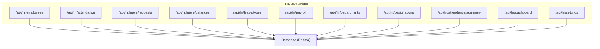
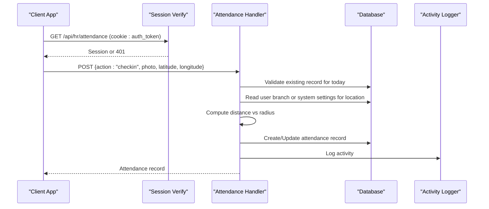
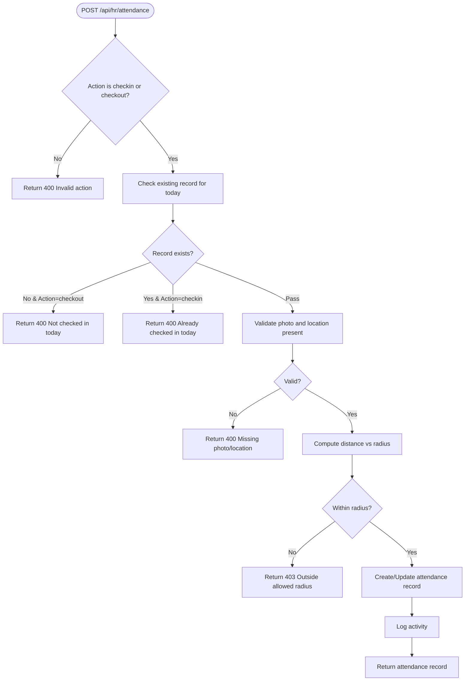
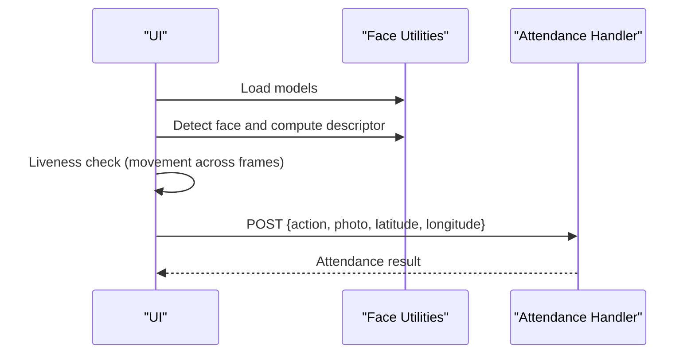
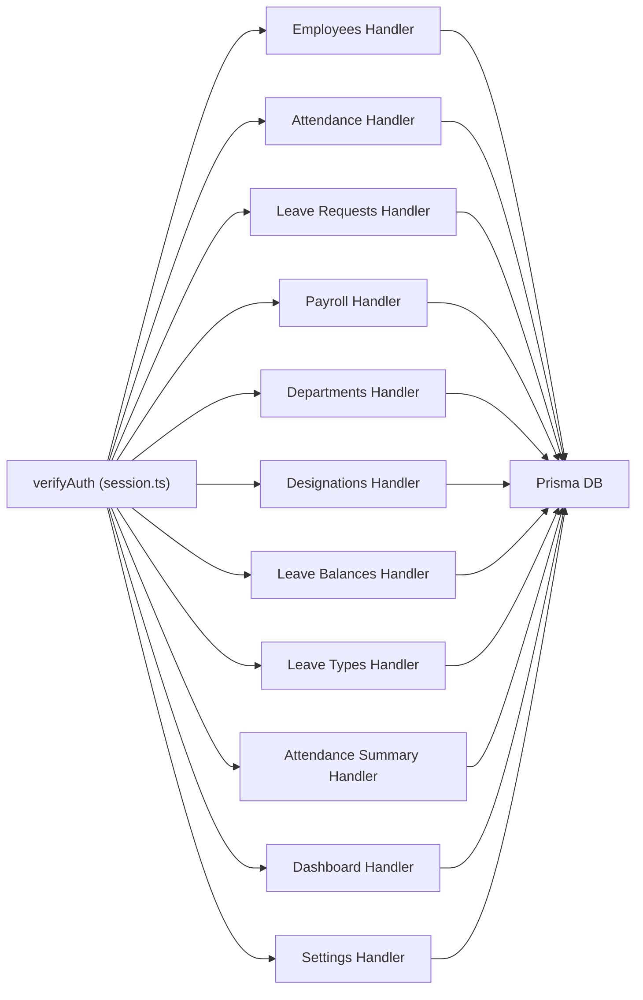

# HR Management API

<cite>
**Referenced Files in This Document**
- [route.ts](file://src/app/api/hr/employees/route.ts)
- [route.ts](file://src/app/api/hr/attendance/route.ts)
- [route.ts](file://src/app/api/hr/leave/requests/route.ts)
- [route.ts](file://src/app/api/hr/payroll/route.ts)
- [route.ts](file://src/app/api/hr/departments/route.ts)
- [route.ts](file://src/app/api/hr/designations/route.ts)
- [route.ts](file://src/app/api/hr/leave/balances/route.ts)
- [route.ts](file://src/app/api/hr/leave/types/route.ts)
- [route.ts](file://src/app/api/hr/attendance/summary/route.ts)
- [route.ts](file://src/app/api/hr/dashboard/route.ts)
- [session.ts](file://src/lib/session.ts)
- [schema.prisma](file://prisma/schema.prisma)
- [face.ts](file://src/lib/face.ts)
</cite>

## Table of Contents
1. Introduction
2. Project Structure
3. Core Components
4. Architecture Overview
5. Detailed Component Analysis
6. Dependency Analysis
7. Performance Considerations
8. Troubleshooting Guide
9. Conclusion
10. Appendices

## Introduction
This document provides comprehensive API documentation for the HR management module, covering employee administration, attendance tracking with face verification and geofencing, leave management workflows, payroll processing, and reporting endpoints. It includes HTTP methods, URL patterns, request/response schemas, authentication requirements, and practical examples for common workflows such as onboarding, attendance, leave approvals, and payroll generation.

## Project Structure
The HR APIs are implemented as Next.js Route Handlers under src/app/api/hr. Each feature area has its own directory:
- Employees: CRUD for employee profiles
- Attendance: Check-in/out with photo, location validation, and summary
- Leave: Types, balances, and requests
- Payroll: Monthly payroll creation and retrieval
- Departments and Designations: Master data management
- Dashboard and Settings: Aggregated metrics and office settings for geofencing

**Diagram sources**
- [route.ts](file://src/app/api/hr/employees/route.ts)
- [route.ts](file://src/app/api/hr/attendance/route.ts)
- [route.ts](file://src/app/api/hr/leave/requests/route.ts)
- [route.ts](file://src/app/api/hr/payroll/route.ts)
- [route.ts](file://src/app/api/hr/departments/route.ts)
- [route.ts](file://src/app/api/hr/designations/route.ts)
- [route.ts](file://src/app/api/hr/leave/balances/route.ts)
- [route.ts](file://src/app/api/hr/leave/types/route.ts)
- [route.ts](file://src/app/api/hr/attendance/summary/route.ts)
- [route.ts](file://src/app/api/hr/dashboard/route.ts)
- [route.ts](file://src/app/api/hr/settings/route.ts)
- [schema.prisma](file://prisma/schema.prisma)

**Section sources**
- [route.ts](file://src/app/api/hr/employees/route.ts)
- [route.ts](file://src/app/api/hr/attendance/route.ts)
- [route.ts](file://src/app/api/hr/leave/requests/route.ts)
- [route.ts](file://src/app/api/hr/payroll/route.ts)
- [route.ts](file://src/app/api/hr/departments/route.ts)
- [route.ts](file://src/app/api/hr/designations/route.ts)
- [route.ts](file://src/app/api/hr/leave/balances/route.ts)
- [route.ts](file://src/app/api/hr/leave/types/route.ts)
- [route.ts](file://src/app/api/hr/attendance/summary/route.ts)
- [route.ts](file://src/app/api/hr/dashboard/route.ts)
- [route.ts](file://src/app/api/hr/settings/route.ts)
- [schema.prisma](file://prisma/schema.prisma)

## Core Components
- Authentication: All endpoints require a valid JWT stored in the auth_token cookie. The session payload contains user id, email, role, and name.
- Data models: Employee, Department, Designation, Attendance, LeaveType, LeaveBalance, LeaveRequest, Payroll, PayrollItem, SystemSettings.
- Business rules:
  - Attendance requires photo and geolocation; validated against branch or office coordinates and radius.
  - Leave requests require type, dates, and reason; balances tracked per year per type.
  - Payroll computes net salary from basic salary, allowances, deductions, and bonus.

**Section sources**
- [session.ts](file://src/lib/session.ts)
- [schema.prisma](file://prisma/schema.prisma)

## Architecture Overview
The HR module follows a route-handler-per-feature pattern. Each handler authenticates via JWT, validates inputs, performs business logic, persists changes through Prisma, and logs activity. Attendance additionally enforces geofencing using configured office coordinates and radius. Face verification is performed client-side to capture a photo and ensure liveness before calling the attendance endpoint.

**Diagram sources**
- [route.ts](file://src/app/api/hr/attendance/route.ts)
- [session.ts](file://src/lib/session.ts)
- [schema.prisma](file://prisma/schema.prisma)

## Detailed Component Analysis

### Authentication
- Mechanism: JWT-based authentication via cookie named auth_token.
- Verification: Token is verified using HS256 with a secret from environment.
- Session payload: Contains id, email, role, name.

Authentication requirements:
- All HR endpoints check for a valid token and return 401 if missing or invalid.
- Admin-only operations enforce role checks for "Admin" or "Super Admin".

**Section sources**
- [session.ts](file://src/lib/session.ts)

### Employee Administration
Endpoints:
- GET /api/hr/employees
  - Description: List employees excluding Admin and Student roles; includes department, designation, branch details.
  - Auth: Required (any authenticated user).
  - Response: Array of employee objects with selected fields.
- POST /api/hr/employees
  - Description: Create/update employee profile for an existing user by userId.
  - Auth: Admin or Super Admin.
  - Request body: Fields include employeeId, phone, alternatePhone, dateOfBirth, gender, address, city, state, zipCode, country, emergencyContact, emergencyPhone, bankName, bankAccount, bankIfsc, panNumber, basicSalary, hireDate, employmentType, departmentId, designationId, branchId.
  - Response: Updated employee object.

Notes:
- Activity logging records creation events.

**Section sources**
- [route.ts](file://src/app/api/hr/employees/route.ts)

### Department and Designation Management
Endpoints:
- GET /api/hr/departments
  - Description: List departments with head and member counts.
  - Auth: Required.
  - Response: Array of departments.
- POST /api/hr/departments
  - Description: Create a department with optional head assignment.
  - Auth: Admin or Super Admin.
  - Request body: name, description, headId.
  - Response: Created department.
  - Error handling: Duplicate name returns 400.

- GET /api/hr/designations
  - Description: List designations with member counts.
  - Auth: Required.
  - Response: Array of designations.
- POST /api/hr/designations
  - Description: Create a designation.
  - Auth: Admin or Super Admin.
  - Request body: title, description.
  - Response: Created designation.
  - Error handling: Duplicate title returns 400.

**Section sources**
- [route.ts](file://src/app/api/hr/departments/route.ts)
- [route.ts](file://src/app/api/hr/designations/route.ts)

### Attendance Tracking with Geofencing
Endpoints:
- GET /api/hr/attendance
  - Description: Query attendance records with filters: date, fromDate, toDate, userId, status, search (name or employeeId), sort, order.
  - Auth: Required.
  - Response: Array of attendance records including user details.
- POST /api/hr/attendance
  - Description: Perform check-in or check-out actions.
  - Auth: Required.
  - Request body: action ("checkin" or "checkout"), photo (base64 or URL), latitude, longitude.
  - Validation:
    - Check-in: No existing record for today; photo and location required; must be within allowed radius.
    - Check-out: Existing check-in required; photo and location required; must be within allowed radius.
  - Location validation:
    - Uses user’s branch coordinates if available; otherwise falls back to system office coordinates and radius.
    - Computes haversine distance and compares to radius.
  - Response: Attendance record created or updated.

Geofencing configuration:
- Office coordinates and radius are read from system settings and can be updated via settings endpoint.

Face verification integration:
- Client-side face detection and liveness checks produce a photo before calling the attendance endpoint.
- Enrolled face descriptor is fetched from employee profile; verification occurs in the UI prior to submission.

**Diagram sources**
- [route.ts](file://src/app/api/hr/attendance/route.ts)
- [schema.prisma](file://prisma/schema.prisma)

**Section sources**
- [route.ts](file://src/app/api/hr/attendance/route.ts)
- [schema.prisma](file://prisma/schema.prisma)

### Leave Management
Endpoints:
- GET /api/hr/leave/types
  - Description: List leave types.
  - Auth: Required.
  - Response: Array of leave types.
- POST /api/hr/leave/types
  - Description: Create a leave type with daysPerYear.
  - Auth: Admin or Super Admin.
  - Request body: name, description, daysPerYear.
  - Response: Created leave type.
  - Error handling: Duplicate name returns 400.

- GET /api/hr/leave/balances?userId=&year=
  - Description: Retrieve leave balances per user and type for a given year.
  - Auth: Required.
  - Filters: userId (optional), year (defaults to current).
  - Response: Array of balances with leave type and user info.

- GET /api/hr/leave/requests?status=
  - Description: List leave requests with optional status filter.
  - Auth: Required.
  - Access control: Non-admin users see only their own requests.
  - Response: Array of requests with user, leave type, approver details.

- POST /api/hr/leave/requests
  - Description: Submit a new leave request.
  - Auth: Required.
  - Request body: leaveTypeId, startDate, endDate, reason.
  - Response: Created leave request.

Leave balance calculation:
- Balances are stored per user, leave type, and year with totalDays and usedDays.
- Requests consume usedDays based on approved leaves; balances are managed separately from this endpoint set.

**Section sources**
- [route.ts](file://src/app/api/hr/leave/types/route.ts)
- [route.ts](file://src/app/api/hr/leave/balances/route.ts)
- [route.ts](file://src/app/api/hr/leave/requests/route.ts)
- [schema.prisma](file://prisma/schema.prisma)

### Payroll Processing
Endpoints:
- GET /api/hr/payroll?month=&year=
  - Description: Retrieve payroll records for a specific month/year.
  - Auth: Required.
  - Access control: Non-admin users see only their own payrolls.
  - Response: Array of payroll records with items and user details.

- POST /api/hr/payroll
  - Description: Create a monthly payroll entry.
  - Auth: Admin or Super Admin.
  - Request body: userId, month, year, basicSalary, allowances, deductions, bonus, items (array of label, type, amount).
  - Computation: netSalary = basicSalary + allowances + bonus - deductions.
  - Response: Created payroll with items.

Payroll computation logic:
- Net salary is calculated server-side upon creation.
- Items allow detailed breakdowns of earnings and deductions.

**Section sources**
- [route.ts](file://src/app/api/hr/payroll/route.ts)
- [schema.prisma](file://prisma/schema.prisma)

### Reporting and Analytics
Endpoints:
- GET /api/hr/attendance/summary?month=&year=
  - Description: Aggregate attendance statistics per user for a given month.
  - Auth: Required.
  - Response: Summary object mapping userId to counts of present, absent, late, half-day, total; plus totalDays, month, year.

- GET /api/hr/dashboard
  - Description: High-level HR dashboard metrics.
  - Auth: Required.
  - Response: Counts for total employees, departments, designations, pending leaves, today’s present count, total payrolls this month, and recent attendance entries.

These endpoints provide analytics for HR dashboards and compliance reporting.

**Section sources**
- [route.ts](file://src/app/api/hr/attendance/summary/route.ts)
- [route.ts](file://src/app/api/hr/dashboard/route.ts)

### Biometric Integration for Attendance
- Face model loading and detection are handled client-side using face-api utilities.
- Models are loaded once and reused for detection and descriptor extraction.
- Liveness detection uses movement thresholds across frames to prevent spoofing.
- After successful verification, the client sends the captured photo along with geolocation to the attendance endpoint.

**Diagram sources**
- [face.ts](file://src/lib/face.ts)
- [route.ts](file://src/app/api/hr/attendance/route.ts)

**Section sources**
- [face.ts](file://src/lib/face.ts)
- [route.ts](file://src/app/api/hr/attendance/route.ts)

## Dependency Analysis
- Authentication dependency: All handlers depend on verifyAuth from session.ts to validate JWT tokens.
- Database dependency: All handlers use Prisma-generated db client to query and mutate data defined in schema.prisma.
- Activity logging: Many handlers call logActivity to audit changes.
- Geofencing dependency: Attendance handler reads SystemSettings and Branch coordinates to validate location.

**Diagram sources**
- [session.ts](file://src/lib/session.ts)
- [route.ts](file://src/app/api/hr/employees/route.ts)
- [route.ts](file://src/app/api/hr/attendance/route.ts)
- [route.ts](file://src/app/api/hr/leave/requests/route.ts)
- [route.ts](file://src/app/api/hr/payroll/route.ts)
- [route.ts](file://src/app/api/hr/departments/route.ts)
- [route.ts](file://src/app/api/hr/designations/route.ts)
- [route.ts](file://src/app/api/hr/leave/balances/route.ts)
- [route.ts](file://src/app/api/hr/leave/types/route.ts)
- [route.ts](file://src/app/api/hr/attendance/summary/route.ts)
- [route.ts](file://src/app/api/hr/dashboard/route.ts)
- [route.ts](file://src/app/api/hr/settings/route.ts)
- [schema.prisma](file://prisma/schema.prisma)

**Section sources**
- [session.ts](file://src/lib/session.ts)
- [schema.prisma](file://prisma/schema.prisma)

## Performance Considerations
- Use query filters (date ranges, userId, status) to reduce payload sizes.
- Leverage indexes on frequently queried fields like userId and date in Attendance.
- Avoid unnecessary includes; select only needed fields for large lists.
- Cache dashboard metrics at the application layer if high-frequency reads are expected.

[No sources needed since this section provides general guidance]

## Troubleshooting Guide
Common errors and resolutions:
- Unauthorized (401): Ensure auth_token cookie is present and valid. Verify JWT_SECRET is configured.
- Already checked in today (400): Prevent duplicate check-ins; use GET to check current status.
- Not checked in today (400): Checkout requires a prior check-in.
- Missing photo or location (400): Include both photo and latitude/longitude in attendance requests.
- Outside allowed radius (403): Adjust device location or update office coordinates and radius in settings.
- Duplicate master data (400): For departments, designations, and leave types, names/titles must be unique.

Operational tips:
- Confirm SystemSettings officeLatitude, officeLongitude, and officeRadius are correctly set for geofencing.
- Ensure face models are loaded successfully on the client side before attempting attendance.

**Section sources**
- [route.ts](file://src/app/api/hr/attendance/route.ts)
- [route.ts](file://src/app/api/hr/departments/route.ts)
- [route.ts](file://src/app/api/hr/designations/route.ts)
- [route.ts](file://src/app/api/hr/leave/types/route.ts)
- [route.ts](file://src/app/api/hr/settings/route.ts)
- [session.ts](file://src/lib/session.ts)

## Conclusion
The HR Management API provides a robust foundation for employee administration, attendance with biometric and geofencing controls, leave management, payroll processing, and reporting. Authentication is enforced consistently, and business rules are applied server-side to ensure data integrity. Clients should handle error responses gracefully and respect rate limits and access controls.

[No sources needed since this section summarizes without analyzing specific files]

## Appendices

### Practical Examples

#### Employee Onboarding
- Step 1: Create or update employee profile via POST /api/hr/employees with required fields.
- Step 2: Assign department and designation IDs.
- Step 3: Optionally enroll face for attendance verification.

Example request (POST /api/hr/employees):
- Body: { userId, employeeId, phone, dateOfBirth, gender, address, city, state, zipCode, country, emergencyContact, emergencyPhone, bankName, bankAccount, bankIfsc, panNumber, basicSalary, hireDate, employmentType, departmentId, designationId, branchId }

Example response:
- Updated employee object with assigned relationships.

**Section sources**
- [route.ts](file://src/app/api/hr/employees/route.ts)

#### Attendance Tracking
- Step 1: Ensure face enrollment and load face models.
- Step 2: Capture photo and detect face with liveness check.
- Step 3: Call POST /api/hr/attendance with action "checkin", photo, latitude, longitude.
- Step 4: At end of day, call POST /api/hr/attendance with action "checkout".

Example request (POST /api/hr/attendance):
- Body: { action: "checkin", photo: "...", latitude: 27.7172, longitude: 85.3206 }

Example response:
- Attendance record with checkIn time and status.

**Section sources**
- [route.ts](file://src/app/api/hr/attendance/route.ts)
- [face.ts](file://src/lib/face.ts)

#### Leave Approval Workflow
- Step 1: Fetch leave types via GET /api/hr/leave/types.
- Step 2: Submit leave request via POST /api/hr/leave/requests with leaveTypeId, startDate, endDate, reason.
- Step 3: Admin reviews requests via GET /api/hr/leave/requests?status=Pending.
- Step 4: Approve/reject by updating request status (implementation-specific beyond provided routes).

Example request (POST /api/hr/leave/requests):
- Body: { leaveTypeId: 1, startDate: "2025-01-10", endDate: "2025-01-12", reason: "Sick leave" }

Example response:
- Leave request object with status "Pending".

**Section sources**
- [route.ts](file://src/app/api/hr/leave/requests/route.ts)
- [route.ts](file://src/app/api/hr/leave/types/route.ts)

#### Payroll Generation
- Step 1: Gather attendance and leave data for the month.
- Step 2: Calculate allowances, deductions, and bonus.
- Step 3: Create payroll via POST /api/hr/payroll with computed values.

Example request (POST /api/hr/payroll):
- Body: { userId: 123, month: 1, year: 2025, basicSalary: 50000, allowances: 5000, deductions: 2000, bonus: 1000, items: [{ label: "Transport Allowance", type: "allowance", amount: 3000 }, { label: "Tax", type: "deduction", amount: 2000 }] }

Example response:
- Payroll record with netSalary and items.

**Section sources**
- [route.ts](file://src/app/api/hr/payroll/route.ts)