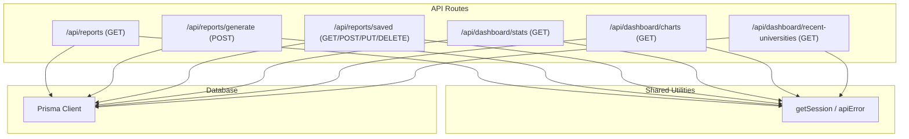
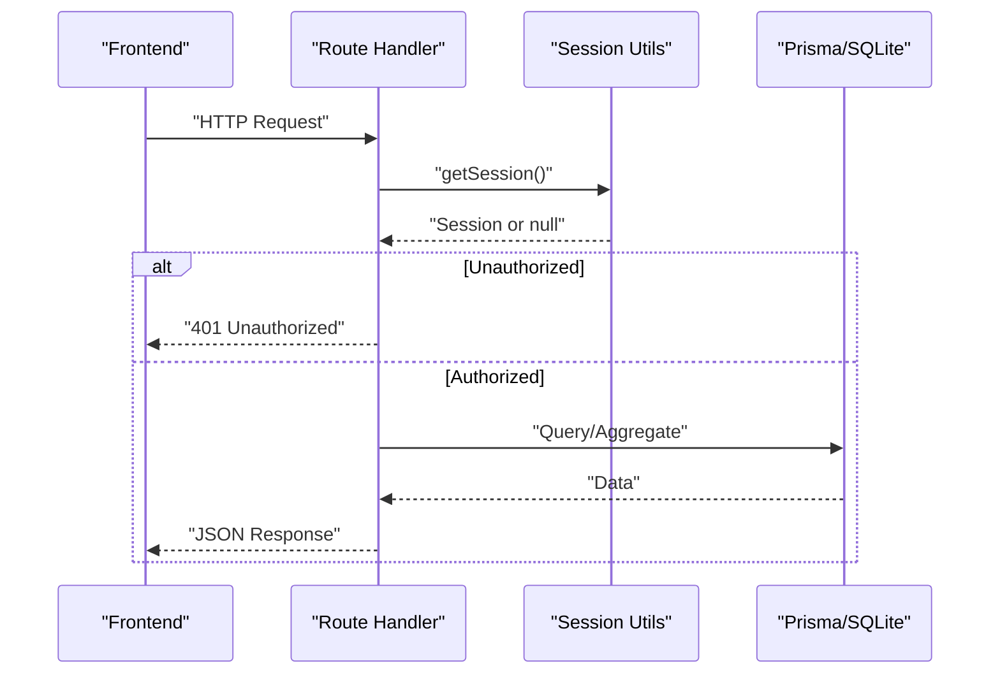
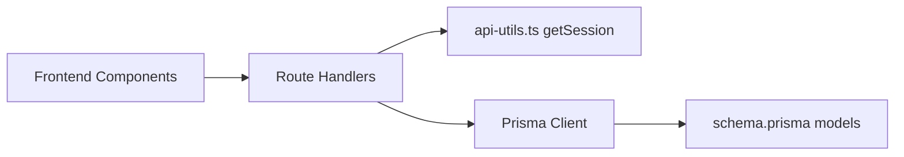

# Reporting & Analytics API

<cite>
**Referenced Files in This Document**
- [route.ts](file://src/app/api/reports/route.ts)
- [route.ts](file://src/app/api/reports/generate/route.ts)
- [route.ts](file://src/app/api/reports/saved/route.ts)
- [route.ts](file://src/app/api/dashboard/stats/route.ts)
- [route.ts](file://src/app/api/dashboard/charts/route.ts)
- [route.ts](file://src/app/api/dashboard/recent-universities/route.ts)
- [api-utils.ts](file://src/lib/api-utils.ts)
- [schema.prisma](file://prisma/schema.prisma)
- [ReportsContent.tsx](file://src/app/reports/components/ReportsContent.tsx)
- [ReportBuilderContent.tsx](file://src/app/reports/builder/ReportBuilderContent.tsx)
</cite>

## Table of Contents
1. Introduction
2. Project Structure
3. Core Components
4. Architecture Overview
5. Detailed Component Analysis
6. Dependency Analysis
7. Performance Considerations
8. Troubleshooting Guide
9. Conclusion
10. Appendices

## Introduction
This document provides comprehensive API documentation for reporting and analytics endpoints focused on data visualization, report generation, and dashboard statistics. It covers:
- Report creation and saved report management
- Chart data retrieval and dashboard statistics aggregation
- HTTP methods, URL patterns, request/response schemas, and authentication requirements
- Data filtering options and export behavior
- Real-time analytics considerations, KPI calculations, and performance metrics
- Practical examples for custom report generation, dashboard configuration, and data export operations

## Project Structure
The reporting and analytics features are implemented as Next.js Route Handlers under the app directory, with shared utilities for session handling and error responses. The database schema defines entities used by these endpoints.

**Diagram sources**
- [route.ts:1-149](file://src/app/api/reports/route.ts#L1-L149)
- [route.ts:1-99](file://src/app/api/reports/generate/route.ts#L1-L99)
- [route.ts:1-80](file://src/app/api/reports/saved/route.ts#L1-L80)
- [route.ts:1-79](file://src/app/api/dashboard/stats/route.ts#L1-L79)
- [route.ts:1-76](file://src/app/api/dashboard/charts/route.ts#L1-L76)
- [route.ts:1-40](file://src/app/api/dashboard/recent-universities/route.ts#L1-L40)
- [api-utils.ts:1-84](file://src/lib/api-utils.ts#L1-L84)

**Section sources**
- [route.ts:1-149](file://src/app/api/reports/route.ts#L1-L149)
- [route.ts:1-99](file://src/app/api/reports/generate/route.ts#L1-L99)
- [route.ts:1-80](file://src/app/api/reports/saved/route.ts#L1-L80)
- [route.ts:1-79](file://src/app/api/dashboard/stats/route.ts#L1-L79)
- [route.ts:1-76](file://src/app/api/dashboard/charts/route.ts#L1-L76)
- [route.ts:1-40](file://src/app/api/dashboard/recent-universities/route.ts#L1-L40)
- [api-utils.ts:1-84](file://src/lib/api-utils.ts#L1-L84)
- [schema.prisma:1-200](file://prisma/schema.prisma#L1-L200)

## Core Components
- Reports listing and export: GET /api/reports supports predefined report types with date range filtering and returns flattened rows suitable for export.
- Custom report generation: POST /api/reports/generate builds dynamic queries based on entity, fields, and filters, returning mapped results limited to a safe page size.
- Saved reports: CRUD endpoints under /api/reports/saved allow creating, updating, listing, and deleting saved report configurations.
- Dashboard statistics: GET /api/dashboard/stats aggregates key metrics across universities, courses, applications, leads, students, and tasks.
- Dashboard charts: GET /api/dashboard/charts returns chart-ready datasets for top universities by course count, faculty distribution, and enrollment trend.
- Recent universities: GET /api/dashboard/recent-universities returns a short list of recently added universities with UI-friendly formatting.

Authentication is enforced via session validation using getSession; unauthorized requests receive a 401 response.

**Section sources**
- [route.ts:28-149](file://src/app/api/reports/route.ts#L28-L149)
- [route.ts:7-99](file://src/app/api/reports/generate/route.ts#L7-L99)
- [route.ts:6-80](file://src/app/api/reports/saved/route.ts#L6-L80)
- [route.ts:6-79](file://src/app/api/dashboard/stats/route.ts#L6-L79)
- [route.ts:6-76](file://src/app/api/dashboard/charts/route.ts#L6-L76)
- [route.ts:6-40](file://src/app/api/dashboard/recent-universities/route.ts#L6-L40)
- [api-utils.ts:13-30](file://src/lib/api-utils.ts#L13-L30)

## Architecture Overview
The system follows a simple server-side route handler pattern:
- Each endpoint validates the session and constructs Prisma queries against the SQLite database.
- Responses are normalized JSON objects or arrays tailored for frontend consumption.
- Errors are logged and returned as standardized error payloads.

**Diagram sources**
- [api-utils.ts:13-30](file://src/lib/api-utils.ts#L13-L30)
- [route.ts:6-79](file://src/app/api/dashboard/stats/route.ts#L6-L79)
- [route.ts:6-76](file://src/app/api/dashboard/charts/route.ts#L6-L76)

## Detailed Component Analysis

### Reports Listing and Export
- Method: GET
- URL: /api/reports
- Query parameters:
  - type: one of "universities", "courses", "users", "applications", "payments"
  - startDate: optional ISO date string
  - endDate: optional ISO date string
- Authentication: Required (session-based)
- Behavior:
  - Validates session; returns 401 if missing
  - Applies date filtering where applicable
  - Returns flattened rows optimized for export
- Error handling: Logs errors and returns 500 with an error message

Example request:
- GET /api/reports?type=applications&startDate=2024-01-01&endDate=2024-01-31

Example response:
- Array of application records with keys such as Application ID, Student Name, University, Course, Status, Date Applied

Notes:
- For "courses", university name is flattened into a single field and raw JSON prerequisites are removed for cleaner exports.
- For "payments", proof links are included as strings.

**Section sources**
- [route.ts:28-149](file://src/app/api/reports/route.ts#L28-L149)

### Custom Report Generation
- Method: POST
- URL: /api/reports/generate
- Request body:
  - entity: one of "Student", "University", "Course", "Lead", "Payment", "Application"
  - fields: array of field names to include
  - filters: array of filter objects with field, op, value
  - chartType: ignored by backend but accepted in payload
- Supported filter operators:
  - contains: case-insensitive substring match
  - equals: exact match
  - gt: greater than (numeric coercion when possible)
  - lt: less than (numeric coercion when possible)
  - startsWith: case-insensitive prefix match
- Authentication: Required (session-based)
- Behavior:
  - Validates session; returns 401 if missing
  - Builds dynamic where clause from filters
  - Includes related entities selectively based on fields
  - Limits result set to 500 rows per query
  - Maps selected fields into a flat object per row
- Error handling: Logs errors and returns 500 with an error message

Example request:
- POST /api/reports/generate
- Body: { "entity": "Course", "fields": ["name","faculty","university"], "filters": [{ "field": "faculty", "op": "equals", "value": "Engineering" }] }

Example response:
- Array of course objects containing only requested fields with related names resolved

**Section sources**
- [route.ts:7-99](file://src/app/api/reports/generate/route.ts#L7-L99)

### Saved Reports Management
- Methods:
  - GET /api/reports/saved: List all saved reports ordered by updatedAt
  - POST /api/reports/saved: Create a new saved report
  - PUT /api/reports/saved: Update an existing saved report
  - DELETE /api/reports/saved?id={id}: Delete a saved report
- Authentication: Required (session-based)
- Request/response schemas:
  - POST body: { name, description, type?, config? }
  - PUT body: { id, name, description, config? }
  - DELETE query: id (number)
- Behavior:
  - Creates/updates/deletes entries in the savedReport table
  - Stores config as a JSON string
- Error handling: Logs errors and returns 500 with an error message

Example request:
- POST /api/reports/saved
- Body: { "name": "Monthly Courses", "description": "Courses created this month", "type": "tabular", "config": { "entity": "Course", "fields": ["name","faculty","createdAt"], "filters": [] } }

Example response:
- Created report object including id, name, description, type, config, createdBy

**Section sources**
- [route.ts:6-80](file://src/app/api/reports/saved/route.ts#L6-L80)

### Dashboard Statistics
- Method: GET
- URL: /api/dashboard/stats
- Authentication: Required (session-based)
- Aggregated metrics:
  - totalUniversities, universitiesLastMonth
  - totalCourses, coursesLastMonth
  - totalEnrolled (sum of enrolled across courses)
  - activeCourses
  - countriesCount (distinct university countries)
  - totalLeads, totalStudents, totalApplications, totalTasks
- Behavior:
  - Uses parallel queries to compute counts and aggregates
  - Computes last-month window relative to current date
- Error handling: Logs errors and returns 500 with an error message

Example response:
- Object containing the above metric keys with numeric values

**Section sources**
- [route.ts:6-79](file://src/app/api/dashboard/stats/route.ts#L6-L79)

### Dashboard Charts
- Method: GET
- URL: /api/dashboard/charts
- Authentication: Required (session-based)
- Returned datasets:
  - coursesPerUniversity: top 8 universities by course count with truncated names and colors
  - facultyDistribution: counts grouped by faculty with generated colors
  - coursesTrend: monthly counts derived from createdAt timestamps
- Behavior:
  - Uses groupBy and aggregate to build chart-ready structures
  - Applies take limits to control payload size
- Error handling: Logs errors and returns 500 with an error message

Example response:
- Object with three keys mapping to arrays of chart series

**Section sources**
- [route.ts:6-76](file://src/app/api/dashboard/charts/route.ts#L6-L76)

### Recent Universities
- Method: GET
- URL: /api/dashboard/recent-universities
- Authentication: Required (session-based)
- Behavior:
  - Retrieves up to 10 most recently created universities
  - Transforms dates and adds mock completion/assignees fields for UI consistency
- Error handling: Logs errors and returns 500 with an error message

Example response:
- Array of university objects with id, name, status, country, website, addedDate, completion, assignees

**Section sources**
- [route.ts:6-40](file://src/app/api/dashboard/recent-universities/route.ts#L6-L40)

## Dependency Analysis
- Session and auth: All endpoints rely on getSession() from api-utils.ts to enforce authentication.
- Database layer: All endpoints use Prisma Client to query the SQLite database defined in schema.prisma.
- Frontend integration:
  - ReportsContent.tsx calls /api/reports with type and date filters and exports results to Excel using client-side XLSX.
  - ReportBuilderContent.tsx calls /api/reports/generate and /api/reports/saved to build and persist custom reports.

**Diagram sources**
- [api-utils.ts:13-30](file://src/lib/api-utils.ts#L13-L30)
- [schema.prisma:1-200](file://prisma/schema.prisma#L1-L200)
- [ReportsContent.tsx:50-120](file://src/app/reports/components/ReportsContent.tsx#L50-L120)
- [ReportBuilderContent.tsx:112-179](file://src/app/reports/builder/ReportBuilderContent.tsx#L112-L179)

**Section sources**
- [api-utils.ts:13-30](file://src/lib/api-utils.ts#L13-L30)
- [schema.prisma:1-200](file://prisma/schema.prisma#L1-L200)
- [ReportsContent.tsx:50-120](file://src/app/reports/components/ReportsContent.tsx#L50-L120)
- [ReportBuilderContent.tsx:112-179](file://src/app/reports/builder/ReportBuilderContent.tsx#L112-L179)

## Performance Considerations
- Pagination and limits:
  - Custom report generation caps results at 500 rows per query to avoid large payloads.
  - Dashboard charts limit top results (e.g., top 8 universities).
- Query optimization:
  - Use specific select/include fields to reduce payload size.
  - Leverage Prisma groupBy and aggregate for efficient counting and sums.
- Date filtering:
  - Apply precise date ranges to minimize scan scope.
- Caching:
  - No server-side caching is implemented in these endpoints. Consider adding response caching or in-memory caches for frequently accessed dashboard stats if needed.
- Large dataset handling:
  - For very large tables, consider implementing pagination or streaming exports on the server side.
- Export format:
  - Exports are performed client-side using XLSX; ensure appropriate memory usage for large datasets.

[No sources needed since this section provides general guidance]

## Troubleshooting Guide
Common issues and resolutions:
- 401 Unauthorized:
  - Ensure a valid session cookie is present; getSession will return null otherwise.
- Invalid report type:
  - For /api/reports, ensure type is one of the supported values.
- Invalid entity:
  - For /api/reports/generate, ensure entity is one of the supported values.
- Missing required fields:
  - For /api/reports/generate, fields must be non-empty.
- Database errors:
  - Check logs for underlying Prisma or SQLite errors; endpoints log errors centrally.

**Section sources**
- [api-utils.ts:5-30](file://src/lib/api-utils.ts#L5-L30)
- [route.ts:139-149](file://src/app/api/reports/route.ts#L139-L149)
- [route.ts:12-15](file://src/app/api/reports/generate/route.ts#L12-L15)
- [route.ts:77-79](file://src/app/api/reports/generate/route.ts#L77-L79)

## Conclusion
The reporting and analytics APIs provide a robust foundation for generating reports, managing saved configurations, and retrieving dashboard metrics and charts. Authentication is consistently enforced, and endpoints are designed for clarity and efficiency. For production-scale usage, consider adding server-side caching, pagination for large exports, and more granular access controls beyond role checks.

[No sources needed since this section summarizes without analyzing specific files]

## Appendices

### API Reference Summary

- GET /api/reports
  - Purpose: Retrieve predefined reports with optional date filtering
  - Query params: type, startDate, endDate
  - Auth: Required
  - Response: Array of flattened report rows

- POST /api/reports/generate
  - Purpose: Generate custom reports based on entity, fields, and filters
  - Body: entity, fields[], filters[{field, op, value}], chartType
  - Auth: Required
  - Response: Array of mapped objects with selected fields

- GET /api/reports/saved
  - Purpose: List saved reports
  - Auth: Required
  - Response: Array of saved report objects

- POST /api/reports/saved
  - Purpose: Create a saved report
  - Body: name, description, type?, config?
  - Auth: Required
  - Response: Created report object

- PUT /api/reports/saved
  - Purpose: Update a saved report
  - Body: id, name, description, config?
  - Auth: Required
  - Response: Updated report object

- DELETE /api/reports/saved?id={id}
  - Purpose: Delete a saved report
  - Query: id
  - Auth: Required
  - Response: Success indicator

- GET /api/dashboard/stats
  - Purpose: Aggregate key dashboard metrics
  - Auth: Required
  - Response: Object with metric keys

- GET /api/dashboard/charts
  - Purpose: Retrieve chart-ready datasets
  - Auth: Required
  - Response: Object with chart series

- GET /api/dashboard/recent-universities
  - Purpose: Get recent universities for dashboards
  - Auth: Required
  - Response: Array of transformed university objects

**Section sources**
- [route.ts:28-149](file://src/app/api/reports/route.ts#L28-L149)
- [route.ts:7-99](file://src/app/api/reports/generate/route.ts#L7-L99)
- [route.ts:6-80](file://src/app/api/reports/saved/route.ts#L6-L80)
- [route.ts:6-79](file://src/app/api/dashboard/stats/route.ts#L6-L79)
- [route.ts:6-76](file://src/app/api/dashboard/charts/route.ts#L6-L76)
- [route.ts:6-40](file://src/app/api/dashboard/recent-universities/route.ts#L6-L40)

### Data Models Used by Endpoints
Key entities referenced by the endpoints include University, Course, User, Application, Payment, Lead, Task, and SavedReport. These are defined in the Prisma schema and influence available fields and relationships.

**Section sources**
- [schema.prisma:19-119](file://prisma/schema.prisma#L19-L119)
- [schema.prisma:139-198](file://prisma/schema.prisma#L139-L198)

### Frontend Integration Notes
- ReportsContent.tsx demonstrates fetching reports with date filters and exporting to Excel client-side.
- ReportBuilderContent.tsx shows building custom reports, saving configurations, and loading previously saved reports.

**Section sources**
- [ReportsContent.tsx:50-120](file://src/app/reports/components/ReportsContent.tsx#L50-L120)
- [ReportBuilderContent.tsx:112-179](file://src/app/reports/builder/ReportBuilderContent.tsx#L112-L179)