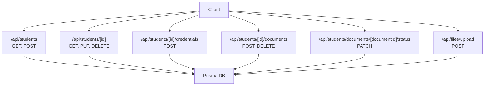
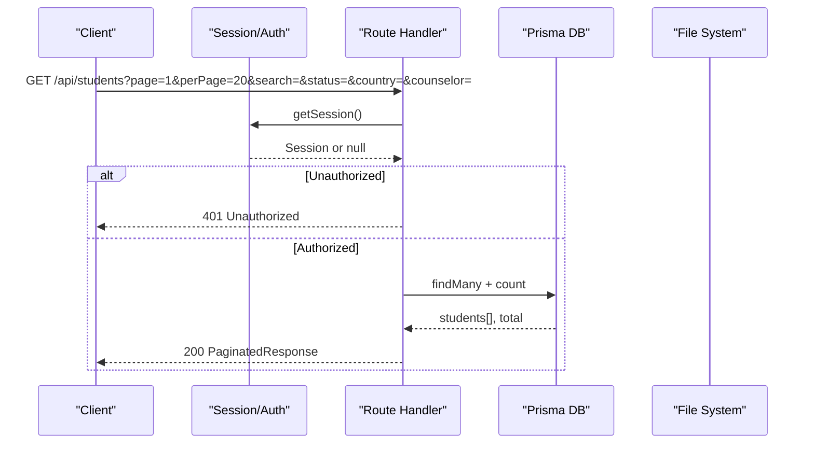
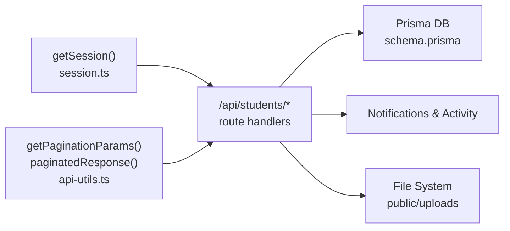

# Student Management API

<cite>
**Referenced Files in This Document**
- [route.ts](file://src/app/api/students/route.ts)
- [route.ts](file://src/app/api/students/[id]/route.ts)
- [route.ts](file://src/app/api/students/[id]/credentials/route.ts)
- [route.ts](file://src/app/api/students/[id]/documents/route.ts)
- [route.ts](file://src/app/api/students/documents/[documentId]/status/route.ts)
- [route.ts](file://src/app/api/files/upload/route.ts)
- [api-utils.ts](file://src/lib/api-utils.ts)
- [session.ts](file://src/lib/session.ts)
- [schema.prisma](file://prisma/schema.prisma)
</cite>

## Table of Contents
1. [Introduction](#introduction)
2. [Project Structure](#project-structure)
3. [Core Components](#core-components)
4. [Architecture Overview](#architecture-overview)
5. [Detailed Component Analysis](#detailed-component-analysis)
6. [Dependency Analysis](#dependency-analysis)
7. [Performance Considerations](#performance-considerations)
8. [Troubleshooting Guide](#troubleshooting-guide)
9. [Conclusion](#conclusion)

## Introduction
This document provides detailed API documentation for student management endpoints focused on CRUD operations for student records and related data. It covers:
- Student profile management (create, read, update, delete)
- Academic history tracking via student documents
- Document upload and verification workflows
- Credential management (password generation and updates)
- Student status updates
- Filtering, sorting, and pagination for student queries
- Authentication requirements, validation rules, business constraints, and error handling patterns

The API is implemented as Next.js App Router route handlers using Prisma for database access and JWT-based session authentication.

## Project Structure
Student-related endpoints are organized under the app router with clear separation of concerns:
- Students list and creation: /api/students
- Single student operations: /api/students/[id]
- Student credentials: /api/students/[id]/credentials
- Student documents: /api/students/[id]/documents
- Document status updates: /api/students/documents/[documentId]/status
- File uploads: /api/files/upload

**Diagram sources**
- [route.ts:9-58](file://src/app/api/students/route.ts#L9-L58)
- [route.ts:61-213](file://src/app/api/students/route.ts#L61-L213)
- [route.ts:11-37](file://src/app/api/students/[id]/route.ts#L11-L37)
- [route.ts:39-214](file://src/app/api/students/[id]/route.ts#L39-L214)
- [route.ts:216-244](file://src/app/api/students/[id]/route.ts#L216-L244)
- [route.ts:7-71](file://src/app/api/students/[id]/credentials/route.ts#L7-L71)
- [route.ts:6-46](file://src/app/api/students/[id]/documents/route.ts#L6-L46)
- [route.ts:48-85](file://src/app/api/students/[id]/documents/route.ts#L48-L85)
- [route.ts:6-49](file://src/app/api/students/documents/[documentId]/status/route.ts#L6-L49)
- [route.ts:86-191](file://src/app/api/files/upload/route.ts#L86-L191)

**Section sources**
- [route.ts:9-58](file://src/app/api/students/route.ts#L9-L58)
- [route.ts:61-213](file://src/app/api/students/route.ts#L61-L213)
- [route.ts:11-37](file://src/app/api/students/[id]/route.ts#L11-L37)
- [route.ts:39-214](file://src/app/api/students/[id]/route.ts#L39-L214)
- [route.ts:216-244](file://src/app/api/students/[id]/route.ts#L216-L244)
- [route.ts:7-71](file://src/app/api/students/[id]/credentials/route.ts#L7-L71)
- [route.ts:6-46](file://src/app/api/students/[id]/documents/route.ts#L6-L46)
- [route.ts:48-85](file://src/app/api/students/[id]/documents/route.ts#L48-L85)
- [route.ts:6-49](file://src/app/api/students/documents/[documentId]/status/route.ts#L6-L49)
- [route.ts:86-191](file://src/app/api/files/upload/route.ts#L86-L191)

## Core Components
- Authentication and sessions: JWT-based session retrieval and verification
- Pagination utilities: standardized page/per-page/search/skip handling and paginated responses
- Database models: Student, StudentDocument, AcademicDocument, User, Partner
- Activity logging and notifications: audit trails and system notifications

Key responsibilities:
- Enforce role-based authorization for write operations
- Validate inputs and enforce business rules
- Persist changes to the database via Prisma
- Return consistent success/error responses
- Log activities and emit notifications where applicable

**Section sources**
- [api-utils.ts:13-52](file://src/lib/api-utils.ts#L13-L52)
- [api-utils.ts:71-83](file://src/lib/api-utils.ts#L71-L83)
- [session.ts:19-36](file://src/lib/session.ts#L19-L36)
- [schema.prisma:334-409](file://prisma/schema.prisma#L334-L409)
- [schema.prisma:456-486](file://prisma/schema.prisma#L456-L486)

## Architecture Overview
The student management API follows a layered approach:
- Route handlers handle HTTP requests, parse parameters, and enforce authz/authn
- Business logic interacts with Prisma to query/update data
- Shared utilities provide session handling, pagination, and error formatting
- File uploads are handled by a dedicated endpoint that validates file types and sizes, then persists files and metadata

**Diagram sources**
- [route.ts:9-58](file://src/app/api/students/route.ts#L9-L58)
- [api-utils.ts:13-52](file://src/lib/api-utils.ts#L13-L52)

**Section sources**
- [route.ts:9-58](file://src/app/api/students/route.ts#L9-L58)
- [api-utils.ts:13-52](file://src/lib/api-utils.ts#L13-L52)

## Detailed Component Analysis

### Students List and Create
- Endpoint: GET /api/students
  - Purpose: Retrieve paginated list of students with optional filters
  - Authentication: Required (session must exist)
  - Query parameters:
    - page: integer >= 1 (default 1)
    - perPage: integer 1..100 (default 20)
    - search: string; case-insensitive match against name, email, phone, passportNumber
    - status: string; if omitted, excludes deleted students
    - country: string; filter by interestedCountry
    - counselor: string; filter by counselor
  - Response: PaginatedResponse with data array and total count
  - Notes: Includes documents and partner summary; counts documents per student

- Endpoint: POST /api/students
  - Purpose: Create a new student record and optionally create or update a linked user account
  - Authentication: Required; roles Admin, Super Admin, Staff
  - Request body fields (selected):
    - name or firstName + lastName (required)
    - email (unique), admissionEmail, phone, whatsappNumber
    - gender, dob, dobAd, dobBs, nationality, maritalStatus
    - photoUrl, address, permanent/temporary location fields
    - passport details: number, nationality, issue/expiry dates, issue place
    - education, workExperience, training (JSON strings or arrays)
    - testType, overallScore, reading/writing/listening/speaking scores, moi, testDate, testRegNumber
    - studyLevel, intakeTerm, major, interestedCountry, targetUniversities
    - spouseName, childrenDetails (JSON), guardian info
    - status, statusColor, initials, color, university, country, lastActivity, counselor, lead, branchId, partnerId
    - documents: array of { type, name, url, status } to create initial documents
  - Behavior:
    - Password hashing for studentPassword
    - Creates or updates linked User with role Student
    - Emits notification and logs activity
  - Response: Created student object plus generated password when auto-generated

**Section sources**
- [route.ts:9-58](file://src/app/api/students/route.ts#L9-L58)
- [route.ts:61-213](file://src/app/api/students/route.ts#L61-L213)
- [api-utils.ts:39-52](file://src/lib/api-utils.ts#L39-L52)
- [api-utils.ts:71-83](file://src/lib/api-utils.ts#L71-L83)

### Single Student Operations
- Endpoint: GET /api/students/[id]
  - Purpose: Retrieve a single student with associated documents and partner info
  - Authentication: Required
  - Response: Student object including documents (with academicDocument references) and partner

- Endpoint: PUT /api/students/[id]
  - Purpose: Update student fields selectively
  - Authentication: Required; roles Admin, Super Admin, Staff
  - Request body: Any subset of scalar fields defined in handler; complex JSON fields supported
  - Behavior:
    - Hashes studentPassword if provided
    - Reconstructs name from firstName/lastName if provided
    - Supports creating documents via nested documents array
    - Logs diffed changes and emits notification on name change
    - Updates linked User password if changed

- Endpoint: DELETE /api/students/[id]
  - Purpose: Soft-delete a student (move to trash)
  - Authentication: Required; roles Admin, Super Admin
  - Response: Success indicator

**Section sources**
- [route.ts:11-37](file://src/app/api/students/[id]/route.ts#L11-L37)
- [route.ts:39-214](file://src/app/api/students/[id]/route.ts#L39-L214)
- [route.ts:216-244](file://src/app/api/students/[id]/route.ts#L216-L244)

### Student Credentials Management
- Endpoint: POST /api/students/[id]/credentials
  - Purpose: Generate a new random password for a student and sync it to the linked User
  - Authentication: Required; roles Admin, Super Admin
  - Behavior:
    - Generates secure random password
    - Hashes and stores in student record
    - Creates or updates linked User with role Student
    - Logs activity
  - Response: Success flag, generated password, email, and name

**Section sources**
- [route.ts:7-71](file://src/app/api/students/[id]/credentials/route.ts#L7-L71)

### Student Documents
- Endpoint: POST /api/students/[id]/documents
  - Purpose: Create a student document record (metadata only)
  - Authentication: Required
  - Request body: name, url, fileSize (optional), fileType (optional)
  - Behavior: Sets default status "In Review"; logs activity
  - Response: Created document

- Endpoint: DELETE /api/students/[id]/documents?documentId=...
  - Purpose: Delete a specific student document
  - Authentication: Required
  - Query parameter: documentId
  - Behavior: Deletes record and logs activity if found
  - Response: Success indicator

- Endpoint: PATCH /api/students/documents/[documentId]/status
  - Purpose: Update document verification status
  - Authentication: Required; roles Admin, Super Admin
  - Request body: status (Approved, Rejected, In Review)
  - Behavior: Validates allowed statuses; logs diffed changes
  - Response: Updated document

**Section sources**
- [route.ts:6-46](file://src/app/api/students/[id]/documents/route.ts#L6-L46)
- [route.ts:48-85](file://src/app/api/students/[id]/documents/route.ts#L48-L85)
- [route.ts:6-49](file://src/app/api/students/documents/[documentId]/status/route.ts#L6-L49)

### File Uploads
- Endpoint: POST /api/files/upload
  - Purpose: Upload files and persist them to disk; associate with student or folder
  - Authentication: Required (JWT token)
  - Query parameter: folderId
    - For student uploads: folderId must be prefixed with "student_" followed by student id
  - Form fields:
    - file: binary file
    - academicDocumentId: optional; links uploaded file to an academic document
  - Validation:
    - Max file size: 20MB
    - Allowed MIME types include PDF, images, Office docs, spreadsheets, text, CSV, ZIP
  - Behavior:
    - Sanitizes filenames and ensures uniqueness
    - Writes file to public/uploads directory
    - Creates StudentDocument or FileItem record accordingly
  - Response: Uploaded document/file metadata with URL

**Section sources**
- [route.ts:86-191](file://src/app/api/files/upload/route.ts#L86-L191)

## Dependency Analysis
- Authentication dependency: All protected routes rely on getSession() which verifies JWT tokens stored in cookies
- Pagination dependency: getPaginationParams and paginatedResponse standardize query parsing and response shape
- Database dependencies: Prisma models define relationships between Student, StudentDocument, AcademicDocument, User, and Partner
- File storage dependency: Uploads depend on filesystem writes and URL mapping under public/uploads

**Diagram sources**
- [api-utils.ts:13-52](file://src/lib/api-utils.ts#L13-L52)
- [api-utils.ts:71-83](file://src/lib/api-utils.ts#L71-L83)
- [session.ts:19-36](file://src/lib/session.ts#L19-L36)
- [schema.prisma:334-409](file://prisma/schema.prisma#L334-L409)
- [schema.prisma:456-486](file://prisma/schema.prisma#L456-L486)

**Section sources**
- [api-utils.ts:13-52](file://src/lib/api-utils.ts#L13-L52)
- [api-utils.ts:71-83](file://src/lib/api-utils.ts#L71-L83)
- [session.ts:19-36](file://src/lib/session.ts#L19-L36)
- [schema.prisma:334-409](file://prisma/schema.prisma#L334-L409)
- [schema.prisma:456-486](file://prisma/schema.prisma#L456-L486)

## Performance Considerations
- Use pagination for large datasets; default perPage is capped at 100 to prevent heavy queries
- Include only necessary relations in queries to reduce payload size
- Filter early using query parameters (status, country, counselor) to minimize result sets
- Avoid unnecessary includes; fetch full student detail only when needed
- For file uploads, enforce strict size limits and allowlist MIME types to avoid expensive processing

[No sources needed since this section provides general guidance]

## Troubleshooting Guide
Common errors and resolutions:
- Unauthorized (401): Missing or invalid JWT token; ensure cookie auth_token is present and valid
- Forbidden (403): Insufficient role; required roles vary by endpoint (e.g., Admin/Super Admin for deletions and credential generation)
- Validation errors (400):
  - Name required when creating/updating students
  - Document name and URL required when adding documents
  - Invalid document status values
  - Missing folderId for uploads
  - File too large (>20MB) or unsupported MIME type
- Not Found (404): Student or document not found
- Conflict (400): Email already exists when creating a student
- Server errors (500): Unexpected exceptions; check server logs

Operational notes:
- Activity logs and notifications are emitted for key actions; verify these for auditability
- Soft deletes move students to trash; use trash restore/purge endpoints outside this scope to recover

**Section sources**
- [route.ts:9-58](file://src/app/api/students/route.ts#L9-L58)
- [route.ts:61-213](file://src/app/api/students/route.ts#L61-L213)
- [route.ts:11-37](file://src/app/api/students/[id]/route.ts#L11-L37)
- [route.ts:39-214](file://src/app/api/students/[id]/route.ts#L39-L214)
- [route.ts:216-244](file://src/app/api/students/[id]/route.ts#L216-L244)
- [route.ts:7-71](file://src/app/api/students/[id]/credentials/route.ts#L7-L71)
- [route.ts:6-46](file://src/app/api/students/[id]/documents/route.ts#L6-L46)
- [route.ts:48-85](file://src/app/api/students/[id]/documents/route.ts#L48-L85)
- [route.ts:6-49](file://src/app/api/students/documents/[documentId]/status/route.ts#L6-L49)
- [route.ts:86-191](file://src/app/api/files/upload/route.ts#L86-L191)

## Conclusion
The Student Management API provides comprehensive CRUD capabilities for student records, robust document handling, and secure credential management. It enforces strong authentication and role-based authorization, supports flexible filtering and pagination, and integrates file uploads with validation and safe storage practices. The design emphasizes auditability through activity logging and notifications, ensuring traceability for administrative actions.

[No sources needed since this section summarizes without analyzing specific files]