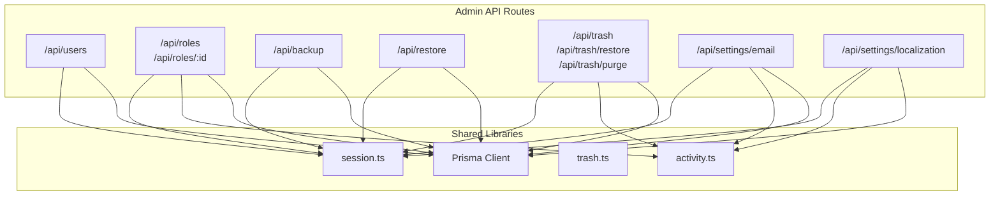
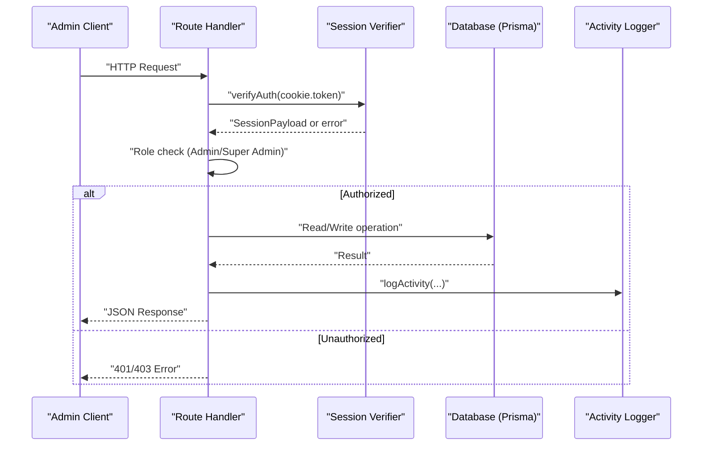
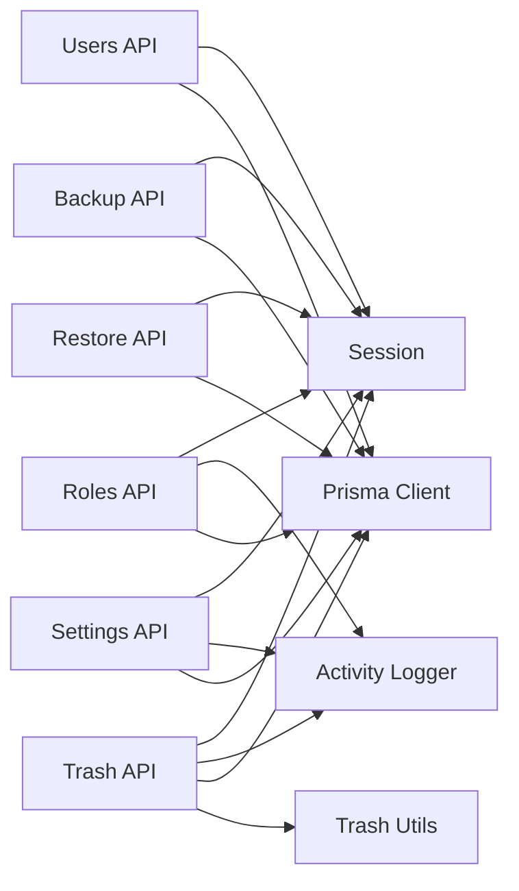

# System Administration API

<cite>
**Referenced Files in This Document**
- [route.ts](file://src/app/api/users/route.ts)
- [route.ts](file://src/app/api/roles/route.ts)
- [route.ts](file://src/app/api/roles/[id]/route.ts)
- [route.ts](file://src/app/api/backup/route.ts)
- [route.ts](file://src/app/api/restore/route.ts)
- [route.ts](file://src/app/api/trash/route.ts)
- [route.ts](file://src/app/api/trash/restore/route.ts)
- [route.ts](file://src/app/api/trash/purge/route.ts)
- [route.ts](file://src/app/api/settings/email/route.ts)
- [route.ts](file://src/app/api/settings/localization/route.ts)
- [session.ts](file://src/lib/session.ts)
- [activity.ts](file://src/lib/activity.ts)
- [trash.ts](file://src/lib/trash.ts)
- [schema.prisma](file://prisma/schema.prisma)
</cite>

## Table of Contents
1. [Introduction](#introduction)
2. [Project Structure](#project-structure)
3. [Core Components](#core-components)
4. [Architecture Overview](#architecture-overview)
5. [Detailed Component Analysis](#detailed-component-analysis)
6. [Dependency Analysis](#dependency-analysis)
7. [Performance Considerations](#performance-considerations)
8. [Troubleshooting Guide](#troubleshooting-guide)
9. [Conclusion](#conclusion)
10. [Appendices](#appendices)

## Introduction
This document provides comprehensive API documentation for system administration endpoints focused on user management, role-based access control, system settings, backup and restore operations, and trash management. It covers HTTP methods, URL patterns, request/response schemas, authentication requirements, security policies, audit logging, and operational best practices. Practical examples are included to guide administrators through user provisioning, permission assignment, and maintenance tasks.

## Project Structure
The administrative APIs are implemented as Next.js Route Handlers under src/app/api. Authentication is handled via JWT tokens stored in cookies and verified using a shared session utility. Audit logging is centralized in an activity module. Backup and restore use encryption utilities and Prisma transactions to ensure data integrity. Trash management supports soft deletes with expiration and restoration workflows.

**Diagram sources**
- [route.ts:1-42](file://src/app/api/users/route.ts#L1-L42)
- [route.ts:1-92](file://src/app/api/roles/route.ts#L1-L92)
- [route.ts:1-89](file://src/app/api/roles/[id]/route.ts#L1-L89)
- [route.ts:1-202](file://src/app/api/backup/route.ts#L1-L202)
- [route.ts:1-265](file://src/app/api/restore/route.ts#L1-L265)
- [route.ts:1-37](file://src/app/api/trash/route.ts#L1-L37)
- [route.ts:1-32](file://src/app/api/trash/restore/route.ts#L1-L32)
- [route.ts:1-40](file://src/app/api/trash/purge/route.ts#L1-L40)
- [route.ts:1-155](file://src/app/api/settings/email/route.ts#L1-L155)
- [route.ts:1-118](file://src/app/api/settings/localization/route.ts#L1-L118)
- [session.ts:1-37](file://src/lib/session.ts#L1-L37)
- [activity.ts:1-114](file://src/lib/activity.ts#L1-L114)
- [trash.ts:1-118](file://src/lib/trash.ts#L1-L118)

**Section sources**
- [route.ts:1-42](file://src/app/api/users/route.ts#L1-L42)
- [route.ts:1-92](file://src/app/api/roles/route.ts#L1-L92)
- [route.ts:1-89](file://src/app/api/roles/[id]/route.ts#L1-L89)
- [route.ts:1-202](file://src/app/api/backup/route.ts#L1-L202)
- [route.ts:1-265](file://src/app/api/restore/route.ts#L1-L265)
- [route.ts:1-37](file://src/app/api/trash/route.ts#L1-L37)
- [route.ts:1-32](file://src/app/api/trash/restore/route.ts#L1-L32)
- [route.ts:1-40](file://src/app/api/trash/purge/route.ts#L1-L40)
- [route.ts:1-155](file://src/app/api/settings/email/route.ts#L1-L155)
- [route.ts:1-118](file://src/app/api/settings/localization/route.ts#L1-L118)
- [session.ts:1-37](file://src/lib/session.ts#L1-L37)
- [activity.ts:1-114](file://src/lib/activity.ts#L1-L114)
- [trash.ts:1-118](file://src/lib/trash.ts#L1-L118)

## Core Components
- Authentication: JWT-based session verification from cookie token; roles enforced at route level.
- Roles and Permissions: CRUD for roles with permissions arrays; admin-only access.
- Users: List users with minimal fields; requires authentication.
- Settings: Email configuration and localization settings with audit logging.
- Backup/Restore: Export all or selected tables with optional encryption; import with strict validation and transactional restore.
- Trash: Soft delete tracking, restore, and purge of expired items.

**Section sources**
- [session.ts:1-37](file://src/lib/session.ts#L1-L37)
- [route.ts:1-92](file://src/app/api/roles/route.ts#L1-L92)
- [route.ts:1-89](file://src/app/api/roles/[id]/route.ts#L1-L89)
- [route.ts:1-42](file://src/app/api/users/route.ts#L1-L42)
- [route.ts:1-155](file://src/app/api/settings/email/route.ts#L1-L155)
- [route.ts:1-118](file://src/app/api/settings/localization/route.ts#L1-L118)
- [route.ts:1-202](file://src/app/api/backup/route.ts#L1-L202)
- [route.ts:1-265](file://src/app/api/restore/route.ts#L1-L265)
- [route.ts:1-37](file://src/app/api/trash/route.ts#L1-L37)
- [route.ts:1-32](file://src/app/api/trash/restore/route.ts#L1-L32)
- [route.ts:1-40](file://src/app/api/trash/purge/route.ts#L1-L40)
- [activity.ts:1-114](file://src/lib/activity.ts#L1-L114)
- [trash.ts:1-118](file://src/lib/trash.ts#L1-L118)

## Architecture Overview
Administrative endpoints follow a consistent pattern:
- Extract and verify JWT from cookie.
- Enforce role-based authorization (Admin/Super Admin).
- Perform business logic via Prisma client.
- Log significant actions to activity logs.
- Return standardized JSON responses.

**Diagram sources**
- [route.ts:1-92](file://src/app/api/roles/route.ts#L1-L92)
- [route.ts:1-89](file://src/app/api/roles/[id]/route.ts#L1-L89)
- [route.ts:1-202](file://src/app/api/backup/route.ts#L1-L202)
- [route.ts:1-265](file://src/app/api/restore/route.ts#L1-L265)
- [route.ts:1-37](file://src/app/api/trash/route.ts#L1-L37)
- [route.ts:1-32](file://src/app/api/trash/restore/route.ts#L1-L32)
- [route.ts:1-40](file://src/app/api/trash/purge/route.ts#L1-L40)
- [route.ts:1-155](file://src/app/api/settings/email/route.ts#L1-L155)
- [route.ts:1-118](file://src/app/api/settings/localization/route.ts#L1-L118)
- [session.ts:1-37](file://src/lib/session.ts#L1-L37)
- [activity.ts:1-114](file://src/lib/activity.ts#L1-L114)

## Detailed Component Analysis

### User Management API
- GET /api/users
  - Purpose: List users with basic profile fields.
  - Auth: Requires valid JWT in cookie.
  - Response: Array of user objects (id, name, email, role, avatar).
  - Errors: 401 if unauthorized; 500 on server errors.

Example usage:
- Request: GET /api/users with cookie containing auth_token.
- Response: [{ id: number, name: string, email: string, role: string, avatar?: string }, ...]

Security considerations:
- Ensure cookie transport is secure (HTTPS).
- Limit exposed fields to non-sensitive data.

**Section sources**
- [route.ts:1-42](file://src/app/api/users/route.ts#L1-L42)
- [session.ts:1-37](file://src/lib/session.ts#L1-L37)

### Role and Permission Management API
- GET /api/roles
  - Purpose: Retrieve roles with parsed permissions and active user counts per role.
  - Auth: Requires Admin or Super Admin.
  - Response: Array of roles with permissions array and userCount.

- POST /api/roles
  - Purpose: Create a new role with name, description, color, and permissions.
  - Auth: Requires Admin or Super Admin.
  - Request body: { name, description?, color?, permissions[] }
  - Response: Created role with permissions array and userCount=0.
  - Validation: Name required; duplicate names return 400.

- PUT /api/roles/:id
  - Purpose: Update role attributes including permissions.
  - Auth: Requires Admin or Super Admin.
  - Request body: { name?, description?, color?, permissions? }
  - Response: Updated role with permissions array and userCount=0.
  - Audit: Logs changes excluding permissions diff.

- DELETE /api/roles/:id
  - Purpose: Delete a role by ID.
  - Auth: Requires Admin or Super Admin.
  - Response: { success: true }
  - Audit: Logs deletion.

Example usage:
- Create role: POST /api/roles with { name: "Counselor", permissions: ["student.view", "application.manage"] }.
- Update role: PUT /api/roles/1 with { permissions: ["student.view", "application.manage", "report.export"] }.

Security considerations:
- Restrict role mutations to Admin/Super Admin.
- Validate permissions arrays to prevent injection.

**Section sources**
- [route.ts:1-92](file://src/app/api/roles/route.ts#L1-L92)
- [route.ts:1-89](file://src/app/api/roles/[id]/route.ts#L1-L89)
- [activity.ts:1-114](file://src/lib/activity.ts#L1-L114)

### System Settings API

#### Email Settings
- GET /api/settings/email
  - Purpose: Retrieve email configurations (global and branch-specific), masking passwords.
  - Auth: Requires Admin or Super Admin.
  - Response: Array of email settings with masked smtpPass.

- POST /api/settings/email
  - Purpose: Create or update email settings.
  - Auth: Requires Admin or Super Admin.
  - Request body: { id?, type, branchId?, smtpHost, smtpPort, smtpUser, smtpPass, smtpEncryption, fromEmail, fromName, isActive }
  - Validation: Required fields include smtpHost, smtpUser, fromEmail.
  - Behavior: Prevents duplicate global or branch settings; preserves existing password when masked value sent back.
  - Audit: Logs creation/deletion.

- DELETE /api/settings/email?id=:id
  - Purpose: Delete an email setting by ID.
  - Auth: Requires Admin or Super Admin.
  - Response: { success: true }
  - Audit: Logs deletion.

Example usage:
- Create global SMTP: POST /api/settings/email with { type: "Global", smtpHost: "smtp.example.com", smtpPort: 587, smtpUser: "admin@example.com", smtpPass: "secret", fromEmail: "noreply@example.com", fromName: "Unitrack", isActive: true }.

Security considerations:
- Mask sensitive fields in responses.
- Validate SMTP parameters to avoid misconfiguration.

**Section sources**
- [route.ts:1-155](file://src/app/api/settings/email/route.ts#L1-L155)
- [activity.ts:1-114](file://src/lib/activity.ts#L1-L114)

#### Localization Settings
- GET /api/settings/localization
  - Purpose: Fetch system localization settings and enabled modules; sets a cookie for frontend.
  - Auth: Requires valid JWT in cookie.
  - Response: { country, currencyCode, phoneCode, language, showBSDate, enabledModules }

- POST /api/settings/localization
  - Purpose: Upsert localization settings and enabled modules; notifies current user and logs changes.
  - Auth: Requires valid JWT in cookie.
  - Request body: { country, currencyCode, phoneCode, language, enableBranches?, showBSDate?, officeLatitude?, officeLongitude?, officeRadius?, enabledModules }
  - Response: Updated settings; may set enabled_modules cookie.

Example usage:
- Update localization: POST /api/settings/localization with { country: "Nepal", currencyCode: "NPR", language: "English", showBSDate: true, enabledModules: ["students", "applications"] }.

Security considerations:
- Use HTTPS for cookie transmission.
- Validate numeric fields for coordinates and radius.

**Section sources**
- [route.ts:1-118](file://src/app/api/settings/localization/route.ts#L1-L118)
- [activity.ts:1-114](file://src/lib/activity.ts#L1-L114)

### Backup and Restore API

#### Backup
- GET /api/backup
  - Purpose: Export database contents into a structured JSON file; supports selective table export and optional encryption.
  - Auth: Requires Admin or Super Admin.
  - Query params:
    - tables: Comma-separated list of table names to include.
    - password: Optional encryption password.
  - Response: JSON file attachment with version, timestamp, and data object containing arrays per table.
  - Encryption: If password provided, response body is encrypted payload.

Example usage:
- Full backup: GET /api/backup?password=SecretKey.
- Selective backup: GET /api/backup?tables=users,roles,emailSettings&password=SecretKey.

Operational notes:
- Large backups may be slow; consider scheduling during off-peak hours.
- Store backups securely; restrict access to authorized admins only.

**Section sources**
- [route.ts:1-202](file://src/app/api/backup/route.ts#L1-L202)

#### Restore
- POST /api/restore
  - Purpose: Import data from a backup file with strict validation and transactional restore.
  - Auth: Requires Admin or Super Admin.
  - Request body:
    - Standard format: { version, timestamp, data: { [table]: [...] } }
    - Encrypted format: { encrypted: true, password, selectedTables? }
  - Validation:
    - Allowed tables whitelist enforced.
    - Data keys must match allowed tables and contain arrays.
    - Payload size limit enforced (50MB).
  - Process:
    - Deletes existing data in reverse dependency order.
    - Re-inserts data in correct dependency order within a single transaction.
  - Response: { success: true, message: "Data restored successfully" }

Example usage:
- Restore full backup: POST /api/restore with { version: "2.0", timestamp: "...", data: { universities: [...], students: [...], ... } }.
- Restore encrypted backup: POST /api/restore with { encrypted: true, password: "SecretKey", selectedTables: ["users", "roles"] }.

Disaster recovery procedures:
- Always create a backup before restore.
- Validate backup integrity prior to restore.
- Use selectedTables to minimize downtime and risk.

**Section sources**
- [route.ts:1-265](file://src/app/api/restore/route.ts#L1-L265)

### Trash Management API

#### List Trash Items
- GET /api/trash
  - Purpose: Retrieve recently deleted items pending restoration or purge; triggers background purge of expired items.
  - Auth: Requires valid JWT in cookie.
  - Query params:
    - type: Filter by entityType.
    - search: Filter by entityName (case-insensitive contains).
  - Response: { items: [...], total: number }

Example usage:
- List all: GET /api/trash.
- Filter by type: GET /api/trash?type=Student&search=john.

**Section sources**
- [route.ts:1-37](file://src/app/api/trash/route.ts#L1-L37)
- [trash.ts:1-118](file://src/lib/trash.ts#L1-L118)

#### Restore Item
- POST /api/trash/restore
  - Purpose: Restore a specific deleted item by trash item ID.
  - Auth: Requires Admin or Super Admin.
  - Request body: { id: number }
  - Response: { success: true, item: {...} }
  - Audit: Logs restoration with target details.

Example usage:
- Restore student: POST /api/trash/restore with { id: 123 }.

**Section sources**
- [route.ts:1-32](file://src/app/api/trash/restore/route.ts#L1-L32)
- [activity.ts:1-114](file://src/lib/activity.ts#L1-L114)

#### Purge Expired Trash
- POST /api/trash/purge
  - Purpose: Permanently delete expired trash items and optionally purge additional counts by type.
  - Auth: Requires Admin or Super Admin.
  - Request body: { counts?: { [entityType]: number } }
  - Response: { success: true, purged: number }
  - Audit: Logs purge action with target summary.

Example usage:
- Purge expired: POST /api/trash/purge.
- Purge specific types: POST /api/trash/purge with { counts: { Student: 5, University: 2 } }.

**Section sources**
- [route.ts:1-40](file://src/app/api/trash/purge/route.ts#L1-L40)
- [activity.ts:1-114](file://src/lib/activity.ts#L1-L114)

### Security Policies and Audit Logging
- Authentication:
  - JWT secret required; tokens signed with HS256 and expire after 24 hours.
  - Cookie-based token storage; verifyAuth validates tokens.
- Authorization:
  - Role checks enforce Admin/Super Admin for sensitive operations.
- Audit Logging:
  - Centralized logging captures actor, action, target, and optional changes.
  - Notifications created for important actions like creation, invitation, and deletion.

Best practices:
- Rotate JWT_SECRET regularly.
- Enforce HTTPS for cookie transmission.
- Limit exposure of sensitive fields in responses.
- Regularly review activity logs for anomalies.

**Section sources**
- [session.ts:1-37](file://src/lib/session.ts#L1-L37)
- [activity.ts:1-114](file://src/lib/activity.ts#L1-L114)

## Dependency Analysis
The administrative APIs depend on:
- Session verification for authentication.
- Prisma client for data access across multiple models.
- Activity logger for audit trails and notifications.
- Trash utilities for soft delete and restoration workflows.

**Diagram sources**
- [route.ts:1-42](file://src/app/api/users/route.ts#L1-L42)
- [route.ts:1-92](file://src/app/api/roles/route.ts#L1-L92)
- [route.ts:1-202](file://src/app/api/backup/route.ts#L1-L202)
- [route.ts:1-265](file://src/app/api/restore/route.ts#L1-L265)
- [route.ts:1-37](file://src/app/api/trash/route.ts#L1-L37)
- [route.ts:1-32](file://src/app/api/trash/restore/route.ts#L1-L32)
- [route.ts:1-40](file://src/app/api/trash/purge/route.ts#L1-L40)
- [route.ts:1-155](file://src/app/api/settings/email/route.ts#L1-L155)
- [route.ts:1-118](file://src/app/api/settings/localization/route.ts#L1-L118)
- [session.ts:1-37](file://src/lib/session.ts#L1-L37)
- [activity.ts:1-114](file://src/lib/activity.ts#L1-L114)
- [trash.ts:1-118](file://src/lib/trash.ts#L1-L118)

**Section sources**
- [route.ts:1-92](file://src/app/api/roles/route.ts#L1-L92)
- [route.ts:1-202](file://src/app/api/backup/route.ts#L1-L202)
- [route.ts:1-265](file://src/app/api/restore/route.ts#L1-L265)
- [route.ts:1-37](file://src/app/api/trash/route.ts#L1-L37)
- [route.ts:1-32](file://src/app/api/trash/restore/route.ts#L1-L32)
- [route.ts:1-40](file://src/app/api/trash/purge/route.ts#L1-L40)
- [route.ts:1-155](file://src/app/api/settings/email/route.ts#L1-L155)
- [route.ts:1-118](file://src/app/api/settings/localization/route.ts#L1-L118)
- [session.ts:1-37](file://src/lib/session.ts#L1-L37)
- [activity.ts:1-114](file://src/lib/activity.ts#L1-L114)
- [trash.ts:1-118](file://src/lib/trash.ts#L1-L118)

## Performance Considerations
- Backup generation can be resource-intensive; schedule during low-traffic periods.
- Use selective table exports to reduce payload size and processing time.
- Restore operations run within a single transaction; large datasets may cause timeouts—consider batching or staging imports.
- Enable compression on the server for large JSON payloads where possible.
- Monitor database performance and indexes for frequently queried tables.

[No sources needed since this section provides general guidance]

## Troubleshooting Guide
Common issues and resolutions:
- Unauthorized errors:
  - Ensure JWT_SECRET is configured and cookie contains a valid token.
  - Verify role is Admin or Super Admin for protected routes.
- Duplicate role creation:
  - Check for existing role names; update instead of creating duplicates.
- Backup/restore failures:
  - Validate backup structure matches expected schema.
  - Confirm selectedTables are within the allowed list.
  - Check payload size limits and network timeouts.
- Trash operations:
  - Confirm trash item exists before attempting restore.
  - Purge only expired items unless explicitly targeting specific entities.

Operational tips:
- Review activity logs for failed operations and root causes.
- Keep backups immutable and store them securely offsite.
- Test restore procedures regularly in a staging environment.

**Section sources**
- [route.ts:1-92](file://src/app/api/roles/route.ts#L1-L92)
- [route.ts:1-202](file://src/app/api/backup/route.ts#L1-L202)
- [route.ts:1-265](file://src/app/api/restore/route.ts#L1-L265)
- [route.ts:1-37](file://src/app/api/trash/route.ts#L1-L37)
- [route.ts:1-32](file://src/app/api/trash/restore/route.ts#L1-L32)
- [route.ts:1-40](file://src/app/api/trash/purge/route.ts#L1-L40)
- [activity.ts:1-114](file://src/lib/activity.ts#L1-L114)

## Conclusion
The System Administration API provides robust capabilities for managing users, roles, system settings, backups, and trash. It enforces strong authentication and authorization, maintains detailed audit logs, and supports safe disaster recovery procedures. Administrators should follow recommended best practices for security, performance, and operational reliability when using these endpoints.

[No sources needed since this section summarizes without analyzing specific files]

## Appendices

### Data Models Referenced
- User: id, name, email, role, status, lastLogin, avatar, createdAt, updatedAt, branchId, departmentId, designationId, employeeId, and related relations.
- Role: name, description, color, permissions (stored as JSON), createdAt.
- EmailSetting: type, branchId, smtpHost, smtpPort, smtpUser, smtpPass, smtpEncryption, fromEmail, fromName, isActive.
- SystemSettings: country, currencyCode, phoneCode, language, enableBranches, showBSDate, officeLatitude, officeLongitude, officeRadius, enabledModules.
- TrashItem: entityType, entityId, entityName, expiresAt, restoredAt.

**Section sources**
- [schema.prisma:139-198](file://prisma/schema.prisma#L139-L198)