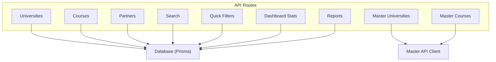
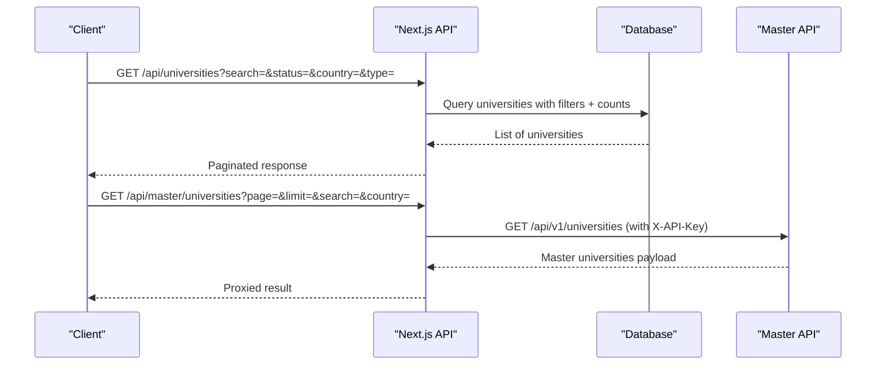
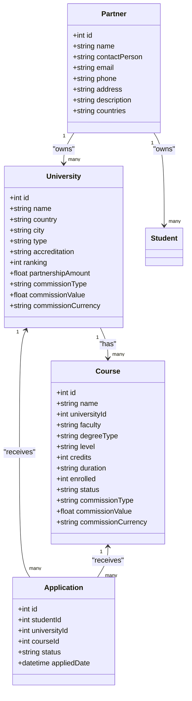

# University Management API

<cite>
**Referenced Files in This Document**
- [route.ts](file://src/app/api/universities/route.ts)
- [route.ts](file://src/app/api/universities/[id]/route.ts)
- [route.ts](file://src/app/api/courses/route.ts)
- [route.ts](file://src/app/api/courses/[id]/route.ts)
- [route.ts](file://src/app/api/partners/route.ts)
- [route.ts](file://src/app/api/partners/[id]/route.ts)
- [route.ts](file://src/app/api/master/universities/route.ts)
- [route.ts](file://src/app/api/master/courses/route.ts)
- [route.ts](file://src/app/api/search/route.ts)
- [route.ts](file://src/app/api/quick-filters/route.ts)
- [route.ts](file://src/app/api/dashboard/stats/route.ts)
- [route.ts](file://src/app/api/reports/route.ts)
- [master-api.ts](file://src/lib/master-api.ts)
- [schema.prisma](file://prisma/schema.prisma)
</cite>

## Table of Contents
1. Introduction
2. Project Structure
3. Core Components
4. Architecture Overview
5. Detailed Component Analysis
6. Dependency Analysis
7. Performance Considerations
8. Troubleshooting Guide
9. Conclusion
10. Appendices

## Introduction
This document provides comprehensive API documentation for university and course management endpoints focused on partnership administration and academic catalog management. It covers:
- University profile management (CRUD, accreditation, partnerships)
- Course catalog operations (CRUD, enrollment tracking, commission fields)
- Partnership agreements (partners CRUD and relationships)
- Master data integration (universities and courses from an external master API)
- Search and filtering capabilities for discovery
- Reporting and performance metrics via dashboard stats
- Authentication requirements and request/response schemas

## Project Structure
The API is implemented as Next.js Route Handlers under src/app/api. Key modules include:
- Universities: list/create/detail/update/delete
- Courses: list/create/detail/update/delete
- Partners: list/create/update/delete
- Master Data: proxy to external master API for universities and courses
- Search: unified search across universities and courses with filter options
- Quick Filters: manage quick filter definitions
- Dashboard Stats: aggregated metrics for KPIs
- Reports: exportable datasets for universities, courses, applications, payments

**Diagram sources**
- [route.ts:1-158](file://src/app/api/universities/route.ts#L1-L158)
- [route.ts:1-193](file://src/app/api/universities/[id]/route.ts#L1-L193)
- [route.ts:1-161](file://src/app/api/courses/route.ts#L1-L161)
- [route.ts:1-152](file://src/app/api/courses/[id]/route.ts#L1-L152)
- [route.ts:1-63](file://src/app/api/partners/route.ts#L1-L63)
- [route.ts:1-72](file://src/app/api/partners/[id]/route.ts#L1-L72)
- [route.ts:1-32](file://src/app/api/master/universities/route.ts#L1-L32)
- [route.ts:1-35](file://src/app/api/master/courses/route.ts#L1-L35)
- [route.ts:1-147](file://src/app/api/search/route.ts#L1-L147)
- [route.ts:1-36](file://src/app/api/quick-filters/route.ts#L1-L36)
- [route.ts:1-79](file://src/app/api/dashboard/stats/route.ts#L1-L79)
- [route.ts:1-149](file://src/app/api/reports/route.ts#L1-L149)
- [master-api.ts:1-127](file://src/lib/master-api.ts#L1-L127)

**Section sources**
- [route.ts:1-158](file://src/app/api/universities/route.ts#L1-L158)
- [route.ts:1-193](file://src/app/api/universities/[id]/route.ts#L1-L193)
- [route.ts:1-161](file://src/app/api/courses/route.ts#L1-L161)
- [route.ts:1-152](file://src/app/api/courses/[id]/route.ts#L1-L152)
- [route.ts:1-63](file://src/app/api/partners/route.ts#L1-L63)
- [route.ts:1-72](file://src/app/api/partners/[id]/route.ts#L1-L72)
- [route.ts:1-32](file://src/app/api/master/universities/route.ts#L1-L32)
- [route.ts:1-35](file://src/app/api/master/courses/route.ts#L1-L35)
- [route.ts:1-147](file://src/app/api/search/route.ts#L1-L147)
- [route.ts:1-36](file://src/app/api/quick-filters/route.ts#L1-L36)
- [route.ts:1-79](file://src/app/api/dashboard/stats/route.ts#L1-L79)
- [route.ts:1-149](file://src/app/api/reports/route.ts#L1-L149)
- [master-api.ts:1-127](file://src/lib/master-api.ts#L1-L127)

## Core Components
- Universities: Full CRUD with partner linkage, accreditation, ranking, images, requirements, and commission metadata. Supports pagination, search, and filters by status, country, type.
- Courses: Full CRUD linked to a university. Includes study level, faculty, degree type, credits, duration, language, mode, fees, deadlines, English test requirements, and commission metadata. Supports pagination, search, and filters by status, university, level, faculty, degree type.
- Partners: CRUD for partner entities with contact details, description, and countries; supports activity logging and notifications.
- Master Data: Proxy endpoints to fetch universities and courses from an external master API with authentication via header and environment configuration.
- Search: Unified search across universities and courses returning results plus available filter values (universities, countries, intakes).
- Quick Filters: Read-only listing and admin creation of quick filter labels/icons.
- Dashboard Stats: Aggregated counts for universities, courses, enrollments, active courses, countries, leads, students, applications, tasks.
- Reports: Type-based queries for universities, courses, users, applications, payments with optional date range filtering.

Authentication:
- Most endpoints require a valid session obtained via getSession() or verifyAuth(). Unauthorized requests return 401.
- Some endpoints enforce role checks (e.g., Admin/Super Admin/Staff).

Request/Response patterns:
- Paginated lists use a standard paginated response wrapper with total and page metadata.
- Create operations typically return 201 with the created resource.
- Update/Delete operations return updated/deleted resources or success messages.

**Section sources**
- [route.ts:1-158](file://src/app/api/universities/route.ts#L1-L158)
- [route.ts:1-193](file://src/app/api/universities/[id]/route.ts#L1-L193)
- [route.ts:1-161](file://src/app/api/courses/route.ts#L1-L161)
- [route.ts:1-152](file://src/app/api/courses/[id]/route.ts#L1-L152)
- [route.ts:1-63](file://src/app/api/partners/route.ts#L1-L63)
- [route.ts:1-72](file://src/app/api/partners/[id]/route.ts#L1-L72)
- [route.ts:1-32](file://src/app/api/master/universities/route.ts#L1-L32)
- [route.ts:1-35](file://src/app/api/master/courses/route.ts#L1-L35)
- [route.ts:1-147](file://src/app/api/search/route.ts#L1-L147)
- [route.ts:1-36](file://src/app/api/quick-filters/route.ts#L1-L36)
- [route.ts:1-79](file://src/app/api/dashboard/stats/route.ts#L1-L79)
- [route.ts:1-149](file://src/app/api/reports/route.ts#L1-L149)

## Architecture Overview
The system exposes RESTful endpoints that interact with a Prisma-managed SQLite database and optionally an external Master API for enriched catalog data. Session-based authentication protects most endpoints. Activity logging and notifications are triggered on key mutations.

**Diagram sources**
- [route.ts:1-158](file://src/app/api/universities/route.ts#L1-L158)
- [route.ts:1-32](file://src/app/api/master/universities/route.ts#L1-L32)
- [master-api.ts:1-127](file://src/lib/master-api.ts#L1-L127)

## Detailed Component Analysis

### Universities API
- GET /api/universities
  - Auth: Required (session)
  - Query params: search, status, country, type, pagination (page, perPage, skip)
  - Behavior: Filters by status (default excludes Deleted), builds OR search across name/country/city, includes partner and course count, transforms arrays for accreditation/requirements/images, returns paginated response
  - Response: Array of universities with computed fields (accredited, color, initials, requirements array, accreditation array)
- POST /api/universities
  - Auth: Required (Admin/Super Admin/Staff)
  - Body: name/title, shortName, country, city, type, email, phone, address, websiteUrl/website, establishedYear/foundedYear, accreditationBody/accreditation, ranking, logo, banner, imagesList, requirements, partnerId, partnershipAmount, commissionType, commissionValue, commissionCurrency, description, status
  - Behavior: Creates university, logs activity, creates notification
  - Response: Created university (201)
- GET /api/universities/:id
  - Auth: Required (session)
  - Response: University detail including grouped courses by faculty, transformed arrays for accreditation/requirements/images
- PATCH /api/universities/:id
  - Auth: Required (Admin/Super Admin/Staff)
  - Body: Partial update fields similar to create
  - Behavior: Updates university, logs changes, creates notification
  - Response: Updated university
- DELETE /api/universities/:id
  - Auth: Required (Admin/Super Admin)
  - Behavior: Soft delete via trash utility, logs activity, creates notification
  - Response: Success message

Relationships:
- University has many Courses
- University optionally belongs to a Partner (partnerId)
- Accreditation stored as JSON string/array; parsed into array for responses

Commission fields:
- commissionType: "Percentage" or "Flat"
- commissionValue: numeric value
- commissionCurrency: currency code

**Section sources**
- [route.ts:1-158](file://src/app/api/universities/route.ts#L1-L158)
- [route.ts:1-193](file://src/app/api/universities/[id]/route.ts#L1-L193)
- [schema.prisma:19-50](file://prisma/schema.prisma#L19-L50)

### Courses API
- GET /api/courses
  - Auth: Required (session)
  - Query params: search, status, universityId, level, faculty, degreeType, pagination
  - Behavior: Filters by status (default excludes Deleted), OR search across name/instructor/description, includes university, transforms prerequisites/quickFilters/requirements arrays
  - Response: Paginated list of courses with university name/logo and normalized fields
- POST /api/courses
  - Auth: Required (Admin/Super Admin/Staff)
  - Body: name/title, universityId, faculty, degreeType, studyLevel, credits, duration, startDate, color, initials, instructor, description, prerequisites, intake, language, mode, academicRequirement, percentageRequired, gpaRequired, englishLanguageType, english scores, tuitionFee, applicationFee, applicationFeeCurrency, currency, quickFilters, requirements, applicationDeadline, courseCode, englishTests, commissionType, commissionValue, commissionCurrency
  - Behavior: Creates course, logs activity, creates notification
  - Response: Created course (201)
- GET /api/courses/:id
  - Auth: Not enforced in handler (no session check)
  - Response: Single course with university included
- PUT /api/courses/:id
  - Auth: Not enforced in handler (no session check)
  - Behavior: Updates course, logs changes, creates notification
  - Response: Updated course
- DELETE /api/courses/:id
  - Auth: Not enforced in handler (no session check)
  - Behavior: Soft delete via trash utility, logs activity, creates notification
  - Response: Success message

Enrollment tracking:
- Course.enrolled field tracks number of enrolled students
- Applications link Student, University, and Course; can be used to compute enrollment metrics

Commission fields:
- Same structure as universities: commissionType, commissionValue, commissionCurrency

**Section sources**
- [route.ts:1-161](file://src/app/api/courses/route.ts#L1-L161)
- [route.ts:1-152](file://src/app/api/courses/[id]/route.ts#L1-L152)
- [schema.prisma:67-119](file://prisma/schema.prisma#L67-L119)

### Partners API
- GET /api/partners
  - Auth: Not enforced in handler (uses cookies-based session helper)
  - Response: List of partners with student count
- POST /api/partners
  - Auth: Optional session via cookie token verification
  - Body: name, contactPerson, email, phone, address, description, countries (JSON array)
  - Behavior: Creates partner, logs activity if session present
  - Response: Created partner (201)
- PATCH /api/partners/:id
  - Auth: Uses getSession()
  - Body: Partial updates for name/contact/email/phone/address/description/countries
  - Behavior: Updates partner, logs changes
  - Response: Updated partner
- DELETE /api/partners/:id
  - Auth: Uses getSession()
  - Behavior: Clears related students, deletes partner, logs activity
  - Response: Success

Relationships:
- Partner has many Universities (via partnerId)
- Partner has many Students (via partnerId)

**Section sources**
- [route.ts:1-63](file://src/app/api/partners/route.ts#L1-L63)
- [route.ts:1-72](file://src/app/api/partners/[id]/route.ts#L1-L72)
- [schema.prisma:52-65](file://prisma/schema.prisma#L52-L65)

### Master Data Integration
- GET /api/master/universities
  - Auth: Required (session)
  - Query params: page, limit, search, country
  - Behavior: Validates master API configuration, proxies request to external master API with X-API-Key header, returns proxied result
  - Response: Master universities payload with pagination
- GET /api/master/courses
  - Auth: Required (session)
  - Query params: page, limit, search, level, faculty, country, university
  - Behavior: Validates master API configuration, proxies request to external master API with X-API-Key header, returns proxied result
  - Response: Master courses payload with pagination

Configuration:
- MASTER_API_URL and MASTER_API_KEY environment variables required
- isConfigured() guards access when not configured

**Section sources**
- [route.ts:1-32](file://src/app/api/master/universities/route.ts#L1-L32)
- [route.ts:1-35](file://src/app/api/master/courses/route.ts#L1-L35)
- [master-api.ts:1-127](file://src/lib/master-api.ts#L1-L127)

### Search and Discovery
- GET /api/search
  - Auth: Required (session)
  - Query param: q (search term)
  - Behavior: Searches courses and universities with OR conditions, returns top results and aggregate filter options (universities, countries, intakes)
  - Response: { courses, universities, filters }

Quick Filters:
- GET /api/quick-filters
  - Auth: Not enforced
  - Response: List of quick filters sorted by label
- POST /api/quick-filters
  - Auth: Required (Admin/Super Admin)
  - Body: label, icon (optional)
  - Behavior: Creates quick filter, handles duplicate constraint
  - Response: Created filter (201)

**Section sources**
- [route.ts:1-147](file://src/app/api/search/route.ts#L1-L147)
- [route.ts:1-36](file://src/app/api/quick-filters/route.ts#L1-L36)

### Reporting and Metrics
- GET /api/dashboard/stats
  - Auth: Required (session)
  - Behavior: Aggregates counts for universities, courses, enrollments, active courses, countries, leads, students, applications, tasks; computes last-month deltas
  - Response: KPI object with totals and monthly changes
- GET /api/reports?type={universities|courses|users|applications|payments}&startDate=&endDate=
  - Auth: Required (session)
  - Behavior: Returns datasets filtered by date range; flattens nested relations for export-friendly output
  - Response: Array of rows tailored to report type

**Section sources**
- [route.ts:1-79](file://src/app/api/dashboard/stats/route.ts#L1-L79)
- [route.ts:1-149](file://src/app/api/reports/route.ts#L1-L149)

## Dependency Analysis
- Database models:
  - University ↔ Course (one-to-many)
  - University ↔ Partner (many-to-one via partnerId)
  - Student ↔ Partner (many-to-one via partnerId)
  - Application links Student, University, Course
- External dependencies:
  - Master API client uses environment variables and headers for authentication
- Utilities:
  - Pagination helpers, session handling, activity logging, notifications, trash utilities

**Diagram sources**
- [schema.prisma:19-50](file://prisma/schema.prisma#L19-L50)
- [schema.prisma:52-65](file://prisma/schema.prisma#L52-L65)
- [schema.prisma:67-119](file://prisma/schema.prisma#L67-L119)
- [schema.prisma:411-428](file://prisma/schema.prisma#L411-L428)

**Section sources**
- [schema.prisma:19-50](file://prisma/schema.prisma#L19-L50)
- [schema.prisma:52-65](file://prisma/schema.prisma#L52-L65)
- [schema.prisma:67-119](file://prisma/schema.prisma#L67-L119)
- [schema.prisma:411-428](file://prisma/schema.prisma#L411-L428)

## Performance Considerations
- Use pagination parameters consistently to avoid large payloads.
- Leverage server-side filtering (status, universityId, level, faculty, degreeType) to reduce dataset size.
- For search, prefer targeted queries using query params rather than client-side filtering.
- Master API calls are cached via revalidate option; ensure appropriate cache durations for your use case.
- Avoid unnecessary includes in list endpoints; only include related data when needed.

## Troubleshooting Guide
Common issues and resolutions:
- Unauthorized (401): Ensure a valid session exists; some endpoints require specific roles.
- Master API not configured: Check MASTER_API_URL and MASTER_API_KEY environment variables.
- Failed to fetch from Master API: Verify network connectivity and API key validity; handle 502 errors gracefully.
- Duplicate quick filter: Handle unique constraint error and inform user.
- Date range reports: Ensure startDate and endDate are valid ISO dates; end date is inclusive at end-of-day.

Error handling patterns:
- Centralized apiError helper returns consistent error objects.
- Activity logging and notifications aid in diagnosing mutation outcomes.
- Soft delete via trash utilities allows recovery of accidentally deleted items.

**Section sources**
- [route.ts:1-158](file://src/app/api/universities/route.ts#L1-L158)
- [route.ts:1-32](file://src/app/api/master/universities/route.ts#L1-L32)
- [route.ts:1-36](file://src/app/api/quick-filters/route.ts#L1-L36)
- [route.ts:1-149](file://src/app/api/reports/route.ts#L1-L149)

## Conclusion
The University Management API provides robust endpoints for managing universities, courses, and partners, with strong support for search, filtering, reporting, and master data integration. Authentication and role-based access protect sensitive operations, while activity logging and notifications enhance auditability. The schema and handlers enable comprehensive relationship management between universities and courses, including enrollment tracking and commission calculations.

## Appendices

### HTTP Methods, URL Patterns, and Request/Response Schemas

- Universities
  - GET /api/universities
    - Query: search, status, country, type, page, perPage, skip
    - Response: Paginated list of universities with computed fields
  - POST /api/universities
    - Body: name/title, shortName, country, city, type, email, phone, address, websiteUrl/website, establishedYear/foundedYear, accreditationBody/accreditation, ranking, logo, banner, imagesList, requirements, partnerId, partnershipAmount, commissionType, commissionValue, commissionCurrency, description, status
    - Response: Created university (201)
  - GET /api/universities/:id
    - Response: University detail with grouped courses
  - PATCH /api/universities/:id
    - Body: Partial update fields
    - Response: Updated university
  - DELETE /api/universities/:id
    - Response: Success message

- Courses
  - GET /api/courses
    - Query: search, status, universityId, level, faculty, degreeType, page, perPage, skip
    - Response: Paginated list of courses with university info
  - POST /api/courses
    - Body: name/title, universityId, faculty, degreeType, studyLevel, credits, duration, startDate, color, initials, instructor, description, prerequisites, intake, language, mode, academicRequirement, percentageRequired, gpaRequired, englishLanguageType, english scores, tuitionFee, applicationFee, applicationFeeCurrency, currency, quickFilters, requirements, applicationDeadline, courseCode, englishTests, commissionType, commissionValue, commissionCurrency
    - Response: Created course (201)
  - GET /api/courses/:id
    - Response: Single course with university
  - PUT /api/courses/:id
    - Body: Partial update fields
    - Response: Updated course
  - DELETE /api/courses/:id
    - Response: Success message

- Partners
  - GET /api/partners
    - Response: List of partners with student count
  - POST /api/partners
    - Body: name, contactPerson, email, phone, address, description, countries
    - Response: Created partner (201)
  - PATCH /api/partners/:id
    - Body: Partial update fields
    - Response: Updated partner
  - DELETE /api/partners/:id
    - Response: Success

- Master Data
  - GET /api/master/universities
    - Query: page, limit, search, country
    - Response: Master universities with pagination
  - GET /api/master/courses
    - Query: page, limit, search, level, faculty, country, university
    - Response: Master courses with pagination

- Search
  - GET /api/search?q=...
    - Response: { courses, universities, filters }

- Quick Filters
  - GET /api/quick-filters
    - Response: List of filters
  - POST /api/quick-filters
    - Body: label, icon
    - Response: Created filter (201)

- Dashboard Stats
  - GET /api/dashboard/stats
    - Response: KPI object

- Reports
  - GET /api/reports?type={universities|courses|users|applications|payments}&startDate=&endDate=
    - Response: Array of rows based on type

**Section sources**
- [route.ts:1-158](file://src/app/api/universities/route.ts#L1-L158)
- [route.ts:1-193](file://src/app/api/universities/[id]/route.ts#L1-L193)
- [route.ts:1-161](file://src/app/api/courses/route.ts#L1-L161)
- [route.ts:1-152](file://src/app/api/courses/[id]/route.ts#L1-L152)
- [route.ts:1-63](file://src/app/api/partners/route.ts#L1-L63)
- [route.ts:1-72](file://src/app/api/partners/[id]/route.ts#L1-L72)
- [route.ts:1-32](file://src/app/api/master/universities/route.ts#L1-L32)
- [route.ts:1-35](file://src/app/api/master/courses/route.ts#L1-L35)
- [route.ts:1-147](file://src/app/api/search/route.ts#L1-L147)
- [route.ts:1-36](file://src/app/api/quick-filters/route.ts#L1-L36)
- [route.ts:1-79](file://src/app/api/dashboard/stats/route.ts#L1-L79)
- [route.ts:1-149](file://src/app/api/reports/route.ts#L1-L149)

### Practical Examples

- Partnership setup
  - Create a partner and associate universities via partnerId
  - Example flow:
    - POST /api/partners with partner details
    - POST /api/universities with partnerId and commission settings
  - Expected outcomes:
    - Partner record created
    - University linked to partner with partnership amount and commission metadata

- Course enrollment tracking
  - Track enrollments via Course.enrolled and Application records
  - Example flow:
    - POST /api/courses to define course
    - Create Application linking Student, University, Course
    - Update Course.enrolled accordingly (client logic or backend process)
  - Reporting:
    - GET /api/reports?type=applications to retrieve application data

- Reporting operations
  - Generate reports for universities, courses, applications, payments
  - Example:
    - GET /api/reports?type=courses&startDate=YYYY-MM-DD&endDate=YYYY-MM-DD
  - Dashboard metrics:
    - GET /api/dashboard/stats for KPI overview

[No sources needed since this section provides practical usage guidance without quoting specific code]