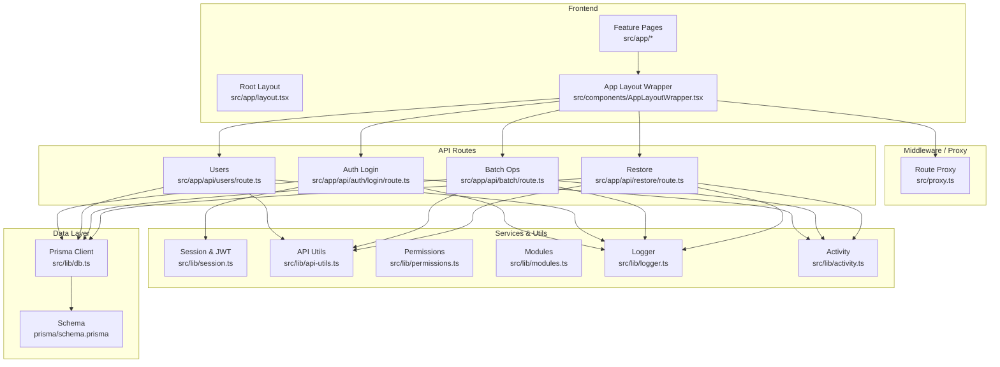
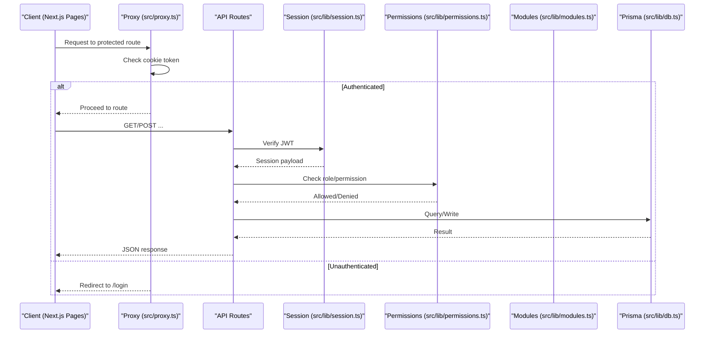
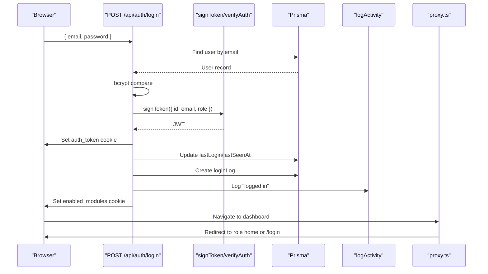
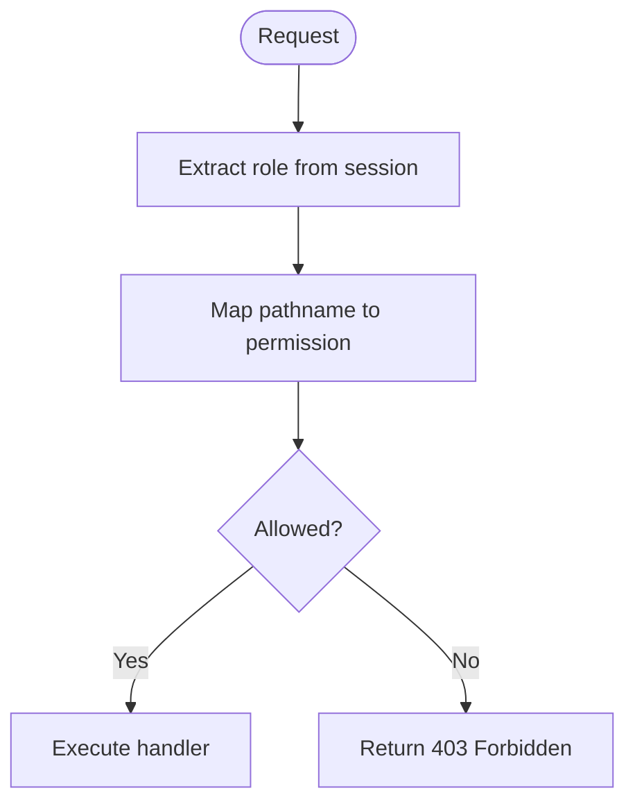
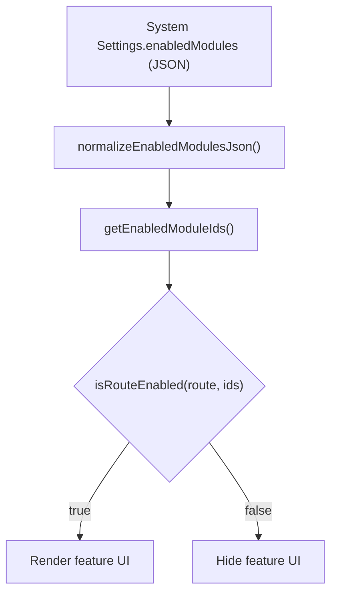
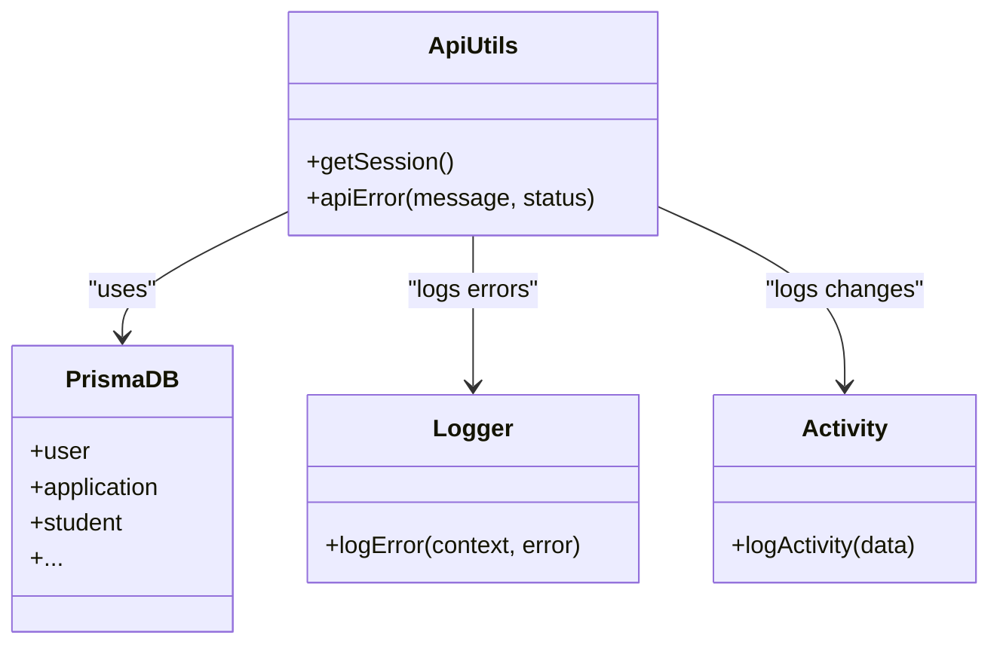
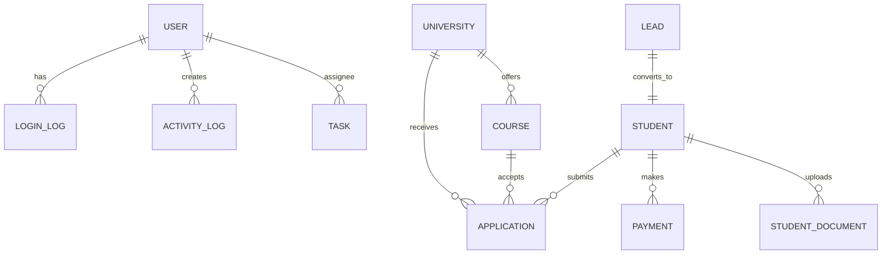
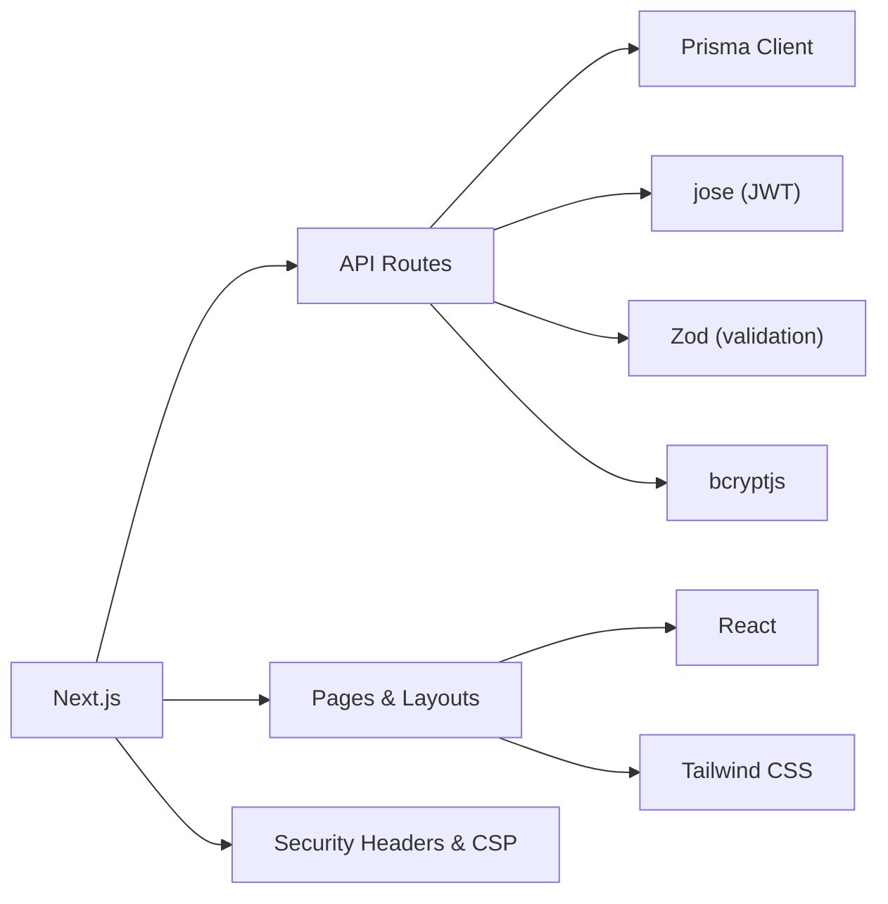

# Architecture Overview

<cite>
**Referenced Files in This Document**
- [package.json](file://package.json)
- [next.config.mjs](file://next.config.mjs)
- [src/app/layout.tsx](file://src/app/layout.tsx)
- [src/components/AppLayoutWrapper.tsx](file://src/components/AppLayoutWrapper.tsx)
- [src/proxy.ts](file://src/proxy.ts)
- [src/lib/session.ts](file://src/lib/session.ts)
- [src/lib/api-utils.ts](file://src/lib/api-utils.ts)
- [src/lib/permissions.ts](file://src/lib/permissions.ts)
- [src/lib/modules.ts](file://src/lib/modules.ts)
- [src/lib/db.ts](file://src/lib/db.ts)
- [prisma/schema.prisma](file://prisma/schema.prisma)
- [src/app/api/auth/login/route.ts](file://src/app/api/auth/login/route.ts)
- [src/app/api/users/route.ts](file://src/app/api/users/route.ts)
- [src/app/api/batch/route.ts](file://src/app/api/batch/route.ts)
- [src/app/api/restore/route.ts](file://src/app/api/restore/route.ts)
- [src/lib/logger.ts](file://src/lib/logger.ts)
- [src/lib/activity.ts](file://src/lib/activity.ts)
</cite>

## Table of Contents
1. Introduction
2. Project Structure
3. Core Components
4. Architecture Overview
5. Detailed Component Analysis
6. Dependency Analysis
7. Performance Considerations
8. Troubleshooting Guide
9. Conclusion

## Introduction
This document describes UniTrack’s system architecture with a focus on design patterns and component relationships. It explains the Next.js App Router layout, client-side components, server-side API routes, and the database layer using Prisma ORM. It also documents authentication with JWT tokens, role-based access control, session management, modular feature enablement, and the service-layer-like patterns used to encapsulate business logic. Cross-cutting concerns such as security, logging, error handling, and performance are covered, along with technology stack decisions that support scalability and maintainability.

## Project Structure
UniTrack is a Next.js application using the App Router for routing and server actions. The frontend is organized by feature directories under src/app, each containing page components and nested components. Shared UI and layout wrappers live under src/components. Server-side API endpoints are grouped under src/app/api by domain (auth, users, applications, hr, etc.). Data access is centralized via Prisma, configured in prisma/schema.prisma and accessed through a singleton client in src/lib/db.ts. Cross-cutting utilities include session handling, permissions, module enablement, logging, and activity tracking.

**Diagram sources**
- [src/app/layout.tsx:1-43](file://src/app/layout.tsx#L1-L43)
- [src/components/AppLayoutWrapper.tsx:1-121](file://src/components/AppLayoutWrapper.tsx#L1-L121)
- [src/proxy.ts:1-59](file://src/proxy.ts#L1-L59)
- [src/lib/session.ts:1-37](file://src/lib/session.ts#L1-L37)
- [src/lib/api-utils.ts:1-44](file://src/lib/api-utils.ts#L1-L44)
- [src/lib/permissions.ts:1-107](file://src/lib/permissions.ts#L1-L107)
- [src/lib/modules.ts:1-252](file://src/lib/modules.ts#L1-L252)
- [src/lib/db.ts:1-8](file://src/lib/db.ts#L1-L8)
- [prisma/schema.prisma:1-800](file://prisma/schema.prisma#L1-L800)
- [src/app/api/auth/login/route.ts:1-123](file://src/app/api/auth/login/route.ts#L1-L123)
- [src/app/api/users/route.ts:1-42](file://src/app/api/users/route.ts#L1-L42)
- [src/app/api/batch/route.ts:64-116](file://src/app/api/batch/route.ts#L64-L116)
- [src/app/api/restore/route.ts:1-198](file://src/app/api/restore/route.ts#L1-L198)
- [src/lib/logger.ts:1-49](file://src/lib/logger.ts#L1-L49)
- [src/lib/activity.ts:1-114](file://src/lib/activity.ts#L1-L114)

**Section sources**
- [package.json:1-119](file://package.json#L1-L119)
- [next.config.mjs:1-47](file://next.config.mjs#L1-L47)
- [src/app/layout.tsx:1-43](file://src/app/layout.tsx#L1-L43)

## Core Components
- Root layout and theme provider establish global metadata, fonts, and theming for the app.
- App Layout Wrapper validates sessions on the client, redirects unauthenticated users, and resolves role-based home pages.
- Route proxy enforces authentication for dashboard routes and redirects based on user roles.
- Session utilities sign and verify JWTs; API utils provide reusable session extraction and permission helpers.
- Permissions module defines role-to-permission mappings and route-to-permission mapping.
- Modules module enables/disables features by route sets stored in system settings and cookies.
- Database layer uses a singleton Prisma client and a comprehensive schema covering entities like User, University, Course, Application, Student, HR, Payments, and more.
- API routes implement domain-specific endpoints with validation, rate limiting, logging, and activity tracking.

**Section sources**
- [src/app/layout.tsx:1-43](file://src/app/layout.tsx#L1-L43)
- [src/components/AppLayoutWrapper.tsx:1-121](file://src/components/AppLayoutWrapper.tsx#L1-L121)
- [src/proxy.ts:1-59](file://src/proxy.ts#L1-L59)
- [src/lib/session.ts:1-37](file://src/lib/session.ts#L1-L37)
- [src/lib/api-utils.ts:1-44](file://src/lib/api-utils.ts#L1-L44)
- [src/lib/permissions.ts:1-107](file://src/lib/permissions.ts#L1-L107)
- [src/lib/modules.ts:1-252](file://src/lib/modules.ts#L1-L252)
- [src/lib/db.ts:1-8](file://src/lib/db.ts#L1-L8)
- [prisma/schema.prisma:1-800](file://prisma/schema.prisma#L1-L800)

## Architecture Overview
The system follows a layered architecture:
- Presentation: Next.js App Router pages and shared UI components.
- Middleware: Route proxy for auth gating and role-based redirection.
- API Layer: Domain-scoped route handlers implementing CRUD and workflows.
- Service Layer: Reusable utilities for session, permissions, modules, logging, and activity.
- Data Layer: Prisma ORM over SQLite with a rich domain model.

**Diagram sources**
- [src/proxy.ts:1-59](file://src/proxy.ts#L1-L59)
- [src/lib/session.ts:1-37](file://src/lib/session.ts#L1-L37)
- [src/lib/permissions.ts:1-107](file://src/lib/permissions.ts#L1-L107)
- [src/lib/modules.ts:1-252](file://src/lib/modules.ts#L1-L252)
- [src/lib/db.ts:1-8](file://src/lib/db.ts#L1-L8)

## Detailed Component Analysis

### Authentication Flow (JWT + Cookies)
- Login endpoint validates credentials, issues a signed JWT, and stores it in an httpOnly cookie. It updates last login, records a login log, logs activity, and sets enabled modules cookie from system settings.
- Client wrapper checks session state, calls /api/auth/me to validate, and redirects to role-appropriate home or login if needed.
- Proxy middleware protects dashboard routes and redirects based on verification status and role.

**Diagram sources**
- [src/app/api/auth/login/route.ts:1-123](file://src/app/api/auth/login/route.ts#L1-L123)
- [src/lib/session.ts:1-37](file://src/lib/session.ts#L1-L37)
- [src/lib/activity.ts:1-114](file://src/lib/activity.ts#L1-L114)
- [src/proxy.ts:1-59](file://src/proxy.ts#L1-L59)

**Section sources**
- [src/app/api/auth/login/route.ts:1-123](file://src/app/api/auth/login/route.ts#L1-L123)
- [src/components/AppLayoutWrapper.tsx:1-121](file://src/components/AppLayoutWrapper.tsx#L1-L121)
- [src/proxy.ts:1-59](file://src/proxy.ts#L1-L59)
- [src/lib/session.ts:1-37](file://src/lib/session.ts#L1-L37)

### Role-Based Access Control and Permissions
- Permissions map resources/actions to allowed roles and provide helpers to check permissions and derive required permissions from route paths.
- API routes can use these helpers to enforce fine-grained access beyond basic role checks.

**Diagram sources**
- [src/lib/permissions.ts:1-107](file://src/lib/permissions.ts#L1-L107)

**Section sources**
- [src/lib/permissions.ts:1-107](file://src/lib/permissions.ts#L1-L107)

### Modular Feature Enablement
- Modules define feature IDs, labels, descriptions, associated routes, default enablement, and icons.
- Normalization functions ensure a safe default set of enabled modules when configuration is missing or invalid.
- Route-level checks determine whether a given route should be accessible based on enabled modules.

**Diagram sources**
- [src/lib/modules.ts:1-252](file://src/lib/modules.ts#L1-L252)

**Section sources**
- [src/lib/modules.ts:1-252](file://src/lib/modules.ts#L1-L252)

### API Route Organization and Business Logic Encapsulation
- API routes are organized by domain under src/app/api with clear separation of concerns:
  - Authentication: login, logout, me, password reset flows.
  - Users: list and manage users.
  - Batch operations: bulk updates across entities with activity logging and notifications.
  - Restore: secure backup restore with table allowlist and transactional writes.
- Business logic is encapsulated in route handlers and supported by utility modules (session, permissions, logger, activity).

**Diagram sources**
- [src/lib/api-utils.ts:1-44](file://src/lib/api-utils.ts#L1-L44)
- [src/lib/logger.ts:1-49](file://src/lib/logger.ts#L1-L49)
- [src/lib/activity.ts:1-114](file://src/lib/activity.ts#L1-L114)
- [src/lib/db.ts:1-8](file://src/lib/db.ts#L1-L8)

**Section sources**
- [src/app/api/users/route.ts:1-42](file://src/app/api/users/route.ts#L1-L42)
- [src/app/api/batch/route.ts:64-116](file://src/app/api/batch/route.ts#L64-L116)
- [src/app/api/restore/route.ts:1-198](file://src/app/api/restore/route.ts#L1-L198)

### Database Layer and Models
- Prisma schema defines core entities including User, University, Course, Application, Student, Lead, Payment, Expense, HR-related models (Department, Designation, Attendance, LeaveType, Payroll), and supporting tables (Roles, SystemSettings, Notifications, ActivityLog).
- Relationships and indexes are defined to support efficient queries and referential integrity.

**Diagram sources**
- [prisma/schema.prisma:1-800](file://prisma/schema.prisma#L1-L800)

**Section sources**
- [prisma/schema.prisma:1-800](file://prisma/schema.prisma#L1-L800)

## Dependency Analysis
Key dependencies and their roles:
- Next.js App Router provides routing, server components, and API routes.
- Prisma Client abstracts database interactions with type safety.
- jose handles JWT signing and verification securely.
- bcryptjs secures passwords.
- Zod validates request payloads.
- Tailwind CSS and React ecosystem power the UI.
- Security headers and CSP are enforced via Next.js config.

**Diagram sources**
- [package.json:1-119](file://package.json#L1-L119)
- [next.config.mjs:1-47](file://next.config.mjs#L1-L47)

**Section sources**
- [package.json:1-119](file://package.json#L1-L119)
- [next.config.mjs:1-47](file://next.config.mjs#L1-L47)

## Performance Considerations
- Image optimization and caching via Next.js image configuration reduce bandwidth and improve load times.
- Prisma client singleton avoids repeated connection overhead.
- Rate limiting on sensitive endpoints (e.g., login) mitigates abuse and protects resources.
- Selective field selection in queries reduces payload size.
- Module enablement minimizes unnecessary UI and route exposure, improving perceived performance.

[No sources needed since this section provides general guidance]

## Troubleshooting Guide
Common issues and strategies:
- Authentication failures: Ensure JWT_SECRET is set and consistent between signing and verification; check cookie flags and SameSite settings.
- Permission errors: Validate role values and permission mappings; confirm route-to-permission mapping aligns with current paths.
- Module visibility: Confirm enabled modules configuration and normalization behavior; verify cookies are set post-login.
- Logging and errors: Use sanitized logger to avoid leaking sensitive data; inspect activity logs for audit trails.
- Backup/restore: Validate table allowlists and dependency order during restore; monitor transaction outcomes.

**Section sources**
- [src/lib/logger.ts:1-49](file://src/lib/logger.ts#L1-L49)
- [src/lib/activity.ts:1-114](file://src/lib/activity.ts#L1-L114)
- [src/app/api/restore/route.ts:1-198](file://src/app/api/restore/route.ts#L1-L198)

## Conclusion
UniTrack employs a clean, layered architecture built on Next.js App Router, Prisma ORM, and robust security practices. JWT-based authentication with httpOnly cookies, role-based permissions, and modular feature enablement provide a flexible and secure foundation. The service-layer-like pattern encapsulates business logic within API routes and utilities, while comprehensive logging and activity tracking support observability and auditing. These design choices promote scalability, maintainability, and a strong developer experience.