# Authentication & Authorization

<cite>
**Referenced Files in This Document**
- [session.ts](file://src/lib/session.ts)
- [csrf.ts](file://src/lib/csrf.ts)
- [permissions.ts](file://src/lib/permissions.ts)
- [rate-limit.ts](file://src/lib/rate-limit.ts)
- [crypto.ts](file://src/lib/crypto.ts)
- [client-session.ts](file://src/lib/client-session.ts)
- [proxy.ts](file://src/proxy.ts)
- [login route](file://src/app/api/auth/login/route.ts)
- [logout route](file://src/app/api/auth/logout/route.ts)
- [me route](file://src/app/api/auth/me/route.ts)
- [forgot-password route](file://src/app/api/auth/forgot-password/route.ts)
- [verify-otp route](file://src/app/api/auth/verify-otp/route.ts)
- [reset-password route](file://src/app/api/auth/reset-password/route.ts)
- [LoginForm.tsx](file://src/app/login/components/LoginForm.tsx)
- [Sidebar.tsx](file://src/components/Sidebar.tsx)
- [StudentSidebar.tsx](file://src/components/StudentSidebar.tsx)
- [page.tsx](file://src/app/page.tsx)
- [schema.prisma](file://prisma/schema.prisma)
</cite>

## Update Summary
**Changes Made**
- Updated authentication flow to reflect public root path access
- Enhanced login form error handling documentation
- Updated middleware and routing protection logic
- Added new sections for public vs protected route behavior

## Table of Contents
1. [Introduction](#introduction)
2. [Project Structure](#project-structure)
3. [Core Components](#core-components)
4. [Architecture Overview](#architecture-overview)
5. [Detailed Component Analysis](#detailed-component-analysis)
6. [Dependency Analysis](#dependency-analysis)
7. [Performance Considerations](#performance-considerations)
8. [Troubleshooting Guide](#troubleshooting-guide)
9. [Conclusion](#conclusion)
10. [Appendices](#appendices)

## Introduction
This document explains UniTrack's authentication and authorization implementation with a focus on:
- JWT-based authentication flow (login, logout, token generation/validation, session management)
- Role-based access control (RBAC) with granular permissions for admin, staff, student, viewer, and super admin
- CSRF protection via origin/referer validation
- Rate limiting to protect sensitive endpoints
- Password reset flow with OTP verification
- Integration of roles and permissions into the sidebar navigation
- Security best practices, debugging tips, and how to extend the permission system

**Updated** The authentication system now allows public access to the root path (`/`) while protecting dashboard routes. Login forms include enhanced error handling for better user experience.

## Project Structure
The security features are implemented across server routes under src/app/api/auth and shared libraries under src/lib. The UI integrates with these APIs through components like Sidebar and StudentSidebar. The proxy middleware handles route-level authentication checks.

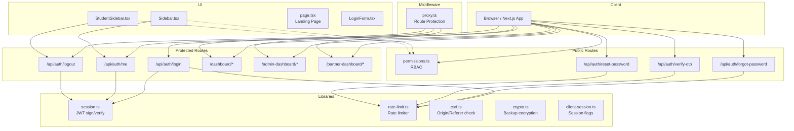

**Diagram sources**
- [proxy.ts:1-59](file://src/proxy.ts#L1-L59)
- [page.tsx:1-524](file://src/app/page.tsx#L1-L524)
- [LoginForm.tsx:1-219](file://src/app/login/components/LoginForm.tsx#L1-L219)
- [login route:1-122](file://src/app/api/auth/login/route.ts#L1-L122)
- [me route:1-69](file://src/app/api/auth/me/route.ts#L1-L69)
- [logout route:1-35](file://src/app/api/auth/logout/route.ts#L1-L35)
- [forgot-password route:1-94](file://src/app/api/auth/forgot-password/route.ts#L1-L94)
- [verify-otp route:1-66](file://src/app/api/auth/verify-otp/route.ts#L1-L66)
- [reset-password route:1-64](file://src/app/api/auth/reset-password/route.ts#L1-L64)

**Section sources**
- [proxy.ts:1-59](file://src/proxy.ts#L1-L59)
- [page.tsx:1-524](file://src/app/page.tsx#L1-L524)
- [LoginForm.tsx:1-219](file://src/app/login/components/LoginForm.tsx#L1-L219)

## Core Components
- JWT Session Management: Token signing and verification using a secret from environment variables; tokens are stored in httpOnly cookies for secure transport.
- RBAC Permissions: Centralized mapping of permissions to roles, including a super admin bypass and route-to-permission helpers.
- CSRF Protection: Validates Origin or Referer headers against allowed origins for non-safe HTTP methods.
- Rate Limiting: In-memory fallback with optional DB-backed counters; protects login, password reset, and OTP verification flows.
- Password Reset with OTP: Generates time-limited OTPs, verifies them, then issues short-lived reset tokens to update passwords.
- Route-Level Authentication: Proxy middleware protects dashboard routes while allowing public access to marketing pages and authentication endpoints.
- Enhanced Login Experience: Improved error handling and user feedback in login forms.

**Section sources**
- [session.ts:1-37](file://src/lib/session.ts#L1-L37)
- [permissions.ts:1-107](file://src/lib/permissions.ts#L1-L107)
- [csrf.ts:1-47](file://src/lib/csrf.ts#L1-L47)
- [rate-limit.ts:1-141](file://src/lib/rate-limit.ts#L1-L141)
- [proxy.ts:1-59](file://src/proxy.ts#L1-L59)
- [LoginForm.tsx:1-219](file://src/app/login/components/LoginForm.tsx#L1-L219)

## Architecture Overview
The authentication architecture combines server-side JWT handling, route-level middleware protection, strict rate limiting, CSRF checks, and RBAC enforcement. Public routes like the landing page are freely accessible, while dashboard routes require authentication. Client components interact with protected endpoints and manage session state via cookies and client-side flags.

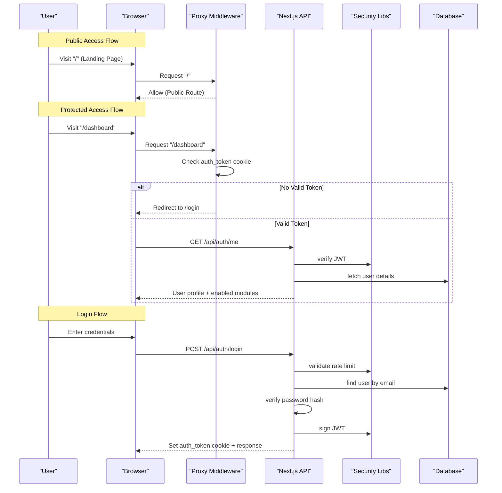

**Diagram sources**
- [proxy.ts:21-54](file://src/proxy.ts#L21-L54)
- [login route:19-122](file://src/app/api/auth/login/route.ts#L19-L122)
- [me route:1-69](file://src/app/api/auth/me/route.ts#L1-L69)
- [session.ts:1-37](file://src/lib/session.ts#L1-L37)
- [rate-limit.ts:1-141](file://src/lib/rate-limit.ts#L1-L141)

## Detailed Component Analysis

### Route-Level Authentication
**Updated** The application now uses a two-tier authentication approach:

- **Public Routes**: Landing page (`/`), authentication endpoints (`/api/auth/*`), and recovery flows are publicly accessible
- **Protected Routes**: Dashboard routes (`/dashboard`, `/admin-dashboard`, `/partner-dashboard`) require valid authentication tokens
- **Middleware Logic**: The proxy middleware validates tokens only for protected routes, allowing seamless public access to marketing content

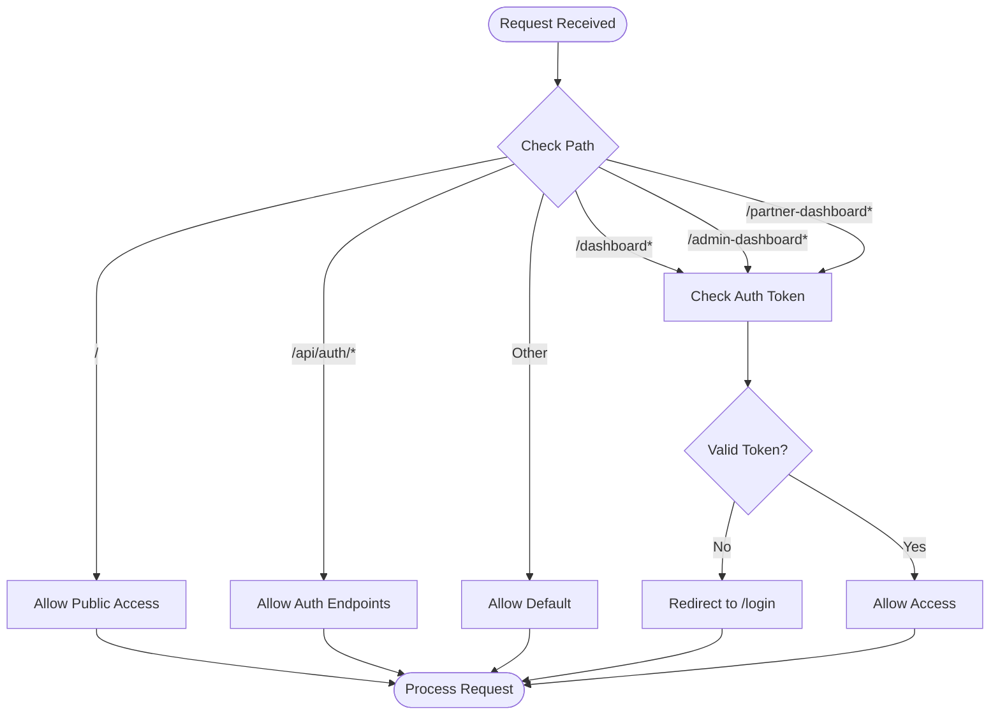

**Diagram sources**
- [proxy.ts:21-54](file://src/proxy.ts#L21-L54)

**Section sources**
- [proxy.ts:1-59](file://src/proxy.ts#L1-L59)

### Enhanced Login Form
**Updated** The login form now includes improved error handling and user experience:

- **Error Display**: Visual error messages with proper styling and icons
- **Loading States**: Clear loading indicators during authentication
- **Mode Switching**: Toggle between admin and student login modes
- **Better Feedback**: Immediate visual feedback for form interactions
- **Navigation**: Easy return to main website from login page

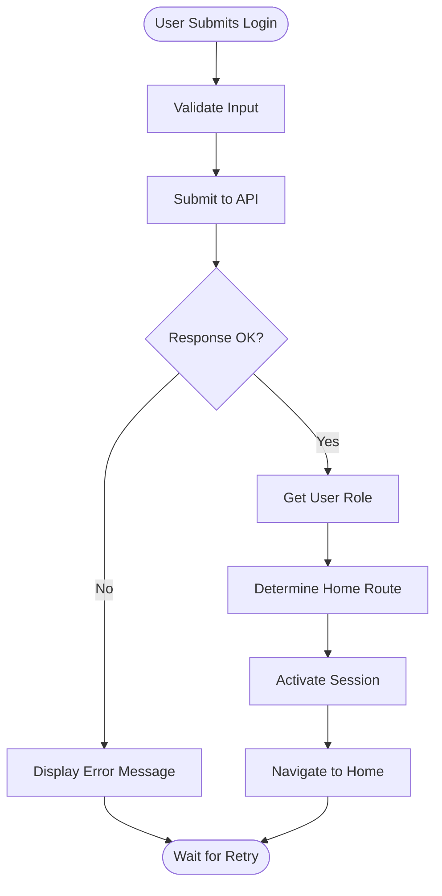

**Diagram sources**
- [LoginForm.tsx:19-58](file://src/app/login/components/LoginForm.tsx#L19-L58)

**Section sources**
- [LoginForm.tsx:1-219](file://src/app/login/components/LoginForm.tsx#L1-L219)

### JWT Authentication Flow
- Login:
  - Validates input schema, enforces rate limits per IP, authenticates user, signs a JWT, sets an httpOnly cookie, updates last login metadata, records login logs, and sets enabled modules cookie.
- Me:
  - Reads the auth_token cookie, verifies the JWT, returns user profile, and refreshes enabled modules cookie.
- Logout:
  - Verifies token if present for audit logging, deletes auth cookies, and returns success.

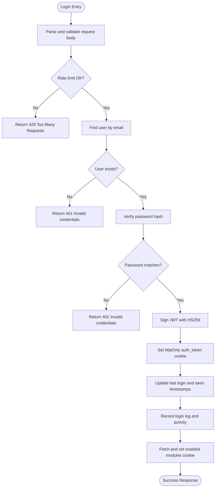

**Diagram sources**
- [login route:19-122](file://src/app/api/auth/login/route.ts#L19-L122)
- [session.ts:1-37](file://src/lib/session.ts#L1-L37)
- [rate-limit.ts:1-141](file://src/lib/rate-limit.ts#L1-L141)

**Section sources**
- [login route:1-122](file://src/app/api/auth/login/route.ts#L1-L122)
- [me route:1-69](file://src/app/api/auth/me/route.ts#L1-L69)
- [logout route:1-35](file://src/app/api/auth/logout/route.ts#L1-L35)
- [session.ts:1-37](file://src/lib/session.ts#L1-L37)

### Role-Based Access Control (RBAC)
- Roles: admin, staff, student, viewer, plus a super admin bypass.
- Permissions: Granular resource-level permissions (e.g., students:read, applications:create).
- Helpers:
  - hasPermission(role, permission): checks if role is allowed.
  - checkPermission(role, permission): returns null or error string.
  - getRoutePermission(pathname): maps URL paths to required permissions.

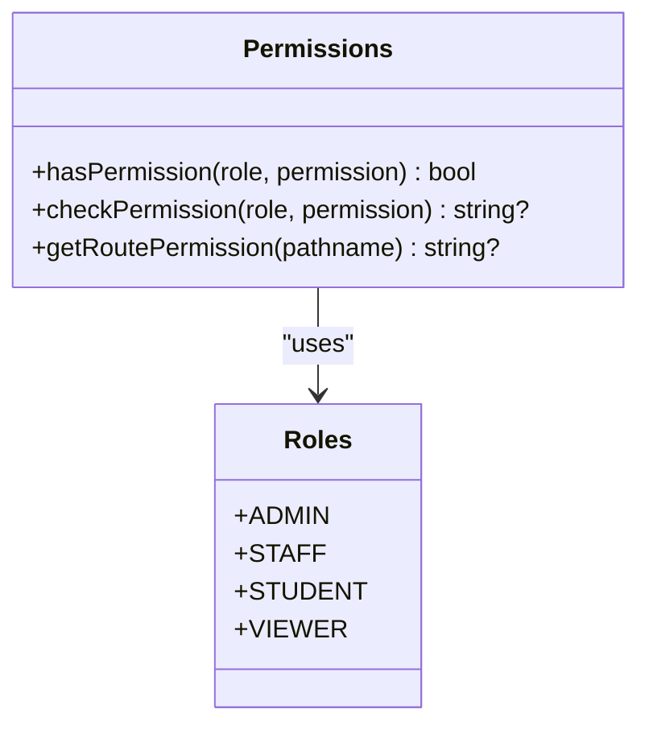

**Diagram sources**
- [permissions.ts:1-107](file://src/lib/permissions.ts#L1-L107)

**Section sources**
- [permissions.ts:1-107](file://src/lib/permissions.ts#L1-L107)

### CSRF Protection
- Validates Origin or Referer headers against configured allowed origins for non-safe methods (POST/PUT/DELETE/PATCH).
- Allows requests without Origin/Referer for non-browser clients.

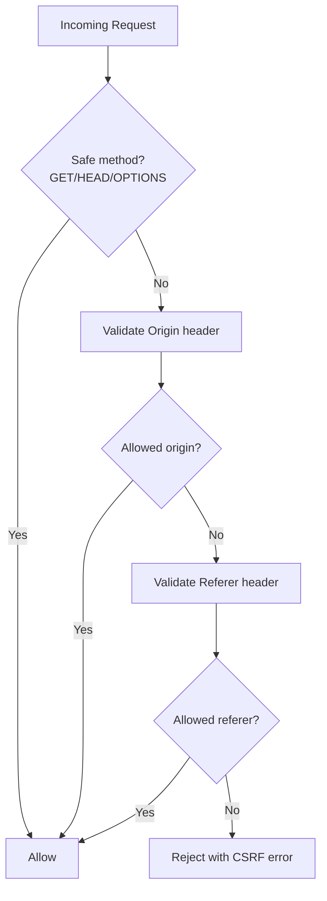

**Diagram sources**
- [csrf.ts:1-47](file://src/lib/csrf.ts#L1-L47)

**Section sources**
- [csrf.ts:1-47](file://src/lib/csrf.ts#L1-L47)

### Rate Limiting
- Protects login, forgot-password, verify-otp, and reset-password endpoints.
- Uses DB-backed counters when available; falls back to in-memory map with cleanup.
- Returns standard rate limit headers and appropriate 429 responses.

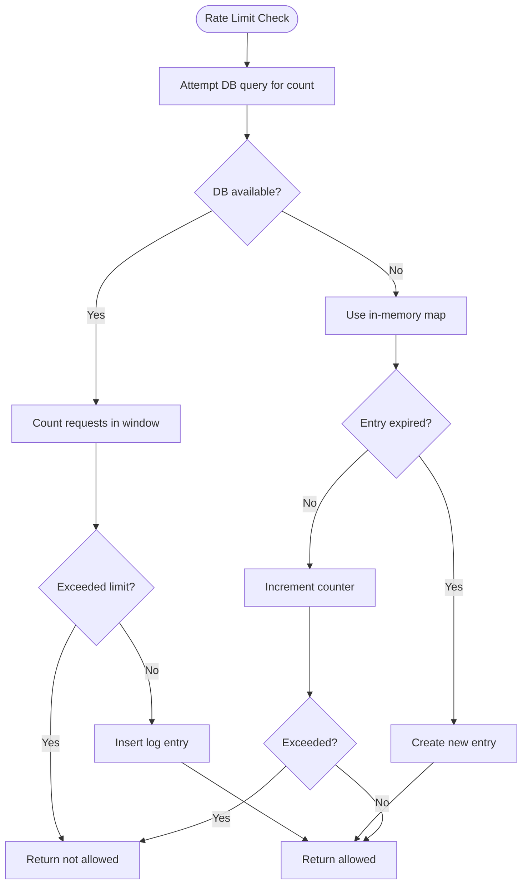

**Diagram sources**
- [rate-limit.ts:1-141](file://src/lib/rate-limit.ts#L1-L141)

**Section sources**
- [rate-limit.ts:1-141](file://src/lib/rate-limit.ts#L1-L141)
- [login route:1-122](file://src/app/api/auth/login/route.ts#L1-L122)
- [forgot-password route:1-94](file://src/app/api/auth/forgot-password/route.ts#L1-L94)
- [verify-otp route:1-66](file://src/app/api/auth/verify-otp/route.ts#L1-L66)
- [reset-password route:1-64](file://src/app/api/auth/reset-password/route.ts#L1-L64)

### Password Reset with OTP
- Forgot Password:
  - Rate-limited per IP, generates a 6-digit OTP valid for 10 minutes, stores it unverified, and sends email via configured SMTP settings. Always returns success to prevent enumeration.
- Verify OTP:
  - Validates OTP against latest unverified record, marks it verified, and creates a short-lived reset token (15 minutes).
- Reset Password:
  - Accepts the reset token, validates expiry, hashes new password, updates the student account, and cleans up reset tokens.

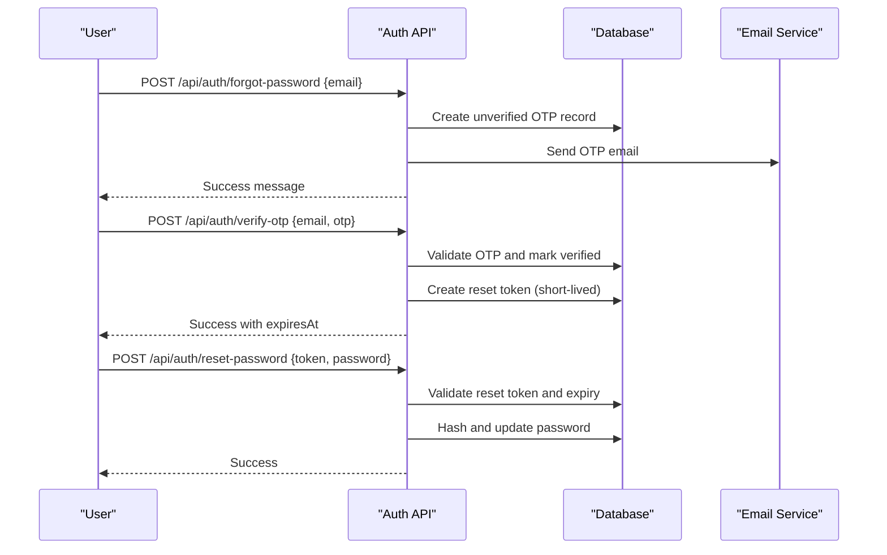

**Diagram sources**
- [forgot-password route:1-94](file://src/app/api/auth/forgot-password/route.ts#L1-L94)
- [verify-otp route:1-66](file://src/app/api/auth/verify-otp/route.ts#L1-L66)
- [reset-password route:1-64](file://src/app/api/auth/reset-password/route.ts#L1-L64)

**Section sources**
- [forgot-password route:1-94](file://src/app/api/auth/forgot-password/route.ts#L1-L94)
- [verify-otp route:1-66](file://src/app/api/auth/verify-otp/route.ts#L1-L66)
- [reset-password route:1-64](file://src/app/api/auth/reset-password/route.ts#L1-L64)

### Sidebar Navigation Integration
- Admin/Staff/Viewer sidebars:
  - Filters menu items based on enabled modules and maps dashboard link to role-specific home.
  - Supports search, collapse, and real-time notifications.
- Student portal sidebar:
  - Filters items by enabled modules and provides logout integration.

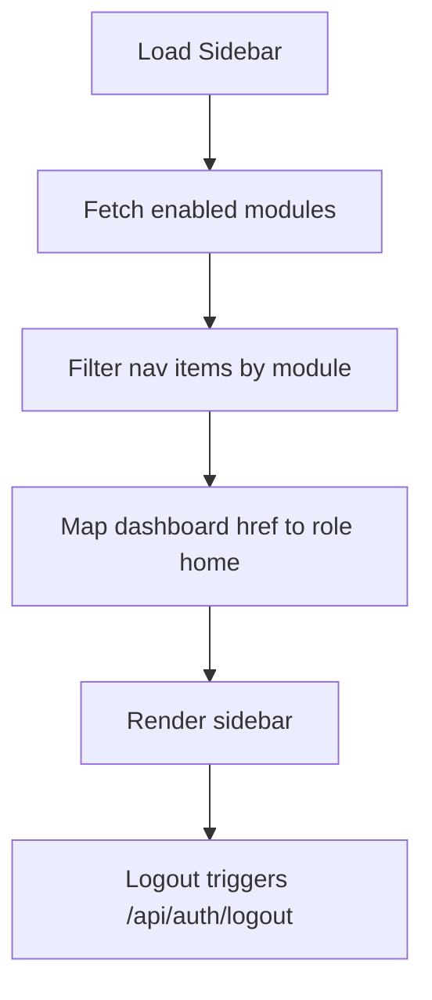

**Diagram sources**
- [Sidebar.tsx:1-800](file://src/components/Sidebar.tsx#L1-L800)
- [StudentSidebar.tsx:1-170](file://src/components/StudentSidebar.tsx#L1-L170)

**Section sources**
- [Sidebar.tsx:1-800](file://src/components/Sidebar.tsx#L1-L800)
- [StudentSidebar.tsx:1-170](file://src/components/StudentSidebar.tsx#L1-L170)

## Dependency Analysis
- Authentication routes depend on:
  - session.ts for JWT operations
  - rate-limit.ts for throttling
  - db for user queries and logs
  - logger/activity for auditing
- UI depends on:
  - client-session.ts for session flags
  - modules configuration for feature toggles
  - permissions for role-aware behavior (via role home mapping)
- **Updated** Proxy middleware depends on JWT verification for route protection

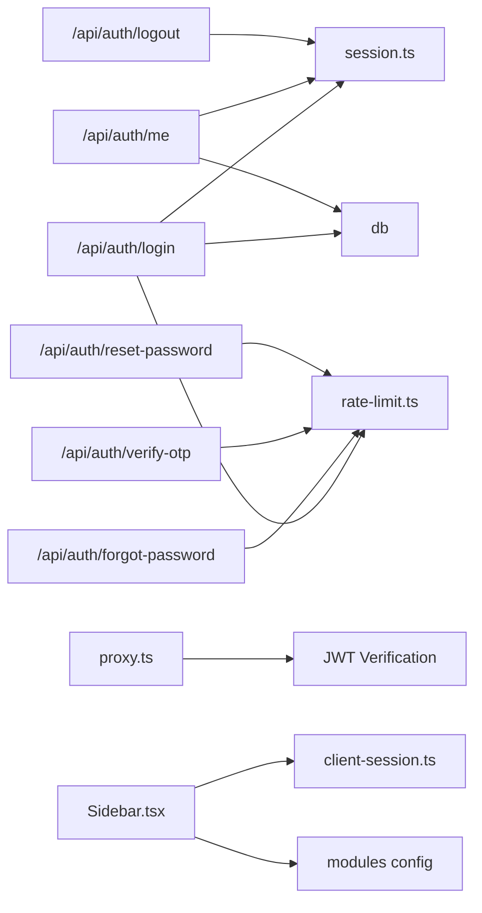

**Diagram sources**
- [login route:1-122](file://src/app/api/auth/login/route.ts#L1-L122)
- [me route:1-69](file://src/app/api/auth/me/route.ts#L1-L69)
- [logout route:1-35](file://src/app/api/auth/logout/route.ts#L1-L35)
- [forgot-password route:1-94](file://src/app/api/auth/forgot-password/route.ts#L1-L94)
- [verify-otp route:1-66](file://src/app/api/auth/verify-otp/route.ts#L1-L66)
- [reset-password route:1-64](file://src/app/api/auth/reset-password/route.ts#L1-L64)
- [proxy.ts:1-59](file://src/proxy.ts#L1-L59)
- [session.ts:1-37](file://src/lib/session.ts#L1-L37)
- [rate-limit.ts:1-141](file://src/lib/rate-limit.ts#L1-L141)
- [client-session.ts:1-16](file://src/lib/client-session.ts#L1-L16)
- [Sidebar.tsx:1-800](file://src/components/Sidebar.tsx#L1-L800)

**Section sources**
- [login route:1-122](file://src/app/api/auth/login/route.ts#L1-L122)
- [me route:1-69](file://src/app/api/auth/me/route.ts#L1-L69)
- [logout route:1-35](file://src/app/api/auth/logout/route.ts#L1-L35)
- [forgot-password route:1-94](file://src/app/api/auth/forgot-password/route.ts#L1-L94)
- [verify-otp route:1-66](file://src/app/api/auth/verify-otp/route.ts#L1-L66)
- [reset-password route:1-64](file://src/app/api/auth/reset-password/route.ts#L1-L64)
- [proxy.ts:1-59](file://src/proxy.ts#L1-L59)
- [session.ts:1-37](file://src/lib/session.ts#L1-L37)
- [rate-limit.ts:1-141](file://src/lib/rate-limit.ts#L1-L141)
- [client-session.ts:1-16](file://src/lib/client-session.ts#L1-L16)
- [Sidebar.tsx:1-800](file://src/components/Sidebar.tsx#L1-L800)

## Performance Considerations
- JWT operations are lightweight; ensure JWT_SECRET is strong and rotated periodically.
- Rate limiting uses DB when available; consider Redis for multi-instance deployments to avoid contention.
- Minimize DB queries in hot paths; batch where possible.
- Use httpOnly cookies to reduce XSS risk and avoid heavy client-side token storage.
- Keep enabled modules fetching minimal; cache at CDN or browser level if appropriate.
- **Updated** Public route access reduces unnecessary authentication overhead for marketing pages.

## Troubleshooting Guide
- Login fails with "Invalid email or password":
  - Check user existence and password hashing; verify bcrypt comparison logic and that the correct user table is queried.
- "Your token has expired" errors:
  - Ensure JWT_SECRET is consistent between sign and verify; confirm token lifetime and cookie propagation.
- CSRF rejections:
  - Confirm Origin/Referer headers match allowed origins; adjust ALLOWED_ORIGINS if necessary.
- Rate limit 429 errors:
  - Inspect keys used (e.g., login:ip), verify DB table availability, and review thresholds.
- Password reset OTP issues:
  - Verify OTP expiration windows, email delivery, and that reset tokens are marked verified before use.
- **Updated** Root path redirects unexpectedly:
  - Check proxy middleware configuration; ensure `/` is not included in protected route patterns.
- **Updated** Login form errors not displaying:
  - Verify error state management in LoginForm component; check network requests and API responses.

**Section sources**
- [login route:1-122](file://src/app/api/auth/login/route.ts#L1-L122)
- [session.ts:1-37](file://src/lib/session.ts#L1-L37)
- [csrf.ts:1-47](file://src/lib/csrf.ts#L1-L47)
- [rate-limit.ts:1-141](file://src/lib/rate-limit.ts#L1-L141)
- [forgot-password route:1-94](file://src/app/api/auth/forgot-password/route.ts#L1-L94)
- [verify-otp route:1-66](file://src/app/api/auth/verify-otp/route.ts#L1-L66)
- [reset-password route:1-64](file://src/app/api/auth/reset-password/route.ts#L1-L64)
- [proxy.ts:1-59](file://src/proxy.ts#L1-L59)
- [LoginForm.tsx:1-219](file://src/app/login/components/LoginForm.tsx#L1-L219)

## Conclusion
UniTrack implements a robust, layered security model with modern authentication patterns:
- Secure JWT sessions with httpOnly cookies
- Fine-grained RBAC with role-based navigation
- Route-level middleware protection for sensitive areas
- CSRF validation and rate limiting for sensitive flows
- Time-bound OTP-based password recovery
- Public access to marketing and informational content
- Enhanced user experience with improved error handling

The updated architecture balances security with usability by allowing public access to essential pages while protecting authenticated functionality. Adopt the provided patterns to add new protected routes, enforce permissions, and maintain a secure, scalable authentication system.

## Appendices

### Data Model Notes
- Users and related entities are defined in the Prisma schema; login logs and relationships support auditing and access tracking.

**Section sources**
- [schema.prisma:139-200](file://prisma/schema.prisma#L139-L200)