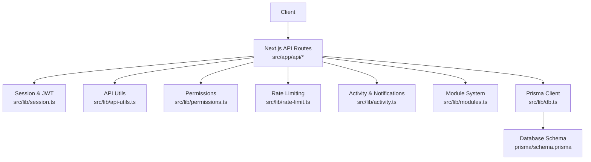
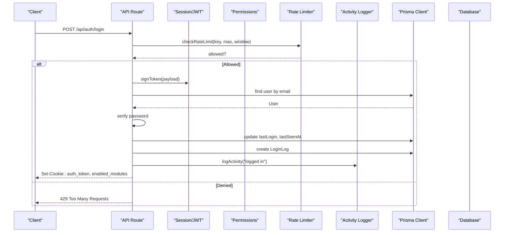
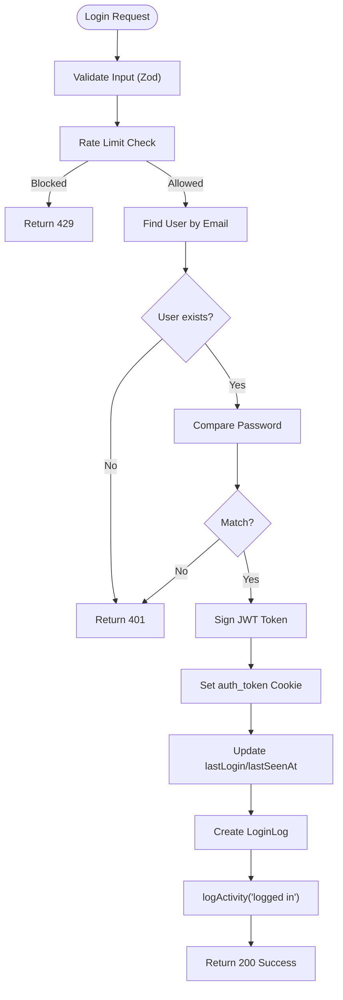
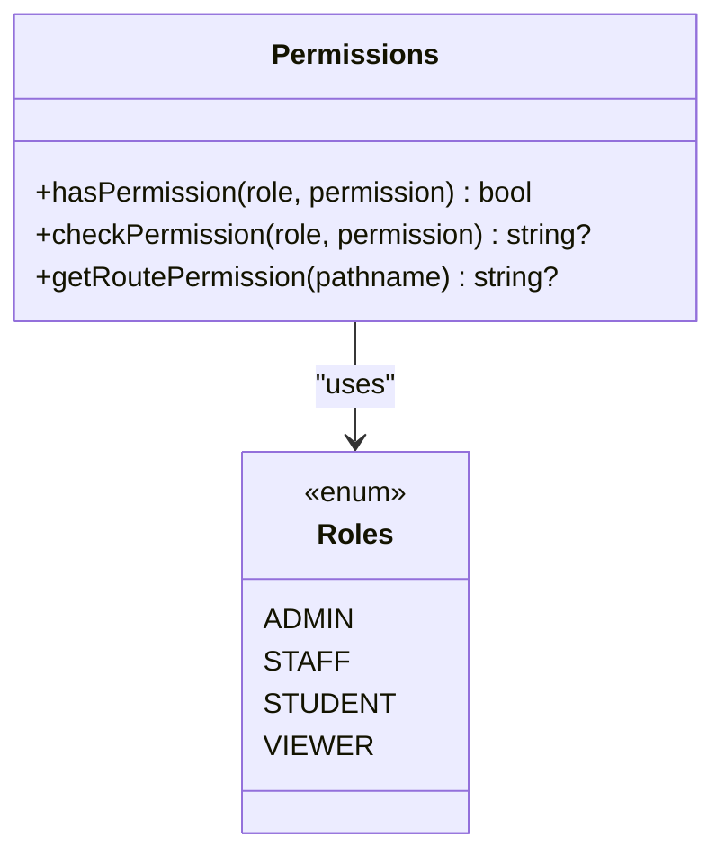
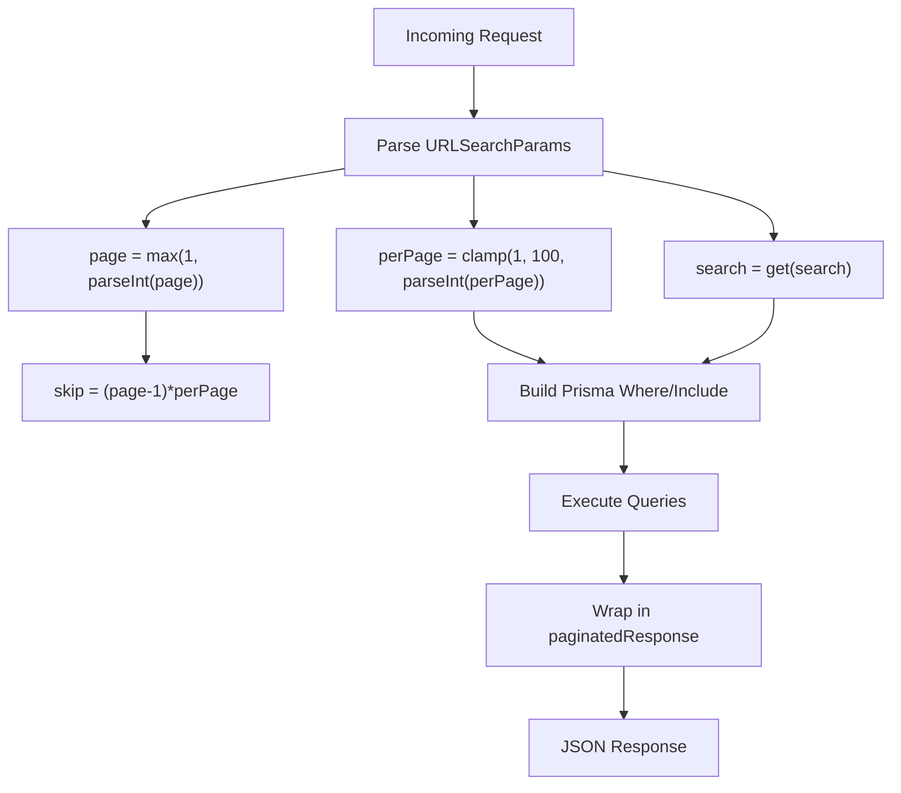
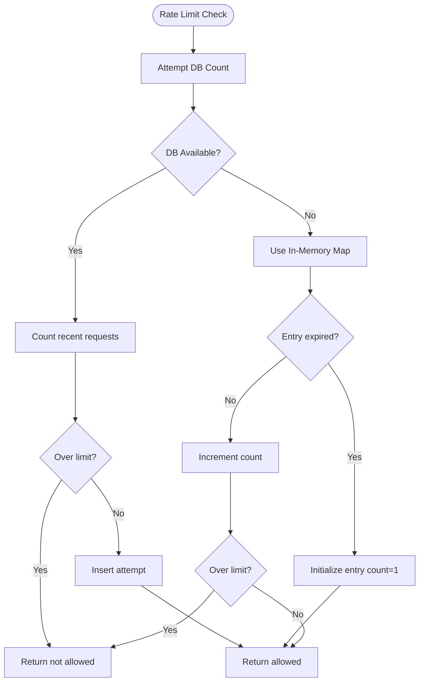
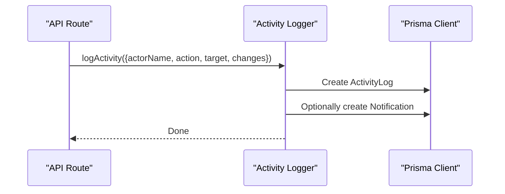
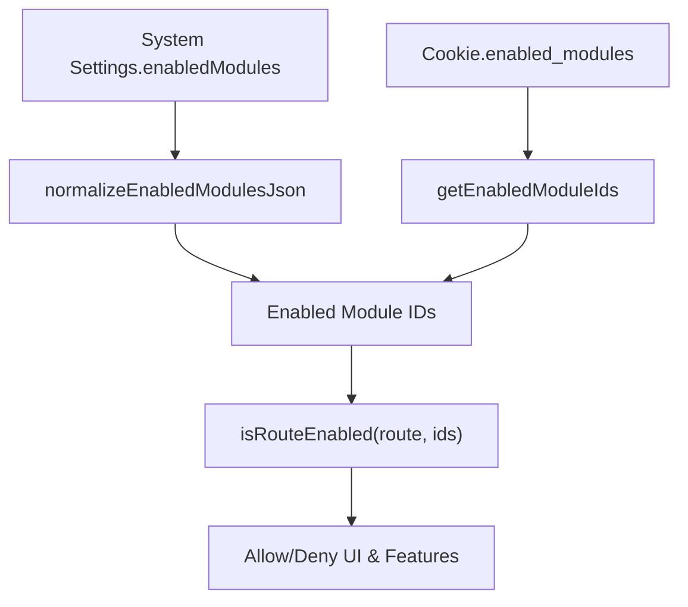
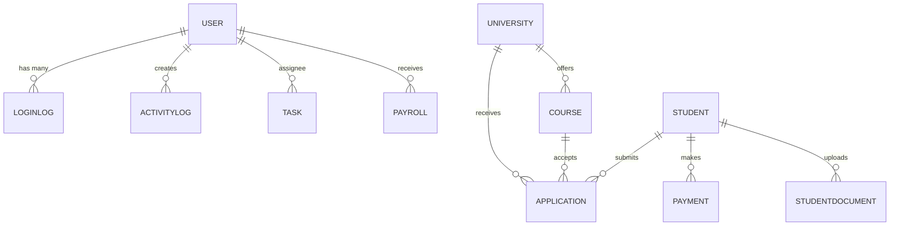
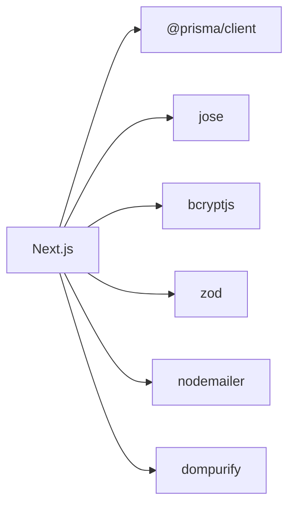

# Backend Architecture

<cite>
**Referenced Files in This Document**
- [package.json](file://package.json)
- [schema.prisma](file://prisma/schema.prisma)
- [db.ts](file://src/lib/db.ts)
- [logger.ts](file://src/lib/logger.ts)
- [modules.ts](file://src/lib/modules.ts)
- [session.ts](file://src/lib/session.ts)
- [permissions.ts](file://src/lib/permissions.ts)
- [api-utils.ts](file://src/lib/api-utils.ts)
- [activity.ts](file://src/lib/activity.ts)
- [rate-limit.ts](file://src/lib/rate-limit.ts)
- [login route.ts](file://src/app/api/auth/login/route.ts)
- [students route.ts](file://src/app/api/students/route.ts)
- [universities route.ts](file://src/app/api/universities/route.ts)
- [users route.ts](file://src/app/api/users/route.ts)
- [roles route.ts](file://src/app/api/roles/route.ts)
</cite>

## Table of Contents
1. Introduction
2. Project Structure
3. Core Components
4. Architecture Overview
5. Detailed Component Analysis
6. Dependency Analysis
7. Performance Considerations
8. Troubleshooting Guide
9. Conclusion

## Introduction
This document describes the backend architecture of UniTrack with a focus on API routes, middleware patterns, service-layer organization, and database interactions using Prisma ORM. It explains how authentication, authorization, rate limiting, logging, and module configuration work together to provide secure, scalable endpoints. It also provides guidance for extending functionality, adding new modules, maintaining code quality, and troubleshooting performance and connectivity issues.

## Project Structure
UniTrack is built on Next.js App Router. Each feature exposes REST-like endpoints under src/app/api/<feature>/route.ts files. Shared utilities live under src/lib and include:
- Database client initialization (Prisma)
- Session management (JWT via jose)
- Authentication and authorization helpers
- Pagination, error formatting, and session extraction
- Rate limiting with DB-backed counters and in-memory fallback
- Activity logging and notifications
- Module enablement and routing control
- Logging with sensitive data sanitization

**Diagram sources**
- [login route.ts:1-123](file://src/app/api/auth/login/route.ts#L1-L123)
- [students route.ts:1-214](file://src/app/api/students/route.ts#L1-L214)
- [universities route.ts:1-158](file://src/app/api/universities/route.ts#L1-L158)
- [session.ts:1-37](file://src/lib/session.ts#L1-L37)
- [api-utils.ts:1-84](file://src/lib/api-utils.ts#L1-L84)
- [permissions.ts:1-107](file://src/lib/permissions.ts#L1-L107)
- [rate-limit.ts:1-141](file://src/lib/rate-limit.ts#L1-L141)
- [activity.ts:1-114](file://src/lib/activity.ts#L1-L114)
- [modules.ts:1-252](file://src/lib/modules.ts#L1-L252)
- [db.ts:1-8](file://src/lib/db.ts#L1-L8)
- [schema.prisma:1-800](file://prisma/schema.prisma#L1-L800)

**Section sources**
- [package.json:39-55](file://package.json#L39-L55)
- [schema.prisma:1-800](file://prisma/schema.prisma#L1-L800)

## Core Components
- API Routes: Feature-scoped handlers under src/app/api that implement GET/POST/PUT/DELETE semantics, input validation, authorization checks, and database operations.
- Middleware Patterns:
  - Authentication via JWT stored in httpOnly cookies; verified per request.
  - Authorization via role-based checks and permission maps.
  - Rate limiting with DB-backed counters and in-memory fallback.
  - Input validation using Zod schemas where applicable.
- Service Layer Patterns:
  - Reusable helpers in src/lib for pagination, error responses, session extraction, activity logging, and notifications.
  - Business logic encapsulated within route handlers and shared utilities rather than deep service classes, keeping routes concise and testable.
- Database Interaction:
  - Prisma ORM configured for SQLite with environment-driven DATABASE_URL.
  - Global singleton Prisma client to avoid connection churn during development.
  - Query optimization through selective includes, counts, and indexed fields.
- Module System:
  - Centralized module definitions mapping IDs to labels, descriptions, and routes.
  - Runtime normalization of enabled modules from system settings or cookies.
- Security:
  - Password hashing with bcryptjs.
  - JWT signing and verification with jose.
  - CSRF-safe cookie flags and strict SameSite policy.
  - Sensitive data redaction in logs.

**Section sources**
- [login route.ts:1-123](file://src/app/api/auth/login/route.ts#L1-L123)
- [students route.ts:1-214](file://src/app/api/students/route.ts#L1-L214)
- [universities route.ts:1-158](file://src/app/api/universities/route.ts#L1-L158)
- [session.ts:1-37](file://src/lib/session.ts#L1-L37)
- [permissions.ts:1-107](file://src/lib/permissions.ts#L1-L107)
- [rate-limit.ts:1-141](file://src/lib/rate-limit.ts#L1-L141)
- [api-utils.ts:1-84](file://src/lib/api-utils.ts#L1-L84)
- [activity.ts:1-114](file://src/lib/activity.ts#L1-L114)
- [modules.ts:1-252](file://src/lib/modules.ts#L1-L252)
- [db.ts:1-8](file://src/lib/db.ts#L1-L8)
- [schema.prisma:1-800](file://prisma/schema.prisma#L1-L800)

## Architecture Overview
The backend follows a layered approach:
- Presentation/API Layer: Next.js API routes handle HTTP requests, parse inputs, enforce authz/authn, and orchestrate business logic.
- Utility/Service Layer: Shared functions in src/lib provide cross-cutting concerns like pagination, error handling, session management, permissions, rate limiting, activity logging, and notifications.
- Data Access Layer: Prisma client abstracts database operations defined by schema.prisma.

**Diagram sources**
- [login route.ts:1-123](file://src/app/api/auth/login/route.ts#L1-L123)
- [session.ts:1-37](file://src/lib/session.ts#L1-L37)
- [rate-limit.ts:1-141](file://src/lib/rate-limit.ts#L1-L141)
- [activity.ts:1-114](file://src/lib/activity.ts#L1-L114)
- [db.ts:1-8](file://src/lib/db.ts#L1-L8)
- [schema.prisma:1-800](file://prisma/schema.prisma#L1-L800)

## Detailed Component Analysis

### Authentication and Session Management
- JWT-based sessions are signed with HS256 and stored in httpOnly cookies with secure and SameSite policies.
- Sessions are verified on each request by extracting the token from cookies and validating it against the secret key.
- Login flow validates credentials, sets tokens, updates last login metadata, records login logs, and emits activity events.

**Diagram sources**
- [login route.ts:1-123](file://src/app/api/auth/login/route.ts#L1-L123)
- [session.ts:1-37](file://src/lib/session.ts#L1-L37)
- [rate-limit.ts:1-141](file://src/lib/rate-limit.ts#L1-L141)
- [activity.ts:1-114](file://src/lib/activity.ts#L1-L114)

**Section sources**
- [login route.ts:1-123](file://src/app/api/auth/login/route.ts#L1-L123)
- [session.ts:1-37](file://src/lib/session.ts#L1-L37)

### Authorization and Permissions
- Role-based access control uses a permissions map to define which roles can perform specific actions across features.
- Route-level checks ensure only authorized roles can execute write operations; read operations may be broader depending on the feature.
- Permission helpers support both boolean checks and error-returning variants for consistent handling.

**Diagram sources**
- [permissions.ts:1-107](file://src/lib/permissions.ts#L1-L107)

**Section sources**
- [permissions.ts:1-107](file://src/lib/permissions.ts#L1-L107)

### API Utilities and Pagination
- Standardized error responses and success wrappers reduce duplication.
- getSession extracts and verifies the JWT from cookies, returning null when invalid.
- Pagination helpers compute skip/take based on page/perPage and build search filters across multiple fields.
- PaginatedResponse standardizes list outputs with total and totalPages.

**Diagram sources**
- [api-utils.ts:1-84](file://src/lib/api-utils.ts#L1-L84)

**Section sources**
- [api-utils.ts:1-84](file://src/lib/api-utils.ts#L1-L84)

### Rate Limiting
- Provides DB-backed rate limiting with an in-memory fallback if the required table is missing.
- Tracks attempts per key (e.g., IP-based keys) within a time window and returns remaining quota and reset times.
- Includes helper headers for clients to adapt behavior.

**Diagram sources**
- [rate-limit.ts:1-141](file://src/lib/rate-limit.ts#L1-L141)

**Section sources**
- [rate-limit.ts:1-141](file://src/lib/rate-limit.ts#L1-L141)

### Activity Logging and Notifications
- Captures actor details, actions, targets, and optional change diffs.
- Automatically creates notifications for significant actions such as creation, invitation, or deletion.
- Provides safe serialization for complex values and robust error handling.

**Diagram sources**
- [activity.ts:1-114](file://src/lib/activity.ts#L1-L114)

**Section sources**
- [activity.ts:1-114](file://src/lib/activity.ts#L1-L114)

### Module System and Configuration
- Central registry defines modules with IDs, labels, descriptions, routes, and default enablement.
- Normalizes enabled modules from system settings or cookies, ensuring a sensible default state.
- Route gating uses prefix matching to determine visibility and access.

**Diagram sources**
- [modules.ts:1-252](file://src/lib/modules.ts#L1-L252)

**Section sources**
- [modules.ts:1-252](file://src/lib/modules.ts#L1-L252)

### Database Interaction with Prisma
- Singleton Prisma client avoids re-initialization overhead during development.
- Schema defines core entities including University, Student, Application, User, Role, and related models with indexes and relations.
- Queries use selective includes and counts to optimize payload size and performance.

**Diagram sources**
- [schema.prisma:1-800](file://prisma/schema.prisma#L1-L800)

**Section sources**
- [db.ts:1-8](file://src/lib/db.ts#L1-L8)
- [schema.prisma:1-800](file://prisma/schema.prisma#L1-L800)

### Example: Implementing a New API Endpoint
- Create a new route file under src/app/api/<feature>/route.ts.
- Use api-utils for session extraction and standardized responses.
- Validate inputs with Zod or manual checks.
- Enforce authorization using role checks or permission helpers.
- Perform database operations via Prisma with selective includes and counts.
- Log relevant activities and emit notifications where appropriate.
- Handle errors consistently and return appropriate status codes.

Concrete references:
- Listing and creating students with pagination, filtering, and notifications: [students route.ts:1-214](file://src/app/api/students/route.ts#L1-L214)
- Listing and creating universities with transformation and notifications: [universities route.ts:1-158](file://src/app/api/universities/route.ts#L1-L158)
- Fetching users with session verification: [users route.ts:1-42](file://src/app/api/users/route.ts#L1-L42)
- Managing roles with activity logging: [roles route.ts:1-92](file://src/app/api/roles/route.ts#L1-L92)

**Section sources**
- [students route.ts:1-214](file://src/app/api/students/route.ts#L1-L214)
- [universities route.ts:1-158](file://src/app/api/universities/route.ts#L1-L158)
- [users route.ts:1-42](file://src/app/api/users/route.ts#L1-L42)
- [roles route.ts:1-92](file://src/app/api/roles/route.ts#L1-L92)

## Dependency Analysis
Key runtime dependencies and their roles:
- next: App Router and serverless-friendly API routes.
- @prisma/client and prisma: ORM and schema-driven database access.
- jose: JWT signing and verification.
- bcryptjs: Secure password hashing.
- zod: Input validation.
- nodemailer: Email sending capabilities.
- dompurify: HTML sanitization for safe content rendering.

**Diagram sources**
- [package.json:56-108](file://package.json#L56-L108)

**Section sources**
- [package.json:56-108](file://package.json#L56-L108)

## Performance Considerations
- Use selective includes and _count projections to minimize payload sizes and reduce N+1 queries.
- Leverage indexes defined in the schema for frequent filter fields (e.g., studentId, universityId, courseId).
- Apply pagination consistently for large lists to control memory and network usage.
- Prefer batched operations and parallel queries (e.g., Promise.all for list and count) where safe.
- Monitor rate limiter behavior and consider Redis-backed implementation for multi-instance deployments.
- Avoid logging sensitive data; use the sanitized logger to prevent accidental exposure.

[No sources needed since this section provides general guidance]

## Troubleshooting Guide
Common issues and resolutions:
- Authentication failures:
  - Ensure JWT_SECRET is set and matches between signing and verification.
  - Verify cookies are correctly set with httpOnly, secure, and SameSite attributes.
  - Check session extraction logic and token expiration handling.
- Database connectivity problems:
  - Confirm DATABASE_URL points to a valid SQLite file or supported provider.
  - Ensure Prisma client is initialized once per process in development.
  - For rate limiting, ensure the RateLimitLog table exists or rely on in-memory fallback.
- Performance bottlenecks:
  - Inspect queries for missing indexes or excessive includes.
  - Validate pagination parameters to avoid large payloads.
  - Profile slow endpoints and consider caching or query optimization.
- Error handling and logging:
  - Use centralized error responses and sanitize logs to avoid leaking secrets.
  - Capture stack traces in non-test environments for debugging.

**Section sources**
- [session.ts:1-37](file://src/lib/session.ts#L1-L37)
- [db.ts:1-8](file://src/lib/db.ts#L1-L8)
- [rate-limit.ts:1-141](file://src/lib/rate-limit.ts#L1-L141)
- [logger.ts:1-49](file://src/lib/logger.ts#L1-L49)

## Conclusion
UniTrack’s backend leverages Next.js API routes, Prisma ORM, and a cohesive set of utilities to deliver secure, maintainable, and scalable services. Authentication and authorization are enforced at the route level, while shared helpers standardize pagination, error handling, and logging. The module system enables flexible feature toggling and configuration. By following the patterns and guidelines outlined here, teams can extend functionality safely, optimize database interactions, and troubleshoot effectively.

[No sources needed since this section summarizes without analyzing specific files]