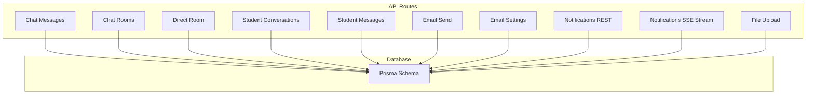
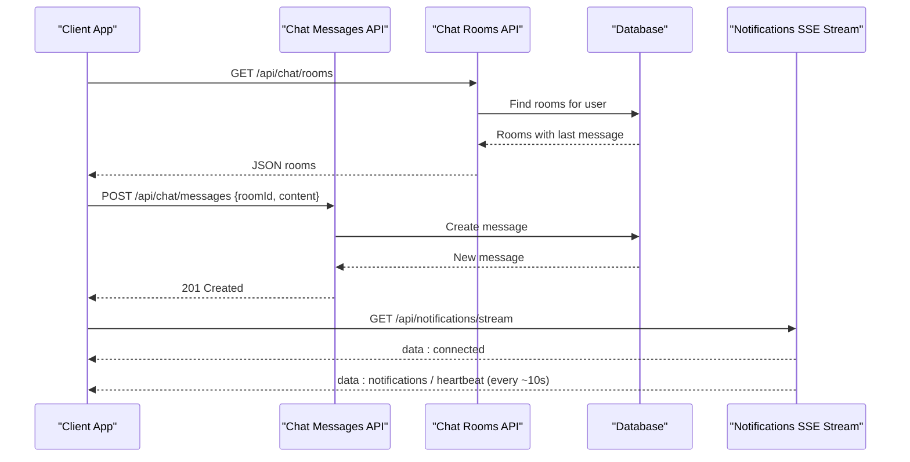
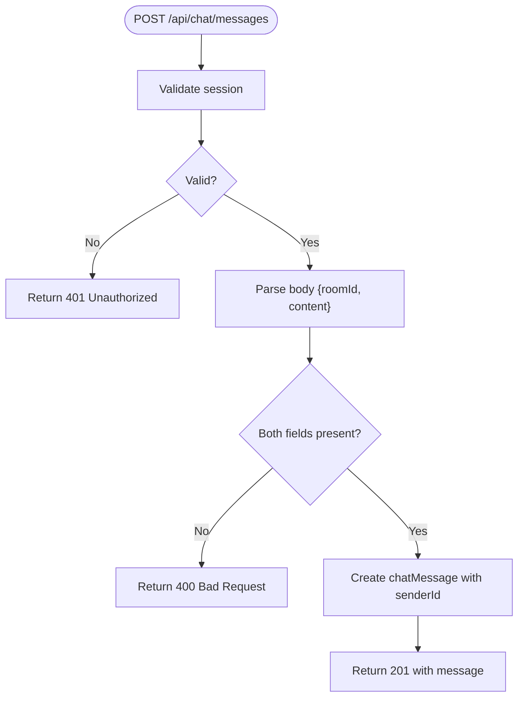
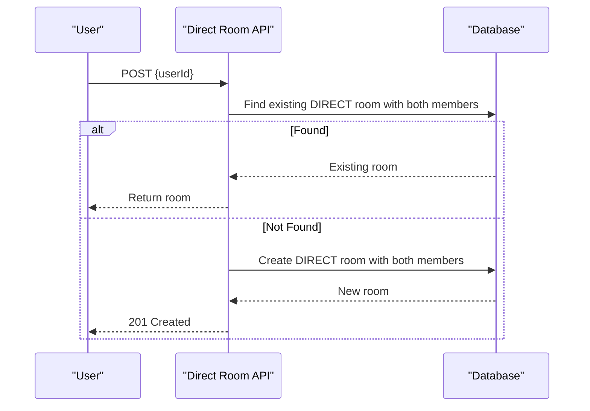
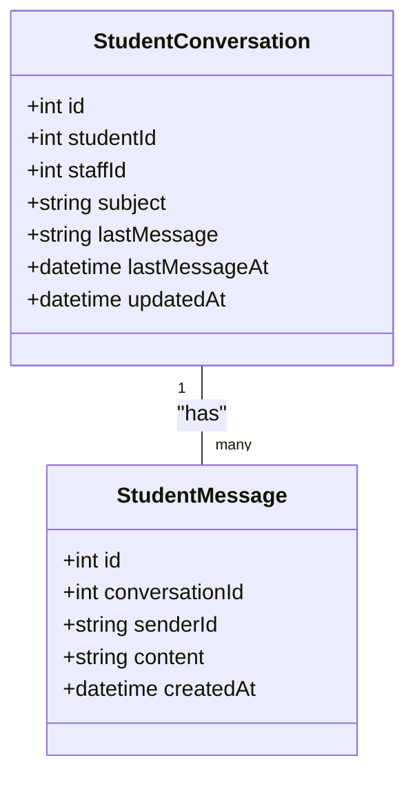
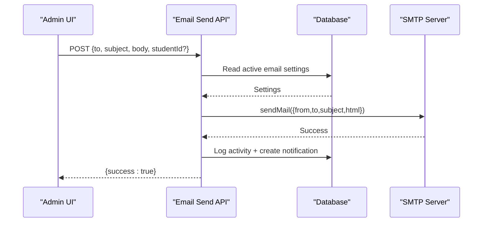
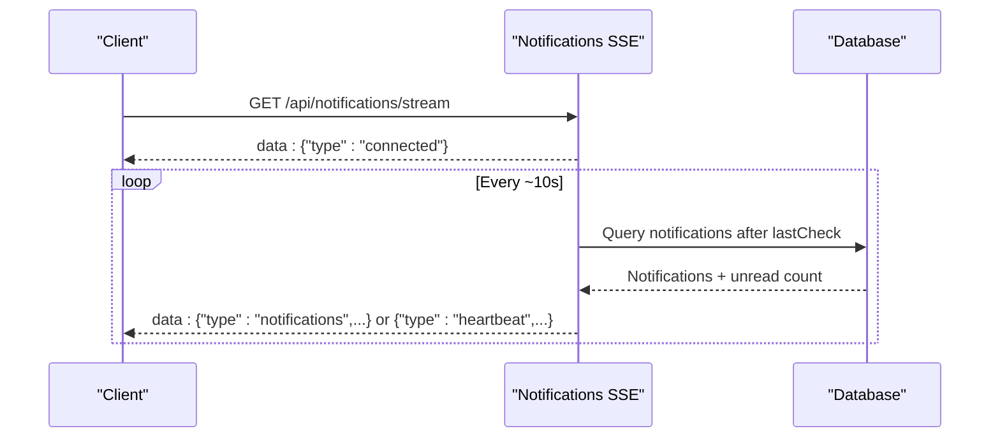
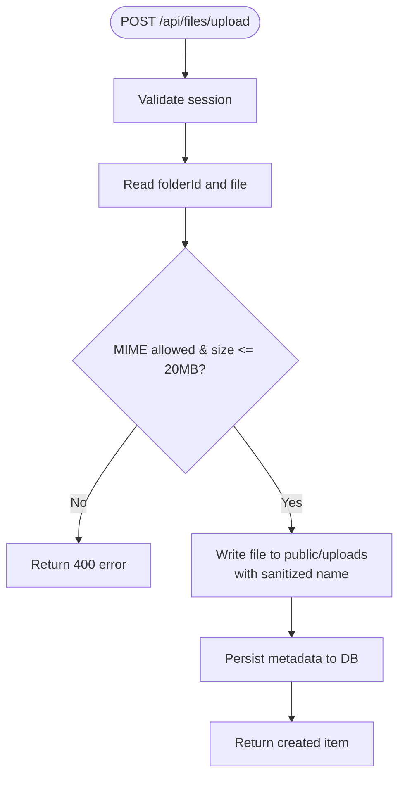
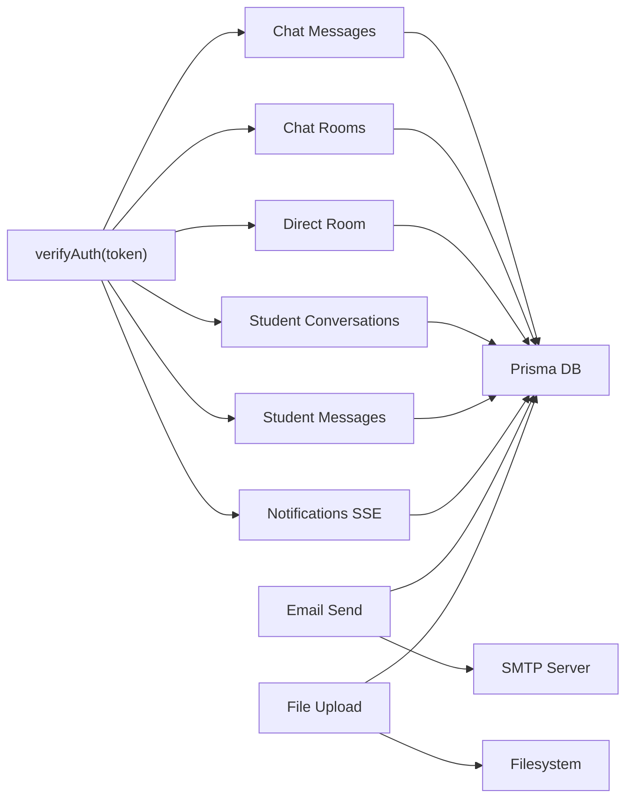

# Communication & Collaboration

<cite>
**Referenced Files in This Document**
- [route.ts](file://src/app/api/chat/messages/route.ts)
- [route.ts](file://src/app/api/chat/rooms/route.ts)
- [route.ts](file://src/app/api/chat/rooms/[id]/route.ts)
- [route.ts](file://src/app/api/chat/rooms/direct/route.ts)
- [route.ts](file://src/app/api/student-messages/conversations/route.ts)
- [route.ts](file://src/app/api/student-messages/messages/route.ts)
- [route.ts](file://src/app/api/email/send/route.ts)
- [route.ts](file://src/app/api/email-settings/route.ts)
- [schema.prisma](file://prisma/schema.prisma)
- [route.ts](file://src/app/api/notifications/route.ts)
- [route.ts](file://src/app/api/notifications/stream/route.ts)
- [notifications.ts](file://src/lib/notifications.ts)
- [route.ts](file://src/app/api/files/upload/route.ts)
- [page.tsx](file://src/app/chat/page.tsx)
- [page.tsx](file://src/app/student-portal/messages/page.tsx)
</cite>

## Table of Contents
1. Introduction
2. Project Structure
3. Core Components
4. Architecture Overview
5. Detailed Component Analysis
6. Dependency Analysis
7. Performance Considerations
8. Troubleshooting Guide
9. Conclusion

## Introduction
This document explains the Communication & Collaboration system with a focus on real-time messaging, team coordination, student-counselor conversations, email notifications, and file sharing. It covers chat rooms, message delivery, conversation threading, notification streams, and integrations with student management and university communications. It also provides configuration guidance for channels, permissions, monitoring, and troubleshooting connectivity and delivery issues.

## Project Structure
The communication features are implemented as Next.js API routes under src/app/api, with dedicated modules for:
- Chat rooms and messages (internal/support)
- Student-counselor conversations and messages
- Email sending and settings
- Notifications (REST + Server-Sent Events stream)
- File uploads for attachments

Frontend entry points exist for the chat page and student portal messages.

**Diagram sources**
- [route.ts:17-53](file://src/app/api/chat/messages/route.ts#L17-L53)
- [route.ts:17-47](file://src/app/api/chat/rooms/route.ts#L17-L47)
- [route.ts:17-59](file://src/app/api/chat/rooms/direct/route.ts#L17-L59)
- [route.ts:17-51](file://src/app/api/student-messages/conversations/route.ts#L17-L51)
- [route.ts:17-57](file://src/app/api/student-messages/messages/route.ts#L17-L57)
- [route.ts:8-80](file://src/app/api/email/send/route.ts#L8-L80)
- [route.ts:6-68](file://src/app/api/email-settings/route.ts#L6-L68)
- [route.ts:18-141](file://src/app/api/notifications/route.ts#L18-L141)
- [route.ts:21-103](file://src/app/api/notifications/stream/route.ts#L21-L103)
- [route.ts:86-186](file://src/app/api/files/upload/route.ts#L86-L186)
- [schema.prisma:139-198](file://prisma/schema.prisma#L139-L198)
- [schema.prisma:261-276](file://prisma/schema.prisma#L261-L276)
- [schema.prisma:324-332](file://prisma/schema.prisma#L324-L332)
- [schema.prisma:334-409](file://prisma/schema.prisma#L334-L409)
- [schema.prisma:785-800](file://prisma/schema.prisma#L785-L800)

**Section sources**
- [page.tsx:10-15](file://src/app/chat/page.tsx#L10-L15)
- [page.tsx:1-6](file://src/app/student-portal/messages/page.tsx#L1-L6)

## Core Components
- Chat Rooms and Messages: Create rooms, list user rooms, send/retrieve messages within a room, delete rooms with cascading message cleanup.
- Direct Messaging: Automatically find or create a direct room between two users.
- Student-Counselor Conversations: Threaded conversations per student-staff pair with message history and last-message tracking.
- Email System: Send emails via SMTP using configured settings; log activity and create notifications; read current settings.
- Notifications: REST endpoints to list/create/update/delete notifications; SSE stream for real-time updates.
- File Sharing: Secure upload with allowed MIME types, size limits, sanitization, and storage under public/uploads; metadata persisted to database.

**Section sources**
- [route.ts:17-53](file://src/app/api/chat/messages/route.ts#L17-L53)
- [route.ts:17-47](file://src/app/api/chat/rooms/route.ts#L17-L47)
- [route.ts:17-43](file://src/app/api/chat/rooms/[id]/route.ts#L17-L43)
- [route.ts:17-59](file://src/app/api/chat/rooms/direct/route.ts#L17-L59)
- [route.ts:17-51](file://src/app/api/student-messages/conversations/route.ts#L17-L51)
- [route.ts:17-57](file://src/app/api/student-messages/messages/route.ts#L17-L57)
- [route.ts:8-80](file://src/app/api/email/send/route.ts#L8-L80)
- [route.ts:6-68](file://src/app/api/email-settings/route.ts#L6-L68)
- [route.ts:18-141](file://src/app/api/notifications/route.ts#L18-L141)
- [route.ts:21-103](file://src/app/api/notifications/stream/route.ts#L21-L103)
- [route.ts:86-186](file://src/app/api/files/upload/route.ts#L86-L186)

## Architecture Overview
The system uses a request-driven architecture with optional real-time updates via Server-Sent Events. Authentication is enforced at each route by validating an auth token from cookies. Data persistence is handled through Prisma against a SQLite database.

**Diagram sources**
- [route.ts:17-47](file://src/app/api/chat/rooms/route.ts#L17-L47)
- [route.ts:17-53](file://src/app/api/chat/messages/route.ts#L17-L53)
- [route.ts:21-103](file://src/app/api/notifications/stream/route.ts#L21-L103)

## Detailed Component Analysis

### Chat Rooms and Messages
- Room listing returns all rooms where the authenticated user is a member, including the most recent message for quick previews.
- Creating a room supports group chats and defaults to DIRECT type when not specified; it auto-connects the creator.
- Deleting a room requires membership and removes all associated messages before deleting the room.
- Message retrieval is filtered by roomId and ordered chronologically; posting creates a message linked to the sender and room.

**Diagram sources**
- [route.ts:35-53](file://src/app/api/chat/messages/route.ts#L35-L53)

**Section sources**
- [route.ts:17-47](file://src/app/api/chat/rooms/route.ts#L17-L47)
- [route.ts:17-43](file://src/app/api/chat/rooms/[id]/route.ts#L17-L43)
- [route.ts:17-53](file://src/app/api/chat/messages/route.ts#L17-L53)

### Direct Messaging
- Ensures a one-to-one channel exists between the current user and a target user.
- Returns existing room if found; otherwise creates a new DIRECT room with both members.

**Diagram sources**
- [route.ts:17-59](file://src/app/api/chat/rooms/direct/route.ts#L17-L59)

**Section sources**
- [route.ts:17-59](file://src/app/api/chat/rooms/direct/route.ts#L17-L59)

### Student-Counselor Conversations
- Lists all conversations with latest message preview and includes student/staff details.
- Creates a unique conversation per student-staff pair; prevents duplicates.
- Message retrieval filters by conversationId and orders by creation time.
- Posting a message updates the conversation’s last message and timestamps.

**Diagram sources**
- [schema.prisma:334-409](file://prisma/schema.prisma#L334-L409)
- [route.ts:17-51](file://src/app/api/student-messages/conversations/route.ts#L17-L51)
- [route.ts:17-57](file://src/app/api/student-messages/messages/route.ts#L17-L57)

**Section sources**
- [route.ts:17-51](file://src/app/api/student-messages/conversations/route.ts#L17-L51)
- [route.ts:17-57](file://src/app/api/student-messages/messages/route.ts#L17-L57)

### Email Notification System
- Sending email requires Admin/Super Admin/Staff roles; validates required fields.
- Reads active email settings from the database and sends via SMTP using nodemailer.
- Logs activity and creates a success notification; optionally updates student’s last activity.
- Settings endpoint allows authorized users to configure SMTP host, port, encryption, and sender identity.

**Diagram sources**
- [route.ts:8-80](file://src/app/api/email/send/route.ts#L8-L80)
- [route.ts:6-68](file://src/app/api/email-settings/route.ts#L6-L68)

**Section sources**
- [route.ts:8-80](file://src/app/api/email/send/route.ts#L8-L80)
- [route.ts:6-68](file://src/app/api/email-settings/route.ts#L6-L68)

### Notifications (REST + SSE)
- REST: List, create, mark read, and delete notifications scoped to the current user or global.
- SSE: Persistent stream that authenticates, polls for new notifications every ~10 seconds, and pushes events with formatted timestamps and unread counts.

**Diagram sources**
- [route.ts:21-103](file://src/app/api/notifications/stream/route.ts#L21-L103)
- [route.ts:18-141](file://src/app/api/notifications/route.ts#L18-L141)

**Section sources**
- [route.ts:18-141](file://src/app/api/notifications/route.ts#L18-L141)
- [route.ts:21-103](file://src/app/api/notifications/stream/route.ts#L21-L103)
- [notifications.ts:1-41](file://src/lib/notifications.ts#L1-L41)

### File Sharing and Attachments
- Enforces allowed MIME types and maximum file size (20MB).
- Sanitizes filenames and handles collisions by appending counters.
- Supports uploading into user folders or student-specific contexts; persists metadata and URLs.
- Stores files under public/uploads and exposes them via static paths.

**Diagram sources**
- [route.ts:86-186](file://src/app/api/files/upload/route.ts#L86-L186)

**Section sources**
- [route.ts:86-186](file://src/app/api/files/upload/route.ts#L86-L186)

## Dependency Analysis
- Authentication: All chat and student-message routes rely on cookie-based token verification.
- Database: Prisma models define relationships among User, ChatRoom, ChatMessage, StudentConversation, StudentMessage, EmailSetting, Notification, FileFolder, FileItem, and StudentDocument.
- External Services: Email sending depends on SMTP server availability and correct credentials.
- Real-time: SSE stream depends on persistent connections and periodic DB polling.

**Diagram sources**
- [route.ts:17-53](file://src/app/api/chat/messages/route.ts#L17-L53)
- [route.ts:17-47](file://src/app/api/chat/rooms/route.ts#L17-L47)
- [route.ts:17-59](file://src/app/api/chat/rooms/direct/route.ts#L17-L59)
- [route.ts:17-51](file://src/app/api/student-messages/conversations/route.ts#L17-L51)
- [route.ts:17-57](file://src/app/api/student-messages/messages/route.ts#L17-L57)
- [route.ts:21-103](file://src/app/api/notifications/stream/route.ts#L21-L103)
- [route.ts:8-80](file://src/app/api/email/send/route.ts#L8-L80)
- [route.ts:86-186](file://src/app/api/files/upload/route.ts#L86-L186)

**Section sources**
- [schema.prisma:139-198](file://prisma/schema.prisma#L139-L198)
- [schema.prisma:261-276](file://prisma/schema.prisma#L261-L276)
- [schema.prisma:324-332](file://prisma/schema.prisma#L324-L332)
- [schema.prisma:334-409](file://prisma/schema.prisma#L334-L409)
- [schema.prisma:785-800](file://prisma/schema.prisma#L785-L800)

## Performance Considerations
- Pagination and Limits: Message and room queries include ordering and take limits to reduce payload sizes.
- SSE Polling Interval: The SSE stream polls every ~10 seconds; adjust based on expected load and latency requirements.
- File Upload Limits: Enforce strict MIME allowlist and size caps to protect server resources.
- Database Indexes: Ensure indexes on frequently queried fields (e.g., roomId, conversationId, userId) to optimize lookups.
- Connection Management: Keep-alive headers for SSE and efficient query selection minimize overhead.

[No sources needed since this section provides general guidance]

## Troubleshooting Guide
- Real-time Connectivity Issues
  - Verify SSE connection establishment and check for unauthorized responses.
  - Confirm browser support for Server-Sent Events and that network requests are not blocked.
  - Inspect server logs for errors during polling and event emission.

- Notification Delivery Problems
  - Ensure notifications are being created via the REST endpoint or helper function.
  - Validate that the SSE stream is receiving events and that client-side listeners are attached.
  - Check database entries for notifications and their read status.

- Email Delivery Failures
  - Confirm active email settings exist and SMTP credentials are correct.
  - Validate role-based access for sending emails.
  - Review logs for SMTP errors and retry behavior.

- File Upload Errors
  - Check MIME type allowance and file size constraints.
  - Ensure destination directories exist and have write permissions.
  - Validate folder ownership for user-scoped uploads.

**Section sources**
- [route.ts:21-103](file://src/app/api/notifications/stream/route.ts#L21-L103)
- [route.ts:18-141](file://src/app/api/notifications/route.ts#L18-L141)
- [route.ts:8-80](file://src/app/api/email/send/route.ts#L8-L80)
- [route.ts:86-186](file://src/app/api/files/upload/route.ts#L86-L186)

## Conclusion
The Communication & Collaboration system provides robust chat rooms, threaded student-counselor conversations, real-time notifications, email capabilities, and secure file sharing. It integrates tightly with the user and student models and leverages Prisma for consistent data relationships. With proper configuration of SMTP and SSE, and adherence to permission checks and input validation, the system supports scalable and reliable messaging across teams and students.

[No sources needed since this section summarizes without analyzing specific files]