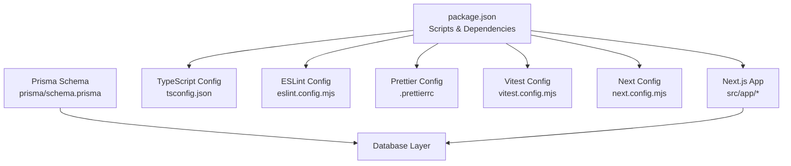
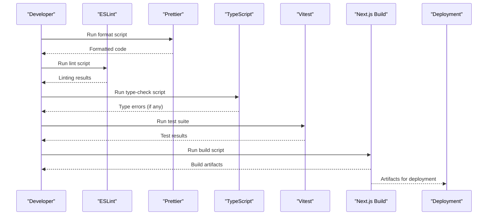
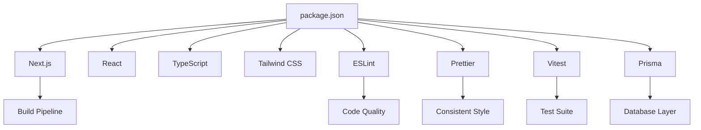

# Contributing Guidelines

<cite>
**Referenced Files in This Document**
- [package.json](file://package.json)
- [README.md](file://README.md)
- [.prettierrc](file://.prettierrc)
- [eslint.config.mjs](file://eslint.config.mjs)
- [tsconfig.json](file://tsconfig.json)
- [vitest.config.mjs](file://vitest.config.mjs)
- [next.config.mjs](file://next.config.mjs)
- [AGENTS.md](file://AGENTS.md)
- [CLAUDE.md](file://CLAUDE.md)
- [src/test/README.md](file://src/test/README.md)
- [src/test/setup.ts](file://src/test/setup.ts)
- [prisma/schema.prisma](file://prisma/schema.prisma)
</cite>

## Table of Contents
1. Introduction
2. Project Structure
3. Core Components
4. Architecture Overview
5. Detailed Component Analysis
6. Dependency Analysis
7. Performance Considerations
8. Troubleshooting Guide
9. Conclusion
10. Appendices

## Introduction
This document provides comprehensive contributing guidelines for UniTrack, focusing on development workflow and code standards. It covers environment setup, coding conventions enforced by ESLint and Prettier, Git workflow and pull request process, documentation and testing practices, code quality maintenance, review and deployment procedures, AI assistant integration, contribution templates, issue reporting, community engagement, guidance for new contributors, mentorship opportunities, best practices, and troubleshooting for common issues.

## Project Structure
UniTrack is a Next.js 15 application built with TypeScript and Tailwind CSS. The repository includes:
- Application routes and pages under src/app
- Shared UI components under src/components
- Library utilities under src/lib
- Tests under src/test and src/lib/__tests__
- Database schema and seed scripts under prisma
- Configuration files for linting, formatting, type checking, and testing at the repository root

**Diagram sources**
- [package.json:39-51](file://package.json#L39-L51)
- [tsconfig.json:1-44](file://tsconfig.json#L1-L44)
- [eslint.config.mjs:1-83](file://eslint.config.mjs#L1-L83)
- [.prettierrc:1-10](file://.prettierrc#L1-L10)
- [vitest.config.mjs:1-17](file://vitest.config.mjs#L1-L17)
- [next.config.mjs:1-47](file://next.config.mjs#L1-L47)
- [prisma/schema.prisma:1-10](file://prisma/schema.prisma#L1-L10)

**Section sources**
- [README.md:1-91](file://README.md#L1-L91)
- [package.json:39-51](file://package.json#L39-L51)

## Core Components
- Development server and build pipeline via Next.js scripts
- Type safety and path aliases via TypeScript configuration
- Code quality via ESLint rules and Prettier formatting
- Testing via Vitest with jsdom environment and global setup
- Data layer via Prisma with SQLite datasource

Key responsibilities:
- package.json defines scripts for dev, build, start, lint, format, test, and type-check
- tsconfig.json enforces strict mode, module resolution, and path alias @ to src
- eslint.config.mjs integrates Next.js web vitals, TypeScript, Prettier, unused imports, and console usage rules
- .prettierrc standardizes formatting (semicolons, quotes, width, trailing commas)
- vitest.config.mjs configures globals, jsdom environment, setup file, and test discovery patterns
- next.config.mjs sets headers, image handling, and external packages for server-side use
- prisma/schema.prisma defines database models and relations

**Section sources**
- [package.json:39-51](file://package.json#L39-L51)
- [tsconfig.json:1-44](file://tsconfig.json#L1-L44)
- [eslint.config.mjs:1-83](file://eslint.config.mjs#L1-L83)
- [.prettierrc:1-10](file://.prettierrc#L1-L10)
- [vitest.config.mjs:1-17](file://vitest.config.mjs#L1-L17)
- [next.config.mjs:1-47](file://next.config.mjs#L1-L47)
- [prisma/schema.prisma:1-10](file://prisma/schema.prisma#L1-L10)

## Architecture Overview
The development workflow integrates tooling to ensure consistent code style, type safety, and reliable tests before merging changes.

**Diagram sources**
- [package.json:39-51](file://package.json#L39-L51)
- [eslint.config.mjs:1-83](file://eslint.config.mjs#L1-L83)
- [.prettierrc:1-10](file://.prettierrc#L1-L10)
- [tsconfig.json:1-44](file://tsconfig.json#L1-L44)
- [vitest.config.mjs:1-17](file://vitest.config.mjs#L1-L17)

## Detailed Component Analysis

### Development Environment Setup
- Install dependencies using the project’s package manager
- Start the development server on port 4028
- Use provided scripts for building, starting, linting, formatting, and testing

Recommended steps:
- Install dependencies
- Run development server
- Open the local URL in your browser

**Section sources**
- [README.md:11-26](file://README.md#L11-L26)
- [package.json:39-51](file://package.json#L39-L51)

### Coding Conventions and Style Guidelines
- Enforce semicolons, double quotes, 2-space tabs, print width 100, ES5 trailing commas, and auto end-of-line via Prettier
- Integrate Prettier with ESLint to enforce formatting as errors
- Disallow unused imports and variables (with underscore prefix exceptions)
- Warn on explicit any types and disallow console statements except warn/error/info
- Ignore generated or non-source directories during linting

Formatting and linting commands:
- Format codebase
- Lint codebase
- Auto-fix lint issues

**Section sources**
- [.prettierrc:1-10](file://.prettierrc#L1-L10)
- [eslint.config.mjs:1-83](file://eslint.config.mjs#L1-L83)
- [package.json:39-51](file://package.json#L39-L51)

### TypeScript and Path Aliases
- Strict mode enabled for robust type checking
- Module resolution configured for bundler compatibility
- Path alias @ maps to src directory for cleaner imports
- Incremental compilation enabled for faster builds

Commands:
- Run type checks without emitting output

**Section sources**
- [tsconfig.json:1-44](file://tsconfig.json#L1-L44)
- [package.json:39-51](file://package.json#L39-L51)

### Testing Strategy and Requirements
- Use Vitest with jsdom environment for component and utility tests
- Global setup includes testing library DOM matchers
- Discover tests matching *.test.* and *.spec.* patterns under src
- Provide watch mode and coverage reports

Commands:
- Run tests once
- Run tests in watch mode
- Generate coverage report

**Section sources**
- [vitest.config.mjs:1-17](file://vitest.config.mjs#L1-L17)
- [src/test/setup.ts:1-2](file://src/test/setup.ts#L1-L2)
- [src/test/README.md:1-23](file://src/test/README.md#L1-L23)
- [package.json:39-51](file://package.json#L39-L51)

### API and Security Headers
- Next.js config sets security headers including X-Frame-Options, X-Content-Type-Options, X-XSS-Protection, Referrer-Policy, Permissions-Policy, and Strict-Transport-Security
- Content-Security-Policy restricts default sources and allows specific inline styles/scripts for development
- Remote image hosts are whitelisted; minimum cache TTL set for images

**Section sources**
- [next.config.mjs:1-47](file://next.config.mjs#L1-L47)

### Database and Models
- Prisma client generator configured with library engine type
- SQLite datasource used with DATABASE_URL environment variable
- Comprehensive models include users, roles, applications, students, tasks, HR modules, and more

**Section sources**
- [prisma/schema.prisma:1-10](file://prisma/schema.prisma#L1-L10)
- [prisma/schema.prisma:11-945](file://prisma/schema.prisma#L11-L945)

### AI Assistant Integration and Code Generation Guidelines
- AGENTS.md contains Next.js agent rules that must be respected when generating code
- CLAUDE.md references AGENTS.md for AI behavior
- When using AI assistants:
  - Follow Next.js conventions and deprecation notices
  - Avoid committing auto-generated agent blocks unless necessary
  - Validate generated code against ESLint, Prettier, and TypeScript checks

**Section sources**
- [AGENTS.md:1-10](file://AGENTS.md#L1-L10)
- [CLAUDE.md:1-2](file://CLAUDE.md#L1-L2)

### Documentation Standards
- Keep README updated with installation, scripts, and deployment instructions
- Add or update documentation when introducing new features or changing workflows
- Ensure code comments explain complex logic and edge cases

**Section sources**
- [README.md:1-91](file://README.md#L1-L91)

### Pull Request Process and Review
- Create feature branches from main for each change
- Ensure all checks pass: lint, format, type-check, tests, and build
- Include clear descriptions, screenshots if UI changes, and links to related issues
- Request reviews from maintainers and address feedback promptly
- Squash commits for clean history where appropriate

[No sources needed since this section provides general guidance]

### Issue Reporting Procedures
- Use a structured template:
  - Title: concise summary
  - Description: what happened vs expected
  - Steps to reproduce
  - Environment details (OS, Node version, browser)
  - Logs or screenshots
  - Severity and priority
- Tag issues appropriately and link related PRs

[No sources needed since this section provides general guidance]

### Community Engagement Guidelines
- Be respectful and inclusive in discussions
- Provide constructive feedback in reviews and issues
- Encourage knowledge sharing and mentoring
- Follow project governance and decision-making processes

[No sources needed since this section provides general guidance]

### New Contributors and Mentorship
- Start with small fixes or documentation improvements
- Ask questions in issues or discussions when unsure
- Seek mentorship from experienced contributors for complex tasks
- Participate in code reviews to learn best practices

[No sources needed since this section provides general guidance]

### Deployment Procedures
- Build the application for production using the provided script
- Verify build artifacts and run final checks before deploying
- Configure environment variables for production (e.g., DATABASE_URL)
- Deploy artifacts to your hosting platform

**Section sources**
- [README.md:68-74](file://README.md#L68-L74)
- [package.json:39-51](file://package.json#L39-L51)

## Dependency Analysis
The project relies on Next.js, React, TypeScript, Tailwind CSS, ESLint, Prettier, Vitest, and Prisma. Scripts orchestrate development, testing, and deployment workflows.

**Diagram sources**
- [package.json:56-108](file://package.json#L56-L108)
- [package.json:39-51](file://package.json#L39-L51)

**Section sources**
- [package.json:56-108](file://package.json#L56-L108)
- [package.json:39-51](file://package.json#L39-L51)

## Performance Considerations
- Enable incremental TypeScript compilation for faster builds
- Use Next.js image optimization and caching settings
- Minimize unnecessary console logs in production
- Keep dependencies up-to-date to benefit from performance improvements
- Profile tests to ensure they run efficiently in CI

[No sources needed since this section provides general guidance]

## Troubleshooting Guide
Common issues and resolutions:
- Port conflicts: The development server runs on port 4028; ensure it is free or adjust configuration
- Lint/format failures: Run format and lint:fix scripts to auto-resolve issues
- Type errors: Run type-check to identify and fix type mismatches
- Test failures: Check jsdom setup and ensure DOM-related assertions are supported
- Next.js agent rules: Follow AGENTS.md when using AI tools to avoid breaking changes

Environment-specific notes:
- Windows batch scripts exist for convenience but may reference paths not applicable to your machine; prefer cross-platform npm scripts
- Ensure DATABASE_URL is set for Prisma operations

**Section sources**
- [package.json:39-51](file://package.json#L39-L51)
- [next.config.mjs:1-47](file://next.config.mjs#L1-L47)
- [AGENTS.md:1-10](file://AGENTS.md#L1-L10)

## Conclusion
By following these guidelines, contributors can maintain high code quality, streamline development workflows, and collaborate effectively. Adhering to ESLint and Prettier rules, running tests and type checks, and respecting AI assistant constraints ensures consistent and reliable contributions.

[No sources needed since this section summarizes without analyzing specific files]

## Appendices

### Quick Commands Reference
- Development: npm run dev
- Build: npm run build
- Start (dev): npm run start
- Production server: npm run serve
- Lint: npm run lint
- Fix lint: npm run lint:fix
- Format: npm run format
- Type check: npm run type-check
- Tests: npm run test
- Watch tests: npm run test:watch
- Coverage: npm run test:coverage

**Section sources**
- [package.json:39-51](file://package.json#L39-L51)

### Recommended Pre-Merge Checklist
- Format code with Prettier
- Lint and fix issues
- Run type checks
- Execute full test suite
- Build the application
- Update documentation if needed
- Ensure security headers and CSP align with requirements

**Section sources**
- [eslint.config.mjs:1-83](file://eslint.config.mjs#L1-L83)
- [.prettierrc:1-10](file://.prettierrc#L1-L10)
- [tsconfig.json:1-44](file://tsconfig.json#L1-L44)
- [vitest.config.mjs:1-17](file://vitest.config.mjs#L1-L17)
- [next.config.mjs:1-47](file://next.config.mjs#L1-L47)
- [package.json:39-51](file://package.json#L39-L51)