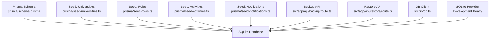
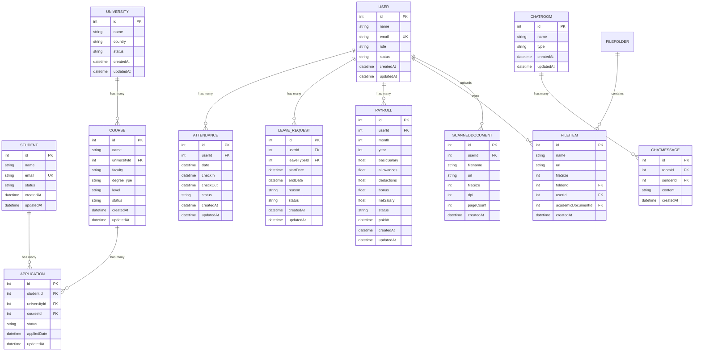
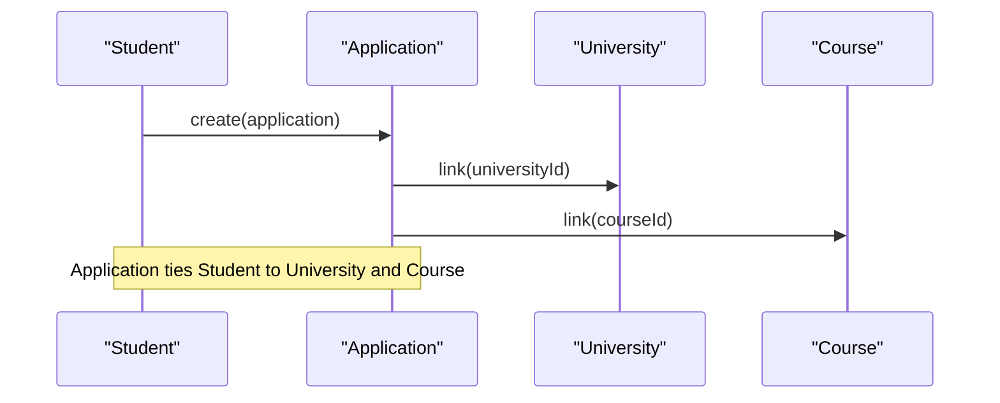
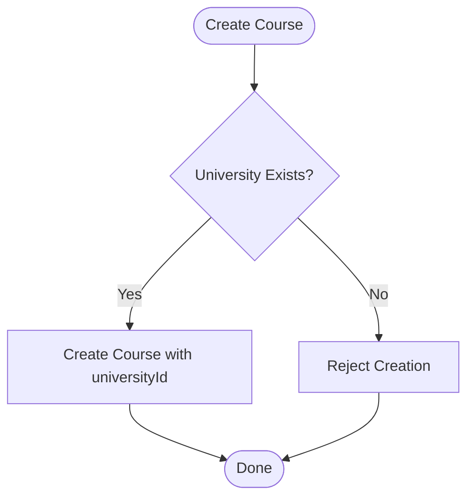
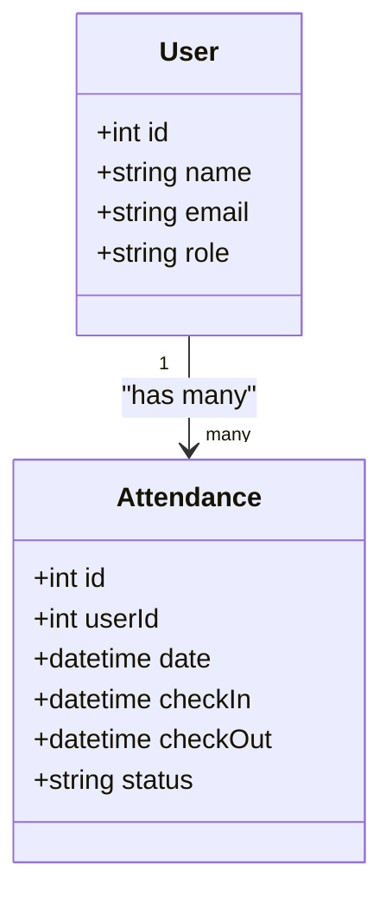
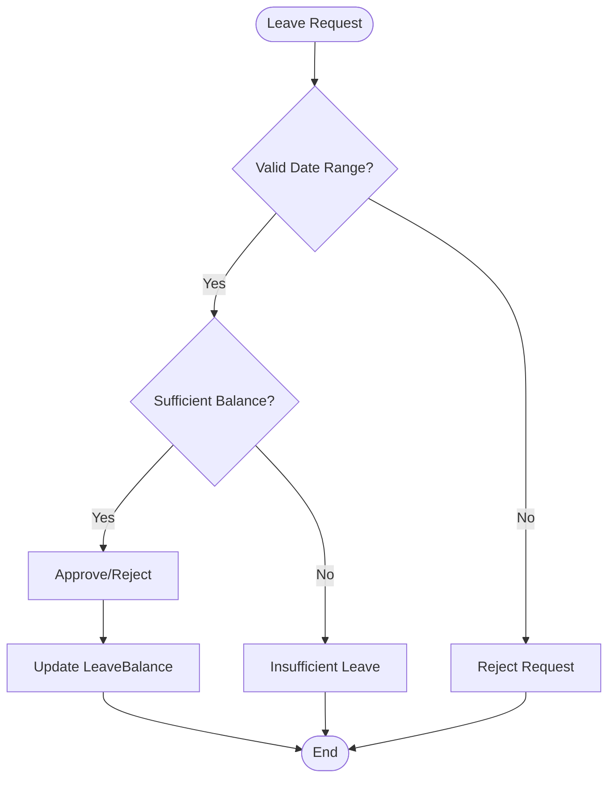
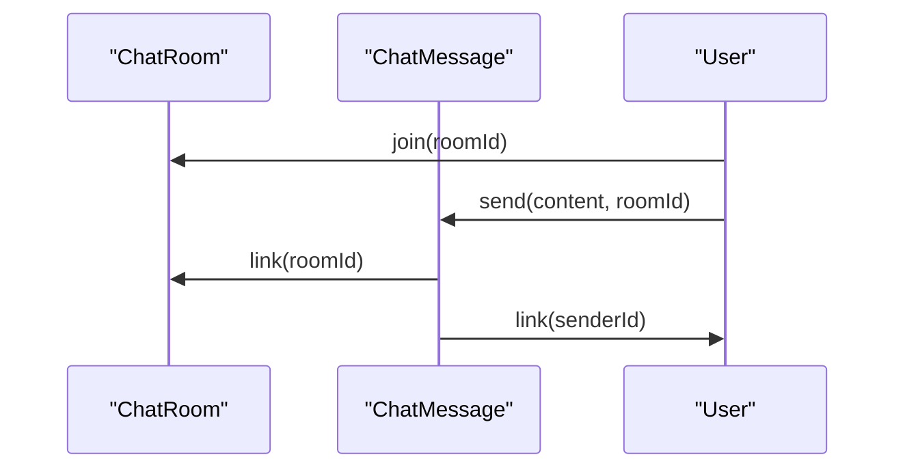
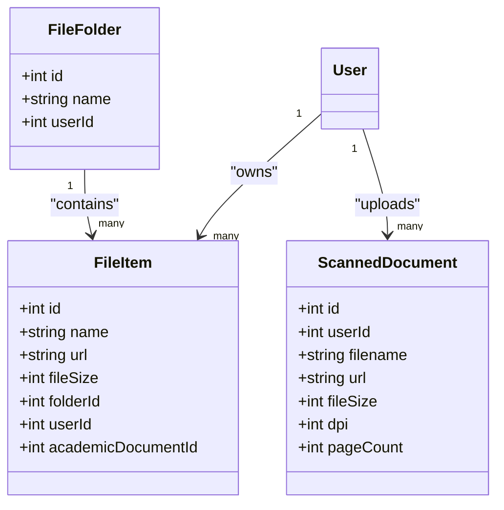
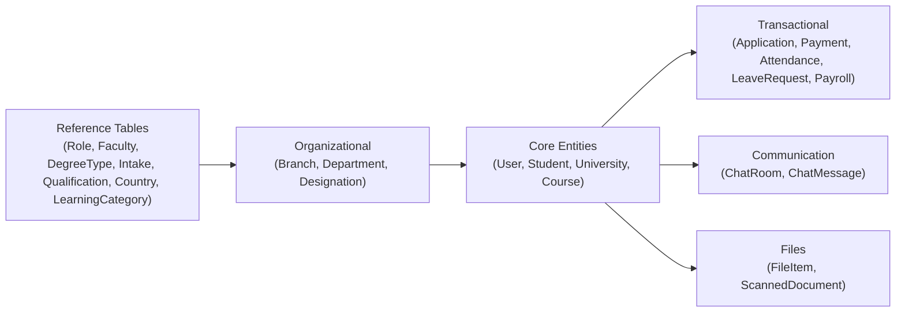
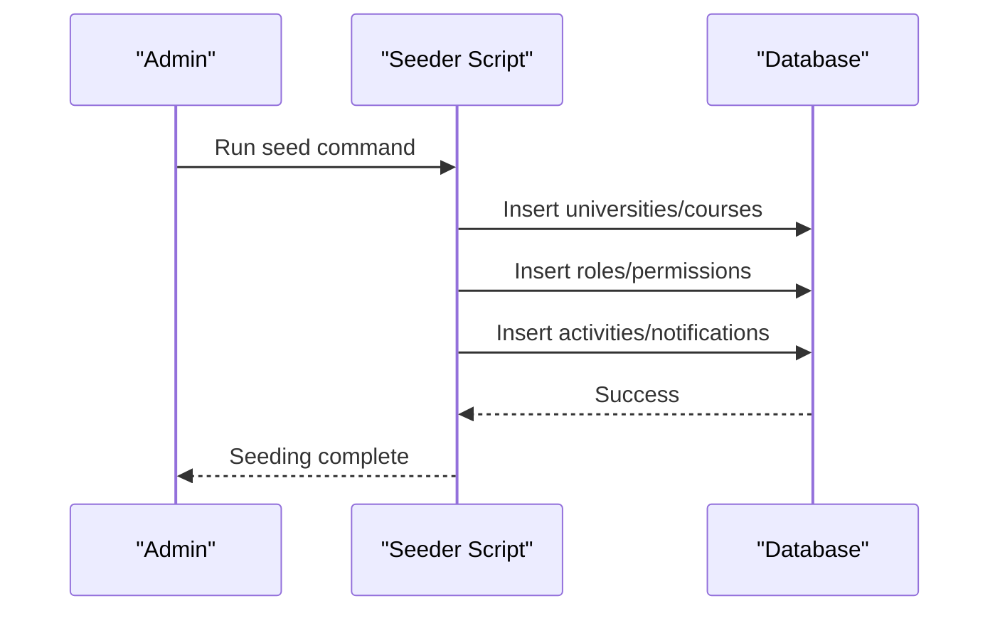

# Database Schema & Models

<cite>
**Referenced Files in This Document**
- [schema.prisma](file://prisma/schema.prisma)
- [seed-universities.ts](file://prisma/seed-universities.ts)
- [seed-roles.ts](file://prisma/seed-roles.ts)
- [seed-activities.ts](file://prisma/seed-activities.ts)
- [seed-notifications.ts](file://prisma/seed-notifications.ts)
- [backup/route.ts](file://src/app/api/backup/route.ts)
- [restore/route.ts](file://src/app/api/restore/route.ts)
- [db.ts](file://src/lib/db.ts)
</cite>

## Update Summary
**Changes Made**
- Updated database provider configuration from MySQL to SQLite for development/local-first deployment
- Simplified string field definitions by removing relationMode configuration
- Maintained data structure compatibility while supporting local development workflows
- Updated architecture diagrams to reflect SQLite provider usage

## Table of Contents
1. Introduction
2. Project Structure
3. Core Components
4. Architecture Overview
5. Detailed Component Analysis
6. Dependency Analysis
7. Performance Considerations
8. Troubleshooting Guide
9. Conclusion
10. Appendices

## Introduction
This document provides a comprehensive data model documentation for UniTrack's database schema, focusing on entity relationships and data structure. The system has been migrated from MySQL to SQLite provider to support development and local-first deployment scenarios while maintaining full data structure compatibility. It covers major entities including User, Student, University, Course, Application, Employee (via User), Attendance, LeaveRequest, Payroll, ChatRoom, ChatMessage, FileItem, and ScannedDocument. It explains primary and foreign key relationships, indexes, constraints, and validation rules as defined in the Prisma schema. It also documents the seeding process for initial data (universities, roles, activities, notifications), backup and restore procedures, migration strategy via Prisma, performance optimization techniques, and data security measures at the database level.

## Project Structure
UniTrack uses Prisma with SQLite as the database provider for development and local deployments. The schema is defined in a single file, while seeding scripts populate initial reference data. Backup and restore APIs provide export/import capabilities with optional encryption and table selection. The migration to SQLite simplifies the development environment setup while maintaining production-ready data structures.

**Diagram sources**
- [schema.prisma:6-9](file://prisma/schema.prisma#L6-L9)
- [seed-universities.ts:1-20](file://prisma/seed-universities.ts#L1-L20)
- [seed-roles.ts:1-20](file://prisma/seed-roles.ts#L1-L20)
- [seed-activities.ts:1-15](file://prisma/seed-activities.ts#L1-L15)
- [seed-notifications.ts:1-15](file://prisma/seed-notifications.ts#L1-L15)
- [backup/route.ts:1-30](file://src/app/api/backup/route.ts#L1-L30)
- [restore/route.ts:1-20](file://src/app/api/restore/route.ts#L1-L20)
- [db.ts:1-7](file://src/lib/db.ts#L1-L7)

**Section sources**
- [schema.prisma:6-9](file://prisma/schema.prisma#L6-L9)
- [db.ts:1-7](file://src/lib/db.ts#L1-L7)

## Core Components
The following core entities are central to UniTrack's data model:

- User: Central identity and HR-related attributes; linked to attendance, leave requests/payroll, chat rooms/messages, files, scanned documents, tasks, tickets, and more.
- Student: Applicant profile with academic and personal details; linked to applications, payments, student documents, and conversations.
- University: Institution record; linked to courses and applications.
- Course: Academic program under a university; linked to applications.
- Application: Enrollment link between Student, University, and Course; includes workflow stages and notes.
- Employee: Represented by User with HR fields; linked to Attendance, LeaveRequest, Payroll, and EmployeeDocument.
- Attendance: Daily check-in/out records per user with location and photos.
- LeaveRequest: Leave application with approval chain and balances.
- Payroll: Monthly salary records with items.
- ChatRoom and ChatMessage: Messaging system with many-to-many membership and sender/receiver relations.
- FileItem and FileFolder: File storage with folder hierarchy and optional academic document linkage.
- ScannedDocument: Scanned files associated with users.

Key relationships:
- Student ↔ Application: One-to-many (Student has many Applications).
- University ↔ Course: One-to-many (University has many Courses).
- Course ↔ Application: One-to-many (Course has many Applications).
- User ↔ Attendance: One-to-many (User has many Attendance records).
- User ↔ LeaveRequest: One-to-many (User has many LeaveRequests).
- User ↔ Payroll: One-to-many (User has many Payrolls).
- User ↔ ChatRoom (many-to-many): Users can be members of multiple rooms.
- ChatRoom ↔ ChatMessage: One-to-many (Room has many Messages).
- User ↔ FileItem: One-to-many (User owns many files).
- FileFolder ↔ FileItem: One-to-many (Folder contains many files).
- User ↔ ScannedDocument: One-to-many (User uploads many scanned docs).

Indexes and constraints:
- Course has indexes on universityId, faculty, degreeType, level, status.
- Application has indexes on studentId, universityId, courseId.
- Attendance has unique constraint on userId + date; indexes on userId and date.
- LeaveBalance has unique constraint on userId + leaveTypeId + year; index on userId.
- Payroll has unique constraint on userId + month + year; indexes on userId and composite (month, year).
- FileItem has indexes on folderId, userId, academicDocumentId.
- ChatMessage has indexes on roomId and senderId.
- Many models use @unique on identifiers or business keys (e.g., email, names).

Validation rules:
- Default values enforce consistent states (e.g., status defaults like "Active", "Submitted", "Present", "Pending").
- Boolean flags default to false where appropriate.
- Numeric fields have sensible defaults (e.g., basicSalary, allowances, deductions).
- JSON fields store structured arrays (e.g., countries, subtasks, childrenDetails).

**Section sources**
- [schema.prisma:19-119](file://prisma/schema.prisma#L19-L119)
- [schema.prisma:139-198](file://prisma/schema.prisma#L139-L198)
- [schema.prisma:334-428](file://prisma/schema.prisma#L334-L428)
- [schema.prisma:664-768](file://prisma/schema.prisma#L664-L768)
- [schema.prisma:770-814](file://prisma/schema.prisma#L770-L814)
- [schema.prisma:827-848](file://prisma/schema.prisma#L827-L848)

## Architecture Overview
UniTrack's data architecture centers around a relational model defined in Prisma, backed by SQLite for development and local deployments. The schema enforces referential integrity through foreign keys and cascade behaviors. Seeding scripts initialize reference data and sample content. Backup and restore APIs enable full or selective data export/import with optional encryption and strict validation. The migration to SQLite provides simplified development workflows while maintaining production-ready data structures.

**Diagram sources**
- [schema.prisma:139-198](file://prisma/schema.prisma#L139-L198)
- [schema.prisma:334-428](file://prisma/schema.prisma#L334-L428)
- [schema.prisma:664-768](file://prisma/schema.prisma#L664-L768)
- [schema.prisma:770-814](file://prisma/schema.prisma#L770-L814)
- [schema.prisma:827-848](file://prisma/schema.prisma#L827-L848)

## Detailed Component Analysis

### Student and Application Relationship
- Student has many Applications; each Application references a specific Student, University, and Course.
- Indexes on studentId, universityId, courseId optimize queries for filtering and joins.
- Cascade delete ensures referential integrity when deleting students, universities, or courses.

**Diagram sources**
- [schema.prisma:334-428](file://prisma/schema.prisma#L334-L428)

**Section sources**
- [schema.prisma:334-428](file://prisma/schema.prisma#L334-L428)

### University and Course Relationship
- University has many Courses; Course belongs to a University via universityId.
- Indexes on universityId, faculty, degreeType, level, status support efficient filtering and reporting.
- Cascade delete removes courses when a university is deleted.

**Diagram sources**
- [schema.prisma:19-119](file://prisma/schema.prisma#L19-L119)

**Section sources**
- [schema.prisma:19-119](file://prisma/schema.prisma#L19-L119)

### Employee (User) and Attendance Records
- Attendance records are tied to User via userId; unique constraint prevents duplicate entries per day.
- Indexes on userId and date improve query performance for daily reports.
- Status defaults to "Present"; optional check-in/out times and geolocation fields capture presence details.

**Diagram sources**
- [schema.prisma:139-198](file://prisma/schema.prisma#L139-L198)
- [schema.prisma:664-685](file://prisma/schema.prisma#L664-L685)

**Section sources**
- [schema.prisma:664-685](file://prisma/schema.prisma#L664-L685)

### LeaveRequest and Payroll
- LeaveRequest links to User and LeaveType; includes start/end dates, reason, status, and optional approver.
- LeaveBalance tracks yearly leave allocations per user and leave type with unique constraints.
- Payroll aggregates monthly salary components per user with unique constraints on (userId, month, year).

**Diagram sources**
- [schema.prisma:687-768](file://prisma/schema.prisma#L687-L768)

**Section sources**
- [schema.prisma:687-768](file://prisma/schema.prisma#L687-L768)

### ChatRoom and ChatMessage
- ChatRoom supports direct/group messaging; messages belong to a room and a sender (User).
- Indexes on roomId and senderId optimize message retrieval and history views.

**Diagram sources**
- [schema.prisma:827-848](file://prisma/schema.prisma#L827-L848)

**Section sources**
- [schema.prisma:827-848](file://prisma/schema.prisma#L827-L848)

### FileItem and ScannedDocument
- FileItem stores file metadata and links to folders and users; optional academic document linkage.
- ScannedDocument captures scan-specific metadata (dpi, pageCount) and associates with users.
- Indexes on folderId, userId, and academicDocumentId enhance lookup performance.

**Diagram sources**
- [schema.prisma:770-814](file://prisma/schema.prisma#L770-L814)

**Section sources**
- [schema.prisma:770-814](file://prisma/schema.prisma#L770-L814)

## Dependency Analysis
UniTrack's data model exhibits clear dependency hierarchies:
- Lookup/reference tables (e.g., Role, Faculty, DegreeType, Intake, Qualification, Country, LearningCategory) are independent and seeded first.
- Organizational entities (Branch, Department, Designation) depend on reference tables.
- Core operational entities (User, Student, University, Course) depend on organizational and reference tables.
- Transactional entities (Application, Payment, Attendance, LeaveRequest, Payroll) depend on core entities.
- Communication and file entities (ChatRoom, ChatMessage, FileItem, ScannedDocument) depend on User and optional academic/document entities.

**Diagram sources**
- [schema.prisma:19-119](file://prisma/schema.prisma#L19-L119)
- [schema.prisma:139-198](file://prisma/schema.prisma#L139-L198)
- [schema.prisma:334-428](file://prisma/schema.prisma#L334-L428)
- [schema.prisma:664-768](file://prisma/schema.prisma#L664-L768)
- [schema.prisma:770-848](file://prisma/schema.prisma#L770-L848)

**Section sources**
- [schema.prisma:19-119](file://prisma/schema.prisma#L19-L119)
- [schema.prisma:139-198](file://prisma/schema.prisma#L139-L198)
- [schema.prisma:334-428](file://prisma/schema.prisma#L334-L428)
- [schema.prisma:664-768](file://prisma/schema.prisma#L664-L768)
- [schema.prisma:770-848](file://prisma/schema.prisma#L770-L848)

## Performance Considerations
- Indexing strategy:
  - Course: universityId, faculty, degreeType, level, status.
  - Application: studentId, universityId, courseId.
  - Attendance: userId, date; unique(userId, date).
  - LeaveBalance: userId; unique(userId, leaveTypeId, year).
  - Payroll: userId; unique(userId, month, year); index(month, year).
  - FileItem: folderId, userId, academicDocumentId.
  - ChatMessage: roomId, senderId.
- Default values reduce null checks and ensure consistent state.
- Cascade deletes maintain referential integrity without manual cleanup.
- Backup/restore endpoints validate payloads and limit size to prevent abuse.
- SQLite provider optimized for development workflows with simplified connection management.

[No sources needed since this section provides general guidance]

## Troubleshooting Guide
Common issues and resolutions:
- Duplicate attendance per day: Enforced by unique(userId, date); resolve by updating existing record or ensuring correct date handling.
- Restore failures due to unknown tables: The restore endpoint validates against an allowlist; ensure backup version compatibility and correct table names.
- Large backups rejected: Maximum payload size enforced; split exports or exclude large tables if necessary.
- Encryption errors during restore: Provide correct password for encrypted backups; verify decryption logic matches export settings.
- SQLite connection issues: Ensure DATABASE_URL environment variable is properly configured for SQLite provider.

**Section sources**
- [restore/route.ts:56-120](file://src/app/api/restore/route.ts#L56-L120)
- [restore/route.ts:131-254](file://src/app/api/restore/route.ts#L131-L254)

## Conclusion
UniTrack's database schema is a well-structured relational model that supports core operations across student admissions, HR management, communication, and file handling. The recent migration to SQLite provider enhances development and local deployment workflows while maintaining production-ready data structures. The Prisma schema enforces strong integrity through foreign keys, unique constraints, and indexes. Seeding scripts initialize essential reference data, while backup and restore APIs provide robust data portability and safety. Performance is optimized via strategic indexing and default values, and security is reinforced through access controls and validation in backup/restore workflows.

[No sources needed since this section summarizes without analyzing specific files]

## Appendices

### Seeding Process
- Universities: Seed script populates universities and their courses with detailed metadata.
- Roles: Seed script creates predefined roles with permissions for access control.
- Activities: Seed script inserts sample activity logs for demonstration.
- Notifications: Seed script adds initial notifications for system updates and alerts.

**Diagram sources**
- [seed-universities.ts:1-20](file://prisma/seed-universities.ts#L1-L20)
- [seed-roles.ts:1-20](file://prisma/seed-roles.ts#L1-L20)
- [seed-activities.ts:1-15](file://prisma/seed-activities.ts#L1-L15)
- [seed-notifications.ts:1-15](file://prisma/seed-notifications.ts#L1-L15)

**Section sources**
- [seed-universities.ts:1-20](file://prisma/seed-universities.ts#L1-L20)
- [seed-roles.ts:1-20](file://prisma/seed-roles.ts#L1-L20)
- [seed-activities.ts:1-15](file://prisma/seed-activities.ts#L1-L15)
- [seed-notifications.ts:1-15](file://prisma/seed-notifications.ts#L1-L15)

### Data Migration Strategy
- Use Prisma migrations to evolve schema changes safely.
- Apply migrations in development, staging, and production environments sequentially.
- Back up data before applying migrations to ensure rollback capability.
- SQLite provider enables local-first development with simplified database management.

[No sources needed since this section provides general guidance]

### Backup Procedures
- Export full or selective data via backup API with optional encryption and table selection.
- Validate payload format and size limits to prevent misuse.
- Store backups securely with appropriate access controls.

**Section sources**
- [backup/route.ts:1-30](file://src/app/api/backup/route.ts#L1-L30)
- [backup/route.ts:177-202](file://src/app/api/backup/route.ts#L177-L202)

### Restore Procedures
- Upload backup file; decrypt if required.
- Validate allowed tables and payload structure.
- Execute transactional restore in dependency order to maintain integrity.

**Section sources**
- [restore/route.ts:56-120](file://src/app/api/restore/route.ts#L56-L120)
- [restore/route.ts:131-254](file://src/app/api/restore/route.ts#L131-L254)

### Data Security Measures
- Access control: Backup/restore endpoints require admin privileges.
- Validation: Strict allowlists for tables and payload structure prevent injection and misuse.
- Encryption: Optional encryption for backups ensures sensitive data protection.
- Logging: Activity logs and login logs track system usage and access patterns.

**Section sources**
- [backup/route.ts:6-15](file://src/app/api/backup/route.ts#L6-L15)
- [restore/route.ts:7-54](file://src/app/api/restore/route.ts#L7-L54)
- [schema.prisma:310-332](file://prisma/schema.prisma#L310-L332)