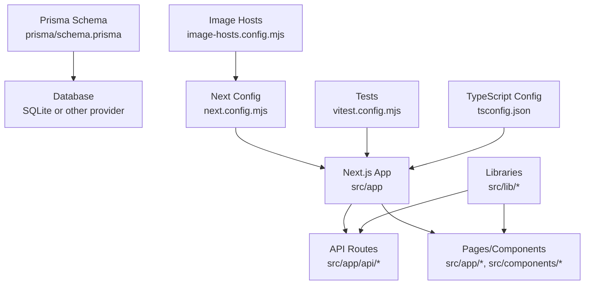
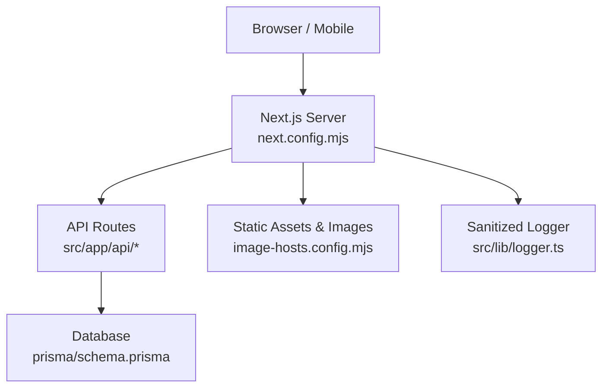
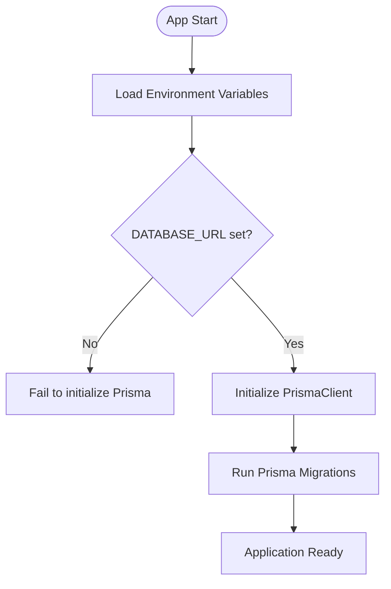
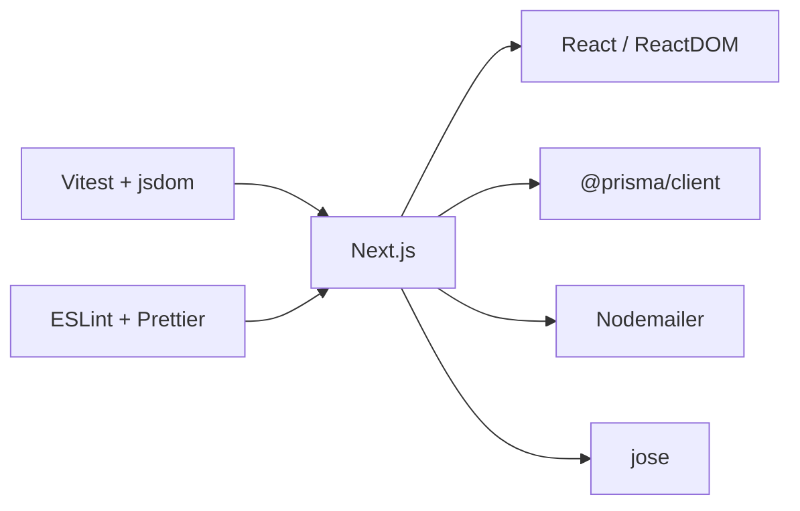

# Deployment & DevOps

<cite>
**Referenced Files in This Document**
- [package.json](file://package.json)
- [next.config.mjs](file://next.config.mjs)
- [image-hosts.config.mjs](file://image-hosts.config.mjs)
- [prisma/schema.prisma](file://prisma/schema.prisma)
- [src/lib/db.ts](file://src/lib/db.ts)
- [src/lib/logger.ts](file://src/lib/logger.ts)
- [vitest.config.mjs](file://vitest.config.mjs)
- [tsconfig.json](file://tsconfig.json)
- [.gitignore](file://.gitignore)
</cite>

## Table of Contents
1. Introduction
2. Project Structure
3. Core Components
4. Architecture Overview
5. Detailed Component Analysis
6. Dependency Analysis
7. Performance Considerations
8. Troubleshooting Guide
9. Conclusion
10. Appendices

## Introduction
This document provides production-grade deployment and operational guidance for UniTrack, a Next.js application with Prisma-managed data. It covers build configuration, environment setup, containerization options, CI/CD pipeline design, automated testing integration, database preparation, security hardening, monitoring and logging, performance profiling, scaling and high availability, backup and recovery, disaster recovery planning, maintenance schedules, environment management, version control practices, release management, and troubleshooting procedures.

## Project Structure
UniTrack is a Next.js application using TypeScript, Tailwind CSS, and Prisma for data modeling. The repository includes:
- Application code under src/app (Next.js App Router API routes and pages), shared libraries under src/lib, and UI components under src/components.
- Data schema and seeders under prisma.
- Build and runtime configuration via next.config.mjs, package.json scripts, vitest.config.mjs, and tsconfig.json.
- Image host allowlist under image-hosts.config.mjs.
- Environment variables are excluded from version control via .gitignore.

**Diagram sources**
- [next.config.mjs:1-47](file://next.config.mjs#L1-L47)
- [image-hosts.config.mjs:1-27](file://image-hosts.config.mjs#L1-L27)
- [prisma/schema.prisma:1-10](file://prisma/schema.prisma#L1-L10)
- [vitest.config.mjs:1-17](file://vitest.config.mjs#L1-L17)
- [tsconfig.json:1-44](file://tsconfig.json#L1-L44)

**Section sources**
- [package.json:39-55](file://package.json#L39-L55)
- [next.config.mjs:1-47](file://next.config.mjs#L1-L47)
- [image-hosts.config.mjs:1-27](file://image-hosts.config.mjs#L1-L27)
- [prisma/schema.prisma:1-10](file://prisma/schema.prisma#L1-L10)
- [vitest.config.mjs:1-17](file://vitest.config.mjs#L1-L17)
- [tsconfig.json:1-44](file://tsconfig.json#L1-L44)

## Core Components
- Build and runtime scripts: Development, build, linting, formatting, type checking, testing, and serving are defined in package.json scripts.
- Next.js configuration: Production source maps disabled, custom dist directory support, remote image hosts allowlist, server external packages for Prisma, and security headers.
- Database layer: Prisma client initialization with process-aware global singleton behavior; schema defines SQLite by default but can be changed to other providers.
- Logging: Server-side error logger that sanitizes sensitive fields before outputting logs.
- Testing: Vitest configured with jsdom environment, alias resolution, and test file patterns.
- TypeScript: Strict mode enabled, bundler module resolution, path aliases, and Next.js plugin integration.

**Section sources**
- [package.json:39-55](file://package.json#L39-L55)
- [next.config.mjs:1-47](file://next.config.mjs#L1-L47)
- [prisma/schema.prisma:1-10](file://prisma/schema.prisma#L1-L10)
- [src/lib/db.ts:1-8](file://src/lib/db.ts#L1-L8)
- [src/lib/logger.ts:1-48](file://src/lib/logger.ts#L1-L48)
- [vitest.config.mjs:1-17](file://vitest.config.mjs#L1-L17)
- [tsconfig.json:1-44](file://tsconfig.json#L1-L44)

## Architecture Overview
The runtime architecture centers on Next.js serving both UI and API routes. Prisma abstracts the database layer, which defaults to SQLite in the schema but can be switched to PostgreSQL or MySQL for production scalability. Security headers are enforced at the Next.js server level. External images are restricted to an allowlisted set of hosts.

**Diagram sources**
- [next.config.mjs:17-45](file://next.config.mjs#L17-L45)
- [image-hosts.config.mjs:5-26](file://image-hosts.config.mjs#L5-L26)
- [prisma/schema.prisma:1-10](file://prisma/schema.prisma#L1-L10)
- [src/lib/logger.ts:42-48](file://src/lib/logger.ts#L42-L48)

## Detailed Component Analysis

### Build Process and Environment Configuration
- Build command: Uses Next.js build toolchain as defined in package.json scripts.
- Output directory: Controlled via DIST_DIR environment variable; defaults to .next.
- Source maps: Disabled in production via Next config.
- Remote images: Restricted to configured hosts in image-hosts.config.mjs.
- Server external packages: Prisma client and engine are externalized for efficient server execution.
- Security headers: Enforced globally via Next.js headers configuration, including XSS protection, frame options, content type sniffing prevention, referrer policy, permissions policy, HSTS, and CSP.

Operational notes:
- Ensure NODE_ENV=production during builds and runtime.
- Provide DATABASE_URL environment variable matching your chosen database provider.
- Keep image host list minimal and aligned with actual usage.

**Section sources**
- [package.json:39-55](file://package.json#L39-L55)
- [next.config.mjs:4-16](file://next.config.mjs#L4-L16)
- [next.config.mjs:17-45](file://next.config.mjs#L17-L45)
- [image-hosts.config.mjs:5-26](file://image-hosts.config.mjs#L5-L26)

### Database Setup and Migration Strategy
- Default provider: SQLite per schema definition.
- Connection string: Read from DATABASE_URL environment variable.
- Client initialization: PrismaClient is created once per process with development-time global caching disabled in production.

Production recommendations:
- Switch provider to PostgreSQL or MySQL by updating the datasource block and DATABASE_URL accordingly.
- Run migrations before starting the app in production.
- Use connection pooling and read replicas if needed.

**Diagram sources**
- [prisma/schema.prisma:6-9](file://prisma/schema.prisma#L6-L9)
- [src/lib/db.ts:1-8](file://src/lib/db.ts#L1-L8)

**Section sources**
- [prisma/schema.prisma:6-9](file://prisma/schema.prisma#L6-L9)
- [src/lib/db.ts:1-8](file://src/lib/db.ts#L1-L8)

### Containerization Options
Recommended approaches:
- Multi-stage Dockerfile:
  - Stage 1: Install dependencies and run Next.js build.
  - Stage 2: Minimal runtime image with only production artifacts.
- Environment variables:
  - DATABASE_URL must be provided at runtime.
  - DIST_DIR can be customized if needed.
  - NODE_ENV=production.
- Networking:
  - Expose port 3000 (or configure reverse proxy).
  - Restrict outbound connections to required domains (images, email SMTP).
- Storage:
  - Mount persistent volumes for uploads and database files if using local storage or SQLite.

[No sources needed since this section provides general guidance]

### CI/CD Pipeline Setup
Suggested pipeline stages:
- Lint and format checks using ESLint and Prettier.
- Type checking with TypeScript compiler.
- Unit and integration tests with Vitest.
- Build artifact generation using Next.js build.
- Deploy to target platform (Vercel, Docker registry, Kubernetes, etc.).
- Post-deploy smoke tests against staging.

Integration points:
- Use environment-specific secrets for DATABASE_URL and other credentials.
- Cache node_modules and Next.js build cache to speed up pipelines.

**Section sources**
- [package.json:39-55](file://package.json#L39-L55)
- [vitest.config.mjs:4-10](file://vitest.config.mjs#L4-L10)

### Automated Testing Integration
- Test runner: Vitest with jsdom environment.
- Test discovery: Patterns include src/**/*.test.* and src/**/*.spec.*.
- Aliases: @ resolves to src for consistent imports.
- Coverage: Enable coverage reporting in CI for quality gates.

Execution commands:
- Run tests: npm test
- Watch mode: npm run test:watch
- Coverage: npm run test:coverage

**Section sources**
- [vitest.config.mjs:4-16](file://vitest.config.mjs#L4-L16)
- [package.json:48-50](file://package.json#L48-L50)

### Security Hardening
- HTTP security headers:
  - X-Frame-Options DENY
  - X-Content-Type-Options nosniff
  - X-XSS-Protection enabled
  - Referrer-Policy strict-origin-when-cross-origin
  - Permissions-Policy restricting camera, microphone, geolocation
  - HSTS with preload
  - Content-Security-Policy with restrictive defaults and controlled allowances
- Sensitive data handling:
  - Sanitized logger prevents accidental leakage of passwords, tokens, secrets, authorization headers, cookies, and credentials.
- Secrets management:
  - Environment variables are gitignored; never commit .env files.

Operational checklist:
- Validate CSP aligns with third-party services used in production.
- Rotate secrets regularly and use secret managers.
- Audit permissions policy based on feature requirements.

**Section sources**
- [next.config.mjs:17-45](file://next.config.mjs#L17-L45)
- [src/lib/logger.ts:7-14](file://src/lib/logger.ts#L7-L14)
- [src/lib/logger.ts:42-48](file://src/lib/logger.ts#L42-L48)
- [.gitignore:43-46](file://.gitignore#L43-L46)

### Monitoring and Logging Strategies
- Server-side logging:
  - Use the sanitized logger for errors in API routes and background tasks.
  - Avoid logging sensitive payloads; rely on redaction patterns.
- Audit logs:
  - Application tracks user activity and login events for compliance and security monitoring.
- Centralized logging:
  - Forward structured logs to a log aggregation service (e.g., CloudWatch, Datadog, ELK).
- Metrics:
  - Track request latency, error rates, and throughput via APM tools.

**Section sources**
- [src/lib/logger.ts:1-48](file://src/lib/logger.ts#L1-L48)

### Performance Profiling
- Disable production browser source maps to reduce payload size.
- Externalize Prisma client and engine for faster server startup.
- Use Next.js built-in optimizations and ensure proper caching headers for static assets.
- Profile API endpoints and database queries; add indexes where necessary.

**Section sources**
- [next.config.mjs:4-16](file://next.config.mjs#L4-L16)

### Scaling Considerations, Load Balancing, and High Availability
- Horizontal scaling:
  - Run multiple Next.js instances behind a load balancer (NGINX, AWS ALB, Cloudflare).
  - Stateless application design: store sessions and caches externally (Redis, managed databases).
- Database scaling:
  - Move from SQLite to a managed relational database (PostgreSQL/MySQL).
  - Use read replicas and connection pooling.
- Caching:
  - Implement CDN for static assets and images.
  - Cache API responses where appropriate.
- High availability:
  - Multi-region deployments with DNS-based failover.
  - Health checks and graceful restarts.

[No sources needed since this section provides general guidance]

### Backup and Recovery Procedures
- Database backups:
  - Schedule regular snapshots or logical dumps depending on provider.
  - Store backups in secure, versioned object storage.
- File backups:
  - Back up uploaded files and media separately from the database.
- Recovery testing:
  - Periodically validate restore procedures and RTO/RPO targets.
- Disaster recovery plan:
  - Define incident response workflows and communication channels.
  - Maintain runbooks for common failure scenarios.

[No sources needed since this section provides general guidance]

### Maintenance Schedules
- Dependency updates:
  - Regularly update dependencies and review breaking changes.
- Security patches:
  - Apply OS and runtime patches promptly.
- Log rotation:
  - Configure log retention policies and cleanup old logs.
- Capacity planning:
  - Monitor resource utilization and scale proactively.

[No sources needed since this section provides general guidance]

### Environment Management, Version Control Practices, and Release Management
- Environment variables:
  - Use separate environments (development, staging, production) with distinct secrets.
  - Never commit .env files; use secret managers or platform-native secret stores.
- Version control:
  - Branching strategy (feature branches, main branch protections).
  - Code reviews and automated checks before merges.
- Release management:
  - Tag releases and maintain changelogs.
  - Use CI/CD to promote builds across environments.
  - Rollback strategies and blue/green or canary deployments.

**Section sources**
- [.gitignore:43-46](file://.gitignore#L43-L46)

### Troubleshooting Guidance
Common issues and resolutions:
- Build failures:
  - Verify Node.js version compatibility and dependency installation.
  - Check TypeScript errors and linting issues.
- Runtime errors:
  - Inspect sanitized logs for stack traces without sensitive data.
  - Validate environment variables (DATABASE_URL, DIST_DIR, NODE_ENV).
- Database connectivity:
  - Confirm DATABASE_URL correctness and network access.
  - Ensure migrations have been applied.
- Image loading issues:
  - Update image-hosts.config.mjs to include required domains.
- CSP blocking resources:
  - Adjust Content-Security-Policy directives to allow necessary sources.

**Section sources**
- [next.config.mjs:17-45](file://next.config.mjs#L17-L45)
- [image-hosts.config.mjs:5-26](file://image-hosts.config.mjs#L5-L26)
- [src/lib/logger.ts:42-48](file://src/lib/logger.ts#L42-L48)
- [prisma/schema.prisma:6-9](file://prisma/schema.prisma#L6-L9)

## Dependency Analysis
Key runtime and build-time dependencies:
- Next.js application framework and React ecosystem.
- Prisma client for database abstraction.
- Nodemailer for email functionality.
- JWT library for token handling.
- Testing utilities (Vitest, jsdom).
- Formatting and linting tools (ESLint, Prettier).

**Diagram sources**
- [package.json:56-108](file://package.json#L56-L108)

**Section sources**
- [package.json:56-108](file://package.json#L56-L108)

## Performance Considerations
- Production builds disable browser source maps to minimize bundle size.
- Externalize Prisma client and engine to improve server performance.
- Restrict remote image hosts to reduce unnecessary requests and enforce security.
- Use caching strategies for static assets and API responses.
- Monitor database query performance and optimize indexes.

**Section sources**
- [next.config.mjs:4-16](file://next.config.mjs#L4-L16)

## Troubleshooting Guide
- Logging:
  - Use the sanitized logger to capture errors without exposing sensitive information.
- Environment validation:
  - Ensure all required environment variables are present and correctly formatted.
- Database diagnostics:
  - Verify connection strings and migration status.
  - Review slow queries and adjust schema or indexing.
- Security diagnostics:
  - Inspect CSP and permissions policy for blocked resources.
  - Audit headers and TLS configuration.

**Section sources**
- [src/lib/logger.ts:42-48](file://src/lib/logger.ts#L42-L48)
- [next.config.mjs:17-45](file://next.config.mjs#L17-L45)
- [prisma/schema.prisma:6-9](file://prisma/schema.prisma#L6-L9)

## Conclusion
UniTrack’s deployment model leverages Next.js for a unified frontend and API surface, Prisma for robust data management, and strong security headers for hardened operations. By following the recommended build, environment, containerization, CI/CD, testing, monitoring, and scaling practices outlined here, teams can deploy reliably and operate efficiently in production. Continuous attention to security, performance, and reliability will ensure long-term success.

## Appendices

### Environment Variables Reference
- DATABASE_URL: Required for Prisma database connection.
- DIST_DIR: Optional override for Next.js build output directory.
- NODE_ENV: Set to production for optimized runtime behavior.

**Section sources**
- [next.config.mjs:4-16](file://next.config.mjs#L4-L16)
- [prisma/schema.prisma:6-9](file://prisma/schema.prisma#L6-L9)

### Scripts Quick Reference
- dev: Start development server.
- build: Generate production build.
- start: Serve production build.
- lint: Run ESLint.
- lint:fix: Auto-fix lint issues.
- format: Format code with Prettier.
- type-check: Run TypeScript type checking.
- test: Execute tests with Vitest.
- test:watch: Run tests in watch mode.
- test:coverage: Generate test coverage.

**Section sources**
- [package.json:39-55](file://package.json#L39-L55)