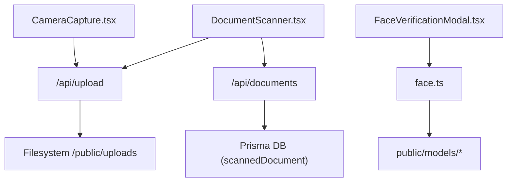
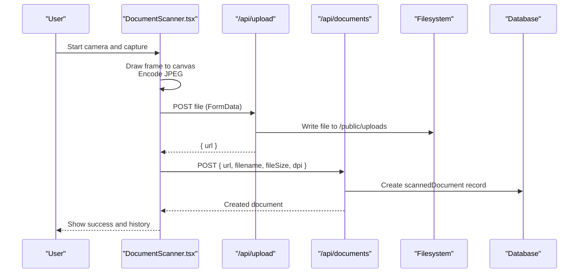
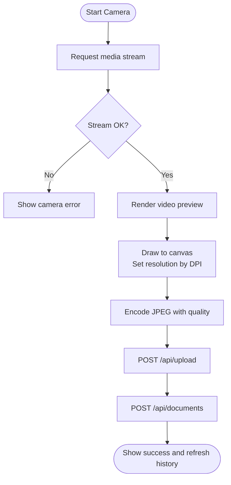
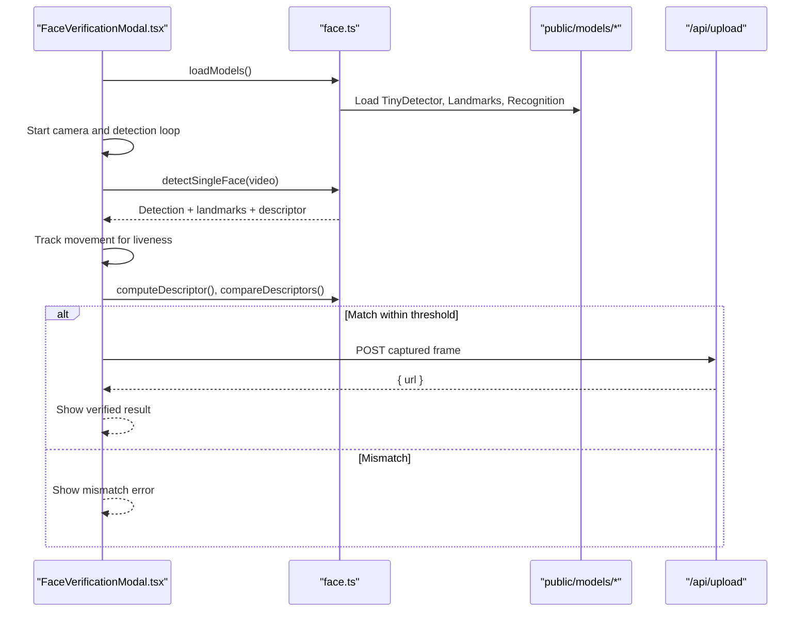
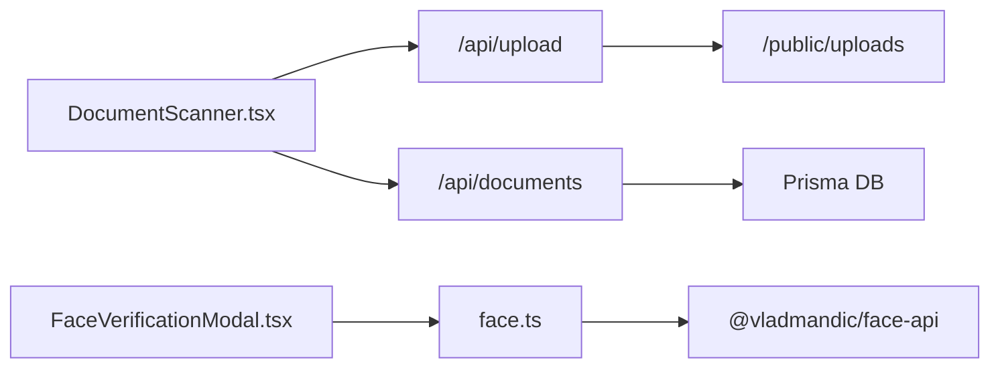

# Document Scanner & OCR Processing

<cite>
**Referenced Files in This Document**
- [DocumentScanner.tsx](file://src/app/documents/components/DocumentScanner.tsx)
- [page.tsx (Documents page)](file://src/app/documents/page.tsx)
- [route.ts (Upload API)](file://src/app/api/upload/route.ts)
- [route.ts (Documents API)](file://src/app/api/documents/route.ts)
- [CameraCapture.tsx](file://src/components/hr/CameraCapture.tsx)
- [FaceVerificationModal.tsx](file://src/components/hr/FaceVerificationModal.tsx)
- [face.ts](file://src/lib/face.ts)
- [schema.prisma](file://prisma/schema.prisma)
</cite>

## Table of Contents
1. [Introduction](#introduction)
2. [Project Structure](#project-structure)
3. [Core Components](#core-components)
4. [Architecture Overview](#architecture-overview)
5. [Detailed Component Analysis](#detailed-component-analysis)
6. [Dependency Analysis](#dependency-analysis)
7. [Performance Considerations](#performance-considerations)
8. [Troubleshooting Guide](#troubleshooting-guide)
9. [Conclusion](#conclusion)

## Introduction
This document explains the web-based Document Scanner and related processing features, including camera capture, image quality settings, upload and storage, and face verification for employee authentication. It also outlines where OCR integration can be added to extract text from scanned documents and how to extend the system with automatic categorization by type, language, and content. The goal is to provide a clear, practical guide for capturing high-quality scans, improving OCR accuracy through preprocessing, and integrating face recognition for secure check-in/out flows.

## Project Structure
The scanning and verification features are implemented as client-side React components backed by Next.js server routes for file uploads and document metadata persistence. Face recognition uses pre-trained models served from the public directory.

**Diagram sources**
- [DocumentScanner.tsx:105-211](file://src/app/documents/components/DocumentScanner.tsx#L105-L211)
- [route.ts (Upload API):23-63](file://src/app/api/upload/route.ts#L23-L63)
- [route.ts (Documents API):19-74](file://src/app/api/documents/route.ts#L19-L74)
- [FaceVerificationModal.tsx:187-213](file://src/components/hr/FaceVerificationModal.tsx#L187-L213)
- [face.ts:7-22](file://src/lib/face.ts#L7-L22)

**Section sources**
- [page.tsx (Documents page):1-16](file://src/app/documents/page.tsx#L1-L16)
- [DocumentScanner.tsx:1-523](file://src/app/documents/components/DocumentScanner.tsx#L1-L523)
- [route.ts (Upload API):1-64](file://src/app/api/upload/route.ts#L1-L64)
- [route.ts (Documents API):1-95](file://src/app/api/documents/route.ts#L1-L95)
- [CameraCapture.tsx:1-157](file://src/components/hr/CameraCapture.tsx#L1-L157)
- [FaceVerificationModal.tsx:1-511](file://src/components/hr/FaceVerificationModal.tsx#L1-L511)
- [face.ts:1-68](file://src/lib/face.ts#L1-L68)
- [schema.prisma:770-783](file://prisma/schema.prisma#L770-L783)

## Core Components
- Web-based Document Scanner: Captures images via webcam, sets DPI/resolution, previews, and uploads to the server. Stores metadata in the database.
- File Upload API: Validates MIME types and size, writes files to disk, and returns URLs.
- Documents API: Persists scanned document records with user context and activity logging.
- Camera Capture (HR): Reusable camera capture component used for attendance photos.
- Face Verification Modal: Runs liveness checks, detects faces, computes descriptors, compares against enrolled profiles, and captures verified photos with location.
- Face Library: Loads TensorFlow.js-based face models, detects faces, computes descriptors, and provides movement tracking utilities.

**Section sources**
- [DocumentScanner.tsx:105-211](file://src/app/documents/components/DocumentScanner.tsx#L105-L211)
- [route.ts (Upload API):23-63](file://src/app/api/upload/route.ts#L23-L63)
- [route.ts (Documents API):19-74](file://src/app/api/documents/route.ts#L19-L74)
- [CameraCapture.tsx:29-84](file://src/components/hr/CameraCapture.tsx#L29-L84)
- [FaceVerificationModal.tsx:187-302](file://src/components/hr/FaceVerificationModal.tsx#L187-L302)
- [face.ts:7-68](file://src/lib/face.ts#L7-L68)

## Architecture Overview
The scanner runs entirely in the browser using MediaStream and Canvas APIs to capture frames at selected DPI/resolution. After capture, images are uploaded to the server and persisted as files. Metadata is stored in the database. Face verification integrates TensorFlow.js models to detect faces, ensure liveness, and compare embeddings against an enrolled descriptor.

**Diagram sources**
- [DocumentScanner.tsx:139-211](file://src/app/documents/components/DocumentScanner.tsx#L139-L211)
- [route.ts (Upload API):23-63](file://src/app/api/upload/route.ts#L23-L63)
- [route.ts (Documents API):38-74](file://src/app/api/documents/route.ts#L38-L74)

## Detailed Component Analysis

### Document Scanner Interface (Webcam Capture and Quality Settings)
- Camera access: Uses getUserMedia with environment-facing camera and ideal width based on DPI selection.
- Capture pipeline: Draws video frame to an offscreen canvas sized to target resolution; encodes to JPEG with quality tuned by DPI.
- Upload flow: Converts data URL to Blob, posts to /api/upload, then persists metadata via /api/documents.
- History and management: Fetches and displays previously scanned documents with delete capability.

**Diagram sources**
- [DocumentScanner.tsx:105-161](file://src/app/documents/components/DocumentScanner.tsx#L105-L161)
- [DocumentScanner.tsx:169-211](file://src/app/documents/components/DocumentScanner.tsx#L169-L211)

**Section sources**
- [DocumentScanner.tsx:105-211](file://src/app/documents/components/DocumentScanner.tsx#L105-L211)

### File Upload API
- Validates allowed MIME types and maximum file size.
- Writes file to disk under /public/uploads with a unique name.
- Returns a URL that can be used to serve the file.

**Section sources**
- [route.ts (Upload API):23-63](file://src/app/api/upload/route.ts#L23-L63)

### Documents API
- Requires authenticated session.
- Creates a scannedDocument record with userId, url, filename, fileSize, dpi, and pageCount.
- Logs activity and supports retrieval and deletion.

**Section sources**
- [route.ts (Documents API):19-74](file://src/app/api/documents/route.ts#L19-L74)
- [route.ts (Documents API):76-95](file://src/app/api/documents/route.ts#L76-L95)

### HR Camera Capture
- Lightweight reusable component for capturing photos via webcam.
- Captures frame to canvas, converts to Blob, uploads via /api/upload, and returns URL to caller.

**Section sources**
- [CameraCapture.tsx:29-84](file://src/components/hr/CameraCapture.tsx#L29-L84)

### Face Recognition and Liveness Check
- Model loading: Loads tiny face detector, 68-point landmarks, and face recognition networks from /models.
- Detection loop: Continuously detects faces, draws overlay, tracks center movement to verify liveness.
- Descriptor comparison: Computes embedding and compares with enrolled descriptor using Euclidean distance.
- Photo capture and upload: On successful verification, captures current frame, uploads, and returns photo URL with similarity score.

**Diagram sources**
- [FaceVerificationModal.tsx:187-302](file://src/components/hr/FaceVerificationModal.tsx#L187-L302)
- [face.ts:7-68](file://src/lib/face.ts#L7-L68)

**Section sources**
- [FaceVerificationModal.tsx:187-302](file://src/components/hr/FaceVerificationModal.tsx#L187-L302)
- [face.ts:7-68](file://src/lib/face.ts#L7-L68)

### Data Model for Scanned Documents
- scannedDocument stores userId, filename, url, fileSize, dpi, pageCount, and timestamps.
- Indexed by userId and createdAt for efficient queries.

**Section sources**
- [schema.prisma:770-783](file://prisma/schema.prisma#L770-L783)

## Dependency Analysis
- Client components depend on browser APIs (MediaDevices, Canvas).
- Face verification depends on @vladmandic/face-api and model weights served statically.
- Server routes depend on filesystem for uploads and Prisma for persistence.
- Authentication/session middleware protects endpoints.

**Diagram sources**
- [DocumentScanner.tsx:169-211](file://src/app/documents/components/DocumentScanner.tsx#L169-L211)
- [route.ts (Upload API):23-63](file://src/app/api/upload/route.ts#L23-L63)
- [route.ts (Documents API):19-74](file://src/app/api/documents/route.ts#L19-L74)
- [face.ts:1-22](file://src/lib/face.ts#L1-L22)

**Section sources**
- [DocumentScanner.tsx:169-211](file://src/app/documents/components/DocumentScanner.tsx#L169-L211)
- [route.ts (Upload API):23-63](file://src/app/api/upload/route.ts#L23-L63)
- [route.ts (Documents API):19-74](file://src/app/api/documents/route.ts#L19-L74)
- [face.ts:1-22](file://src/lib/face.ts#L1-L22)

## Performance Considerations
- Resolution and DPI: Higher DPI increases capture size and upload time. Choose the lowest acceptable DPI for speed (e.g., 150–200) when bandwidth or device performance is constrained.
- JPEG quality: Adjusted based on DPI to balance clarity and size.
- Face detection loop: Runs continuously; consider throttling or reducing input size if CPU usage is high.
- Storage limits: Enforce file size limits and consider CDN or object storage for large volumes.

[No sources needed since this section provides general guidance]

## Troubleshooting Guide

### Poor Scan Quality
- Symptoms: Blurry or low-resolution scans; slow uploads.
- Actions:
  - Increase DPI setting in the scanner interface.
  - Ensure good lighting and steady camera positioning.
  - Use a higher-quality camera if available.
  - Reduce JPEG quality only if necessary; prefer increasing resolution over quality for OCR.

**Section sources**
- [DocumentScanner.tsx:24-29](file://src/app/documents/components/DocumentScanner.tsx#L24-L29)
- [DocumentScanner.tsx:139-161](file://src/app/documents/components/DocumentScanner.tsx#L139-L161)

### Unrecognized Text (OCR Integration Readiness)
- Current state: OCR extraction is not implemented in the codebase.
- Recommended steps:
  - Add a server-side OCR step after upload (e.g., Tesseract.js or cloud OCR) to process images and return extracted text.
  - Integrate language packs for multilingual documents.
  - Preprocess images (deskew, contrast enhancement, binarization) before OCR to improve accuracy.
  - Store extracted text alongside scannedDocument metadata for search and indexing.

[No sources needed since this section proposes future enhancements]

### Model Loading Issues (Face Recognition)
- Symptoms: Face detection fails; modal shows model loading error.
- Actions:
  - Verify model files exist under /public/models and are accessible.
  - Clear browser cache and reload.
  - Check console for CORS or network errors serving model manifests.
  - Ensure HTTPS if required by your deployment policy.

**Section sources**
- [face.ts:7-22](file://src/lib/face.ts#L7-L22)
- [FaceVerificationModal.tsx:187-213](file://src/components/hr/FaceVerificationModal.tsx#L187-L213)

### Camera Access Denied
- Symptoms: Camera permission prompts blocked; no preview.
- Actions:
  - Allow camera permissions in browser settings.
  - Ensure site is served over HTTPS.
  - Close other apps using the camera.

**Section sources**
- [DocumentScanner.tsx:125-137](file://src/app/documents/components/DocumentScanner.tsx#L125-L137)
- [CameraCapture.tsx:29-40](file://src/components/hr/CameraCapture.tsx#L29-L40)

### Upload Failures
- Symptoms: Upload endpoint returns error; file not saved.
- Actions:
  - Confirm file type is allowed and size under limit.
  - Check server logs for write permission issues to /public/uploads.
  - Validate network connectivity and CORS policies.

**Section sources**
- [route.ts (Upload API):23-63](file://src/app/api/upload/route.ts#L23-L63)

### Automatic Categorization (Future Enhancement)
- Suggested approach:
  - After OCR, run classification models to determine document type (e.g., passport, visa, academic transcript).
  - Detect language(s) present and tag accordingly.
  - Extract key fields (names, dates, IDs) using structured extraction pipelines.
  - Persist tags and extracted fields in scannedDocument or a new metadata table.

[No sources needed since this section proposes future enhancements]

## Conclusion
The repository provides a robust, browser-based document scanner with configurable DPI/resolution, secure upload, and persistent metadata storage. Face verification is fully integrated using pre-trained models for liveness and identity matching. While OCR extraction is not yet implemented, the architecture is ready to integrate text recognition and automated categorization to transform scanned images into searchable, structured data. Following the troubleshooting guidance will help maintain high scan quality and reliable operation across devices and environments.