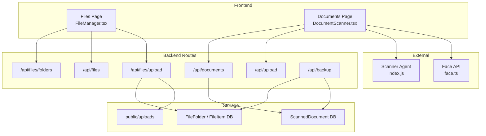
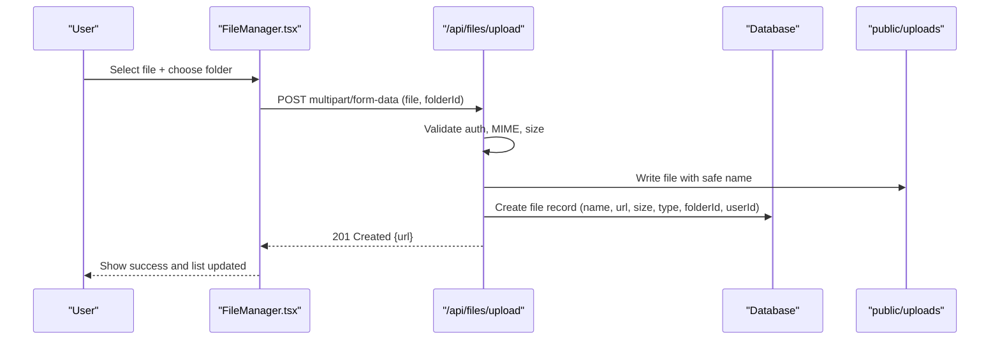
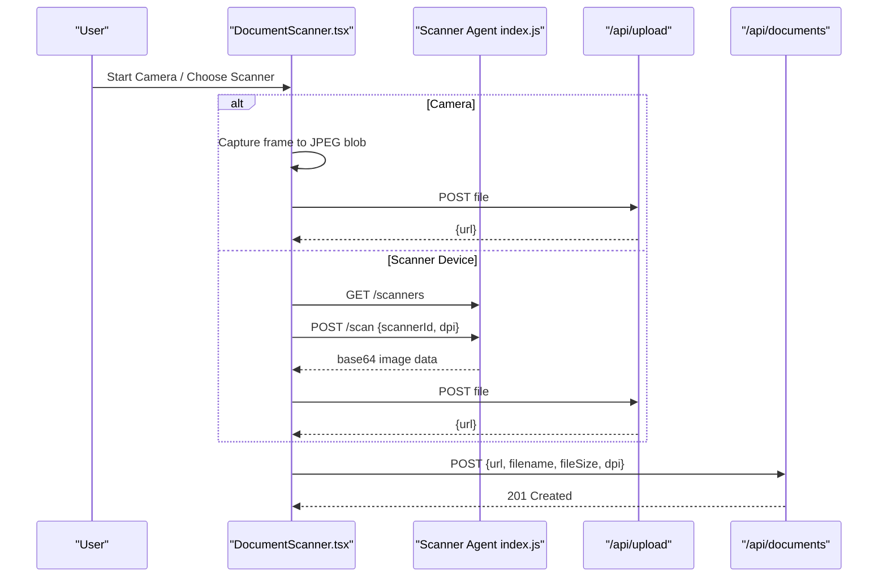
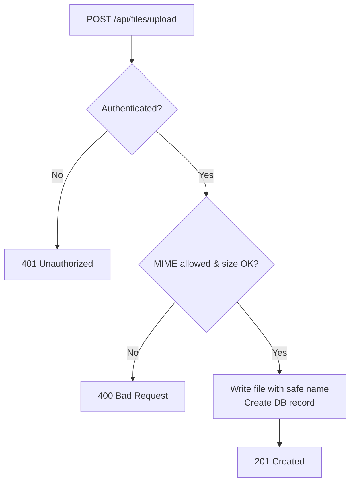
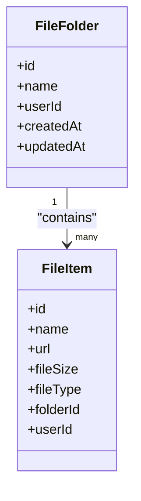
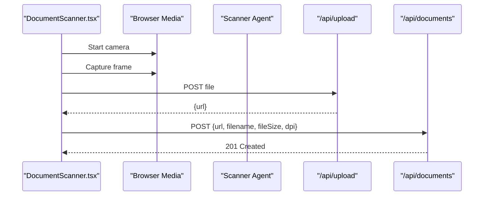
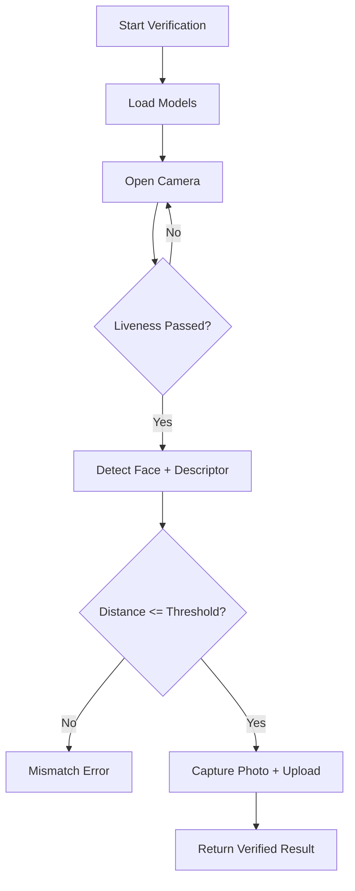
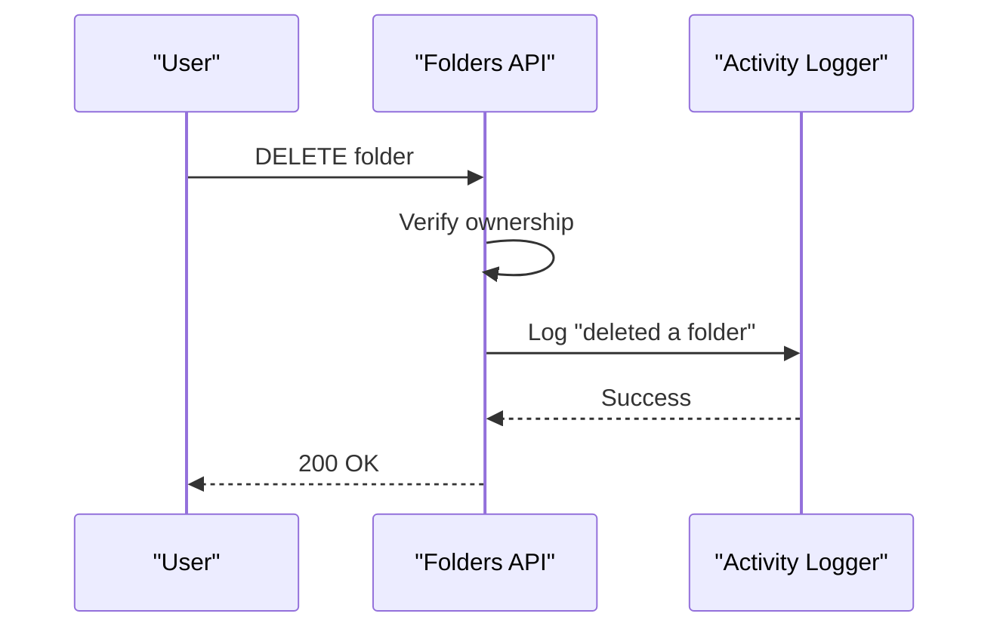
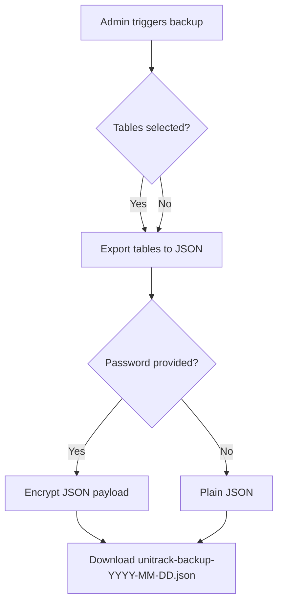
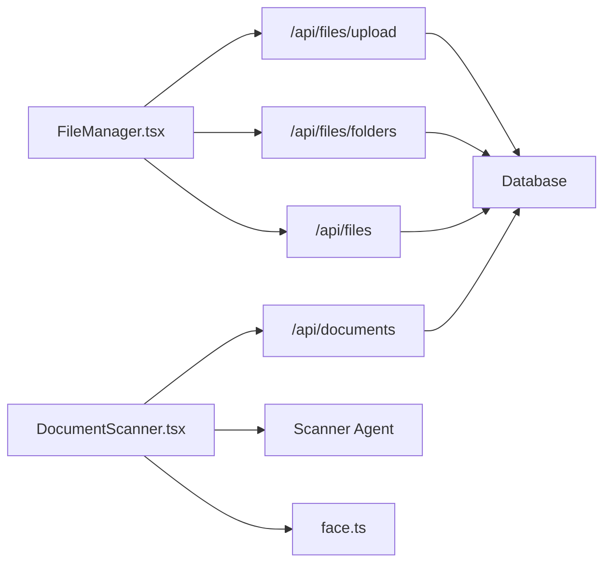

# File Management & Document Processing

<cite>
**Referenced Files in This Document**
- [route.ts](file://src/app/api/files/route.ts)
- [route.ts](file://src/app/api/files/upload/route.ts)
- [route.ts](file://src/app/api/files/folders/route.ts)
- [page.tsx](file://src/app/documents/page.tsx)
- [DocumentScanner.tsx](file://src/app/documents/components/DocumentScanner.tsx)
- [FileManager.tsx](file://src/app/files/components/FileManager.tsx)
- [route.ts](file://src/app/api/documents/route.ts)
- [index.js](file://scanner-agent/index.js)
- [face.ts](file://src/lib/face.ts)
- [FaceVerificationModal.tsx](file://src/components/hr/FaceVerificationModal.tsx)
- [route.ts](file://src/app/api/backup/route.ts)
- [activity.ts](file://src/lib/activity.ts)
- [schema.prisma](file://prisma/schema.prisma)
</cite>

## Table of Contents
1. Introduction
2. Project Structure
3. Core Components
4. Architecture Overview
5. Detailed Component Analysis
6. Dependency Analysis
7. Performance Considerations
8. Troubleshooting Guide
9. Conclusion

## Introduction
This document explains the File Management and Document Processing system with a focus on:
- Secure file uploads, folder organization, and access control
- Browser-based scanning and integration with local scanner hardware
- OCR-ready image capture and quality controls
- Face recognition for employee verification and document authentication
- File sharing concepts, permissions, and audit trails
- Storage optimization, compression, and backup strategies
- Workflows, automation rules, and storage quotas
- Troubleshooting common issues

## Project Structure
The system is implemented as a Next.js application with server routes handling files and documents, a client-side scanner UI, and an optional scanner agent for hardware scanning.

**Diagram sources**
- [FileManager.tsx:1-800](file://src/app/files/components/FileManager.tsx#L1-L800)
- [DocumentScanner.tsx:1-523](file://src/app/documents/components/DocumentScanner.tsx#L1-L523)
- [route.ts:1-128](file://src/app/api/files/folders/route.ts#L1-L128)
- [route.ts:1-87](file://src/app/api/files/route.ts#L1-L87)
- [route.ts:1-192](file://src/app/api/files/upload/route.ts#L1-L192)
- [route.ts:1-110](file://src/app/api/documents/route.ts#L1-L110)
- [index.js:1-265](file://scanner-agent/index.js#L1-L265)
- [face.ts:1-68](file://src/lib/face.ts#L1-L68)

**Section sources**
- [FileManager.tsx:1-800](file://src/app/files/components/FileManager.tsx#L1-L800)
- [DocumentScanner.tsx:1-523](file://src/app/documents/components/DocumentScanner.tsx#L1-L523)
- [route.ts:1-128](file://src/app/api/files/folders/route.ts#L1-L128)
- [route.ts:1-87](file://src/app/api/files/route.ts#L1-L87)
- [route.ts:1-192](file://src/app/api/files/upload/route.ts#L1-L192)
- [route.ts:1-110](file://src/app/api/documents/route.ts#L1-L110)
- [index.js:1-265](file://scanner-agent/index.js#L1-L265)
- [face.ts:1-68](file://src/lib/face.ts#L1-L68)

## Core Components
- File upload endpoint with MIME type allowlist, size limits, safe filename generation, and per-user folder ownership
- Folder management endpoints with creation, listing, and deletion with activity logging
- Document scanner page that captures images via camera or device scanner, then persists metadata to the database
- Scanner agent service that enumerates and scans WIA-compatible devices
- Face recognition utilities for liveness checks and identity verification
- Backup endpoint exporting key tables with optional encryption

Key behaviors:
- Uploads are stored under public/uploads with unique filenames and metadata recorded in the database
- Scanned documents are tracked separately with DPI and size metadata
- All create/delete actions log activities for auditability

**Section sources**
- [route.ts:1-192](file://src/app/api/files/upload/route.ts#L1-L192)
- [route.ts:1-128](file://src/app/api/files/folders/route.ts#L1-L128)
- [route.ts:1-87](file://src/app/api/files/route.ts#L1-L87)
- [DocumentScanner.tsx:1-523](file://src/app/documents/components/DocumentScanner.tsx#L1-L523)
- [index.js:1-265](file://scanner-agent/index.js#L1-L265)
- [face.ts:1-68](file://src/lib/face.ts#L1-L68)
- [route.ts:1-110](file://src/app/api/documents/route.ts#L1-L110)

## Architecture Overview
The system combines browser-based capture with server-side persistence and optional hardware scanning.

**Diagram sources**
- [FileManager.tsx:208-320](file://src/app/files/components/FileManager.tsx#L208-L320)
- [route.ts:86-192](file://src/app/api/files/upload/route.ts#L86-L192)

**Diagram sources**
- [DocumentScanner.tsx:105-211](file://src/app/documents/components/DocumentScanner.tsx#L105-L211)
- [index.js:192-259](file://scanner-agent/index.js#L192-L259)
- [route.ts:38-74](file://src/app/api/documents/route.ts#L38-L74)

## Detailed Component Analysis

### File Upload System
- Authentication: Each request validates session token before processing
- Validation: Allowed MIME types enforced; maximum file size enforced
- Safe naming: Sanitizes names and appends counters to avoid collisions
- Storage: Writes to public/uploads; records URL, size, type, and owner
- Ownership: Files belong to the authenticated user and can be associated with folders or student contexts

**Diagram sources**
- [route.ts:86-192](file://src/app/api/files/upload/route.ts#L86-L192)

**Section sources**
- [route.ts:19-37](file://src/app/api/files/upload/route.ts#L19-L37)
- [route.ts:59-84](file://src/app/api/files/upload/route.ts#L59-L84)
- [route.ts:86-192](file://src/app/api/files/upload/route.ts#L86-L192)

### Folder Organization and Access Control
- Listing: Returns user-owned folders plus virtual “student” folders derived from students
- Creation: Creates folder tied to current user; logs activity
- Deletion: Deletes folder if owned by current user; logs activity
- Access: Only the folder owner can delete; listing filters by user

**Diagram sources**
- [schema.prisma:139-198](file://prisma/schema.prisma#L139-L198)

**Section sources**
- [route.ts:18-58](file://src/app/api/files/folders/route.ts#L18-L58)
- [route.ts:60-92](file://src/app/api/files/folders/route.ts#L60-L92)
- [route.ts:94-128](file://src/app/api/files/folders/route.ts#L94-L128)
- [route.ts:18-51](file://src/app/api/files/route.ts#L18-L51)

### Document Scanner Integration
- Camera capture: Uses getUserMedia, draws to canvas, exports JPEG with quality based on DPI
- Hardware scanning: Communicates with scanner agent to enumerate and scan WIA devices
- Persistence: Uploads image via /api/upload, then saves metadata via /api/documents
- History: Lists scanned documents per user with preview and download

**Diagram sources**
- [DocumentScanner.tsx:105-211](file://src/app/documents/components/DocumentScanner.tsx#L105-L211)
- [route.ts:38-74](file://src/app/api/documents/route.ts#L38-L74)

**Section sources**
- [DocumentScanner.tsx:105-211](file://src/app/documents/components/DocumentScanner.tsx#L105-L211)
- [DocumentScanner.tsx:328-511](file://src/app/documents/components/DocumentScanner.tsx#L328-L511)
- [index.js:192-259](file://scanner-agent/index.js#L192-L259)
- [route.ts:19-36](file://src/app/api/documents/route.ts#L19-L36)
- [route.ts:76-110](file://src/app/api/documents/route.ts#L76-L110)

### Face Recognition for Employee Verification
- Model loading: Loads face detection, landmarks, and recognition models once
- Liveness: Tracks head movement across frames to ensure live presence
- Verification: Compares captured descriptor against enrolled descriptor using Euclidean distance
- Workflow: Captures photo, uploads it, and returns similarity score

**Diagram sources**
- [face.ts:7-68](file://src/lib/face.ts#L7-L68)
- [FaceVerificationModal.tsx:187-302](file://src/components/hr/FaceVerificationModal.tsx#L187-L302)

**Section sources**
- [face.ts:7-68](file://src/lib/face.ts#L7-L68)
- [FaceVerificationModal.tsx:18-123](file://src/components/hr/FaceVerificationModal.tsx#L18-L123)
- [FaceVerificationModal.tsx:187-302](file://src/components/hr/FaceVerificationModal.tsx#L187-L302)

### File Sharing, Permissions, and Audit Trails
- Permissions: Folder and file operations enforce ownership checks; only owners can delete
- Sharing: The UI supports concepts like share links and permissions; implementation details may extend beyond current routes
- Audit trails: Create and delete actions log activities with actor name and target; notifications are created for important events

**Diagram sources**
- [route.ts:94-128](file://src/app/api/files/folders/route.ts#L94-L128)
- [activity.ts:60-114](file://src/lib/activity.ts#L60-L114)

**Section sources**
- [route.ts:94-128](file://src/app/api/files/folders/route.ts#L94-L128)
- [route.ts:53-87](file://src/app/api/files/route.ts#L53-L87)
- [activity.ts:60-114](file://src/lib/activity.ts#L60-L114)

### Storage Optimization, Compression, and Backup Strategies
- Image compression: Scanner UI exports JPEG with quality tuned by DPI setting
- Deduplication: Uploads generate unique filenames to prevent overwrites
- Backup: Admin-only endpoint exports selected tables into JSON; optional password-based encryption

**Diagram sources**
- [route.ts:6-202](file://src/app/api/backup/route.ts#L6-L202)

**Section sources**
- [DocumentScanner.tsx:139-161](file://src/app/documents/components/DocumentScanner.tsx#L139-L161)
- [FileManager.tsx:450-465](file://src/app/files/components/FileManager.tsx#L450-L465)
- [route.ts:6-202](file://src/app/api/backup/route.ts#L6-L202)

## Dependency Analysis
- Frontend components depend on backend routes for all CRUD operations
- Scanner agent is an optional dependency for hardware scanning; UI gracefully handles unavailability
- Face recognition depends on model assets served under /models
- Activity logging is used consistently across file and document operations

**Diagram sources**
- [FileManager.tsx:1-800](file://src/app/files/components/FileManager.tsx#L1-L800)
- [DocumentScanner.tsx:1-523](file://src/app/documents/components/DocumentScanner.tsx#L1-L523)
- [route.ts:1-192](file://src/app/api/files/upload/route.ts#L1-L192)
- [route.ts:1-110](file://src/app/api/documents/route.ts#L1-L110)
- [index.js:1-265](file://scanner-agent/index.js#L1-L265)
- [face.ts:1-68](file://src/lib/face.ts#L1-L68)

**Section sources**
- [FileManager.tsx:1-800](file://src/app/files/components/FileManager.tsx#L1-L800)
- [DocumentScanner.tsx:1-523](file://src/app/documents/components/DocumentScanner.tsx#L1-L523)
- [route.ts:1-192](file://src/app/api/files/upload/route.ts#L1-L192)
- [route.ts:1-110](file://src/app/api/documents/route.ts#L1-L110)
- [index.js:1-265](file://scanner-agent/index.js#L1-L265)
- [face.ts:1-68](file://src/lib/face.ts#L1-L68)

## Performance Considerations
- Use appropriate DPI settings to balance quality and file size
- Prefer JPEG compression tuned by DPI to reduce bandwidth and storage
- Batch operations where possible (e.g., listing folders and files together)
- Ensure scanner agent runs locally for low-latency hardware scanning
- Offload heavy tasks (like face model loading) to client side with caching

[No sources needed since this section provides general guidance]

## Troubleshooting Guide
- Upload failures
  - Check MIME allowlist and file size limits
  - Verify session authentication and folder ownership
  - Confirm disk space under public/uploads
  - References: [route.ts:19-37](file://src/app/api/files/upload/route.ts#L19-L37), [route.ts:86-192](file://src/app/api/files/upload/route.ts#L86-L192)

- OCR accuracy issues
  - Increase DPI and capture quality; re-capture if blurry
  - Ensure good lighting and steady capture
  - References: [DocumentScanner.tsx:139-161](file://src/app/documents/components/DocumentScanner.tsx#L139-L161)

- Scanner device not found
  - Ensure scanner agent is running and accessible at localhost:5899
  - On Windows, confirm WIA drivers are installed for the device
  - References: [index.js:192-259](file://scanner-agent/index.js#L192-L259), [FileManager.tsx:392-414](file://src/app/files/components/FileManager.tsx#L392-L414)

- Face verification errors
  - Allow camera and location permissions
  - Ensure models load successfully
  - Move head slightly to pass liveness check
  - References: [FaceVerificationModal.tsx:187-302](file://src/components/hr/FaceVerificationModal.tsx#L187-L302), [face.ts:7-68](file://src/lib/face.ts#L7-L68)

- Storage capacity problems
  - Monitor public/uploads growth; implement cleanup policies
  - Use backups to preserve critical data before purging
  - References: [route.ts:6-202](file://src/app/api/backup/route.ts#L6-L202)

**Section sources**
- [route.ts:19-37](file://src/app/api/files/upload/route.ts#L19-L37)
- [route.ts:86-192](file://src/app/api/files/upload/route.ts#L86-L192)
- [DocumentScanner.tsx:139-161](file://src/app/documents/components/DocumentScanner.tsx#L139-L161)
- [index.js:192-259](file://scanner-agent/index.js#L192-L259)
- [FileManager.tsx:392-414](file://src/app/files/components/FileManager.tsx#L392-L414)
- [FaceVerificationModal.tsx:187-302](file://src/components/hr/FaceVerificationModal.tsx#L187-L302)
- [face.ts:7-68](file://src/lib/face.ts#L7-L68)
- [route.ts:6-202](file://src/app/api/backup/route.ts#L6-L202)

## Conclusion
The system provides a robust foundation for secure file management, browser-based scanning, and optional hardware scanning integration. It enforces access controls, maintains audit trails, and supports backup workflows. With careful configuration of DPI, compression, and storage policies, teams can optimize performance while ensuring reliable document processing and verification through face recognition.

[No sources needed since this section summarizes without analyzing specific files]