# File Permissions & Security

<cite>
**Referenced Files in This Document**
- [permissions.ts](file://src/lib/permissions.ts)
- [session.ts](file://src/lib/session.ts)
- [csrf.ts](file://src/lib/csrf.ts)
- [rate-limit.ts](file://src/lib/rate-limit.ts)
- [crypto.ts](file://src/lib/crypto.ts)
- [activity.ts](file://src/lib/activity.ts)
- [logger.ts](file://src/lib/logger.ts)
- [route.ts (files)](file://src/app/api/files/route.ts)
- [route.ts (files/upload)](file://src/app/api/files/upload/route.ts)
- [route.ts (files/folders)](file://src/app/api/files/folders/route.ts)
- [route.ts (auth/login)](file://src/app/api/auth/login/route.ts)
- [route.ts (auth/me)](file://src/app/api/auth/me/route.ts)
- [schema.prisma](file://prisma/schema.prisma)
</cite>

## Table of Contents
1. Introduction
2. Project Structure
3. Core Components
4. Architecture Overview
5. Detailed Component Analysis
6. Dependency Analysis
7. Performance Considerations
8. Troubleshooting Guide
9. Conclusion
10. Appendices

## Introduction
This document explains the file permissions and security model for authenticated file access, authorization, and audit trails. It covers role-based permissions, session management with token-based authorization, folder-level security policies, input validation and sanitization, rate limiting, CSRF protection, encryption at rest, and comprehensive audit logging. The goal is to provide clear guidance for configuring security policies, monitoring suspicious activities, and implementing compliance requirements around file operations.

## Project Structure
The file system security is implemented across API routes under src/app/api/files and supporting libraries under src/lib. Authentication and sessions are handled via JWT tokens stored in httpOnly cookies. Role-based permissions are enforced using a centralized permission map. Audit logs capture key actions such as login, file upload, deletion, and folder creation/deletion.

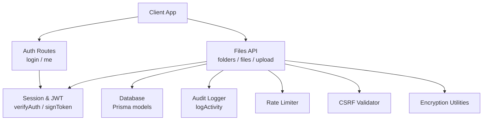

**Diagram sources**
- [route.ts (auth/login):19-123](file://src/app/api/auth/login/route.ts#L19-L123)
- [route.ts (auth/me):7-69](file://src/app/api/auth/me/route.ts#L7-L69)
- [route.ts (files):18-87](file://src/app/api/files/route.ts#L18-L87)
- [route.ts (files/upload):86-192](file://src/app/api/files/upload/route.ts#L86-L192)
- [route.ts (files/folders):18-128](file://src/app/api/files/folders/route.ts#L18-L128)
- [session.ts:19-36](file://src/lib/session.ts#L19-L36)
- [activity.ts:60-114](file://src/lib/activity.ts#L60-L114)
- [rate-limit.ts:43-101](file://src/lib/rate-limit.ts#L43-L101)
- [csrf.ts:9-46](file://src/lib/csrf.ts#L9-L46)
- [crypto.ts:17-44](file://src/lib/crypto.ts#L17-L44)

**Section sources**
- [route.ts (files):18-87](file://src/app/api/files/route.ts#L18-L87)
- [route.ts (files/upload):86-192](file://src/app/api/files/upload/route.ts#L86-L192)
- [route.ts (files/folders):18-128](file://src/app/api/files/folders/route.ts#L18-L128)
- [session.ts:19-36](file://src/lib/session.ts#L19-L36)
- [activity.ts:60-114](file://src/lib/activity.ts#L60-L114)
- [rate-limit.ts:43-101](file://src/lib/rate-limit.ts#L43-L101)
- [csrf.ts:9-46](file://src/lib/csrf.ts#L9-L46)
- [crypto.ts:17-44](file://src/lib/crypto.ts#L17-L44)

## Core Components
- Role-based permissions: Centralized mapping of roles to permissions for resources and routes.
- Session management: JWT-based authentication with secure cookie storage and token verification.
- Authorization checks: Ownership-based access control for folders and files; route-level permission mapping.
- Input validation and sanitization: Strict MIME type allowlist, size limits, filename sanitization.
- Rate limiting: Per-IP request throttling with database-backed counters and in-memory fallback.
- CSRF protection: Origin/referer validation for non-safe HTTP methods.
- Encryption at rest: AES-GCM encryption utilities for backups or sensitive payloads.
- Audit logging: Structured activity logs capturing user actions on files and folders.

**Section sources**
- [permissions.ts:11-106](file://src/lib/permissions.ts#L11-L106)
- [session.ts:19-36](file://src/lib/session.ts#L19-L36)
- [route.ts (files/upload):19-46](file://src/app/api/files/upload/route.ts#L19-L46)
- [rate-limit.ts:43-101](file://src/lib/rate-limit.ts#L43-L101)
- [csrf.ts:9-46](file://src/lib/csrf.ts#L9-L46)
- [crypto.ts:17-44](file://src/lib/crypto.ts#L17-L44)
- [activity.ts:60-114](file://src/lib/activity.ts#L60-L114)

## Architecture Overview
The system enforces security at multiple layers:
- Authentication: Login issues a signed JWT stored in an httpOnly cookie; subsequent requests verify the token.
- Authorization: Each file operation validates ownership (folder.userId or student association) and applies role-based checks where applicable.
- Input controls: Uploads enforce MIME allowlists and size limits; filenames are sanitized before writing.
- Protection: CSRF validation guards against cross-site attacks; rate limiting mitigates brute-force and abuse.
- Data protection: Encryption utilities support secure storage of sensitive data; secure cookie flags ensure safe transmission.
- Auditing: All critical actions are logged with actor details and targets.

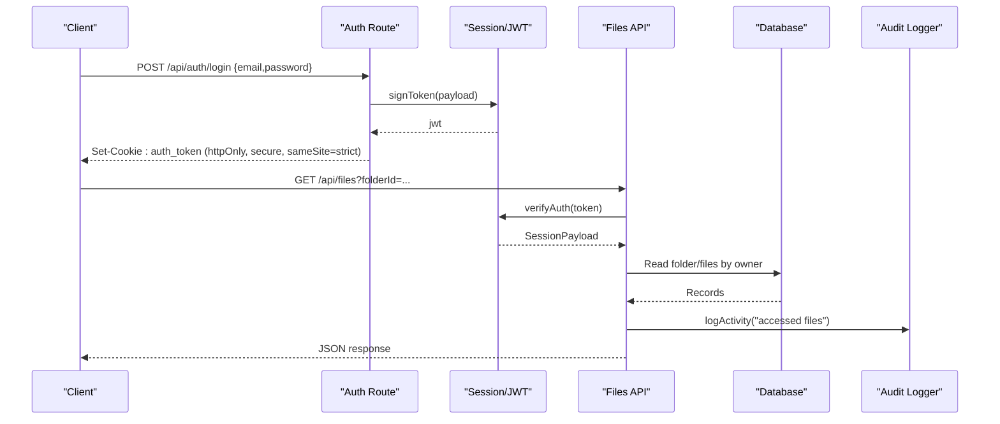

**Diagram sources**
- [route.ts (auth/login):19-123](file://src/app/api/auth/login/route.ts#L19-L123)
- [session.ts:19-36](file://src/lib/session.ts#L19-L36)
- [route.ts (files):18-87](file://src/app/api/files/route.ts#L18-L87)
- [activity.ts:60-114](file://src/lib/activity.ts#L60-L114)

## Detailed Component Analysis

### Role-Based Permission System
- Roles and permissions are defined centrally and checked per resource or route.
- Route-to-permission mapping enables coarse-grained access control for UI and API endpoints.
- Super admin bypasses standard checks.

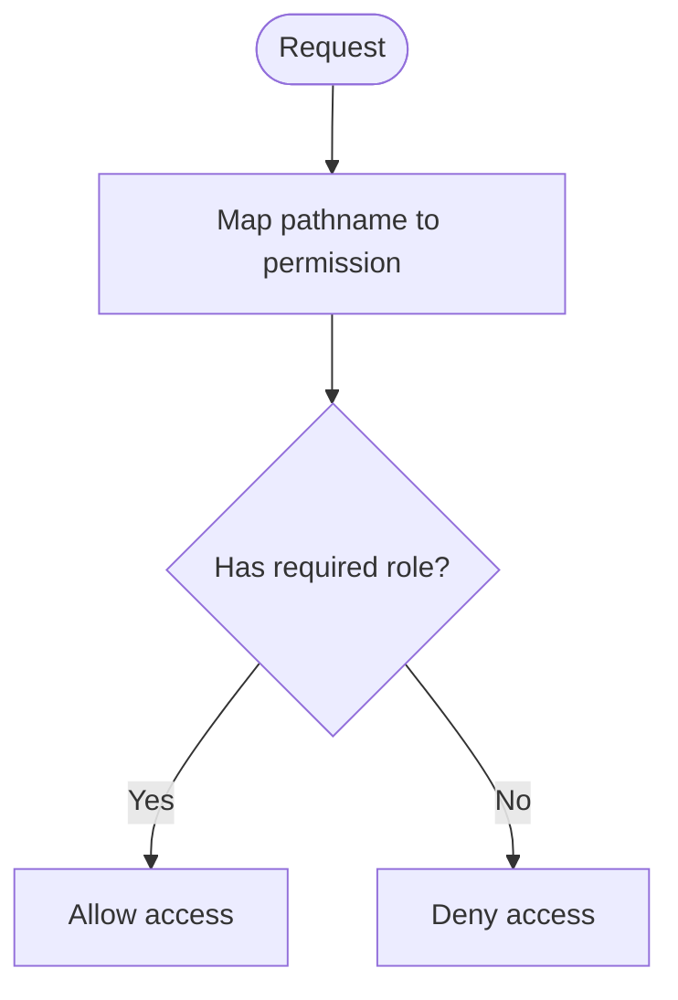

**Diagram sources**
- [permissions.ts:76-106](file://src/lib/permissions.ts#L76-L106)

**Section sources**
- [permissions.ts:11-106](file://src/lib/permissions.ts#L11-L106)

### Session Management and Token-Based Authorization
- Login flow issues a JWT with HS256 algorithm and sets it in an httpOnly, secure, strict SameSite cookie.
- Subsequent requests verify the token using a shared secret from environment variables.
- The /me endpoint resolves user identity and returns minimal profile data.

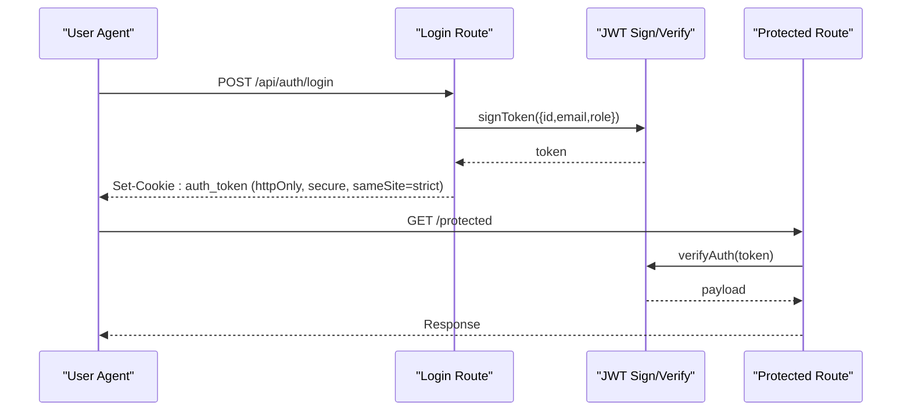

**Diagram sources**
- [route.ts (auth/login):19-123](file://src/app/api/auth/login/route.ts#L19-L123)
- [session.ts:19-36](file://src/lib/session.ts#L19-L36)
- [route.ts (auth/me):7-69](file://src/app/api/auth/me/route.ts#L7-L69)

**Section sources**
- [route.ts (auth/login):19-123](file://src/app/api/auth/login/route.ts#L19-L123)
- [session.ts:19-36](file://src/lib/session.ts#L19-L36)
- [route.ts (auth/me):7-69](file://src/app/api/auth/me/route.ts#L7-L69)

### Folder-Level Security Policies and Ownership
- Folders are owned by users; only the owner can list, create, or delete them.
- Student-scoped folders use a virtual id format and associate documents with students.
- File listing and deletion require valid session and ownership verification.

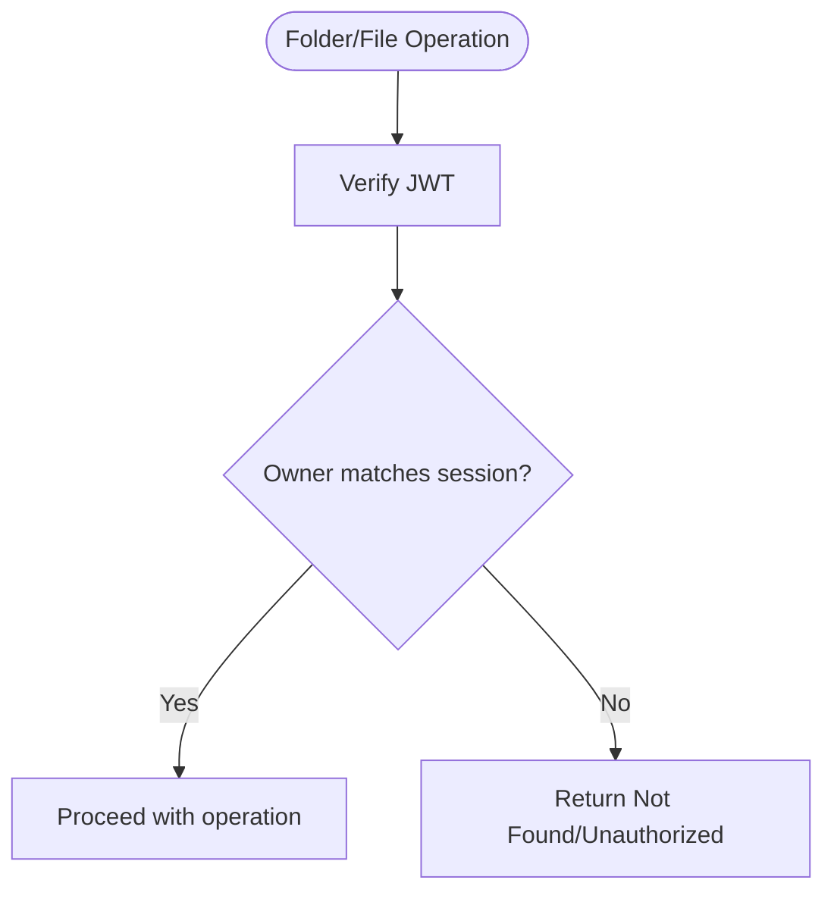

**Diagram sources**
- [route.ts (files/folders):18-128](file://src/app/api/files/folders/route.ts#L18-L128)
- [route.ts (files):18-87](file://src/app/api/files/route.ts#L18-L87)

**Section sources**
- [route.ts (files/folders):18-128](file://src/app/api/files/folders/route.ts#L18-L128)
- [route.ts (files):18-87](file://src/app/api/files/route.ts#L18-L87)

### File Upload Security: Validation, Sanitization, and Storage
- Enforces maximum file size and MIME type allowlist.
- Sanitizes filenames to prevent path traversal and injection.
- Writes files safely with unique naming to avoid collisions.
- Stores metadata in the database including file size, type, and associations.

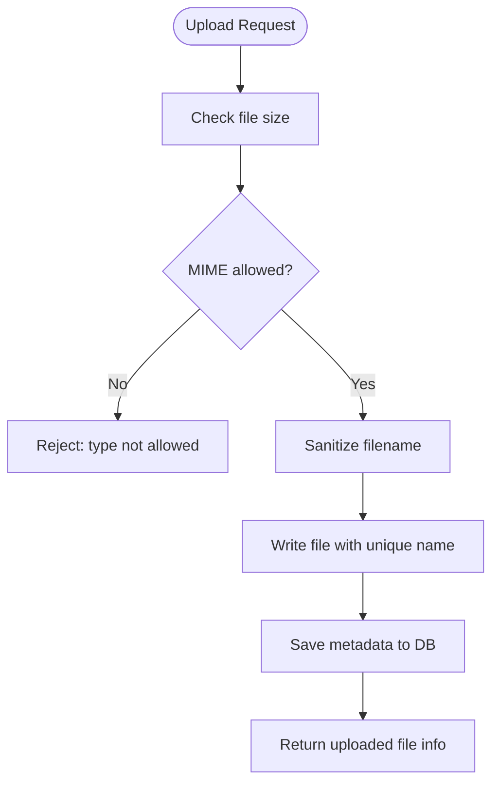

**Diagram sources**
- [route.ts (files/upload):19-46](file://src/app/api/files/upload/route.ts#L19-L46)
- [route.ts (files/upload):86-192](file://src/app/api/files/upload/route.ts#L86-L192)

**Section sources**
- [route.ts (files/upload):19-46](file://src/app/api/files/upload/route.ts#L19-L46)
- [route.ts (files/upload):86-192](file://src/app/api/files/upload/route.ts#L86-L192)

### CSRF Protection
- Validates origin or referer headers for non-safe methods against an allowlist.
- Prevents cross-site request forgery by ensuring requests originate from trusted domains.

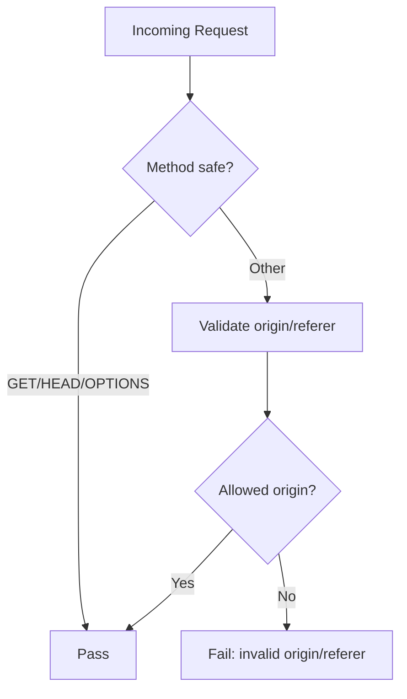

**Diagram sources**
- [csrf.ts:9-46](file://src/lib/csrf.ts#L9-L46)

**Section sources**
- [csrf.ts:9-46](file://src/lib/csrf.ts#L9-L46)

### Rate Limiting and Abuse Prevention
- Tracks request counts per key (e.g., IP-based login attempts).
- Uses database-backed counters with periodic cleanup; falls back to in-memory if unavailable.
- Returns remaining quota and reset time in headers for client feedback.

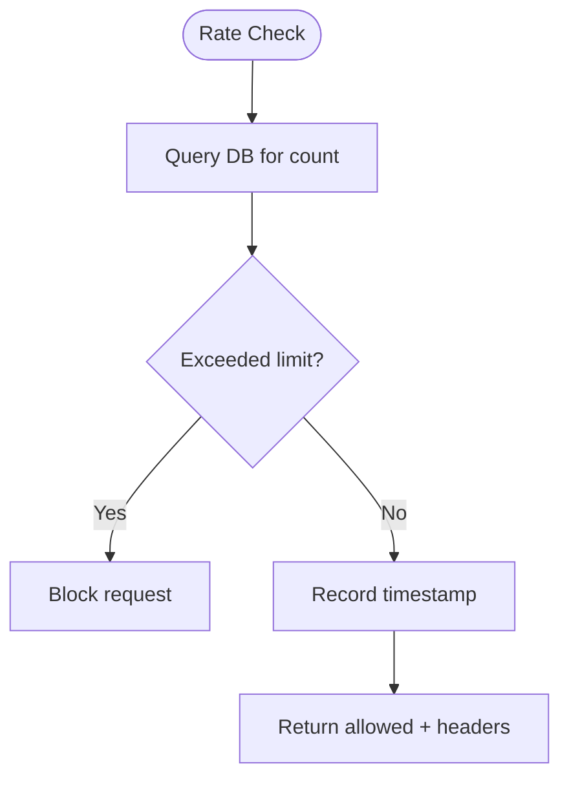

**Diagram sources**
- [rate-limit.ts:43-101](file://src/lib/rate-limit.ts#L43-L101)

**Section sources**
- [rate-limit.ts:43-101](file://src/lib/rate-limit.ts#L43-L101)

### Encryption at Rest
- Provides AES-GCM encryption/decryption for sensitive payloads (e.g., backups).
- Uses PBKDF2 key derivation with salt and IV for strong cryptographic security.

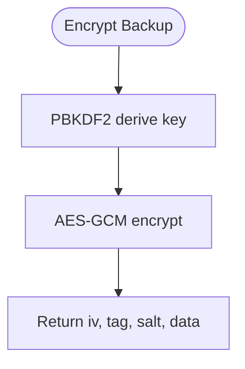

**Diagram sources**
- [crypto.ts:17-44](file://src/lib/crypto.ts#L17-L44)

**Section sources**
- [crypto.ts:17-44](file://src/lib/crypto.ts#L17-L44)

### Audit Logging and Notifications
- Logs user actions with actor name, target, and optional changes.
- Automatically creates notifications for significant events like creation or deletion.
- Integrates with database to persist activity logs.

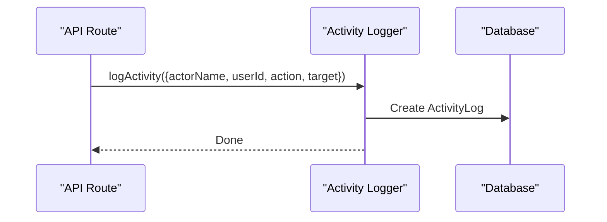

**Diagram sources**
- [activity.ts:60-114](file://src/lib/activity.ts#L60-L114)

**Section sources**
- [activity.ts:60-114](file://src/lib/activity.ts#L60-L114)

### Database Models for Files and Security
- FileFolder and FileItem models track ownership and relationships.
- StudentDocument associates files with students for scoped access.
- RateLimitLog supports persistent rate limiting.

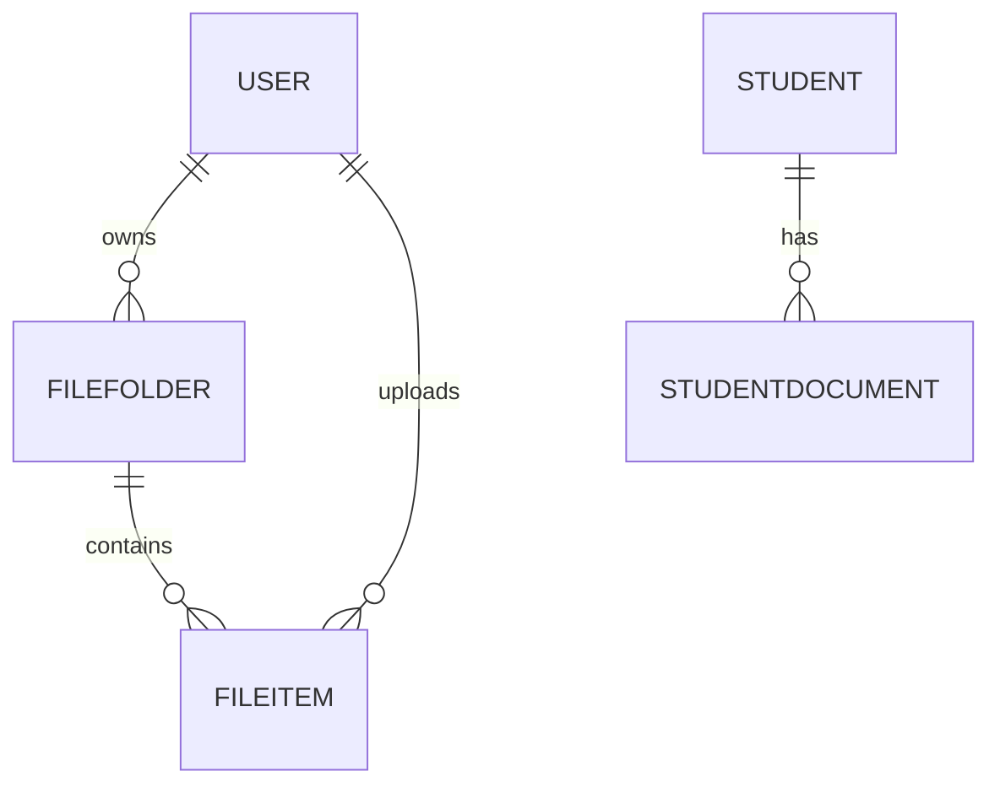

**Diagram sources**
- [schema.prisma:785-814](file://prisma/schema.prisma#L785-L814)
- [schema.prisma:800-814](file://prisma/schema.prisma#L800-L814)
- [schema.prisma:937-944](file://prisma/schema.prisma#L937-L944)

**Section sources**
- [schema.prisma:785-814](file://prisma/schema.prisma#L785-L814)
- [schema.prisma:800-814](file://prisma/schema.prisma#L800-L814)
- [schema.prisma:937-944](file://prisma/schema.prisma#L937-L944)

## Dependency Analysis
- API routes depend on session verification, permission checks, and audit logging.
- Rate limiter depends on database availability with in-memory fallback.
- CSRF validator depends on configured allowed origins.
- Encryption utilities are independent and used for sensitive data handling.

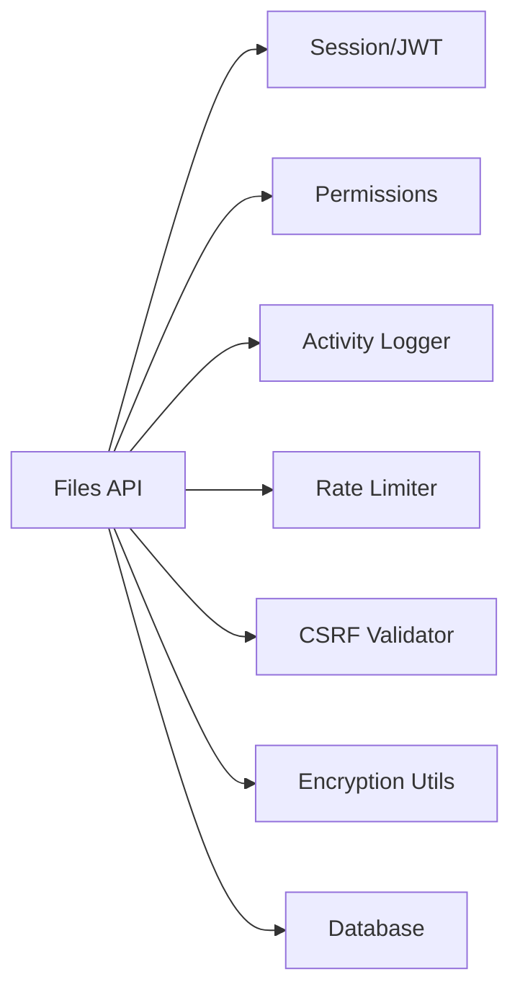

**Diagram sources**
- [route.ts (files):18-87](file://src/app/api/files/route.ts#L18-L87)
- [route.ts (files/upload):86-192](file://src/app/api/files/upload/route.ts#L86-L192)
- [route.ts (files/folders):18-128](file://src/app/api/files/folders/route.ts#L18-L128)
- [session.ts:19-36](file://src/lib/session.ts#L19-L36)
- [permissions.ts:76-106](file://src/lib/permissions.ts#L76-L106)
- [activity.ts:60-114](file://src/lib/activity.ts#L60-L114)
- [rate-limit.ts:43-101](file://src/lib/rate-limit.ts#L43-L101)
- [csrf.ts:9-46](file://src/lib/csrf.ts#L9-L46)
- [crypto.ts:17-44](file://src/lib/crypto.ts#L17-L44)

**Section sources**
- [route.ts (files):18-87](file://src/app/api/files/route.ts#L18-L87)
- [route.ts (files/upload):86-192](file://src/app/api/files/upload/route.ts#L86-L192)
- [route.ts (files/folders):18-128](file://src/app/api/files/folders/route.ts#L18-L128)
- [session.ts:19-36](file://src/lib/session.ts#L19-L36)
- [permissions.ts:76-106](file://src/lib/permissions.ts#L76-L106)
- [activity.ts:60-114](file://src/lib/activity.ts#L60-L114)
- [rate-limit.ts:43-101](file://src/lib/rate-limit.ts#L43-L101)
- [csrf.ts:9-46](file://src/lib/csrf.ts#L9-L46)
- [crypto.ts:17-44](file://src/lib/crypto.ts#L17-L44)

## Performance Considerations
- Prefer database-backed rate limiting in production; ensure indexes exist for efficient queries.
- Use connection pooling and query optimization for large file listings.
- Avoid excessive logging in hot paths; consider sampling for high-volume events.
- Cache frequently accessed metadata when appropriate to reduce DB load.

[No sources needed since this section provides general guidance]

## Troubleshooting Guide
- Unauthorized errors: Ensure JWT is present and valid; check cookie configuration and environment secret.
- Forbidden errors: Verify role-based permissions and route mappings; confirm super admin overrides if needed.
- Upload failures: Confirm MIME allowlist includes the file type; check size limits and filename sanitization rules.
- Rate limiting blocks: Inspect per-IP counters and adjust thresholds; monitor RateLimitLog entries.
- CSRF rejections: Validate origin/referer headers match allowed origins; update configuration if necessary.
- Audit gaps: Ensure logActivity is called for all critical operations; verify database connectivity.

**Section sources**
- [route.ts (auth/login):19-123](file://src/app/api/auth/login/route.ts#L19-L123)
- [route.ts (files/upload):86-192](file://src/app/api/files/upload/route.ts#L86-L192)
- [rate-limit.ts:43-101](file://src/lib/rate-limit.ts#L43-L101)
- [csrf.ts:9-46](file://src/lib/csrf.ts#L9-L46)
- [activity.ts:60-114](file://src/lib/activity.ts#L60-L114)
- [logger.ts:42-49](file://src/lib/logger.ts#L42-L49)

## Conclusion
The system implements a layered security approach combining authentication, authorization, input validation, CSRF protection, rate limiting, encryption, and comprehensive auditing. By enforcing ownership-based access for folders and files, applying role-based permissions, and logging all critical actions, it provides robust protection for file operations. Proper configuration of secrets, allowed origins, and rate limits ensures secure and compliant operation.

[No sources needed since this section summarizes without analyzing specific files]

## Appendices

### Configuration Guidelines
- Set JWT_SECRET securely; ensure it is available at runtime for signing and verifying tokens.
- Configure allowed origins for CSRF validation to match your deployment domains.
- Tune rate limits based on expected traffic and threat model; monitor RateLimitLog for anomalies.
- Enable secure cookies in production (httpOnly, secure, sameSite=strict).

**Section sources**
- [session.ts:3-9](file://src/lib/session.ts#L3-L9)
- [csrf.ts:3-7](file://src/lib/csrf.ts#L3-L7)
- [route.ts (auth/login):60-68](file://src/app/api/auth/login/route.ts#L60-L68)

### Monitoring and Compliance
- Monitor audit logs for unusual patterns (bulk deletions, repeated failed logins).
- Review rate limit logs to detect potential abuse or misconfigurations.
- Ensure encryption keys and salts are managed securely; rotate secrets periodically.
- Maintain least privilege by assigning minimal roles and permissions to users.

**Section sources**
- [activity.ts:60-114](file://src/lib/activity.ts#L60-L114)
- [rate-limit.ts:43-101](file://src/lib/rate-limit.ts#L43-L101)
- [crypto.ts:17-44](file://src/lib/crypto.ts#L17-L44)
- [permissions.ts:11-106](file://src/lib/permissions.ts#L11-L106)