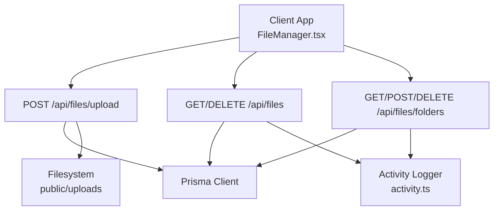
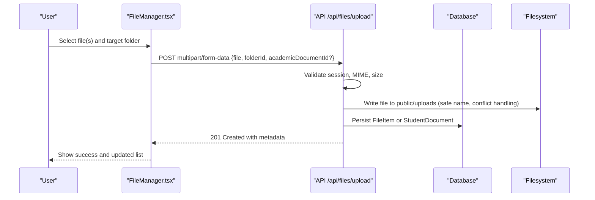
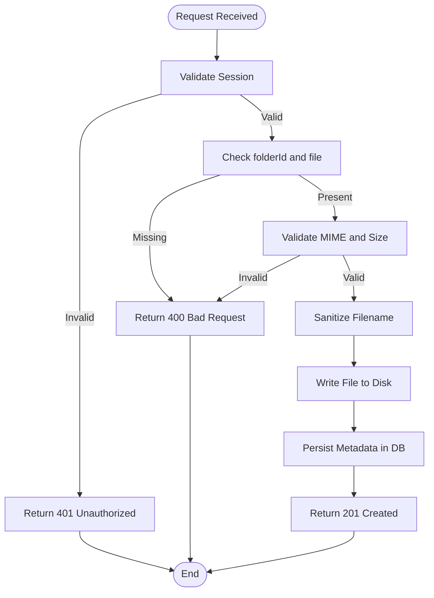
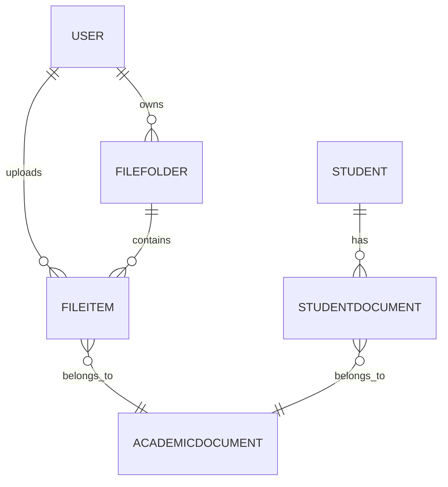
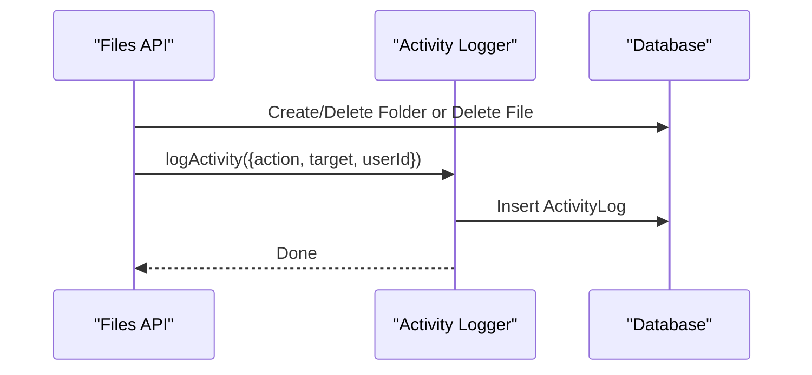
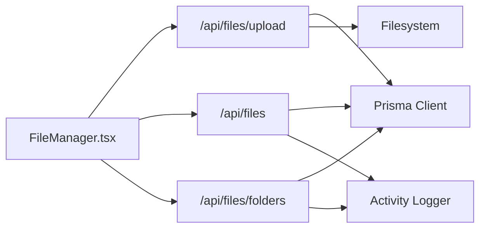

# File Upload System

<cite>
**Referenced Files in This Document**
- [route.ts](file://src/app/api/files/upload/route.ts)
- [route.ts](file://src/app/api/files/route.ts)
- [route.ts](file://src/app/api/files/folders/route.ts)
- [schema.prisma](file://prisma/schema.prisma)
- [activity.ts](file://src/lib/activity.ts)
- [FileManager.tsx](file://src/app/files/components/FileManager.tsx)
- [next.config.mjs](file://next.config.mjs)
</cite>

## Table of Contents
1. [Introduction](#introduction)
2. [Project Structure](#project-structure)
3. [Core Components](#core-components)
4. [Architecture Overview](#architecture-overview)
5. [Detailed Component Analysis](#detailed-component-analysis)
6. [Dependency Analysis](#dependency-analysis)
7. [Performance Considerations](#performance-considerations)
8. [Troubleshooting Guide](#troubleshooting-guide)
9. [Conclusion](#conclusion)
10. [Appendices](#appendices)

## Introduction
This document explains the File Upload System implemented in the application. It covers how files are uploaded, validated, stored, and organized into folders; how metadata is captured; how access control and audit logging work; and how to configure upload limits and security policies. It also provides concrete examples for uploading via multipart forms and organizing documents in hierarchical folders.

## Project Structure
The file upload system is implemented as a set of Next.js API routes under src/app/api/files with a client-side UI in src/app/files/components/FileManager.tsx. Data persistence uses Prisma models defined in prisma/schema.prisma. Audit logging is centralized in src/lib/activity.ts. Security headers are configured in next.config.mjs.

**Diagram sources**
- [route.ts:86-191](file://src/app/api/files/upload/route.ts#L86-L191)
- [route.ts:18-51](file://src/app/api/files/route.ts#L18-L51)
- [route.ts:18-92](file://src/app/api/files/folders/route.ts#L18-L92)
- [schema.prisma:785-814](file://prisma/schema.prisma#L785-L814)
- [activity.ts:60-113](file://src/lib/activity.ts#L60-L113)

**Section sources**
- [route.ts:86-191](file://src/app/api/files/upload/route.ts#L86-L191)
- [route.ts:18-51](file://src/app/api/files/route.ts#L18-L51)
- [route.ts:18-92](file://src/app/api/files/folders/route.ts#L18-L92)
- [schema.prisma:785-814](file://prisma/schema.prisma#L785-L814)
- [activity.ts:60-113](file://src/lib/activity.ts#L60-L113)

## Core Components
- Upload endpoint: POST /api/files/upload handles multipart uploads, validates MIME types and size, writes files to disk, and persists metadata.
- Files endpoints: GET /api/files lists files in a folder; DELETE /api/files removes a file and logs activity.
- Folders endpoints: GET /api/files/folders lists user folders and student containers; POST creates a folder; DELETE removes a folder and logs activity.
- Data model: FileFolder and FileItem store folder and file metadata; StudentDocument stores student-specific attachments.
- Audit logging: All create/delete actions on folders and files are logged via activity.ts.

Key behaviors:
- Authentication: Each route validates session via cookies and verifyAuth.
- Validation: Allowed MIME types and maximum file size enforced at the upload endpoint.
- Storage: Files are written to public/uploads with safe filenames and conflict resolution.
- Metadata: Name, URL, size, type, owner, and optional academic document association are persisted.

**Section sources**
- [route.ts:19-37](file://src/app/api/files/upload/route.ts#L19-L37)
- [route.ts:86-191](file://src/app/api/files/upload/route.ts#L86-L191)
- [route.ts:18-51](file://src/app/api/files/route.ts#L18-L51)
- [route.ts:53-86](file://src/app/api/files/route.ts#L53-L86)
- [route.ts:18-92](file://src/app/api/files/folders/route.ts#L18-L92)
- [schema.prisma:785-814](file://prisma/schema.prisma#L785-L814)
- [schema.prisma:456-472](file://prisma/schema.prisma#L456-L472)
- [activity.ts:60-113](file://src/lib/activity.ts#L60-L113)

## Architecture Overview
The upload flow authenticates the user, validates input, sanitizes filenames, writes files to disk, and records metadata. Folder operations list, create, and delete folders while logging changes. The UI composes these APIs to provide a complete file management experience.

**Diagram sources**
- [route.ts:86-191](file://src/app/api/files/upload/route.ts#L86-L191)
- [FileManager.tsx:1-200](file://src/app/files/components/FileManager.tsx#L1-L200)

**Section sources**
- [route.ts:86-191](file://src/app/api/files/upload/route.ts#L86-L191)
- [FileManager.tsx:1-200](file://src/app/files/components/FileManager.tsx#L1-L200)

## Detailed Component Analysis

### Upload Endpoint: POST /api/files/upload
Responsibilities:
- Authenticate request using session cookie.
- Require folderId query parameter.
- Parse multipart form data and extract file.
- Enforce allowed MIME types and max file size.
- Sanitize filename and write to disk with conflict resolution.
- Persist metadata to database (FileItem or StudentDocument).
- Return created resource with status 201.

Supported file types (MIME):
- Images: JPEG, PNG, GIF, WebP, SVG
- Documents: PDF, Word (.doc/.docx), Excel (.xls/.xlsx)
- Text: plain text, CSV
- Archives: ZIP

Size limit:
- Maximum 20 MB per file.

Validation rules:
- Must be authenticated.
- folderId must be present.
- File field must exist.
- MIME type must be allowed.
- Size must not exceed limit.

Storage behavior:
- Files saved under public/uploads.
- Filenames sanitized and conflicts resolved by appending counters.

Metadata persisted:
- name, url, fileSize, fileType, folderId/userId, optional academicDocumentId.

Error responses:
- 401 Unauthorized if no valid session.
- 400 Bad Request for missing parameters, unsupported MIME, oversized file.
- 404 Not Found for invalid folder or student context.
- 500 Internal Server Error on unexpected failures.

**Diagram sources**
- [route.ts:86-191](file://src/app/api/files/upload/route.ts#L86-L191)

**Section sources**
- [route.ts:19-37](file://src/app/api/files/upload/route.ts#L19-L37)
- [route.ts:86-191](file://src/app/api/files/upload/route.ts#L86-L191)

### Files Endpoints: GET /api/files and DELETE /api/files
- GET /api/files?folderId=...
  - Requires authentication.
  - Returns all files in the specified folder with related academic document and uploader info.
- DELETE /api/files?id=...
  - Requires authentication and ownership check.
  - Deletes the file record from the database.
  - Logs deletion activity.

Notes:
- Deletion removes only the database record; actual file removal from disk is not performed by this endpoint.

**Section sources**
- [route.ts:18-51](file://src/app/api/files/route.ts#L18-L51)
- [route.ts:53-86](file://src/app/api/files/route.ts#L53-L86)

### Folders Endpoints: GET/POST/DELETE /api/files/folders
- GET /api/files/folders
  - Lists user-owned folders and virtual “student” folders derived from students.
  - Includes file counts.
- POST /api/files/folders
  - Creates a new folder owned by the current user.
  - Logs creation activity.
- DELETE /api/files/folders?id=...
  - Deletes a folder owned by the current user.
  - Logs deletion activity.

Notes:
- Virtual student folders use IDs prefixed with “student_” and map to student records for uploads targeting student contexts.

**Section sources**
- [route.ts:18-92](file://src/app/api/files/folders/route.ts#L18-L92)
- [route.ts:94-128](file://src/app/api/files/folders/route.ts#L94-L128)

### Data Models and Relationships
- FileFolder: Represents a user’s folder with name, owner, timestamps, and relation to FileItem.
- FileItem: Represents an uploaded file with name, URL, size, type, owner, folder, and optional academic document link.
- StudentDocument: Represents a student’s attachment with name, URL, size, type, and optional academic document link.
- AcademicDocument: Optional classification used to group related files.

**Diagram sources**
- [schema.prisma:139-198](file://prisma/schema.prisma#L139-L198)
- [schema.prisma:785-814](file://prisma/schema.prisma#L785-L814)
- [schema.prisma:456-472](file://prisma/schema.prisma#L456-L472)
- [schema.prisma:480-486](file://prisma/schema.prisma#L480-L486)

**Section sources**
- [schema.prisma:785-814](file://prisma/schema.prisma#L785-L814)
- [schema.prisma:456-472](file://prisma/schema.prisma#L456-L472)
- [schema.prisma:480-486](file://prisma/schema.prisma#L480-L486)

### Access Control and Audit Logging
- Access control:
  - All file and folder endpoints require a valid session.
  - Ownership checks ensure users can only modify their own folders and files.
  - Student-based uploads validate the student exists before persisting.
- Audit logging:
  - Folder creation and deletion log activities via activity.ts.
  - File deletion logs activities via activity.ts.
  - Log entries include actor name, action, target, and optional details.

**Diagram sources**
- [route.ts:53-86](file://src/app/api/files/route.ts#L53-L86)
- [route.ts:60-92](file://src/app/api/files/folders/route.ts#L60-L92)
- [route.ts:94-128](file://src/app/api/files/folders/route.ts#L94-L128)
- [activity.ts:60-113](file://src/lib/activity.ts#L60-L113)

**Section sources**
- [route.ts:53-86](file://src/app/api/files/route.ts#L53-L86)
- [route.ts:60-92](file://src/app/api/files/folders/route.ts#L60-L92)
- [route.ts:94-128](file://src/app/api/files/folders/route.ts#L94-L128)
- [activity.ts:60-113](file://src/lib/activity.ts#L60-L113)

### UI Integration: FileManager.tsx
The client component orchestrates:
- Listing folders and files.
- Creating folders.
- Uploading files to selected folders.
- Deleting files.
- Previewing images and downloading files.

It consumes the APIs described above and renders appropriate feedback and error states.

**Section sources**
- [FileManager.tsx:1-200](file://src/app/files/components/FileManager.tsx#L1-L200)

## Dependency Analysis
- API routes depend on:
  - Database via Prisma client for reading/writing FileFolder, FileItem, StudentDocument, and AcademicDocument.
  - Filesystem for writing uploaded files to public/uploads.
  - Session verification for authentication.
  - Activity logger for audit trails.
- UI depends on:
  - API routes for CRUD operations.
  - Browser capabilities for multipart uploads and previews.

**Diagram sources**
- [FileManager.tsx:1-200](file://src/app/files/components/FileManager.tsx#L1-L200)
- [route.ts:86-191](file://src/app/api/files/upload/route.ts#L86-L191)
- [route.ts:18-51](file://src/app/api/files/route.ts#L18-L51)
- [route.ts:18-92](file://src/app/api/files/folders/route.ts#L18-L92)
- [activity.ts:60-113](file://src/lib/activity.ts#L60-L113)

**Section sources**
- [FileManager.tsx:1-200](file://src/app/files/components/FileManager.tsx#L1-L200)
- [route.ts:86-191](file://src/app/api/files/upload/route.ts#L86-L191)
- [route.ts:18-51](file://src/app/api/files/route.ts#L18-L51)
- [route.ts:18-92](file://src/app/api/files/folders/route.ts#L18-L92)
- [activity.ts:60-113](file://src/lib/activity.ts#L60-L113)

## Performance Considerations
- File size limit: Enforced server-side to prevent large payloads.
- Filename sanitization and conflict resolution avoid filesystem errors and collisions.
- Database queries include necessary relations to minimize round-trips.
- Consider adding:
  - Background processing for heavy tasks (e.g., thumbnail generation).
  - CDN caching for static assets under public/uploads.
  - Rate limiting for upload endpoints to mitigate abuse.

[No sources needed since this section provides general guidance]

## Troubleshooting Guide
Common issues and resolutions:
- Unauthorized (401): Ensure the user is logged in and the auth cookie is present.
- Missing folderId (400): Include folderId in the query string when uploading.
- No file uploaded (400): Ensure the multipart form includes a field named file.
- File type not allowed (400): Only supported MIME types are accepted; adjust client to send correct types.
- File too large (400): Reduce file size below the 20 MB limit.
- Folder not found (404): Verify the folderId exists and belongs to the current user.
- Failed to upload file (500): Check server logs for filesystem or database errors.

Operational notes:
- Deletion endpoints remove database records but do not delete physical files from disk. Implement cleanup if required.
- Audit logs capture key actions; review them for compliance and debugging.

**Section sources**
- [route.ts:86-191](file://src/app/api/files/upload/route.ts#L86-L191)
- [route.ts:18-51](file://src/app/api/files/route.ts#L18-L51)
- [route.ts:53-86](file://src/app/api/files/route.ts#L53-L86)
- [route.ts:18-92](file://src/app/api/files/folders/route.ts#L18-L92)
- [route.ts:94-128](file://src/app/api/files/folders/route.ts#L94-L128)

## Conclusion
The File Upload System provides secure, validated, and audited file handling with clear folder organization and metadata tracking. It supports common document and image formats, enforces size limits, and integrates with the application’s authentication and activity logging. The UI offers a comprehensive interface for managing files and folders.

[No sources needed since this section summarizes without analyzing specific files]

## Appendices

### API Reference

- POST /api/files/upload?folderId={id}&academicDocumentId={id?}
  - Purpose: Upload a file to a folder or student container.
  - Content-Type: multipart/form-data
  - Fields:
    - file: binary file
    - folderId: integer or student_{studentId}
    - academicDocumentId: optional integer
  - Success: 201 Created with file metadata
  - Errors: 400, 401, 404, 500

- GET /api/files?folderId={id}
  - Purpose: List files in a folder.
  - Success: 200 OK with array of file items
  - Errors: 400, 401, 404, 500

- DELETE /api/files?id={id}
  - Purpose: Delete a file record.
  - Success: 200 OK
  - Errors: 400, 401, 404, 500

- GET /api/files/folders
  - Purpose: List folders and student containers.
  - Success: 200 OK with array of folder objects
  - Errors: 401, 500

- POST /api/files/folders
  - Purpose: Create a new folder.
  - Body: JSON { name }
  - Success: 201 Created with folder object
  - Errors: 400, 401, 500

- DELETE /api/files/folders?id={id}
  - Purpose: Delete a folder.
  - Success: 200 OK
  - Errors: 400, 401, 404, 500

**Section sources**
- [route.ts:86-191](file://src/app/api/files/upload/route.ts#L86-L191)
- [route.ts:18-51](file://src/app/api/files/route.ts#L18-L51)
- [route.ts:53-86](file://src/app/api/files/route.ts#L53-L86)
- [route.ts:18-92](file://src/app/api/files/folders/route.ts#L18-L92)
- [route.ts:94-128](file://src/app/api/files/folders/route.ts#L94-L128)

### Example Usage

- Multipart form upload to a folder:
  - Method: POST
  - URL: /api/files/upload?folderId=123
  - Form fields:
    - file: select a file
    - academicDocumentId: optional
  - Expected response: 201 with file metadata

- Organizing documents in hierarchical folders:
  - Create top-level folders via POST /api/files/folders.
  - Use the returned folderId to upload files.
  - Note: The current implementation does not support nested folders; consider creating subfolders as separate folder entities and linking via naming conventions or additional fields.

- Previewing images:
  - Use the file.url returned by the API to display images in the UI.
  - The UI component supports image preview and download.

**Section sources**
- [route.ts:86-191](file://src/app/api/files/upload/route.ts#L86-L191)
- [FileManager.tsx:1-200](file://src/app/files/components/FileManager.tsx#L1-L200)

### Configuration Guidelines

- Upload limits:
  - Max file size: 20 MB (enforced in upload endpoint).
  - Adjust MAX_FILE_SIZE constant if needed.

- Supported formats:
  - Images: JPEG, PNG, GIF, WebP, SVG
  - Documents: PDF, Word, Excel
  - Text: plain text, CSV
  - Archives: ZIP
  - Modify ALLOWED_MIME_TYPES to add or remove formats.

- Security policies:
  - Authentication required for all endpoints.
  - Ownership checks enforced for modifications.
  - Security headers configured globally in next.config.mjs.

- Storage location:
  - Files are stored under public/uploads.
  - Ensure web server serves this directory publicly.

- Audit logging:
  - Activities are recorded for folder and file deletions.
  - Review logs for compliance and troubleshooting.

**Section sources**
- [route.ts:19-37](file://src/app/api/files/upload/route.ts#L19-L37)
- [next.config.mjs:17-45](file://next.config.mjs#L17-L45)
- [activity.ts:60-113](file://src/lib/activity.ts#L60-L113)