# Storage Management & Optimization

<cite>
**Referenced Files in This Document**
- [next.config.mjs](file://next.config.mjs)
- [image-hosts.config.mjs](file://image-hosts.config.mjs)
- [src/app/api/files/upload/route.ts](file://src/app/api/files/upload/route.ts)
- [src/app/api/files/route.ts](file://src/app/api/files/route.ts)
- [src/app/api/files/folders/route.ts](file://src/app/api/files/folders/route.ts)
- [src/app/api/backup/route.ts](file://src/app/api/backup/route.ts)
- [src/app/api/restore/route.ts](file://src/app/api/restore/route.ts)
- [src/lib/crypto.ts](file://src/lib/crypto.ts)
- [prisma/schema.prisma](file://prisma/schema.prisma)
- [src/lib/trash.ts](file://src/lib/trash.ts)
- [src/app/files/components/FileManager.tsx](file://src/app/files/components/FileManager.tsx)
- [src/app/documents/components/DocumentScanner.tsx](file://src/app/documents/components/DocumentScanner.tsx)
</cite>

## Table of Contents
1. Introduction
2. Project Structure
3. Core Components
4. Architecture Overview
5. Detailed Component Analysis
6. Dependency Analysis
7. Performance Considerations
8. Troubleshooting Guide
9. Conclusion
10. Appendices

## Introduction
This document explains how the application manages storage and optimizes performance for files, backups, and data retention. It covers:
- Storage backend configuration for local filesystem and guidance for cloud providers
- File upload validation, naming, and metadata tracking
- Backup and restore workflows with encryption and size limits
- Caching and CDN integration via Next.js image settings
- Cleanup policies using soft delete and trash purging
- Monitoring and capacity planning recommendations
- Scalability considerations for large file volumes and disaster recovery

## Project Structure
The storage-related functionality is implemented across API routes, configuration, database schema, and UI components:
- Upload and listing APIs handle file persistence to a local directory under public/uploads and metadata into the database
- Backup and restore APIs export/import encrypted JSON snapshots of selected tables
- Image optimization and caching are configured through Next.js settings
- Trash management provides soft deletes and scheduled purging

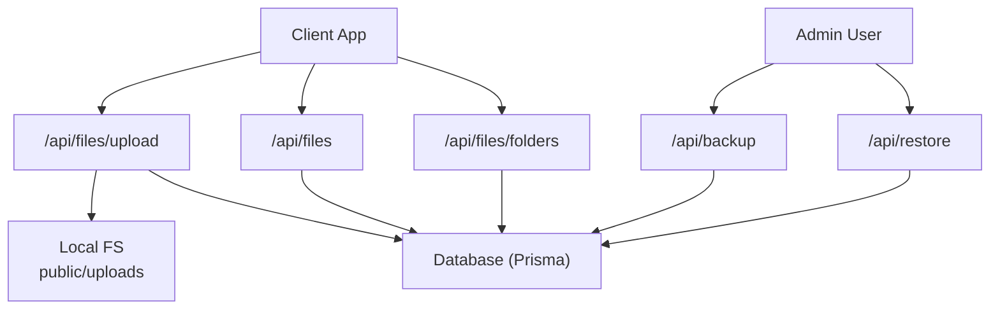

**Diagram sources**
- [src/app/api/files/upload/route.ts:86-191](file://src/app/api/files/upload/route.ts#L86-L191)
- [src/app/api/files/route.ts:18-86](file://src/app/api/files/route.ts#L18-L86)
- [src/app/api/files/folders/route.ts:18-128](file://src/app/api/files/folders/route.ts#L18-L128)
- [src/app/api/backup/route.ts:6-202](file://src/app/api/backup/route.ts#L6-L202)
- [src/app/api/restore/route.ts:1-129](file://src/app/api/restore/route.ts#L1-L129)

**Section sources**
- [next.config.mjs:11-14](file://next.config.mjs#L11-L14)
- [image-hosts.config.mjs:5-26](file://image-hosts.config.mjs#L5-L26)
- [src/app/api/files/upload/route.ts:19-37](file://src/app/api/files/upload/route.ts#L19-L37)
- [prisma/schema.prisma:785-814](file://prisma/schema.prisma#L785-L814)

## Core Components
- Local file storage backend: Files are written to a server-side directory under public/uploads with safe naming and conflict resolution. Metadata (name, URL, size, type, associations) is stored in the database.
- Upload validation: Allowed MIME types and maximum file size are enforced before writing to disk.
- Backup/export: Admin-only endpoint exports selected tables into an optional encrypted JSON payload.
- Restore/import: Validates backup structure, enforces allowed tables, checks payload size, and restores data.
- Image caching and CDN: Remote image hosts are whitelisted; Next.js caches images with a minimum TTL.
- Trash and cleanup: Soft deletes mark entities as deleted and schedule purging after a retention period.

**Section sources**
- [src/app/api/files/upload/route.ts:86-191](file://src/app/api/files/upload/route.ts#L86-L191)
- [src/app/api/backup/route.ts:6-202](file://src/app/api/backup/route.ts#L6-L202)
- [src/app/api/restore/route.ts:1-129](file://src/app/api/restore/route.ts#L1-L129)
- [next.config.mjs:11-14](file://next.config.mjs#L11-L14)
- [src/lib/trash.ts:88-118](file://src/lib/trash.ts#L88-L118)

## Architecture Overview
The system uses a Next.js serverless/API route model backed by Prisma and a local filesystem for uploads. Backups are generated from the database and can be restored with validation and optional encryption. Images served from remote hosts are optimized and cached by Next.js.

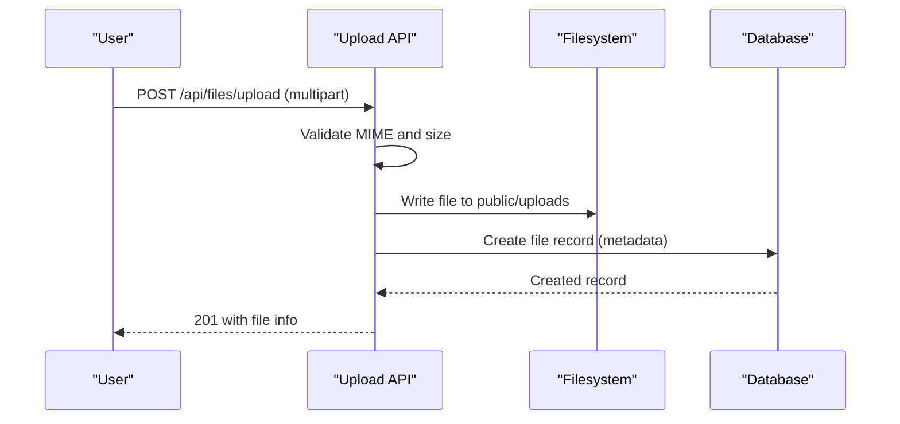

**Diagram sources**
- [src/app/api/files/upload/route.ts:86-191](file://src/app/api/files/upload/route.ts#L86-L191)

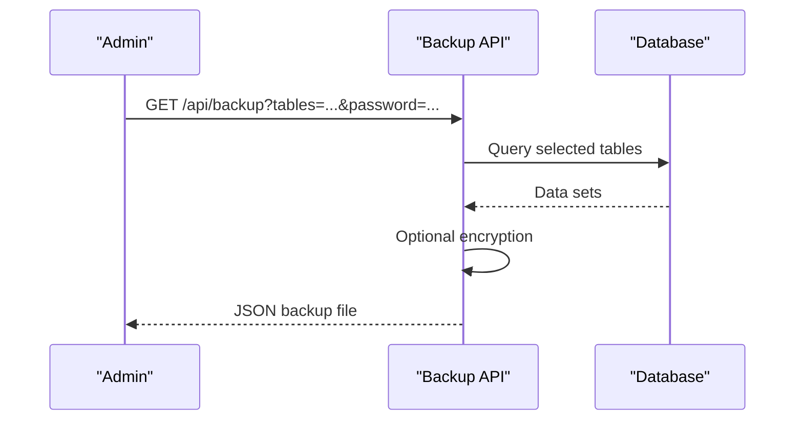

**Diagram sources**
- [src/app/api/backup/route.ts:6-202](file://src/app/api/backup/route.ts#L6-L202)
- [src/lib/crypto.ts:17-44](file://src/lib/crypto.ts#L17-L44)

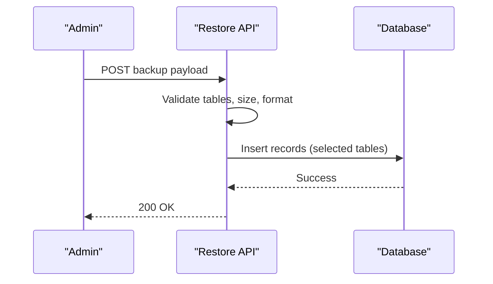

**Diagram sources**
- [src/app/api/restore/route.ts:1-129](file://src/app/api/restore/route.ts#L1-L129)

## Detailed Component Analysis

### File Upload and Storage Backend
- Accepts multipart form with a single file and optional academic document association
- Enforces allowed MIME types and a maximum file size
- Sanitizes filenames and resolves conflicts by appending counters
- Persists files to a local directory under public/uploads and stores metadata in the database
- Supports two contexts: student documents and user folders

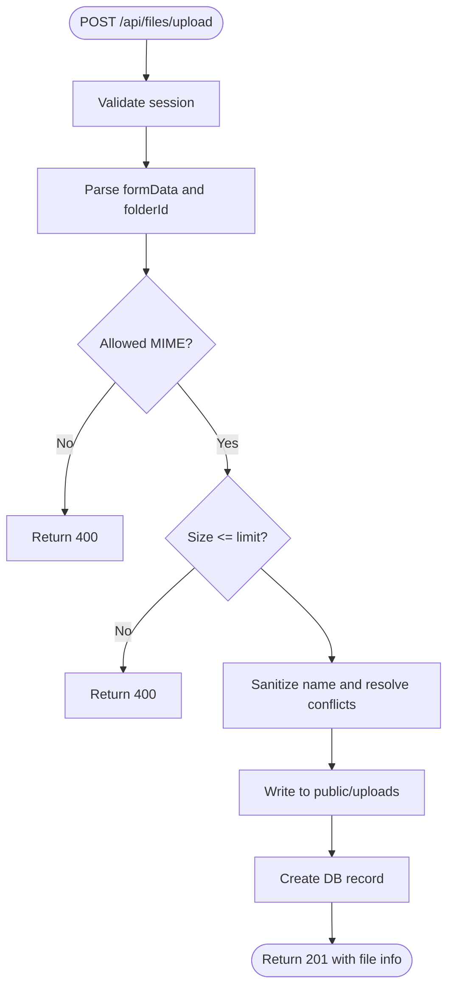

**Diagram sources**
- [src/app/api/files/upload/route.ts:86-191](file://src/app/api/files/upload/route.ts#L86-L191)

**Section sources**
- [src/app/api/files/upload/route.ts:19-37](file://src/app/api/files/upload/route.ts#L19-L37)
- [src/app/api/files/upload/route.ts:39-84](file://src/app/api/files/upload/route.ts#L39-L84)
- [src/app/api/files/upload/route.ts:86-191](file://src/app/api/files/upload/route.ts#L86-L191)
- [prisma/schema.prisma:785-814](file://prisma/schema.prisma#L785-L814)

### File Listing and Deletion
- Lists files within a folder with associated metadata and ordering
- Deletes files with authorization checks and activity logging

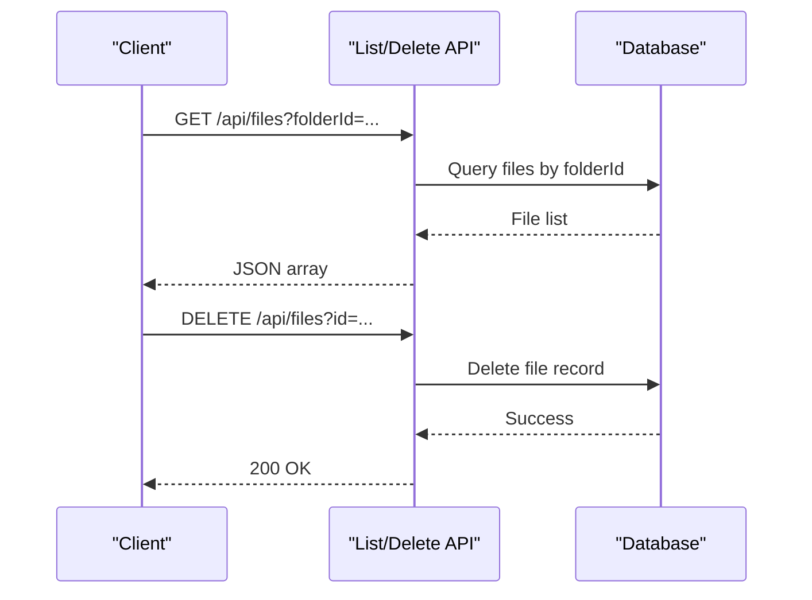

**Diagram sources**
- [src/app/api/files/route.ts:18-86](file://src/app/api/files/route.ts#L18-L86)

**Section sources**
- [src/app/api/files/route.ts:18-86](file://src/app/api/files/route.ts#L18-L86)

### Folder Management
- Retrieves folders and student containers with counts
- Creates and deletes folders with authorization and activity logging

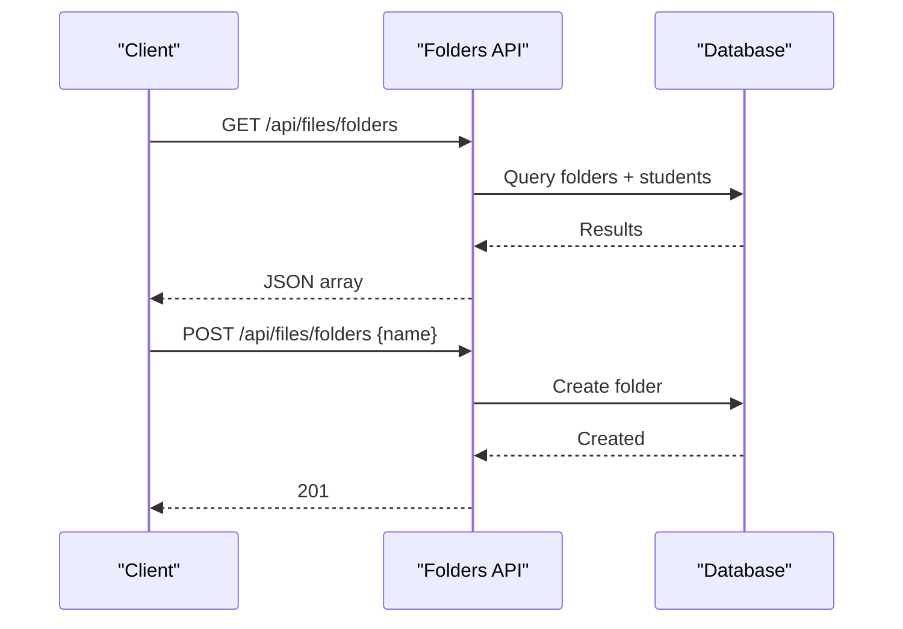

**Diagram sources**
- [src/app/api/files/folders/route.ts:18-128](file://src/app/api/files/folders/route.ts#L18-L128)

**Section sources**
- [src/app/api/files/folders/route.ts:18-128](file://src/app/api/files/folders/route.ts#L18-L128)

### Backup and Restore
- Backup: Exports selected tables into a JSON payload, optionally encrypted with AES-GCM
- Restore: Validates payload structure, table allowlist, and size; restores records accordingly

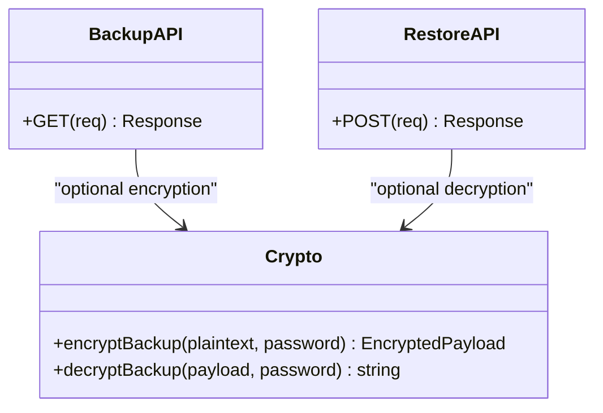

**Diagram sources**
- [src/app/api/backup/route.ts:6-202](file://src/app/api/backup/route.ts#L6-L202)
- [src/app/api/restore/route.ts:1-129](file://src/app/api/restore/route.ts#L1-L129)
- [src/lib/crypto.ts:1-45](file://src/lib/crypto.ts#L1-L45)

**Section sources**
- [src/app/api/backup/route.ts:6-202](file://src/app/api/backup/route.ts#L6-L202)
- [src/app/api/restore/route.ts:1-129](file://src/app/api/restore/route.ts#L1-L129)
- [src/lib/crypto.ts:17-44](file://src/lib/crypto.ts#L17-L44)

### Image Caching and CDN Integration
- Remote image hosts are whitelisted via configuration
- Next.js image cache TTL is set to reduce repeated fetches
- Content Security Policy allows specified image sources

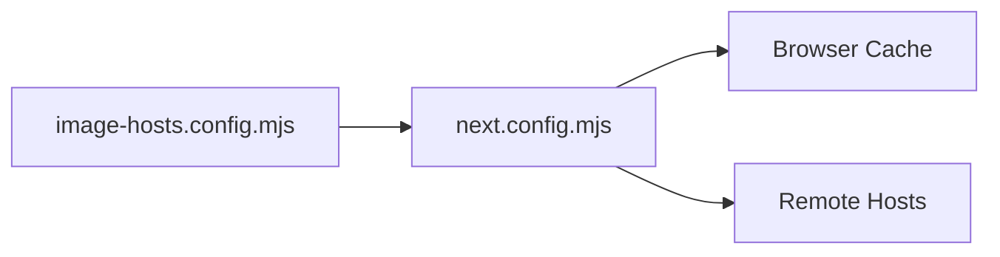

**Diagram sources**
- [image-hosts.config.mjs:5-26](file://image-hosts.config.mjs#L5-L26)
- [next.config.mjs:11-14](file://next.config.mjs#L11-L14)
- [next.config.mjs:17-45](file://next.config.mjs#L17-L45)

**Section sources**
- [next.config.mjs:11-14](file://next.config.mjs#L11-L14)
- [next.config.mjs:17-45](file://next.config.mjs#L17-L45)
- [image-hosts.config.mjs:5-26](file://image-hosts.config.mjs#L5-L26)

### Cleanup Policies and Trash Management
- Soft deletes mark entities as deleted and create trash entries with expiration
- Purge routine permanently removes expired items and cleans up references

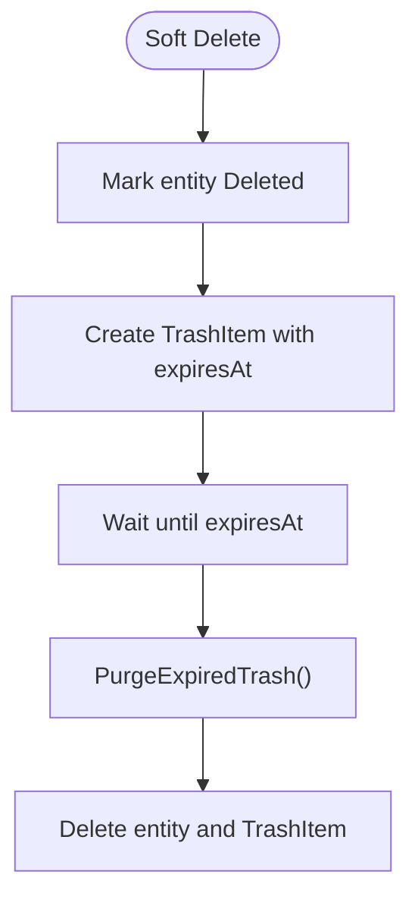

**Diagram sources**
- [src/lib/trash.ts:5-86](file://src/lib/trash.ts#L5-L86)
- [src/lib/trash.ts:88-118](file://src/lib/trash.ts#L88-L118)

**Section sources**
- [src/lib/trash.ts:5-86](file://src/lib/trash.ts#L5-L86)
- [src/lib/trash.ts:88-118](file://src/lib/trash.ts#L88-L118)

### Document Scanning and DPI Settings
- The scanner UI exposes DPI options that influence output size and quality when capturing or processing documents
- Lower DPI reduces file size at the cost of detail; higher DPI increases fidelity and size

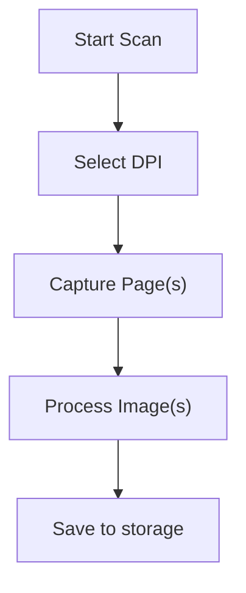

**Diagram sources**
- [src/app/documents/components/DocumentScanner.tsx:362-380](file://src/app/documents/components/DocumentScanner.tsx#L362-L380)
- [src/app/files/components/FileManager.tsx:39-46](file://src/app/files/components/FileManager.tsx#L39-L46)

**Section sources**
- [src/app/documents/components/DocumentScanner.tsx:362-380](file://src/app/documents/components/DocumentScanner.tsx#L362-L380)
- [src/app/files/components/FileManager.tsx:39-46](file://src/app/files/components/FileManager.tsx#L39-L46)

## Dependency Analysis
- Upload flow depends on authentication, MIME validation, filesystem writes, and database inserts
- Backup/restore depend on database queries, optional encryption, and strict validation
- Image serving depends on Next.js configuration and remote host allowlists
- Trash management depends on database operations and scheduled purging

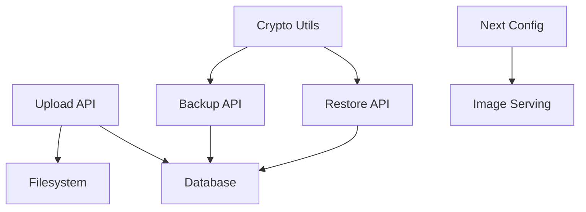

**Diagram sources**
- [src/app/api/files/upload/route.ts:86-191](file://src/app/api/files/upload/route.ts#L86-L191)
- [src/app/api/backup/route.ts:6-202](file://src/app/api/backup/route.ts#L6-L202)
- [src/app/api/restore/route.ts:1-129](file://src/app/api/restore/route.ts#L1-L129)
- [src/lib/crypto.ts:1-45](file://src/lib/crypto.ts#L1-L45)
- [next.config.mjs:11-14](file://next.config.mjs#L11-L14)

**Section sources**
- [src/app/api/files/upload/route.ts:86-191](file://src/app/api/files/upload/route.ts#L86-L191)
- [src/app/api/backup/route.ts:6-202](file://src/app/api/backup/route.ts#L6-L202)
- [src/app/api/restore/route.ts:1-129](file://src/app/api/restore/route.ts#L1-L129)
- [src/lib/crypto.ts:1-45](file://src/lib/crypto.ts#L1-L45)
- [next.config.mjs:11-14](file://next.config.mjs#L11-L14)

## Performance Considerations
- File uploads: Enforce strict MIME and size limits to prevent oversized payloads and malicious types
- Disk I/O: Use atomic writes and conflict resolution to avoid partial or overwritten files
- Database indexing: Ensure indexes on frequently queried fields (e.g., folderId, userId) to speed up listings
- Image caching: Configure remotePatterns and minimumCacheTTL to reduce bandwidth and improve load times
- DPI selection: Choose appropriate DPI for scanned documents to balance quality and storage usage
- Backup size: Enforce maximum backup payload size to protect server memory and response time

[No sources needed since this section provides general guidance]

## Troubleshooting Guide
- Upload errors:
  - Unauthorized: Check session token and cookie handling
  - Missing folderId: Ensure query parameter is provided
  - File too large: Adjust client-side checks and server limits if necessary
  - File type not allowed: Update allowed MIME types only if justified
- Backup/restore:
  - Invalid backup format: Ensure version, timestamp, and data fields are present
  - Unknown table: Only allowed tables can be exported/restored
  - Payload too large: Reduce selected tables or compress data before upload
- Trash:
  - Items not purged: Verify purge job runs and expiration dates are set correctly

**Section sources**
- [src/app/api/files/upload/route.ts:86-191](file://src/app/api/files/upload/route.ts#L86-L191)
- [src/app/api/restore/route.ts:1-129](file://src/app/api/restore/route.ts#L1-L129)
- [src/lib/trash.ts:88-118](file://src/lib/trash.ts#L88-L118)

## Conclusion
The application implements a robust local file storage backend with strong validation, secure backups with optional encryption, and efficient image caching. Cleanup policies via soft delete and trash purging help manage long-term storage growth. For scaling beyond local storage, consider migrating uploads to object storage (e.g., S3), enabling CDN distribution, and implementing background jobs for backups and cleanup.

[No sources needed since this section summarizes without analyzing specific files]

## Appendices

### Storage Backend Configuration
- Local filesystem: Files are stored under public/uploads with safe naming and conflict resolution
- Cloud storage providers: Not currently implemented; recommended approach is to abstract the write path behind a storage adapter and configure provider credentials via environment variables

[No sources needed since this section provides general guidance]

### Compression Guidelines
- Images: Prefer modern formats (WebP/AVIF) where supported; use appropriate DPI for scans to control size
- Documents: Store originals and generate compressed previews if needed
- Media: Stream large media and consider chunked uploads for better resilience

[No sources needed since this section provides general guidance]

### Quotas, Cleanup, and Backups
- Quotas: Implement per-user or per-folder quotas by summing file sizes from the database and enforcing limits at upload time
- Cleanup: Use trash purging to reclaim space after retention periods
- Backups: Schedule periodic exports with selective tables and optional encryption; store offsite

**Section sources**
- [src/lib/trash.ts:88-118](file://src/lib/trash.ts#L88-L118)
- [src/app/api/backup/route.ts:6-202](file://src/app/api/backup/route.ts#L6-L202)

### Caching and CDN
- Configure remotePatterns for image hosts and set minimumCacheTTL to optimize delivery
- Use CDN providers to cache static assets and images globally

**Section sources**
- [next.config.mjs:11-14](file://next.config.mjs#L11-L14)
- [image-hosts.config.mjs:5-26](file://image-hosts.config.mjs#L5-L26)

### Monitoring and Capacity Planning
- Track usage patterns by aggregating file sizes per user/folder
- Identify large files and adjust DPI or compression strategies
- Monitor backup sizes and restore times to plan capacity

[No sources needed since this section provides general guidance]

### Scalability and Disaster Recovery
- Scale horizontally by moving files to distributed object storage and using CDN
- Implement load balancing across storage nodes if self-hosting
- Disaster recovery: Maintain regular encrypted backups and test restore procedures

[No sources needed since this section provides general guidance]