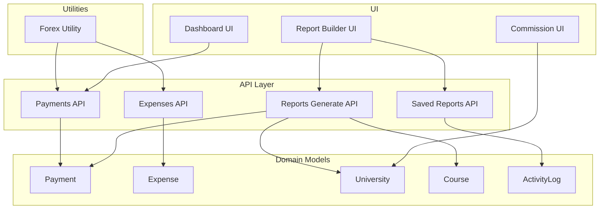
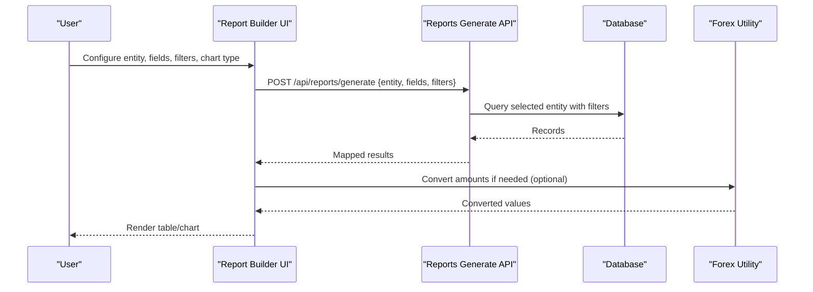
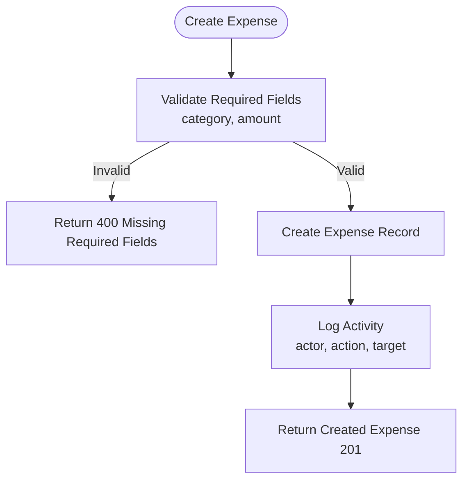
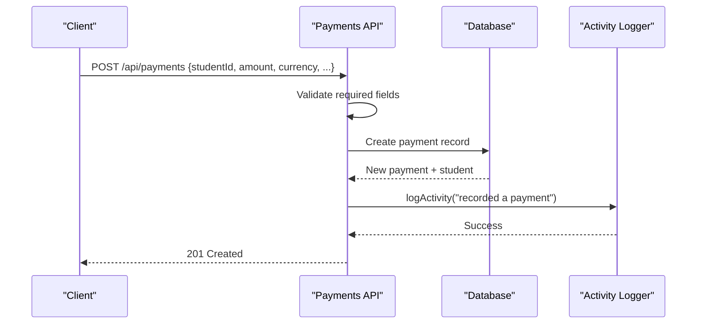
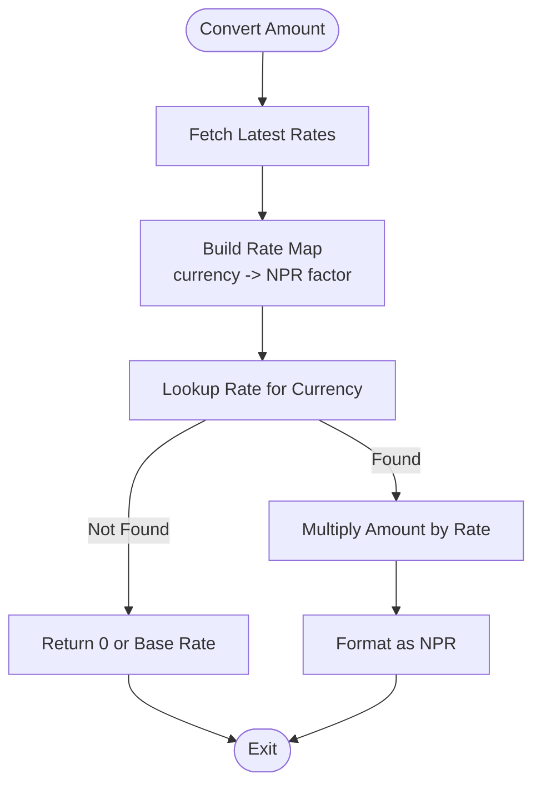
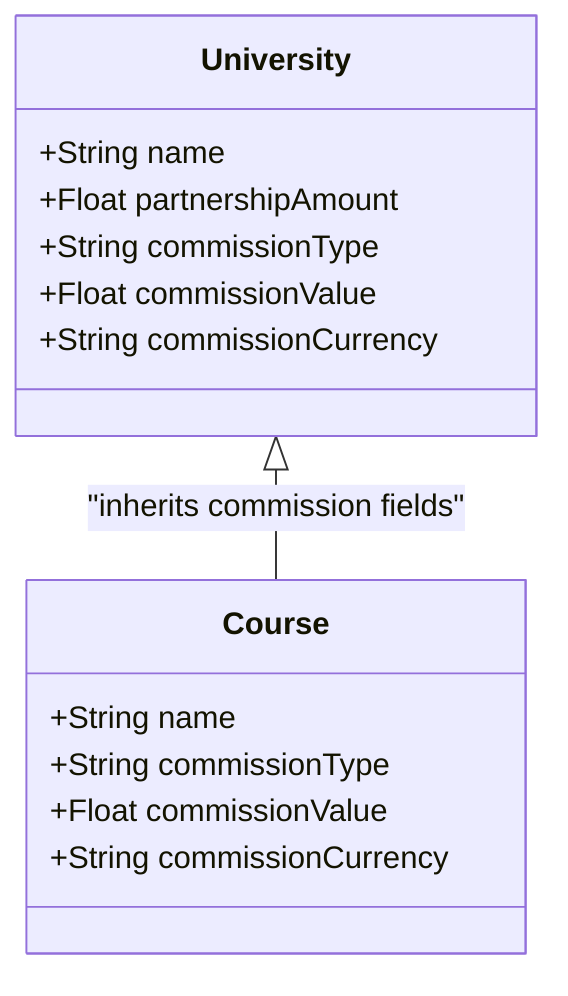
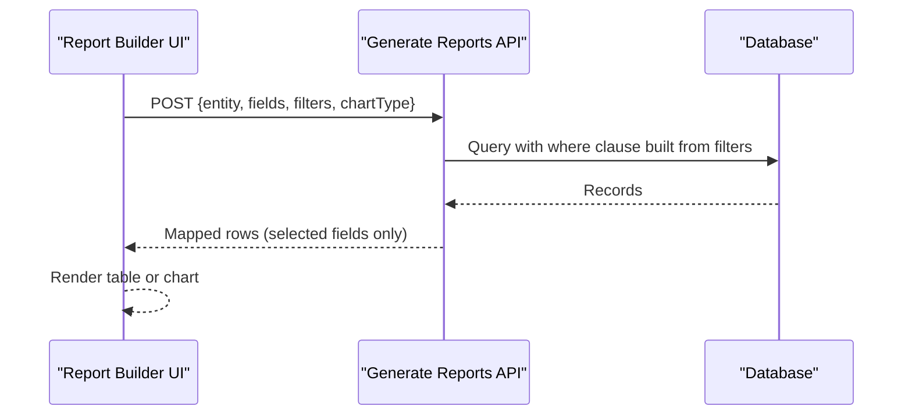
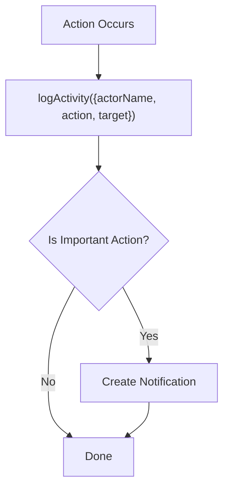
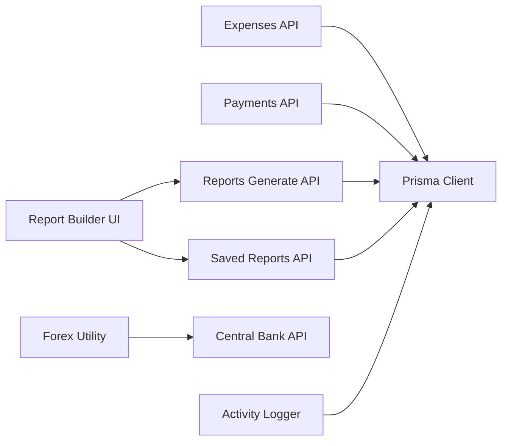

# Financial Management

<cite>
**Referenced Files in This Document**
- [route.ts](file://src/app/api/expenses/route.ts)
- [route.ts](file://src/app/api/payments/route.ts)
- [forex.ts](file://src/lib/forex.ts)
- [ReportBuilderContent.tsx](file://src/app/reports/builder/ReportBuilderContent.tsx)
- [route.ts](file://src/app/api/reports/generate/route.ts)
- [route.ts](file://src/app/api/reports/saved/route.ts)
- [schema.prisma](file://prisma/schema.prisma)
- [activity.ts](file://src/lib/activity.ts)
- [DashboardContent.tsx](file://src/app/dashboard/components/DashboardContent.tsx)
- [CommissionContent.tsx](file://src/app/commission/components/CommissionContent.tsx)
- [page.tsx](file://src/app/commission/page.tsx)
</cite>

## Table of Contents
1. [Introduction](#introduction)
2. [Project Structure](#project-structure)
3. [Core Components](#core-components)
4. [Architecture Overview](#architecture-overview)
5. [Detailed Component Analysis](#detailed-component-analysis)
6. [Dependency Analysis](#dependency-analysis)
7. [Performance Considerations](#performance-considerations)
8. [Troubleshooting Guide](#troubleshooting-guide)
9. [Conclusion](#conclusion)
10. [Appendices](#appendices)

## Introduction
This document explains the Financial Management capabilities implemented in the system, focusing on:
- Expense management with categorization and audit logging
- Payment processing engine with multi-currency support and exchange rate conversion
- Commission calculation for university partnerships and revenue tracking
- Reporting builder for customizable dashboards and analytical insights
- Audit trail maintenance via activity logging
- Guidelines for configuring financial workflows, reporting templates, and currency exchanges
- Troubleshooting guidance for payment processing errors and report generation issues

The goal is to provide both a high-level understanding and code-mapped details so users can operate, configure, and extend these features effectively.

## Project Structure
Financial-related functionality spans API routes, utilities, database schema, and UI components:
- Expenses API route handles listing and creating expenses with category, amount, currency, date, description, paid-to, method, bill/transaction numbers, and optional screenshot attachment
- Payments API route supports paginated queries, filtering by student, status, and method; creation includes amount, currency, status, method, date, description, and proof URL
- Forex utility provides exchange rates from an external source and conversion helpers to NPR
- Report Builder UI allows selecting entities (including Payment), fields, filters, and chart types; it generates data via a server endpoint and supports saving configurations
- Database schema defines core financial models: Payment, Expense, University/Course commission fields, and ActivityLog for audit trails
- Dashboard integrates widgets and KPIs that can be customized and persisted

**Diagram sources**
- [route.ts:1-74](file://src/app/api/expenses/route.ts#L1-L74)
- [route.ts:1-97](file://src/app/api/payments/route.ts#L1-L97)
- [forex.ts:1-78](file://src/lib/forex.ts#L1-L78)
- [ReportBuilderContent.tsx:1-548](file://src/app/reports/builder/ReportBuilderContent.tsx#L1-L548)
- [route.ts:1-99](file://src/app/api/reports/generate/route.ts#L1-L99)
- [route.ts:1-80](file://src/app/api/reports/saved/route.ts#L1-L80)
- [schema.prisma:488-520](file://prisma/schema.prisma#L488-L520)
- [schema.prisma:19-50](file://prisma/schema.prisma#L19-L50)
- [schema.prisma:67-119](file://prisma/schema.prisma#L67-L119)
- [schema.prisma:310-322](file://prisma/schema.prisma#L310-L322)

**Section sources**
- [route.ts:1-74](file://src/app/api/expenses/route.ts#L1-L74)
- [route.ts:1-97](file://src/app/api/payments/route.ts#L1-L97)
- [forex.ts:1-78](file://src/lib/forex.ts#L1-L78)
- [ReportBuilderContent.tsx:1-548](file://src/app/reports/builder/ReportBuilderContent.tsx#L1-L548)
- [route.ts:1-99](file://src/app/api/reports/generate/route.ts#L1-L99)
- [route.ts:1-80](file://src/app/api/reports/saved/route.ts#L1-L80)
- [schema.prisma:488-520](file://prisma/schema.prisma#L488-L520)
- [schema.prisma:19-50](file://prisma/schema.prisma#L19-L50)
- [schema.prisma:67-119](file://prisma/schema.prisma#L67-L119)
- [schema.prisma:310-322](file://prisma/schema.prisma#L310-L322)

## Core Components
- Expense Management: Create and list expenses with categories, amounts, currencies, dates, descriptions, payees, methods, and optional attachments; logs activity for auditability
- Payment Processing: Record payments per student with amount, currency, status, method, date, description, and proof URL; supports pagination and filtering; logs activity
- Exchange Rate Management: Fetches latest rates from an external source and converts amounts to NPR using sell rates; formats NPR values
- Commission Calculation: Stores commission type (percentage or flat), value, and currency at university and course levels; UI supports editing and viewing
- Reporting Builder: Select entity (e.g., Payment), choose fields, apply filters, generate tabular or chart views, and save configurations for reuse
- Audit Trail: Activity logging captures actor, action, target, and details; notifications are created for key actions

**Section sources**
- [route.ts:1-74](file://src/app/api/expenses/route.ts#L1-L74)
- [route.ts:1-97](file://src/app/api/payments/route.ts#L1-L97)
- [forex.ts:1-78](file://src/lib/forex.ts#L1-L78)
- [schema.prisma:488-520](file://prisma/schema.prisma#L488-L520)
- [schema.prisma:19-50](file://prisma/schema.prisma#L19-L50)
- [schema.prisma:67-119](file://prisma/schema.prisma#L67-L119)
- [activity.ts:60-114](file://src/lib/activity.ts#L60-L114)
- [ReportBuilderContent.tsx:1-548](file://src/app/reports/builder/ReportBuilderContent.tsx#L1-L548)

## Architecture Overview
The financial subsystem follows a layered architecture:
- UI layer: Pages and components for expense entry, payment recording, commission configuration, and report building
- API layer: Next.js route handlers for CRUD operations, filtering, pagination, and report generation
- Data layer: Prisma client interacting with the database schema
- Utilities: Forex conversion and activity logging
- External integrations: Central bank forex rates API

**Diagram sources**
- [ReportBuilderContent.tsx:112-134](file://src/app/reports/builder/ReportBuilderContent.tsx#L112-L134)
- [route.ts:7-99](file://src/app/api/reports/generate/route.ts#L7-L99)
- [forex.ts:27-66](file://src/lib/forex.ts#L27-L66)

## Detailed Component Analysis

### Expense Management
- Capabilities:
  - List all expenses ordered by date descending
  - Create new expenses with required category and amount; optional fields include currency, date, description, paidTo, method, billNo, transactionNo, screenshot
  - Role-based access control for creation (Admin/Super Admin/Staff)
  - Activity logging records who recorded which expense and its summary
- Data model:
  - Expense model stores category, amount, currency, date, description, paidTo, method, billNo, transactionNo, screenshot
- Example workflow:
  - User submits expense form → API validates required fields → creates record → logs activity → returns created expense

**Diagram sources**
- [route.ts:20-73](file://src/app/api/expenses/route.ts#L20-L73)
- [schema.prisma:506-520](file://prisma/schema.prisma#L506-L520)
- [activity.ts:60-114](file://src/lib/activity.ts#L60-L114)

**Section sources**
- [route.ts:1-74](file://src/app/api/expenses/route.ts#L1-L74)
- [schema.prisma:506-520](file://prisma/schema.prisma#L506-L520)
- [activity.ts:60-114](file://src/lib/activity.ts#L60-L114)

### Payment Processing Engine
- Capabilities:
  - Paginated listing with filters by studentId, status, method, and search across student name/email
  - Creation of payments with amount, currency, status, method, date, description, proofUrl
  - Activity logging upon successful creation
- Multi-currency support:
  - Currency field stored per payment; default is NPR
  - Forex utility provides conversion to NPR using latest sell rates
- Example workflow:
  - User submits payment → API validates required fields → creates payment → logs activity → returns created payment with student info

**Diagram sources**
- [route.ts:55-97](file://src/app/api/payments/route.ts#L55-L97)
- [schema.prisma:488-504](file://prisma/schema.prisma#L488-L504)
- [activity.ts:60-114](file://src/lib/activity.ts#L60-L114)

**Section sources**
- [route.ts:1-97](file://src/app/api/payments/route.ts#L1-L97)
- [schema.prisma:488-504](file://prisma/schema.prisma#L488-L504)
- [forex.ts:27-66](file://src/lib/forex.ts#L27-L66)

### Exchange Rate Management
- Capabilities:
  - Fetches latest exchange rates from an external central bank API for the current day
  - Builds a map of currency codes to NPR conversion factors using sell rates
  - Provides conversion function to convert any amount to NPR given a rate map
  - Formats amounts in NPR using locale-aware formatting
- Usage patterns:
  - Use getLatestRates() to retrieve up-to-date rates
  - Use convertToNPR(amount, currency, rates) to normalize amounts
  - Use formatNPR(value) to display formatted currency strings

**Diagram sources**
- [forex.ts:27-66](file://src/lib/forex.ts#L27-L66)
- [forex.ts:68-78](file://src/lib/forex.ts#L68-L78)

**Section sources**
- [forex.ts:1-78](file://src/lib/forex.ts#L1-L78)

### Commission Calculation System
- Capabilities:
  - University-level and course-level commission configuration
  - Supports percentage or flat commission types
  - Stores commission value and currency per entity
  - UI enables adding/editing commissions and viewing them in a structured list
- Revenue tracking:
  - Commission values can be used to calculate partner payouts based on enrollment or tuition fees
  - Currency flexibility allows multi-currency commission structures

**Diagram sources**
- [schema.prisma:19-50](file://prisma/schema.prisma#L19-L50)
- [schema.prisma:67-119](file://prisma/schema.prisma#L67-L119)
- [CommissionContent.tsx:52-93](file://src/app/commission/components/CommissionContent.tsx#L52-L93)

**Section sources**
- [schema.prisma:19-50](file://prisma/schema.prisma#L19-L50)
- [schema.prisma:67-119](file://prisma/schema.prisma#L67-L119)
- [CommissionContent.tsx:52-93](file://src/app/commission/components/CommissionContent.tsx#L52-L93)
- [page.tsx:1-17](file://src/app/commission/page.tsx#L1-L17)

### Reporting Builder
- Capabilities:
  - Entity selection including Student, University, Course, Lead, Payment, Application
  - Field selection per entity; dynamic filter builder with operators (contains, equals, gt, lt, startsWith)
  - Chart types: Table, Bar, Pie, Line; auto-detection of numeric fields for charts
  - Save/load/delete saved reports with metadata and configuration
  - Server-side generation maps requested fields and applies filters
- Export and analytics:
  - Tabular output can be exported externally (CSV/PDF) depending on UI integration
  - Charts provide visual insights into selected datasets

**Diagram sources**
- [ReportBuilderContent.tsx:112-134](file://src/app/reports/builder/ReportBuilderContent.tsx#L112-L134)
- [route.ts:7-99](file://src/app/api/reports/generate/route.ts#L7-L99)

**Section sources**
- [ReportBuilderContent.tsx:1-548](file://src/app/reports/builder/ReportBuilderContent.tsx#L1-L548)
- [route.ts:1-99](file://src/app/api/reports/generate/route.ts#L1-L99)
- [route.ts:1-80](file://src/app/api/reports/saved/route.ts#L1-L80)

### Audit Trail Maintenance
- Capabilities:
  - Activity logging captures actor name, action, target, and optional details
  - Automatically creates notifications for important actions like create, invite, delete
  - Supports change diffing and serialization for detailed audit entries
- Integration points:
  - Used by expense and payment creation flows to maintain compliance and traceability

**Diagram sources**
- [activity.ts:60-114](file://src/lib/activity.ts#L60-L114)

**Section sources**
- [activity.ts:1-114](file://src/lib/activity.ts#L1-L114)

## Dependency Analysis
Key dependencies and relationships:
- API routes depend on Prisma client for data access and session utilities for authentication
- Forex utility depends on external central bank API; provides conversion functions used by financial flows
- Report generator depends on entity-specific Prisma queries and mapping logic
- Activity logger depends on database and notification service
- UI components depend on API endpoints and local state for user interactions

**Diagram sources**
- [route.ts:1-74](file://src/app/api/expenses/route.ts#L1-L74)
- [route.ts:1-97](file://src/app/api/payments/route.ts#L1-L97)
- [route.ts:1-99](file://src/app/api/reports/generate/route.ts#L1-L99)
- [route.ts:1-80](file://src/app/api/reports/saved/route.ts#L1-L80)
- [forex.ts:27-52](file://src/lib/forex.ts#L27-L52)
- [activity.ts:60-114](file://src/lib/activity.ts#L60-L114)

**Section sources**
- [route.ts:1-74](file://src/app/api/expenses/route.ts#L1-L74)
- [route.ts:1-97](file://src/app/api/payments/route.ts#L1-L97)
- [route.ts:1-99](file://src/app/api/reports/generate/route.ts#L1-L99)
- [route.ts:1-80](file://src/app/api/reports/saved/route.ts#L1-L80)
- [forex.ts:27-52](file://src/lib/forex.ts#L27-L52)
- [activity.ts:60-114](file://src/lib/activity.ts#L60-L114)

## Performance Considerations
- Pagination and filtering:
  - Payments API uses skip/take for pagination; ensure appropriate indexes on frequently filtered fields (e.g., studentId, status)
- Report generation:
  - Limit result sets (e.g., take 500) to avoid large payloads; consider server-side aggregation for heavy analytics
- Exchange rate fetching:
  - Cache rates locally to reduce external API calls; handle failures gracefully with fallback base rates
- Activity logging:
  - Batch or throttle logs if high volume; ensure non-blocking writes to avoid impacting user experience

[No sources needed since this section provides general guidance]

## Troubleshooting Guide
Common issues and resolutions:
- Payment processing errors:
  - Missing required fields: Ensure studentId and amount are provided; validate input before submission
  - Unauthorized: Verify session and roles; ensure user has permission to create payments
  - Database errors: Check connection and schema alignment; review error logs
- Report generation issues:
  - Invalid entity or missing fields: Confirm entity exists and fields are selected; check filter syntax
  - Network errors: Validate API availability and CORS settings; retry with backoff
  - Large datasets: Reduce filters or limit fields; implement server-side pagination for exports
- Exchange rate problems:
  - External API failure: Use fallback base rates; log errors and notify administrators
  - Incorrect conversions: Verify currency codes and rate map keys; ensure sell rates are used consistently

**Section sources**
- [route.ts:55-97](file://src/app/api/payments/route.ts#L55-L97)
- [route.ts:7-99](file://src/app/api/reports/generate/route.ts#L7-L99)
- [forex.ts:27-52](file://src/lib/forex.ts#L27-L52)

## Conclusion
The Financial Management system provides robust expense tracking, payment processing with multi-currency support, commission configuration for partnerships, and a flexible reporting builder. Audit trails ensure compliance and traceability. With clear APIs, well-defined data models, and extensible utilities, teams can configure workflows, build custom reports, and integrate with accounting systems as needed.

[No sources needed since this section summarizes without analyzing specific files]

## Appendices

### Configuration Guidelines
- Financial workflows:
  - Define expense categories and standardize naming for consistent reporting
  - Set payment statuses and methods aligned with organizational policies
  - Configure commission types and currencies per university/course to match partnership agreements
- Reporting templates:
  - Save frequently used report configurations via the saved reports feature
  - Use filters to isolate relevant datasets (e.g., date ranges, statuses)
  - Choose appropriate chart types for quick insights; export tables for deeper analysis
- Currency exchanges:
  - Use forex utility to fetch and cache daily rates
  - Normalize all financial amounts to NPR for consistent reporting
  - Display localized currency formats using provided formatter

[No sources needed since this section provides general guidance]