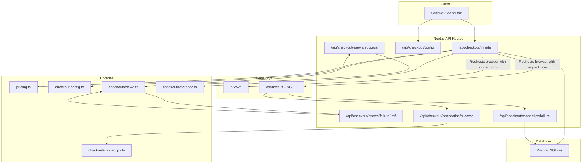
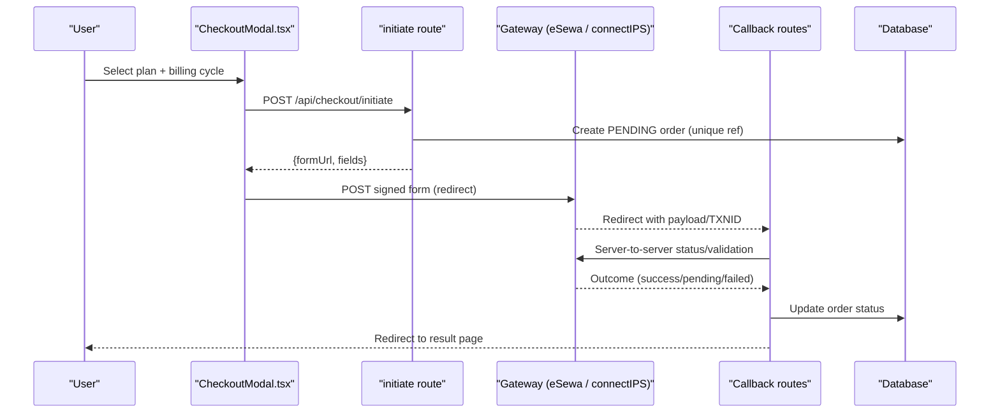
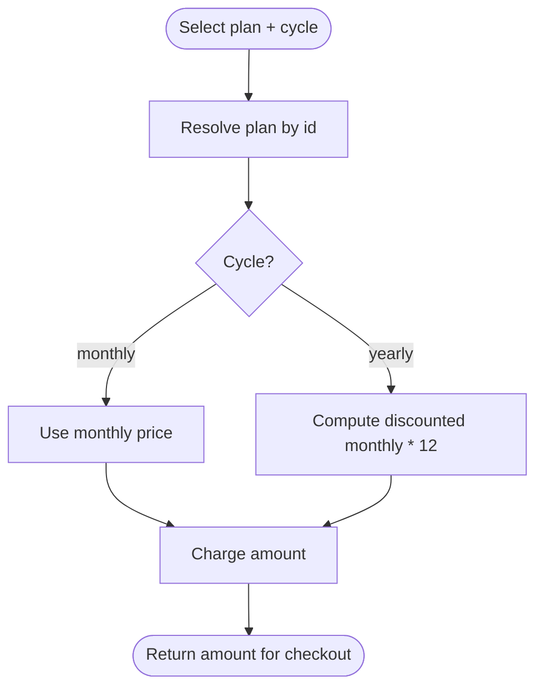
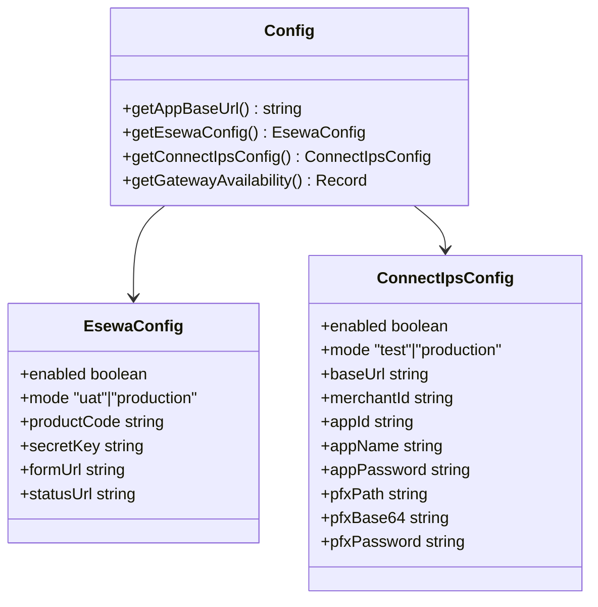
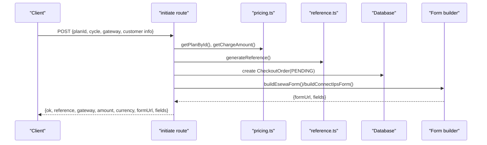
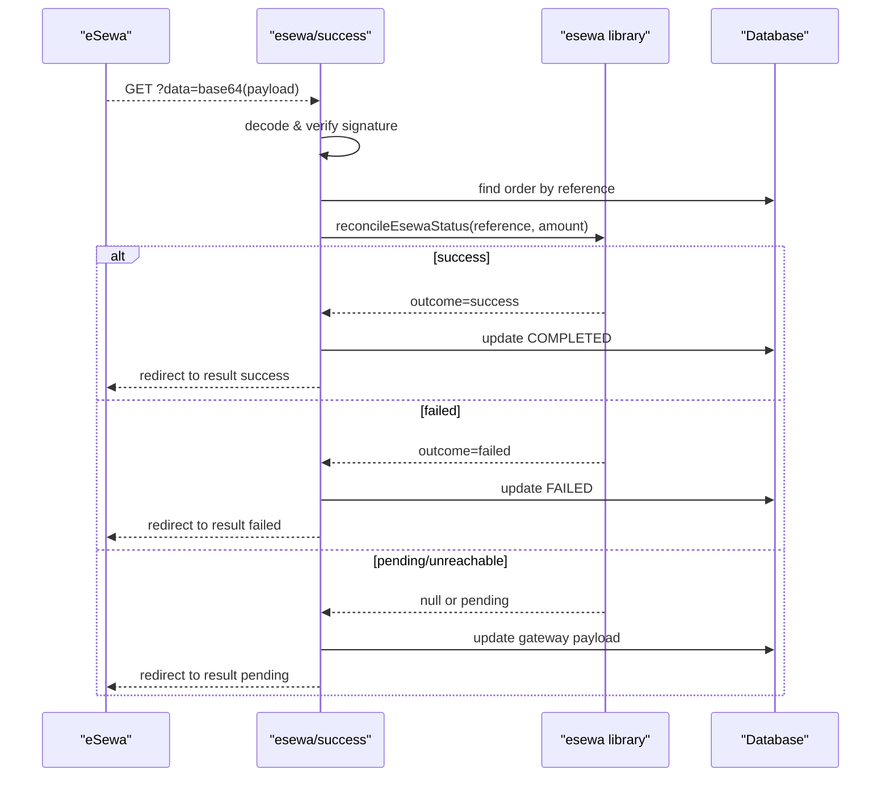
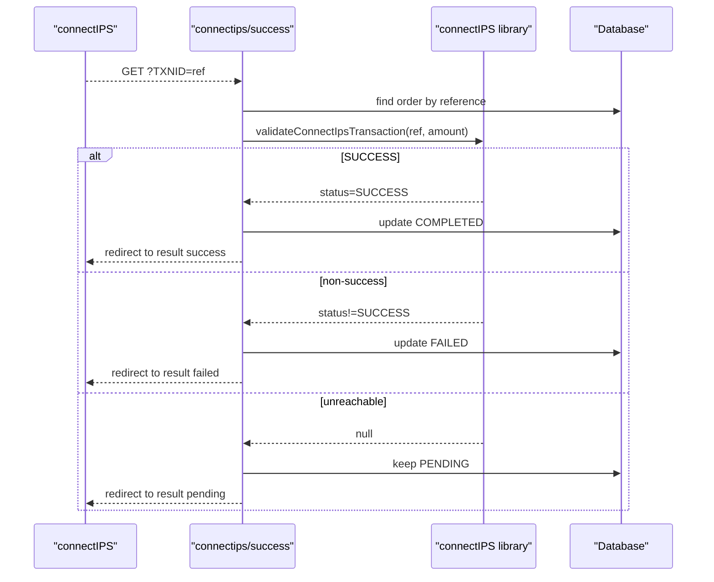
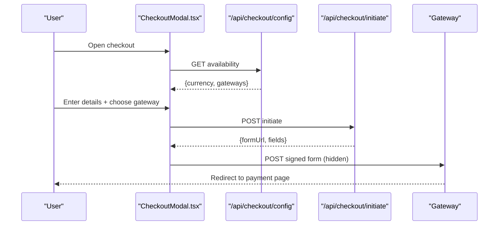
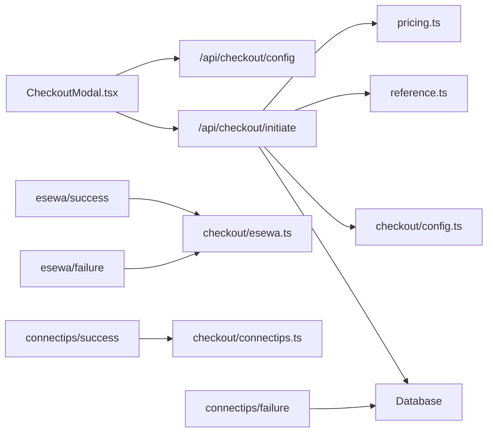

# Subscription Payment System

<cite>
**Referenced Files in This Document**
- [route.ts](file://src/app/api/checkout/initiate/route.ts)
- [route.ts](file://src/app/api/checkout/config/route.ts)
- [route.ts](file://src/app/api/checkout/esewa/success/route.ts)
- [route.ts](file://src/app/api/checkout/esewa/failure/[[...reference]]/route.ts)
- [route.ts](file://src/app/api/checkout/connectips/success/route.ts)
- [route.ts](file://src/app/api/checkout/connectips/failure/route.ts)
- [pricing.ts](file://src/lib/pricing.ts)
- [config.ts](file://src/lib/checkout/config.ts)
- [esewa.ts](file://src/lib/checkout/esewa.ts)
- [connectips.ts](file://src/lib/checkout/connectips.ts)
- [reference.ts](file://src/lib/checkout/reference.ts)
- [CheckoutModal.tsx](file://src/components/CheckoutModal.tsx)
- [schema.prisma](file://prisma/schema.prisma)
</cite>

## Table of Contents
1. Introduction
2. Project Structure
3. Core Components
4. Architecture Overview
5. Detailed Component Analysis
6. Dependency Analysis
7. Performance Considerations
8. Troubleshooting Guide
9. Conclusion

## Introduction
This document describes the subscription payment system that enables customers to purchase plans via eSewa and connectIPS. It covers the end-to-end flow from plan selection, order creation, gateway redirection, server-side reconciliation, and final status resolution. The system is built on Next.js API routes, a Prisma-backed database, and reusable checkout libraries for each gateway.

## Project Structure
The payment feature spans public API routes under src/app/api/checkout, configuration and helpers under src/lib/checkout, pricing definitions under src/lib/pricing, and the client-side checkout modal under src/components.

**Diagram sources**
- [CheckoutModal.tsx:149-209](file://src/components/CheckoutModal.tsx#L149-L209)
- [route.ts:64-152](file://src/app/api/checkout/initiate/route.ts#L64-L152)
- [route.ts:8-13](file://src/app/api/checkout/config/route.ts#L8-L13)
- [route.ts:25-103](file://src/app/api/checkout/esewa/success/route.ts#L25-L103)
- [route.ts:23-94](file://src/app/api/checkout/esewa/failure/[[...reference]]/route.ts#L23-L94)
- [route.ts:16-71](file://src/app/api/checkout/connectips/success/route.ts#L16-L71)
- [route.ts:9-28](file://src/app/api/checkout/connectips/failure/route.ts#L9-L28)
- [pricing.ts:22-101](file://src/lib/pricing.ts#L22-L101)
- [config.ts:27-92](file://src/lib/checkout/config.ts#L27-L92)
- [esewa.ts:23-145](file://src/lib/checkout/esewa.ts#L23-L145)
- [connectips.ts:55-140](file://src/lib/checkout/connectips.ts#L55-L140)
- [reference.ts:11-21](file://src/lib/checkout/reference.ts#L11-L21)

**Section sources**
- [CheckoutModal.tsx:149-209](file://src/components/CheckoutModal.tsx#L149-L209)
- [route.ts:64-152](file://src/app/api/checkout/initiate/route.ts#L64-L152)
- [route.ts:8-13](file://src/app/api/checkout/config/route.ts#L8-L13)

## Core Components
- Pricing and billing cycle logic: defines plans, currency, and charge calculation for monthly/yearly cycles.
- Gateway configuration: runtime toggles and endpoints for eSewa and connectIPS based on environment variables.
- Checkout initiation: validates request, creates a PENDING order, builds a signed gateway form, and returns it to the client.
- Gateway callbacks: handle success/failure redirects, reconcile with gateways’ server-to-server APIs, and update order status.
- Client UI: collects customer details, selects a gateway, and submits a hidden signed form to redirect to the gateway.

**Section sources**
- [pricing.ts:1-106](file://src/lib/pricing.ts#L1-L106)
- [config.ts:1-93](file://src/lib/checkout/config.ts#L1-L93)
- [route.ts:64-152](file://src/app/api/checkout/initiate/route.ts#L64-L152)
- [route.ts:25-103](file://src/app/api/checkout/esewa/success/route.ts#L25-L103)
- [route.ts:23-94](file://src/app/api/checkout/esewa/failure/[[...reference]]/route.ts#L23-L94)
- [route.ts:16-71](file://src/app/api/checkout/connectips/success/route.ts#L16-L71)
- [route.ts:9-28](file://src/app/api/checkout/connectips/failure/route.ts#L9-L28)
- [CheckoutModal.tsx:111-209](file://src/components/CheckoutModal.tsx#L111-L209)

## Architecture Overview
The system follows a secure, idempotent flow:
- Client requests available gateways and initiates checkout.
- Server validates inputs, creates a unique reference, persists a PENDING order, and returns a signed form for the selected gateway.
- Browser POSTs the signed form to the gateway.
- Gateway redirects back to server callback endpoints.
- Server reconciles with gateway APIs before marking orders COMPLETED or FAILED; ambiguous cases remain PENDING for later reconciliation.

**Diagram sources**
- [CheckoutModal.tsx:149-209](file://src/components/CheckoutModal.tsx#L149-L209)
- [route.ts:64-152](file://src/app/api/checkout/initiate/route.ts#L64-L152)
- [route.ts:25-103](file://src/app/api/checkout/esewa/success/route.ts#L25-L103)
- [route.ts:23-94](file://src/app/api/checkout/esewa/failure/[[...reference]]/route.ts#L23-L94)
- [route.ts:16-71](file://src/app/api/checkout/connectips/success/route.ts#L16-L71)
- [route.ts:9-28](file://src/app/api/checkout/connectips/failure/route.ts#L9-L28)

## Detailed Component Analysis

### Pricing and Billing
- Plans are defined with monthly amounts and features. Yearly billing applies a discount and charges twelve discounted months upfront. Currency is NPR.
- Charge amount is computed per billing cycle and used when creating orders and building gateway forms.

**Diagram sources**
- [pricing.ts:22-101](file://src/lib/pricing.ts#L22-L101)

**Section sources**
- [pricing.ts:1-106](file://src/lib/pricing.ts#L1-L106)

### Gateway Configuration
- Gateways are enabled only when required credentials exist. Environment variables control mode (production vs test/UAT), endpoints, and secrets.
- A public config endpoint exposes which gateways are available and the currency.

**Diagram sources**
- [config.ts:12-92](file://src/lib/checkout/config.ts#L12-L92)

**Section sources**
- [config.ts:1-93](file://src/lib/checkout/config.ts#L1-L93)
- [route.ts:8-13](file://src/app/api/checkout/config/route.ts#L8-L13)

### Checkout Initiation
- Validates CSRF, rate limits, and input shape.
- Resolves plan and computes charge amount.
- Creates a unique order reference and persists a PENDING order.
- Builds a signed form for the chosen gateway and returns it to the client.

**Diagram sources**
- [route.ts:64-152](file://src/app/api/checkout/initiate/route.ts#L64-L152)
- [pricing.ts:77-101](file://src/lib/pricing.ts#L77-L101)
- [reference.ts:11-21](file://src/lib/checkout/reference.ts#L11-L21)
- [esewa.ts:23-49](file://src/lib/checkout/esewa.ts#L23-L49)
- [connectips.ts:55-91](file://src/lib/checkout/connectips.ts#L55-L91)

**Section sources**
- [route.ts:64-152](file://src/app/api/checkout/initiate/route.ts#L64-L152)

### eSewa Callback Handling
- Success: decodes base64 payload, verifies signature, checks amount, reconciles via server-to-server status API, then marks COMPLETED or FAILED accordingly. Ambiguous results keep PENDING.
- Failure: resolves reference from path/query, reconciles, and updates status. If reconciliation is unreachable but payload indicates failure, mark FAILED; otherwise pending.

**Diagram sources**
- [route.ts:25-103](file://src/app/api/checkout/esewa/success/route.ts#L25-L103)
- [esewa.ts:52-145](file://src/lib/checkout/esewa.ts#L52-L145)

**Section sources**
- [route.ts:25-103](file://src/app/api/checkout/esewa/success/route.ts#L25-L103)
- [route.ts:23-94](file://src/app/api/checkout/esewa/failure/[[...reference]]/route.ts#L23-L94)
- [esewa.ts:52-145](file://src/lib/checkout/esewa.ts#L52-L145)

### connectIPS Callback Handling
- Success: reads TXNID, validates transaction via server-to-server API, updates COMPLETED or FAILED; if validation is unreachable, remains PENDING.
- Failure: marks order FAILED if not already completed.

**Diagram sources**
- [route.ts:16-71](file://src/app/api/checkout/connectips/success/route.ts#L16-L71)
- [connectips.ts:98-140](file://src/lib/checkout/connectips.ts#L98-L140)

**Section sources**
- [route.ts:16-71](file://src/app/api/checkout/connectips/success/route.ts#L16-L71)
- [route.ts:9-28](file://src/app/api/checkout/connectips/failure/route.ts#L9-L28)
- [connectips.ts:98-140](file://src/lib/checkout/connectips.ts#L98-L140)

### Client Checkout Modal
- Loads gateway availability and currency from the config endpoint.
- Collects billing contact details and selected gateway.
- Submits to initiate endpoint and auto-submits the returned signed form to the gateway.

**Diagram sources**
- [CheckoutModal.tsx:149-209](file://src/components/CheckoutModal.tsx#L149-L209)
- [route.ts:8-13](file://src/app/api/checkout/config/route.ts#L8-L13)
- [route.ts:64-152](file://src/app/api/checkout/initiate/route.ts#L64-L152)

**Section sources**
- [CheckoutModal.tsx:111-209](file://src/components/CheckoutModal.tsx#L111-L209)

## Dependency Analysis
- The initiate route depends on pricing, reference generation, gateway configuration, and database writes.
- Callback routes depend on their respective gateway libraries for signature verification, status mapping, and server-to-server reconciliation.
- The client depends on the config and initiate endpoints to render options and start payments.

**Diagram sources**
- [CheckoutModal.tsx:149-209](file://src/components/CheckoutModal.tsx#L149-L209)
- [route.ts:64-152](file://src/app/api/checkout/initiate/route.ts#L64-L152)
- [route.ts:25-103](file://src/app/api/checkout/esewa/success/route.ts#L25-L103)
- [route.ts:23-94](file://src/app/api/checkout/esewa/failure/[[...reference]]/route.ts#L23-L94)
- [route.ts:16-71](file://src/app/api/checkout/connectips/success/route.ts#L16-L71)
- [route.ts:9-28](file://src/app/api/checkout/connectips/failure/route.ts#L9-L28)
- [pricing.ts:77-101](file://src/lib/pricing.ts#L77-L101)
- [reference.ts:11-21](file://src/lib/checkout/reference.ts#L11-L21)
- [config.ts:27-92](file://src/lib/checkout/config.ts#L27-L92)
- [esewa.ts:52-145](file://src/lib/checkout/esewa.ts#L52-L145)
- [connectips.ts:98-140](file://src/lib/checkout/connectips.ts#L98-L140)

**Section sources**
- [route.ts:64-152](file://src/app/api/checkout/initiate/route.ts#L64-L152)
- [esewa.ts:52-145](file://src/lib/checkout/esewa.ts#L52-L145)
- [connectips.ts:98-140](file://src/lib/checkout/connectips.ts#L98-L140)

## Performance Considerations
- Rate limiting on initiation prevents abuse and protects downstream gateways.
- Unique reference allocation retries avoid collisions while keeping latency low.
- Gateway reconciliation calls are made only on callbacks; ambiguous states intentionally remain PENDING to avoid false negatives.
- All external gateway calls use no-store caching to ensure fresh responses.

[No sources needed since this section provides general guidance]

## Troubleshooting Guide
- Signature mismatch or invalid payload: Ensure secret keys and product codes are correctly configured and that the signed field names match expectations.
- Amount mismatch: Verify plan pricing and billing cycle calculations; compare against gateway payload and reconciliation totals.
- Unreachable gateway APIs: Orders may stay PENDING; implement background reconciliation jobs to settle them later.
- Duplicate references: The initiate route retries up to a limit; investigate database constraints and concurrency if failures persist.
- CSRF or rate limit errors: Confirm headers and throttle user actions during high-frequency attempts.

**Section sources**
- [route.ts:64-152](file://src/app/api/checkout/initiate/route.ts#L64-L152)
- [route.ts:25-103](file://src/app/api/checkout/esewa/success/route.ts#L25-L103)
- [route.ts:23-94](file://src/app/api/checkout/esewa/failure/[[...reference]]/route.ts#L23-L94)
- [route.ts:16-71](file://src/app/api/checkout/connectips/success/route.ts#L16-L71)
- [route.ts:9-28](file://src/app/api/checkout/connectips/failure/route.ts#L9-L28)

## Conclusion
The subscription payment system provides a robust, secure, and extensible checkout experience with two Nepali payment gateways. It emphasizes security through signed forms and signatures, reliability via server-to-server reconciliation, and resilience by preserving PENDING states when outcomes are ambiguous. Proper configuration of environment variables and monitoring of gateway health are essential for smooth operations.