# Frontend Architecture

<cite>
**Referenced Files in This Document**
- [layout.tsx](file://src/app/layout.tsx)
- [page.tsx](file://src/app/page.tsx)
- [MarketingHeader.tsx](file://src/components/MarketingHeader.tsx)
- [PricingSection.tsx](file://src/components/PricingSection.tsx)
- [DemoForm.tsx](file://src/components/DemoForm.tsx)
- [Sidebar.tsx](file://src/components/Sidebar.tsx)
- [AppLayout.tsx](file://src/components/AppLayout.tsx)
- [AppLayoutWrapper.tsx](file://src/components/AppLayoutWrapper.tsx)
- [Topbar.tsx](file://src/components/Topbar.tsx)
- [AppIcon.tsx](file://src/components/ui/AppIcon.tsx)
- [AppImage.tsx](file://src/components/ui/AppImage.tsx)
- [AppLogo.tsx](file://src/components/ui/AppLogo.tsx)
- [tailwind.config.js](file://tailwind.config.js)
- [next.config.mjs](file://next.config.mjs)
- [package.json](file://package.json)
- [theme.tsx](file://src/lib/theme.tsx)
- [tailwind.css](file://src/styles/tailwind.css)
</cite>

## Update Summary
**Changes Made**
- Added comprehensive documentation for the redesigned marketing landing page targeting educational consultancies
- Documented new B2B-focused components: MarketingHeader, PricingSection, and DemoForm
- Enhanced sidebar navigation documentation with 267+ additional features
- Updated component architecture to reflect the shift from individual student focus to consultancy platform
- Added detailed pricing and demo form integration patterns

## Table of Contents
1. Introduction
2. Project Structure
3. Core Components
4. Architecture Overview
5. Detailed Component Analysis
6. Dependency Analysis
7. Performance Considerations
8. Troubleshooting Guide
9. Conclusion
10. Appendices

## Introduction
This document describes UniTrack's frontend architecture with a focus on component structure and UI patterns built on Next.js App Router, Tailwind CSS theming, and a client-side theme system. The platform has been completely redesigned to target educational consultancies with a B2B focus, featuring a comprehensive marketing landing page, enhanced navigation system, and enterprise-grade components. It explains the root layout, application shell, reusable UI components, routing strategy, navigation patterns, and performance optimizations. It also provides guidelines for creating new components, implementing custom themes, integrating third-party libraries, and troubleshooting rendering and performance issues.

## Project Structure
UniTrack uses the Next.js App Router with a clear separation between:
- Root layout and global providers (theme, fonts, viewport, metadata)
- Marketing landing page with B2B-focused components under src/app
- Application shell (sidebar, topbar, content area)
- Feature pages organized by domain under src/app
- Reusable UI components under src/components and src/components/ui
- Global styles and Tailwind configuration under src/styles and tailwind.config.js

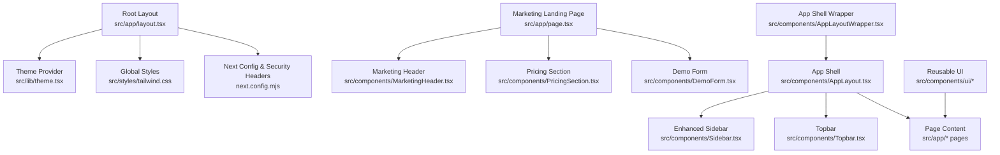

**Diagram sources**
- [layout.tsx:1-43](file://src/app/layout.tsx#L1-L43)
- [page.tsx:1-524](file://src/app/page.tsx#L1-L524)
- [MarketingHeader.tsx:1-112](file://src/components/MarketingHeader.tsx#L1-L112)
- [PricingSection.tsx:1-291](file://src/components/PricingSection.tsx#L1-L291)
- [DemoForm.tsx:1-73](file://src/components/DemoForm.tsx#L1-L73)
- [Sidebar.tsx:1-1122](file://src/components/Sidebar.tsx#L1-L1122)

**Section sources**
- [layout.tsx:1-43](file://src/app/layout.tsx#L1-L43)
- [tailwind.config.js:1-132](file://tailwind.config.js#L1-L132)
- [next.config.mjs:1-47](file://next.config.mjs#L1-L47)
- [package.json:1-119](file://package.json#L1-L119)

## Core Components
- Root layout: Sets viewport, metadata, loads Google Fonts, wraps app in ThemeProvider, and renders global scroll indicator.
- **Updated**: Marketing landing page: Complete B2B-focused design with hero section, feature showcase, university network display, pricing tiers, and demo scheduling.
- **New**: MarketingHeader: Fixed navigation header with mobile-responsive menu, smooth scrolling, and consultation booking CTAs.
- **New**: PricingSection: Three-tier pricing model (Starter, Growth, Enterprise) with monthly/yearly billing toggle and FAQ accordion.
- **New**: DemoForm: Consultancy-focused lead capture form with branch count, intake hub selection, and WhatsApp contact integration.
- Enhanced sidebar: Expanded navigation with 267+ additions including HR management, analytics, business tools, and platform features.
- App shell wrapper: Validates session, fetches current user, resolves role-based home route, and guards authenticated routes.
- App shell: Renders enhanced Sidebar, main content area with error boundary, guided tour, and toast notifications.
- Topbar: Breadcrumbs, role badge, settings menu, theme toggle, and notification panel with SSE updates.
- Reusable UI:
  - AppIcon: Dynamic icon renderer supporting outline/solid variants with accessibility-friendly props.
  - AppImage: Optimized image wrapper with fallbacks, blur placeholders, priority loading, and external URL handling.
  - **New**: AppLogo: Flexible logo component supporting both image and icon modes with memoization for performance.

**Section sources**
- [layout.tsx:1-43](file://src/app/layout.tsx#L1-L43)
- [page.tsx:1-524](file://src/app/page.tsx#L1-L524)
- [MarketingHeader.tsx:1-112](file://src/components/MarketingHeader.tsx#L1-L112)
- [PricingSection.tsx:1-291](file://src/components/PricingSection.tsx#L1-L291)
- [DemoForm.tsx:1-73](file://src/components/DemoForm.tsx#L1-L73)
- [Sidebar.tsx:1-1122](file://src/components/Sidebar.tsx#L1-L1122)
- [AppLayoutWrapper.tsx:1-121](file://src/components/AppLayoutWrapper.tsx#L1-L121)
- [AppLayout.tsx:1-45](file://src/components/AppLayout.tsx#L1-L45)
- [Topbar.tsx:1-353](file://src/components/Topbar.tsx#L1-L353)
- [AppIcon.tsx:1-55](file://src/components/ui/AppIcon.tsx#L1-L55)
- [AppImage.tsx:1-142](file://src/components/ui/AppImage.tsx#L1-L142)
- [AppLogo.tsx:1-51](file://src/components/ui/AppLogo.tsx#L1-L51)

## Architecture Overview
The frontend follows a layered approach with enhanced B2B capabilities:
- **Presentation layer**: Pages and feature-specific components compose reusable UI elements, with dedicated marketing landing page for consultancy acquisition.
- **Shell layer**: AppLayout and AppLayoutWrapper provide consistent chrome (enhanced sidebar, topbar), auth gating, and role-based routing.
- **Theming layer**: Tailwind config defines design tokens; CSS variables enable dark mode; ThemeProvider exposes state and actions.
- **Data layer**: Client components use fetch and Server-Sent Events for live updates; Next.js API routes serve data.
- **Marketing layer**: Dedicated landing page components handle lead generation, pricing display, and demo scheduling for educational consultancies.

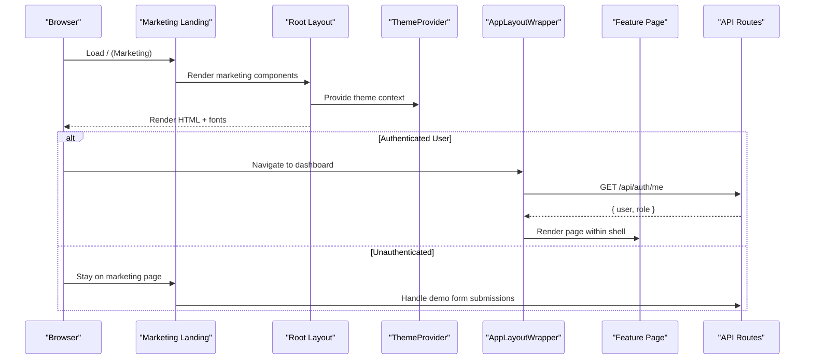

**Diagram sources**
- [page.tsx:1-524](file://src/app/page.tsx#L1-L524)
- [layout.tsx:1-43](file://src/app/layout.tsx#L1-L43)
- [theme.tsx:1-48](file://src/lib/theme.tsx#L1-L48)
- [AppLayoutWrapper.tsx:1-121](file://src/components/AppLayoutWrapper.tsx#L1-L121)

## Detailed Component Analysis

### Root Layout and Global Providers
- Defines viewport and metadata for SEO and mobile behavior.
- Loads typography assets and Material Symbols.
- Wraps children in ThemeProvider to ensure consistent theme across the app.
- Includes a global scroll indicator for UX feedback.

**Section sources**
- [layout.tsx:1-43](file://src/app/layout.tsx#L1-L43)

### Marketing Landing Page Architecture
**Updated** Complete redesign targeting educational consultancies with B2B focus:

- **Hero Section**: Value proposition emphasizing automation, compliance, and multi-branch support
- **Trust Metrics**: Social proof with statistics (50K+ students processed, 99.2% visa accuracy)
- **Feature Showcase**: Six core pillars highlighting CRM, document vault, university pipeline, commission engine, test prep LMS, and parent portal
- **University Network**: Country-specific cards for Australia, Canada, UK, and US with visa processing details
- **Case Study**: Real-world implementation example with measurable impact metrics
- **Pricing Integration**: Seamless transition to pricing section with three-tier model
- **Demo Scheduling**: Lead capture form with consultancy-specific fields

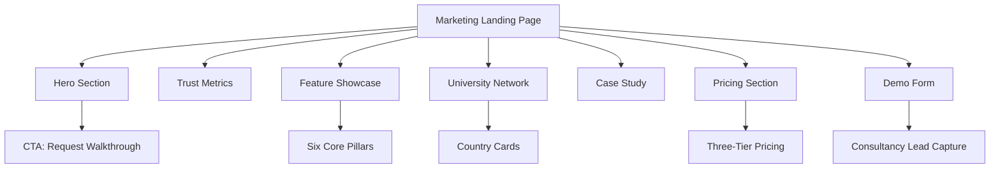

**Diagram sources**
- [page.tsx:1-524](file://src/app/page.tsx#L1-L524)

**Section sources**
- [page.tsx:1-524](file://src/app/page.tsx#L1-L524)

### Marketing Header Component
**New** Fixed navigation header with B2B focus:

- **Responsive Design**: Mobile hamburger menu with smooth transitions
- **Navigation Links**: Seven key sections (Overview, Features, University Network, Student CRM, Visa Automation, Pricing, Live Demo)
- **Call-to-Action**: Prominent "Book a Demo" button with arrow animation
- **Brand Identity**: Logo with "By Avenlixx" subtitle for brand positioning
- **Accessibility**: Proper ARIA labels and keyboard navigation support

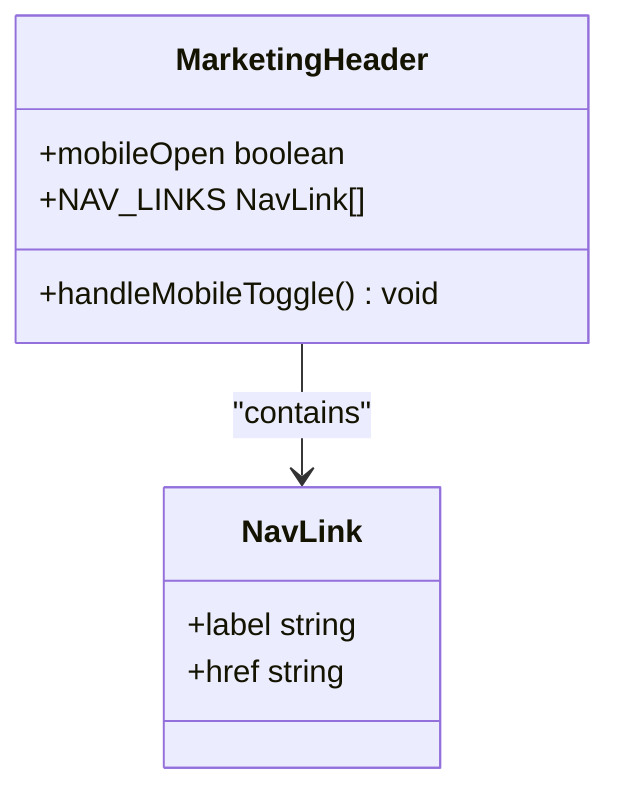

**Diagram sources**
- [MarketingHeader.tsx:1-112](file://src/components/MarketingHeader.tsx#L1-L112)

**Section sources**
- [MarketingHeader.tsx:1-112](file://src/components/MarketingHeader.tsx#L1-L112)

### Pricing Section Component
**New** Comprehensive pricing display with B2B subscription model:

- **Three-Tier Model**: Starter Agency (₹3,495/mo), Growth Agency (₹7,990/mo), Enterprise Network (₹13,485/mo)
- **Billing Toggle**: Monthly vs yearly with 25% discount calculation
- **Feature Comparison**: Detailed feature lists per tier with checkmarks
- **FAQ Accordion**: Common questions about cancellation, storage limits, migration support
- **Currency Formatting**: Indian Rupee formatting with proper localization
- **Visual Hierarchy**: Featured plan highlighted with dark background and indigo accents

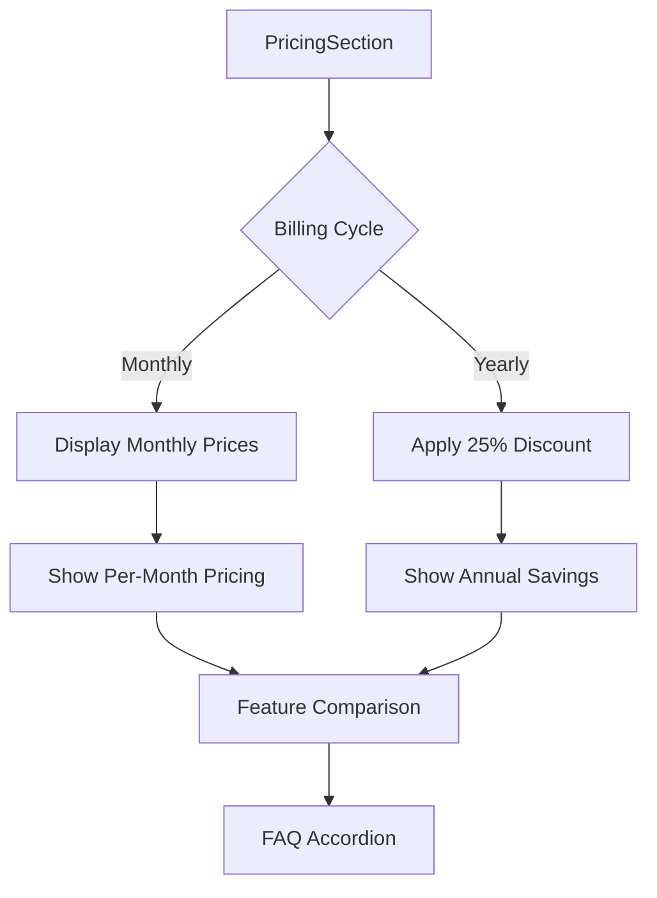

**Diagram sources**
- [PricingSection.tsx:1-291](file://src/components/PricingSection.tsx#L1-L291)

**Section sources**
- [PricingSection.tsx:1-291](file://src/components/PricingSection.tsx#L1-L291)

### Demo Form Component
**New** Consultancy-focused lead capture form:

- **Field Types**: Consultancy name, branch count dropdown, primary intake hub selector, phone/WhatsApp input
- **Validation**: Required fields with proper HTML5 validation
- **Success State**: Confirmation message with 30-minute response promise
- **Design**: Glass-morphism effect with backdrop blur and semi-transparent backgrounds
- **Integration**: Ready for backend API integration with form submission handling

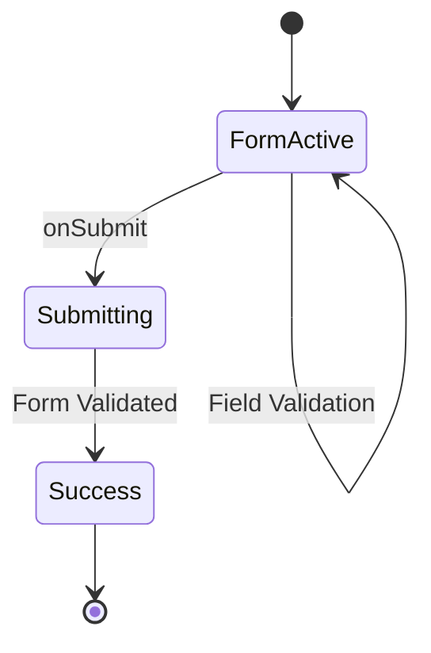

**Diagram sources**
- [DemoForm.tsx:1-73](file://src/components/DemoForm.tsx#L1-L73)

**Section sources**
- [DemoForm.tsx:1-73](file://src/components/DemoForm.tsx#L1-L73)

### Enhanced Sidebar Navigation
**Updated** Significantly expanded navigation system with 267+ additions:

- **Expanded Sections**: Now includes HR & Payroll, Business tools, Platform features, and Administration modules
- **Advanced Filtering**: Module-based visibility control with real-time status updates
- **Enhanced Search**: Full-text search across all navigation items with keyboard shortcuts
- **Real-time Updates**: Live notification counts, dashboard stats, and unread indicators
- **User Context**: Role-based navigation with personalized recommendations
- **Performance**: Optimized rendering with virtual scrolling and lazy loading

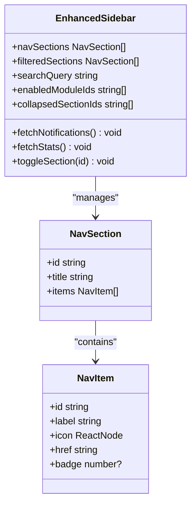

**Diagram sources**
- [Sidebar.tsx:1-1122](file://src/components/Sidebar.tsx#L1-L1122)

**Section sources**
- [Sidebar.tsx:1-1122](file://src/components/Sidebar.tsx#L1-L1122)

### Theme System
- Context-driven theme state with set/toggle methods.
- Persists preference in localStorage and applies a .dark class to the document root.
- Integrates with Tailwind's dark mode via CSS variables and utility classes.

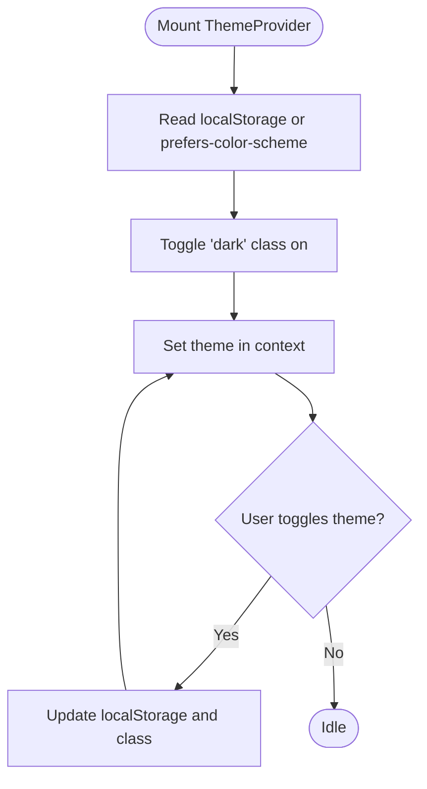

**Diagram sources**
- [theme.tsx:1-48](file://src/lib/theme.tsx#L1-L48)

**Section sources**
- [theme.tsx:1-48](file://src/lib/theme.tsx#L1-L48)
- [tailwind.css:1-178](file://src/styles/tailwind.css#L1-L178)
- [tailwind.config.js:1-132](file://tailwind.config.js#L1-L132)

### Application Shell and Authentication Guard
- AppLayoutWrapper validates session, fetches user info, and redirects unauthenticated users to login.
- Resolves role-based dashboard home and navigates accordingly.
- AppLayout composes enhanced Sidebar, ErrorBoundary, GuidedTour, and Toaster.

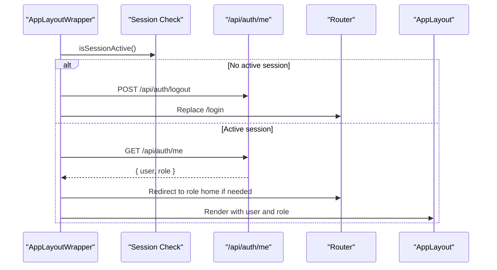

**Diagram sources**
- [AppLayoutWrapper.tsx:1-121](file://src/components/AppLayoutWrapper.tsx#L1-L121)
- [AppLayout.tsx:1-45](file://src/components/AppLayout.tsx#L1-L45)

**Section sources**
- [AppLayoutWrapper.tsx:1-121](file://src/components/AppLayoutWrapper.tsx#L1-L121)
- [AppLayout.tsx:1-45](file://src/components/AppLayout.tsx#L1-L45)

### Topbar and Notifications
- Displays breadcrumbs derived from pathname mapping.
- Provides settings dropdown, theme toggle, and notification panel.
- Uses SSE to update unread counts and notification list in real time.

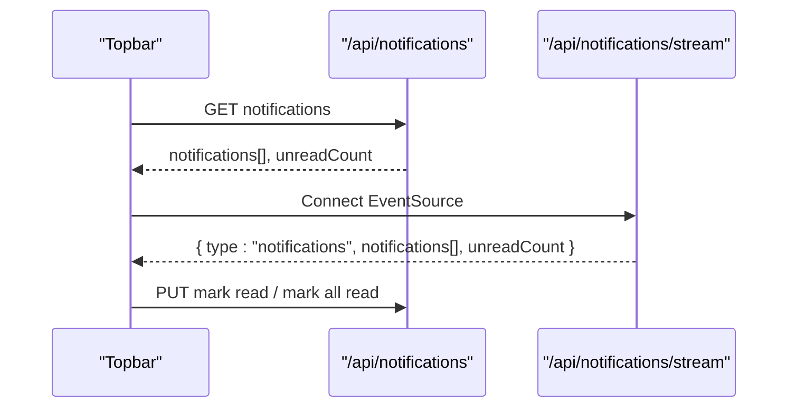

**Diagram sources**
- [Topbar.tsx:1-353](file://src/components/Topbar.tsx#L1-L353)

**Section sources**
- [Topbar.tsx:1-353](file://src/components/Topbar.tsx#L1-L353)

### Reusable UI Components
- AppIcon:
  - Props: name, variant ("outline" | "solid"), size, className, onClick, disabled.
  - Behavior: Dynamically selects icon set; shows placeholder when unknown; supports disabled state and click events.
- AppImage:
  - Props: src, alt, width, height, quality, placeholder, fill, sizes, priority, loading, unoptimized, fallbackSrc, onClick.
  - Behavior: Handles external URLs, lazy/eager loading, blur placeholders, error fallback, and responsive sizing.
- **New**: AppLogo:
  - Props: src, iconName, size, className, onClick.
  - Behavior: Supports both image and icon modes with memoization for performance optimization.

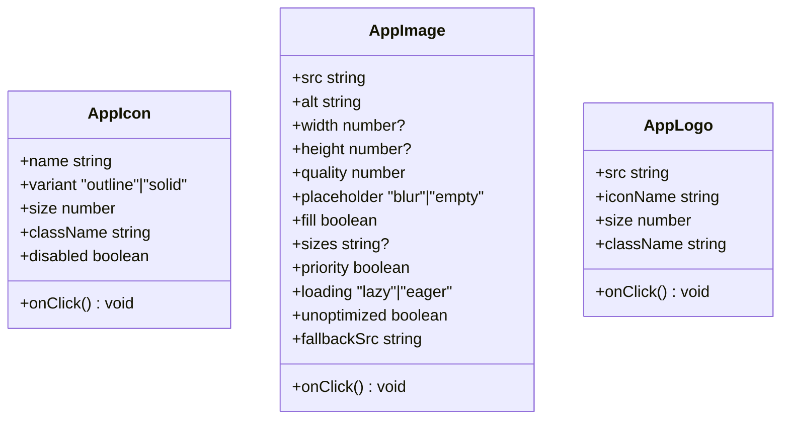

**Diagram sources**
- [AppIcon.tsx:1-55](file://src/components/ui/AppIcon.tsx#L1-L55)
- [AppImage.tsx:1-142](file://src/components/ui/AppImage.tsx#L1-L142)
- [AppLogo.tsx:1-51](file://src/components/ui/AppLogo.tsx#L1-L51)

**Section sources**
- [AppIcon.tsx:1-55](file://src/components/ui/AppIcon.tsx#L1-L55)
- [AppImage.tsx:1-142](file://src/components/ui/AppImage.tsx#L1-L142)
- [AppLogo.tsx:1-51](file://src/components/ui/AppLogo.tsx#L1-L51)

### Routing Strategy and Page Loading
- File-based routing via Next.js App Router under src/app.
- **Updated**: Landing page demonstrates comprehensive marketing sections and composition of B2B-focused components.
- Role-based redirection ensures users land on appropriate dashboards after authentication.
- Enhanced navigation with module-based filtering and real-time status updates.

**Section sources**
- [page.tsx:1-524](file://src/app/page.tsx#L1-L524)
- [AppLayoutWrapper.tsx:1-121](file://src/components/AppLayoutWrapper.tsx#L1-L121)

## Dependency Analysis
Key runtime dependencies include Next.js, React, Tailwind CSS, recharts, framer-motion, sonner, and various utilities. Dev tooling includes TypeScript, ESLint, Prettier, Vitest, and Puppeteer.

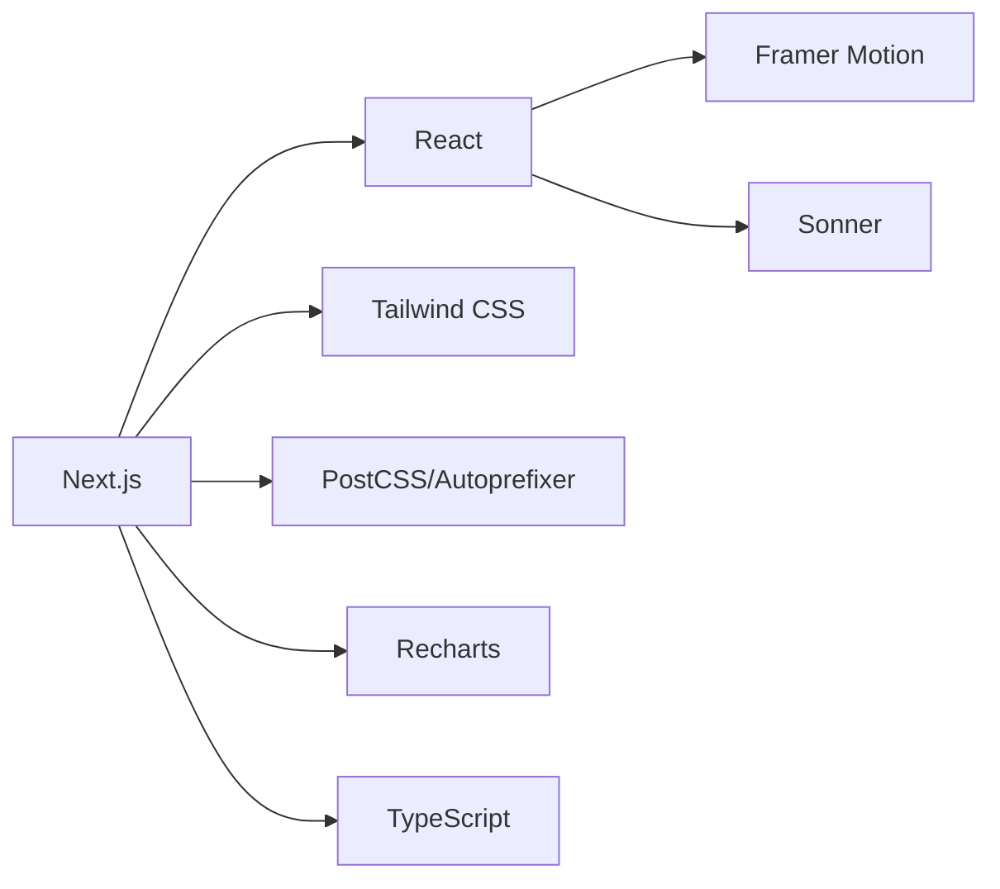

**Diagram sources**
- [package.json:1-119](file://package.json#L1-L119)

**Section sources**
- [package.json:1-119](file://package.json#L1-L119)

## Performance Considerations
- Image optimization: Use AppImage with appropriate quality, lazy loading, and blur placeholders; leverage Next.js image pipeline and configured remote patterns.
- Code splitting and server components: Keep heavy UI in client components only where necessary; prefer server-rendered pages for static content.
- Network efficiency: Debounce or throttle polling; reuse SSE streams for live updates; cache non-sensitive data where possible.
- Styling: Tailwind purges unused utilities; avoid large inline style blocks in pages.
- Accessibility: Respect reduced motion preferences; ensure keyboard navigation and ARIA attributes for interactive elements.
- **Updated**: Marketing page performance: Optimize hero images, implement lazy loading for below-fold content, and use efficient state management for pricing toggles.

[No sources needed since this section provides general guidance]

## Troubleshooting Guide
Common issues and resolutions:
- Theme not applying on first render: Ensure ThemeProvider wraps the app and that the .dark class is toggled on the document root. Verify localStorage persistence and media query detection.
- Images failing to load: Confirm src validity, configure allowed remote hosts in Next config, and rely on AppImage fallback logic.
- Notifications not updating: Check SSE connection status and error handling; verify server endpoint availability and CORS/security headers.
- Route redirects loop: Validate role-based home resolution and ensure session checks run before navigation.
- Build errors with external packages: Mark server-only packages as serverExternalPackages in Next config.
- **Updated**: Marketing form submission issues: Ensure proper form validation, check API endpoints for demo form submissions, and verify success state handling.
- **Updated**: Sidebar performance: Monitor navigation item rendering, optimize search functionality, and ensure proper cleanup of event listeners.

**Section sources**
- [theme.tsx:1-48](file://src/lib/theme.tsx#L1-L48)
- [next.config.mjs:1-47](file://next.config.mjs#L1-L47)
- [AppImage.tsx:1-142](file://src/components/ui/AppImage.tsx#L1-L142)
- [Topbar.tsx:1-353](file://src/components/Topbar.tsx#L1-L353)
- [AppLayoutWrapper.tsx:1-121](file://src/components/AppLayoutWrapper.tsx#L1-L121)
- [DemoForm.tsx:1-73](file://src/components/DemoForm.tsx#L1-L73)
- [Sidebar.tsx:1-1122](file://src/components/Sidebar.tsx#L1-L1122)

## Conclusion
UniTrack's frontend leverages Next.js App Router for scalable routing, a robust theme system for consistent visuals, and a modular component architecture for maintainability. The complete redesign targets educational consultancies with a comprehensive B2B marketing strategy, enhanced navigation system, and enterprise-grade features. The combination of Tailwind CSS customization, client-side state management for UI concerns, real-time updates via SSE, and dedicated marketing components delivers a responsive and accessible experience. Following the provided guidelines will help teams extend the platform with new features while preserving performance and quality.

[No sources needed since this section summarizes without analyzing specific files]

## Appendices

### Guidelines for Creating New Components
- Prefer small, focused components with explicit prop interfaces.
- Use AppIcon and AppImage for consistent icons and images.
- Compose pages using existing layout wrappers to inherit shell behaviors.
- Add new Tailwind tokens via tailwind.config.js and reference them consistently.
- **Updated**: For marketing components: Follow the established patterns in MarketingHeader, PricingSection, and DemoForm for consistent B2B styling and functionality.

**Section sources**
- [AppIcon.tsx:1-55](file://src/components/ui/AppIcon.tsx#L1-L55)
- [AppImage.tsx:1-142](file://src/components/ui/AppImage.tsx#L1-L142)
- [tailwind.config.js:1-132](file://tailwind.config.js#L1-L132)
- [MarketingHeader.tsx:1-112](file://src/components/MarketingHeader.tsx#L1-L112)
- [PricingSection.tsx:1-291](file://src/components/PricingSection.tsx#L1-L291)
- [DemoForm.tsx:1-73](file://src/components/DemoForm.tsx#L1-L73)

### Implementing Custom Themes
- Extend colors, fonts, and typography scales in tailwind.config.js.
- Define CSS variables for semantic tokens in tailwind.css and apply via utilities.
- Use ThemeProvider to expose theme state and toggling to components.
- **Updated**: Ensure marketing components follow the established color scheme and spacing patterns for consistency.

**Section sources**
- [tailwind.config.js:1-132](file://tailwind.config.js#L1-L132)
- [tailwind.css:1-178](file://src/styles/tailwind.css#L1-L178)
- [theme.tsx:1-48](file://src/lib/theme.tsx#L1-L48)

### Integrating Third-Party Libraries
- Add dependencies in package.json and import selectively to minimize bundle size.
- For server-only packages, configure serverExternalPackages in next.config.mjs.
- Wrap third-party UI in your own components to enforce consistent styling and accessibility.
- **Updated**: For marketing integrations: Consider analytics, CRM, and communication tools that align with B2B consultancy workflows.

**Section sources**
- [package.json:1-119](file://package.json#L1-L119)
- [next.config.mjs:1-47](file://next.config.mjs#L1-L47)

### Marketing Component Development Patterns
**New** Guidelines for creating B2B-focused marketing components:

- **Consistent Branding**: Use established color palette (indigo-primary, slate-neutral) and typography scale
- **Responsive Design**: Mobile-first approach with breakpoints at sm, md, lg, xl
- **Accessibility**: Proper ARIA labels, keyboard navigation, and screen reader support
- **Performance**: Lazy loading for below-fold content, optimized images, and efficient state management
- **SEO**: Semantic HTML structure, meta tags, and structured data for better search visibility
- **Conversion Optimization**: Clear CTAs, social proof elements, and streamlined forms

**Section sources**
- [page.tsx:1-524](file://src/app/page.tsx#L1-L524)
- [MarketingHeader.tsx:1-112](file://src/components/MarketingHeader.tsx#L1-L112)
- [PricingSection.tsx:1-291](file://src/components/PricingSection.tsx#L1-L291)
- [DemoForm.tsx:1-73](file://src/components/DemoForm.tsx#L1-L73)