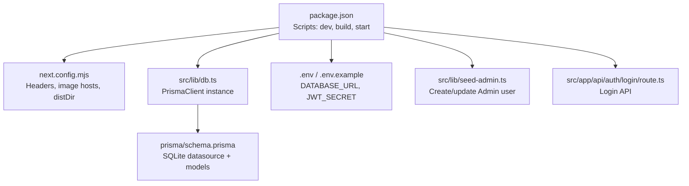
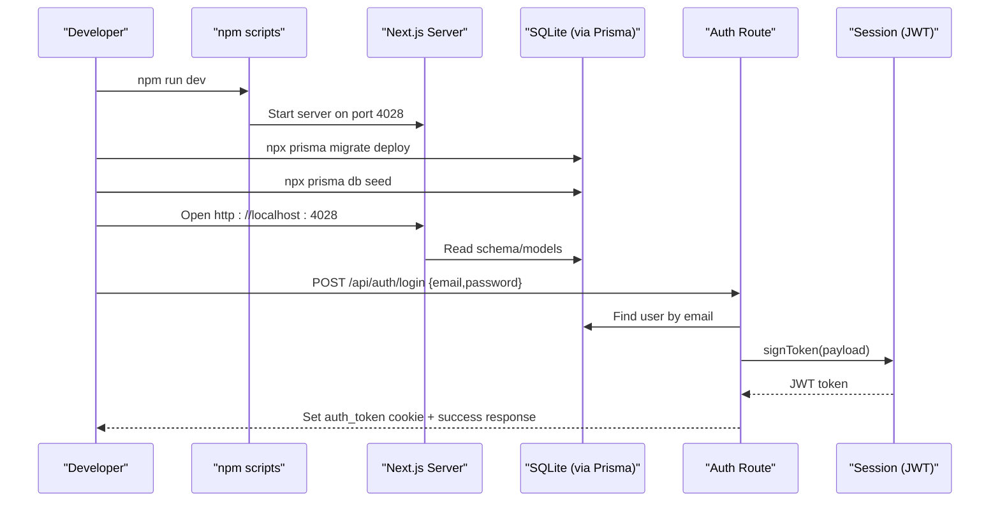
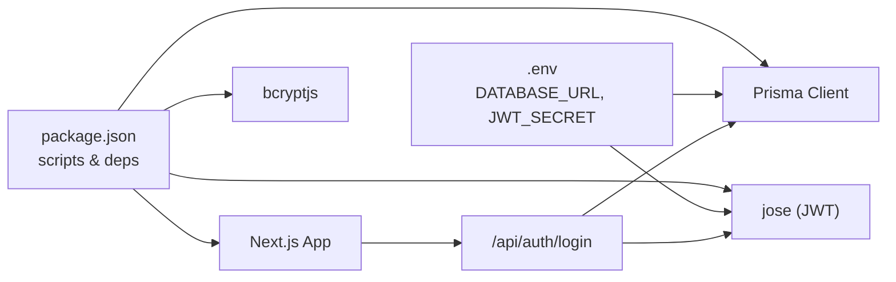

# Getting Started

<cite>
**Referenced Files in This Document**
- [package.json](file://package.json)
- [README.md](file://README.md)
- [next.config.mjs](file://next.config.mjs)
- [.env](file://.env)
- [.env.example](file://.env.example)
- [schema.prisma](file://prisma/schema.prisma)
- [db.ts](file://src/lib/db.ts)
- [seed-admin.ts](file://src/lib/seed-admin.ts)
- [login/route.ts](file://src/app/api/auth/login/route.ts)
- [session.ts](file://src/lib/session.ts)
</cite>

## Table of Contents
1. Introduction
2. Project Structure
3. Core Components
4. Architecture Overview
5. Detailed Component Analysis
6. Dependency Analysis
7. Performance Considerations
8. Troubleshooting Guide
9. Conclusion

## Introduction
This guide helps you install, configure, and run UniTrack locally. You will set up Node.js, configure the database with Prisma and SQLite, create environment variables, initialize the schema and seed data, start the development server, and verify that the application is accessible at http://localhost:4028. It also explains how to log in as the default admin and what credentials to use.

## Project Structure
UniTrack is a Next.js 15 application using TypeScript and Tailwind CSS. The key directories for getting started are:
- src/app: Application routes and pages (Next.js App Router)
- src/lib: Shared utilities including database client, session handling, and seeding scripts
- prisma: Database schema and seed scripts
- .env and .env.example: Environment configuration files
- package.json: Scripts for development, building, and seeding

**Diagram sources**
- [package.json:39-55](file://package.json#L39-L55)
- [next.config.mjs:1-47](file://next.config.mjs#L1-L47)
- [db.ts:1-8](file://src/lib/db.ts#L1-L8)
- [schema.prisma:1-9](file://prisma/schema.prisma#L1-L9)
- [seed-admin.ts:1-42](file://src/lib/seed-admin.ts#L1-L42)
- [login/route.ts:1-123](file://src/app/api/auth/login/route.ts#L1-L123)

**Section sources**
- [package.json:39-55](file://package.json#L39-L55)
- [README.md:11-26](file://README.md#L11-L26)

## Core Components
- Development server and port: The dev script runs on port 4028 by default.
- Database: SQLite via Prisma; connection URL is read from DATABASE_URL.
- Authentication: JWT-based sessions signed with JWT_SECRET.
- Seeders: Create an initial Admin user and sample data.

Key points:
- Ensure NODE_ENV is not set to production when running the dev server so local defaults apply.
- The login route sets an httpOnly cookie named auth_token and records last login activity.

**Section sources**
- [package.json:39-47](file://package.json#L39-L47)
- [schema.prisma:6-9](file://prisma/schema.prisma#L6-L9)
- [session.ts:3-9](file://src/lib/session.ts#L3-L9)
- [login/route.ts:53-68](file://src/app/api/auth/login/route.ts#L53-L68)

## Architecture Overview
The runtime flow for setup and first login:

**Diagram sources**
- [package.json:39-55](file://package.json#L39-L55)
- [schema.prisma:6-9](file://prisma/schema.prisma#L6-L9)
- [login/route.ts:19-68](file://src/app/api/auth/login/route.ts#L19-L68)
- [session.ts:28-36](file://src/lib/session.ts#L28-L36)

## Detailed Component Analysis

### Environment Setup
- Required tools:
  - Node.js (recommended LTS)
  - npm or yarn
- Steps:
  1. Install dependencies: npm install
  2. Configure environment:
     - Copy .env.example to .env if needed
     - Set DATABASE_URL to a SQLite file path (e.g., file:./dev.db)
     - Set JWT_SECRET to a secure random string (at least 32 hex characters)
     - Optional: MASTER_API_URL and MASTER_API_KEY
  3. Verify .env values are loaded by the app.

Notes:
- The dev server listens on port 4028 by default.
- next.config.mjs uses DIST_DIR env to change output directory if needed.

**Section sources**
- [.env.example:1-14](file://.env.example#L1-L14)
- [.env:1-5](file://.env#L1-L5)
- [package.json:39-47](file://package.json#L39-L47)
- [next.config.mjs:4-7](file://next.config.mjs#L4-L7)

### Database Setup with Prisma and SQLite
- Schema provider: SQLite configured in schema.prisma datasource.
- Connection: DATABASE_URL must point to a valid SQLite file path.
- Migrations:
  - Apply migrations to create tables: npx prisma migrate deploy
  - If starting fresh, you can generate and run migrations once: npx prisma migrate dev --name init
- Seeding:
  - Run seed scripts to populate reference data and the Admin user.
  - Default seeder creates an Admin user with email from ADMIN_EMAIL or a default value, and either ADMIN_PASSWORD or a generated password printed to console.

Verification:
- After migration and seeding, confirm tables exist and an Admin user is present.

**Section sources**
- [schema.prisma:1-9](file://prisma/schema.prisma#L1-L9)
- [seed-admin.ts:7-31](file://src/lib/seed-admin.ts#L7-L31)

### Running the Development Server
- Start the dev server: npm run dev
- Access the app: http://localhost:4028
- Build for production: npm run build
- Start production server: npm run serve

Notes:
- The README confirms the dev server runs on port 4028.
- The dev script explicitly sets the port to 4028.

**Section sources**
- [package.json:39-47](file://package.json#L39-L47)
- [README.md:20-26](file://README.md#L20-L26)

### Initial Configuration and First Login
- Create the Admin user:
  - Run the seed script to create/update the Admin account.
  - If no ADMIN_PASSWORD is set, a random password is generated and printed to the console during seeding.
- Log in:
  - Navigate to http://localhost:4028
  - Use the Admin email and password (from your environment or generated output).
  - On successful login, the server sets an httpOnly cookie named auth_token and returns a success response.

Security note:
- In production, JWT_SECRET must be set; otherwise, authentication will fail.

**Section sources**
- [seed-admin.ts:7-31](file://src/lib/seed-admin.ts#L7-L31)
- [login/route.ts:19-68](file://src/app/api/auth/login/route.ts#L19-L68)
- [session.ts:3-9](file://src/lib/session.ts#L3-L9)

### Basic Project Structure Navigation
- Frontend pages and routes live under src/app.
- API endpoints are implemented as Next.js Route Handlers under src/app/api.
- Shared utilities and services are under src/lib.
- Static assets go under public.
- Database schema and seeds are under prisma.

Tip:
- To add a new feature, create a page under src/app and a corresponding API route under src/app/api as needed.

**Section sources**
- [README.md:28-43](file://README.md#L28-L43)

## Dependency Analysis
Core runtime dependencies relevant to setup:
- Next.js and React for the application framework
- Prisma Client for type-safe database access
- jose for JWT signing and verification
- bcryptjs for password hashing

Configuration coupling:
- DATABASE_URL drives Prisma’s SQLite connection
- JWT_SECRET drives session token signing
- Port 4028 is enforced by the dev script

**Diagram sources**
- [package.json:56-108](file://package.json#L56-L108)
- [.env:1-5](file://.env#L1-L5)
- [login/route.ts:1-123](file://src/app/api/auth/login/route.ts#L1-L123)
- [session.ts:1-36](file://src/lib/session.ts#L1-L36)

**Section sources**
- [package.json:56-108](file://package.json#L56-L108)
- [.env:1-5](file://.env#L1-L5)

## Performance Considerations
- Keep DATABASE_URL pointing to a fast storage medium for SQLite during development.
- Avoid excessive logging in development to reduce I/O overhead.
- For production builds, ensure proper caching headers and consider enabling source maps only when debugging.

[No sources needed since this section provides general guidance]

## Troubleshooting Guide
Common issues and resolutions:
- Cannot connect to database:
  - Ensure DATABASE_URL is set and points to a writable SQLite file path.
  - Confirm Prisma client is generated after schema changes.
- Authentication fails:
  - Ensure JWT_SECRET is set and non-empty.
  - Verify the Admin user exists (run seed again if necessary).
- Port already in use:
  - Change the port in the dev script or stop the conflicting process.
- CORS or CSP errors:
  - Review next.config.mjs headers and allowed image hosts/connect sources.
- Seed did not create Admin:
  - Re-run the seed script and check console output for the generated password when ADMIN_PASSWORD is not set.

Verification steps:
- Run npm run dev and open http://localhost:4028.
- Log in with the Admin credentials.
- Check that the auth_token cookie is set after login.
- Confirm database tables exist and contain expected seed data.

**Section sources**
- [session.ts:3-9](file://src/lib/session.ts#L3-L9)
- [seed-admin.ts:7-31](file://src/lib/seed-admin.ts#L7-L31)
- [next.config.mjs:17-45](file://next.config.mjs#L17-L45)
- [login/route.ts:53-68](file://src/app/api/auth/login/route.ts#L53-L68)

## Conclusion
You now have everything needed to install, configure, and run UniTrack locally. Use the provided scripts to start the development server on port 4028, apply Prisma migrations, seed the database, and log in as the Admin. Follow the troubleshooting tips if you encounter common setup issues, and refer to the project structure to navigate the codebase confidently.