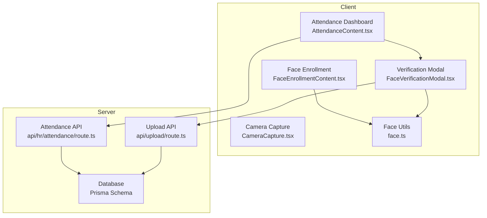
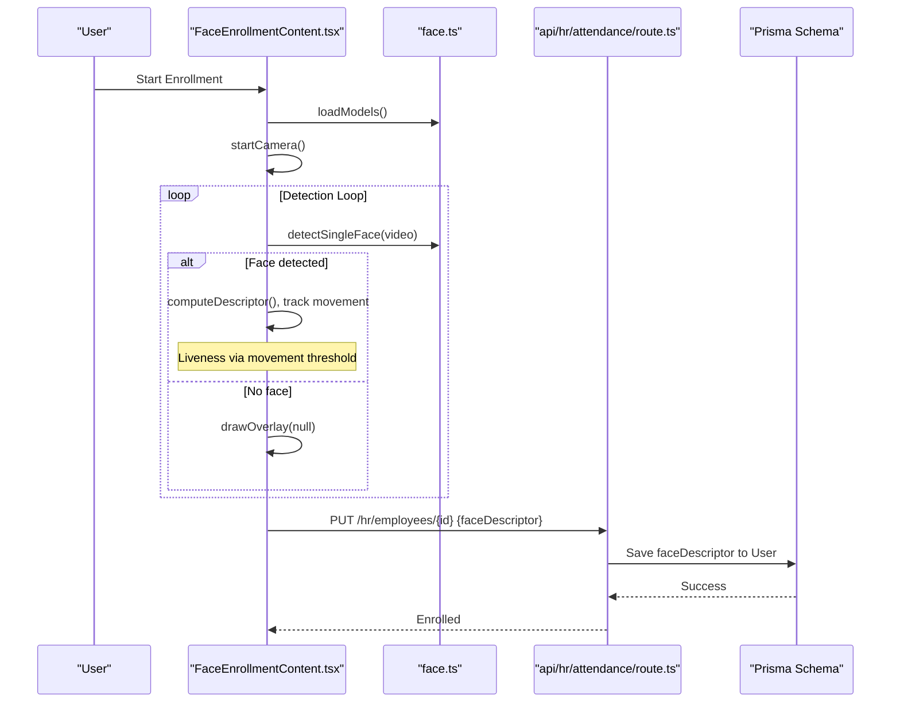
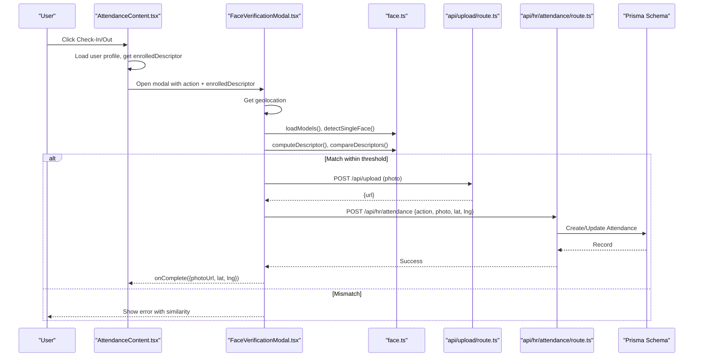
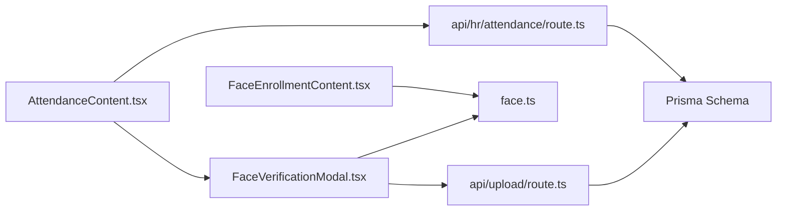

# Attendance Tracking & Face Verification

<cite>
**Referenced Files in This Document**
- [AttendanceContent.tsx](file://src/app/hr/attendance/components/AttendanceContent.tsx)
- [FaceVerificationModal.tsx](file://src/components/hr/FaceVerificationModal.tsx)
- [CameraCapture.tsx](file://src/components/hr/CameraCapture.tsx)
- [face.ts](file://src/lib/face.ts)
- [route.ts (HR Attendance)](file://src/app/api/hr/attendance/route.ts)
- [route.ts (Upload)](file://src/app/api/upload/route.ts)
- [schema.prisma](file://prisma/schema.prisma)
- [page.tsx (Face Enrollment Page)](file://src/app/hr/employees/[id]/face-enrollment/page.tsx)
- [FaceEnrollmentContent.tsx](file://src/app/hr/employees/[id]/face-enrollment/components/FaceEnrollmentContent.tsx)
</cite>

## Table of Contents
1. Introduction
2. Project Structure
3. Core Components
4. Architecture Overview
5. Detailed Component Analysis
6. Dependency Analysis
7. Performance Considerations
8. Troubleshooting Guide
9. Conclusion
10. Appendices

## Introduction
This document explains the Attendance Tracking system with advanced face recognition capabilities. It covers real-time attendance monitoring, check-in/check-out workflows, and the enrollment process for employee faces using camera integration, biometric capture, and facial template storage. It also details face verification algorithms, accuracy thresholds, security measures, example usage flows, exception handling, reporting, and operational guidance such as camera setup, lighting requirements, and performance optimization.

## Project Structure
The system is implemented as a Next.js application with:
- Client-side UI for attendance dashboard, face enrollment, and verification modal
- Server-side API routes for attendance operations and file uploads
- A Prisma schema defining users, attendance records, and related entities
- In-browser face detection and descriptor computation using a local model library

**Diagram sources**
- [AttendanceContent.tsx:224-384](file://src/app/hr/attendance/components/AttendanceContent.tsx#L224-L384)
- [FaceEnrollmentContent.tsx:46-238](file://src/app/hr/employees/[id]/face-enrollment/components/FaceEnrollmentContent.tsx#L46-L238)
- [FaceVerificationModal.tsx:125-345](file://src/components/hr/FaceVerificationModal.tsx#L125-L345)
- [CameraCapture.tsx:12-84](file://src/components/hr/CameraCapture.tsx#L12-L84)
- [face.ts:7-68](file://src/lib/face.ts#L7-L68)
- [route.ts (HR Attendance):66-241](file://src/app/api/hr/attendance/route.ts#L66-L241)
- [route.ts (Upload):23-64](file://src/app/api/upload/route.ts#L23-L64)
- [schema.prisma:139-198](file://prisma/schema.prisma#L139-L198)
- [schema.prisma:664-685](file://prisma/schema.prisma#L664-L685)

**Section sources**
- [AttendanceContent.tsx:224-384](file://src/app/hr/attendance/components/AttendanceContent.tsx#L224-L384)
- [FaceEnrollmentContent.tsx:46-238](file://src/app/hr/employees/[id]/face-enrollment/components/FaceEnrollmentContent.tsx#L46-L238)
- [FaceVerificationModal.tsx:125-345](file://src/components/hr/FaceVerificationModal.tsx#L125-L345)
- [CameraCapture.tsx:12-84](file://src/components/hr/CameraCapture.tsx#L12-L84)
- [face.ts:7-68](file://src/lib/face.ts#L7-L68)
- [route.ts (HR Attendance):66-241](file://src/app/api/hr/attendance/route.ts#L66-L241)
- [route.ts (Upload):23-64](file://src/app/api/upload/route.ts#L23-L64)
- [schema.prisma:139-198](file://prisma/schema.prisma#L139-L198)
- [schema.prisma:664-685](file://prisma/schema.prisma#L664-L685)

## Core Components
- Attendance Dashboard: Displays attendance records, filters by date/status/search, shows quick actions for check-in/out, and integrates face verification.
- Face Enrollment: Captures an employee’s face via camera, performs movement-based liveness checks, computes a facial descriptor, and saves it to the user profile.
- Face Verification Modal: Orchestrates location capture, camera access, face detection, descriptor comparison against enrolled template, photo upload, and confirmation flow.
- Camera Capture Utility: Generic camera component that captures and uploads photos when needed.
- Face Utilities: Loads models, detects faces, computes descriptors, compares descriptors, and provides movement tracking helpers.
- Attendance API: Validates session, enforces location constraints, prevents duplicate entries, creates/updates attendance records, and logs activity.
- Upload API: Accepts files, validates type and size, writes to disk, and returns a URL.
- Database Schema: Defines User (with faceDescriptor), Attendance (with timestamps, photos, and coordinates), and settings used for location validation.

**Section sources**
- [AttendanceContent.tsx:224-384](file://src/app/hr/attendance/components/AttendanceContent.tsx#L224-L384)
- [FaceEnrollmentContent.tsx:46-238](file://src/app/hr/employees/[id]/face-enrollment/components/FaceEnrollmentContent.tsx#L46-L238)
- [FaceVerificationModal.tsx:125-345](file://src/components/hr/FaceVerificationModal.tsx#L125-L345)
- [CameraCapture.tsx:12-84](file://src/components/hr/CameraCapture.tsx#L12-L84)
- [face.ts:7-68](file://src/lib/face.ts#L7-L68)
- [route.ts (HR Attendance):66-241](file://src/app/api/hr/attendance/route.ts#L66-L241)
- [route.ts (Upload):23-64](file://src/app/api/upload/route.ts#L23-L64)
- [schema.prisma:139-198](file://prisma/schema.prisma#L139-L198)
- [schema.prisma:664-685](file://prisma/schema.prisma#L664-L685)

## Architecture Overview
End-to-end flows for enrollment and verification:

**Diagram sources**
- [FaceEnrollmentContent.tsx:197-238](file://src/app/hr/employees/[id]/face-enrollment/components/FaceEnrollmentContent.tsx#L197-L238)
- [face.ts:7-68](file://src/lib/face.ts#L7-L68)
- [route.ts (HR Attendance):127-241](file://src/app/api/hr/attendance/route.ts#L127-L241)
- [route.ts (Upload):23-64](file://src/app/api/upload/route.ts#L23-L64)
- [schema.prisma:139-198](file://prisma/schema.prisma#L139-L198)
- [schema.prisma:664-685](file://prisma/schema.prisma#L664-L685)
- [FaceVerificationModal.tsx:187-345](file://src/components/hr/FaceVerificationModal.tsx#L187-L345)
- [AttendanceContent.tsx:298-364](file://src/app/hr/attendance/components/AttendanceContent.tsx#L298-L364)

## Detailed Component Analysis

### Attendance Dashboard
- Displays attendance records with date range filters, status filters, search, sorting, and pagination.
- Shows quick actions panel for current user’s check-in/out with face verification.
- Integrates with face enrollment check; if no enrolled face, prompts to enroll.
- On successful verification, posts attendance action with photo and location.

Key behaviors:
- Fetches attendance list and current user’s daily record.
- Builds query parameters for filtering and sorting.
- Opens FaceVerificationModal with enrolledDescriptor from user profile.
- On completion, updates UI and notifies success/failure.

**Section sources**
- [AttendanceContent.tsx:224-384](file://src/app/hr/attendance/components/AttendanceContent.tsx#L224-L384)
- [AttendanceContent.tsx:389-684](file://src/app/hr/attendance/components/AttendanceContent.tsx#L389-L684)

### Face Enrollment
- Initializes face detection models and starts camera stream.
- Runs a detection loop to capture frames, overlay face box, and measure head movement for liveness.
- Computes a facial descriptor upon sufficient movement or fallback frame count.
- Saves descriptor to user profile via update endpoint.

Operational notes:
- Movement-based liveness uses configurable thresholds and frame counts.
- If already enrolled, indicates success without re-capture.
- Provides retake and cancel options.

**Section sources**
- [FaceEnrollmentContent.tsx:46-238](file://src/app/hr/employees/[id]/face-enrollment/components/FaceEnrollmentContent.tsx#L46-L238)
- [page.tsx (Face Enrollment Page):1-16](file://src/app/hr/employees/[id]/face-enrollment/page.tsx#L1-L16)

### Face Verification Modal
- Acquires geolocation first; proceeds to face capture on success or skips if unavailable.
- Loads models, opens camera, runs detection loop with liveness tracking.
- Computes descriptor and compares with enrolledDescriptor using Euclidean distance.
- On match, captures frame, uploads photo, and returns result to caller.
- Handles errors for camera, model loading, upload failures, and mismatches.

Accuracy and thresholds:
- Descriptor comparison uses Euclidean distance; match threshold is applied before proceeding to upload and attendance creation.
- Liveness requires movement across multiple frames or fallback after many frames.

**Section sources**
- [FaceVerificationModal.tsx:125-345](file://src/components/hr/FaceVerificationModal.tsx#L125-L345)
- [face.ts:40-68](file://src/lib/face.ts#L40-L68)

### Camera Capture Utility
- Reusable component to open camera, capture a still image, preview, retake, and upload to server.
- Returns uploaded URL to caller for use in attendance or other features.

**Section sources**
- [CameraCapture.tsx:12-84](file://src/components/hr/CameraCapture.tsx#L12-L84)

### Face Utilities
- Loads Tiny Face Detector, Landmark, and Recognition models once.
- Detects single face with landmarks and descriptor.
- Computes descriptor arrays and compares using Euclidean distance.
- Provides helper functions for center calculation and movement distance.
- Exposes constants for movement threshold, frames required, and fallback frames.

**Section sources**
- [face.ts:7-68](file://src/lib/face.ts#L7-L68)

### Attendance API
- GET: Filters attendance by date range, user, status, search; supports sorting and ordering.
- POST: Processes check-in and checkout:
  - Validates session.
  - Prevents duplicate entries per day.
  - Requires photo and location.
  - Validates location against branch or office settings using haversine distance and configured radius.
  - Creates or updates attendance records and logs activity.

Security and integrity:
- Session-based authorization.
- Location validation ensures presence near office or branch.
- Activity logging tracks changes.

**Section sources**
- [route.ts (HR Attendance):66-241](file://src/app/api/hr/attendance/route.ts#L66-L241)

### Upload API
- Validates MIME types and file size.
- Writes file to public/uploads with a unique name.
- Returns URL and metadata.

**Section sources**
- [route.ts (Upload):23-64](file://src/app/api/upload/route.ts#L23-L64)

### Data Model Highlights
- User: Includes optional faceDescriptor field storing JSON-encoded descriptor array.
- Attendance: Stores userId, date, checkIn/checkOut times, status, notes, photos, and coordinates for both check-in and check-out. Unique constraint on userId+date ensures one record per day.

**Section sources**
- [schema.prisma:139-198](file://prisma/schema.prisma#L139-L198)
- [schema.prisma:664-685](file://prisma/schema.prisma#L664-L685)

## Dependency Analysis
- Frontend components depend on face utilities for model loading, detection, and descriptor math.
- Attendance dashboard depends on FaceVerificationModal and Attendance API.
- Face enrollment depends on face utilities and employee profile endpoints.
- Server-side attendance API depends on database and session utilities; performs location validation using branch or office settings.
- Upload API is independent but used by verification flow to persist photos.

**Diagram sources**
- [AttendanceContent.tsx:298-364](file://src/app/hr/attendance/components/AttendanceContent.tsx#L298-L364)
- [FaceVerificationModal.tsx:187-345](file://src/components/hr/FaceVerificationModal.tsx#L187-L345)
- [FaceEnrollmentContent.tsx:197-238](file://src/app/hr/employees/[id]/face-enrollment/components/FaceEnrollmentContent.tsx#L197-L238)
- [face.ts:7-68](file://src/lib/face.ts#L7-L68)
- [route.ts (HR Attendance):66-241](file://src/app/api/hr/attendance/route.ts#L66-L241)
- [route.ts (Upload):23-64](file://src/app/api/upload/route.ts#L23-L64)
- [schema.prisma:139-198](file://prisma/schema.prisma#L139-L198)
- [schema.prisma:664-685](file://prisma/schema.prisma#L664-L685)

**Section sources**
- [AttendanceContent.tsx:298-364](file://src/app/hr/attendance/components/AttendanceContent.tsx#L298-L364)
- [FaceVerificationModal.tsx:187-345](file://src/components/hr/FaceVerificationModal.tsx#L187-L345)
- [FaceEnrollmentContent.tsx:197-238](file://src/app/hr/employees/[id]/face-enrollment/components/FaceEnrollmentContent.tsx#L197-L238)
- [face.ts:7-68](file://src/lib/face.ts#L7-L68)
- [route.ts (HR Attendance):66-241](file://src/app/api/hr/attendance/route.ts#L66-L241)
- [route.ts (Upload):23-64](file://src/app/api/upload/route.ts#L23-L64)
- [schema.prisma:139-198](file://prisma/schema.prisma#L139-L198)
- [schema.prisma:664-685](file://prisma/schema.prisma#L664-L685)

## Performance Considerations
- Model loading is cached globally to avoid repeated downloads; ensure models are served efficiently.
- Use small input size for face detection to balance speed and accuracy.
- Limit camera resolution to reduce bandwidth and processing overhead.
- Debounce or throttle UI interactions during heavy operations like model loading and detection loops.
- Keep photo uploads under the allowed size limit to prevent server delays.
- Prefer client-side descriptor computation to minimize server load.

[No sources needed since this section provides general guidance]

## Troubleshooting Guide
Common issues and resolutions:
- Face not enrolled: The dashboard will prompt to enroll; ensure the employee completes the enrollment flow.
- Camera access denied: Verify browser permissions; retry enrollment or verification.
- Location required: Ensure geolocation is enabled; otherwise verification may proceed without location depending on configuration.
- Model loading failed: Refresh the page; confirm models are available at the expected path.
- Photo upload failed: Check file type and size; retry upload.
- Duplicate attendance: Cannot check-in twice or check-out without prior check-in; handle accordingly.
- Location out of range: Move closer to office or branch within configured radius.

Operational tips:
- Lighting: Adequate, even lighting improves detection reliability.
- Camera placement: Center face, avoid extreme angles, keep distance appropriate for the detector.
- Movement: Slight head movements help liveness detection; follow on-screen prompts.

**Section sources**
- [AttendanceContent.tsx:298-327](file://src/app/hr/attendance/components/AttendanceContent.tsx#L298-L327)
- [FaceVerificationModal.tsx:304-345](file://src/components/hr/FaceVerificationModal.tsx#L304-L345)
- [route.ts (HR Attendance):127-241](file://src/app/api/hr/attendance/route.ts#L127-L241)
- [route.ts (Upload):23-64](file://src/app/api/upload/route.ts#L23-L64)

## Conclusion
The Attendance Tracking system integrates real-time face recognition with robust check-in/check-out workflows, location validation, and secure storage of biometric templates. The modular design separates UI, verification logic, and server-side enforcement, enabling clear maintenance and scalability. Proper camera setup, lighting, and adherence to liveness prompts significantly improve reliability.

[No sources needed since this section summarizes without analyzing specific files]

## Appendices

### Example Workflows

- Enroll Employee Face:
  - Navigate to employee face enrollment page.
  - Start enrollment; allow camera; move head slightly as prompted.
  - Save descriptor to complete enrollment.

- Process Attendance:
  - From attendance dashboard, click Check-In or Check-Out.
  - Complete face verification; upload photo; submit attendance.
  - View updated records and status.

- Handle Exceptions:
  - If mismatch occurs, retry verification or re-enroll.
  - If location is invalid, adjust position or configure settings.
  - For upload failures, verify file constraints and retry.

- Generate Reports:
  - Use date range, status filters, and search to narrow results.
  - Export or review attendance summaries based on filtered data.

[No sources needed since this section provides conceptual guidance]

### Configuration Notes
- Working hours and shift management: Not explicitly defined in the analyzed code; consider extending the Attendance model and API to support shifts and overtime calculations if needed.
- Overtime calculations: Not present in the analyzed code; can be added via payroll integration or custom logic.
- Accuracy settings: Descriptor matching threshold and liveness parameters are controlled in the face utilities and modal; tune MOVEMENT_THRESHOLD, MOVEMENT_FRAMES, FALLBACK_FRAMES, and distance threshold as required.

**Section sources**
- [face.ts:61-68](file://src/lib/face.ts#L61-L68)
- [FaceVerificationModal.tsx:243-284](file://src/components/hr/FaceVerificationModal.tsx#L243-L284)