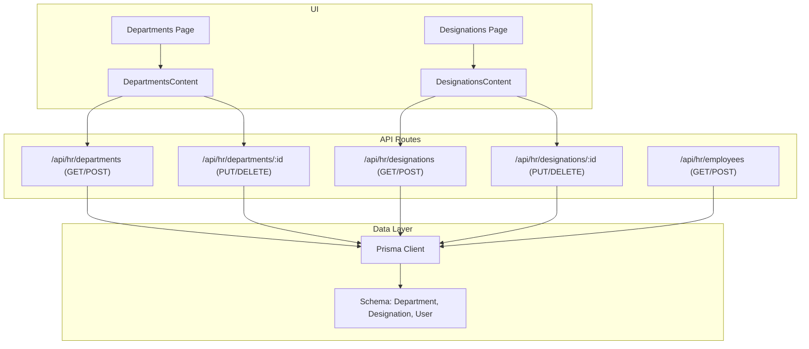
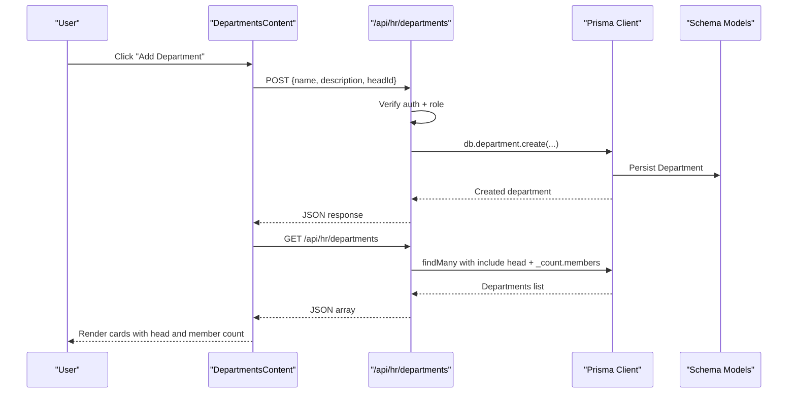
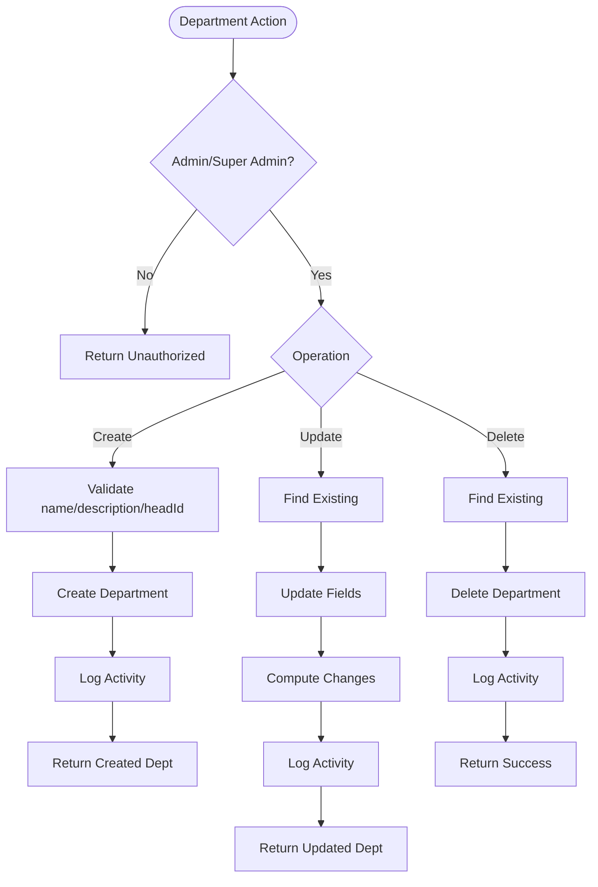
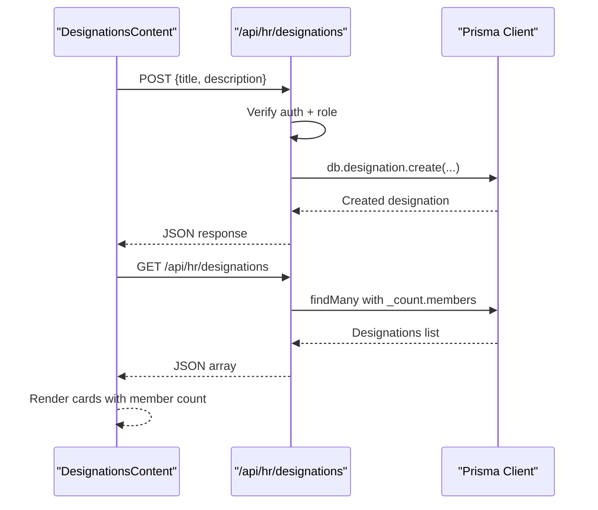
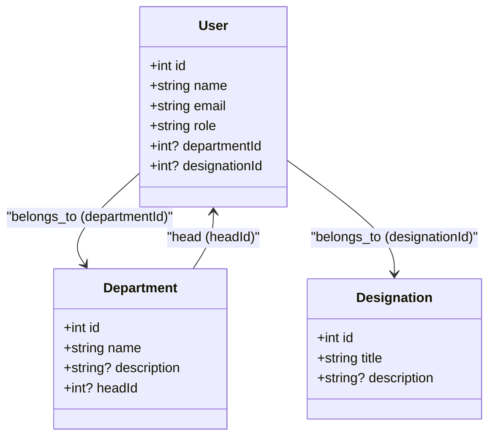
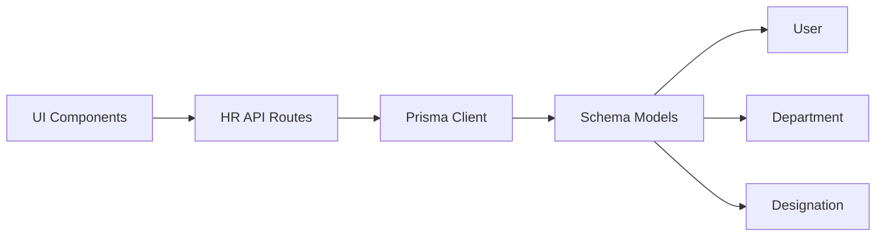

# Department & Designation Management

<cite>
**Referenced Files in This Document**
- [schema.prisma](file://prisma/schema.prisma)
- [DepartmentsContent.tsx](file://src/app/hr/departments/components/DepartmentsContent.tsx)
- [departments route (list/create)](file://src/app/api/hr/departments/route.ts)
- [departments route (update/delete)](file://src/app/api/hr/departments/[id]/route.ts)
- [DesignationsContent.tsx](file://src/app/hr/designations/components/DesignationsContent.tsx)
- [designations route (list/create)](file://src/app/api/hr/designations/route.ts)
- [designations route (update/delete)](file://src/app/api/hr/designations/[id]/route.ts)
- [employees route (list/create)](file://src/app/api/hr/employees/route.ts)
- [permissions.ts](file://src/lib/permissions.ts)
</cite>

## Table of Contents
1. Introduction
2. Project Structure
3. Core Components
4. Architecture Overview
5. Detailed Component Analysis
6. Dependency Analysis
7. Performance Considerations
8. Troubleshooting Guide
9. Conclusion

## Introduction
This document explains how the system manages organizational structure through Departments and Designations, including:
- Creating and managing departments with department heads
- Managing designations (job titles) and their descriptions
- Assigning employees to departments and designations
- Access control for HR administrative actions
- Reporting and headcount visibility at the department level
- Current limitations regarding hierarchy, budget allocation, approval workflows, and org chart generation

The goal is to help administrators configure and operate the HR module effectively while understanding what is currently supported versus what would require additional development.

## Project Structure
The HR module exposes Next.js App Router pages and API routes for departments and designations, backed by a Prisma schema that defines the data model and relationships.

**Diagram sources**
- [DepartmentsContent.tsx:40-117](file://src/app/hr/departments/components/DepartmentsContent.tsx#L40-L117)
- [departments route (list/create):18-72](file://src/app/api/hr/departments/route.ts#L18-L72)
- [departments route (update/delete):19-87](file://src/app/api/hr/departments/[id]/route.ts#L19-L87)
- [DesignationsContent.tsx:25-93](file://src/app/hr/designations/components/DesignationsContent.tsx#L25-L93)
- [designations route (list/create):18-69](file://src/app/api/hr/designations/route.ts#L18-L69)
- [designations route (update/delete):18-85](file://src/app/api/hr/designations/[id]/route.ts#L18-L85)
- [employees route (list/create):18-107](file://src/app/api/hr/employees/route.ts#L18-L107)
- [schema.prisma:631-649](file://prisma/schema.prisma#L631-L649)

**Section sources**
- [DepartmentsContent.tsx:1-288](file://src/app/hr/departments/components/DepartmentsContent.tsx#L1-L288)
- [DesignationsContent.tsx:1-236](file://src/app/hr/designations/components/DesignationsContent.tsx#L1-L236)
- [departments route (list/create):1-73](file://src/app/api/hr/departments/route.ts#L1-L73)
- [departments route (update/delete):1-88](file://src/app/api/hr/departments/[id]/route.ts#L1-L88)
- [designations route (list/create):1-70](file://src/app/api/hr/designations/route.ts#L1-L70)
- [designations route (update/delete):1-86](file://src/app/api/hr/designations/[id]/route.ts#L1-L86)
- [employees route (list/create):1-108](file://src/app/api/hr/employees/route.ts#L1-L108)
- [schema.prisma:631-649](file://prisma/schema.prisma#L631-L649)

## Core Components
- Department management: Create, update, delete departments; assign a department head; view member counts.
- Designation management: Create, update, delete job titles; view member counts.
- Employee assignment: Assign employees to departments and designations via the employee creation/update flow.
- Access control: Only Admin or Super Admin roles can create/update/delete HR entities.
- Data model: Department and Designation are linked to Users (members), and Department has an optional head relationship to a User.

Key capabilities observed:
- Unique constraints on department names and designation titles prevent duplicates.
- Activity logging records create/update/delete actions for auditability.
- Headcount per department and designation is exposed via related member counts.

**Section sources**
- [schema.prisma:139-198](file://prisma/schema.prisma#L139-L198)
- [schema.prisma:631-649](file://prisma/schema.prisma#L631-L649)
- [departments route (list/create):18-72](file://src/app/api/hr/departments/route.ts#L18-L72)
- [departments route (update/delete):19-87](file://src/app/api/hr/departments/[id]/route.ts#L19-L87)
- [designations route (list/create):18-69](file://src/app/api/hr/designations/route.ts#L18-L69)
- [designations route (update/delete):18-85](file://src/app/api/hr/designations/[id]/route.ts#L18-L85)
- [permissions.ts:76-89](file://src/lib/permissions.ts#L76-L89)

## Architecture Overview
The UI components call REST endpoints to manage departments and designations. The API enforces authentication and role checks, then uses Prisma to read/write data. Relationships between Users, Departments, and Designations enable headcount reporting and employee assignments.

**Diagram sources**
- [DepartmentsContent.tsx:40-117](file://src/app/hr/departments/components/DepartmentsContent.tsx#L40-L117)
- [departments route (list/create):18-72](file://src/app/api/hr/departments/route.ts#L18-L72)
- [schema.prisma:631-649](file://prisma/schema.prisma#L631-L649)

## Detailed Component Analysis

### Department Management
- Create: Validates required fields, creates a department, logs activity, returns created entity.
- Read: Returns all departments sorted by name, includes head details and member counts.
- Update: Allows updating name, description, and headId; logs changes using diff; handles unique constraint errors.
- Delete: Removes department if exists; logs deletion.

Operational notes:
- Head assignment is optional and stored as a foreign key to a User.
- Member count is derived from related users assigned to the department.
- Duplicate department names are prevented by a unique constraint.

**Diagram sources**
- [departments route (list/create):18-72](file://src/app/api/hr/departments/route.ts#L18-L72)
- [departments route (update/delete):19-87](file://src/app/api/hr/departments/[id]/route.ts#L19-L87)

**Section sources**
- [departments route (list/create):18-72](file://src/app/api/hr/departments/route.ts#L18-L72)
- [departments route (update/delete):19-87](file://src/app/api/hr/departments/[id]/route.ts#L19-L87)
- [DepartmentsContent.tsx:61-117](file://src/app/hr/departments/components/DepartmentsContent.tsx#L61-L117)

### Designation Management
- Create: Validates title and description, creates designation, logs activity.
- Read: Returns all designations sorted by title with member counts.
- Update: Updates title/description; logs changes; handles duplicate title errors.
- Delete: Deletes designation if exists; logs deletion.

Operational notes:
- Designations represent job titles and roles without hierarchical links in the current schema.
- Member counts reflect users assigned to the designation.

**Diagram sources**
- [DesignationsContent.tsx:25-93](file://src/app/hr/designations/components/DesignationsContent.tsx#L25-L93)
- [designations route (list/create):18-69](file://src/app/api/hr/designations/route.ts#L18-L69)

**Section sources**
- [designations route (list/create):18-69](file://src/app/api/hr/designations/route.ts#L18-L69)
- [designations route (update/delete):18-85](file://src/app/api/hr/designations/[id]/route.ts#L18-L85)
- [DesignationsContent.tsx:25-93](file://src/app/hr/designations/components/DesignationsContent.tsx#L25-L93)

### Employee Assignment to Departments and Designations
- Employees are Users with optional departmentId and designationId.
- The employee creation/update endpoint assigns these IDs along with other HR fields.
- The employee list endpoint includes department and designation details for display.

**Diagram sources**
- [schema.prisma:139-198](file://prisma/schema.prisma#L139-L198)
- [schema.prisma:631-649](file://prisma/schema.prisma#L631-L649)

**Section sources**
- [employees route (list/create):18-107](file://src/app/api/hr/employees/route.ts#L18-L107)
- [schema.prisma:139-198](file://prisma/schema.prisma#L139-L198)

### Access Control Implications
- HR endpoints enforce role-based access: only Admin or Super Admin can create/update/delete departments and designations.
- Route-level permission mapping indicates HR sections require appropriate permissions.
- Super Admin bypasses standard permission checks.

**Section sources**
- [departments route (list/create):37-42](file://src/app/api/hr/departments/route.ts#L37-L42)
- [departments route (update/delete):21-24](file://src/app/api/hr/departments/[id]/route.ts#L21-L24)
- [designations route (list/create):35-39](file://src/app/api/hr/designations/route.ts#L35-L39)
- [designations route (update/delete):20-23](file://src/app/api/hr/designations/[id]/route.ts#L20-L23)
- [permissions.ts:76-89](file://src/lib/permissions.ts#L76-L89)
- [permissions.ts:91-106](file://src/lib/permissions.ts#L91-L106)

## Dependency Analysis
- UI components depend on API routes for CRUD operations.
- API routes depend on Prisma client and schema models.
- Employee assignment depends on User model fields for department and designation linkage.
- Activity logging depends on shared utilities to record changes.

**Diagram sources**
- [DepartmentsContent.tsx:40-117](file://src/app/hr/departments/components/DepartmentsContent.tsx#L40-L117)
- [DesignationsContent.tsx:25-93](file://src/app/hr/designations/components/DesignationsContent.tsx#L25-L93)
- [departments route (list/create):18-72](file://src/app/api/hr/departments/route.ts#L18-L72)
- [designations route (list/create):18-69](file://src/app/api/hr/designations/route.ts#L18-L69)
- [schema.prisma:631-649](file://prisma/schema.prisma#L631-L649)

**Section sources**
- [schema.prisma:631-649](file://prisma/schema.prisma#L631-L649)
- [employees route (list/create):18-107](file://src/app/api/hr/employees/route.ts#L18-L107)

## Performance Considerations
- List endpoints use ordering and selective includes to minimize payload size.
- Member counts are computed via database relations (_count), avoiding extra queries.
- Authentication and role checks are performed early to reduce unnecessary processing.
- For large datasets, consider pagination on list endpoints to improve responsiveness.

[No sources needed since this section provides general guidance]

## Troubleshooting Guide
Common issues and resolutions:
- Unauthorized access: Ensure the user session is valid and the role is Admin or Super Admin for HR operations.
- Duplicate name/title errors: Department names and designation titles must be unique; choose a different value.
- Not found errors: When updating or deleting, verify the ID exists before making requests.
- Failed to load data: Check network connectivity and ensure the API endpoints are reachable.

Operational tips:
- Use the provided UI forms to avoid malformed payloads.
- Review toast messages for immediate feedback on success/failure.
- Inspect server logs for detailed error traces when failures occur.

**Section sources**
- [departments route (list/create):37-72](file://src/app/api/hr/departments/route.ts#L37-L72)
- [departments route (update/delete):19-87](file://src/app/api/hr/departments/[id]/route.ts#L19-L87)
- [designations route (list/create):35-69](file://src/app/api/hr/designations/route.ts#L35-L69)
- [designations route (update/delete):18-85](file://src/app/api/hr/designations/[id]/route.ts#L18-L85)

## Conclusion
The system provides robust foundational support for Department and Designation management:
- Departments can be created with optional heads and member counts are visible.
- Designations serve as job titles with associated descriptions and member counts.
- Employees can be assigned to departments and designations during profile setup.
- Access control ensures only authorized roles perform HR administrative tasks.

Current limitations to note:
- No built-in parent-child hierarchy for departments; departments are flat.
- No budget allocation fields in the Department model.
- No approval workflow configuration tied to departments or designations.
- No organizational chart generation feature present in the analyzed code.

For advanced needs such as hierarchical departments, budgets, approval workflows, and org charts, additional schema fields, API endpoints, and UI features would need to be implemented.

[No sources needed since this section summarizes without analyzing specific files]