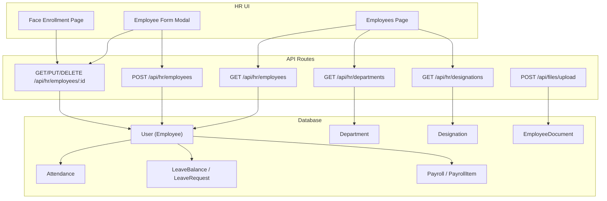
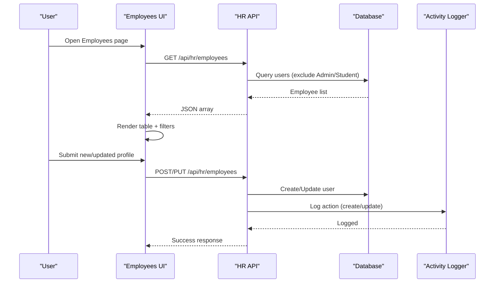
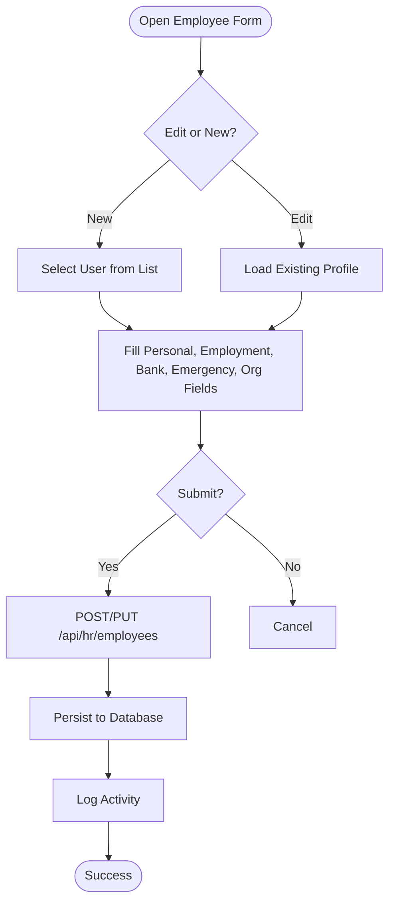
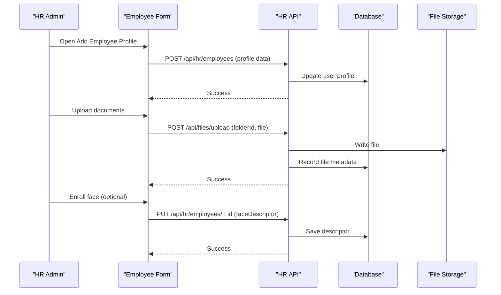
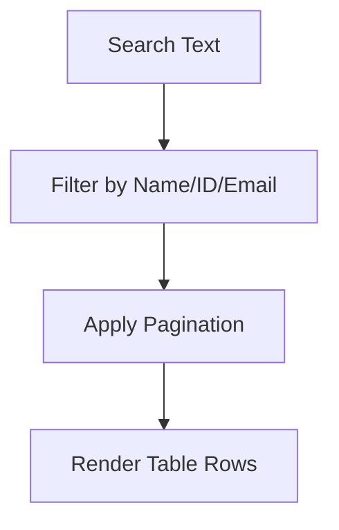
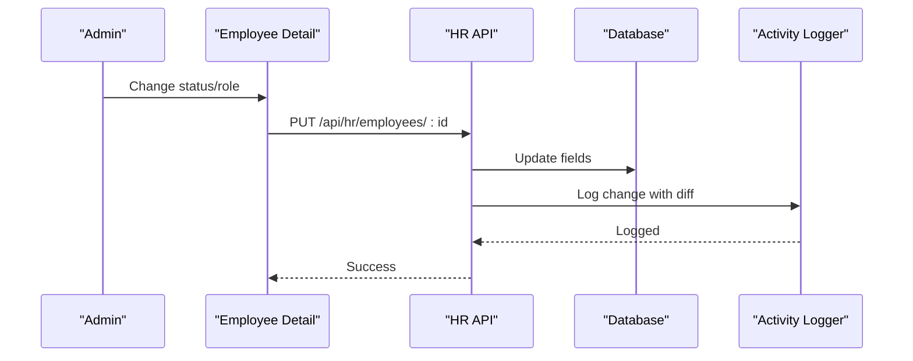
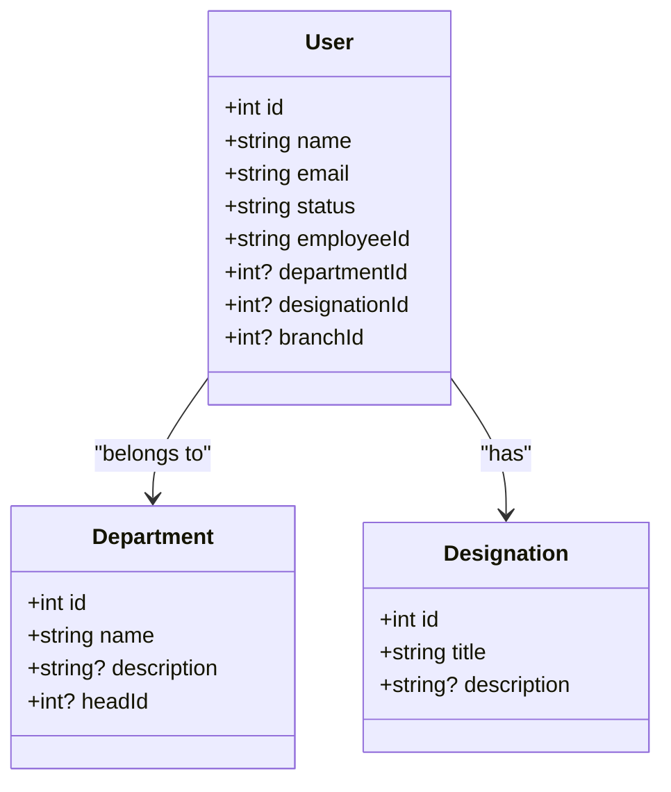
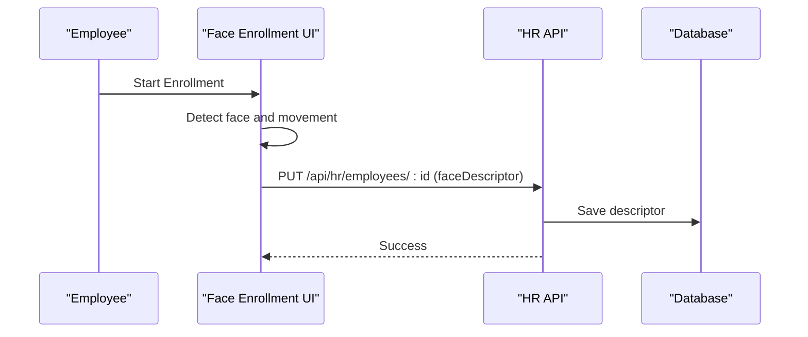
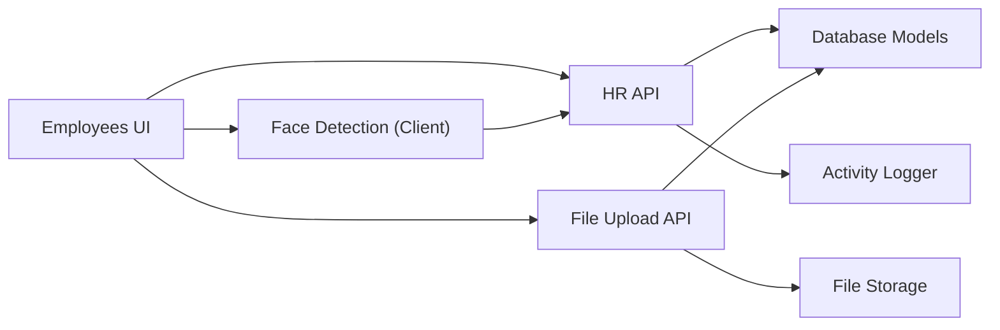

# Employee Management

<cite>
**Referenced Files in This Document**
- [schema.prisma](file://prisma/schema.prisma)
- [employees route.ts](file://src/app/api/hr/employees/route.ts)
- [employee detail route.ts](file://src/app/api/hr/employees/[id]/route.ts)
- [departments route.ts](file://src/app/api/hr/departments/route.ts)
- [designations route.ts](file://src/app/api/hr/designations/route.ts)
- [EmployeesContent.tsx](file://src/app/hr/employees/components/EmployeesContent.tsx)
- [face enrollment page.tsx](file://src/app/hr/employees/[id]/face-enrollment/page.tsx)
- [face enrollment content.tsx](file://src/app/hr/employees/[id]/face-enrollment/components/FaceEnrollmentContent.tsx)
- [file upload route.ts](file://src/app/api/files/upload/route.ts)
</cite>

## Table of Contents
1. Introduction
2. Project Structure
3. Core Components
4. Architecture Overview
5. Detailed Component Analysis
6. Dependency Analysis
7. Performance Considerations
8. Troubleshooting Guide
9. Conclusion

## Introduction
This document provides comprehensive documentation for the Employee Management subsystem, covering the complete employee lifecycle: directory and profile management, onboarding workflows, search and filtering, bulk operations, data export, status changes, departures, integration with departments and designations, photo and face enrollment, emergency contacts, skill tracking, validation, privacy compliance, and audit logging. It is designed to be accessible to both technical and non-technical users.

## Project Structure
The Employee Management subsystem spans UI pages, API routes, and database models:
- HR UI pages and components render the employee directory, forms, and actions.
- API routes handle authentication, CRUD operations, and activity logging.
- Database schema defines entities such as User (employee), Department, Designation, EmployeeDocument, Attendance, Leave, Payroll, and related relationships.

**Diagram sources**
- [employees route.ts:18-57](file://src/app/api/hr/employees/route.ts#L18-L57)
- [employee detail route.ts:19-70](file://src/app/api/hr/employees/[id]/route.ts#L19-L70)
- [departments route.ts:18-35](file://src/app/api/hr/departments/route.ts#L18-L35)
- [designations route.ts:18-32](file://src/app/api/hr/designations/route.ts#L18-L32)
- [file upload route.ts:86-192](file://src/app/api/files/upload/route.ts#L86-L192)
- [schema.prisma:139-198](file://prisma/schema.prisma#L139-L198)
- [schema.prisma:631-649](file://prisma/schema.prisma#L631-L649)
- [schema.prisma:651-662](file://prisma/schema.prisma#L651-L662)
- [schema.prisma:664-783](file://prisma/schema.prisma#L664-L783)

**Section sources**
- [EmployeesContent.tsx:106-321](file://src/app/hr/employees/components/EmployeesContent.tsx#L106-L321)
- [employees route.ts:18-108](file://src/app/api/hr/employees/route.ts#L18-L108)
- [employee detail route.ts:19-167](file://src/app/api/hr/employees/[id]/route.ts#L19-L167)
- [departments route.ts:18-73](file://src/app/api/hr/departments/route.ts#L18-L73)
- [designations route.ts:18-70](file://src/app/api/hr/designations/route.ts#L18-L70)
- [schema.prisma:139-198](file://prisma/schema.prisma#L139-L198)
- [schema.prisma:631-649](file://prisma/schema.prisma#L631-L649)
- [schema.prisma:651-662](file://prisma/schema.prisma#L651-L662)
- [schema.prisma:664-783](file://prisma/schema.prisma#L664-L783)

## Core Components
- Employee Directory: Lists employees with pagination, search by name/ID/email, and quick stats.
- Profile Management: Create/update employee profiles including personal info, employment details, bank/tax info, department, designation, branch, and emergency contact.
- Face Enrollment: Capture and store a face descriptor for attendance verification.
- Departments and Designations: Master lists used to assign organizational context to employees.
- File Upload: Securely store documents linked to folders or students; supports common file types with size limits.

Key capabilities:
- Search and filter: Client-side filtering across name, employee ID, and email.
- Status and role updates: Update employee status and role via the detail endpoint.
- Audit logging: All create/update/delete actions are logged with actor and target information.
- Privacy controls: Sensitive fields (e.g., bank account, PAN) are stored in the database; ensure access control and encryption at rest per your environment policy.

**Section sources**
- [EmployeesContent.tsx:252-259](file://src/app/hr/employees/components/EmployeesContent.tsx#L252-L259)
- [employee detail route.ts:73-138](file://src/app/api/hr/employees/[id]/route.ts#L73-L138)
- [employees route.ts:59-108](file://src/app/api/hr/employees/route.ts#L59-L108)
- [face enrollment content.tsx:197-238](file://src/app/hr/employees/[id]/face-enrollment/components/FaceEnrollmentContent.tsx#L197-L238)
- [file upload route.ts:19-37](file://src/app/api/files/upload/route.ts#L19-L37)

## Architecture Overview
The system follows a client-server architecture:
- Frontend pages call protected API endpoints that enforce session-based authentication.
- Endpoints query or update the database using Prisma and log activities for auditability.
- Face enrollment runs client-side detection and saves descriptors to the employee record.
- Documents are uploaded to a secure server path and referenced by URLs stored in the database.

**Diagram sources**
- [employees route.ts:18-108](file://src/app/api/hr/employees/route.ts#L18-L108)
- [employee detail route.ts:19-138](file://src/app/api/hr/employees/[id]/route.ts#L19-L138)

## Detailed Component Analysis

### Employee Directory and Profile Management
- Listing: Fetches employees excluding certain roles, includes related department, designation, and branch for display.
- Creation: Updates an existing user’s profile fields, sets defaults where applicable, and logs creation.
- Update: Supports partial updates for all profile fields, including status and role, with change diffing and audit logging.
- Delete: Prevents self-deletion and logs deletion.

**Diagram sources**
- [EmployeesContent.tsx:163-234](file://src/app/hr/employees/components/EmployeesContent.tsx#L163-L234)
- [employees route.ts:59-108](file://src/app/api/hr/employees/route.ts#L59-L108)
- [employee detail route.ts:73-138](file://src/app/api/hr/employees/[id]/route.ts#L73-L138)

**Section sources**
- [employees route.ts:18-108](file://src/app/api/hr/employees/route.ts#L18-L108)
- [employee detail route.ts:19-167](file://src/app/api/hr/employees/[id]/route.ts#L19-L167)
- [EmployeesContent.tsx:106-321](file://src/app/hr/employees/components/EmployeesContent.tsx#L106-L321)

### Employee Onboarding Workflow
- Data Entry: Use the Add Employee Profile modal to select a user and fill required fields (employee ID, phone, gender, hire date, employment type, salary).
- Organization Assignment: Assign department, designation, and branch.
- Emergency Contact and Bank Info: Capture emergency contact and financial details for payroll and safety.
- Document Upload: Attach supporting documents via the file upload endpoint into appropriate folders.
- Initial Setup: Optionally enroll face for attendance verification.

**Diagram sources**
- [EmployeesContent.tsx:163-234](file://src/app/hr/employees/components/EmployeesContent.tsx#L163-L234)
- [employees route.ts:59-108](file://src/app/api/hr/employees/route.ts#L59-L108)
- [file upload route.ts:86-192](file://src/app/api/files/upload/route.ts#L86-L192)
- [face enrollment content.tsx:218-238](file://src/app/hr/employees/[id]/face-enrollment/components/FaceEnrollmentContent.tsx#L218-L238)

**Section sources**
- [EmployeesContent.tsx:163-234](file://src/app/hr/employees/components/EmployeesContent.tsx#L163-L234)
- [file upload route.ts:86-192](file://src/app/api/files/upload/route.ts#L86-L192)
- [face enrollment content.tsx:197-238](file://src/app/hr/employees/[id]/face-enrollment/components/FaceEnrollmentContent.tsx#L197-L238)

### Employee Search and Filtering
- Client-side search across name, employee ID, and email.
- Pagination for large datasets.
- Stats cards show totals for employees, departments, designations, and full-time counts.

**Diagram sources**
- [EmployeesContent.tsx:252-259](file://src/app/hr/employees/components/EmployeesContent.tsx#L252-L259)
- [EmployeesContent.tsx:378-567](file://src/app/hr/employees/components/EmployeesContent.tsx#L378-L567)

**Section sources**
- [EmployeesContent.tsx:252-259](file://src/app/hr/employees/components/EmployeesContent.tsx#L252-L259)
- [EmployeesContent.tsx:378-567](file://src/app/hr/employees/components/EmployeesContent.tsx#L378-L567)

### Bulk Operations and Data Export
- Bulk operations: The current implementation focuses on single-record create/update/delete. For bulk updates, extend the API to accept arrays and process transactions.
- Data export: Implement a CSV/Excel export by iterating over the employee list and writing rows; reuse the same query logic as the GET endpoint.

[No sources needed since this section provides general guidance]

### Managing Employee Status Changes and Departures
- Status changes: Update the employee status field via the detail endpoint.
- Role changes: Update role if authorized.
- Departures: Delete the employee record after confirmation; self-deletion is blocked.

**Diagram sources**
- [employee detail route.ts:73-138](file://src/app/api/hr/employees/[id]/route.ts#L73-L138)

**Section sources**
- [employee detail route.ts:73-167](file://src/app/api/hr/employees/[id]/route.ts#L73-L167)

### Integration with Department and Designation Systems
- Departments: Retrieve master list with head and member counts; assign employees to departments.
- Designations: Retrieve master list with member counts; assign employees to designations.
- Branches: Assign employees to active branches.

**Diagram sources**
- [schema.prisma:139-198](file://prisma/schema.prisma#L139-L198)
- [schema.prisma:631-649](file://prisma/schema.prisma#L631-L649)
- [departments route.ts:18-35](file://src/app/api/hr/departments/route.ts#L18-L35)
- [designations route.ts:18-32](file://src/app/api/hr/designations/route.ts#L18-L32)

**Section sources**
- [departments route.ts:18-73](file://src/app/api/hr/departments/route.ts#L18-L73)
- [designations route.ts:18-70](file://src/app/api/hr/designations/route.ts#L18-L70)
- [schema.prisma:139-198](file://prisma/schema.prisma#L139-L198)
- [schema.prisma:631-649](file://prisma/schema.prisma#L631-L649)

### Photo and Face Enrollment
- Photos: Employee avatars are stored as strings (URLs) in the user model.
- Face Enrollment: Captures a face descriptor using client-side detection and saves it to the employee record for attendance verification.

**Diagram sources**
- [face enrollment content.tsx:197-238](file://src/app/hr/employees/[id]/face-enrollment/components/FaceEnrollmentContent.tsx#L197-L238)
- [employee detail route.ts:73-138](file://src/app/api/hr/employees/[id]/route.ts#L73-L138)

**Section sources**
- [face enrollment page.tsx:1-16](file://src/app/hr/employees/[id]/face-enrollment/page.tsx#L1-L16)
- [face enrollment content.tsx:1-383](file://src/app/hr/employees/[id]/face-enrollment/components/FaceEnrollmentContent.tsx#L1-L383)
- [employee detail route.ts:73-138](file://src/app/api/hr/employees/[id]/route.ts#L73-L138)

### Emergency Contact Information
- Store emergency contact name and phone in the employee profile.
- Display and edit via the employee form modal.

**Section sources**
- [EmployeesContent.tsx:812-882](file://src/app/hr/employees/components/EmployeesContent.tsx#L812-L882)
- [employee detail route.ts:73-138](file://src/app/api/hr/employees/[id]/route.ts#L73-L138)

### Skill Tracking
- Current schema does not include a dedicated skills entity. To implement skill tracking:
  - Add a Skill model and a many-to-many relation between User and Skill.
  - Extend the employee form to manage skills.
  - Provide APIs to add/remove skills and retrieve them per employee.

[No sources needed since this section proposes future enhancements]

### Employee Data Validation, Privacy Compliance, and Audit Logging
- Validation:
  - Required fields enforced in UI (e.g., employee ID, hire date).
  - Server-side checks for authorization and existence.
  - File uploads validate MIME types and size limits.
- Privacy:
  - Sensitive fields (bank account, PAN) stored in the database; ensure encryption at rest and strict access controls.
  - Limit exposure of sensitive fields in responses unless necessary.
- Audit Logging:
  - All create/update/delete actions log actor, target, and changes where applicable.

**Section sources**
- [employees route.ts:59-108](file://src/app/api/hr/employees/route.ts#L59-L108)
- [employee detail route.ts:73-167](file://src/app/api/hr/employees/[id]/route.ts#L73-L167)
- [file upload route.ts:19-37](file://src/app/api/files/upload/route.ts#L19-L37)

## Dependency Analysis
- UI depends on HR API routes for data and mutations.
- HR API routes depend on database models and activity logging utilities.
- Face enrollment depends on client-side face detection libraries and updates the employee record.
- File uploads depend on storage paths and database records for metadata.

**Diagram sources**
- [employees route.ts:18-108](file://src/app/api/hr/employees/route.ts#L18-L108)
- [employee detail route.ts:19-167](file://src/app/api/hr/employees/[id]/route.ts#L19-L167)
- [face enrollment content.tsx:197-238](file://src/app/hr/employees/[id]/face-enrollment/components/FaceEnrollmentContent.tsx#L197-L238)
- [file upload route.ts:86-192](file://src/app/api/files/upload/route.ts#L86-L192)

**Section sources**
- [employees route.ts:18-108](file://src/app/api/hr/employees/route.ts#L18-L108)
- [employee detail route.ts:19-167](file://src/app/api/hr/employees/[id]/route.ts#L19-L167)
- [file upload route.ts:86-192](file://src/app/api/files/upload/route.ts#L86-L192)

## Performance Considerations
- Pagination: Use client-side pagination for the employee list; consider server-side pagination for large datasets.
- Selective Queries: Only select necessary fields in API responses to reduce payload size.
- Caching: Cache master lists (departments, designations) on the client to avoid repeated fetches.
- File Uploads: Enforce size limits and allowed MIME types to prevent heavy payloads.
- Face Detection: Run detection efficiently and stop camera streams when not in use.

[No sources needed since this section provides general guidance]

## Troubleshooting Guide
- Unauthorized Access: Ensure valid session token; check cookie and verifyAuth behavior.
- Employee Not Found: Verify employee ID and route parameters.
- Duplicate Department/Designation: Handle unique constraint errors and provide user feedback.
- File Upload Failures: Check MIME type allowance, file size limit, and folder ownership.
- Face Enrollment Errors: Confirm camera permissions and browser support; reinitialize detection loop.

**Section sources**
- [employees route.ts:18-57](file://src/app/api/hr/employees/route.ts#L18-L57)
- [employee detail route.ts:19-70](file://src/app/api/hr/employees/[id]/route.ts#L19-L70)
- [departments route.ts:37-73](file://src/app/api/hr/departments/route.ts#L37-L73)
- [designations route.ts:34-70](file://src/app/api/hr/designations/route.ts#L34-L70)
- [file upload route.ts:86-192](file://src/app/api/files/upload/route.ts#L86-L192)
- [face enrollment content.tsx:100-111](file://src/app/hr/employees/[id]/face-enrollment/components/FaceEnrollmentContent.tsx#L100-L111)

## Conclusion
The Employee Management subsystem provides a robust foundation for managing employee lifecycles, including profile management, onboarding, search, status changes, departures, and integrations with departments and designations. It supports face enrollment for attendance verification and secure document uploads. Future enhancements can include bulk operations, data export, and skill tracking to further enrich the employee experience while maintaining strong validation, privacy, and audit practices.