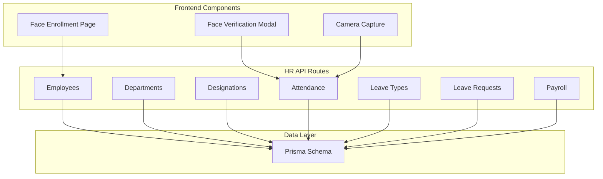
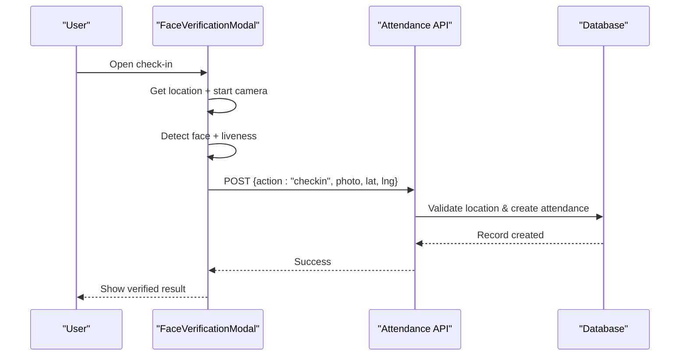
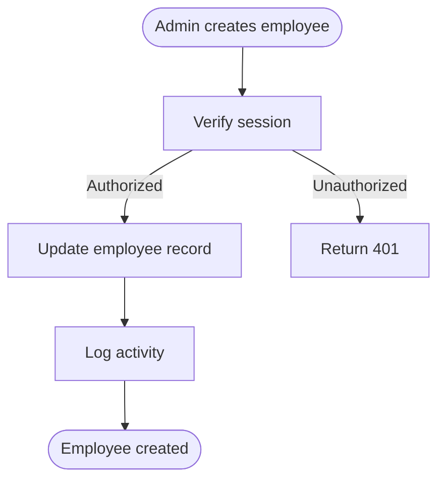
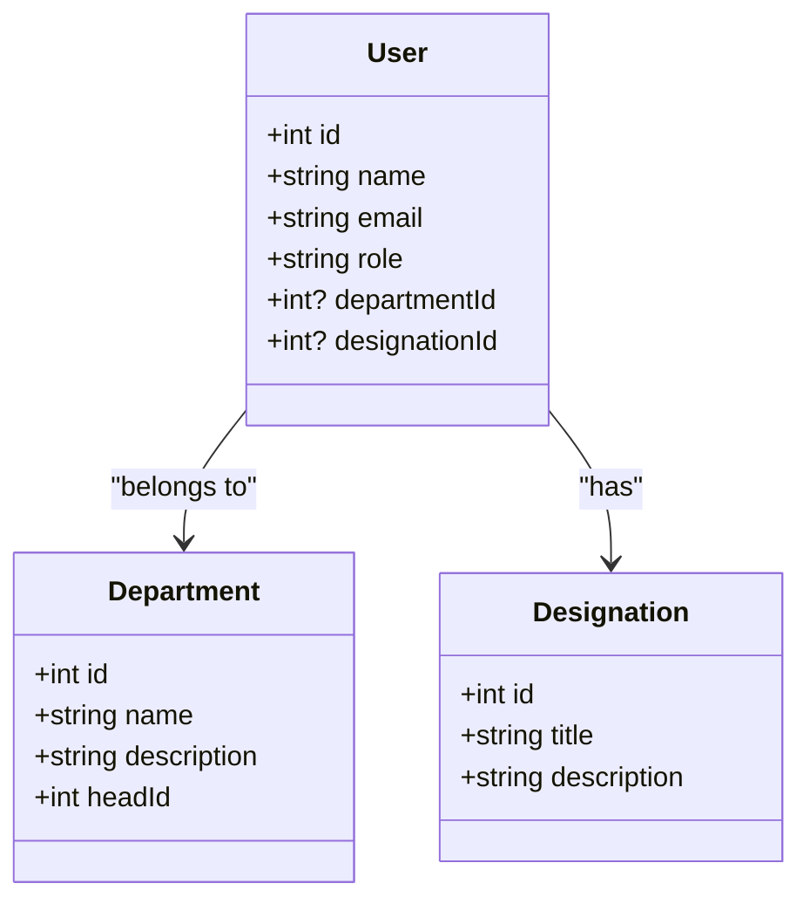
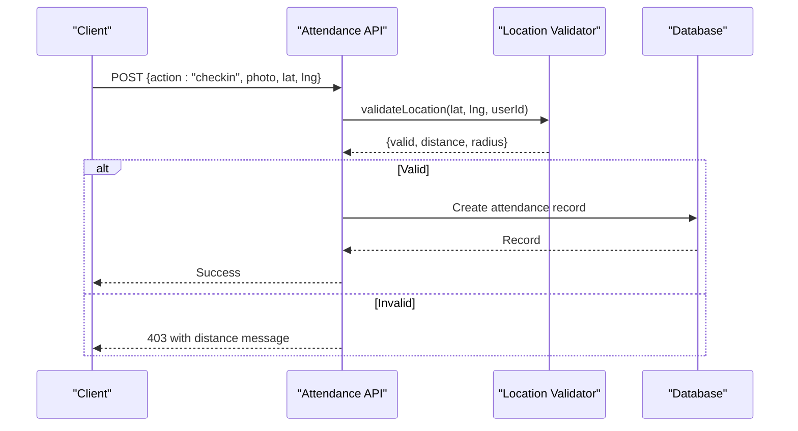
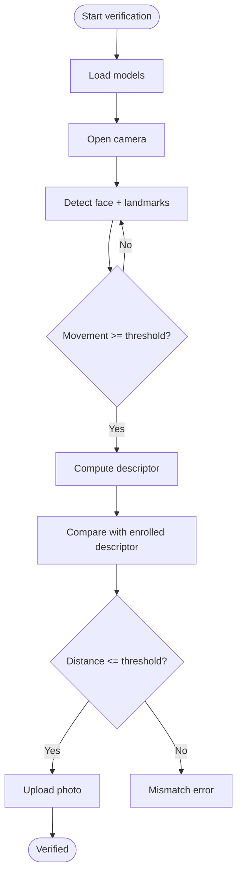
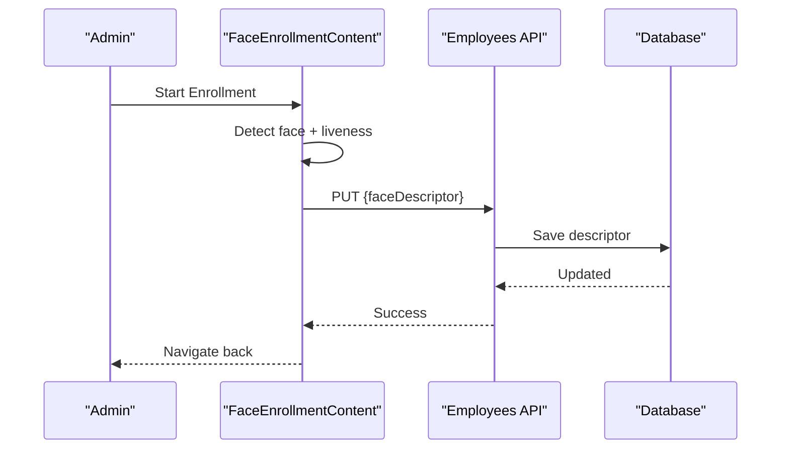
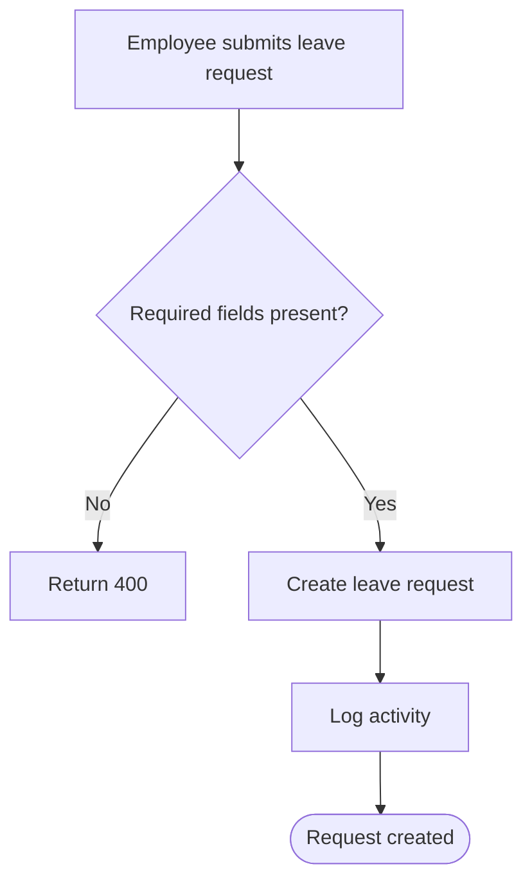
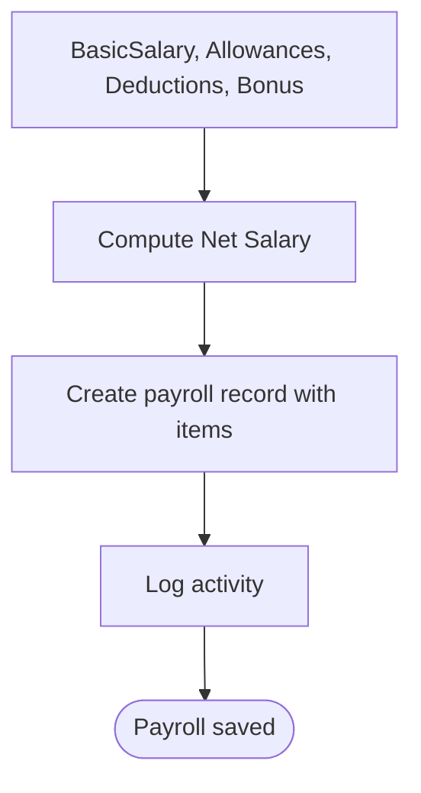
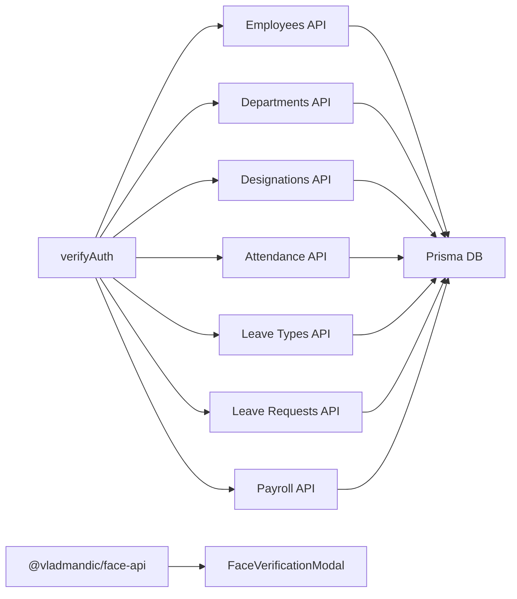

# HR Management System

<cite>
**Referenced Files in This Document**
- [schema.prisma](file://prisma/schema.prisma)
- [employees route.ts](file://src/app/api/hr/employees/route.ts)
- [departments route.ts](file://src/app/api/hr/departments/route.ts)
- [designations route.ts](file://src/app/api/hr/designations/route.ts)
- [attendance route.ts](file://src/app/api/hr/attendance/route.ts)
- [leave types route.ts](file://src/app/api/hr/leave/types/route.ts)
- [leave requests route.ts](file://src/app/api/hr/leave/requests/route.ts)
- [payroll route.ts](file://src/app/api/hr/payroll/route.ts)
- [face.ts](file://src/lib/face.ts)
- [FaceVerificationModal.tsx](file://src/components/hr/FaceVerificationModal.tsx)
- [CameraCapture.tsx](file://src/components/hr/CameraCapture.tsx)
- [FaceEnrollmentContent.tsx](file://src/app/hr/employees/[id]/face-enrollment/components/FaceEnrollmentContent.tsx)
</cite>

## Table of Contents
1. Introduction
2. Project Structure
3. Core Components
4. Architecture Overview
5. Detailed Component Analysis
6. Dependency Analysis
7. Performance Considerations
8. Troubleshooting Guide
9. Conclusion

## Introduction
This document explains the HR Management System with a focus on complete employee lifecycle management and attendance tracking. It covers:
- Employee directory, department structure, and designation hierarchy
- Advanced attendance system with face recognition verification, biometric scanning concepts, and real-time tracking
- Leave management (types, requests, balances, approvals)
- Payroll processing engine (salary calculations, deductions, scheduling)
- Face enrollment process, camera integration, and verification algorithms
- HR policy configuration, reporting, and employee communications
- Troubleshooting for attendance discrepancies and payroll calculation issues

## Project Structure
The HR module is implemented as a set of Next.js API routes under src/app/api/hr and supporting UI components under src/components/hr and src/app/hr. Data models are defined in Prisma schema.

**Diagram sources**
- [employees route.ts:1-108](file://src/app/api/hr/employees/route.ts#L1-L108)
- [departments route.ts:1-73](file://src/app/api/hr/departments/route.ts#L1-L73)
- [designations route.ts:1-70](file://src/app/api/hr/designations/route.ts#L1-L70)
- [attendance route.ts:1-241](file://src/app/api/hr/attendance/route.ts#L1-L241)
- [leave types route.ts:1-69](file://src/app/api/hr/leave/types/route.ts#L1-L69)
- [leave requests route.ts:1-84](file://src/app/api/hr/leave/requests/route.ts#L1-L84)
- [payroll route.ts:1-111](file://src/app/api/hr/payroll/route.ts#L1-L111)
- [FaceVerificationModal.tsx:1-511](file://src/components/hr/FaceVerificationModal.tsx#L1-L511)
- [CameraCapture.tsx:1-157](file://src/components/hr/CameraCapture.tsx#L1-L157)
- [FaceEnrollmentContent.tsx:1-383](file://src/app/hr/employees/[id]/face-enrollment/components/FaceEnrollmentContent.tsx#L1-L383)
- [schema.prisma:139-198](file://prisma/schema.prisma#L139-L198)

**Section sources**
- [schema.prisma:139-198](file://prisma/schema.prisma#L139-L198)
- [schema.prisma:227-259](file://prisma/schema.prisma#L227-L259)

## Core Components
- Employee Directory: CRUD via employees route; includes personal, employment, bank, and branch info; supports role-based access.
- Department Structure: Departments with head assignment and member counts.
- Designation Hierarchy: Designations with titles and descriptions.
- Attendance: Check-in/out with photo capture, geolocation validation against branch or office radius, and activity logging.
- Leave Management: Types and requests with filtering by status and user scope.
- Payroll: Monthly records with basic salary, allowances, deductions, bonus, net calculation, and line items.
- Face Recognition: Client-side detection, descriptor computation, liveness checks, and comparison against enrolled descriptors.

**Section sources**
- [employees route.ts:18-108](file://src/app/api/hr/employees/route.ts#L18-L108)
- [departments route.ts:18-73](file://src/app/api/hr/departments/route.ts#L18-L73)
- [designations route.ts:18-70](file://src/app/api/hr/designations/route.ts#L18-L70)
- [attendance route.ts:19-241](file://src/app/api/hr/attendance/route.ts#L19-L241)
- [leave types route.ts:18-69](file://src/app/api/hr/leave/types/route.ts#L18-L69)
- [leave requests route.ts:19-84](file://src/app/api/hr/leave/requests/route.ts#L19-L84)
- [payroll route.ts:19-111](file://src/app/api/hr/payroll/route.ts#L19-L111)
- [face.ts:1-68](file://src/lib/face.ts#L1-L68)

## Architecture Overview
The system uses a client-server architecture:
- Frontend components handle camera access, face detection, and user interactions.
- API routes enforce authentication, validate inputs, perform business logic, and persist data via Prisma.
- Face recognition runs in-browser using preloaded models to compute descriptors and compare against stored ones.

**Diagram sources**
- [FaceVerificationModal.tsx:187-345](file://src/components/hr/FaceVerificationModal.tsx#L187-L345)
- [attendance route.ts:127-181](file://src/app/api/hr/attendance/route.ts#L127-L181)

## Detailed Component Analysis

### Employee Lifecycle Management
- Create/Update Employees: Admin-only creation flow updates employee profile fields including department, designation, branch, and compensation details. Activity logs track changes.
- Role-Based Access: Non-admin users cannot create employees; GET lists non-admin/non-student users for HR views.

**Diagram sources**
- [employees route.ts:59-108](file://src/app/api/hr/employees/route.ts#L59-L108)

**Section sources**
- [employees route.ts:18-108](file://src/app/api/hr/employees/route.ts#L18-L108)
- [schema.prisma:139-198](file://prisma/schema.prisma#L139-L198)

### Department Structure and Designation Hierarchy
- Departments: List with head and member counts; create requires admin role; unique name enforced.
- Designations: List with member counts; create requires admin role; unique title enforced.

**Diagram sources**
- [departments route.ts:18-73](file://src/app/api/hr/departments/route.ts#L18-L73)
- [designations route.ts:18-70](file://src/app/api/hr/designations/route.ts#L18-L70)
- [schema.prisma:139-198](file://prisma/schema.prisma#L139-L198)

**Section sources**
- [departments route.ts:18-73](file://src/app/api/hr/departments/route.ts#L18-L73)
- [designations route.ts:18-70](file://src/app/api/hr/designations/route.ts#L18-L70)

### Advanced Attendance System
- Check-in/Check-out Flow: Requires photo and GPS; validates location within configured radius (branch-specific or global office); prevents duplicate entries; logs activities.
- Location Validation: Uses haversine distance against branch coordinates if available; otherwise falls back to system settings.

**Diagram sources**
- [attendance route.ts:19-64](file://src/app/api/hr/attendance/route.ts#L19-L64)
- [attendance route.ts:127-181](file://src/app/api/hr/attendance/route.ts#L127-L181)

**Section sources**
- [attendance route.ts:19-241](file://src/app/api/hr/attendance/route.ts#L19-L241)

### Face Recognition and Biometric Scanning
- Models and Detection: Loads Tiny Face Detector, Landmarks, and Recognition networks; detects single face with landmarks and descriptor.
- Liveness: Tracks head movement across frames to ensure live presence before capturing descriptor.
- Verification: Computes Euclidean distance between captured and enrolled descriptors; threshold-based match decision.

**Diagram sources**
- [face.ts:7-68](file://src/lib/face.ts#L7-L68)
- [FaceVerificationModal.tsx:187-345](file://src/components/hr/FaceVerificationModal.tsx#L187-L345)

**Section sources**
- [face.ts:1-68](file://src/lib/face.ts#L1-L68)
- [FaceVerificationModal.tsx:1-511](file://src/components/hr/FaceVerificationModal.tsx#L1-L511)

### Face Enrollment Process
- Enrollment Flow: Captures live face, computes descriptor, saves to employee record; shows success/error states; navigates back to employee list.
- Re-enrollment: Allows retake and re-save; indicates if already enrolled.

**Diagram sources**
- [FaceEnrollmentContent.tsx:197-238](file://src/app/hr/employees/[id]/face-enrollment/components/FaceEnrollmentContent.tsx#L197-L238)
- [employees route.ts:59-108](file://src/app/api/hr/employees/route.ts#L59-L108)

**Section sources**
- [FaceEnrollmentContent.tsx:1-383](file://src/app/hr/employees/[id]/face-enrollment/components/FaceEnrollmentContent.tsx#L1-L383)

### Leave Management System
- Leave Types: Admin can create leave types with annual day limits; read access for all authenticated users.
- Leave Requests: Employees submit requests with dates and reason; admins filter by status; includes approver and leave type metadata.

**Diagram sources**
- [leave requests route.ts:47-84](file://src/app/api/hr/leave/requests/route.ts#L47-L84)

**Section sources**
- [leave types route.ts:18-69](file://src/app/api/hr/leave/types/route.ts#L18-L69)
- [leave requests route.ts:19-84](file://src/app/api/hr/leave/requests/route.ts#L19-L84)

### Payroll Processing Engine
- Calculation: Net salary = basic salary + allowances + bonus - deductions; stores monthly breakdown with line items.
- Access Control: Admins view all; regular users see only their own payroll records.

**Diagram sources**
- [payroll route.ts:55-111](file://src/app/api/hr/payroll/route.ts#L55-L111)

**Section sources**
- [payroll route.ts:19-111](file://src/app/api/hr/payroll/route.ts#L19-L111)

### Camera Integration and Photo Capture
- Simple Capture: Streams camera, captures frame to canvas, uploads via upload endpoint, returns URL for use in attendance flows.
- Verification Modal: Integrates geolocation, face detection, liveness, and verification steps into a guided modal.

**Section sources**
- [CameraCapture.tsx:1-157](file://src/components/hr/CameraCapture.tsx#L1-L157)
- [FaceVerificationModal.tsx:1-511](file://src/components/hr/FaceVerificationModal.tsx#L1-L511)

## Dependency Analysis
- Authentication: All routes verify sessions via cookies and token verification.
- Database: Prisma client used across routes; relationships include User to Department, Designation, Branch, Attendance, LeaveBalances, LeaveRequests, Payroll.
- External Libraries: Face recognition via @vladmandic/face-api; models served from /models.

**Diagram sources**
- [employees route.ts:1-108](file://src/app/api/hr/employees/route.ts#L1-L108)
- [departments route.ts:1-73](file://src/app/api/hr/departments/route.ts#L1-L73)
- [designations route.ts:1-70](file://src/app/api/hr/designations/route.ts#L1-L70)
- [attendance route.ts:1-241](file://src/app/api/hr/attendance/route.ts#L1-L241)
- [leave types route.ts:1-69](file://src/app/api/hr/leave/types/route.ts#L1-L69)
- [leave requests route.ts:1-84](file://src/app/api/hr/leave/requests/route.ts#L1-L84)
- [payroll route.ts:1-111](file://src/app/api/hr/payroll/route.ts#L1-L111)
- [face.ts:1-68](file://src/lib/face.ts#L1-L68)

**Section sources**
- [schema.prisma:139-198](file://prisma/schema.prisma#L139-L198)
- [schema.prisma:227-259](file://prisma/schema.prisma#L227-L259)

## Performance Considerations
- Face Model Loading: Models are loaded once and cached; avoid repeated loads per detection cycle.
- Geolocation Validation: Use branch-level coordinates when available to reduce fallback computations.
- Attendance Queries: Filter by date ranges and user IDs to limit dataset size; leverage ordering parameters efficiently.
- Payroll Generation: Batch-create line items to minimize round trips; compute net salary server-side for consistency.

[No sources needed since this section provides general guidance]

## Troubleshooting Guide

### Attendance Discrepancies
- Duplicate Entries: Ensure check-in/check-out guards prevent multiple entries per day; verify unique constraints on userId_date.
- Location Errors: Confirm branch coordinates or system office settings; validate radius thresholds; check GPS permissions.
- Photo Requirements: Enforce mandatory photo capture for both check-in and check-out; handle upload failures gracefully.

**Section sources**
- [attendance route.ts:127-241](file://src/app/api/hr/attendance/route.ts#L127-L241)
- [schema.prisma:227-259](file://prisma/schema.prisma#L227-L259)

### Payroll Calculation Issues
- Missing Fields: Validate required fields (userId, month, year) before creating payroll records.
- Net Salary Formula: Verify allowances, deductions, and bonus are correctly summed; ensure basic salary is numeric.
- Line Items: Ensure items array contains label, type, and amount; sanitize amounts to floats.

**Section sources**
- [payroll route.ts:55-111](file://src/app/api/hr/payroll/route.ts#L55-L111)

### Face Recognition Failures
- Model Load Errors: Handle model loading exceptions; prompt users to refresh and retry.
- Camera Permissions: Provide clear errors when camera access is denied; guide users to enable permissions.
- Liveness Thresholds: Adjust movement thresholds and frame counts if false negatives occur; monitor similarity scores.

**Section sources**
- [face.ts:7-68](file://src/lib/face.ts#L7-L68)
- [FaceVerificationModal.tsx:187-345](file://src/components/hr/FaceVerificationModal.tsx#L187-L345)

## Conclusion
The HR Management System provides a robust foundation for managing employees, departments, designations, attendance, leave, and payroll. The integrated face recognition and camera workflows enhance security and accuracy for attendance tracking. With clear API boundaries, role-based access control, and comprehensive logging, the system supports scalable HR operations and reliable reporting.

[No sources needed since this section summarizes without analyzing specific files]