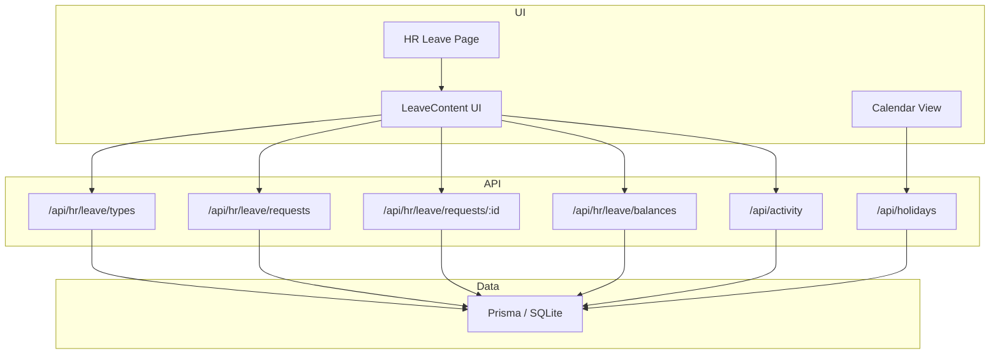
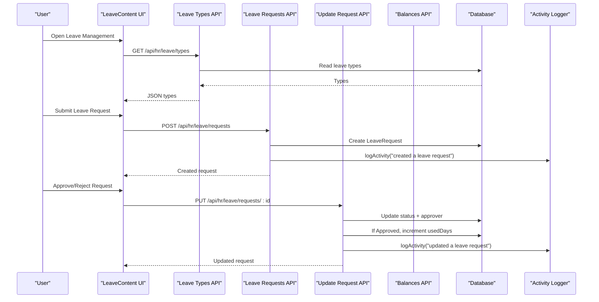
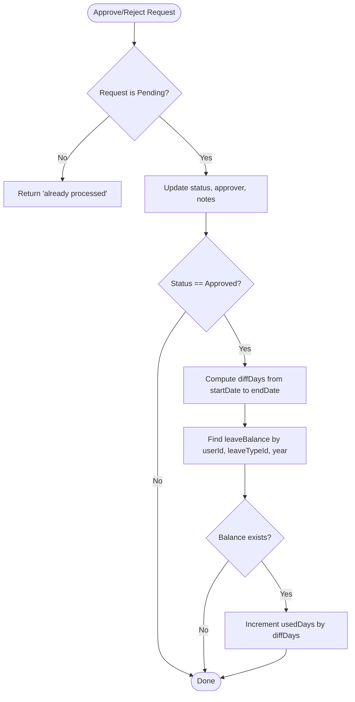
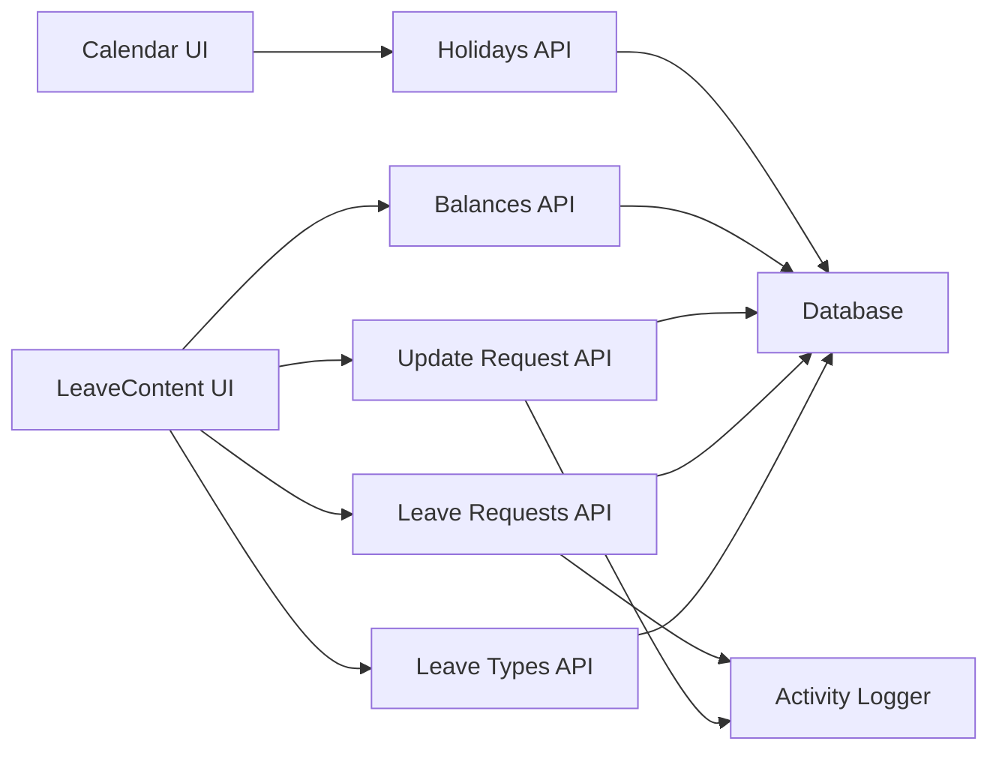

# Leave Management System

<cite>
**Referenced Files in This Document**
- [schema.prisma](file://prisma/schema.prisma)
- [route.ts (Leave Types)](file://src/app/api/hr/leave/types/route.ts)
- [route.ts (Leave Requests)](file://src/app/api/hr/leave/requests/route.ts)
- [route.ts (Update Request)](file://src/app/api/hr/leave/requests/[id]/route.ts)
- [route.ts (Leave Balances)](file://src/app/api/hr/leave/balances/route.ts)
- [LeaveContent.tsx](file://src/app/hr/leave/components/LeaveContent.tsx)
- [page.tsx (HR Leave Page)](file://src/app/hr/leave/page.tsx)
- [route.ts (Holidays)](file://src/app/api/holidays/route.ts)
- [CalendarContent.tsx](file://src/app/calendar/CalendarContent.tsx)
- [activity.ts](file://src/lib/activity.ts)
- [route.ts (Activity Log API)](file://src/app/api/activity/route.ts)
</cite>

## Table of Contents
1. Introduction
2. Project Structure
3. Core Components
4. Architecture Overview
5. Detailed Component Analysis
6. Dependency Analysis
7. Performance Considerations
8. Troubleshooting Guide
9. Conclusion
10. Appendices

## Introduction
This document explains the Leave Management System implemented in the repository. It covers leave type configuration, request submission and approval workflows, balance tracking, holiday calendar integration, audit trails, and reporting surfaces. It also provides guidance for configuring policies, setting up approvals, and managing balances. The system is built on a Next.js server with Prisma data access and a SQLite database.

## Project Structure
The leave management feature spans several routes and UI components:
- Data model definitions are centralized in the Prisma schema.
- REST endpoints under src/app/api/hr/leave expose CRUD operations for leave types, requests, and balances.
- A dedicated HR page renders the leave management interface.
- Holidays are managed via a separate endpoint and integrated into the global calendar view.
- Audit logging and notifications are handled by shared utilities.

**Diagram sources**
- [page.tsx (HR Leave Page):1-17](file://src/app/hr/leave/page.tsx#L1-L17)
- [LeaveContent.tsx:56-122](file://src/app/hr/leave/components/LeaveContent.tsx#L56-L122)
- [route.ts (Leave Types):18-69](file://src/app/api/hr/leave/types/route.ts#L18-L69)
- [route.ts (Leave Requests):19-84](file://src/app/api/hr/leave/requests/route.ts#L19-L84)
- [route.ts (Update Request):18-100](file://src/app/api/hr/leave/requests/[id]/route.ts#L18-L100)
- [route.ts (Leave Balances):18-45](file://src/app/api/hr/leave/balances/route.ts#L18-L45)
- [route.ts (Holidays):7-83](file://src/app/api/holidays/route.ts#L7-L83)
- [CalendarContent.tsx:85-98](file://src/app/calendar/CalendarContent.tsx#L85-L98)
- [route.ts (Activity Log API):18-38](file://src/app/api/activity/route.ts#L18-L38)

**Section sources**
- [page.tsx (HR Leave Page):1-17](file://src/app/hr/leave/page.tsx#L1-L17)
- [LeaveContent.tsx:56-122](file://src/app/hr/leave/components/LeaveContent.tsx#L56-L122)
- [route.ts (Leave Types):18-69](file://src/app/api/hr/leave/types/route.ts#L18-L69)
- [route.ts (Leave Requests):19-84](file://src/app/api/hr/leave/requests/route.ts#L19-L84)
- [route.ts (Update Request):18-100](file://src/app/api/hr/leave/requests/[id]/route.ts#L18-L100)
- [route.ts (Leave Balances):18-45](file://src/app/api/hr/leave/balances/route.ts#L18-L45)
- [route.ts (Holidays):7-83](file://src/app/api/holidays/route.ts#L7-L83)
- [CalendarContent.tsx:85-98](file://src/app/calendar/CalendarContent.tsx#L85-L98)
- [route.ts (Activity Log API):18-38](file://src/app/api/activity/route.ts#L18-L38)

## Core Components
- Leave Types: Define categories such as casual, sick, annual, maternity, or custom types with an annual allowance field.
- Leave Requests: Capture employee-submitted requests with date ranges and reasons; support filtering by status.
- Approval Workflow: Admins approve or reject requests; approved requests update used days in balances.
- Leave Balances: Track per-user, per-type, per-year totals and usage.
- Holiday Calendar: Centralized holidays that integrate with the team calendar view.
- Audit Trail: Activity logs record key actions and changes.

Key responsibilities:
- Route handlers enforce authentication and role-based access.
- UI components orchestrate data fetching, form submissions, and user feedback.
- Shared activity logging records actions and can trigger notifications.

**Section sources**
- [schema.prisma:687-732](file://prisma/schema.prisma#L687-L732)
- [route.ts (Leave Types):18-69](file://src/app/api/hr/leave/types/route.ts#L18-L69)
- [route.ts (Leave Requests):19-84](file://src/app/api/hr/leave/requests/route.ts#L19-L84)
- [route.ts (Update Request):18-100](file://src/app/api/hr/leave/requests/[id]/route.ts#L18-L100)
- [route.ts (Leave Balances):18-45](file://src/app/api/hr/leave/balances/route.ts#L18-L45)
- [LeaveContent.tsx:56-122](file://src/app/hr/leave/components/LeaveContent.tsx#L56-L122)
- [activity.ts:60-113](file://src/lib/activity.ts#L60-L113)

## Architecture Overview
The system follows a layered architecture:
- Presentation layer: Next.js pages and client components render interfaces for leave administration and calendar views.
- API layer: Route handlers validate sessions, enforce roles, and perform business logic.
- Data layer: Prisma queries interact with SQLite to persist leave types, requests, balances, and holidays.
- Cross-cutting: Activity logging and notifications are invoked from route handlers.

**Diagram sources**
- [LeaveContent.tsx:56-122](file://src/app/hr/leave/components/LeaveContent.tsx#L56-L122)
- [route.ts (Leave Types):18-69](file://src/app/api/hr/leave/types/route.ts#L18-L69)
- [route.ts (Leave Requests):19-84](file://src/app/api/hr/leave/requests/route.ts#L19-L84)
- [route.ts (Update Request):18-100](file://src/app/api/hr/leave/requests/[id]/route.ts#L18-L100)
- [activity.ts:60-113](file://src/lib/activity.ts#L60-L113)

## Detailed Component Analysis

### Leave Type Configuration
- Purpose: Define available leave categories and their annual allowances.
- Capabilities:
  - List all leave types.
  - Create new types with name, description, and daysPerYear.
  - Enforce unique names at the database level.
- Access control: Only Admin/Super Admin can create types.

Operational notes:
- GET returns all types ordered by name.
- POST validates required fields and persists via Prisma.
- Duplicate names return a conflict error.

**Section sources**
- [schema.prisma:687-696](file://prisma/schema.prisma#L687-L696)
- [route.ts (Leave Types):18-69](file://src/app/api/hr/leave/types/route.ts#L18-L69)

### Leave Request Submission and Status Tracking
- Purpose: Allow employees to submit leave requests and track their lifecycle.
- Capabilities:
  - Create requests with leaveTypeId, startDate, endDate, reason.
  - Filter requests by status (Pending, Approved, Rejected).
  - Include related user and leave type details in responses.
- Access control: Authenticated users can create; admins can list all; non-admins see only their own.

Operational notes:
- Missing fields return validation errors.
- Activity is logged upon creation.

**Section sources**
- [schema.prisma:714-732](file://prisma/schema.prisma#L714-L732)
- [route.ts (Leave Requests):19-84](file://src/app/api/hr/leave/requests/route.ts#L19-L84)

### Approval Workflow and Balance Updates
- Purpose: Enable admin approval/rejection and maintain accurate leave balances.
- Capabilities:
  - Update request status to Approved or Rejected.
  - Record approver and optional notes.
  - On approval, calculate duration and increment usedDays in the corresponding leaveBalance for the year.
- Guardrails:
  - Only pending requests can be updated.
  - Role check ensures only authorized users can approve.

Operational notes:
- Duration calculation uses inclusive day count between start and end dates.
- Activity logging captures before/after differences.

**Diagram sources**
- [route.ts (Update Request):18-100](file://src/app/api/hr/leave/requests/[id]/route.ts#L18-L100)

**Section sources**
- [route.ts (Update Request):18-100](file://src/app/api/hr/leave/requests/[id]/route.ts#L18-L100)

### Leave Balance Calculation and Reporting
- Purpose: Track per-user, per-type, per-year leave balances and usage.
- Capabilities:
  - Query balances filtered by year and optionally by user.
  - Include leave type and user details for reporting.
  - Enforce role-based visibility: admins see all; others see their own unless explicitly filtered.

Operational notes:
- Default year is current year if not provided.
- Ordering supports administrative review by user and type.

**Section sources**
- [schema.prisma:698-712](file://prisma/schema.prisma#L698-L712)
- [route.ts (Leave Balances):18-45](file://src/app/api/hr/leave/balances/route.ts#L18-L45)

### Team Leave Calendar Integration
- Purpose: Visualize leaves alongside other events and holidays.
- Capabilities:
  - Fetch events and holidays for a month range.
  - Filter events by type including leave.
  - Manage holidays through a modal and API.

Operational notes:
- Calendar loads both events and holidays concurrently.
- Holidays are stored centrally and displayed across the application.

**Section sources**
- [CalendarContent.tsx:85-98](file://src/app/calendar/CalendarContent.tsx#L85-L98)
- [route.ts (Holidays):7-83](file://src/app/api/holidays/route.ts#L7-L83)

### Audit Trails and Notifications
- Purpose: Provide an auditable history of actions and notify stakeholders.
- Capabilities:
  - Log activities with actor, action, target, and change diffs.
  - Automatically create notifications for certain actions.
  - Expose activity logs via API for admin review.

Operational notes:
- Activities include timestamps and optional change details.
- Notification creation is automatic for specific actions.

**Section sources**
- [activity.ts:60-113](file://src/lib/activity.ts#L60-L113)
- [route.ts (Activity Log API):18-38](file://src/app/api/activity/route.ts#L18-L38)

## Dependency Analysis
The leave module depends on:
- Authentication/session verification for protected routes.
- Prisma models for leave types, requests, balances, and holidays.
- Activity logger for audit trails and notifications.
- Calendar UI for visualizing leaves and holidays.

**Diagram sources**
- [route.ts (Leave Types):18-69](file://src/app/api/hr/leave/types/route.ts#L18-L69)
- [route.ts (Leave Requests):19-84](file://src/app/api/hr/leave/requests/route.ts#L19-L84)
- [route.ts (Update Request):18-100](file://src/app/api/hr/leave/requests/[id]/route.ts#L18-L100)
- [route.ts (Leave Balances):18-45](file://src/app/api/hr/leave/balances/route.ts#L18-L45)
- [route.ts (Holidays):7-83](file://src/app/api/holidays/route.ts#L7-L83)
- [LeaveContent.tsx:56-122](file://src/app/hr/leave/components/LeaveContent.tsx#L56-L122)
- [CalendarContent.tsx:85-98](file://src/app/calendar/CalendarContent.tsx#L85-L98)
- [activity.ts:60-113](file://src/lib/activity.ts#L60-L113)

**Section sources**
- [schema.prisma:687-732](file://prisma/schema.prisma#L687-L732)
- [activity.ts:60-113](file://src/lib/activity.ts#L60-L113)

## Performance Considerations
- Batched reads: The UI fetches requests and types concurrently to reduce latency.
- Indexed queries: Database indexes on userId and status improve query performance for requests and balances.
- Minimal payloads: Responses select only necessary fields to reduce network overhead.
- Efficient updates: Approval updates compute durations server-side and update balances in a single transaction-like sequence.

[No sources needed since this section provides general guidance]

## Troubleshooting Guide
Common issues and resolutions:
- Unauthorized access: Ensure a valid session token is present; verify role permissions for admin-only endpoints.
- Validation errors: Confirm required fields are provided when creating requests or types.
- Already processed: Attempting to update a non-pending request will fail; ensure workflow state is correct.
- Duplicate leave type: Names must be unique; resolve conflicts before creating new types.
- Holiday conflicts: Creating a holiday on an existing date returns a conflict error.

Operational tips:
- Use the audit trail to trace actions and changes.
- Verify balances after approvals to ensure usedDays were incremented correctly.

**Section sources**
- [route.ts (Leave Types):33-69](file://src/app/api/hr/leave/types/route.ts#L33-L69)
- [route.ts (Leave Requests):47-84](file://src/app/api/hr/leave/requests/route.ts#L47-L84)
- [route.ts (Update Request):18-100](file://src/app/api/hr/leave/requests/[id]/route.ts#L18-L100)
- [route.ts (Holidays):23-83](file://src/app/api/holidays/route.ts#L23-L83)
- [route.ts (Activity Log API):18-38](file://src/app/api/activity/route.ts#L18-L38)

## Conclusion
The Leave Management System provides a robust foundation for managing leave types, requests, approvals, balances, and holidays. It integrates with a unified calendar and maintains comprehensive audit trails. While core functionality is complete, organizations may extend it with advanced policy enforcement, multi-level approvals, accrual rules, carry-forward policies, encashment handling, and deeper payroll integrations as needed.

[No sources needed since this section summarizes without analyzing specific files]

## Appendices

### Example Workflows

- Submitting a leave request:
  - Navigate to the HR Leave page and open the “Apply Leave” modal.
  - Select a leave type, choose start and end dates, provide a reason, and submit.
  - The request appears in the table with status Pending.

- Approving or rejecting applications:
  - From the leave table, click Approve or Reject on a Pending request.
  - For approvals, the system increments usedDays in the corresponding balance for the year.
  - Actions are recorded in the audit trail.

- Viewing team leave calendars:
  - Open the Calendar page to see leave events alongside tasks, payments, and holidays.
  - Use filters to focus on leave events.

- Generating leave reports:
  - Use the balances endpoint to retrieve per-user, per-type, per-year usage.
  - Combine with the activity log to analyze trends and compliance.

[No sources needed since this section provides conceptual guidance]

### Policy Enforcement, Conflict Resolution, and Audit Trails
- Policy enforcement:
  - Enforce minimum notice periods and maximum consecutive days on the client or server before submission.
  - Validate against holidays to prevent invalid date ranges.

- Conflict resolution:
  - Detect overlapping requests for the same user and type within a period.
  - Implement escalation rules for edge cases (e.g., insufficient balance).

- Audit trails:
  - Review activity logs for all create/update/delete actions.
  - Export logs for compliance and investigations.

[No sources needed since this section provides conceptual guidance]

### Integrations

- Attendance system:
  - Correlate attendance records with approved leaves to mark eligible days as absent due to leave.
  - Use attendance summaries to reconcile leave usage.

- Holiday calendar:
  - Maintain holidays centrally and display them in the team calendar.
  - Exclude holidays from leave duration calculations where appropriate.

- Payroll processing:
  - Use approved leave data to adjust deductions or allowances in payroll runs.
  - Integrate with payroll items to reflect leave-related earnings or deductions.

[No sources needed since this section provides conceptual guidance]

### Guidelines for Configuration and Management

- Configure leave policies:
  - Define leave types with appropriate daysPerYear values.
  - Set organizational rules around eligibility and limits.

- Set up approval workflows:
  - Restrict approval rights to Admin/Super Admin roles.
  - Capture approver identity and notes for transparency.

- Manage leave balances:
  - Ensure balances exist per user/type/year.
  - Monitor usedDays growth after approvals.
  - Periodically reconcile balances with historical requests.

[No sources needed since this section provides conceptual guidance]