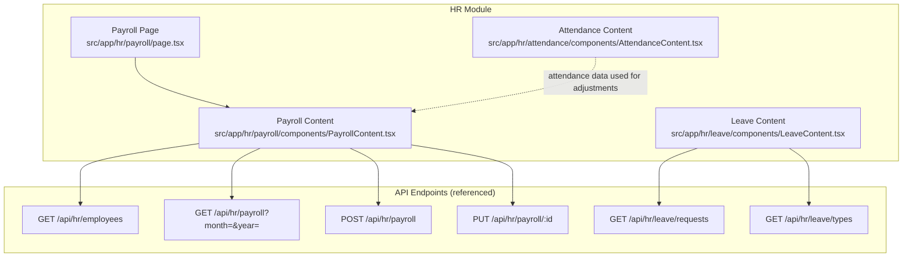
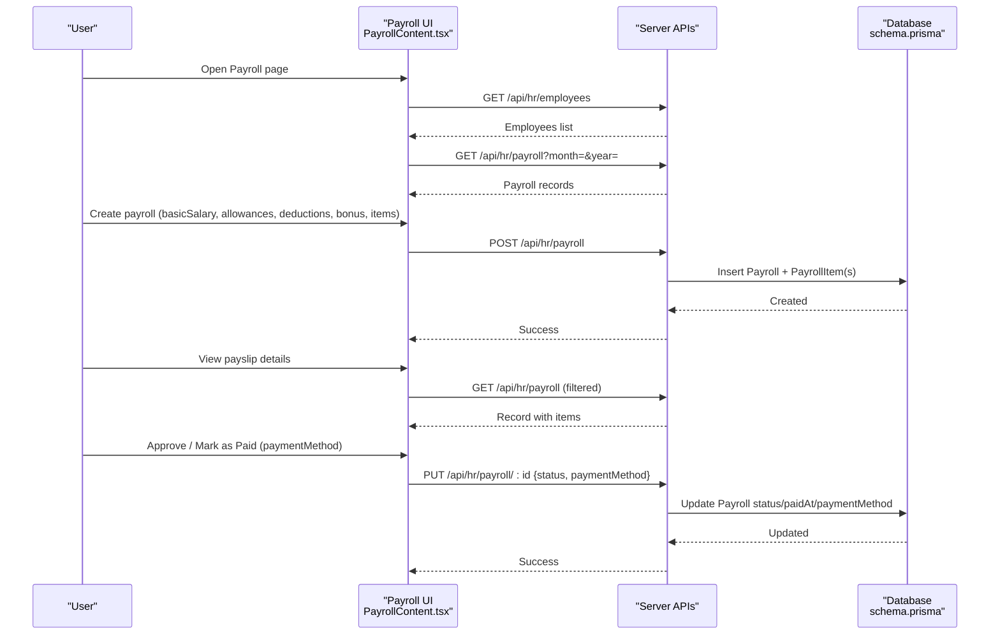
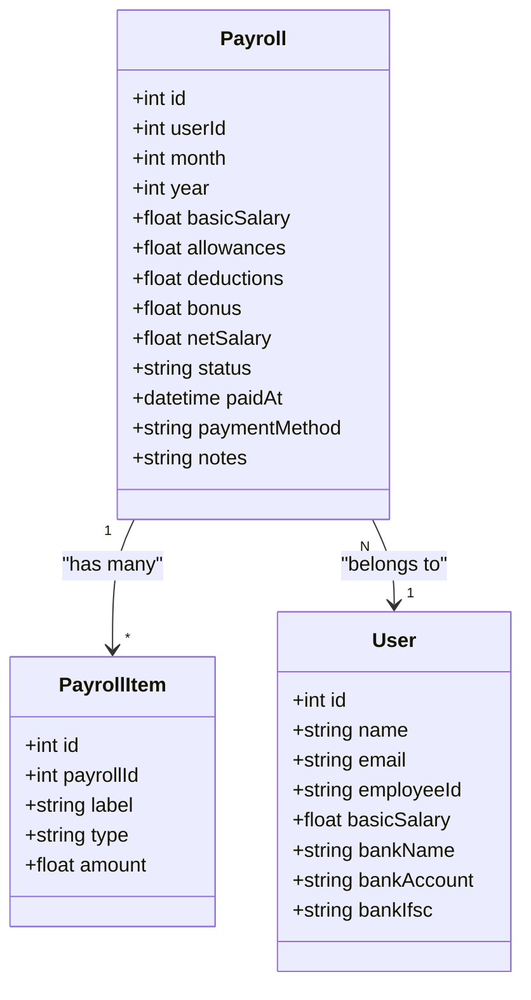
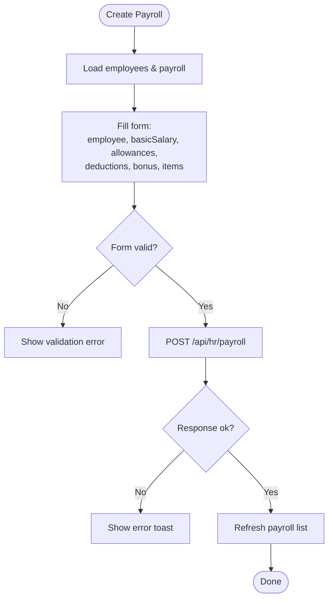
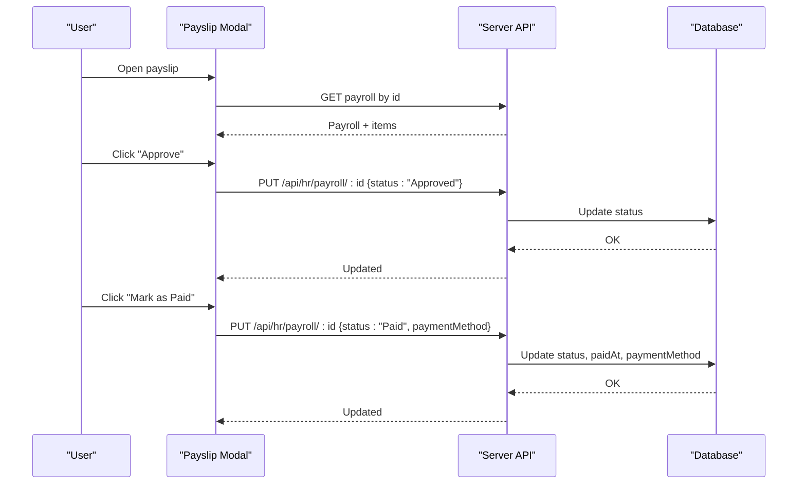
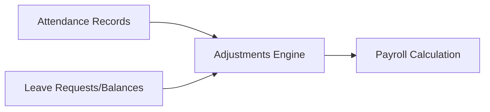
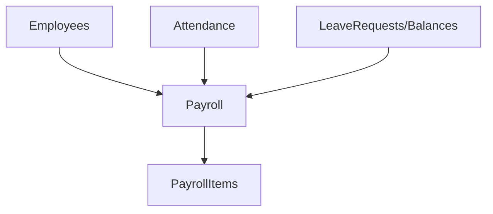

# Payroll Processing Engine

<cite>
**Referenced Files in This Document**
- [schema.prisma](file://prisma/schema.prisma)
- [page.tsx](file://src/app/hr/payroll/page.tsx)
- [PayrollContent.tsx](file://src/app/hr/payroll/components/PayrollContent.tsx)
- [AttendanceContent.tsx](file://src/app/hr/attendance/components/AttendanceContent.tsx)
- [LeaveContent.tsx](file://src/app/hr/leave/components/LeaveContent.tsx)
</cite>

## Table of Contents
1. [Introduction](#introduction)
2. [Project Structure](#project-structure)
3. [Core Components](#core-components)
4. [Architecture Overview](#architecture-overview)
5. [Detailed Component Analysis](#detailed-component-analysis)
6. [Dependency Analysis](#dependency-analysis)
7. [Performance Considerations](#performance-considerations)
8. [Troubleshooting Guide](#troubleshooting-guide)
9. [Conclusion](#conclusion)
10. [Appendices](#appendices)

## Introduction
This document describes the Payroll Processing Engine for salary calculations and payment management. It explains how payroll records are created, how earnings and deductions are composed, how payslips are generated and marked as paid, and how attendance and leave data can be integrated to adjust salaries. It also outlines configuration guidance for pay components, tax rules, scheduling, and reporting considerations based on the available codebase.

## Project Structure
The payroll feature is implemented as a Next.js client component with server-side API endpoints referenced by the UI. The core UI lives under the HR module and interacts with REST endpoints for employees, payroll, attendance, and leave data.

**Diagram sources**
- [page.tsx:1-17](file://src/app/hr/payroll/page.tsx#L1-L17)
- [PayrollContent.tsx:119-197](file://src/app/hr/payroll/components/PayrollContent.tsx#L119-L197)
- [LeaveContent.tsx:56-122](file://src/app/hr/leave/components/LeaveContent.tsx#L56-L122)
- [AttendanceContent.tsx:1-200](file://src/app/hr/attendance/components/AttendanceContent.tsx#L1-L200)

**Section sources**
- [page.tsx:1-17](file://src/app/hr/payroll/page.tsx#L1-L17)
- [PayrollContent.tsx:119-197](file://src/app/hr/payroll/components/PayrollContent.tsx#L119-L197)
- [LeaveContent.tsx:56-122](file://src/app/hr/leave/components/LeaveContent.tsx#L56-L122)
- [AttendanceContent.tsx:1-200](file://src/app/hr/attendance/components/AttendanceContent.tsx#L1-L200)

## Core Components
- Payroll record model: Stores monthly payroll per employee with basic salary, allowances, deductions, bonus, net salary, status, payment method, and timestamps. Each payroll has multiple line items for detailed earnings/deductions.
- Payroll item model: Captures label, type (Earnings/Deductions), and amount for granular breakdowns.
- Employee model: Contains basic salary and bank details that can be used for payroll initialization and payments.
- Attendance model: Tracks check-in/out times, status, photos, and location; supports overtime and late/absent logic for deductions or bonuses.
- Leave models: LeaveType, LeaveBalance, and LeaveRequest enable unpaid leave tracking and approval workflows that can influence deductions.

Key behaviors observed in the UI:
- Net salary calculation: Basic Salary + Allowances + Bonus - Deductions.
- Custom items: Earnings and Deductions line items can be added per payroll entry.
- Status workflow: Draft -> Approved -> Paid, with optional payment method recorded.
- Payslip detail view: Displays all components and line items for transparency.

**Section sources**
- [schema.prisma:734-768](file://prisma/schema.prisma#L734-L768)
- [schema.prisma:139-198](file://prisma/schema.prisma#L139-L198)
- [schema.prisma:664-732](file://prisma/schema.prisma#L664-L732)
- [PayrollContent.tsx:81-83](file://src/app/hr/payroll/components/PayrollContent.tsx#L81-L83)
- [PayrollContent.tsx:155-197](file://src/app/hr/payroll/components/PayrollContent.tsx#L155-L197)
- [PayrollContent.tsx:730-800](file://src/app/hr/payroll/components/PayrollContent.tsx#L730-L800)

## Architecture Overview
The payroll engine is a client-driven flow backed by server APIs and a relational database. The UI orchestrates data fetching, user interactions, and state updates, while the database persists payroll records and related entities.

**Diagram sources**
- [PayrollContent.tsx:119-197](file://src/app/hr/payroll/components/PayrollContent.tsx#L119-L197)
- [schema.prisma:734-768](file://prisma/schema.prisma#L734-L768)

## Detailed Component Analysis

### Payroll Data Model and Calculations
- Payroll aggregates: basicSalary, allowances, deductions, bonus, netSalary, status, paidAt, paymentMethod, notes.
- PayrollItem: label, type (Earnings/Deductions), amount.
- Net salary formula used in UI: basicSalary + allowances + bonus - deductions.
- Items allow flexible composition of earnings and deductions beyond standard fields.

**Diagram sources**
- [schema.prisma:734-768](file://prisma/schema.prisma#L734-L768)
- [schema.prisma:139-198](file://prisma/schema.prisma#L139-L198)

**Section sources**
- [schema.prisma:734-768](file://prisma/schema.prisma#L734-L768)
- [schema.prisma:139-198](file://prisma/schema.prisma#L139-L198)
- [PayrollContent.tsx:81-83](file://src/app/hr/payroll/components/PayrollContent.tsx#L81-L83)

### Payroll Creation Flow
- Fetch employees and existing payroll for the selected month/year.
- Compose form with employee selection, basic salary, allowances, deductions, bonus, and custom items.
- Submit creates a new payroll record and associated items.
- Errors are surfaced via toast notifications.

**Diagram sources**
- [PayrollContent.tsx:119-177](file://src/app/hr/payroll/components/PayrollContent.tsx#L119-L177)

**Section sources**
- [PayrollContent.tsx:119-177](file://src/app/hr/payroll/components/PayrollContent.tsx#L119-L177)

### Payslip Detail and Payment Workflow
- Payslip modal shows all components and line items.
- Status transitions include Approve and Mark as Paid with optional payment method.
- Paid records capture paidAt and paymentMethod.

**Diagram sources**
- [PayrollContent.tsx:179-197](file://src/app/hr/payroll/components/PayrollContent.tsx#L179-L197)
- [PayrollContent.tsx:845-850](file://src/app/hr/payroll/components/PayrollContent.tsx#L845-L850)
- [schema.prisma:734-756](file://prisma/schema.prisma#L734-L756)

**Section sources**
- [PayrollContent.tsx:179-197](file://src/app/hr/payroll/components/PayrollContent.tsx#L179-L197)
- [PayrollContent.tsx:845-850](file://src/app/hr/payroll/components/PayrollContent.tsx#L845-L850)
- [schema.prisma:734-756](file://prisma/schema.prisma#L734-L756)

### Integration with Attendance and Leave
- Attendance records provide presence, late, absent statuses and timestamps that can inform overtime and deductions.
- Leave requests and balances support unpaid leaves and approvals that should reduce payable amounts.
- While direct automatic integration is not visible in the current UI, the data structures exist to compute adjustments during payroll processing.

[No sources needed since this diagram shows conceptual workflow, not actual code structure]

**Section sources**
- [schema.prisma:664-732](file://prisma/schema.prisma#L664-L732)
- [AttendanceContent.tsx:1-200](file://src/app/hr/attendance/components/AttendanceContent.tsx#L1-L200)
- [LeaveContent.tsx:56-122](file://src/app/hr/leave/components/LeaveContent.tsx#L56-L122)

### Payroll Cycle Configuration, Scheduling, and Reporting
- Cycle: Monthly payroll filtered by month and year in the UI.
- Scheduling: Not implemented in the UI; can be extended with background jobs to auto-generate drafts each cycle.
- Reporting: Current UI provides totals and counts; additional reports can be built using the same data endpoints.

[No sources needed since this section provides general guidance]

### Tax Rules, Pay Components, and Compensation Policies
- Pay components: Basic salary, allowances, bonus, deductions, and custom items.
- Tax rules: Not explicitly modeled in the schema; can be implemented as deduction items or a dedicated tax rule engine feeding into deductions.
- Compensation policies: Can be enforced by validating inputs and applying policy-based defaults when creating payroll entries.

[No sources needed since this section provides general guidance]

## Dependency Analysis
- UI dependencies:
  - PayrollContent depends on employee listing and payroll endpoints.
  - LeaveContent depends on leave requests and types endpoints.
  - AttendanceContent displays attendance data useful for payroll adjustments.
- Data dependencies:
  - Payroll references User via userId.
  - PayrollItem references Payroll via payrollId.
  - Attendance and Leave models relate to User for per-employee metrics.

**Diagram sources**
- [schema.prisma:734-768](file://prisma/schema.prisma#L734-L768)
- [schema.prisma:664-732](file://prisma/schema.prisma#L664-L732)
- [schema.prisma:139-198](file://prisma/schema.prisma#L139-L198)

**Section sources**
- [schema.prisma:734-768](file://prisma/schema.prisma#L734-L768)
- [schema.prisma:664-732](file://prisma/schema.prisma#L664-L732)
- [schema.prisma:139-198](file://prisma/schema.prisma#L139-L198)

## Performance Considerations
- Pagination: The payroll list uses client-side pagination; consider server-side pagination for large datasets.
- Batch operations: For bulk payroll creation, implement batch endpoints to reduce round trips.
- Caching: Cache employee lists and static configurations to minimize repeated fetches.
- Indexing: Ensure indexes on frequently queried fields such as userId, month, year, and status.

[No sources needed since this section provides general guidance]

## Troubleshooting Guide
Common issues and resolutions:
- Failed to load data: Check network connectivity and API availability; verify month/year parameters.
- Error connecting to server: Inspect server logs and endpoint responses; ensure authentication and permissions are correct.
- Validation errors: Ensure required fields (e.g., employee, basicSalary) are provided before submission.
- Status update failures: Confirm the payroll exists and is in an allowable state transition; review server error messages.

**Section sources**
- [PayrollContent.tsx:119-197](file://src/app/hr/payroll/components/PayrollContent.tsx#L119-L197)

## Conclusion
The Payroll Processing Engine provides a solid foundation for monthly payroll calculations, detailed payslips, and payment marking. With attendance and leave data available, organizations can extend the system to automate adjustments for overtime, unpaid leaves, and other factors. Future enhancements can include automated scheduling, tax rule engines, and richer reporting capabilities.

[No sources needed since this section summarizes without analyzing specific files]

## Appendices

### Example Workflows

#### Running Payroll
- Select month and year.
- Add payroll for an employee with basic salary, allowances, deductions, bonus, and optional items.
- Review totals and submit.

**Section sources**
- [PayrollContent.tsx:119-177](file://src/app/hr/payroll/components/PayrollContent.tsx#L119-L177)

#### Processing Salary Adjustments
- Use custom items to add one-time earnings or deductions.
- Integrate attendance and leave data to compute adjustments before finalizing payroll.

**Section sources**
- [schema.prisma:758-768](file://prisma/schema.prisma#L758-L768)
- [schema.prisma:664-732](file://prisma/schema.prisma#L664-L732)

#### Generating Payslips
- Open payslip details for a payroll record to view all components and line items.

**Section sources**
- [PayrollContent.tsx:730-800](file://src/app/hr/payroll/components/PayrollContent.tsx#L730-L800)

#### Handling Tax Filings
- Implement tax rules as deduction items or a separate module that computes taxes and writes them into deductions or dedicated tax lines.

[No sources needed since this section provides general guidance]

### Bank Transfer Integration
- Payment method can be recorded when marking payroll as paid.
- Extend with external bank transfer APIs to generate remittance files or confirmations.

**Section sources**
- [schema.prisma:734-756](file://prisma/schema.prisma#L734-L756)
- [PayrollContent.tsx:845-850](file://src/app/hr/payroll/components/PayrollContent.tsx#L845-L850)

### Accounting Systems Integration
- Export payroll summaries and items to accounting systems via scheduled jobs or manual exports.
- Map payroll components to GL accounts for accurate financial reporting.

[No sources needed since this section provides general guidance]