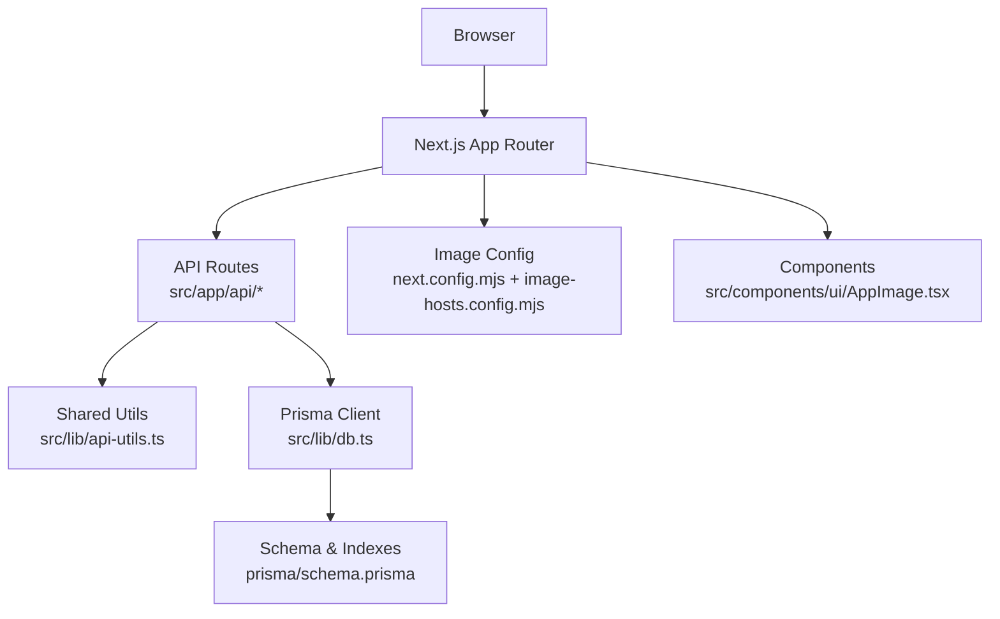
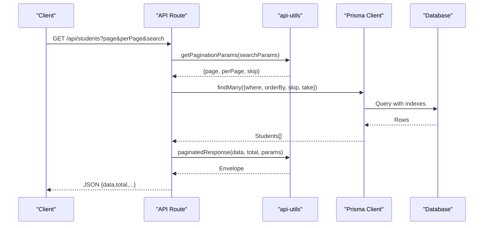
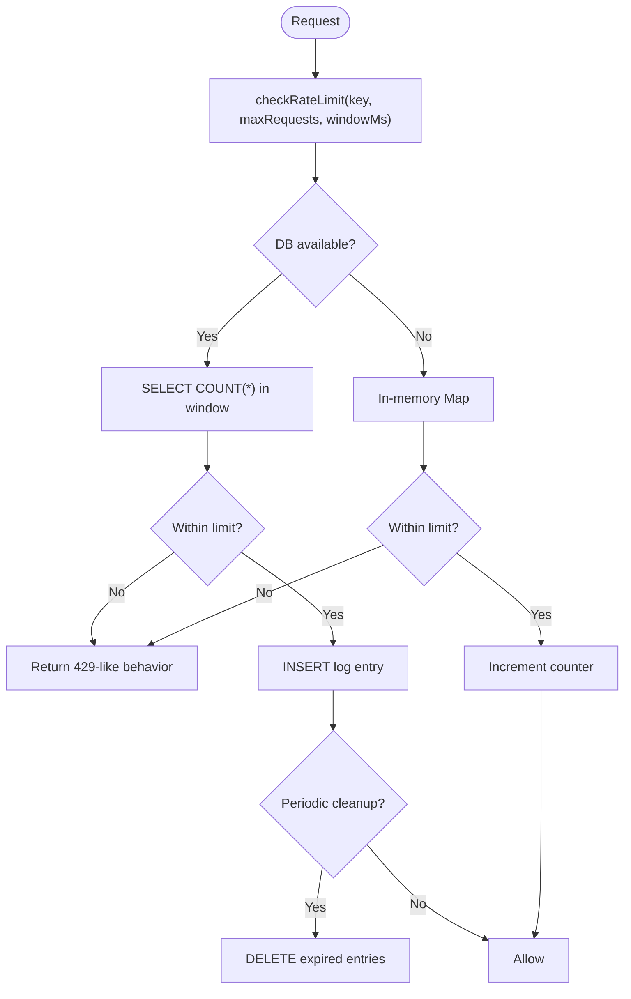
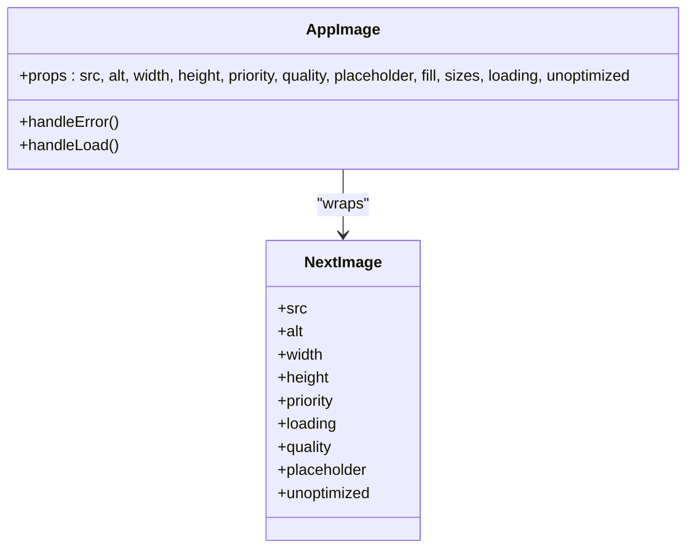
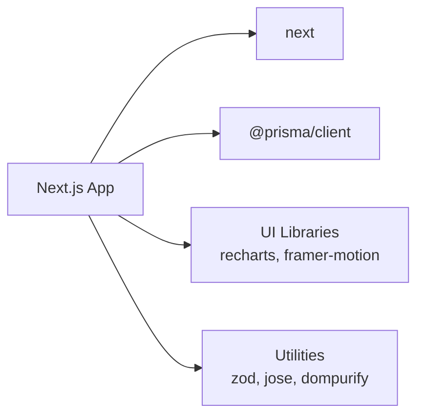

# Performance Optimization

<cite>
**Referenced Files in This Document**
- [package.json](file://package.json)
- [next.config.mjs](file://next.config.mjs)
- [image-hosts.config.mjs](file://image-hosts.config.mjs)
- [src/lib/db.ts](file://src/lib/db.ts)
- [prisma/schema.prisma](file://prisma/schema.prisma)
- [src/lib/api-utils.ts](file://src/lib/api-utils.ts)
- [src/app/api/students/route.ts](file://src/app/api/students/route.ts)
- [src/app/api/dashboard/stats/route.ts](file://src/app/api/dashboard/stats/route.ts)
- [src/lib/rate-limit.ts](file://src/lib/rate-limit.ts)
- [src/lib/logger.ts](file://src/lib/logger.ts)
- [src/components/ui/AppImage.tsx](file://src/components/ui/AppImage.tsx)
- [src/app/files/components/FileManager.tsx](file://src/app/files/components/FileManager.tsx)
</cite>

## Table of Contents
1. Introduction
2. Project Structure
3. Core Components
4. Architecture Overview
5. Detailed Component Analysis
6. Dependency Analysis
7. Performance Considerations
8. Troubleshooting Guide
9. Conclusion

## Introduction
This document provides a comprehensive performance optimization guide for UniTrack, focusing on application speed and efficiency across database queries, API responses, frontend rendering, asset delivery, memory management, and monitoring. It consolidates existing patterns in the codebase and recommends targeted improvements to reduce latency, lower resource usage, and improve user experience.

## Project Structure
UniTrack is a Next.js application with:
- Server-side API routes under src/app/api
- Shared utilities for pagination, authentication, and error handling in src/lib
- Prisma ORM with SQLite as configured in prisma/schema.prisma
- Centralized image configuration via next.config.mjs and image-hosts.config.mjs
- Reusable UI components including an optimized image wrapper

**Diagram sources**
- [next.config.mjs:11-15](file://next.config.mjs#L11-L15)
- [image-hosts.config.mjs:5-26](file://image-hosts.config.mjs#L5-L26)
- [src/lib/db.ts:1-8](file://src/lib/db.ts#L1-L8)
- [prisma/schema.prisma:6-9](file://prisma/schema.prisma#L6-L9)
- [src/lib/api-utils.ts:39-83](file://src/lib/api-utils.ts#L39-L83)
- [src/components/ui/AppImage.tsx:27-141](file://src/components/ui/AppImage.tsx#L27-L141)

**Section sources**
- [package.json:39-51](file://package.json#L39-L51)
- [next.config.mjs:1-47](file://next.config.mjs#L1-L47)

## Core Components
- Database client singleton for efficient Prisma reuse
- Pagination and search utilities for consistent, efficient list endpoints
- Image optimization wrapper for responsive loading and fallbacks
- Rate limiting to protect backend resources and reduce abuse
- Centralized logging to avoid leaking sensitive data while diagnosing issues

Key implementation highlights:
- Prisma client is instantiated once per process and reused across requests
- Pagination helpers enforce safe defaults and cap page sizes
- Search filters use case-insensitive contains matching
- Image component supports lazy/eager loading, blur placeholders, quality tuning, and external host passthrough
- Rate limiter includes DB-backed counting with in-memory fallback and periodic cleanup

**Section sources**
- [src/lib/db.ts:1-8](file://src/lib/db.ts#L1-L8)
- [src/lib/api-utils.ts:39-83](file://src/lib/api-utils.ts#L39-L83)
- [src/components/ui/AppImage.tsx:27-141](file://src/components/ui/AppImage.tsx#L27-L141)
- [src/lib/rate-limit.ts:43-100](file://src/lib/rate-limit.ts#L43-L100)
- [src/lib/logger.ts:7-48](file://src/lib/logger.ts#L7-L48)

## Architecture Overview
The request flow emphasizes minimal overhead and clear separation of concerns:
- API routes validate sessions, parse query parameters, and build efficient queries
- Shared utilities standardize pagination and response envelopes
- Prisma leverages indexes defined in the schema for fast filtering and sorting
- Images are served through Next.js Image with remote host allowlist and caching headers

**Diagram sources**
- [src/app/api/students/route.ts:9-59](file://src/app/api/students/route.ts#L9-L59)
- [src/lib/api-utils.ts:39-83](file://src/lib/api-utils.ts#L39-L83)
- [prisma/schema.prisma:114-118](file://prisma/schema.prisma#L114-L118)

## Detailed Component Analysis

### Database Query Optimization and Indexing
- Use selective fields and relations to minimize payload size
- Leverage existing indexes for common filters (e.g., Course.faculty, Course.status, Application.studentId)
- Combine independent counts and aggregates using parallel execution to reduce latency
- Apply pagination with skip/take and ensure orderBy uses indexed columns where possible

Recommendations:
- Add composite indexes for frequent multi-field filters (e.g., student status + country)
- Prefer count() over full scans by ensuring filter predicates match indexes
- Avoid N+1 queries by batching or using include/select judiciously

**Section sources**
- [prisma/schema.prisma:114-118](file://prisma/schema.prisma#L114-L118)
- [prisma/schema.prisma:425-428](file://prisma/schema.prisma#L425-L428)
- [src/app/api/dashboard/stats/route.ts:14-56](file://src/app/api/dashboard/stats/route.ts#L14-L56)

### Efficient Pagination and Search
- Standardized pagination helper enforces safe defaults and caps perPage to prevent heavy payloads
- Search builds OR-based contains filters; ensure relevant fields are indexed for performance
- Return envelope includes total and totalPages for UI navigation without extra calls

Implementation references:
- Pagination parsing and bounds enforcement
- Search filter builder
- Paginated response envelope

**Section sources**
- [src/lib/api-utils.ts:39-83](file://src/lib/api-utils.ts#L39-L83)
- [src/app/api/students/route.ts:14-54](file://src/app/api/students/route.ts#L14-L54)

### API Response Optimization
- Validate session early to fail fast
- Use precise select/include to limit transferred data
- Parallelize independent queries when possible
- Return structured envelopes for consistent client consumption

Example flows:
- Student listing with filters and pagination
- Dashboard stats aggregation with Promise.all

**Section sources**
- [src/app/api/students/route.ts:9-59](file://src/app/api/students/route.ts#L9-L59)
- [src/app/api/dashboard/stats/route.ts:6-79](file://src/app/api/dashboard/stats/route.ts#L6-L79)

### Caching and Rate Limiting
- Next.js image cache TTL is set to reduce repeated fetches from remote hosts
- Rate limiter protects endpoints from abuse and reduces load spikes
  - DB-backed counting with raw SQL for performance
  - In-memory fallback with periodic cleanup to bound memory growth
  - Exposes rate limit headers for clients

**Diagram sources**
- [src/lib/rate-limit.ts:43-100](file://src/lib/rate-limit.ts#L43-L100)
- [src/lib/rate-limit.ts:20-27](file://src/lib/rate-limit.ts#L20-L27)

**Section sources**
- [next.config.mjs:11-14](file://next.config.mjs#L11-L14)
- [src/lib/rate-limit.ts:43-100](file://src/lib/rate-limit.ts#L43-L100)

### Frontend Performance Optimizations
- Code splitting and lazy loading
  - Next.js App Router splits pages and routes automatically; keep route-level components focused
  - Defer heavy libraries (e.g., PDF generation, charts) to reduce initial bundle
- Bundle size reduction
  - Audit dependencies and remove unused packages
  - Prefer tree-shakable icon sets and modular imports
- Image optimization
  - Use the AppImage wrapper for lazy loading, blur placeholders, quality control, and fallbacks
  - Configure allowed remote image hosts and cache TTL in Next config
  - Provide explicit sizes to enable responsive images

**Diagram sources**
- [src/components/ui/AppImage.tsx:27-141](file://src/components/ui/AppImage.tsx#L27-L141)

**Section sources**
- [src/components/ui/AppImage.tsx:27-141](file://src/components/ui/AppImage.tsx#L27-L141)
- [next.config.mjs:11-14](file://next.config.mjs#L11-L14)
- [image-hosts.config.mjs:5-26](file://image-hosts.config.mjs#L5-L26)

### Asset Compression and CDN Integration
- Enable production source maps off to reduce bundle size
- Allow only necessary remote image hosts to optimize processing
- Consider integrating a CDN for static assets and images to reduce origin load and improve global latency

**Section sources**
- [next.config.mjs:5-14](file://next.config.mjs#L5-L14)
- [image-hosts.config.mjs:5-26](file://image-hosts.config.mjs#L5-L26)

### Memory Management and Resource Cleanup
- Prisma client is reused per process to avoid connection churn
- Rate limiter maintains an in-memory map with bounded size and periodic cleanup of expired entries
- Ensure long-running tasks release resources promptly; avoid holding large objects in closures

**Section sources**
- [src/lib/db.ts:1-8](file://src/lib/db.ts#L1-L8)
- [src/lib/rate-limit.ts:17-27](file://src/lib/rate-limit.ts#L17-L27)

### Monitoring, Profiling, and Bottleneck Identification
- Use centralized logger to record errors without leaking sensitive data
- Instrument slow endpoints with timing logs and consider adding APM metrics
- Profile CPU and memory in development using Node profiling tools; in production, rely on structured logs and error tracking

**Section sources**
- [src/lib/logger.ts:7-48](file://src/lib/logger.ts#L7-L48)

## Dependency Analysis
Key runtime dependencies influencing performance:
- Next.js for server rendering, routing, and image optimization
- Prisma client for type-safe database access
- UI libraries (e.g., recharts, framer-motion) that can impact bundle size if not used selectively

**Diagram sources**
- [package.json:56-79](file://package.json#L56-L79)

**Section sources**
- [package.json:56-79](file://package.json#L56-L79)

## Performance Considerations
- Database
  - Add composite indexes for frequent filter combinations
  - Use select/include to minimize payload
  - Batch independent reads with Promise.all
- API
  - Enforce pagination caps and return totals
  - Cache expensive aggregations at the edge or app layer when appropriate
  - Use rate limiting to protect against bursts
- Frontend
  - Lazy-load heavy components and third-party libraries
  - Use AppImage for all images; prefer lazy loading except for above-the-fold content
  - Minimize bundle size by auditing dependencies and removing unused code
- Assets
  - Configure remote image hosts and cache TTL
  - Serve static assets via CDN for reduced latency
- Memory
  - Bound in-memory caches and clean up expired entries
  - Avoid retaining large datasets in component state longer than needed

[No sources needed since this section provides general guidance]

## Troubleshooting Guide
Common issues and resolutions:
- Slow queries
  - Verify indexes exist for filtered/sorted columns
  - Replace broad searches with targeted filters or full-text strategies
  - Reduce included relations; fetch related data on demand
- Memory leaks
  - Inspect long-lived closures and event listeners
  - Ensure rate limiter’s in-memory map is cleaned periodically
  - Avoid storing large blobs in React state; use streaming or temporary references
- Performance degradation
  - Monitor endpoint latencies and add timing logs
  - Use structured logging to identify hot paths
  - Review bundle size changes after dependency updates

**Section sources**
- [src/lib/rate-limit.ts:20-27](file://src/lib/rate-limit.ts#L20-L27)
- [src/lib/logger.ts:7-48](file://src/lib/logger.ts#L7-L48)

## Conclusion
By combining efficient database design, standardized pagination, robust rate limiting, optimized image delivery, and disciplined memory practices, UniTrack can achieve significant performance gains. Adopt the recommended indexing, caching, and frontend optimizations to sustain responsiveness as the application scales.

[No sources needed since this section summarizes without analyzing specific files]