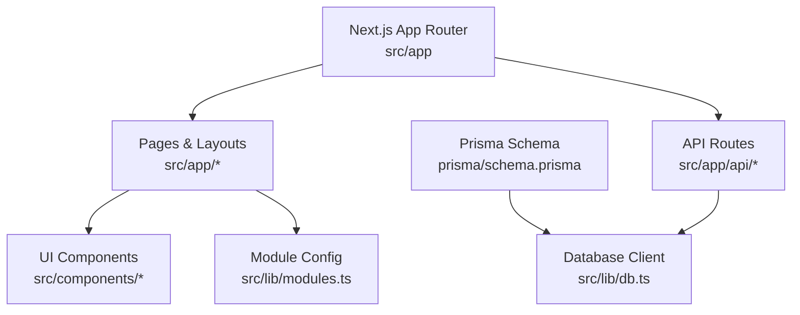
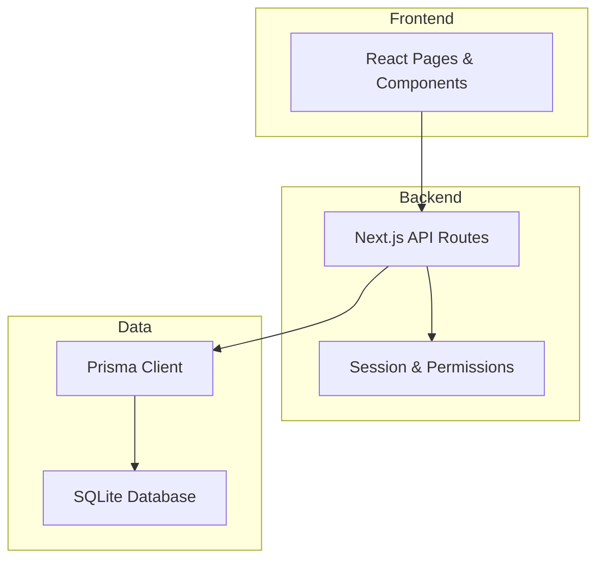
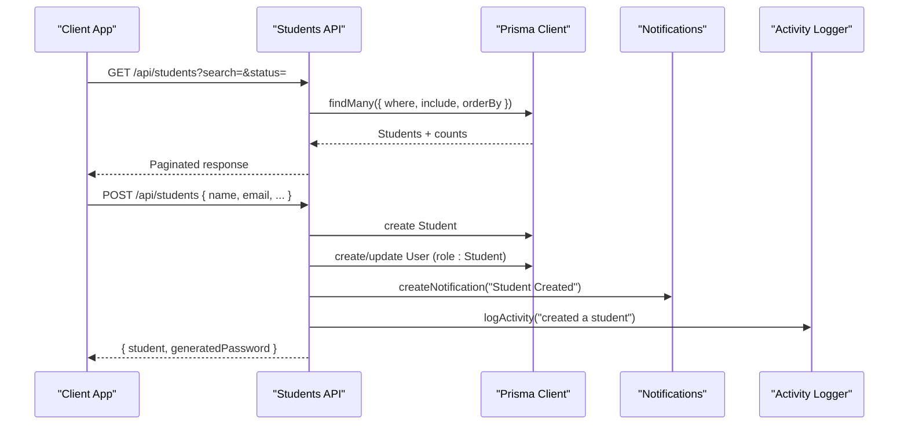
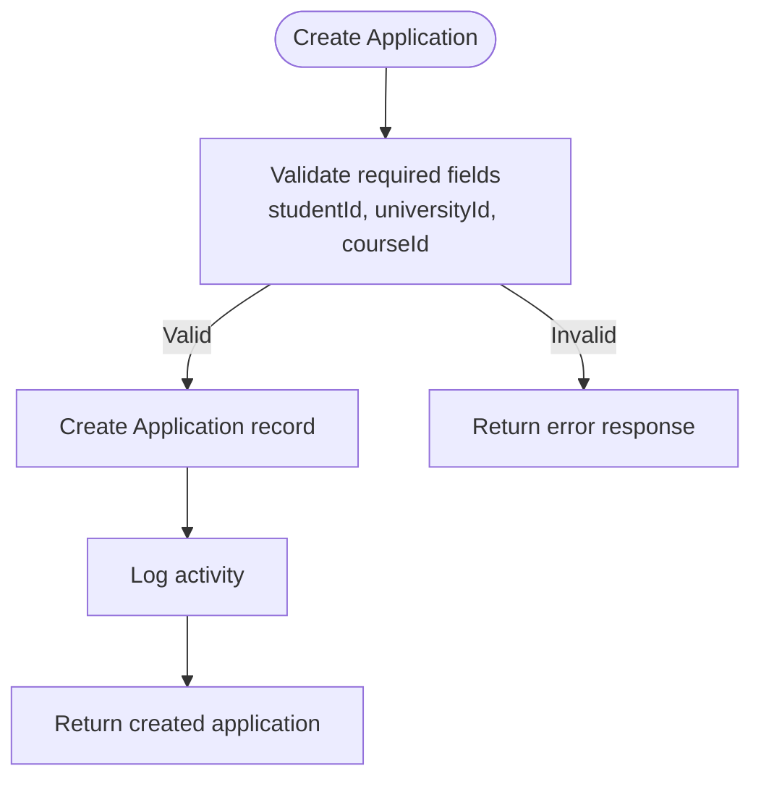
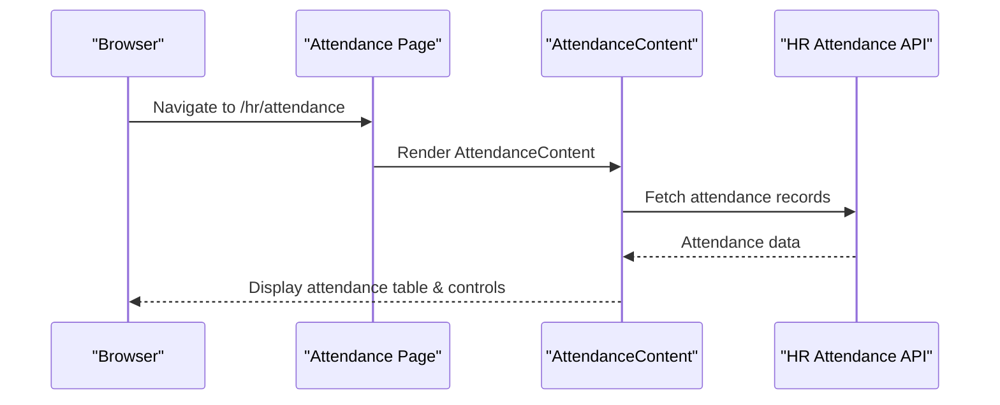
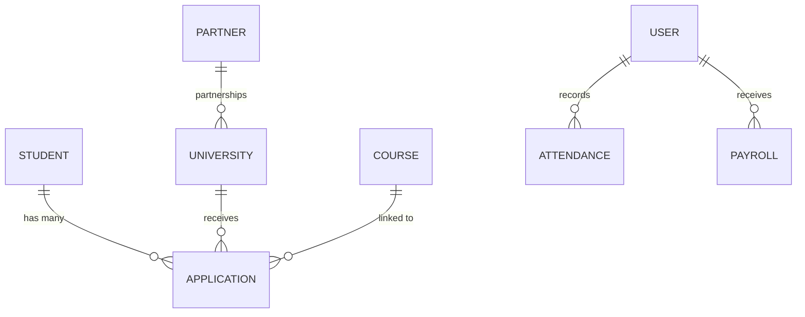
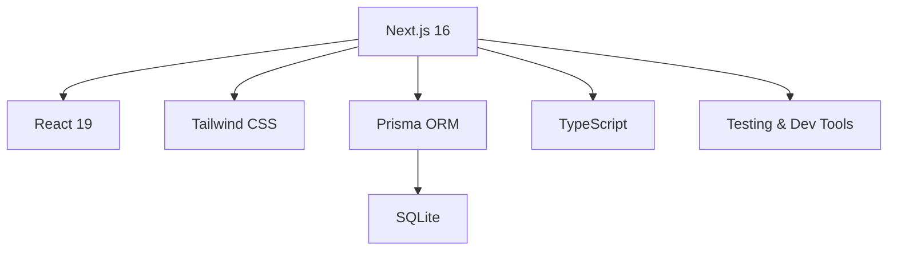

# Project Overview

<cite>
**Referenced Files in This Document**
- [README.md](file://README.md)
- [package.json](file://package.json)
- [next.config.mjs](file://next.config.mjs)
- [src/app/layout.tsx](file://src/app/layout.tsx)
- [src/app/page.tsx](file://src/app/page.tsx)
- [prisma/schema.prisma](file://prisma/schema.prisma)
- [src/lib/db.ts](file://src/lib/db.ts)
- [src/app/api/students/route.ts](file://src/app/api/students/route.ts)
- [src/app/api/applications/route.ts](file://src/app/api/applications/route.ts)
- [src/app/hr/attendance/page.tsx](file://src/app/hr/attendance/page.tsx)
- [src/lib/modules.ts](file://src/lib/modules.ts)
</cite>

## Table of Contents
1. Introduction
2. Project Structure
3. Core Components
4. Architecture Overview
5. Detailed Component Analysis
6. Dependency Analysis
7. Performance Considerations
8. Troubleshooting Guide
9. Conclusion

## Introduction
UniTrack is a comprehensive education consultancy management platform built for international education agencies and study abroad consultancies. It centralizes student applications, university partnerships, visa workflows, HR management (including attendance tracking), communication tools, and financial operations into one modern, scalable system. The platform supports the full lifecycle from lead capture to enrollment and post-enrollment administration, with strong compliance and reporting capabilities.

Target audience:
- Education consultants and counselors managing student pipelines
- Administrative staff handling documents, payments, and HR tasks
- Agency managers overseeing multi-branch operations, commissions, and performance metrics

Key features:
- Student management and application tracking
- University partnership and course catalog management
- Visa processing workflow with checklists and timelines
- HR system with employee records, departments, designations, attendance, leave, and payroll
- Communication tools including chat and notifications
- Financial management for payments, expenses, and commission settlements

Technology stack overview:
- Next.js 16 with App Router for server-side rendering and API routes
- React 19 for dynamic user interfaces
- TypeScript for type safety across frontend and backend
- Prisma ORM for database modeling and queries
- Tailwind CSS for styling and responsive UI
- SQLite as the default database provider via Prisma

How these technologies work together:
- Next.js provides routing, server components, and API endpoints under src/app/api
- React components render interactive dashboards and forms
- TypeScript ensures consistent types between client and server code
- Prisma models define the data schema and generate a typed client used by API routes
- Tailwind CSS enables rapid, consistent UI development
- Security headers and CSP are configured at the framework level for safer deployments

**Section sources**
- [README.md:1-10](file://README.md#L1-L10)
- [package.json:56-79](file://package.json#L56-L79)
- [next.config.mjs:17-45](file://next.config.mjs#L17-L45)
- [src/app/layout.tsx:12-19](file://src/app/layout.tsx#L12-L19)

## Project Structure
The project follows Next.js App Router conventions:
- src/app contains pages and API routes organized by feature
- prisma holds the database schema and seed scripts
- public includes static assets and screenshots
- lib contains shared utilities, database client, and module configuration

**Diagram sources**
- [src/app/layout.tsx:21-42](file://src/app/layout.tsx#L21-L42)
- [src/app/page.tsx:1-30](file://src/app/page.tsx#L1-L30)
- [src/app/api/students/route.ts:1-10](file://src/app/api/students/route.ts#L1-L10)
- [prisma/schema.prisma:1-10](file://prisma/schema.prisma#L1-L10)
- [src/lib/db.ts:1-8](file://src/lib/db.ts#L1-L8)
- [src/lib/modules.ts:91-106](file://src/lib/modules.ts#L91-L106)

**Section sources**
- [src/app/layout.tsx:21-42](file://src/app/layout.tsx#L21-L42)
- [src/app/page.tsx:1-30](file://src/app/page.tsx#L1-L30)
- [src/lib/modules.ts:91-106](file://src/lib/modules.ts#L91-L106)

## Core Components
UniTrack’s core modules cover the end-to-end operations of an education consultancy:

- Student Management
  - Create, search, filter, and paginate student records
  - Store personal details, test scores, passport info, and guardian data
  - Associate students with partners and target universities

- University Partnership Management
  - Maintain university profiles, courses, and partnership terms
  - Track commissions and featured status
  - Link applications to specific courses and institutions

- Visa Processing Workflow
  - Define visa types, embassy details, and country-specific checklists
  - Configure workflow stages per country and visa type
  - Track progress through application milestones

- HR System with Attendance Tracking
  - Employee records, departments, designations
  - Attendance logging with check-in/out times, photos, and geolocation
  - Leave balances, requests, approvals, and payroll items

- Communication Tools
  - Chat rooms and messages for internal collaboration
  - Notifications and activity logs for auditability

- Financial Management
  - Payments linked to students with currency and method
  - Expenses tracking with categories and receipts
  - Commission structures tied to partners and universities

Practical examples:
- Managing student applications: create applications for a student, filter by status or university, and view course requirements
- Processing visa documents: configure visa checklists and workflow stages, then track each stage completion
- Handling employee attendance: record daily attendance with timestamps and optional biometric verification

**Section sources**
- [src/app/api/students/route.ts:9-58](file://src/app/api/students/route.ts#L9-L58)
- [src/app/api/applications/route.ts:8-73](file://src/app/api/applications/route.ts#L8-L73)
- [prisma/schema.prisma:19-50](file://prisma/schema.prisma#L19-L50)
- [prisma/schema.prisma:411-454](file://prisma/schema.prisma#L411-L454)
- [prisma/schema.prisma:587-629](file://prisma/schema.prisma#L587-L629)
- [prisma/schema.prisma:631-768](file://prisma/schema.prisma#L631-L768)
- [prisma/schema.prisma:488-520](file://prisma/schema.prisma#L488-L520)

## Architecture Overview
UniTrack uses a layered architecture:
- Frontend: React components rendered via Next.js App Router
- Backend: Serverless API routes handling business logic and data access
- Data Layer: Prisma ORM interacting with a SQLite database
- Configuration: Module toggles and security headers managed centrally

**Diagram sources**
- [src/app/layout.tsx:21-42](file://src/app/layout.tsx#L21-L42)
- [src/app/api/students/route.ts:1-10](file://src/app/api/students/route.ts#L1-L10)
- [src/lib/db.ts:1-8](file://src/lib/db.ts#L1-L8)
- [next.config.mjs:17-45](file://next.config.mjs#L17-L45)

## Detailed Component Analysis

### Student Management API
The student API supports listing, filtering, and creating student records with robust validation and session checks.

**Diagram sources**
- [src/app/api/students/route.ts:9-58](file://src/app/api/students/route.ts#L9-L58)
- [src/app/api/students/route.ts:61-213](file://src/app/api/students/route.ts#L61-L213)

**Section sources**
- [src/app/api/students/route.ts:9-58](file://src/app/api/students/route.ts#L9-L58)
- [src/app/api/students/route.ts:61-213](file://src/app/api/students/route.ts#L61-L213)

### Application Processing Workflow
Applications link students to universities and courses, with filtering and creation flows.

**Diagram sources**
- [src/app/api/applications/route.ts:75-113](file://src/app/api/applications/route.ts#L75-L113)

**Section sources**
- [src/app/api/applications/route.ts:8-73](file://src/app/api/applications/route.ts#L8-L73)
- [src/app/api/applications/route.ts:75-113](file://src/app/api/applications/route.ts#L75-L113)

### HR Attendance Module
Attendance is exposed via a dedicated page that renders the attendance content within the app layout.

**Diagram sources**
- [src/app/hr/attendance/page.tsx:10-16](file://src/app/hr/attendance/page.tsx#L10-L16)

**Section sources**
- [src/app/hr/attendance/page.tsx:1-17](file://src/app/hr/attendance/page.tsx#L1-L17)

### Data Model Relationships
Core entities and their relationships support the platform’s domain model.

**Diagram sources**
- [prisma/schema.prisma:139-198](file://prisma/schema.prisma#L139-L198)
- [prisma/schema.prisma:334-409](file://prisma/schema.prisma#L334-L409)
- [prisma/schema.prisma:411-454](file://prisma/schema.prisma#L411-L454)
- [prisma/schema.prisma:664-685](file://prisma/schema.prisma#L664-L685)
- [prisma/schema.prisma:734-768](file://prisma/schema.prisma#L734-L768)
- [prisma/schema.prisma:52-65](file://prisma/schema.prisma#L52-L65)

**Section sources**
- [prisma/schema.prisma:139-198](file://prisma/schema.prisma#L139-L198)
- [prisma/schema.prisma:334-409](file://prisma/schema.prisma#L334-L409)
- [prisma/schema.prisma:411-454](file://prisma/schema.prisma#L411-L454)
- [prisma/schema.prisma:664-685](file://prisma/schema.prisma#L664-L685)
- [prisma/schema.prisma:734-768](file://prisma/schema.prisma#L734-L768)
- [prisma/schema.prisma:52-65](file://prisma/schema.prisma#L52-L65)

## Dependency Analysis
UniTrack’s dependencies align with its modern web stack:
- Framework: Next.js 16 with App Router
- UI: React 19 with Tailwind CSS
- Data: Prisma ORM with SQLite
- Utilities: JSON parsing, encryption, PDF generation, charts, and testing tools

**Diagram sources**
- [package.json:56-79](file://package.json#L56-L79)
- [package.json:81-108](file://package.json#L81-L108)
- [next.config.mjs:1-15](file://next.config.mjs#L1-L15)

**Section sources**
- [package.json:56-79](file://package.json#L56-L79)
- [package.json:81-108](file://package.json#L81-L108)
- [next.config.mjs:1-15](file://next.config.mjs#L1-L15)

## Performance Considerations
- Use pagination on list endpoints to reduce payload size and improve responsiveness
- Leverage Prisma’s include and select to fetch only necessary relations
- Enable production optimizations in Next.js config and consider caching strategies for static assets
- Keep API routes focused and avoid heavy computations in request handlers
- Monitor database queries and indexes defined in the schema for frequently filtered fields

[No sources needed since this section provides general guidance]

## Troubleshooting Guide
Common issues and resolutions:
- Unauthorized access: Ensure sessions are validated in API routes before performing mutations
- Duplicate emails: Handle unique constraint errors when creating students or users
- Missing fields: Validate required fields in application creation to prevent incomplete records
- Database connectivity: Verify DATABASE_URL environment variable and Prisma client initialization

Operational tips:
- Use activity logs and notifications to trace actions and confirm successful operations
- Check security headers and CSP in next.config.mjs if encountering blocked resources
- Use module configuration to enable/disable features during development or maintenance

**Section sources**
- [src/app/api/students/route.ts:11-12](file://src/app/api/students/route.ts#L11-L12)
- [src/app/api/students/route.ts:208-210](file://src/app/api/students/route.ts#L208-L210)
- [src/app/api/applications/route.ts:77-86](file://src/app/api/applications/route.ts#L77-L86)
- [next.config.mjs:17-45](file://next.config.mjs#L17-L45)

## Conclusion
UniTrack delivers a unified, enterprise-grade platform tailored for international education consultancies. Its modular architecture, robust data model, and modern technology stack enable efficient management of student applications, university partnerships, visa workflows, HR operations, communications, and finances. By leveraging Next.js, React, TypeScript, and Prisma, UniTrack provides a scalable foundation that supports both small agencies and large multi-branch organizations.

[No sources needed since this section summarizes without analyzing specific files]