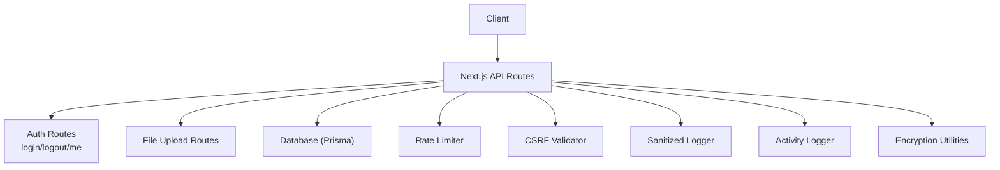
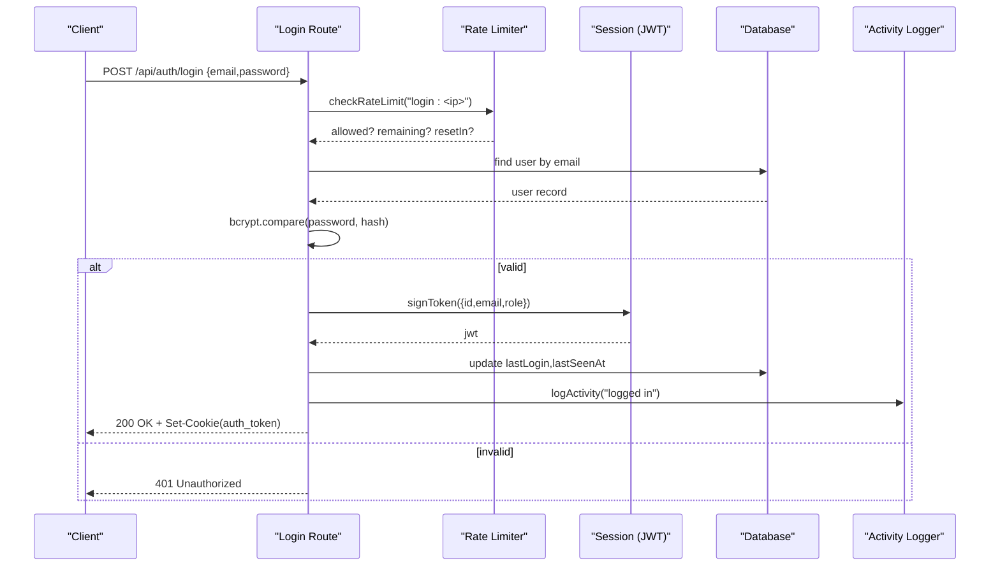
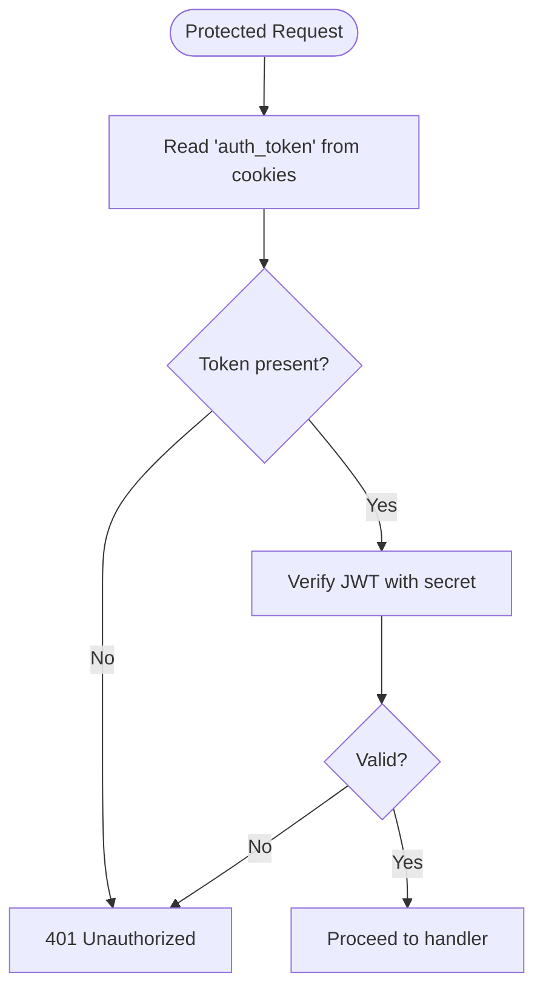
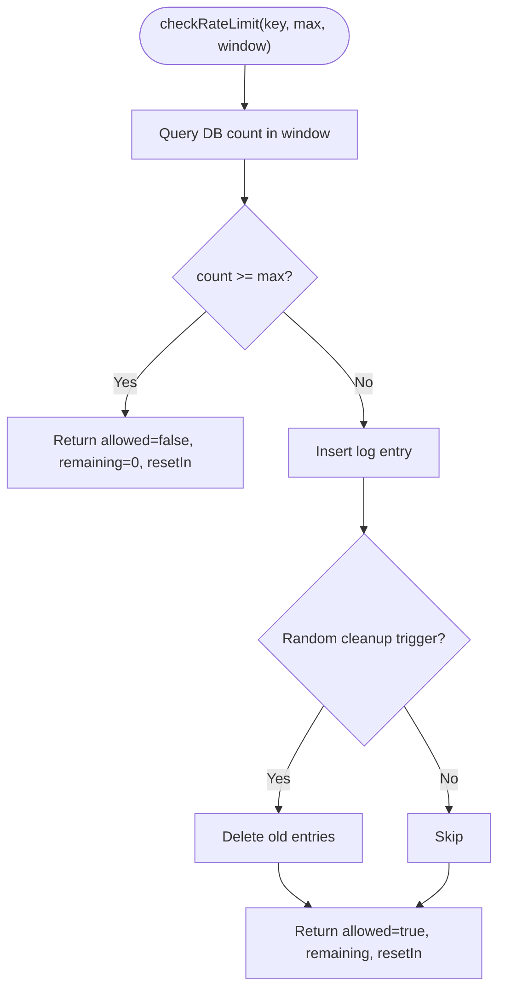
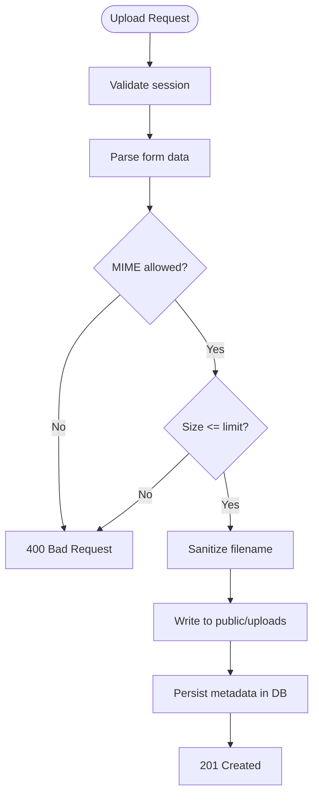
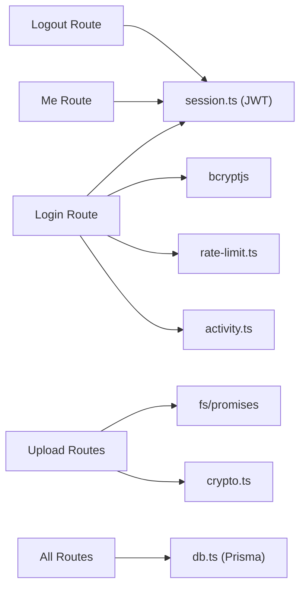

# Security Considerations

<cite>
**Referenced Files in This Document**
- [session.ts](file://src/lib/session.ts)
- [csrf.ts](file://src/lib/csrf.ts)
- [rate-limit.ts](file://src/lib/rate-limit.ts)
- [crypto.ts](file://src/lib/crypto.ts)
- [logger.ts](file://src/lib/logger.ts)
- [permissions.ts](file://src/lib/permissions.ts)
- [activity.ts](file://src/lib/activity.ts)
- [db.ts](file://src/lib/db.ts)
- [login route.ts](file://src/app/api/auth/login/route.ts)
- [logout route.ts](file://src/app/api/auth/logout/route.ts)
- [me route.ts](file://src/app/api/auth/me/route.ts)
- [files upload route.ts](file://src/app/api/files/upload/route.ts)
- [upload route.ts](file://src/app/api/upload/route.ts)
</cite>

## Table of Contents
1. Introduction
2. Project Structure
3. Core Components
4. Architecture Overview
5. Detailed Component Analysis
6. Dependency Analysis
7. Performance Considerations
8. Troubleshooting Guide
9. Compliance and Privacy
10. Conclusion

## Introduction
This document provides comprehensive security guidance for UniTrack, focusing on authentication, authorization, input validation, CSRF protection, rate limiting, encryption, secure file handling, audit logging, and monitoring. It also includes best practices for code reviews, vulnerability assessments, incident response, and penetration testing approaches.

## Project Structure
Security-relevant implementation is distributed across:
- Authentication and session management (JWT signing/verification, cookie configuration)
- Authorization (role-based permissions)
- Input validation (schema-based parsing)
- CSRF protection (origin/referer checks)
- Rate limiting (DB-backed with in-memory fallback)
- Encryption (AES-GCM for backups)
- Secure file uploads (allowlists, size limits, sanitization)
- Audit logging and notifications
- Sanitized error logging to avoid leaking sensitive data

**Diagram sources**
- [login route.ts:19-122](file://src/app/api/auth/login/route.ts#L19-L122)
- [logout route.ts:7-35](file://src/app/api/auth/logout/route.ts#L7-L35)
- [me route.ts:7-68](file://src/app/api/auth/me/route.ts#L7-L68)
- [files upload route.ts:86-191](file://src/app/api/files/upload/route.ts#L86-L191)
- [upload route.ts:23-63](file://src/app/api/upload/route.ts#L23-L63)
- [rate-limit.ts:43-118](file://src/lib/rate-limit.ts#L43-L118)
- [csrf.ts:9-46](file://src/lib/csrf.ts#L9-L46)
- [logger.ts:42-48](file://src/lib/logger.ts#L42-L48)
- [activity.ts:60-113](file://src/lib/activity.ts#L60-L113)
- [crypto.ts:17-44](file://src/lib/crypto.ts#L17-L44)

**Section sources**
- [login route.ts:19-122](file://src/app/api/auth/login/route.ts#L19-L122)
- [rate-limit.ts:43-118](file://src/lib/rate-limit.ts#L43-L118)
- [csrf.ts:9-46](file://src/lib/csrf.ts#L9-L46)
- [logger.ts:42-48](file://src/lib/logger.ts#L42-L48)
- [activity.ts:60-113](file://src/lib/activity.ts#L60-L113)
- [crypto.ts:17-44](file://src/lib/crypto.ts#L17-L44)

## Core Components
- JWT token lifecycle: signing short-lived tokens, verifying them, and storing securely in httpOnly cookies.
- Password hashing: bcrypt comparison against stored hashes.
- Session security: httpOnly, secure, sameSite cookies; token verification on protected endpoints.
- CSRF protection: origin/referer allowlist validation for state-changing requests.
- Rate limiting: per-IP counters with DB persistence and in-memory fallback; informative headers.
- Input validation: schema-based parsing to reject malformed or unsafe inputs early.
- Encryption: AES-GCM with PBKDF2 for backup payloads.
- Secure file handling: allowlisted MIME types, size limits, sanitized filenames, unique storage names.
- Audit logging: structured activity logs and notifications for key actions.
- Sanitized logging: redaction of sensitive fields in error logs.

**Section sources**
- [session.ts:19-36](file://src/lib/session.ts#L19-L36)
- [login route.ts:19-122](file://src/app/api/auth/login/route.ts#L19-L122)
- [csrf.ts:9-46](file://src/lib/csrf.ts#L9-L46)
- [rate-limit.ts:29-118](file://src/lib/rate-limit.ts#L29-L118)
- [crypto.ts:17-44](file://src/lib/crypto.ts#L17-L44)
- [files upload route.ts:86-191](file://src/app/api/files/upload/route.ts#L86-L191)
- [upload route.ts:23-63](file://src/app/api/upload/route.ts#L23-L63)
- [activity.ts:60-113](file://src/lib/activity.ts#L60-L113)
- [logger.ts:42-48](file://src/lib/logger.ts#L42-L48)

## Architecture Overview
The authentication flow enforces strong controls at multiple layers:
- Login validates input, applies rate limiting, verifies credentials, signs a short-lived JWT, and sets secure cookies.
- Protected routes verify the JWT from cookies and enforce role-based permissions.
- CSRF checks validate request origins for non-safe methods.
- File uploads enforce strict allowlists and size constraints before writing to disk.
- All sensitive operations are logged via an audit logger that avoids leaking secrets.

**Diagram sources**
- [login route.ts:19-122](file://src/app/api/auth/login/route.ts#L19-L122)
- [rate-limit.ts:43-118](file://src/lib/rate-limit.ts#L43-L118)
- [session.ts:28-36](file://src/lib/session.ts#L28-L36)
- [activity.ts:60-113](file://src/lib/activity.ts#L60-L113)

## Detailed Component Analysis

### Authentication and Session Security
- JWT signing uses HS256 with a secret loaded from environment variables; tokens are short-lived (24 hours).
- Tokens are verified using a shared secret; expired or invalid tokens result in unauthorized responses.
- Cookies are set with httpOnly, secure (in production), sameSite strict, and scoped to root path.
- Protected endpoints read the token from cookies and verify it before serving data.

**Diagram sources**
- [session.ts:19-36](file://src/lib/session.ts#L19-L36)
- [me route.ts:7-68](file://src/app/api/auth/me/route.ts#L7-L68)

**Section sources**
- [session.ts:1-36](file://src/lib/session.ts#L1-L36)
- [me route.ts:7-68](file://src/app/api/auth/me/route.ts#L7-L68)
- [logout route.ts:7-35](file://src/app/api/auth/logout/route.ts#L7-L35)

### Password Hashing and Credential Verification
- Passwords are compared using bcrypt against stored hashes.
- Failed attempts return generic errors to avoid information leakage.
- Rate limiting on login prevents brute-force attacks.

**Section sources**
- [login route.ts:19-122](file://src/app/api/auth/login/route.ts#L19-L122)

### CSRF Protection
- Non-safe HTTP methods require either a valid origin or referer matching an allowlist.
- Malformed or disallowed origins/referers are rejected.
- Direct API calls without browser headers are allowed (e.g., server-to-server).

**Section sources**
- [csrf.ts:9-46](file://src/lib/csrf.ts#L9-L46)

### Rate Limiting
- Per-key counters backed by a database table with periodic cleanup; falls back to in-memory if DB unavailable.
- Returns standard rate limit headers and a clear message when exceeded.
- IP extraction supports proxies safely by reading the rightmost hop from forwarded headers.

**Diagram sources**
- [rate-limit.ts:43-118](file://src/lib/rate-limit.ts#L43-L118)

**Section sources**
- [rate-limit.ts:29-118](file://src/lib/rate-limit.ts#L29-L118)

### Input Validation Strategies
- Schema-based validation ensures emails and passwords meet requirements before processing.
- Early rejection reduces attack surface and improves error clarity.

**Section sources**
- [login route.ts:14-35](file://src/app/api/auth/login/route.ts#L14-L35)

### Data Encryption
- Backups are encrypted using AES-GCM with PBKDF2-derived keys and random IV/salt.
- Decryption requires the original password and payload structure.

**Section sources**
- [crypto.ts:1-44](file://src/lib/crypto.ts#L1-L44)

### Secure File Handling
- Allowed MIME types are explicitly enumerated; other types are rejected.
- File size is enforced to prevent abuse.
- Filenames are sanitized and stored under a controlled directory; unique names are generated to avoid collisions.
- Access control checks ensure only authenticated sessions can upload.

**Diagram sources**
- [files upload route.ts:86-191](file://src/app/api/files/upload/route.ts#L86-L191)
- [upload route.ts:23-63](file://src/app/api/upload/route.ts#L23-L63)

**Section sources**
- [files upload route.ts:86-191](file://src/app/api/files/upload/route.ts#L86-L191)
- [upload route.ts:23-63](file://src/app/api/upload/route.ts#L23-L63)

### Authorization and Access Control
- Role-based permissions map resources to allowed roles.
- Helpers provide quick checks and route-level permission mapping.

**Section sources**
- [permissions.ts:1-107](file://src/lib/permissions.ts#L1-L107)

### Audit Logging and Activity Tracking
- Activity logs capture actor, action, target, and optional details; notifications are created for significant events.
- Login and logout flows integrate activity logging for traceability.

**Section sources**
- [activity.ts:60-113](file://src/lib/activity.ts#L60-L113)
- [login route.ts:86-100](file://src/app/api/auth/login/route.ts#L86-L100)
- [logout route.ts:7-35](file://src/app/api/auth/logout/route.ts#L7-L35)

### Sanitized Error Logging
- Logs automatically redact sensitive patterns such as passwords, tokens, secrets, authorization headers, cookies, and credentials.
- Errors are serialized safely and only emitted outside test environments.

**Section sources**
- [logger.ts:1-48](file://src/lib/logger.ts#L1-L48)

## Dependency Analysis
Key dependencies and their roles:
- Prisma client for database access and migrations.
- jose for JWT operations.
- bcryptjs for password hashing.
- Node crypto for encryption utilities.
- Next.js built-ins for cookies and responses.

**Diagram sources**
- [login route.ts:1-122](file://src/app/api/auth/login/route.ts#L1-L122)
- [me route.ts:1-68](file://src/app/api/auth/me/route.ts#L1-L68)
- [logout route.ts:1-35](file://src/app/api/auth/logout/route.ts#L1-L35)
- [upload route.ts:1-63](file://src/app/api/upload/route.ts#L1-L63)
- [files upload route.ts:86-191](file://src/app/api/files/upload/route.ts#L86-L191)
- [db.ts:1-8](file://src/lib/db.ts#L1-L8)

**Section sources**
- [db.ts:1-8](file://src/lib/db.ts#L1-L8)

## Performance Considerations
- Rate limiting uses DB queries with periodic cleanup; consider Redis for multi-instance deployments to reduce DB load.
- Short-lived JWTs minimize risk while keeping verification overhead low.
- File uploads enforce size limits and use streaming buffers to manage memory usage.
- Avoid logging large payloads; rely on sanitized, minimal error messages.

[No sources needed since this section provides general guidance]

## Troubleshooting Guide
Common issues and resolutions:
- Invalid or expired token: Ensure JWT_SECRET is configured and tokens are not tampered with; verify expiration settings.
- CSRF failures: Confirm origin/referer matches the allowlist; adjust NEXT_PUBLIC_APP_URL accordingly.
- Too many requests: Review rate limit thresholds and clean up RateLimitLog entries; monitor X-RateLimit headers.
- Upload rejections: Check MIME type allowlist and file size limits; ensure correct content-type headers.
- Missing audit logs: Verify database connectivity and that activity logging functions are invoked after critical actions.

**Section sources**
- [session.ts:19-36](file://src/lib/session.ts#L19-L36)
- [csrf.ts:9-46](file://src/lib/csrf.ts#L9-L46)
- [rate-limit.ts:43-118](file://src/lib/rate-limit.ts#L43-L118)
- [files upload route.ts:86-191](file://src/app/api/files/upload/route.ts#L86-L191)
- [activity.ts:60-113](file://src/lib/activity.ts#L60-L113)

## Compliance and Privacy
- Data minimization: Only necessary fields are included in responses and logs; sensitive fields are redacted.
- Consent and retention: Implement policies for retaining activity logs and login logs; purge stale entries regularly.
- Encryption at rest: Use AES-GCM for sensitive backups; ensure keys/passwords are managed securely.
- Privacy regulations: Align data handling with applicable laws (e.g., GDPR, local privacy acts); provide mechanisms for data export and deletion where required.
- Security headers: Configure appropriate headers (e.g., CSP, HSTS, X-Content-Type-Options) at the web server or framework level to harden the application.

[No sources needed since this section provides general guidance]

## Conclusion
UniTrack implements a layered security approach: strong authentication with short-lived JWTs, robust authorization via role-based permissions, CSRF validation, rate limiting, schema-based input validation, encryption for backups, secure file uploads, and comprehensive audit logging with sanitized error reporting. Adhering to these practices and extending them with server-side security headers, regular audits, and incident response procedures will help maintain a secure and compliant system.

[No sources needed since this section summarizes without analyzing specific files]