# Application Processing & Workflow

<cite>
**Referenced Files in This Document**
- [schema.prisma](file://prisma/schema.prisma)
- [application-statuses.ts](file://src/lib/application-statuses.ts)
- [applications/route.ts](file://src/app/api/applications/route.ts)
- [applications/[id]/route.ts](file://src/app/api/applications/[id]/route.ts)
- [applications/[id]/workflow/route.ts](file://src/app/api/applications/[id]/workflow/route.ts)
- [workflow-stages/route.ts](file://src/app/api/workflow-stages/route.ts)
- [visa-timeline/route.ts](file://src/app/api/visa-timeline/route.ts)
- [email/send/route.ts](file://src/app/api/email/send/route.ts)
- [dashboard/stats/route.ts](file://src/app/api/dashboard/stats/route.ts)
- [reports/generate/route.ts](file://src/app/api/reports/generate/route.ts)
- [VisaWorkflowDashboard.tsx](file://src/app/tasks/components/VisaWorkflowDashboard.tsx)
- [ApplicationsContent.tsx](file://src/app/applications/components/ApplicationsContent.tsx)
</cite>

## Table of Contents
1. Introduction
2. Project Structure
3. Core Components
4. Architecture Overview
5. Detailed Component Analysis
6. Dependency Analysis
7. Performance Considerations
8. Troubleshooting Guide
9. Conclusion

## Introduction
This document explains the end-to-end application processing workflow and status management in UniTrack. It covers how applications are created, tracked through configurable stages, updated with statuses, and reported on via dashboards and analytics. It also documents integration points for university/course data, document verification workflows, automated deadline awareness, notifications, and email communications to students and counselors.

## Project Structure
The application uses a Next.js API routes structure backed by Prisma models. Key areas:
- Applications CRUD and per-application workflow stages
- Global workflow stages (country + visaType) used by the Visa workflow dashboard
- Visa timeline aggregation across stages and tasks
- Email sending and notification helpers
- Dashboard stats and report generation endpoints
- UI components that drive the workflow and reporting experiences

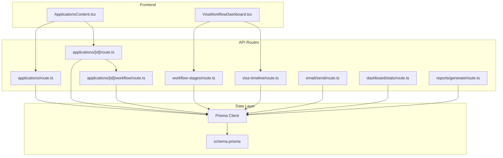

**Diagram sources**
- [VisaWorkflowDashboard.tsx:169-234](file://src/app/tasks/components/VisaWorkflowDashboard.tsx#L169-L234)
- [ApplicationsContent.tsx:216-257](file://src/app/applications/components/ApplicationsContent.tsx#L216-L257)
- [applications/route.ts:8-73](file://src/app/api/applications/route.ts#L8-L73)
- [applications/[id]/route.ts:8-85](file://src/app/api/applications/[id]/route.ts#L8-L85)
- [applications/[id]/workflow/route.ts:7-148](file://src/app/api/applications/[id]/workflow/route.ts#L7-L148)
- [workflow-stages/route.ts:8-131](file://src/app/api/workflow-stages/route.ts#L8-L131)
- [visa-timeline/route.ts:21-115](file://src/app/api/visa-timeline/route.ts#L21-L115)
- [email/send/route.ts:8-36](file://src/app/api/email/send/route.ts#L8-L36)
- [dashboard/stats/route.ts:6-79](file://src/app/api/dashboard/stats/route.ts#L6-L79)
- [reports/generate/route.ts:7-99](file://src/app/api/reports/generate/route.ts#L7-L99)
- [schema.prisma:411-454](file://prisma/schema.prisma#L411-L454)

**Section sources**
- [schema.prisma:411-454](file://prisma/schema.prisma#L411-L454)
- [applications/route.ts:8-113](file://src/app/api/applications/route.ts#L8-L113)
- [applications/[id]/route.ts:8-118](file://src/app/api/applications/[id]/route.ts#L8-L118)
- [applications/[id]/workflow/route.ts:7-193](file://src/app/api/applications/[id]/workflow/route.ts#L7-L193)
- [workflow-stages/route.ts:8-131](file://src/app/api/workflow-stages/route.ts#L8-L131)
- [visa-timeline/route.ts:21-115](file://src/app/api/visa-timeline/route.ts#L21-L115)
- [email/send/route.ts:8-36](file://src/app/api/email/send/route.ts#L8-L36)
- [dashboard/stats/route.ts:6-79](file://src/app/api/dashboard/stats/route.ts#L6-L79)
- [reports/generate/route.ts:7-99](file://src/app/api/reports/generate/route.ts#L7-L99)
- [VisaWorkflowDashboard.tsx:169-234](file://src/app/tasks/components/VisaWorkflowDashboard.tsx#L169-L234)
- [ApplicationsContent.tsx:216-257](file://src/app/applications/components/ApplicationsContent.tsx#L216-L257)

## Core Components
- Application lifecycle: creation, listing, update, deletion, and per-application workflow stages
- Configurable application statuses with normalized defaults and stage labels
- Global workflow stages per country and visa type, including subtasks
- Visa timeline aggregation across stages and tasks
- Email communication endpoint integrated with system settings
- Dashboard statistics and report generation for analytics

Key responsibilities:
- Create and manage applications linked to students, universities, and courses
- Enforce valid status transitions based on configured statuses
- Track per-application workflow stages and global process steps
- Provide aggregated views for visa timelines and progress
- Send emails using configured SMTP settings
- Expose metrics and reports for pipeline monitoring

**Section sources**
- [applications/route.ts:75-113](file://src/app/api/applications/route.ts#L75-L113)
- [applications/[id]/route.ts:33-85](file://src/app/api/applications/[id]/route.ts#L33-L85)
- [application-statuses.ts:1-102](file://src/lib/application-statuses.ts#L1-L102)
- [applications/[id]/workflow/route.ts:26-148](file://src/app/api/applications/[id]/workflow/route.ts#L26-L148)
- [workflow-stages/route.ts:30-101](file://src/app/api/workflow-stages/route.ts#L30-L101)
- [visa-timeline/route.ts:21-115](file://src/app/api/visa-timeline/route.ts#L21-L115)
- [email/send/route.ts:8-36](file://src/app/api/email/send/route.ts#L8-L36)
- [dashboard/stats/route.ts:6-79](file://src/app/api/dashboard/stats/route.ts#L6-L79)
- [reports/generate/route.ts:7-99](file://src/app/api/reports/generate/route.ts#L7-L99)

## Architecture Overview
The system follows a layered architecture:
- Frontend components call Next.js API routes
- API routes enforce authentication, validate inputs, and perform database operations via Prisma
- Data is modeled with Prisma schema entities such as Application, Student, University, Course, WorkflowStage, and ApplicationWorkflowStage
- Statuses are validated against configured values stored in system settings
- Notifications and emails are sent through an email endpoint using configured SMTP settings

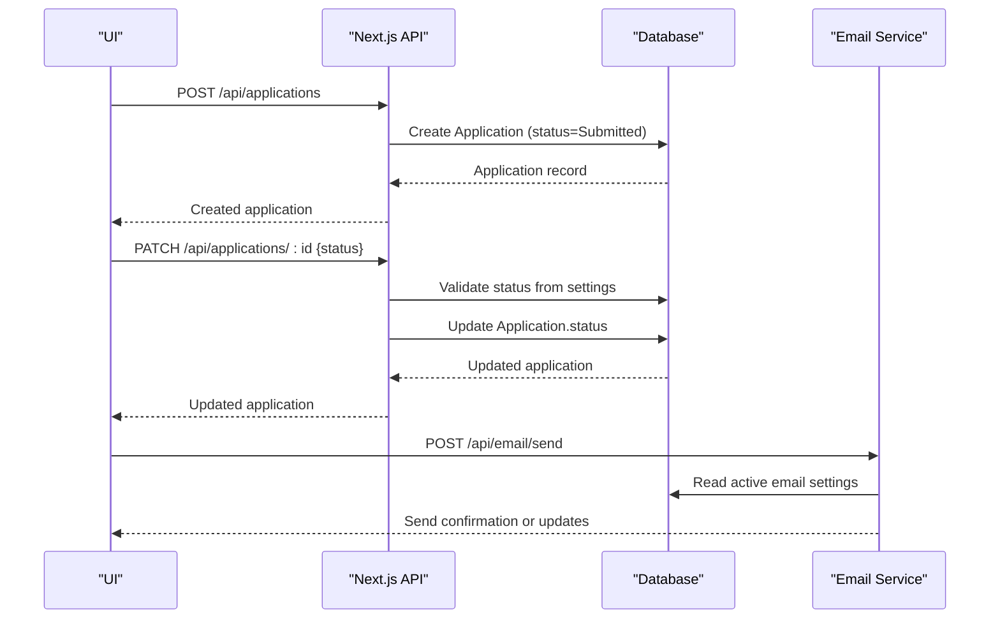

**Diagram sources**
- [applications/route.ts:75-113](file://src/app/api/applications/route.ts#L75-L113)
- [applications/[id]/route.ts:33-85](file://src/app/api/applications/[id]/route.ts#L33-L85)
- [email/send/route.ts:8-36](file://src/app/api/email/send/route.ts#L8-L36)
- [application-statuses.ts:41-72](file://src/lib/application-statuses.ts#L41-L72)

## Detailed Component Analysis

### Application Data Model and Relationships
- Application links a student, university, and course; includes appliedDate and status
- Per-application workflow stages track detailed processing steps and subtasks
- Global workflow stages define reusable stages per country and visa type
- System settings store configured application statuses and display stage labels

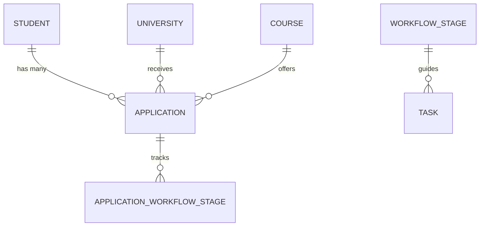

**Diagram sources**
- [schema.prisma:334-454](file://prisma/schema.prisma#L334-L454)
- [schema.prisma:587-629](file://prisma/schema.prisma#L587-L629)

**Section sources**
- [schema.prisma:411-454](file://prisma/schema.prisma#L411-L454)
- [schema.prisma:587-629](file://prisma/schema.prisma#L587-L629)

### Application Lifecycle: Creation, Listing, Update, Deletion
- Create: POST /api/applications requires studentId, universityId, courseId; sets initial status to Submitted
- List: GET /api/applications supports filtering by studentId, status, universityId, and search; returns paginated results
- Update: PATCH /api/applications/:id validates status against configured list; logs activity with diff
- Delete: DELETE /api/applications/:id removes application and logs activity

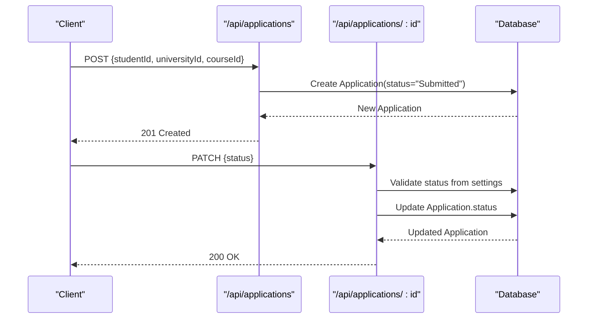

**Diagram sources**
- [applications/route.ts:75-113](file://src/app/api/applications/route.ts#L75-L113)
- [applications/[id]/route.ts:33-85](file://src/app/api/applications/[id]/route.ts#L33-L85)
- [application-statuses.ts:41-72](file://src/lib/application-statuses.ts#L41-L72)

**Section sources**
- [applications/route.ts:8-113](file://src/app/api/applications/route.ts#L8-L113)
- [applications/[id]/route.ts:8-118](file://src/app/api/applications/[id]/route.ts#L8-L118)

### Status Management and Stage Labels
- Configured statuses include name and stage label; defaults ensure a safe baseline
- Normalization handles legacy numeric step mappings and deduplicates stage sequences
- Validating status updates prevents invalid transitions

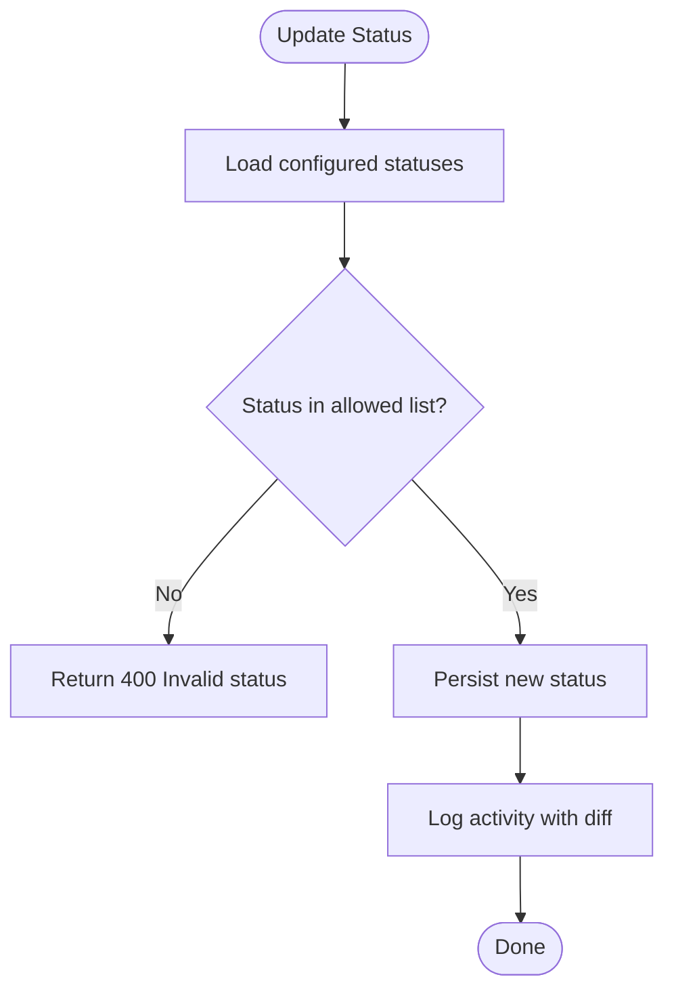

**Diagram sources**
- [application-statuses.ts:41-102](file://src/lib/application-statuses.ts#L41-L102)
- [applications/[id]/route.ts:33-85](file://src/app/api/applications/[id]/route.ts#L33-L85)

**Section sources**
- [application-statuses.ts:1-102](file://src/lib/application-statuses.ts#L1-L102)
- [applications/[id]/route.ts:33-85](file://src/app/api/applications/[id]/route.ts#L33-L85)

### Per-Application Workflow Stages
- Each application can have multiple ordered stages with optional descriptions and subtasks
- Stages can be created, updated, reordered, and deleted; changes are logged with diffs
- Subtasks support checklists within each stage

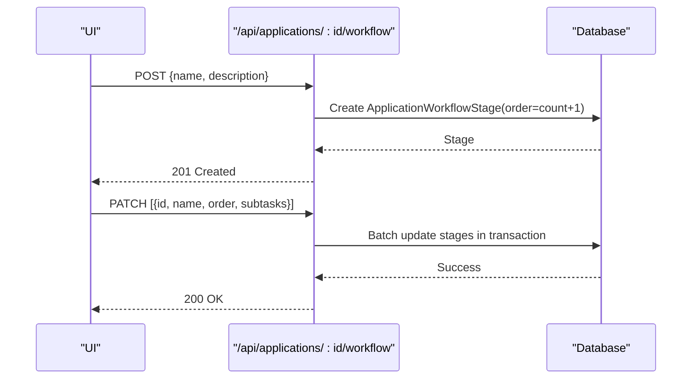

**Diagram sources**
- [applications/[id]/workflow/route.ts:26-148](file://src/app/api/applications/[id]/workflow/route.ts#L26-L148)

**Section sources**
- [applications/[id]/workflow/route.ts:7-193](file://src/app/api/applications/[id]/workflow/route.ts#L7-L193)

### Global Workflow Stages (Country + Visa Type)
- Global stages define reusable processing steps per country and visa type
- The Visa workflow dashboard manages these stages, subtasks, embassy details, and checklists
- Stages are ordered and persisted with activity logging

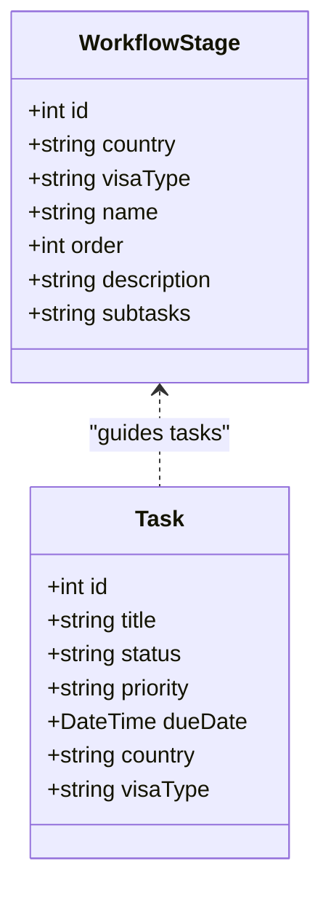

**Diagram sources**
- [schema.prisma:587-629](file://prisma/schema.prisma#L587-L629)
- [workflow-stages/route.ts:8-131](file://src/app/api/workflow-stages/route.ts#L8-L131)
- [VisaWorkflowDashboard.tsx:169-234](file://src/app/tasks/components/VisaWorkflowDashboard.tsx#L169-L234)

**Section sources**
- [workflow-stages/route.ts:8-131](file://src/app/api/workflow-stages/route.ts#L8-L131)
- [VisaWorkflowDashboard.tsx:169-234](file://src/app/tasks/components/VisaWorkflowDashboard.tsx#L169-L234)

### Visa Timeline Aggregation
- Aggregates stages, related tasks, and applications to compute progress per stage
- Highlights active stage based on task completion states
- Provides summary metrics for overall progress

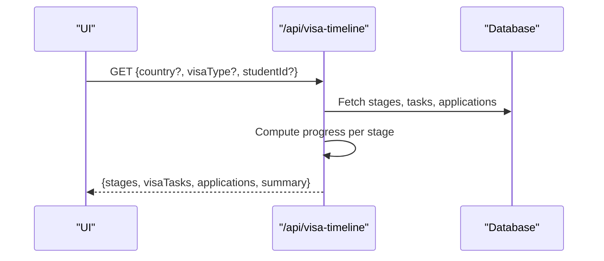

**Diagram sources**
- [visa-timeline/route.ts:21-115](file://src/app/api/visa-timeline/route.ts#L21-L115)

**Section sources**
- [visa-timeline/route.ts:21-115](file://src/app/api/visa-timeline/route.ts#L21-L115)

### Email Communications and Notifications
- Email sending requires an active SMTP configuration
- Supports sending messages to students and counselors with subject and body
- Integrates with activity logging and notifications

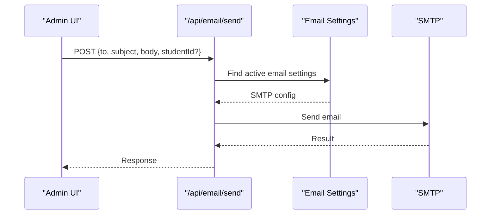

**Diagram sources**
- [email/send/route.ts:8-36](file://src/app/api/email/send/route.ts#L8-L36)

**Section sources**
- [email/send/route.ts:8-36](file://src/app/api/email/send/route.ts#L8-L36)

### Dashboard, Reporting, and Analytics
- Dashboard stats aggregate counts for universities, courses, leads, students, applications, and tasks
- Report generation supports querying entities with filters and mapping fields for charts
- Applications content displays status-based metrics for quick insights

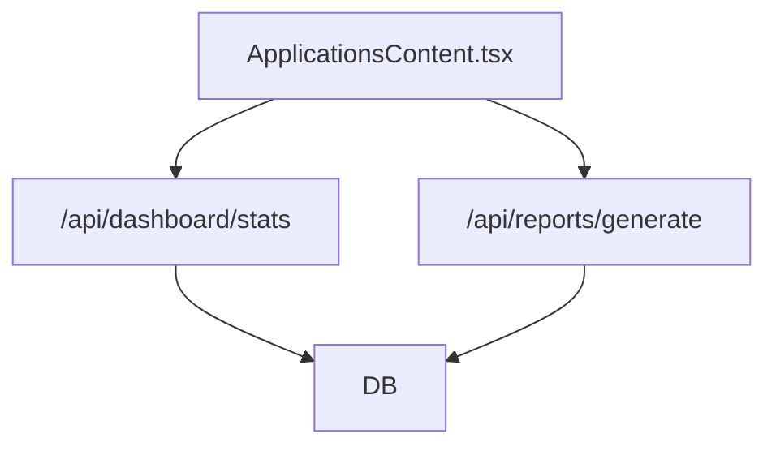

**Diagram sources**
- [dashboard/stats/route.ts:6-79](file://src/app/api/dashboard/stats/route.ts#L6-L79)
- [reports/generate/route.ts:7-99](file://src/app/api/reports/generate/route.ts#L7-L99)
- [ApplicationsContent.tsx:216-257](file://src/app/applications/components/ApplicationsContent.tsx#L216-L257)

**Section sources**
- [dashboard/stats/route.ts:6-79](file://src/app/api/dashboard/stats/route.ts#L6-L79)
- [reports/generate/route.ts:7-99](file://src/app/api/reports/generate/route.ts#L7-L99)
- [ApplicationsContent.tsx:216-257](file://src/app/applications/components/ApplicationsContent.tsx#L216-L257)

## Dependency Analysis
- API routes depend on Prisma client and shared utilities for session handling, pagination, and error formatting
- Application status validation depends on configured statuses loaded from system settings
- Visa timeline depends on WorkflowStage, Task, and Application relationships
- Email sending depends on active EmailSetting records
- Reports depend on entity-specific queries and field mapping

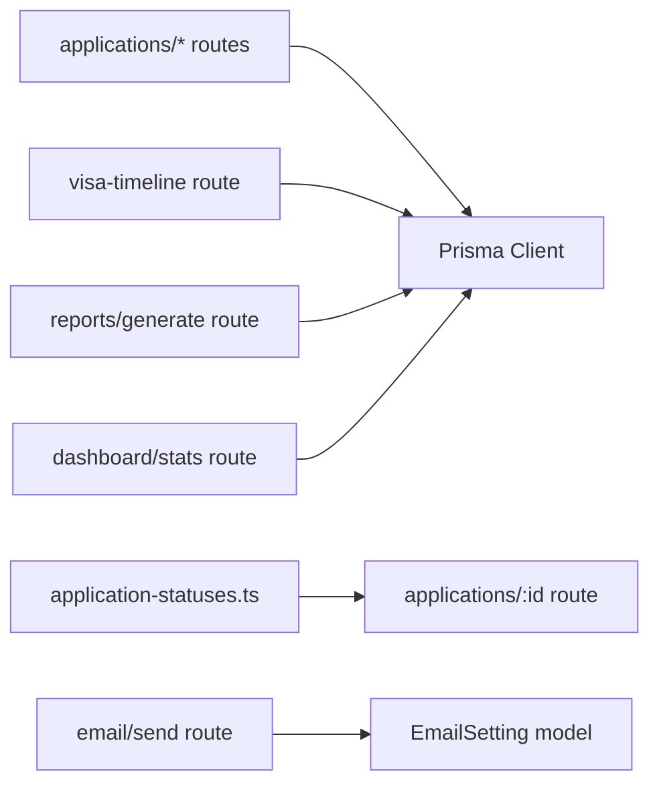

**Diagram sources**
- [applications/route.ts:1-113](file://src/app/api/applications/route.ts#L1-L113)
- [applications/[id]/route.ts:1-118](file://src/app/api/applications/[id]/route.ts#L1-L118)
- [application-statuses.ts:1-102](file://src/lib/application-statuses.ts#L1-L102)
- [visa-timeline/route.ts:21-115](file://src/app/api/visa-timeline/route.ts#L21-L115)
- [email/send/route.ts:8-36](file://src/app/api/email/send/route.ts#L8-L36)
- [reports/generate/route.ts:7-99](file://src/app/api/reports/generate/route.ts#L7-L99)
- [dashboard/stats/route.ts:6-79](file://src/app/api/dashboard/stats/route.ts#L6-L79)

**Section sources**
- [applications/route.ts:1-113](file://src/app/api/applications/route.ts#L1-L113)
- [applications/[id]/route.ts:1-118](file://src/app/api/applications/[id]/route.ts#L1-L118)
- [application-statuses.ts:1-102](file://src/lib/application-statuses.ts#L1-L102)
- [visa-timeline/route.ts:21-115](file://src/app/api/visa-timeline/route.ts#L21-L115)
- [email/send/route.ts:8-36](file://src/app/api/email/send/route.ts#L8-L36)
- [reports/generate/route.ts:7-99](file://src/app/api/reports/generate/route.ts#L7-L99)
- [dashboard/stats/route.ts:6-79](file://src/app/api/dashboard/stats/route.ts#L6-L79)

## Performance Considerations
- Use pagination for large application lists to reduce payload size
- Aggregate counts and summaries server-side to minimize client computation
- Batch updates for workflow stages using transactions to ensure consistency
- Cache frequently accessed configurations (e.g., statuses) where appropriate
- Optimize queries by selecting only required fields and using indexes defined in the schema

[No sources needed since this section provides general guidance]

## Troubleshooting Guide
Common issues and resolutions:
- Unauthorized errors: Ensure a valid session exists before calling protected endpoints
- Invalid status: Verify that the requested status is included in configured application statuses
- Missing email settings: Configure an active email setting before sending emails
- Empty workflow stages: Add global workflow stages for the selected country and visa type
- Timeline progress not updating: Check that tasks are marked completed and associated with correct country and visa type

**Section sources**
- [applications/[id]/route.ts:33-85](file://src/app/api/applications/[id]/route.ts#L33-L85)
- [email/send/route.ts:21-36](file://src/app/api/email/send/route.ts#L21-L36)
- [workflow-stages/route.ts:8-131](file://src/app/api/workflow-stages/route.ts#L8-L131)
- [visa-timeline/route.ts:21-115](file://src/app/api/visa-timeline/route.ts#L21-L115)

## Conclusion
UniTrack’s application processing workflow combines configurable statuses, per-application and global workflow stages, and robust reporting to streamline admissions and visa processing. The system enforces valid state transitions, tracks detailed progress, and integrates email communications for timely updates. Dashboards and analytics provide visibility into pipeline performance, while flexible reporting supports deeper analysis.

[No sources needed since this section summarizes without analyzing specific files]