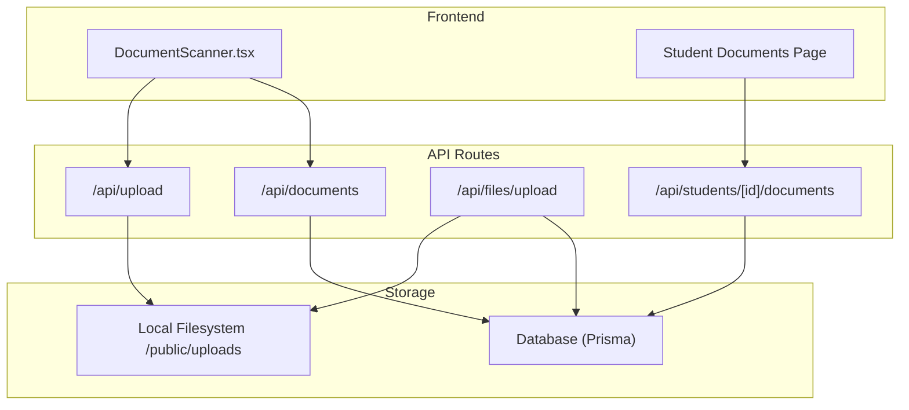
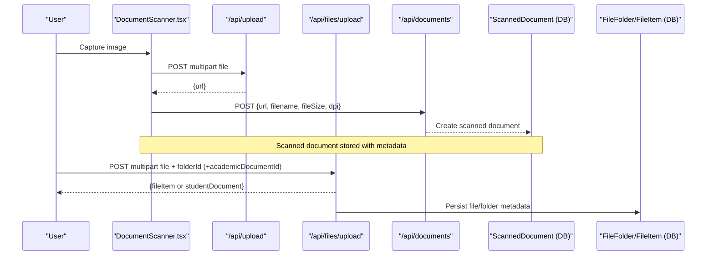
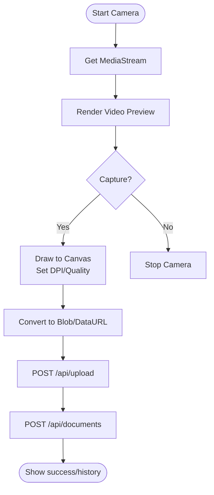
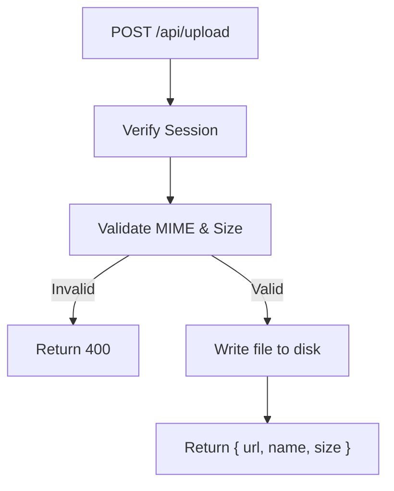
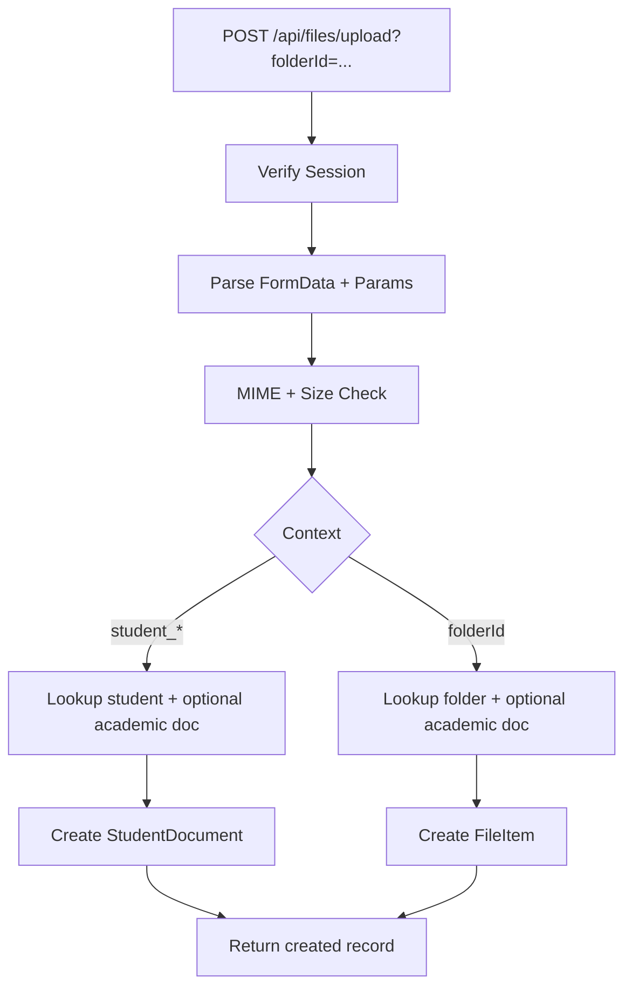
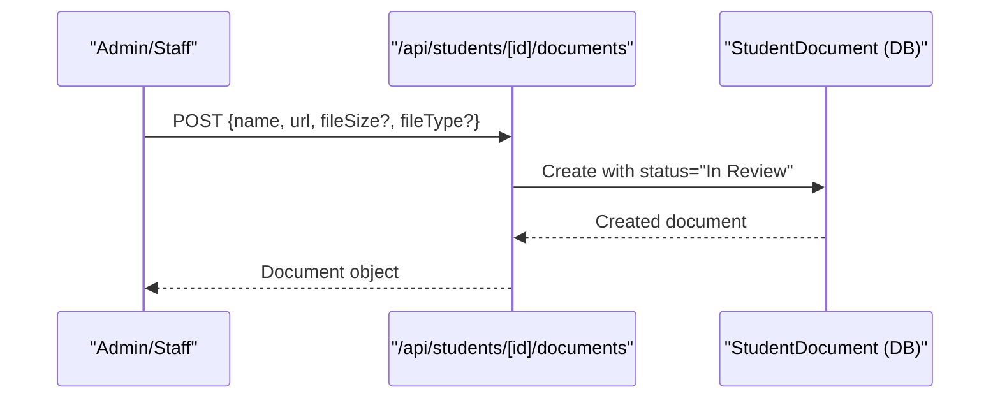
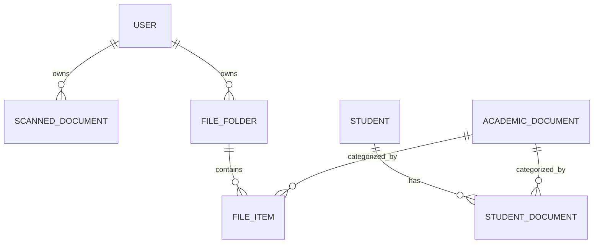
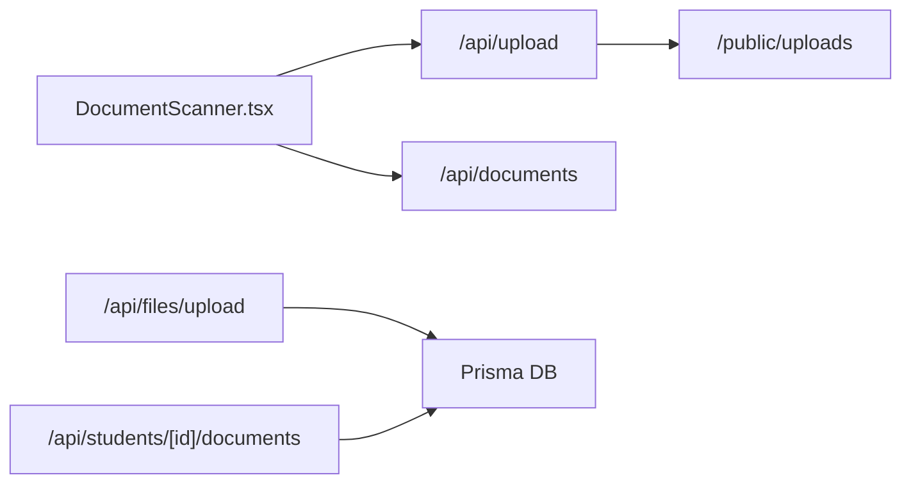

# Document Upload & Verification

<cite>
**Referenced Files in This Document**
- [route.ts](file://src/app/api/documents/route.ts)
- [route.ts](file://src/app/api/files/upload/route.ts)
- [route.ts](file://src/app/api/students/[id]/documents/route.ts)
- [route.ts](file://src/app/api/upload/route.ts)
- [DocumentScanner.tsx](file://src/app/documents/components/DocumentScanner.tsx)
- [page.tsx](file://src/app/documents/page.tsx)
- [page.tsx](file://src/app/student-portal/documents/page.tsx)
- [schema.prisma](file://prisma/schema.prisma)
- [SupportContent.tsx](file://src/app/support/components/SupportContent.tsx)
- [ApplicationDetailContent.tsx](file://src/app/applications/[id]/ApplicationDetailContent.tsx)
- [page.tsx](file://src/app/settings/backups/page.tsx)
- [route.ts](file://src/app/api/restore/route.ts)
</cite>

## Table of Contents
1. Introduction
2. Project Structure
3. Core Components
4. Architecture Overview
5. Detailed Component Analysis
6. Dependency Analysis
7. Performance Considerations
8. Troubleshooting Guide
9. Conclusion
10. Appendices

## Introduction
This document explains how the student system manages documents end-to-end: uploading, validation, storage, categorization, metadata, versioning considerations, scanning and capture, verification workflows, access control, security, backups, and compliance. It is designed for both technical and non-technical readers to understand how documents flow from capture to review and approval.

## Project Structure
The document feature spans several routes and UI components:
- Browser-based scanner that captures images and uploads them via a generic upload endpoint, then persists metadata to a scanned-document store.
- General file upload endpoint with MIME type allow-lists, size limits, and safe filename handling.
- Student-specific document endpoints to create/delete documents tied to a student record.
- Student portal page to view uploaded documents and their status.
- Database schema models for student documents, scanned documents, academic categories, folders, and file items.
- Support content describing default categories and verification statuses.
- Application detail UI that normalizes document statuses into workflow stages.
- Backup and restore utilities for data protection.

**Diagram sources**
- [DocumentScanner.tsx:169-211](file://src/app/documents/components/DocumentScanner.tsx#L169-L211)
- [route.ts:23-63](file://src/app/api/upload/route.ts#L23-L63)
- [route.ts:86-191](file://src/app/api/files/upload/route.ts#L86-L191)
- [route.ts:19-74](file://src/app/api/documents/route.ts#L19-L74)
- [route.ts:6-45](file://src/app/api/students/[id]/documents/route.ts#L6-L45)
- [schema.prisma:456-486](file://prisma/schema.prisma#L456-L486)
- [schema.prisma:770-814](file://prisma/schema.prisma#L770-L814)

**Section sources**
- [DocumentScanner.tsx:1-523](file://src/app/documents/components/DocumentScanner.tsx#L1-L523)
- [route.ts:1-110](file://src/app/api/documents/route.ts#L1-L110)
- [route.ts:1-192](file://src/app/api/files/upload/route.ts#L1-L192)
- [route.ts:1-86](file://src/app/api/students/[id]/documents/route.ts#L1-L86)
- [route.ts:1-64](file://src/app/api/upload/route.ts#L1-L64)
- [page.tsx:1-120](file://src/app/student-portal/documents/page.tsx#L1-L120)
- [schema.prisma:456-814](file://prisma/schema.prisma#L456-L814)

## Core Components
- Document Scanner (browser capture): Captures images at configurable DPI, previews, and uploads via the upload API; then records metadata in the scanned document store.
- Generic Upload API: Validates MIME types and size, writes files safely to disk, returns URLs.
- File Upload API with Folders: Supports folder-scoped uploads, optional association with academic document categories, and stores file metadata.
- Student Documents API: Creates and deletes documents linked to a specific student, setting initial status for review.
- Student Portal Documents View: Lists documents with icons based on extension and shows status badges.
- Database Models: StudentDocument, ScannedDocument, AcademicDocument, FileFolder, FileItem define relationships and indexes.

Key behaviors:
- Authentication checks are enforced on all write endpoints.
- Allowed MIME types are explicitly enumerated per endpoint.
- Safe filename generation avoids collisions and sanitizes input.
- Status fields enable simple workflow states (e.g., Uploaded, In Review).

**Section sources**
- [DocumentScanner.tsx:105-211](file://src/app/documents/components/DocumentScanner.tsx#L105-L211)
- [route.ts:19-110](file://src/app/api/documents/route.ts#L19-L110)
- [route.ts:19-191](file://src/app/api/files/upload/route.ts#L19-L191)
- [route.ts:6-86](file://src/app/api/students/[id]/documents/route.ts#L6-L86)
- [route.ts:23-63](file://src/app/api/upload/route.ts#L23-L63)
- [schema.prisma:456-814](file://prisma/schema.prisma#L456-L814)

## Architecture Overview
The system uses a browser-based scanner to capture images, which are uploaded to a server-side filesystem and referenced by database records. A separate general upload route supports broader file types and folder organization. Student documents are tracked with status fields to support review workflows.

**Diagram sources**
- [DocumentScanner.tsx:169-211](file://src/app/documents/components/DocumentScanner.tsx#L169-L211)
- [route.ts:23-63](file://src/app/api/upload/route.ts#L23-L63)
- [route.ts:86-191](file://src/app/api/files/upload/route.ts#L86-L191)
- [route.ts:38-74](file://src/app/api/documents/route.ts#L38-L74)
- [schema.prisma:456-486](file://prisma/schema.prisma#L456-L486)
- [schema.prisma:770-814](file://prisma/schema.prisma#L770-L814)

## Detailed Component Analysis

### Browser Document Scanner
- Captures camera stream, renders preview, and draws to canvas at selected DPI.
- Converts to JPEG with quality tuned by DPI.
- Uploads via the generic upload endpoint, then persists metadata via the scanned document API.
- Displays history and allows deletion.

**Diagram sources**
- [DocumentScanner.tsx:105-167](file://src/app/documents/components/DocumentScanner.tsx#L105-L167)
- [DocumentScanner.tsx:169-211](file://src/app/documents/components/DocumentScanner.tsx#L169-L211)
- [route.ts:23-63](file://src/app/api/upload/route.ts#L23-L63)
- [route.ts:38-74](file://src/app/api/documents/route.ts#L38-L74)

**Section sources**
- [DocumentScanner.tsx:1-523](file://src/app/documents/components/DocumentScanner.tsx#L1-L523)
- [route.ts:23-63](file://src/app/api/upload/route.ts#L23-L63)
- [route.ts:19-74](file://src/app/api/documents/route.ts#L19-L74)

### General File Upload Endpoint
- Enforces authentication.
- Validates MIME type against an allow-list and maximum file size.
- Sanitizes filenames and handles collisions.
- Writes to local filesystem under public/uploads and returns a URL.

**Diagram sources**
- [route.ts:23-63](file://src/app/api/upload/route.ts#L23-L63)

**Section sources**
- [route.ts:1-64](file://src/app/api/upload/route.ts#L1-L64)

### Folder-Based File Upload Endpoint
- Supports uploads into user-owned folders or student-scoped folders.
- Optionally associates files with academic document categories.
- Builds display names combining folder/category and original name.
- Persists file metadata to either FileItem or StudentDocument depending on context.

**Diagram sources**
- [route.ts:86-191](file://src/app/api/files/upload/route.ts#L86-L191)
- [schema.prisma:456-486](file://prisma/schema.prisma#L456-L486)
- [schema.prisma:785-814](file://prisma/schema.prisma#L785-L814)

**Section sources**
- [route.ts:1-192](file://src/app/api/files/upload/route.ts#L1-L192)
- [schema.prisma:456-814](file://prisma/schema.prisma#L456-L814)

### Student Documents API
- Creates documents for a given student with name, URL, optional metadata, and sets initial status to “In Review”.
- Deletes documents and logs activity.

**Diagram sources**
- [route.ts:6-45](file://src/app/api/students/[id]/documents/route.ts#L6-L45)
- [schema.prisma:456-472](file://prisma/schema.prisma#L456-L472)

**Section sources**
- [route.ts:1-86](file://src/app/api/students/[id]/documents/route.ts#L1-L86)
- [schema.prisma:456-472](file://prisma/schema.prisma#L456-L472)

### Student Portal Documents View
- Fetches and displays the authenticated student’s documents.
- Shows file-type icons based on URL extension and status badges.

**Section sources**
- [page.tsx:1-120](file://src/app/student-portal/documents/page.tsx#L1-L120)

### Data Model Relationships

**Diagram sources**
- [schema.prisma:456-486](file://prisma/schema.prisma#L456-L486)
- [schema.prisma:770-814](file://prisma/schema.prisma#L770-L814)

**Section sources**
- [schema.prisma:456-814](file://prisma/schema.prisma#L456-L814)

## Dependency Analysis
- Frontend scanner depends on browser media APIs and two backend endpoints: a generic upload and a scanned-document metadata endpoint.
- The folder-based upload endpoint depends on folder ownership and optional academic document category lookups.
- Student documents API depends on student existence and sets workflow status for downstream review.
- All write endpoints enforce session verification before performing operations.

**Diagram sources**
- [DocumentScanner.tsx:169-211](file://src/app/documents/components/DocumentScanner.tsx#L169-L211)
- [route.ts:23-63](file://src/app/api/upload/route.ts#L23-L63)
- [route.ts:86-191](file://src/app/api/files/upload/route.ts#L86-L191)
- [route.ts:6-45](file://src/app/api/students/[id]/documents/route.ts#L6-L45)

**Section sources**
- [DocumentScanner.tsx:169-211](file://src/app/documents/components/DocumentScanner.tsx#L169-L211)
- [route.ts:23-63](file://src/app/api/upload/route.ts#L23-L63)
- [route.ts:86-191](file://src/app/api/files/upload/route.ts#L86-L191)
- [route.ts:6-45](file://src/app/api/students/[id]/documents/route.ts#L6-L45)

## Performance Considerations
- DPI selection affects image resolution and upload size; higher DPI yields larger files and longer transfer times.
- MIME allow-lists and size limits protect server resources.
- Local filesystem storage is fast but may require scaling strategies (e.g., external object storage) for large volumes.
- Indexes on frequently queried fields (e.g., userId, studentId, folderId) improve list performance.

[No sources needed since this section provides general guidance]

## Troubleshooting Guide
Common issues and resolutions:
- Camera access denied or not found: Ensure browser permissions are granted and a camera is available. The scanner surfaces explicit error messages.
- Upload fails due to unsupported type or size: Confirm the file type is allowed and within limits enforced by the upload endpoints.
- Unauthorized errors: Verify the session token is present and valid when calling protected endpoints.
- Deletion failures: Ensure the document ID exists and belongs to the current user where applicable.

Operational notes:
- Activity logging occurs on create/delete actions for auditability.
- Backup and restore features support data protection and recovery.

**Section sources**
- [DocumentScanner.tsx:125-136](file://src/app/documents/components/DocumentScanner.tsx#L125-L136)
- [route.ts:35-41](file://src/app/api/upload/route.ts#L35-L41)
- [route.ts:88-98](file://src/app/api/files/upload/route.ts#L88-L98)
- [route.ts:8-17](file://src/app/api/documents/route.ts#L8-L17)
- [route.ts:76-108](file://src/app/api/documents/route.ts#L76-L108)
- [page.tsx:166-215](file://src/app/settings/backups/page.tsx#L166-L215)
- [route.ts:56-129](file://src/app/api/restore/route.ts#L56-L129)

## Conclusion
The system provides a robust pipeline for capturing, validating, storing, and organizing student documents. It supports multiple upload paths (scanner-driven and folder-based), maintains clear metadata and relationships, and exposes basic workflow states for review. Security is enforced via session checks and strict input validation, while backup and restore capabilities help ensure data resilience.

[No sources needed since this section summarizes without analyzing specific files]

## Appendices

### Document Categories and Metadata
- Default categories include academic transcripts, language test scores, passports/IDs, statements of purpose, recommendation letters, financial documents, offer letters, visa documents, and others.
- Documents can be associated with academic document categories and organized by folders.
- Metadata includes name, URL, file size, file type, and timestamps.

**Section sources**
- [SupportContent.tsx:1218-1243](file://src/app/support/components/SupportContent.tsx#L1218-L1243)
- [schema.prisma:456-486](file://prisma/schema.prisma#L456-L486)
- [schema.prisma:785-814](file://prisma/schema.prisma#L785-L814)

### Document Verification Workflow
- Statuses include Pending, Verified, Rejected, Needs Review.
- Normalization logic maps various status strings to workflow stages for consistent presentation.
- Staff can verify, reject, or flag documents and add notes.

**Section sources**
- [SupportContent.tsx:1246-1263](file://src/app/support/components/SupportContent.tsx#L1246-L1263)
- [ApplicationDetailContent.tsx:102-111](file://src/app/applications/[id]/ApplicationDetailContent.tsx#L102-L111)

### Access Control and Security
- All write endpoints validate sessions before processing requests.
- Allowed MIME types are explicitly enumerated per endpoint to prevent unsafe uploads.
- Backups support encryption and decryption flows for sensitive data protection.

**Section sources**
- [route.ts:8-17](file://src/app/api/documents/route.ts#L8-L17)
- [route.ts:23-41](file://src/app/api/upload/route.ts#L23-L41)
- [route.ts:88-113](file://src/app/api/files/upload/route.ts#L88-L113)
- [route.ts:56-75](file://src/app/api/restore/route.ts#L56-L75)
- [page.tsx:530-561](file://src/app/settings/backups/page.tsx#L530-L561)

### Backup Procedures
- Generate encrypted or unencrypted backups with selectable sections.
- Restore from uploaded backups with password handling for encrypted files.
- Enforce table allow-lists and payload validation during restore.

**Section sources**
- [page.tsx:166-215](file://src/app/settings/backups/page.tsx#L166-L215)
- [route.ts:56-129](file://src/app/api/restore/route.ts#L56-L129)