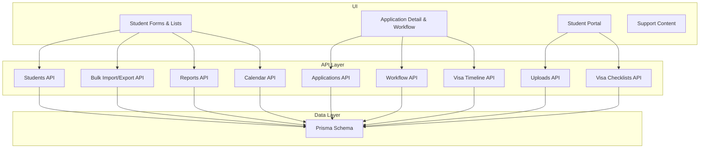
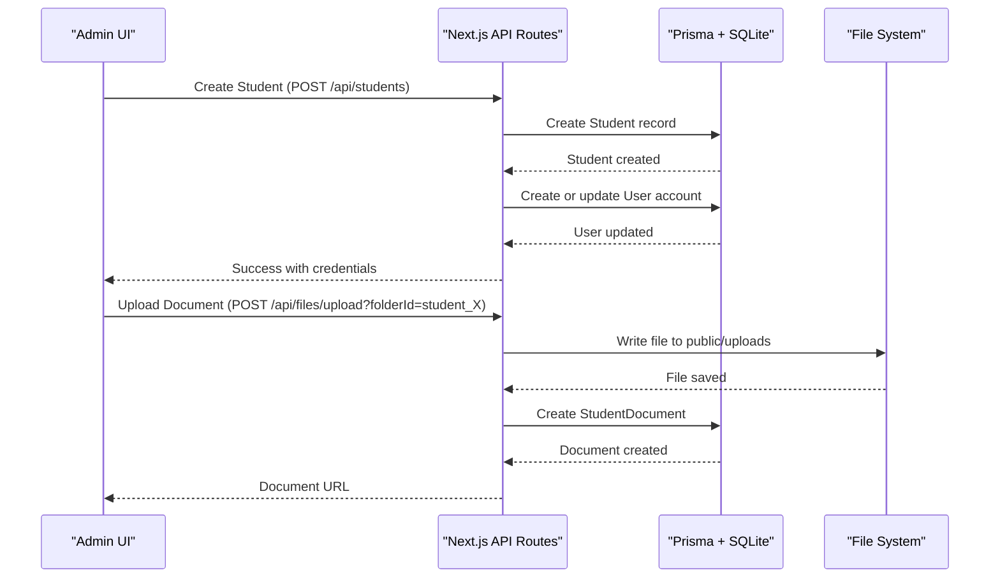
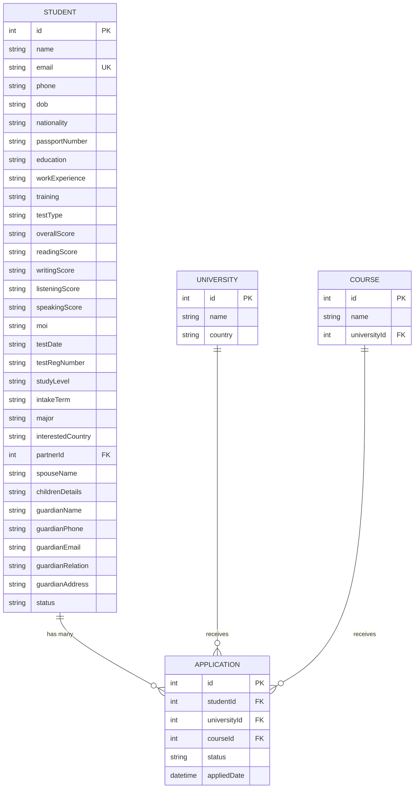
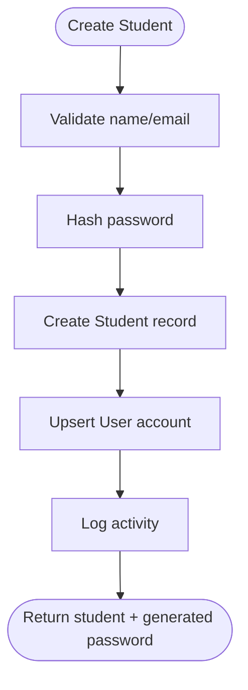
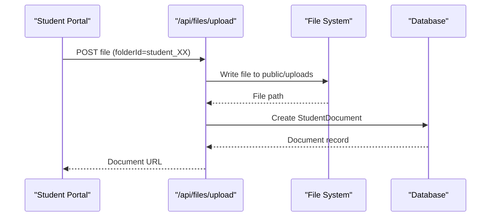
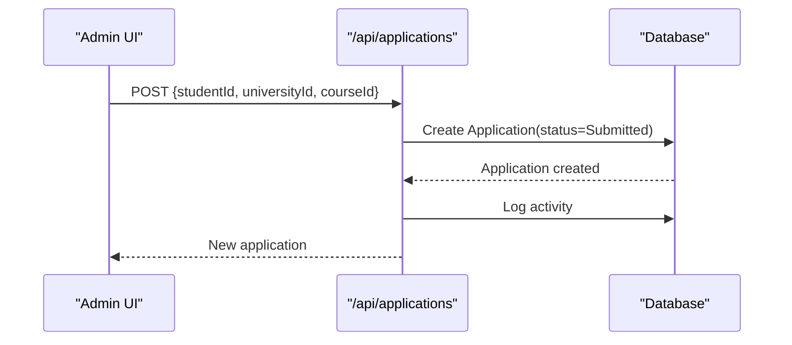
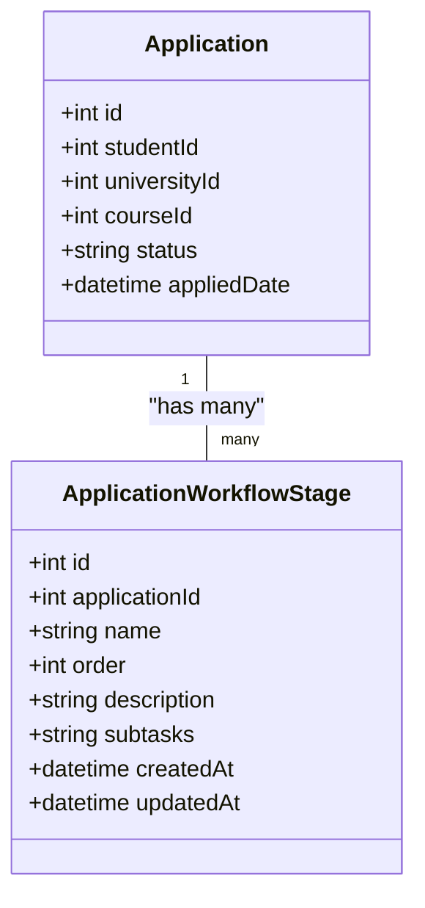
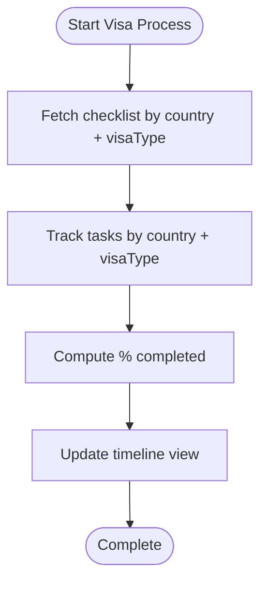
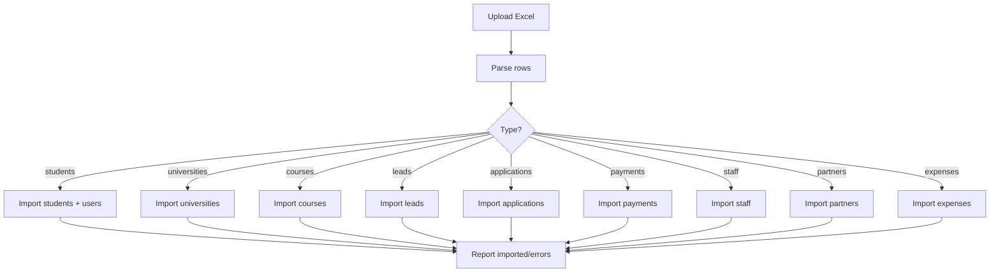
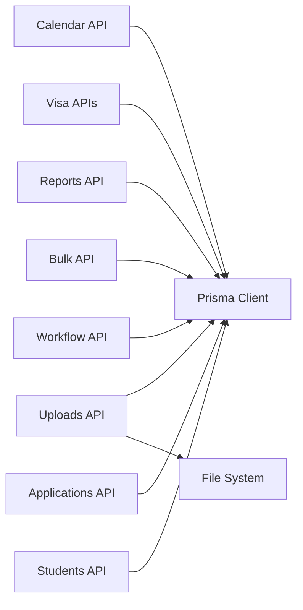

# Student Management System

<cite>
**Referenced Files in This Document**
- [schema.prisma](file://prisma/schema.prisma)
- [students/route.ts](file://src/app/api/students/route.ts)
- [applications/route.ts](file://src/app/api/applications/route.ts)
- [applications/[id]/workflow/route.ts](file://src/app/api/applications/[id]/workflow/route.ts)
- [visa-timeline/route.ts](file://src/app/api/visa-timeline/route.ts)
- [visa-checklists/route.ts](file://src/app/api/visa-checklists/route.ts)
- [files/upload/route.ts](file://src/app/api/files/upload/route.ts)
- [student-portal/documents/route.ts](file://src/app/api/student-portal/documents/route.ts)
- [bulk/route.ts](file://src/app/api/bulk/route.ts)
- [reports/generate/route.ts](file://src/app/api/reports/generate/route.ts)
- [calendar/route.ts](file://src/app/api/calendar/route.ts)
- [StudentForm.tsx](file://src/app/students/components/StudentForm.tsx)
- [StudentDocuments.tsx](file://src/app/student-portal/documents/page.tsx)
- [SupportContent.tsx](file://src/app/support/components/SupportContent.tsx)
</cite>

## Table of Contents
1. Introduction
2. Project Structure
3. Core Components
4. Architecture Overview
5. Detailed Component Analysis
6. Dependency Analysis
7. Performance Considerations
8. Troubleshooting Guide
9. Conclusion

## Introduction
This document explains the Student Management System with a focus on comprehensive student profile management and application processing. It covers the full lifecycle from lead capture to application submission, document verification, visa processing, and reporting. It also documents the data model for students, applications, documents, and related entities; bulk import/export capabilities; search and filtering; and the student portal for self-service tracking and uploads.

## Project Structure
The system is a Next.js application with:
- API routes under src/app/api handling CRUD, workflows, uploads, bulk operations, reports, and calendar events.
- Prisma schema defining core entities such as Student, Application, Course, University, Partner, StudentDocument, Payment, Task, VisaChecklist, and more.
- UI pages and components for student management, applications, documents, student portal, and support content.

**Diagram sources**
- [students/route.ts:1-214](file://src/app/api/students/route.ts#L1-L214)
- [applications/route.ts:1-113](file://src/app/api/applications/route.ts#L1-L113)
- [applications/[id]/workflow/route.ts:1-193](file://src/app/api/applications/[id]/workflow/route.ts#L1-L193)
- [files/upload/route.ts:1-192](file://src/app/api/files/upload/route.ts#L1-L192)
- [bulk/route.ts:1-591](file://src/app/api/bulk/route.ts#L1-L591)
- [reports/generate/route.ts:1-99](file://src/app/api/reports/generate/route.ts#L1-L99)
- [visa-checklists/route.ts:1-128](file://src/app/api/visa-checklists/route.ts#L1-L128)
- [visa-timeline/route.ts:21-56](file://src/app/api/visa-timeline/route.ts#L21-L56)
- [calendar/route.ts:66-108](file://src/app/api/calendar/route.ts#L66-L108)
- [schema.prisma:139-800](file://prisma/schema.prisma#L139-L800)

**Section sources**
- [schema.prisma:139-800](file://prisma/schema.prisma#L139-L800)
- [students/route.ts:1-214](file://src/app/api/students/route.ts#L1-L214)
- [applications/route.ts:1-113](file://src/app/api/applications/route.ts#L1-L113)

## Core Components
- Student profiles: Personal details, academic history, test scores, passport info, guardian details, partner linkage, and status tracking.
- Applications: Linking students to universities and courses with status and timeline tracking.
- Documents: Upload and categorization with verification statuses and student portal access.
- Workflows: Per-application stages and subtasks to manage processing steps.
- Visa processing: Country/visa-type checklists and timeline progress.
- Bulk operations: Import/export of students, universities, courses, leads, applications, payments, staff, partners, expenses.
- Reporting: Configurable queries across entities with filters and chart types.
- Calendar: Aggregated view of applications, tasks, follow-ups, payments.

**Section sources**
- [schema.prisma:334-472](file://prisma/schema.prisma#L334-L472)
- [applications/route.ts:1-113](file://src/app/api/applications/route.ts#L1-L113)
- [files/upload/route.ts:1-192](file://src/app/api/files/upload/route.ts#L1-L192)
- [applications/[id]/workflow/route.ts:1-193](file://src/app/api/applications/[id]/workflow/route.ts#L1-L193)
- [visa-checklists/route.ts:1-128](file://src/app/api/visa-checklists/route.ts#L1-L128)
- [bulk/route.ts:1-591](file://src/app/api/bulk/route.ts#L1-L591)
- [reports/generate/route.ts:1-99](file://src/app/api/reports/generate/route.ts#L1-L99)
- [calendar/route.ts:66-108](file://src/app/api/calendar/route.ts#L66-L108)

## Architecture Overview
The system follows a layered architecture:
- Frontend pages/components call REST-like API routes.
- API routes enforce session/auth, validate inputs, perform DB operations via Prisma, and return JSON responses.
- Data persistence uses SQLite (configured via Prisma).
- File uploads are stored locally under public/uploads and referenced by URLs.
- Activities and notifications are logged for auditability.

**Diagram sources**
- [students/route.ts:61-214](file://src/app/api/students/route.ts#L61-L214)
- [files/upload/route.ts:86-192](file://src/app/api/files/upload/route.ts#L86-L192)
- [schema.prisma:334-472](file://prisma/schema.prisma#L334-L472)

## Detailed Component Analysis

### Student Profile Data Model
Key fields include personal information (name, email, phone, gender, DOB), addresses (permanent/temporary), passport details, education/work/training history, test scores (IELTS/TOEFL/PTE), study level/intake/major, interested country, partner linkage, guardian/spouse/children details, and status metadata. Students can have multiple documents and payments, and one-to-many relationships to applications.

**Diagram sources**
- [schema.prisma:334-472](file://prisma/schema.prisma#L334-L472)

**Section sources**
- [schema.prisma:334-472](file://prisma/schema.prisma#L334-L472)

### Creating Student Profiles
- Admin creates a student via POST /api/students with required name/email and optional detailed fields.
- The system hashes the password, creates or updates a User account with role Student, and logs activity.
- Optional documents can be attached at creation time.

**Diagram sources**
- [students/route.ts:61-214](file://src/app/api/students/route.ts#L61-L214)

**Section sources**
- [students/route.ts:61-214](file://src/app/api/students/route.ts#L61-L214)

### Uploading Documents
- Students and staff can upload files to the server. For student-specific uploads, folderId uses a special prefix to associate with a student.
- Allowed MIME types and size limits are enforced. Files are written to public/uploads and recorded in StudentDocument.
- The student portal lists uploaded documents for each authenticated student.

**Diagram sources**
- [files/upload/route.ts:86-192](file://src/app/api/files/upload/route.ts#L86-L192)
- [student-portal/documents/page.tsx:1-51](file://src/app/student-portal/documents/page.tsx#L1-L51)

**Section sources**
- [files/upload/route.ts:86-192](file://src/app/api/files/upload/route.ts#L86-L192)
- [student-portal/documents/page.tsx:1-51](file://src/app/student-portal/documents/page.tsx#L1-L51)

### Application Submission and Status Tracking
- Applications link a student to a university and course with an initial status of Submitted.
- Applications can be filtered by student, status, and university; search supports student name/email.
- Activity logging records creation actions.

**Diagram sources**
- [applications/route.ts:75-113](file://src/app/api/applications/route.ts#L75-L113)

**Section sources**
- [applications/route.ts:1-113](file://src/app/api/applications/route.ts#L1-L113)

### Application Workflow Stages
- Each application has workflow stages with order and optional subtasks.
- Stages can be created, reordered, edited, and deleted with change logging.
- Useful for managing multi-step processes like offer issuance, enrollment, and visa preparation.

**Diagram sources**
- [applications/[id]/workflow/route.ts:1-193](file://src/app/api/applications/[id]/workflow/route.ts#L1-L193)
- [schema.prisma:411-454](file://prisma/schema.prisma#L411-L454)

**Section sources**
- [applications/[id]/workflow/route.ts:1-193](file://src/app/api/applications/[id]/workflow/route.ts#L1-L193)

### Visa Processing and Checklists
- Visa checklists are defined per country and visa type with required flags.
- Visa timeline aggregates stages, tasks, and applications to show progress and completion percentages.

**Diagram sources**
- [visa-checklists/route.ts:1-128](file://src/app/api/visa-checklists/route.ts#L1-L128)
- [visa-timeline/route.ts:21-56](file://src/app/api/visa-timeline/route.ts#L21-L56)

**Section sources**
- [visa-checklists/route.ts:1-128](file://src/app/api/visa-checklists/route.ts#L1-L128)
- [visa-timeline/route.ts:21-56](file://src/app/api/visa-timeline/route.ts#L21-L56)

### Bulk Import/Export
- Supports importing students, universities, courses, leads, applications, payments, staff, partners, and expenses from Excel.
- Exports selected entities to Excel or JSON with consistent field mapping.
- Errors are collected per row and reported back.

**Diagram sources**
- [bulk/route.ts:59-408](file://src/app/api/bulk/route.ts#L59-L408)
- [bulk/route.ts:410-591](file://src/app/api/bulk/route.ts#L410-L591)

**Section sources**
- [bulk/route.ts:59-408](file://src/app/api/bulk/route.ts#L59-L408)
- [bulk/route.ts:410-591](file://src/app/api/bulk/route.ts#L410-L591)

### Search and Filtering
- Students API supports search by name/email/phone/passport, plus filters by status, country, and counselor.
- Applications API supports search by student name/email and filters by status/university.
- Global search guidance includes module filters, date ranges, and advanced query tips.

**Section sources**
- [students/route.ts:9-59](file://src/app/api/students/route.ts#L9-L59)
- [applications/route.ts:8-73](file://src/app/api/applications/route.ts#L8-L73)
- [SupportContent.tsx:1910-1944](file://src/app/support/components/SupportContent.tsx#L1910-L1944)

### Reporting Features
- Report builder allows selecting entity, fields, and filters; returns mapped results limited to 500 rows.
- Supports entities: Student, University, Course, Lead, Payment, Application.
- Chart types available in UI: Table, Bar, Pie, Line.

**Section sources**
- [reports/generate/route.ts:1-99](file://src/app/api/reports/generate/route.ts#L1-L99)
- [SupportContent.tsx:1646-1677](file://src/app/support/components/SupportContent.tsx#L1646-L1677)

### Calendar Integration
- Aggregates applications, tasks, leave requests, follow-ups, and payments into a unified calendar view with start/end dates and navigation links.

**Section sources**
- [calendar/route.ts:66-108](file://src/app/api/calendar/route.ts#L66-L108)

### Student Portal Functionality
- Students can log in using their email and password set during student creation.
- They can view applications, upload documents, and manage profile information.
- The documents page fetches and displays the student’s uploaded files.

**Section sources**
- [students/route.ts:176-205](file://src/app/api/students/route.ts#L176-L205)
- [SupportContent.tsx:989-1004](file://src/app/support/components/SupportContent.tsx#L989-L1004)
- [student-portal/documents/page.tsx:1-51](file://src/app/student-portal/documents/page.tsx#L1-L51)

### Commission Tracking and University Integrations
- Universities and courses store commission configuration (type and value).
- Support content describes setting up flat or percentage-based commissions per university/course.
- Commissions influence agent payouts when students enroll through partners.

**Section sources**
- [schema.prisma:19-119](file://prisma/schema.prisma#L19-L119)
- [SupportContent.tsx:348-365](file://src/app/support/components/SupportContent.tsx#L348-L365)
- [SupportContent.tsx:555-572](file://src/app/support/components/SupportContent.tsx#L555-L572)

### Example Workflows

#### Create a Student Profile
- Use the student form to enter personal and academic details, then submit.
- The system generates a password, creates a user account, and logs the action.

**Section sources**
- [StudentForm.tsx:1911-1930](file://src/app/students/components/StudentForm.tsx#L1911-L1930)
- [students/route.ts:61-214](file://src/app/api/students/route.ts#L61-L214)

#### Upload Documents
- Navigate to Documents or use the student portal to upload files.
- Files are validated, stored, and linked to the student record.

**Section sources**
- [files/upload/route.ts:86-192](file://src/app/api/files/upload/route.ts#L86-L192)
- [SupportContent.tsx:1174-1243](file://src/app/support/components/SupportContent.tsx#L1174-L1243)

#### Submit an Application
- Select a student, university, and course; submit to create an application with status “Submitted”.
- Track progress via workflow stages and visa timelines.

**Section sources**
- [applications/route.ts:75-113](file://src/app/api/applications/route.ts#L75-L113)
- [applications/[id]/workflow/route.ts:1-193](file://src/app/api/applications/[id]/workflow/route.ts#L1-L193)
- [visa-timeline/route.ts:21-56](file://src/app/api/visa-timeline/route.ts#L21-L56)

## Dependency Analysis
- API routes depend on Prisma client for database operations and on shared utilities for pagination, session handling, and error formatting.
- File uploads depend on local filesystem storage and reference URLs stored in the database.
- Reports and bulk operations depend on structured entity schemas and consistent field mappings.

**Diagram sources**
- [students/route.ts:1-214](file://src/app/api/students/route.ts#L1-L214)
- [applications/route.ts:1-113](file://src/app/api/applications/route.ts#L1-L113)
- [applications/[id]/workflow/route.ts:1-193](file://src/app/api/applications/[id]/workflow/route.ts#L1-L193)
- [files/upload/route.ts:1-192](file://src/app/api/files/upload/route.ts#L1-L192)
- [bulk/route.ts:1-591](file://src/app/api/bulk/route.ts#L1-L591)
- [reports/generate/route.ts:1-99](file://src/app/api/reports/generate/route.ts#L1-L99)
- [visa-checklists/route.ts:1-128](file://src/app/api/visa-checklists/route.ts#L1-L128)
- [visa-timeline/route.ts:21-56](file://src/app/api/visa-timeline/route.ts#L21-L56)
- [calendar/route.ts:66-108](file://src/app/api/calendar/route.ts#L66-L108)

**Section sources**
- [students/route.ts:1-214](file://src/app/api/students/route.ts#L1-L214)
- [applications/route.ts:1-113](file://src/app/api/applications/route.ts#L1-L113)
- [files/upload/route.ts:1-192](file://src/app/api/files/upload/route.ts#L1-L192)
- [bulk/route.ts:1-591](file://src/app/api/bulk/route.ts#L1-L591)
- [reports/generate/route.ts:1-99](file://src/app/api/reports/generate/route.ts#L1-L99)

## Performance Considerations
- Pagination: Use skip/take parameters for large datasets in students and applications endpoints.
- Indexing: Ensure indexes exist on frequently queried fields (e.g., studentId, universityId, courseId).
- File sizes: Enforce maximum file size to prevent memory pressure during uploads.
- Report limits: Cap report results to avoid excessive payloads (e.g., 500 rows).
- Batch operations: Prefer bulk imports over individual inserts for large datasets.
- Database engine: SQLite is suitable for moderate workloads; consider migration strategies if scaling beyond its limits.

[No sources needed since this section provides general guidance]

## Troubleshooting Guide
- Duplicate emails: When creating students or importing, duplicate email errors indicate existing records; handle by updating or skipping duplicates.
- Unauthorized access: Ensure sessions are valid before accessing protected endpoints.
- File upload failures: Check allowed MIME types and file size limits; verify folder permissions for uploads directory.
- Missing required fields: Validate inputs for student creation, application submission, and bulk imports to avoid partial records.
- Workflow stage issues: Verify that stage names and orders are valid; reordering may require transactional updates.

**Section sources**
- [students/route.ts:206-214](file://src/app/api/students/route.ts#L206-L214)
- [bulk/route.ts:135-143](file://src/app/api/bulk/route.ts#L135-L143)
- [files/upload/route.ts:106-113](file://src/app/api/files/upload/route.ts#L106-L113)
- [applications/[id]/workflow/route.ts:31-69](file://src/app/api/applications/[id]/workflow/route.ts#L31-L69)

## Conclusion
The Student Management System provides a robust foundation for managing student profiles, applications, documents, and visa processes. With strong API layering, Prisma-backed data models, and practical features like bulk import/export, reporting, and student portal access, it supports efficient administration and transparent student experiences. Proper indexing, pagination, and validation ensure scalability and reliability even as the student database grows.