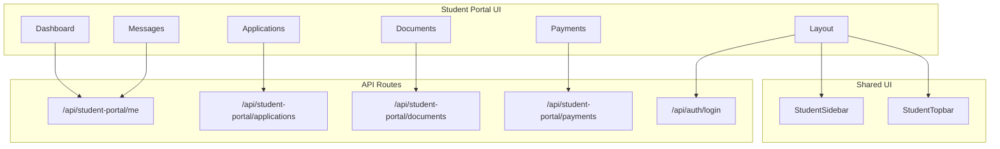
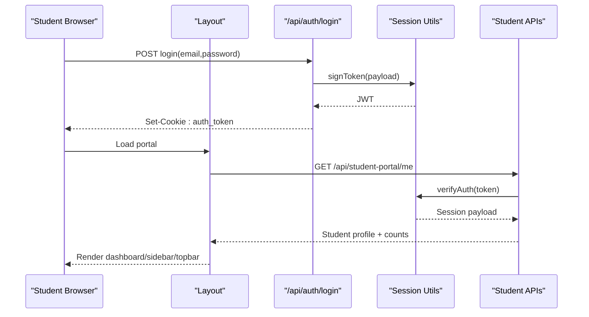
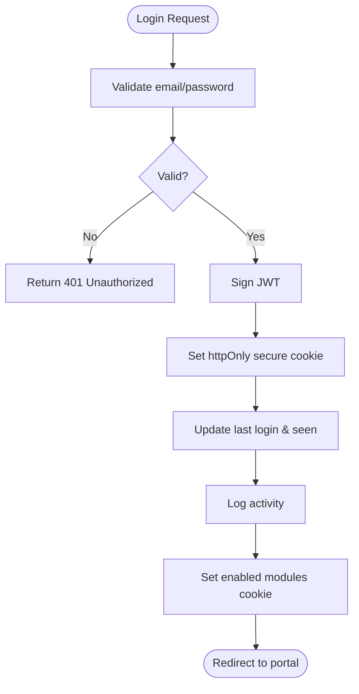
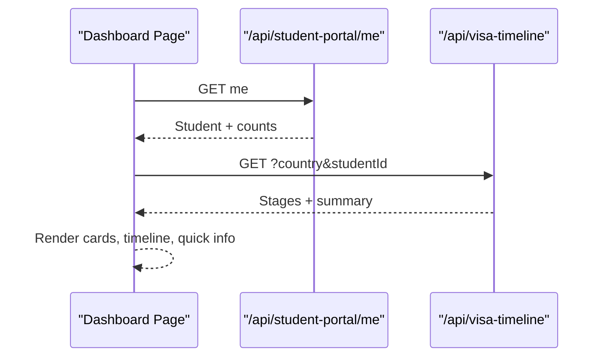
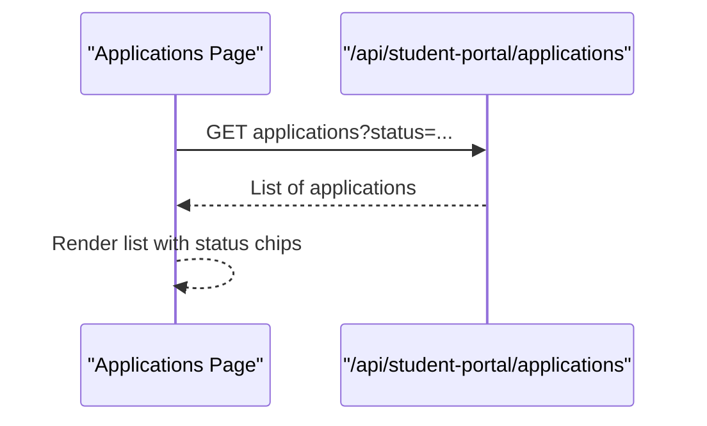
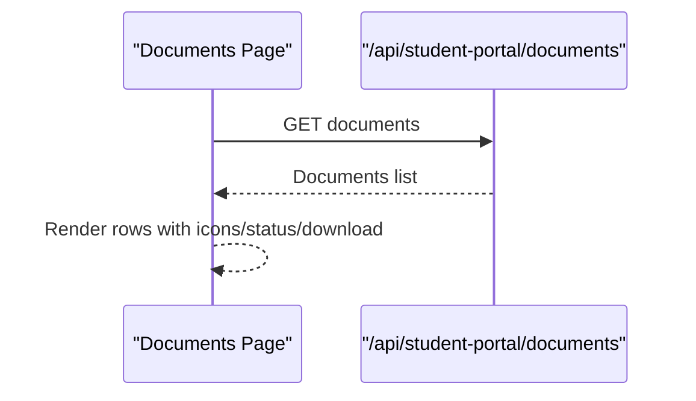
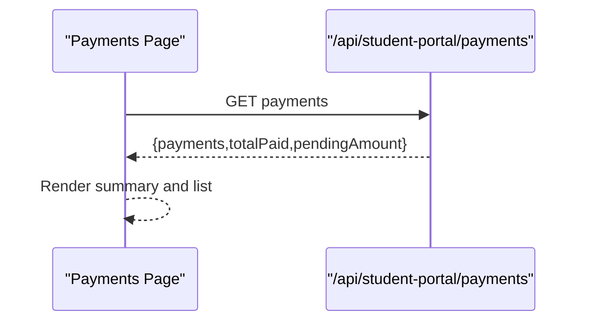
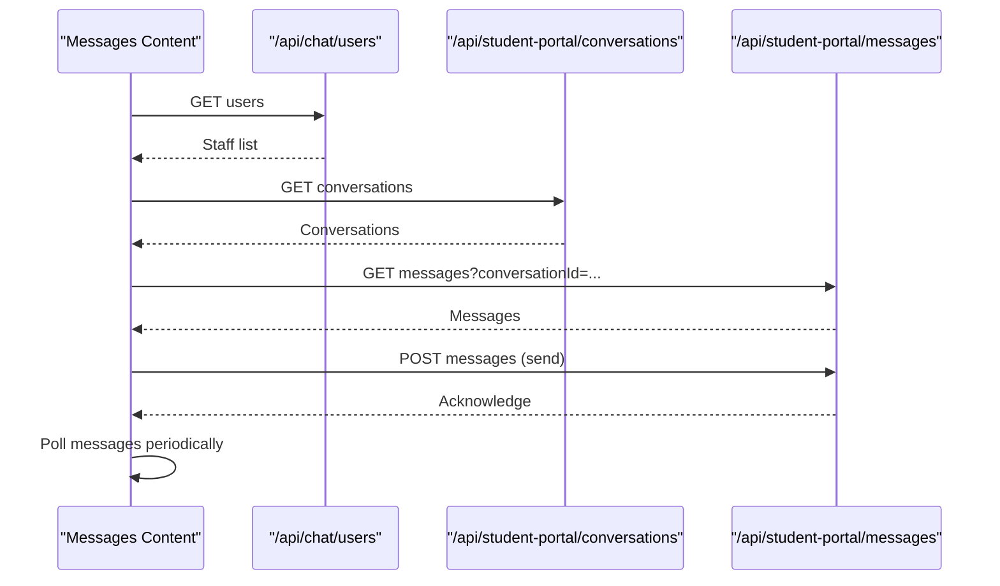
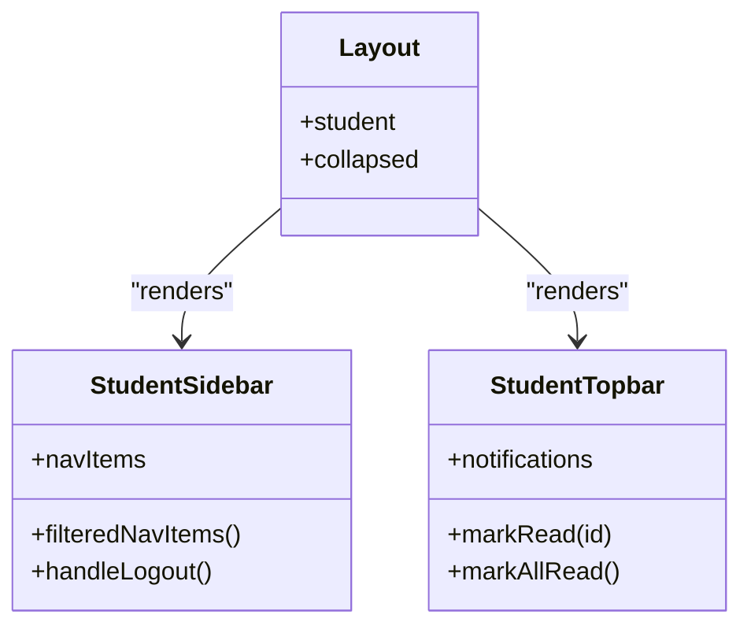
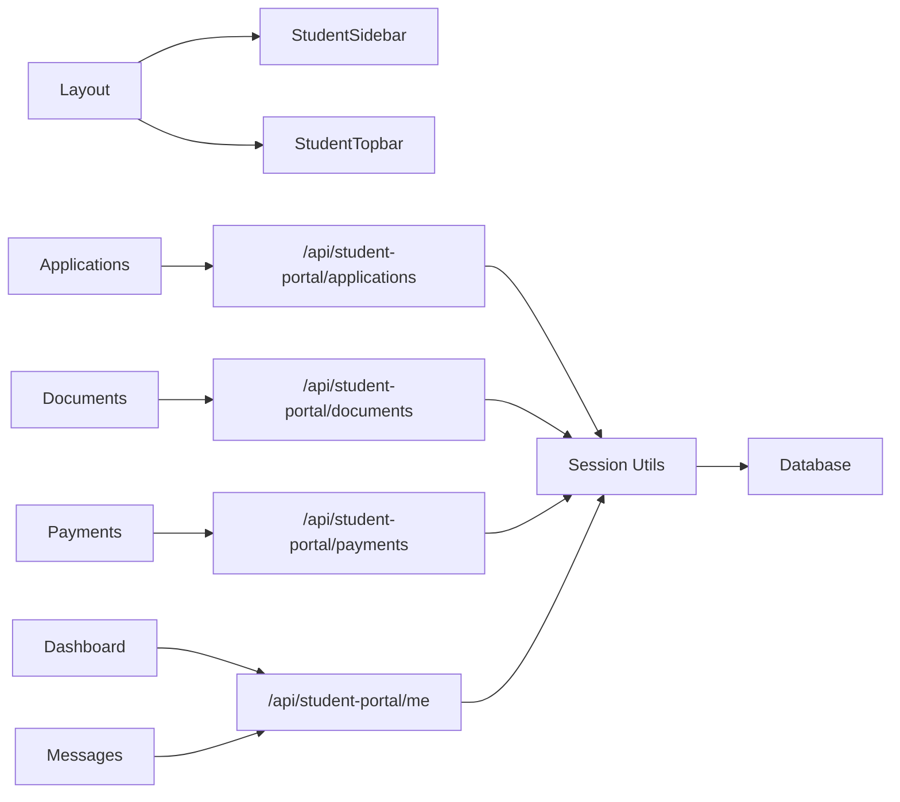

# Student Portal & Self-Service

<cite>
**Referenced Files in This Document**
- [layout.tsx](file://src/app/student-portal/layout.tsx)
- [dashboard/page.tsx](file://src/app/student-portal/dashboard/page.tsx)
- [applications/page.tsx](file://src/app/student-portal/applications/page.tsx)
- [documents/page.tsx](file://src/app/student-portal/documents/page.tsx)
- [payments/page.tsx](file://src/app/student-portal/payments/page.tsx)
- [messages/page.tsx](file://src/app/student-portal/messages/page.tsx)
- [StudentMessagesContent.tsx](file://src/app/student-portal/messages/components/StudentMessagesContent.tsx)
- [StudentSidebar.tsx](file://src/components/StudentSidebar.tsx)
- [StudentTopbar.tsx](file://src/components/StudentTopbar.tsx)
- [client-session.ts](file://src/lib/client-session.ts)
- [route.ts (student-portal/me)](file://src/app/api/student-portal/me/route.ts)
- [route.ts (student-portal/applications)](file://src/app/api/student-portal/applications/route.ts)
- [route.ts (student-portal/documents)](file://src/app/api/student-portal/documents/route.ts)
- [route.ts (student-portal/payments)](file://src/app/api/student-portal/payments/route.ts)
- [route.ts (auth/login)](file://src/app/api/auth/login/route.ts)
- [session.ts](file://src/lib/session.ts)
- [api-utils.ts](file://src/lib/api-utils.ts)
</cite>

## Table of Contents
1. Introduction
2. Project Structure
3. Core Components
4. Architecture Overview
5. Detailed Component Analysis
6. Dependency Analysis
7. Performance Considerations
8. Troubleshooting Guide
9. Conclusion

## Introduction
This document explains the student portal and self-service capabilities, including authentication, dashboard interface, navigation, application tracking, document uploads, payment processing, communication tools, responsive design, security considerations, and integration points with the admin system. It is designed for both technical and non-technical readers to understand how students interact with the system and how data flows across components.

## Project Structure
The student portal is implemented as a Next.js app with:
- A shared layout that enforces session checks and renders sidebar/topbar chrome
- Feature pages for dashboard, applications, documents, payments, and messages
- API routes under /api/student-portal/* that enforce authentication and return scoped data
- Shared UI components for navigation and notifications
- Session utilities for JWT handling and cookie-based auth

**Diagram sources**
- [layout.tsx:27-76](file://src/app/student-portal/layout.tsx#L27-L76)
- [dashboard/page.tsx:59-103](file://src/app/student-portal/dashboard/page.tsx#L59-L103)
- [applications/page.tsx:48-60](file://src/app/student-portal/applications/page.tsx#L48-L60)
- [documents/page.tsx:39-51](file://src/app/student-portal/documents/page.tsx#L39-L51)
- [payments/page.tsx:31-43](file://src/app/student-portal/payments/page.tsx#L31-L43)
- [StudentMessagesContent.tsx:49-78](file://src/app/student-portal/messages/components/StudentMessagesContent.tsx#L49-L78)
- [StudentSidebar.tsx:20-56](file://src/components/StudentSidebar.tsx#L20-L56)
- [StudentTopbar.tsx:16-22](file://src/components/StudentTopbar.tsx#L16-L22)
- [route.ts (student-portal/me):5-27](file://src/app/api/student-portal/me/route.ts#L5-L27)
- [route.ts (student-portal/applications):6-34](file://src/app/api/student-portal/applications/route.ts#L6-L34)
- [route.ts (student-portal/documents):5-20](file://src/app/api/student-portal/documents/route.ts#L5-L20)
- [route.ts (student-portal/payments):5-30](file://src/app/api/student-portal/payments/route.ts#L5-L30)
- [route.ts (auth/login):19-117](file://src/app/api/auth/login/route.ts#L19-L117)

**Section sources**
- [layout.tsx:27-76](file://src/app/student-portal/layout.tsx#L27-L76)
- [StudentSidebar.tsx:20-56](file://src/components/StudentSidebar.tsx#L20-L56)
- [StudentTopbar.tsx:16-22](file://src/components/StudentTopbar.tsx#L16-L22)

## Core Components
- Layout: Validates session, fetches current student profile, and renders sidebar/topbar with main content area.
- Dashboard: Shows quick links to Applications, Payments, Documents; displays visa workflow progress per interested country.
- Applications: Lists student’s applications with status badges and course/university details.
- Documents: Lists uploaded documents with type icons, status, and download links.
- Payments: Summarizes total paid and pending amounts; lists payment history with statuses.
- Messages: Enables conversations with staff, message sending, and polling for updates.
- Sidebar: Navigation menu filtered by enabled modules; supports collapse/expand and logout.
- Topbar: Breadcrumbs, notifications panel with real-time updates via Server-Sent Events, and user identity.

**Section sources**
- [layout.tsx:27-76](file://src/app/student-portal/layout.tsx#L27-L76)
- [dashboard/page.tsx:59-103](file://src/app/student-portal/dashboard/page.tsx#L59-L103)
- [applications/page.tsx:48-60](file://src/app/student-portal/applications/page.tsx#L48-L60)
- [documents/page.tsx:39-51](file://src/app/student-portal/documents/page.tsx#L39-L51)
- [payments/page.tsx:31-43](file://src/app/student-portal/payments/page.tsx#L31-L43)
- [StudentMessagesContent.tsx:49-78](file://src/app/student-portal/messages/components/StudentMessagesContent.tsx#L49-L78)
- [StudentSidebar.tsx:20-56](file://src/components/StudentSidebar.tsx#L20-L56)
- [StudentTopbar.tsx:51-90](file://src/components/StudentTopbar.tsx#L51-L90)

## Architecture Overview
Authentication and session management are centralized:
- Login sets an httpOnly JWT cookie and returns enabled modules.
- Client-side layout checks session state and redirects if unauthorized.
- All student-facing API routes validate the session before serving data.

**Diagram sources**
- [route.ts (auth/login):19-117](file://src/app/api/auth/login/route.ts#L19-L117)
- [session.ts:19-36](file://src/lib/session.ts#L19-L36)
- [api-utils.ts:13-22](file://src/lib/api-utils.ts#L13-L22)
- [layout.tsx:33-55](file://src/app/student-portal/layout.tsx#L33-L55)
- [route.ts (student-portal/me):5-27](file://src/app/api/student-portal/me/route.ts#L5-L27)

## Detailed Component Analysis

### Authentication Flow
- The login endpoint validates credentials, signs a JWT, sets an httpOnly secure cookie, updates last login metadata, records activity, and sets enabled modules cookie.
- The client layout verifies session on mount and redirects to login if not authenticated.
- Session utilities provide token signing and verification using a secret from environment variables.

**Diagram sources**
- [route.ts (auth/login):19-117](file://src/app/api/auth/login/route.ts#L19-L117)
- [session.ts:19-36](file://src/lib/session.ts#L19-L36)
- [api-utils.ts:13-22](file://src/lib/api-utils.ts#L13-L22)

**Section sources**
- [route.ts (auth/login):19-117](file://src/app/api/auth/login/route.ts#L19-L117)
- [session.ts:19-36](file://src/lib/session.ts#L19-L36)
- [layout.tsx:33-55](file://src/app/student-portal/layout.tsx#L33-L55)

### Dashboard Interface
- Fetches current student profile and counts for applications, payments, and documents.
- Loads visa workflow timeline based on the student’s interested country and shows stage progress and tasks.
- Provides quick links to key sections.

**Diagram sources**
- [dashboard/page.tsx:66-103](file://src/app/student-portal/dashboard/page.tsx#L66-L103)
- [route.ts (student-portal/me):5-27](file://src/app/api/student-portal/me/route.ts#L5-L27)

**Section sources**
- [dashboard/page.tsx:59-103](file://src/app/student-portal/dashboard/page.tsx#L59-L103)

### Application Tracking
- Displays all applications for the logged-in student with status badges and course/university details.
- Supports optional filtering by status via query parameters.

**Diagram sources**
- [applications/page.tsx:48-60](file://src/app/student-portal/applications/page.tsx#L48-L60)
- [route.ts (student-portal/applications):6-34](file://src/app/api/student-portal/applications/route.ts#L6-L34)

**Section sources**
- [applications/page.tsx:48-60](file://src/app/student-portal/applications/page.tsx#L48-L60)
- [route.ts (student-portal/applications):6-34](file://src/app/api/student-portal/applications/route.ts#L6-L34)

### Document Uploads and Viewing
- Lists documents associated with the student, showing file type icons, status, upload date, and download link.
- Data is fetched from a dedicated endpoint scoped to the authenticated student.

**Diagram sources**
- [documents/page.tsx:39-51](file://src/app/student-portal/documents/page.tsx#L39-L51)
- [route.ts (student-portal/documents):5-20](file://src/app/api/student-portal/documents/route.ts#L5-L20)

**Section sources**
- [documents/page.tsx:39-51](file://src/app/student-portal/documents/page.tsx#L39-L51)
- [route.ts (student-portal/documents):5-20](file://src/app/api/student-portal/documents/route.ts#L5-L20)

### Payment Processing View
- Shows total paid and pending amounts computed from payment records.
- Lists individual payments with method, date, description, and status.

**Diagram sources**
- [payments/page.tsx:31-43](file://src/app/student-portal/payments/page.tsx#L31-L43)
- [route.ts (student-portal/payments):5-30](file://src/app/api/student-portal/payments/route.ts#L5-L30)

**Section sources**
- [payments/page.tsx:31-43](file://src/app/student-portal/payments/page.tsx#L31-L43)
- [route.ts (student-portal/payments):5-30](file://src/app/api/student-portal/payments/route.ts#L5-L30)

### Communication Tools (Messages)
- Students can start conversations with staff, send messages, and view conversation history.
- Uses polling to refresh messages and integrates with chat endpoints for users and conversations.

**Diagram sources**
- [StudentMessagesContent.tsx:49-78](file://src/app/student-portal/messages/components/StudentMessagesContent.tsx#L49-L78)
- [StudentMessagesContent.tsx:94-128](file://src/app/student-portal/messages/components/StudentMessagesContent.tsx#L94-L128)
- [StudentMessagesContent.tsx:80-88](file://src/app/student-portal/messages/components/StudentMessagesContent.tsx#L80-L88)

**Section sources**
- [StudentMessagesContent.tsx:49-128](file://src/app/student-portal/messages/components/StudentMessagesContent.tsx#L49-L128)

### Navigation Structure
- Sidebar provides module-aware navigation with active state and collapse/expand behavior.
- Topbar shows breadcrumbs and a notification panel with real-time updates via Server-Sent Events.

**Diagram sources**
- [StudentSidebar.tsx:20-56](file://src/components/StudentSidebar.tsx#L20-L56)
- [StudentSidebar.tsx:87-91](file://src/components/StudentSidebar.tsx#L87-L91)
- [StudentTopbar.tsx:51-90](file://src/components/StudentTopbar.tsx#L51-L90)
- [layout.tsx:65-73](file://src/app/student-portal/layout.tsx#L65-L73)

**Section sources**
- [StudentSidebar.tsx:20-56](file://src/components/StudentSidebar.tsx#L20-L56)
- [StudentTopbar.tsx:51-90](file://src/components/StudentTopbar.tsx#L51-L90)
- [layout.tsx:65-73](file://src/app/student-portal/layout.tsx#L65-L73)

### Responsive Design Approach
- The layout uses flexible margins and transitions to adapt when the sidebar collapses, ensuring usability on smaller screens.
- The messages interface includes mobile-friendly controls (e.g., back button) and responsive layouts for chat areas.

[No sources needed since this section provides general guidance]

### Security Considerations
- Authentication:
  - Login sets an httpOnly, secure, sameSite cookie with a signed JWT.
  - All student API routes require a valid session via cookie verification.
- Session Management:
  - Client-side session helpers track active state and support deactivation on logout.
  - Layout enforces redirect to login if session is invalid.
- Privacy Controls:
  - API responses exclude sensitive fields (e.g., password) before returning student data.
  - Notifications and messages are scoped to authenticated users.

**Section sources**
- [route.ts (auth/login):53-68](file://src/app/api/auth/login/route.ts#L53-L68)
- [api-utils.ts:13-22](file://src/lib/api-utils.ts#L13-L22)
- [client-session.ts:5-15](file://src/lib/client-session.ts#L5-L15)
- [layout.tsx:33-55](file://src/app/student-portal/layout.tsx#L33-L55)
- [route.ts (student-portal/me):21-22](file://src/app/api/student-portal/me/route.ts#L21-L22)

### Integration Points and Real-Time Synchronization
- Admin System Integration:
  - Enabled modules are set during login and used to filter sidebar navigation.
  - Student data endpoints rely on the central database schema and Prisma models.
- Real-Time Updates:
  - Notifications update via Server-Sent Events stream.
  - Messages use periodic polling to reflect new messages quickly.

**Section sources**
- [route.ts (auth/login):102-117](file://src/app/api/auth/login/route.ts#L102-L117)
- [StudentSidebar.tsx:71-80](file://src/components/StudentSidebar.tsx#L71-L80)
- [StudentTopbar.tsx:62-90](file://src/components/StudentTopbar.tsx#L62-L90)
- [StudentMessagesContent.tsx:80-88](file://src/app/student-portal/messages/components/StudentMessagesContent.tsx#L80-L88)

## Dependency Analysis
- Client components depend on API routes for data and actions.
- API routes depend on session utilities for authentication and database access for data retrieval.
- UI components depend on shared utilities for session state and module configuration.

**Diagram sources**
- [layout.tsx:65-73](file://src/app/student-portal/layout.tsx#L65-L73)
- [dashboard/page.tsx:66-103](file://src/app/student-portal/dashboard/page.tsx#L66-L103)
- [applications/page.tsx:48-60](file://src/app/student-portal/applications/page.tsx#L48-L60)
- [documents/page.tsx:39-51](file://src/app/student-portal/documents/page.tsx#L39-L51)
- [payments/page.tsx:31-43](file://src/app/student-portal/payments/page.tsx#L31-L43)
- [StudentMessagesContent.tsx:49-78](file://src/app/student-portal/messages/components/StudentMessagesContent.tsx#L49-L78)
- [api-utils.ts:13-22](file://src/lib/api-utils.ts#L13-L22)

**Section sources**
- [api-utils.ts:13-22](file://src/lib/api-utils.ts#L13-L22)
- [route.ts (student-portal/me):5-27](file://src/app/api/student-portal/me/route.ts#L5-L27)
- [route.ts (student-portal/applications):6-34](file://src/app/api/student-portal/applications/route.ts#L6-L34)
- [route.ts (student-portal/documents):5-20](file://src/app/api/student-portal/documents/route.ts#L5-L20)
- [route.ts (student-portal/payments):5-30](file://src/app/api/student-portal/payments/route.ts#L5-L30)

## Performance Considerations
- Minimize re-renders by fetching only necessary data in each page component.
- Use loading states to improve perceived performance during network requests.
- Polling interval for messages should balance freshness and server load.
- Avoid unnecessary recomputation of derived values like totals; compute once per fetch.

[No sources needed since this section provides general guidance]

## Troubleshooting Guide
- Unauthorized Access:
  - If a student sees repeated redirects to login, verify the presence and validity of the auth_token cookie and ensure the session is active.
- Missing Data:
  - If dashboard or feature pages show empty states, check the corresponding API route responses and ensure the student has related records.
- Notifications Not Updating:
  - Verify the EventSource connection to the notifications stream and ensure no errors close the connection prematurely.
- Messages Not Refreshing:
  - Confirm polling is running and that the correct conversationId is used when fetching messages.

**Section sources**
- [layout.tsx:33-55](file://src/app/student-portal/layout.tsx#L33-L55)
- [StudentTopbar.tsx:62-90](file://src/components/StudentTopbar.tsx#L62-L90)
- [StudentMessagesContent.tsx:80-88](file://src/app/student-portal/messages/components/StudentMessagesContent.tsx#L80-L88)

## Conclusion
The student portal provides a cohesive self-service experience with secure authentication, clear navigation, and robust features for tracking applications, managing documents, viewing payments, and communicating with staff. The architecture leverages centralized session management, scoped API routes, and real-time updates to deliver a responsive and secure interface suitable for both desktop and mobile devices.