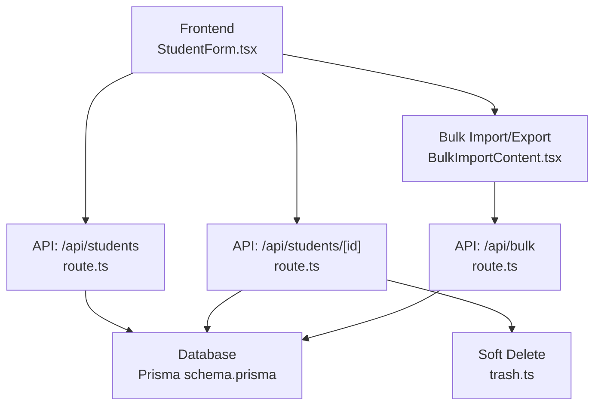
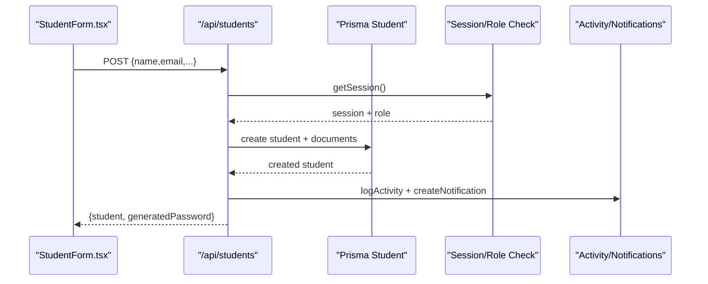
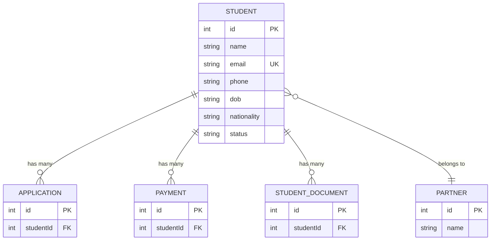
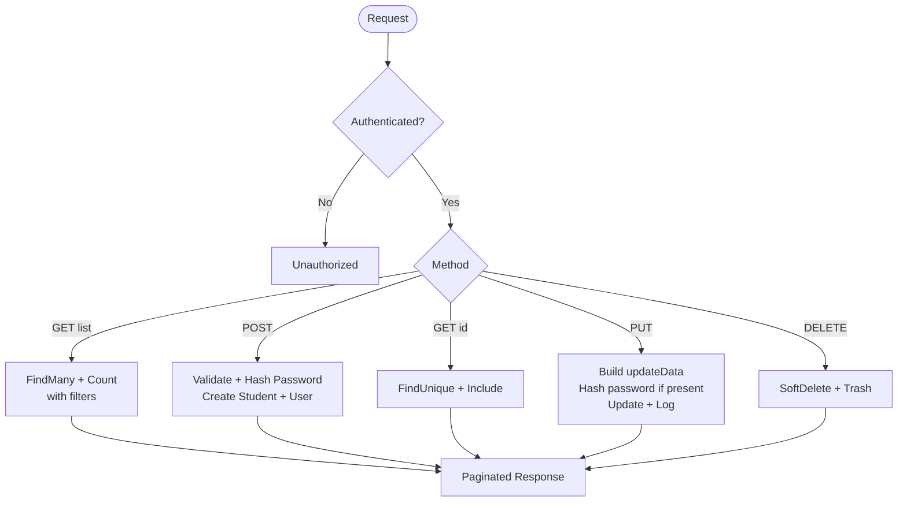
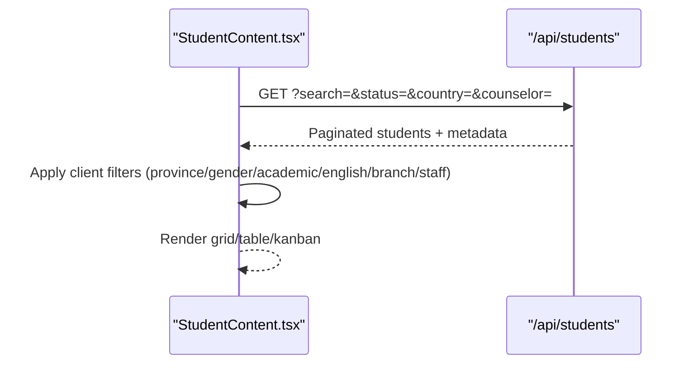
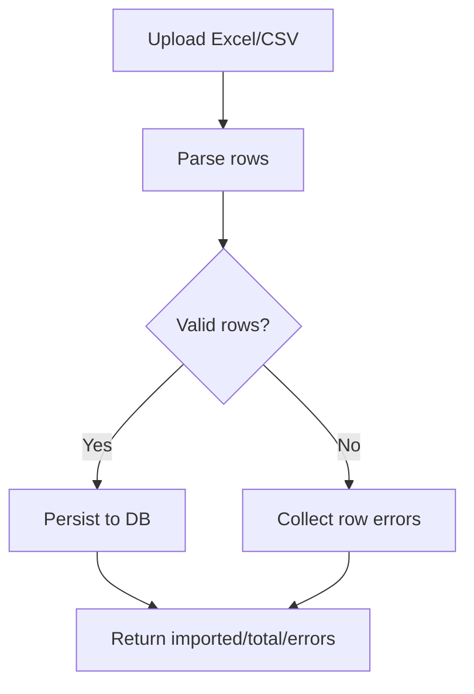
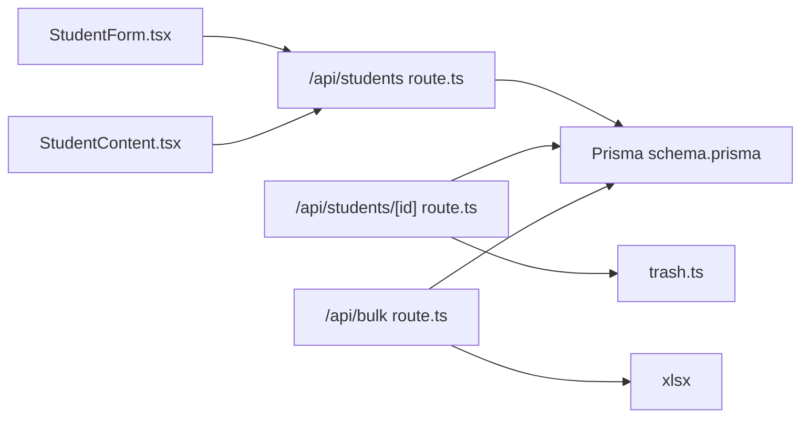

# Student Profiles & Data Management

<cite>
**Referenced Files in This Document**
- [schema.prisma](file://prisma/schema.prisma)
- [students route.ts](file://src/app/api/students/route.ts)
- [student detail route.ts](file://src/app/api/students/[id]/route.ts)
- [StudentForm.tsx](file://src/app/students/components/StudentForm.tsx)
- [StudentContent.tsx](file://src/app/students/components/StudentContent.tsx)
- [bulk route.ts](file://src/app/api/bulk/route.ts)
- [BulkImportContent.tsx](file://src/app/bulk-import/BulkImportContent.tsx)
- [trash.ts](file://src/lib/trash.ts)
</cite>

## Table of Contents
1. Introduction
2. Project Structure
3. Core Components
4. Architecture Overview
5. Detailed Component Analysis
6. Dependency Analysis
7. Performance Considerations
8. Troubleshooting Guide
9. Conclusion

## Introduction
This document explains how student profiles are modeled, created, updated, searched, and managed at scale. It covers the data model (personal info, academic history, contact details, guardian information), API endpoints for CRUD operations, the multi-step student form with validation rules, bulk import/export workflows, search and filtering, and error handling strategies designed for large datasets.

## Project Structure
The student management feature spans server routes, a Prisma schema, UI components, and utilities:
- Data model is defined in the Prisma schema.
- REST endpoints handle listing, creating, updating, and deleting students.
- The student form implements a guided, step-by-step workflow with rich fields and validations.
- Bulk import/export supports Excel/CSV ingestion and export to XLSX or JSON.
- Soft delete and trash utilities manage deletions safely.

**Diagram sources**
- [students route.ts:1-214](file://src/app/api/students/route.ts#L1-L214)
- [student detail route.ts:1-245](file://src/app/api/students/[id]/route.ts#L1-L245)
- [bulk route.ts:1-591](file://src/app/api/bulk/route.ts#L1-L591)
- [schema.prisma:334-409](file://prisma/schema.prisma#L334-L409)
- [trash.ts:1-118](file://src/lib/trash.ts#L1-L118)

**Section sources**
- [schema.prisma:334-409](file://prisma/schema.prisma#L334-L409)
- [students route.ts:1-214](file://src/app/api/students/route.ts#L1-L214)
- [student detail route.ts:1-245](file://src/app/api/students/[id]/route.ts#L1-L245)
- [bulk route.ts:1-591](file://src/app/api/bulk/route.ts#L1-L591)
- [trash.ts:1-118](file://src/lib/trash.ts#L1-L118)

## Core Components
- Student data model: personal identity, contact, addresses, passport, academic records, test scores, preferences, guardian/spouse/children, relationships to partner and applications/documents/payments.
- API layer: secure endpoints with session checks, role-based access, pagination, filtering, and audit logging.
- Form layer: multi-step wizard with dynamic cascading address fields, date conversions, and file uploads.
- Bulk operations: import from Excel/CSV and export to XLSX/JSON with templates and error reporting.
- Deletion: soft-delete with trash retention and restore/purge utilities.

**Section sources**
- [schema.prisma:334-409](file://prisma/schema.prisma#L334-L409)
- [students route.ts:1-214](file://src/app/api/students/route.ts#L1-L214)
- [student detail route.ts:1-245](file://src/app/api/students/[id]/route.ts#L1-L245)
- [StudentForm.tsx:207-216](file://src/app/students/components/StudentForm.tsx#L207-L216)
- [BulkImportContent.tsx:16-99](file://src/app/bulk-import/BulkImportContent.tsx#L16-L99)
- [bulk route.ts:59-408](file://src/app/api/bulk/route.ts#L59-L408)
- [trash.ts:5-19](file://src/lib/trash.ts#L5-L19)

## Architecture Overview
The system follows a layered architecture:
- Client UI (Next.js pages/components) calls Next.js API routes.
- API routes enforce authentication and authorization, validate inputs, and interact with Prisma ORM.
- Prisma models define the database schema and relationships.
- Utilities provide shared concerns: notifications, activity logging, soft deletes, and error formatting.

**Diagram sources**
- [students route.ts:61-214](file://src/app/api/students/route.ts#L61-L214)
- [StudentForm.tsx:598-628](file://src/app/students/components/StudentForm.tsx#L598-L628)

**Section sources**
- [students route.ts:61-214](file://src/app/api/students/route.ts#L61-L214)
- [StudentForm.tsx:598-628](file://src/app/students/components/StudentForm.tsx#L598-L628)

## Detailed Component Analysis

### Student Data Model
The Student entity captures comprehensive profile data:
- Personal: name, firstName, lastName, email, admissionEmail, gender, dob, nationality, maritalStatus, photoUrl.
- Contact: phone, whatsappNumber.
- Addresses: permanent and temporary province/district/municipality/ward/address.
- Passport: number, nationality, issue/expiry dates, issue place.
- Academic: education, workExperience, training, testType, overallScore, reading/writing/listening/speaking scores, moi, testDate, testRegNumber, studyLevel, intakeTerm, major, interestedCountry, targetUniversities.
- Family/Guardian: spouseName, childrenDetails, guardianName/phone/email/relation/address.
- Relationships: partnerId, applications, payments, documents, conversations.

**Diagram sources**
- [schema.prisma:334-409](file://prisma/schema.prisma#L334-L409)
- [schema.prisma:411-428](file://prisma/schema.prisma#L411-L428)
- [schema.prisma:456-472](file://prisma/schema.prisma#L456-L472)
- [schema.prisma:488-504](file://prisma/schema.prisma#L488-L504)

**Section sources**
- [schema.prisma:334-409](file://prisma/schema.prisma#L334-L409)

### API Endpoints: CRUD for Students
- GET /api/students
  - Purpose: List students with pagination, search, and filters (status, country, counselor).
  - Security: Requires authenticated session; returns paginated response.
  - Includes: documents, partner summary, and document counts.
- POST /api/students
  - Purpose: Create a new student record and associated user account if needed.
  - Validation: Name required (either full name or first+last); email unique; password hashed.
  - Side effects: Creates notification and logs activity.
- GET /api/students/:id
  - Purpose: Retrieve a single student with related documents and partner info.
- PUT /api/students/:id
  - Purpose: Update student fields; hashes password if provided; updates related user account when password changes; logs changes.
- DELETE /api/students/:id
  - Purpose: Soft-delete student by setting status to Deleted and recording in trash.

**Diagram sources**
- [students route.ts:9-214](file://src/app/api/students/route.ts#L9-L214)
- [student detail route.ts:11-245](file://src/app/api/students/[id]/route.ts#L11-L245)

**Section sources**
- [students route.ts:9-214](file://src/app/api/students/route.ts#L9-L214)
- [student detail route.ts:11-245](file://src/app/api/students/[id]/route.ts#L11-L245)

### Student Form Implementation
The form is a multi-step wizard covering:
- Steps: Personal, Family, Address, Passport, Academic, Experience, Preferences, Documents.
- Dynamic address cascade: Province → District → Municipality → Ward via Nepal APIs.
- Date conversion: AD ↔ BS using Bikram Sambat library.
- File upload: Integrates with upload endpoint to attach documents per type.
- Submission: Sends JSON payload to POST or PUT based on edit mode; handles success/error toasts.

Validation highlights:
- Required fields enforced by backend (e.g., name and email).
- Email uniqueness validated by server; duplicate errors surfaced.
- Password handling: optional input; auto-generated if not provided; always hashed before storage.
- Complex arrays (education, workExperience, training, childrenDetails) serialized to JSON strings for storage.

User experience:
- Step navigation with icons and progress.
- Real-time fetching of dropdowns (qualifications, users, partners, provinces).
- Toast feedback for uploads and submissions.

**Section sources**
- [StudentForm.tsx:207-216](file://src/app/students/components/StudentForm.tsx#L207-L216)
- [StudentForm.tsx:243-271](file://src/app/students/components/StudentForm.tsx#L243-L271)
- [StudentForm.tsx:381-495](file://src/app/students/components/StudentForm.tsx#L381-L495)
- [StudentForm.tsx:598-628](file://src/app/students/components/StudentForm.tsx#L598-L628)
- [StudentForm.tsx:630-655](file://src/app/students/components/StudentForm.tsx#L630-L655)
- [StudentForm.tsx:657-691](file://src/app/students/components/StudentForm.tsx#L657-L691)

### Search and Filtering
- Server-side list supports:
  - Text search across name, email, phone, passportNumber.
  - Filters: status, interestedCountry, counselor.
  - Pagination via skip/take parameters.
- Client-side filtering in the student content view adds:
  - Status, province, gender, academic performance (GPA threshold), English test thresholds, branch, staff member.
- Exportable views: grid, table, kanban.

**Diagram sources**
- [students route.ts:9-58](file://src/app/api/students/route.ts#L9-L58)
- [StudentContent.tsx:442-497](file://src/app/students/components/StudentContent.tsx#L442-L497)

**Section sources**
- [students route.ts:9-58](file://src/app/api/students/route.ts#L9-L58)
- [StudentContent.tsx:442-497](file://src/app/students/components/StudentContent.tsx#L442-L497)

### Bulk Import/Export
- Import:
  - Accepts .xlsx/.xls/.csv files.
  - Supports multiple entity types including students, universities, courses, leads, applications, payments, staff, partners, expenses.
  - For students: validates required fields (name, email), generates and hashes passwords, creates user accounts, and reports row-level errors.
- Export:
  - Returns XLSX or JSON for selected entity types.
  - Provides downloadable templates for each entity type.

**Diagram sources**
- [bulk route.ts:59-408](file://src/app/api/bulk/route.ts#L59-L408)
- [BulkImportContent.tsx:117-151](file://src/app/bulk-import/BulkImportContent.tsx#L117-L151)

**Section sources**
- [bulk route.ts:59-408](file://src/app/api/bulk/route.ts#L59-L408)
- [BulkImportContent.tsx:16-99](file://src/app/bulk-import/BulkImportContent.tsx#L16-L99)
- [BulkImportContent.tsx:117-151](file://src/app/bulk-import/BulkImportContent.tsx#L117-L151)
- [BulkImportContent.tsx:153-184](file://src/app/bulk-import/BulkImportContent.tsx#L153-L184)

### Data Validation, Error Handling, and UX
- Authentication and roles:
  - Session checks ensure only authorized users can create/update/delete.
  - Role restrictions applied for write operations.
- Input validation:
  - Backend enforces required fields and uniqueness constraints.
  - Duplicate emails handled with specific error messages.
- Error responses:
  - Centralized error helpers return consistent JSON payloads.
  - Row-level errors in bulk import aggregated and returned to the UI.
- Auditability:
  - Activity logging captures who changed what and when.
  - Notifications inform stakeholders of key actions.
- Soft delete:
  - Deletes move entities to trash with expiration; restores possible.

**Section sources**
- [students route.ts:61-214](file://src/app/api/students/route.ts#L61-L214)
- [student detail route.ts:39-245](file://src/app/api/students/[id]/route.ts#L39-L245)
- [bulk route.ts:59-408](file://src/app/api/bulk/route.ts#L59-L408)
- [trash.ts:5-19](file://src/lib/trash.ts#L5-L19)

## Dependency Analysis
Key dependencies and relationships:
- Frontend components depend on API routes for data operations.
- API routes depend on Prisma client for data access and utility modules for auth, logging, and notifications.
- Bulk operations depend on xlsx library for parsing and generating spreadsheets.
- Soft delete depends on trash utilities to track deleted items and schedule purging.

**Diagram sources**
- [StudentForm.tsx:598-628](file://src/app/students/components/StudentForm.tsx#L598-L628)
- [students route.ts:1-214](file://src/app/api/students/route.ts#L1-L214)
- [student detail route.ts:1-245](file://src/app/api/students/[id]/route.ts#L1-L245)
- [bulk route.ts:1-591](file://src/app/api/bulk/route.ts#L1-L591)
- [trash.ts:1-118](file://src/lib/trash.ts#L1-L118)

**Section sources**
- [students route.ts:1-214](file://src/app/api/students/route.ts#L1-L214)
- [student detail route.ts:1-245](file://src/app/api/students/[id]/route.ts#L1-L245)
- [bulk route.ts:1-591](file://src/app/api/bulk/route.ts#L1-L591)
- [trash.ts:1-118](file://src/lib/trash.ts#L1-L118)

## Performance Considerations
- Pagination: Use skip/take to limit dataset size for large student lists.
- Selective includes: Only include related data when necessary (e.g., documents, partner) to reduce payload size.
- Indexing: Ensure frequently filtered fields (email, status, interestedCountry, counselor) are indexed in the database where applicable.
- Bulk operations: Process rows in batches and report partial failures to avoid long-running transactions.
- Client-side filtering: Combine server-side filters with lightweight client-side filters to improve responsiveness.
- File handling: Validate file types and sizes before upload; stream large exports when possible.

[No sources needed since this section provides general guidance]

## Troubleshooting Guide
Common issues and resolutions:
- Unauthorized errors:
  - Ensure a valid session exists and the user has appropriate roles for write operations.
- Duplicate email:
  - Occurs when creating or importing students with an existing email; update the email or use a different one.
- Missing required fields:
  - Name and email are required for student creation/import; ensure they are provided.
- Bulk import failures:
  - Review row-level errors returned; fix invalid rows and re-upload.
- Soft delete recovery:
  - Use trash restoration to recover recently deleted students within the retention period.

**Section sources**
- [students route.ts:61-214](file://src/app/api/students/route.ts#L61-L214)
- [bulk route.ts:59-408](file://src/app/api/bulk/route.ts#L59-L408)
- [trash.ts:5-19](file://src/lib/trash.ts#L5-L19)

## Conclusion
The student profile system provides a robust, scalable foundation for managing student data through well-defined models, secure APIs, a user-friendly form, and powerful bulk operations. With built-in search/filtering, soft deletion, and comprehensive error handling, it supports both small teams and large databases efficiently. Adopting the recommended practices will help maintain data integrity and performance as the system grows.

[No sources needed since this section summarizes without analyzing specific files]