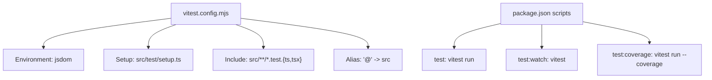
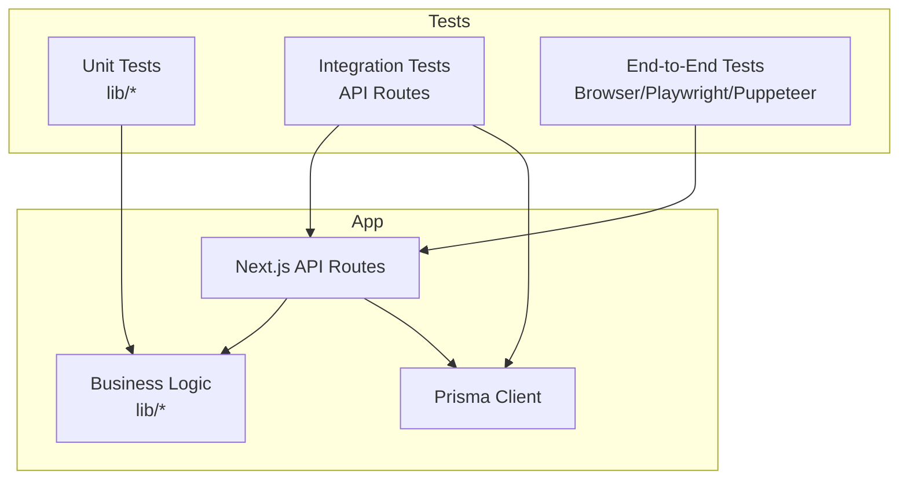
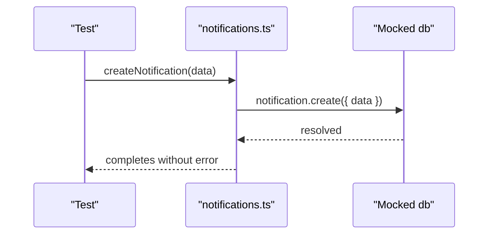
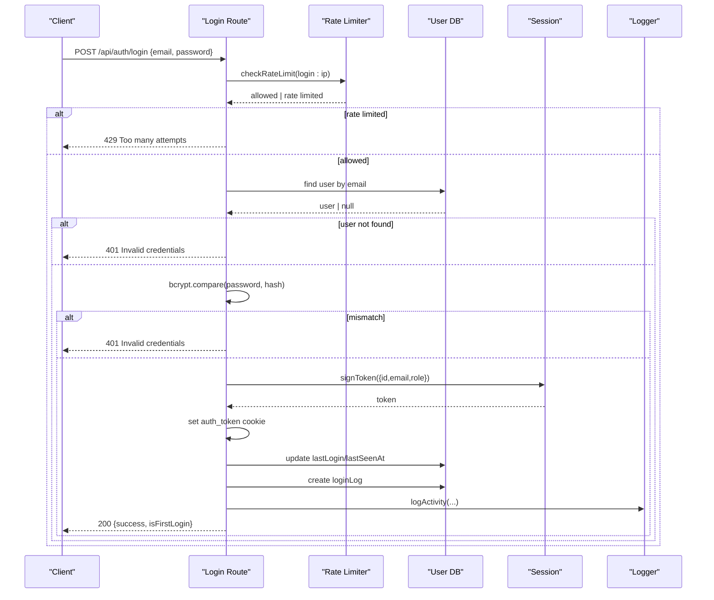
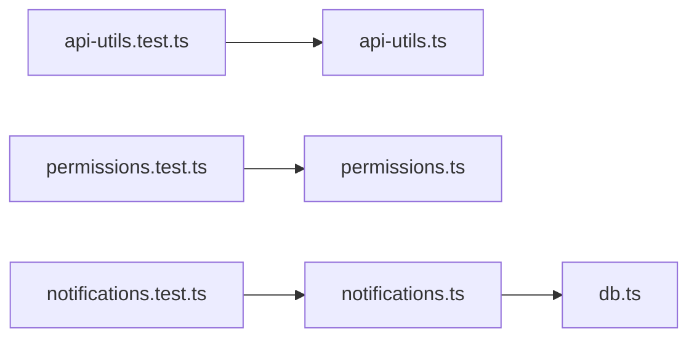

# Testing Strategy

<cite>
**Referenced Files in This Document**
- [vitest.config.mjs](file://vitest.config.mjs)
- [setup.ts](file://src/test/setup.ts)
- [package.json](file://package.json)
- [api-utils.test.ts](file://src/lib/__tests__/api-utils.test.ts)
- [notifications.test.ts](file://src/lib/__tests__/notifications.test.ts)
- [permissions.test.ts](file://src/lib/__tests__/permissions.test.ts)
- [route.ts](file://src/app/api/auth/login/route.ts)
- [db.ts](file://src/lib/db.ts)
- [api-utils.ts](file://src/lib/api-utils.ts)
- [permissions.ts](file://src/lib/permissions.ts)
- [notifications.ts](file://src/lib/notifications.ts)
</cite>

## Table of Contents
1. Introduction
2. Project Structure
3. Core Components
4. Architecture Overview
5. Detailed Component Analysis
6. Dependency Analysis
7. Performance Considerations
8. Troubleshooting Guide
9. Conclusion

## Introduction
This document defines the testing strategy for UniTrack across unit, integration, and end-to-end levels. It explains how Vitest is configured, how tests are organized, and how to mock dependencies such as the database and authentication. It also provides guidance for API route testing, component testing, test data management, continuous integration, code coverage, performance testing, and troubleshooting flaky or failing tests.

## Project Structure
Testing configuration and conventions:
- Test runner: Vitest with JSDOM environment for browser-like APIs.
- Global setup file: includes DOM matchers from testing-library.
- File patterns: tests under src/** with .test or .spec extensions.
- Path alias: @ maps to src for consistent imports in tests.
- Scripts: run, watch, and coverage commands via npm scripts.

**Diagram sources**
- [vitest.config.mjs:1-16](file://vitest.config.mjs#L1-L16)
- [package.json:39-50](file://package.json#L39-L50)

**Section sources**
- [vitest.config.mjs:1-16](file://vitest.config.mjs#L1-L16)
- [setup.ts:1-2](file://src/test/setup.ts#L1-L2)
- [package.json:39-50](file://package.json#L39-L50)

## Core Components
- Unit tests for pure utilities and business logic (e.g., pagination helpers, search filter builders, permission checks).
- Mocked unit tests for modules that depend on external services (e.g., notifications using db).
- Existing examples demonstrate:
  - Parameter parsing and validation boundaries.
  - Response envelope construction.
  - Role-based access control rules.
  - Database interaction mocking with Vitest’s vi.mock.

Key patterns observed:
- Use describe/it/expect from Vitest.
- Mock modules before importing them.
- Clear mocks between tests to avoid cross-test pollution.

**Section sources**
- [api-utils.test.ts:1-61](file://src/lib/__tests__/api-utils.test.ts#L1-L61)
- [notifications.test.ts:1-59](file://src/lib/__tests__/notifications.test.ts#L1-L59)
- [permissions.test.ts:1-71](file://src/lib/__tests__/permissions.test.ts#L1-L71)

## Architecture Overview
The application uses Next.js API routes backed by Prisma. Tests can target:
- Pure functions in lib (unit tests).
- API routes (integration tests using a test HTTP client or Next’s testing utilities).
- UI components (component tests with React Testing Library in JSDOM).

[No sources needed since this diagram shows conceptual workflow, not actual code structure]

## Detailed Component Analysis

### Unit Testing: Business Logic and Utilities
Focus areas:
- Pagination parameter parsing and bounds enforcement.
- Search filter generation for Prisma queries.
- Paginated response envelope composition.
- Permission matrix validation for roles and permissions.

Recommended practices:
- Test default values and edge cases (e.g., max perPage, minimum page).
- Validate output shapes and computed fields (e.g., totalPages).
- Cover both allowed and denied permission scenarios.

Example references:
- Pagination and search filter tests: [api-utils.test.ts:1-61](file://src/lib/__tests__/api-utils.test.ts#L1-L61)
- Permission matrix tests: [permissions.test.ts:1-71](file://src/lib/__tests__/permissions.test.ts#L1-L71)

**Section sources**
- [api-utils.test.ts:1-61](file://src/lib/__tests__/api-utils.test.ts#L1-L61)
- [permissions.test.ts:1-71](file://src/lib/__tests__/permissions.test.ts#L1-L71)

### Unit Testing: Database Interactions via Mocking
Strategy:
- Mock the database module before importing the function under test.
- Assert that the correct methods were called with expected payloads.
- Reset mocks between tests to ensure isolation.

Example reference:
- Notification creation with mocked db: [notifications.test.ts:1-59](file://src/lib/__tests__/notifications.test.ts#L1-L59)

**Diagram sources**
- [notifications.test.ts:1-59](file://src/lib/__tests__/notifications.test.ts#L1-L59)
- [notifications.ts:1-41](file://src/lib/notifications.ts#L1-L41)
- [db.ts:1-8](file://src/lib/db.ts#L1-L8)

**Section sources**
- [notifications.test.ts:1-59](file://src/lib/__tests__/notifications.test.ts#L1-L59)
- [notifications.ts:1-41](file://src/lib/notifications.ts#L1-L41)
- [db.ts:1-8](file://src/lib/db.ts#L1-L8)

### API Route Testing: Authentication Flow
Approach:
- Write integration tests against the login endpoint.
- Provide valid and invalid payloads; assert status codes and response bodies.
- Verify rate limiting behavior when applicable.
- For cookie/token assertions, use a test harness that supports cookies or parse responses accordingly.

Flow overview:
- Input validation via schema.
- Rate limiting check.
- User lookup and password verification.
- Token signing and cookie setting.
- Activity logging and settings retrieval.

**Diagram sources**
- [route.ts:1-123](file://src/app/api/auth/login/route.ts#L1-L123)

**Section sources**
- [route.ts:1-123](file://src/app/api/auth/login/route.ts#L1-L123)

### Component Testing: UI Components
Guidelines:
- Use Vitest with JSDOM and React Testing Library.
- Render components with required context (e.g., theme, router if needed).
- Simulate user interactions and assert rendered output and side effects.
- Mock external hooks or libraries used by components.

[No sources needed since this section doesn't analyze specific files]

### Integration Testing: API Endpoints and External Services
Recommendations:
- Use a Next.js-compatible test client to call API routes directly without starting a server.
- For external services (email, storage), mock their clients at import time.
- Validate request/response contracts, error handling, and status codes.
- Seed minimal test data where necessary and clean up after each test.

[No sources needed since this section doesn't analyze specific files]

### End-to-End Testing Strategies
Options:
- Puppeteer is available in devDependencies; suitable for headless browser automation.
- Alternatively, consider Playwright for robust E2E capabilities.
- Focus on critical user journeys: login, navigation, form submissions, and key workflows.

[No sources needed since this section doesn't analyze specific files]

### Test Data Management
- Prefer small, deterministic fixtures for unit tests.
- For integration tests, seed only what is needed and reset state between tests.
- Avoid shared mutable state; isolate tests to prevent flakiness.

[No sources needed since this section doesn't analyze specific files]

### Continuous Integration Setup
- Add a CI job that runs npm run test and npm run test:coverage.
- Cache node_modules and install dependencies in CI.
- Fail the build on test failures or coverage thresholds not met.

[No sources needed since this section doesn't analyze specific files]

### Test-Driven Development Guidelines
- Write failing tests first for new features or bug fixes.
- Keep tests focused and isolated.
- Refactor code while keeping tests green.
- Maintain clear naming and grouping with describe blocks.

[No sources needed since this section doesn't analyze specific files]

### Code Coverage Requirements
- Run coverage with npm run test:coverage.
- Set thresholds for lines, branches, functions, and statements in your CI.
- Aim for high coverage on core business logic and utilities.

**Section sources**
- [package.json:39-50](file://package.json#L39-L50)

### Performance Testing
- Profile heavy computations in lib functions with benchmarks or simple timing logs.
- Use realistic datasets for pagination and search filter tests to validate performance.
- Monitor memory usage for long-running tests.

[No sources needed since this section doesn't analyze specific files]

## Dependency Analysis
Relationships among tested units and their dependencies:

**Diagram sources**
- [api-utils.test.ts:1-61](file://src/lib/__tests__/api-utils.test.ts#L1-L61)
- [api-utils.ts:1-84](file://src/lib/api-utils.ts#L1-L84)
- [permissions.test.ts:1-71](file://src/lib/__tests__/permissions.test.ts#L1-L71)
- [permissions.ts:1-107](file://src/lib/permissions.ts#L1-L107)
- [notifications.test.ts:1-59](file://src/lib/__tests__/notifications.test.ts#L1-L59)
- [notifications.ts:1-41](file://src/lib/notifications.ts#L1-L41)
- [db.ts:1-8](file://src/lib/db.ts#L1-L8)

**Section sources**
- [api-utils.ts:1-84](file://src/lib/api-utils.ts#L1-L84)
- [permissions.ts:1-107](file://src/lib/permissions.ts#L1-L107)
- [notifications.ts:1-41](file://src/lib/notifications.ts#L1-L41)
- [db.ts:1-8](file://src/lib/db.ts#L1-L8)

## Performance Considerations
- Keep unit tests fast and free of network calls.
- Mock slow dependencies (DB, email, storage).
- Use small datasets for pagination and search tests.
- Parallelize tests where possible; Vitest runs tests concurrently by default.

[No sources needed since this section provides general guidance]

## Troubleshooting Guide
Common issues and resolutions:
- Flaky tests due to shared state:
  - Ensure mocks are cleared between tests (use beforeEach to clear mocks).
  - Avoid global mutations; prefer isolated fixtures.
- Unexpected errors in API route tests:
  - Validate input schemas and handle errors explicitly.
  - Check rate limiting behavior and provide appropriate inputs.
- Environment mismatches:
  - Confirm Vitest environment is jsdom for browser APIs.
  - Ensure path aliases resolve correctly in tests.

Debugging techniques:
- Log intermediate values in tests to pinpoint failures.
- Isolate failing tests by running them individually.
- Use console output sparingly; rely on assertions for clarity.

**Section sources**
- [notifications.test.ts:1-59](file://src/lib/__tests__/notifications.test.ts#L1-L59)
- [route.ts:1-123](file://src/app/api/auth/login/route.ts#L1-L123)
- [vitest.config.mjs:1-16](file://vitest.config.mjs#L1-L16)

## Conclusion
UniTrack’s testing foundation leverages Vitest with JSDOM, clear organization under src/lib/__tests__, and practical mocking strategies for database interactions. The existing tests cover utility functions and permission logic, providing a solid base to expand into API route integration tests and component tests. Adopting the guidelines here will improve reliability, maintainability, and confidence in deployments.