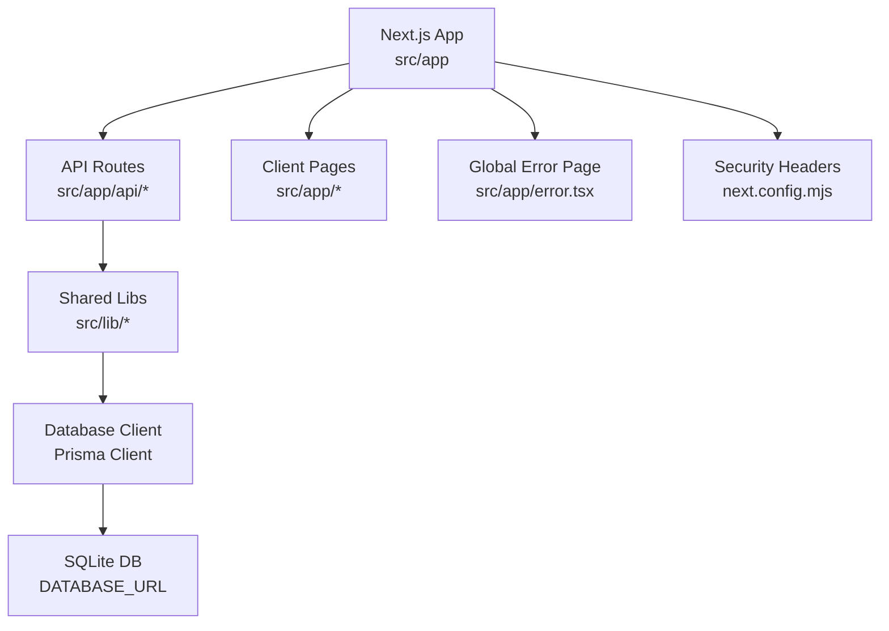
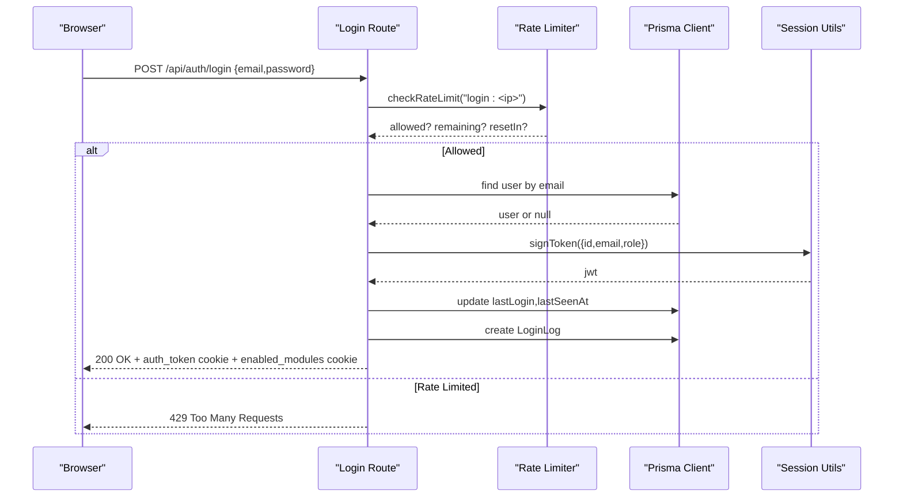
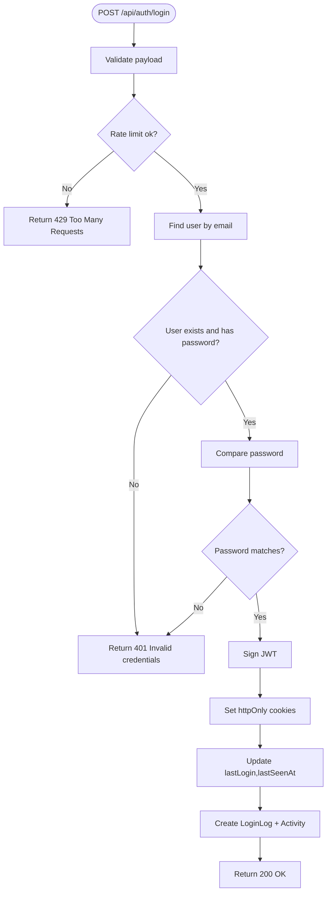
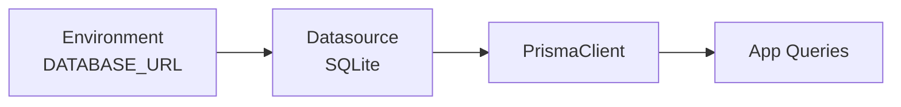
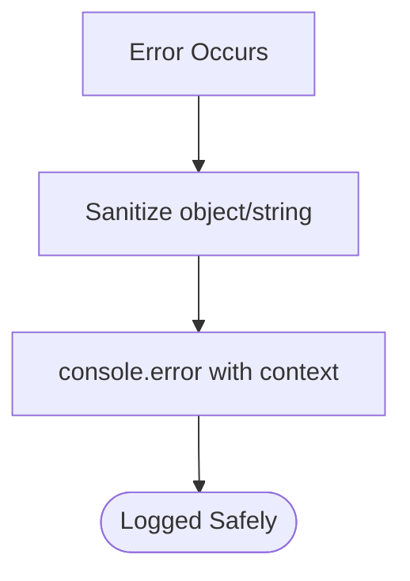
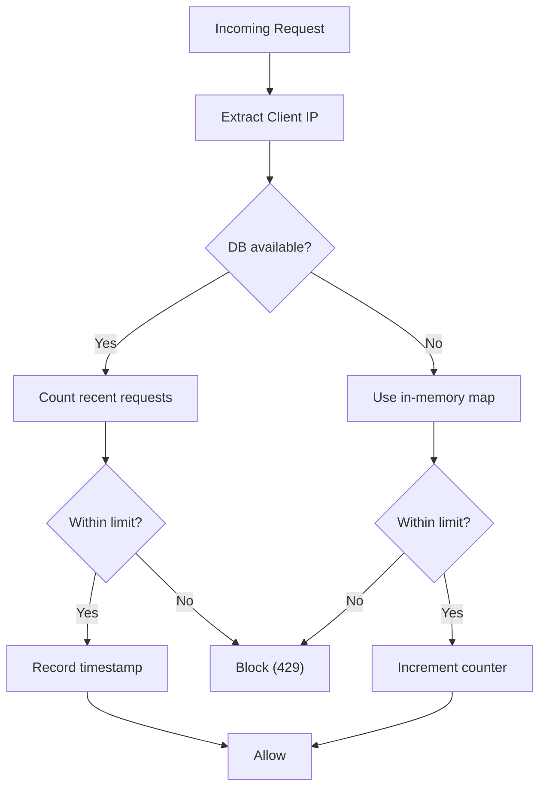

# Troubleshooting & FAQ

<cite>
**Referenced Files in This Document**
- [README.md](file://README.md)
- [package.json](file://package.json)
- [next.config.mjs](file://next.config.mjs)
- [schema.prisma](file://prisma/schema.prisma)
- [db.ts](file://src/lib/db.ts)
- [session.ts](file://src/lib/session.ts)
- [route.ts (login)](file://src/app/api/auth/login/route.ts)
- [logger.ts](file://src/lib/logger.ts)
- [rate-limit.ts](file://src/lib/rate-limit.ts)
- [error.tsx](file://src/app/error.tsx)
- [page.tsx (backups/restore UI)](file://src/app/settings/backups/page.tsx)
</cite>

## Table of Contents
1. Introduction
2. Project Structure
3. Core Components
4. Architecture Overview
5. Detailed Component Analysis
6. Dependency Analysis
7. Performance Considerations
8. Troubleshooting Guide
9. Conclusion
10. Appendices

## Introduction
This document provides comprehensive troubleshooting and frequently asked questions for UniTrack, focusing on setup problems, configuration errors, authentication issues, database connectivity, API errors, logging and diagnostics, performance tuning, memory/resource issues, known limitations, workarounds, upgrade considerations, recovery steps, and support channels. It is designed to help both new and experienced users quickly diagnose and resolve common issues.

## Project Structure
UniTrack is a Next.js application with server-side API routes under src/app/api, shared libraries under src/lib, Prisma schema under prisma, and static assets under public. The app uses environment-driven configuration, JWT-based sessions, rate limiting, and a centralized error logger.

**Diagram sources**
- [next.config.mjs:17-45](file://next.config.mjs#L17-L45)
- [schema.prisma:6-9](file://prisma/schema.prisma#L6-L9)
- [db.ts:1-7](file://src/lib/db.ts#L1-L7)

**Section sources**
- [README.md:11-26](file://README.md#L11-L26)
- [package.json:39-51](file://package.json#L39-L51)

## Core Components
- Authentication and Session Management: JWT signing and verification, secure cookie handling, login flow with rate limiting and activity logging.
- Database Connectivity: Prisma client initialization and SQLite datasource via environment variable.
- Logging and Diagnostics: Sanitized error logger that redacts sensitive data; global error page for client-side errors.
- Rate Limiting: In-memory fallback with optional DB-backed tracking for robust protection against abuse.
- Security Headers: Centralized security headers and CSP configuration.

**Section sources**
- [session.ts:1-36](file://src/lib/session.ts#L1-L36)
- [route.ts (login):19-120](file://src/app/api/auth/login/route.ts#L19-L120)
- [db.ts:1-7](file://src/lib/db.ts#L1-L7)
- [logger.ts:1-48](file://src/lib/logger.ts#L1-L48)
- [rate-limit.ts:29-100](file://src/lib/rate-limit.ts#L29-L100)
- [next.config.mjs:17-45](file://next.config.mjs#L17-L45)

## Architecture Overview
The authentication flow validates input, enforces rate limits, verifies credentials, issues a signed JWT, sets an httpOnly cookie, updates last login metadata, logs the event, and returns enabled modules via cookie.

**Diagram sources**
- [route.ts (login):19-120](file://src/app/api/auth/login/route.ts#L19-L120)
- [rate-limit.ts:43-100](file://src/lib/rate-limit.ts#L43-L100)
- [session.ts:19-36](file://src/lib/session.ts#L19-L36)
- [schema.prisma:139-207](file://prisma/schema.prisma#L139-L207)

## Detailed Component Analysis

### Authentication and Sessions
- JWT secret requirement: Missing or empty JWT_SECRET causes immediate failure during token operations.
- Token verification: Expired or invalid tokens result in a clear error message.
- Cookie settings: Secure flag applied in production; SameSite set to strict.
- Login flow: Validates input, applies rate limiting, checks credentials, signs token, sets cookies, updates user timestamps, records login log, and sets enabled modules cookie.

**Diagram sources**
- [route.ts (login):19-120](file://src/app/api/auth/login/route.ts#L19-L120)
- [session.ts:19-36](file://src/lib/session.ts#L19-L36)

**Section sources**
- [session.ts:3-9](file://src/lib/session.ts#L3-L9)
- [session.ts:19-36](file://src/lib/session.ts#L19-L36)
- [route.ts (login):19-120](file://src/app/api/auth/login/route.ts#L19-L120)

### Database Connectivity (Prisma + SQLite)
- Datasource: SQLite configured via DATABASE_URL environment variable.
- Client lifecycle: PrismaClient instance is cached globally in development to avoid multiple connections.
- Common issues:
  - DATABASE_URL not set or points to wrong path/file.
  - File permissions prevent SQLite from creating or accessing the database file.
  - Schema drift or missing tables cause query failures.

**Diagram sources**
- [schema.prisma:6-9](file://prisma/schema.prisma#L6-L9)
- [db.ts:1-7](file://src/lib/db.ts#L1-L7)

**Section sources**
- [schema.prisma:6-9](file://prisma/schema.prisma#L6-L9)
- [db.ts:1-7](file://src/lib/db.ts#L1-L7)

### Logging and Error Handling
- Server-side logging: Sanitized logger redacts sensitive fields like passwords, tokens, secrets, authorization headers, cookies, and credentials.
- Client-side errors: Global error page displays a friendly message and offers retry or navigation actions.
- Best practices: Use the sanitized logger in API routes; avoid logging raw request bodies containing secrets.

**Diagram sources**
- [logger.ts:16-47](file://src/lib/logger.ts#L16-L47)

**Section sources**
- [logger.ts:1-48](file://src/lib/logger.ts#L1-L48)
- [error.tsx:16-48](file://src/app/error.tsx#L16-L48)

### Rate Limiting
- Strategy: Attempts DB-backed counting using a dedicated table; falls back to in-memory map if unavailable.
- IP extraction: Uses x-forwarded-for (last hop), then x-real-ip, otherwise unknown.
- Behavior: Returns allowed status, remaining requests, and time until reset; blocks when exceeded.

**Diagram sources**
- [rate-limit.ts:29-100](file://src/lib/rate-limit.ts#L29-L100)

**Section sources**
- [rate-limit.ts:29-100](file://src/lib/rate-limit.ts#L29-L100)

### Security Headers and CSP
- Centralized headers include X-Frame-Options, X-Content-Type-Options, XSS protection, Referrer-Policy, Permissions-Policy, HSTS, and a strict Content-Security-Policy.
- Implications: Some features may require CSP adjustments (e.g., external fonts, images, or scripts).

**Section sources**
- [next.config.mjs:17-45](file://next.config.mjs#L17-L45)

## Dependency Analysis
Key runtime dependencies relevant to troubleshooting:
- next: Application framework and routing.
- @prisma/client: Database client used across API routes.
- jose: JWT signing and verification for sessions.
- bcryptjs: Password hashing and comparison.
- nodemailer: Email sending capability (if configured).
- recharts: Charts rendering for dashboards.

Operational notes:
- Scripts define dev, build, start, lint, format, serve, type-check, test, seed commands.
- Prisma seed script is configured for initial data population.

**Section sources**
- [package.json:56-108](file://package.json#L56-L108)
- [package.json:39-55](file://package.json#L39-L55)

## Performance Considerations
- Avoid excessive logging in hot paths; use the sanitized logger selectively.
- Ensure DATABASE_URL points to a performant SQLite file location with adequate disk I/O.
- Monitor rate limiter behavior; adjust thresholds if legitimate traffic is blocked.
- Keep Prisma schema aligned with migrations to prevent expensive retries or rollbacks.
- Use production builds for optimal performance; disable source maps in production to reduce overhead.

[No sources needed since this section provides general guidance]

## Troubleshooting Guide

### Setup and Configuration Issues
- Symptom: Application fails to start or cannot connect to the database.
  - Check DATABASE_URL environment variable and ensure it points to a valid SQLite file path.
  - Verify file permissions for the directory where the SQLite file resides.
  - Confirm Prisma client generation aligns with the current schema.
- Symptom: Build or dev server does not run as expected.
  - Ensure Node.js version compatibility and reinstall dependencies if necessary.
  - Run type checking and linting to catch configuration issues early.

**Section sources**
- [schema.prisma:6-9](file://prisma/schema.prisma#L6-L9)
- [db.ts:1-7](file://src/lib/db.ts#L1-L7)
- [package.json:39-51](file://package.json#L39-L51)

### Authentication Problems
- Symptom: Cannot log in or repeatedly get “Invalid email or password.”
  - Verify user record exists and has a hashed password stored.
  - Check rate limiting; too many attempts can trigger 429 responses.
  - Inspect browser cookies for auth_token presence after successful login.
- Symptom: Token expired or invalid.
  - Ensure JWT_SECRET is set and consistent across deployments.
  - Re-authenticate to obtain a fresh token; verify session cookie flags in production.

**Section sources**
- [route.ts (login):19-120](file://src/app/api/auth/login/route.ts#L19-L120)
- [session.ts:3-9](file://src/lib/session.ts#L3-L9)
- [session.ts:19-36](file://src/lib/session.ts#L19-L36)

### Database Connectivity Errors
- Symptom: Prisma queries fail with connection or table errors.
  - Validate DATABASE_URL and SQLite file accessibility.
  - Ensure required tables exist; apply schema changes via Prisma migrations.
  - If using DB-backed rate limiting, confirm the RateLimitLog table exists or rely on in-memory fallback.

**Section sources**
- [schema.prisma:6-9](file://prisma/schema.prisma#L6-L9)
- [rate-limit.ts:50-100](file://src/lib/rate-limit.ts#L50-L100)

### API Errors and Validation
- Symptom: 400 Bad Request on login or other endpoints.
  - Check payload validation; ensure required fields are present and correctly formatted.
- Symptom: 429 Too Many Requests.
  - Review rate limiting thresholds and client request patterns; consider adjusting limits or implementing backoff strategies.

**Section sources**
- [route.ts (login):14-35](file://src/app/api/auth/login/route.ts#L14-L35)
- [rate-limit.ts:43-100](file://src/lib/rate-limit.ts#L43-L100)

### Logging and Diagnostics
- Use the sanitized logger to capture contextual errors without leaking sensitive data.
- For client-side crashes, inspect the global error page and note any error digest for reference.
- Correlate server logs with browser network tab to trace request/response flows.

**Section sources**
- [logger.ts:16-47](file://src/lib/logger.ts#L16-L47)
- [error.tsx:16-48](file://src/app/error.tsx#L16-L48)

### Performance and Resource Consumption
- Symptoms: High CPU/memory usage, slow API responses.
  - Reduce unnecessary logging in high-frequency routes.
  - Optimize database queries; ensure proper indexing per schema definitions.
  - Monitor rate limiter counters; tune thresholds based on expected load.
  - Prefer production builds and enable caching where appropriate.

[No sources needed since this section provides general guidance]

### Recovery and Restoration
- Backup and restore: Use the built-in backup/restore UI to export and import selected data sections. Encrypted backups require a password; unencrypted backups allow selective restoration.
- Steps:
  - Navigate to Settings > Backups.
  - Upload a backup file; choose restore sections if unencrypted.
  - Provide password if encrypted; confirm restore and wait for completion.
  - Reload the application to reflect restored state.

**Section sources**
- [page.tsx (backups/restore UI):275-315](file://src/app/settings/backups/page.tsx#L275-L315)

### Known Limitations and Workarounds
- Rate limiting: DB-backed mode requires a specific table; if missing, the system falls back to in-memory which resets on process restart.
- CSP restrictions: External resources (fonts, images, scripts) may be blocked by default; adjust next.config.mjs headers if needed.
- SQLite concurrency: SQLite is suitable for moderate workloads; for high-concurrency scenarios, consider migrating to a more robust database engine.

**Section sources**
- [rate-limit.ts:50-100](file://src/lib/rate-limit.ts#L50-L100)
- [next.config.mjs:17-45](file://next.config.mjs#L17-L45)

### Upgrade Considerations
- Next.js and React versions: Align with supported versions indicated in package.json; review breaking changes before upgrading.
- Prisma schema changes: Always migrate schema changes and regenerate the client to avoid runtime errors.
- Environment variables: Ensure all required variables (e.g., JWT_SECRET, DATABASE_URL) are updated consistently across environments.

**Section sources**
- [package.json:56-108](file://package.json#L56-L108)
- [schema.prisma:1-9](file://prisma/schema.prisma#L1-L9)

### Frequently Asked Questions
- How do I reset my password?
  - Use the password reset flow; ensure email settings are configured and SMTP credentials are correct.
- Why am I getting 429 Too Many Requests?
  - You exceeded the rate limit for the endpoint; wait for the window to reset or adjust thresholds if you control the deployment.
- How do I enable/disable modules?
  - Enabled modules are stored in system settings and propagated via a cookie after login; modify settings accordingly.
- Can I customize security headers?
  - Yes, edit next.config.mjs headers to tailor CSP and other policies to your needs.

[No sources needed since this section provides general guidance]

### Community Resources and Support
- Documentation: Refer to the project README for installation and basic usage.
- Issue reporting: Use the Tickets feature within the application to report bugs or request features.
- Escalation: For complex or critical issues, gather logs (sanitized), error digests, and reproduction steps; escalate through designated support channels.

**Section sources**
- [README.md:11-26](file://README.md#L11-L26)

## Conclusion
This guide consolidates common issues and resolutions for UniTrack, covering authentication, database connectivity, API errors, logging, performance, recovery, and upgrades. By following the diagnostic steps and leveraging the built-in tools (sanitized logger, global error page, backup/restore), most issues can be resolved efficiently. For persistent or complex problems, collect detailed diagnostics and escalate through appropriate support channels.

## Appendices

### Quick Reference: Environment Variables
- DATABASE_URL: Required for Prisma client and SQLite datasource.
- JWT_SECRET: Required for JWT signing and verification; must be set and consistent.
- NODE_ENV: Influences logging behavior and cookie security flags.

**Section sources**
- [schema.prisma:6-9](file://prisma/schema.prisma#L6-L9)
- [session.ts:3-9](file://src/lib/session.ts#L3-L9)
- [logger.ts:42-47](file://src/lib/logger.ts#L42-L47)