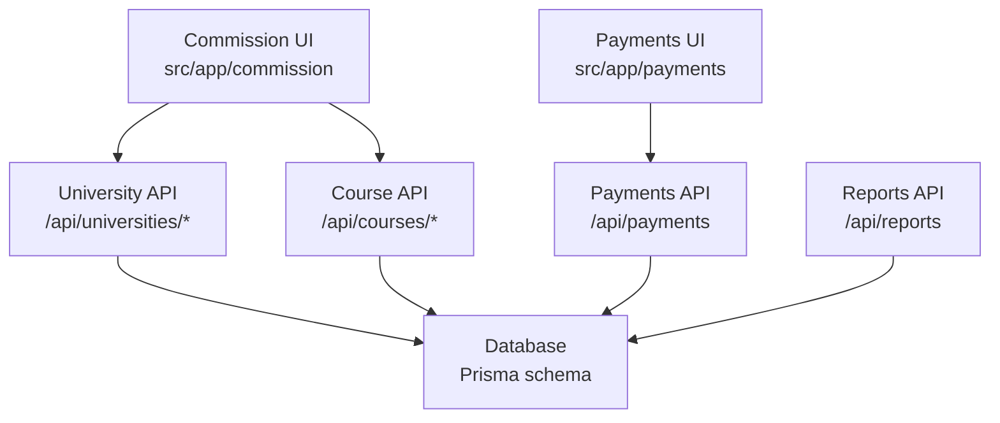
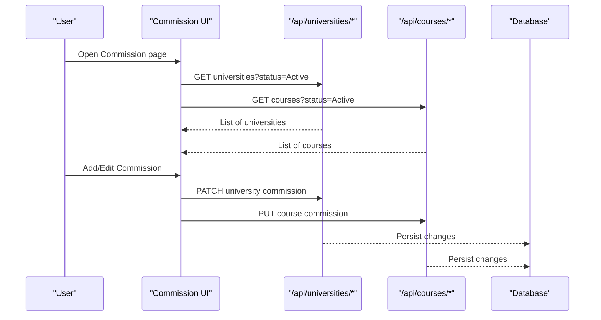
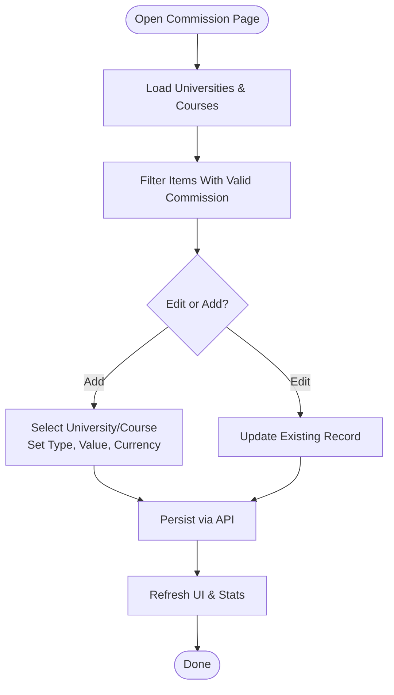
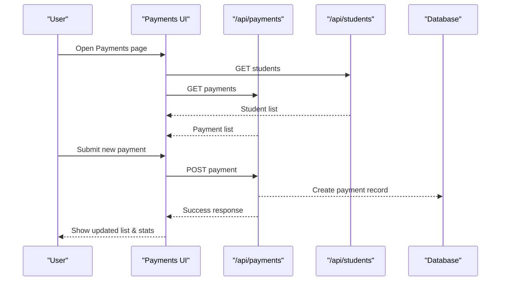
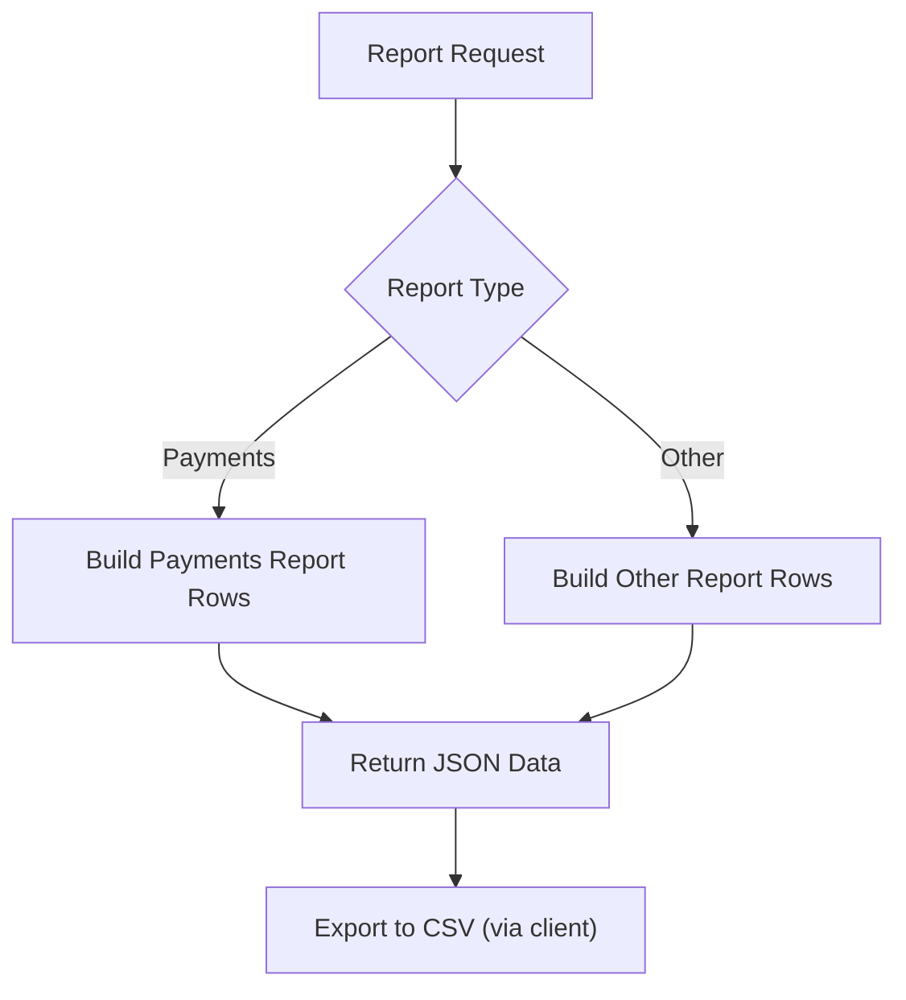
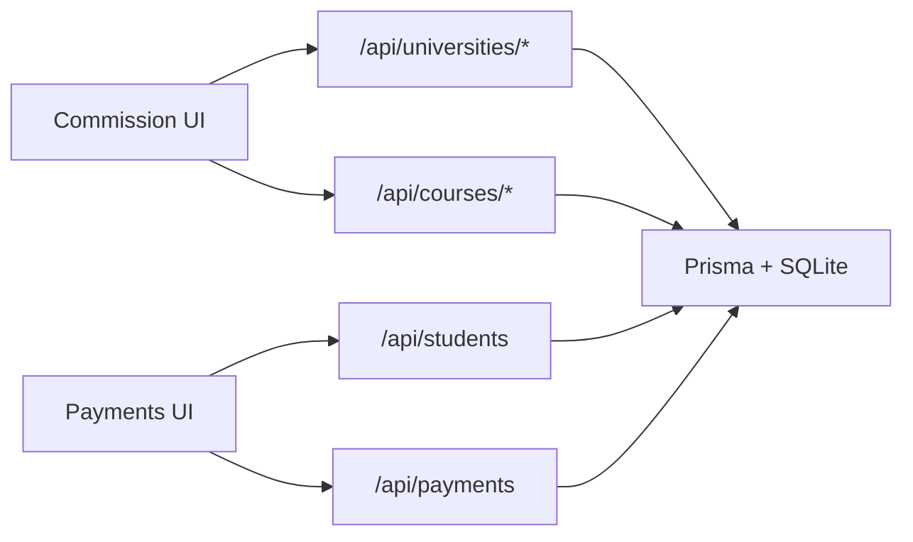

# Commission Tracking & Management

<cite>
**Referenced Files in This Document**
- [schema.prisma](file://prisma/schema.prisma)
- [CommissionContent.tsx](file://src/app/commission/components/CommissionContent.tsx)
- [page.tsx (Commission)](file://src/app/commission/page.tsx)
- [PaymentsContent.tsx](file://src/app/payments/components/PaymentsContent.tsx)
- [page.tsx (Payments)](file://src/app/payments/page.tsx)
- [SupportContent.tsx](file://src/app/support/components/SupportContent.tsx)
- [route.ts (Reports)](file://src/app/api/reports/route.ts)
- [page.tsx (Home)](file://src/app/page.tsx)
</cite>

## Table of Contents
1. Introduction
2. Project Structure
3. Core Components
4. Architecture Overview
5. Detailed Component Analysis
6. Dependency Analysis
7. Performance Considerations
8. Troubleshooting Guide
9. Conclusion
10. Appendices

## Introduction
This document explains the Commission Tracking & Management capabilities for financial relationships with partner universities. It covers commission configuration, calculation logic, payment processing workflows, and reporting. It also provides guidance on multi-currency handling, reconciliation, audit trails, and compliance considerations based on the current codebase.

## Project Structure
The commission and payments features are implemented as Next.js pages with client-side components that call API endpoints to persist data. The database schema defines entities for universities, courses, partners, students, and payments, including commission fields at both university and course levels.

**Diagram sources**
- [CommissionContent.tsx:122-144](file://src/app/commission/components/CommissionContent.tsx#L122-L144)
- [PaymentsContent.tsx:83-99](file://src/app/payments/components/PaymentsContent.tsx#L83-L99)
- [schema.prisma:19-50](file://prisma/schema.prisma#L19-L50)
- [schema.prisma:67-119](file://prisma/schema.prisma#L67-L119)
- [schema.prisma:488-504](file://prisma/schema.prisma#L488-L504)
- [route.ts (Reports):129-148](file://src/app/api/reports/route.ts#L129-L148)

**Section sources**
- [page.tsx (Commission):1-17](file://src/app/commission/page.tsx#L1-L17)
- [page.tsx (Payments):1-17](file://src/app/payments/page.tsx#L1-L17)
- [schema.prisma:19-50](file://prisma/schema.prisma#L19-L50)
- [schema.prisma:67-119](file://prisma/schema.prisma#L67-L119)
- [schema.prisma:488-504](file://prisma/schema.prisma#L488-L504)

## Core Components
- Commission Configuration UI: Allows setting commission type (Percentage or Flat), value, currency, and optional partnership amount per university or per course. Course-level settings override university defaults when a student enrolls in a specific course.
- Payments UI: Records student payments with amount, currency, method, status, date, description, and optional proof link. Supports filtering by status and searching by student or description.
- Database Models: University and Course models include commissionType, commissionValue, and commissionCurrency. Payment model stores transaction details and status. Partner and Student models support relationship tracking.

Key behaviors:
- Commission resolution: When a student enrolls through a partner and successfully enrolls, the configured commission is used to calculate agent payouts. Course-level commission overrides university default.
- Multi-currency: Commissions can be stored with a currency; payments record amounts in any supported currency.
- Reporting: A reports endpoint aggregates payments and other data for export.

**Section sources**
- [CommissionContent.tsx:549-563](file://src/app/commission/components/CommissionContent.tsx#L549-L563)
- [CommissionContent.tsx:239-311](file://src/app/commission/components/CommissionContent.tsx#L239-L311)
- [PaymentsContent.tsx:107-142](file://src/app/payments/components/PaymentsContent.tsx#L107-L142)
- [schema.prisma:19-50](file://prisma/schema.prisma#L19-L50)
- [schema.prisma:67-119](file://prisma/schema.prisma#L67-L119)
- [schema.prisma:488-504](file://prisma/schema.prisma#L488-L504)

## Architecture Overview
The system uses a client-server architecture where React components manage state and user interactions, calling REST-like routes under /api to read/write data. The Prisma ORM abstracts SQLite storage.

**Diagram sources**
- [CommissionContent.tsx:122-144](file://src/app/commission/components/CommissionContent.tsx#L122-L144)
- [CommissionContent.tsx:239-311](file://src/app/commission/components/CommissionContent.tsx#L239-L311)
- [schema.prisma:19-50](file://prisma/schema.prisma#L19-L50)
- [schema.prisma:67-119](file://prisma/schema.prisma#L67-L119)

## Detailed Component Analysis

### Commission Configuration and Calculation Engine
- Commission types: Percentage or Flat.
- Scope: Configurable at university level and overridden at course level.
- Currency: Each commission can specify a currency symbol/code for display and reporting.
- Partnership amount: Optional field on university records to track partner-related amounts.

Operational flow:
- Load active universities and courses.
- Filter items with valid commission values and types.
- Save updates via PATCH/PUT to respective APIs.
- Display aggregated stats and searchable list.

**Diagram sources**
- [CommissionContent.tsx:122-144](file://src/app/commission/components/CommissionContent.tsx#L122-L144)
- [CommissionContent.tsx:239-311](file://src/app/commission/components/CommissionContent.tsx#L239-L311)
- [CommissionContent.tsx:549-563](file://src/app/commission/components/CommissionContent.tsx#L549-L563)

**Section sources**
- [CommissionContent.tsx:239-311](file://src/app/commission/components/CommissionContent.tsx#L239-L311)
- [CommissionContent.tsx:549-563](file://src/app/commission/components/CommissionContent.tsx#L549-L563)
- [schema.prisma:19-50](file://prisma/schema.prisma#L19-L50)
- [schema.prisma:67-119](file://prisma/schema.prisma#L67-L119)

### Payment Processing Workflow
- Record payments for students with amount, currency, method, status, date, description, and optional proof URL.
- Statuses include Paid, Pending, Partially Paid, Refunded.
- Filtering and search allow quick identification of transactions.
- Statistics summarize totals by status and time windows.

**Diagram sources**
- [PaymentsContent.tsx:83-99](file://src/app/payments/components/PaymentsContent.tsx#L83-L99)
- [PaymentsContent.tsx:107-142](file://src/app/payments/components/PaymentsContent.tsx#L107-L142)
- [schema.prisma:488-504](file://prisma/schema.prisma#L488-L504)

**Section sources**
- [PaymentsContent.tsx:107-142](file://src/app/payments/components/PaymentsContent.tsx#L107-L142)
- [PaymentsContent.tsx:144-152](file://src/app/payments/components/PaymentsContent.tsx#L144-L152)
- [schema.prisma:488-504](file://prisma/schema.prisma#L488-L504)

### Financial Reporting Capabilities
- Reports endpoint aggregates data including payments with fields like amount, currency, method, status, date, description, and proof link.
- Export functionality supports CSV generation for accounting integration.

**Diagram sources**
- [route.ts (Reports):129-148](file://src/app/api/reports/route.ts#L129-L148)

**Section sources**
- [route.ts (Reports):129-148](file://src/app/api/reports/route.ts#L129-L148)

### Multi-Currency Support
- Commissions store a currency field for display and reporting.
- Payments record amounts in multiple currencies (e.g., NPR, USD, AUD, GBP, EUR).
- Documentation indicates exchange rates are applied for reporting in base currency and supports local currency payments.

**Section sources**
- [schema.prisma:19-50](file://prisma/schema.prisma#L19-L50)
- [schema.prisma:67-119](file://prisma/schema.prisma#L67-L119)
- [PaymentsContent.tsx:471-490](file://src/app/payments/components/PaymentsContent.tsx#L471-L490)
- [SupportContent.tsx:1313-1333](file://src/app/support/components/SupportContent.tsx#L1313-L1333)

### Audit Trails and Compliance
- Audit logs capture user actions, permission changes, failed logins, API key usage, and settings modifications.
- Logs can be exported for compliance reporting.

**Section sources**
- [SupportContent.tsx:1981-2009](file://src/app/support/components/SupportContent.tsx#L1981-L2009)
- [page.tsx (Audit Trail):1-13](file://src/app/audit/page.tsx#L1-L13)

### Integration Points and Reconciliation
- Home page highlights multi-branch and sub-agent commission engine with NepalPay and SWIFT reconciliation mentions.
- Payments documentation describes reconciliation against invoices and fee schedules, and exporting payment data for accounting software.

**Section sources**
- [page.tsx (Home):181-198](file://src/app/page.tsx#L181-L198)
- [SupportContent.tsx:1313-1333](file://src/app/support/components/SupportContent.tsx#L1313-L1333)

## Dependency Analysis
- Commission UI depends on University and Course APIs to load and update commission configurations.
- Payments UI depends on Students and Payments APIs to record and list transactions.
- All APIs interact with the database via Prisma models defined in the schema.

**Diagram sources**
- [CommissionContent.tsx:122-144](file://src/app/commission/components/CommissionContent.tsx#L122-L144)
- [PaymentsContent.tsx:83-99](file://src/app/payments/components/PaymentsContent.tsx#L83-L99)
- [schema.prisma:19-50](file://prisma/schema.prisma#L19-L50)
- [schema.prisma:67-119](file://prisma/schema.prisma#L67-L119)
- [schema.prisma:488-504](file://prisma/schema.prisma#L488-L504)

**Section sources**
- [CommissionContent.tsx:122-144](file://src/app/commission/components/CommissionContent.tsx#L122-L144)
- [PaymentsContent.tsx:83-99](file://src/app/payments/components/PaymentsContent.tsx#L83-L99)
- [schema.prisma:19-50](file://prisma/schema.prisma#L19-L50)
- [schema.prisma:67-119](file://prisma/schema.prisma#L67-L119)
- [schema.prisma:488-504](file://prisma/schema.prisma#L488-L504)

## Performance Considerations
- Use pagination and filtering on APIs to reduce payload sizes when loading large datasets.
- Debounce search inputs in UI to minimize re-renders and network calls.
- Cache static lists (universities, courses) locally after initial fetch to avoid repeated requests.
- Batch updates where possible to reduce server load.

[No sources needed since this section provides general guidance]

## Troubleshooting Guide
Common issues and resolutions:
- Failed to load commission data: Check network connectivity and ensure APIs return expected structure. Verify status filters and permissions.
- Failed to save commission: Validate required fields (university/course selection, type/value). Confirm API responses and error messages.
- Failed to record payment: Ensure all required fields are filled (student, amount). Validate currency and method selections. Check API success responses.

**Section sources**
- [CommissionContent.tsx:122-144](file://src/app/commission/components/CommissionContent.tsx#L122-L144)
- [CommissionContent.tsx:239-311](file://src/app/commission/components/CommissionContent.tsx#L239-L311)
- [PaymentsContent.tsx:107-142](file://src/app/payments/components/PaymentsContent.tsx#L107-L142)

## Conclusion
The system provides robust commission configuration at university and course levels, payment recording with multi-currency support, and reporting capabilities suitable for accounting integration. Audit logs and reconciliation notes support compliance and transparency. Future enhancements could include automated commission calculations triggered by enrollment events, tiered commission structures, tax handling, and deeper integrations with external accounting systems.

[No sources needed since this section summarizes without analyzing specific files]

## Appendices

### Example Workflows

#### Setting Up Commission Agreements
- Navigate to the Commission page.
- Select a university and optionally a course.
- Choose commission type (Percentage or Flat), enter value, and set currency.
- Optionally add partnership amount for university-level agreements.
- Save to activate the commission.

**Section sources**
- [CommissionContent.tsx:239-311](file://src/app/commission/components/CommissionContent.tsx#L239-L311)
- [CommissionContent.tsx:549-563](file://src/app/commission/components/CommissionContent.tsx#L549-L563)

#### Calculating Commissions for Enrolled Students
- Configure commissions per university and per course.
- When a student enrolled through a partner successfully enrolls, the configured commission is used to calculate agent payouts. Course-level commission overrides university default.

**Section sources**
- [CommissionContent.tsx:549-563](file://src/app/commission/components/CommissionContent.tsx#L549-L563)

#### Processing Payments
- Open Payments page.
- Click Add Payment, select student, enter amount, currency, method, status, date, description, and optional proof URL.
- Submit to record the transaction.

**Section sources**
- [PaymentsContent.tsx:107-142](file://src/app/payments/components/PaymentsContent.tsx#L107-L142)
- [PaymentsContent.tsx:429-605](file://src/app/payments/components/PaymentsContent.tsx#L429-L605)

#### Generating Financial Reports
- Use the Reports API to generate payment reports with fields such as amount, currency, method, status, date, description, and proof link.
- Export data for accounting integration.

**Section sources**
- [route.ts (Reports):129-148](file://src/app/api/reports/route.ts#L129-L148)