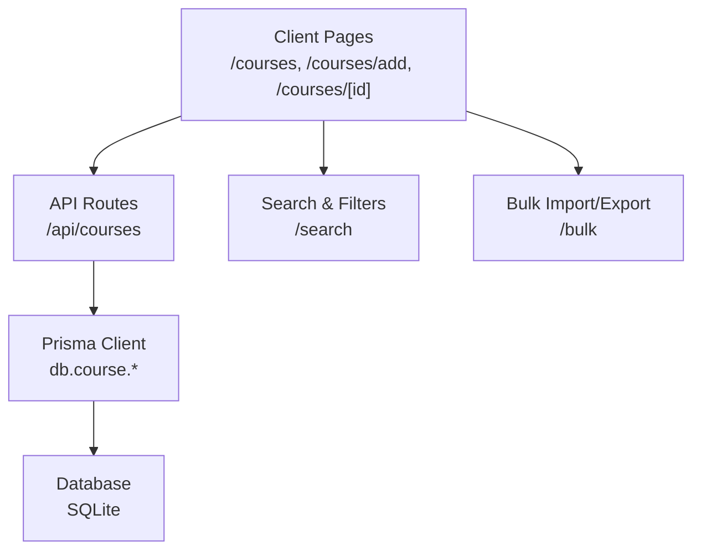
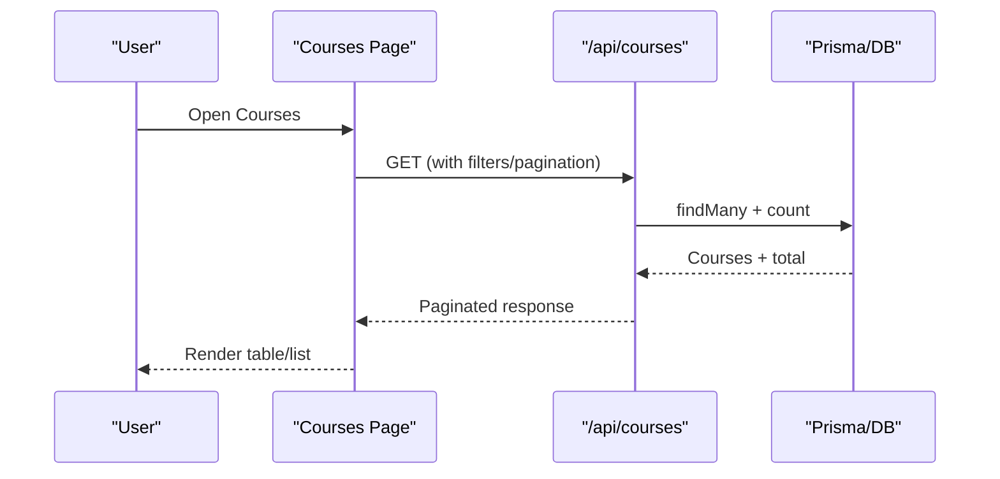
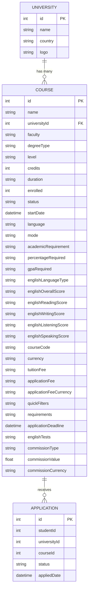
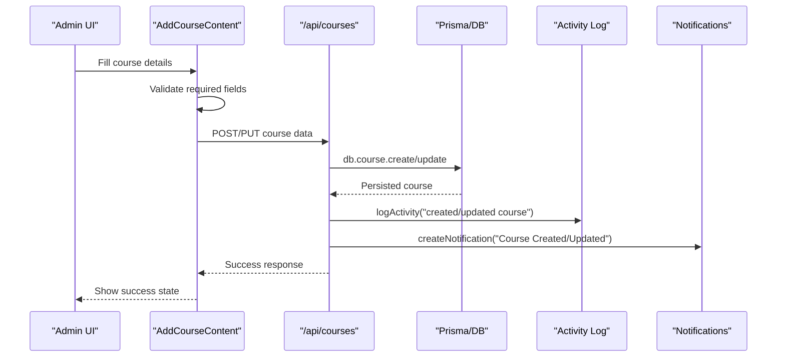
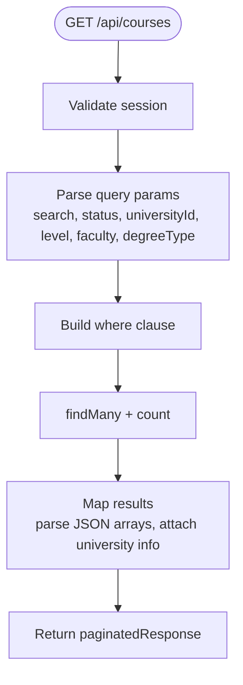
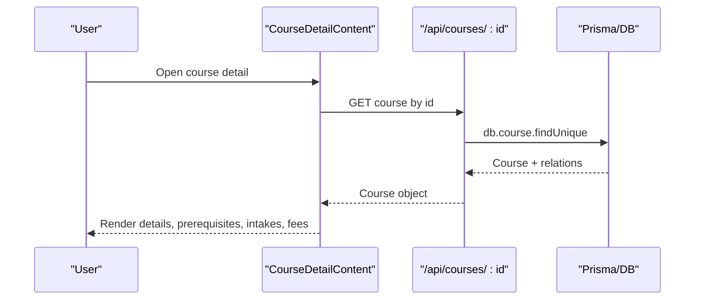
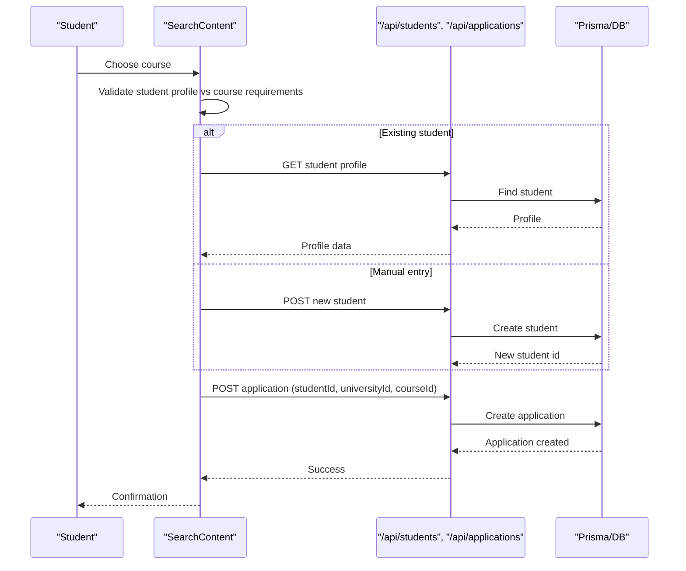
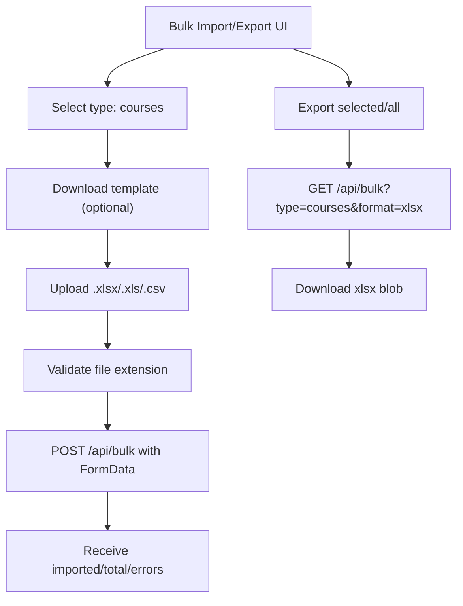
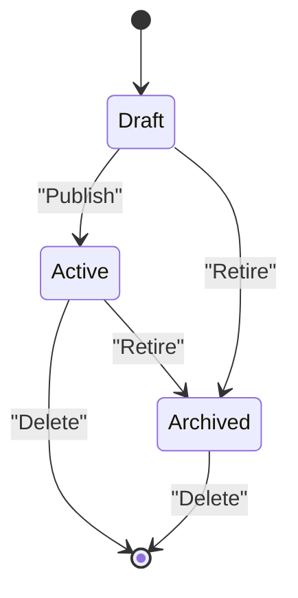
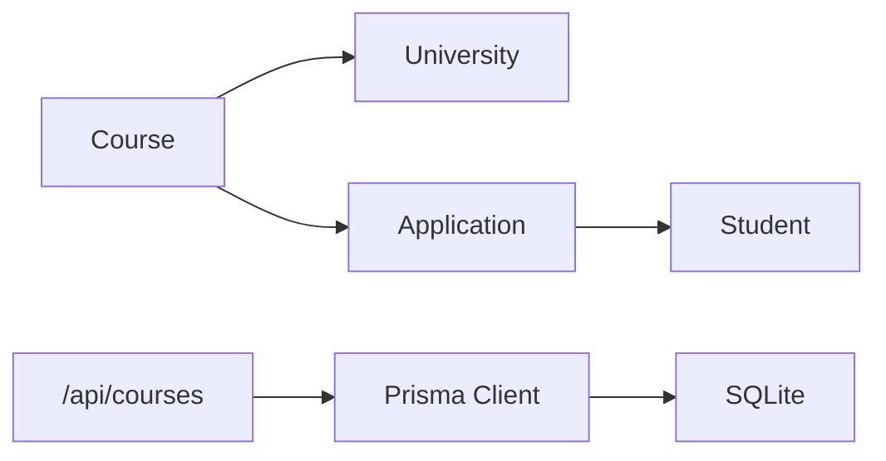

# Course Catalog Administration

<cite>
**Referenced Files in This Document**
- [schema.prisma](file://prisma/schema.prisma)
- [courses page](file://src/app/courses/page.tsx)
- [courses API route](file://src/app/api/courses/route.ts)
- [CoursesContent component](file://src/app/courses/components/CoursesContent.tsx)
- [AddCourseContent component](file://src/app/courses/components/AddCourseContent.tsx)
- [course detail page](file://src/app/courses/[id]/page.tsx)
- [CourseDetailContent component](file://src/app/courses/components/CourseDetailContent.tsx)
- [search content](file://src/app/search/components/SearchContent.tsx)
- [bulk import/export UI](file://src/app/bulk-import/BulkImportContent.tsx)
</cite>

## Table of Contents
1. [Introduction](#introduction)
2. [Project Structure](#project-structure)
3. [Core Components](#core-components)
4. [Architecture Overview](#architecture-overview)
5. [Detailed Component Analysis](#detailed-component-analysis)
6. [Dependency Analysis](#dependency-analysis)
7. [Performance Considerations](#performance-considerations)
8. [Troubleshooting Guide](#troubleshooting-guide)
9. [Conclusion](#conclusion)
10. [Appendices](#appendices)

## Introduction
This document explains the Course Catalog Administration system for managing university courses end-to-end. It covers the course entity model, creation and editing workflows, search and filtering, bulk operations, export capabilities, and lifecycle management from creation to retirement. It also outlines how course data integrates with related entities such as universities, applications, and students, and provides guidance on maintaining data accuracy and handling approvals through status-based controls.

## Project Structure
The course catalog feature is implemented across server-side routes, client components, and a Prisma-backed database schema:
- Server routes expose REST endpoints for listing, creating, and retrieving courses.
- Client pages render the course catalog, add/edit forms, and detailed views.
- The database schema defines the Course entity and its relationships to University and Application.

**Diagram sources**
- [courses page](file://src/app/courses/page.tsx:12-45)
- [courses API route](file://src/app/api/courses/route.ts:9-69)
- [schema.prisma](file://prisma/schema.prisma:67-119)

**Section sources**
- [courses page](file://src/app/courses/page.tsx:12-45)
- [courses API route](file://src/app/api/courses/route.ts:9-69)
- [schema.prisma](file://prisma/schema.prisma:67-119)

## Core Components
- Course entity fields include program details (name, faculty, degreeType, level), admission requirements (academicRequirement, percentageRequired, gpaRequired, englishLanguageType, english scores), tuition fees and application fees with currency, academic calendar fields (startDate, intake), and metadata (status, language, mode, credits, duration).
- Courses are linked to a University and can have multiple Applications.
- The API supports pagination, search, and filtering by status, university, level, faculty, and degree type.
- The UI supports adding/editing courses, viewing details, enrolling students, and exporting/importing data.

**Section sources**
- [schema.prisma](file://prisma/schema.prisma:67-119)
- [courses API route](file://src/app/api/courses/route.ts:22-65)
- [AddCourseContent component](file://src/app/courses/components/AddCourseContent.tsx:78-122)

## Architecture Overview
The system follows a Next.js App Router pattern:
- Server components fetch initial data and pass it to client components.
- Client components handle user interactions and call API routes for CRUD operations.
- API routes enforce authentication and authorization, then use Prisma to read/write data.
- Search and bulk operations provide advanced querying and data portability.

**Diagram sources**
- [courses page](file://src/app/courses/page.tsx:12-45)
- [courses API route](file://src/app/api/courses/route.ts:9-69)

## Detailed Component Analysis

### Course Entity Model
The Course model stores comprehensive program information and links to University and Application. Key fields:
- Program details: name, faculty, degreeType, level, credits, duration, language, mode
- Admission requirements: academicRequirement, percentageRequired, gpaRequired, englishLanguageType, english test scores
- Fees: tuitionFee, applicationFee, currency, applicationFeeCurrency
- Academic calendar: startDate, intake (JSON array of intake periods), applicationDeadline
- Metadata: status (Active/Draft/Archived), color, initials, instructor, description, quickFilters, requirements, englishTests, commission fields

**Diagram sources**
- [schema.prisma](file://prisma/schema.prisma:19-50)
- [schema.prisma](file://prisma/schema.prisma:67-119)
- [schema.prisma](file://prisma/schema.prisma:411-428)

**Section sources**
- [schema.prisma](file://prisma/schema.prisma:67-119)

### Course Creation Workflow
Administrators create or update courses via a form that validates required fields and submits to the API. The API creates or updates the course, logs activity, and sends notifications.

**Diagram sources**
- [AddCourseContent component](file://src/app/courses/components/AddCourseContent.tsx:273-318)
- [courses API route](file://src/app/api/courses/route.ts:72-160)

**Section sources**
- [AddCourseContent component](file://src/app/courses/components/AddCourseContent.tsx:273-318)
- [courses API route](file://src/app/api/courses/route.ts:72-160)

### Course Listing, Search, and Filtering
The courses list supports:
- Full-text search across name, instructor, description
- Filters: status, universityId, level, faculty, degreeType
- Pagination with skip/take
- Transformed responses including parsed prerequisites, quickFilters, requirements, and applicationDeadline

**Diagram sources**
- [courses API route](file://src/app/api/courses/route.ts:9-69)

**Section sources**
- [courses API route](file://src/app/api/courses/route.ts:9-69)

### Course Detail View
The detail view displays program details, requirements, fees, prerequisites, available intakes, instructor, and timeline. It allows navigation to edit and enrollment flows.

**Diagram sources**
- [course detail page](file://src/app/courses/[id]/page.tsx:10-17)
- [CourseDetailContent component](file://src/app/courses/components/CourseDetailContent.tsx:81-103)

**Section sources**
- [course detail page](file://src/app/courses/[id]/page.tsx:10-17)
- [CourseDetailContent component](file://src/app/courses/components/CourseDetailContent.tsx:81-103)

### Enrollment and Prerequisite Checking
Students can enroll in active courses. The enrollment flow includes selecting an existing student or entering manual details, checking prerequisites (level, GPA, English score), and creating an application record.

**Diagram sources**
- [search content](file://src/app/search/components/SearchContent.tsx:338-493)

**Section sources**
- [search content](file://src/app/search/components/SearchContent.tsx:338-493)

### Bulk Operations and Export
The bulk import/export interface supports importing and exporting courses (and other entities) using Excel/CSV templates. Users can download templates, upload files, and receive import results with error reporting.

**Diagram sources**
- [bulk import/export UI](file://src/app/bulk-import/BulkImportContent.tsx:117-184)

**Section sources**
- [bulk import/export UI](file://src/app/bulk-import/BulkImportContent.tsx:117-184)

### Version Control and Lifecycle Management
- Status field controls visibility and workflow: Active, Draft, Archived.
- Application deadlines and intake periods define availability windows.
- Enrolled count tracks capacity usage; while no explicit max capacity field exists, administrators can manage enrollment via status and deadlines.
- Retirement can be handled by setting status to Archived and closing intakes.

[No sources needed since this diagram shows conceptual lifecycle states]

**Section sources**
- [schema.prisma](file://prisma/schema.prisma:67-119)
- [courses API route](file://src/app/api/courses/route.ts:32-40)

## Dependency Analysis
- Courses depend on Universities for affiliation and branding.
- Applications link Students to Courses and Universities, enabling enrollment tracking.
- The API uses Prisma to enforce referential integrity and indexes for performance.
- UI components depend on utility libraries for parsing JSON arrays, forex conversion, and toast notifications.

**Diagram sources**
- [schema.prisma](file://prisma/schema.prisma:19-50)
- [schema.prisma](file://prisma/schema.prisma:67-119)
- [schema.prisma](file://prisma/schema.prisma:411-428)

**Section sources**
- [schema.prisma](file://prisma/schema.prisma:67-119)

## Performance Considerations
- Use pagination parameters (skip, take) to limit dataset size on large catalogs.
- Leverage indexes on frequently filtered fields (universityId, faculty, degreeType, level, status).
- Avoid unnecessary joins; include only required relations (e.g., university).
- Cache static reference data (faculties, degree types, intakes) on the client when possible.
- For bulk operations, prefer server-side processing and streaming exports to reduce memory pressure.

[No sources needed since this section provides general guidance]

## Troubleshooting Guide
Common issues and resolutions:
- Unauthorized access: Ensure session validation passes in API routes before performing mutations.
- Validation errors: Check required fields in the Add/Edit form; ensure names, universities, faculties, degrees, instructors, descriptions, credits, and durations are provided.
- Data parsing errors: Prerequisites, quickFilters, requirements, intakes, and englishTests are stored as JSON strings; ensure they are properly serialized/deserialized.
- Intake status mismatches: Verify openDate and deadline values to correctly compute Upcoming/Open/Closed statuses.
- Export failures: Confirm file format (.xlsx/.xls/.csv) and correct endpoint parameters for bulk export.

**Section sources**
- [courses API route](file://src/app/api/courses/route.ts:11-16)
- [AddCourseContent component](file://src/app/courses/components/AddCourseContent.tsx:273-284)
- [courses page](file://src/app/courses/page.tsx:19-31)
- [bulk import/export UI](file://src/app/bulk-import/BulkImportContent.tsx:128-138)

## Conclusion
The Course Catalog Administration system provides a robust foundation for managing university courses with rich metadata, structured workflows, and powerful search/filter capabilities. Administrators can create, edit, and retire courses, manage intakes and deadlines, track enrollment, and perform bulk operations. The integration with universities and applications enables seamless student enrollment and prerequisite checks. Following the guidelines here will help maintain data accuracy and support efficient catalog management at scale.

[No sources needed since this section summarizes without analyzing specific files]

## Appendices

### Examples and Workflows

- Adding a new course:
  - Navigate to Add Course, fill required fields (name, university, faculty, degreeType, level, credits, duration, instructor, description), set fees and currency, configure intakes and deadlines, then submit.
  - Reference: [AddCourseContent component](file://src/app/courses/components/AddCourseContent.tsx:78-122), [courses API route](file://src/app/api/courses/route.ts:72-160)

- Modifying course requirements:
  - Edit prerequisites, academicRequirement, percentageRequired, gpaRequired, and English test requirements via the edit form.
  - Reference: [AddCourseContent component](file://src/app/courses/components/AddCourseContent.tsx:78-122)

- Managing course prerequisites:
  - Add/remove prerequisite items in the form; they are stored as JSON arrays and displayed in detail views.
  - Reference: [AddCourseContent component](file://src/app/courses/components/AddCourseContent.tsx:260-271), [CourseDetailContent component](file://src/app/courses/components/CourseDetailContent.tsx:105-123)

- Generating course catalogs:
  - Use the courses list with filters and pagination to generate views; export via bulk export for offline reports.
  - Reference: [courses API route](file://src/app/api/courses/route.ts:9-69), [bulk import/export UI](file://src/app/bulk-import/BulkImportContent.tsx:153-175)

- Course search and filtering:
  - Apply text search and filters (status, university, level, faculty, degreeType); utilize saved filter presets if supported by UI.
  - Reference: [courses API route](file://src/app/api/courses/route.ts:14-40), [search content](file://src/app/search/components/SearchContent.tsx:693-777)

- Accreditation tracking:
  - University-level accreditation is stored; course listings inherit university context.
  - Reference: [schema.prisma](file://prisma/schema.prisma:19-50)

- Enrollment limits and capacity management:
  - Track enrolled counts and manage availability via status and application deadlines; consider retiring courses by setting status to Archived.
  - Reference: [schema.prisma](file://prisma/schema.prisma:67-119), [courses API route](file://src/app/api/courses/route.ts:32-40)

- Maintaining data accuracy:
  - Validate all required fields; ensure JSON arrays are correctly formatted; verify dates and currencies; audit changes via activity logs.
  - Reference: [AddCourseContent component](file://src/app/courses/components/AddCourseContent.tsx:273-284), [courses API route](file://src/app/api/courses/route.ts:134-148)