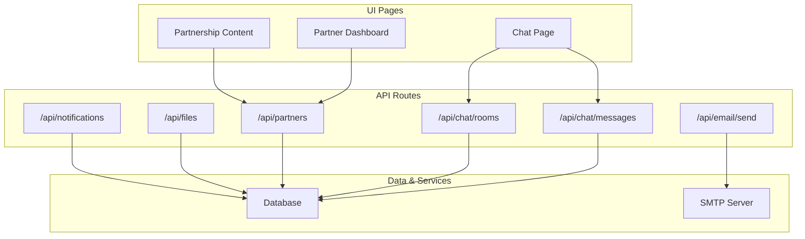
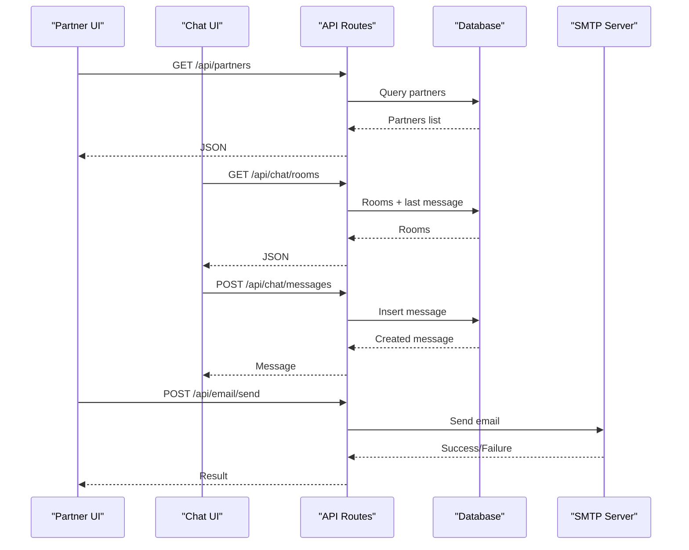
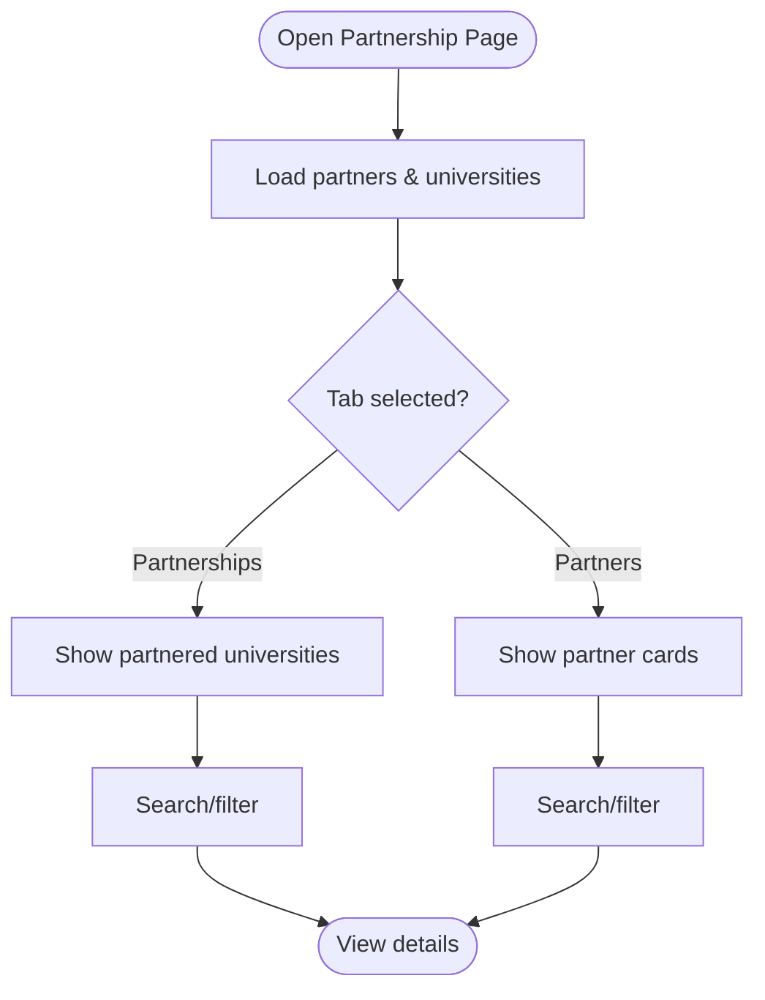
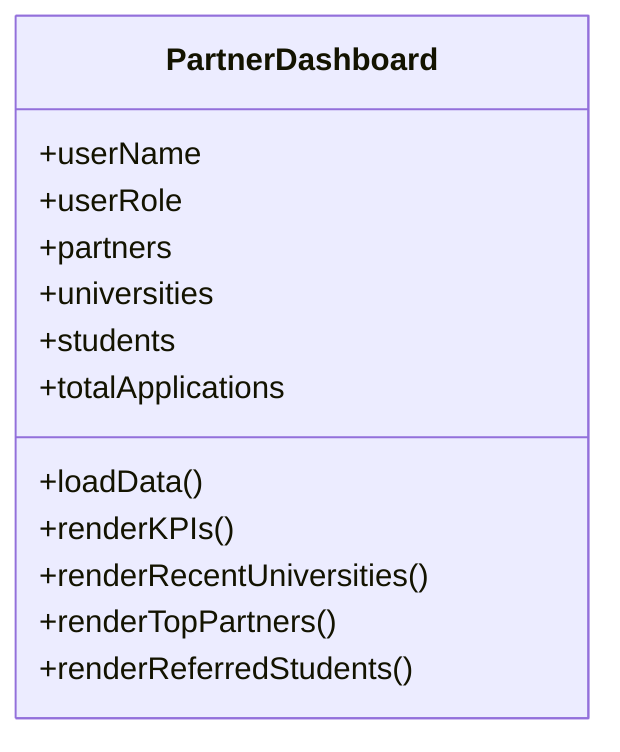
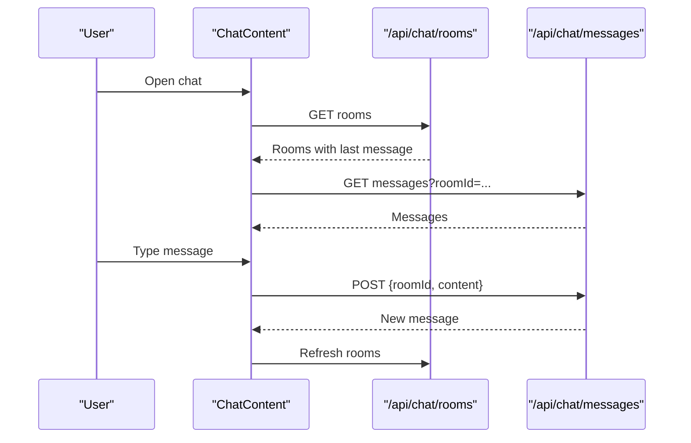
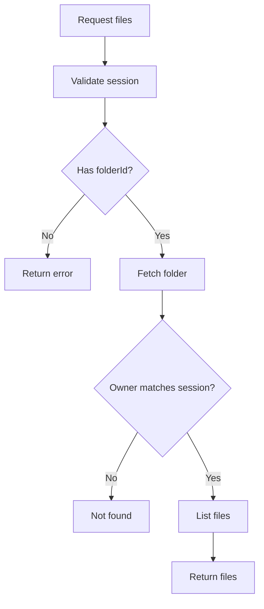
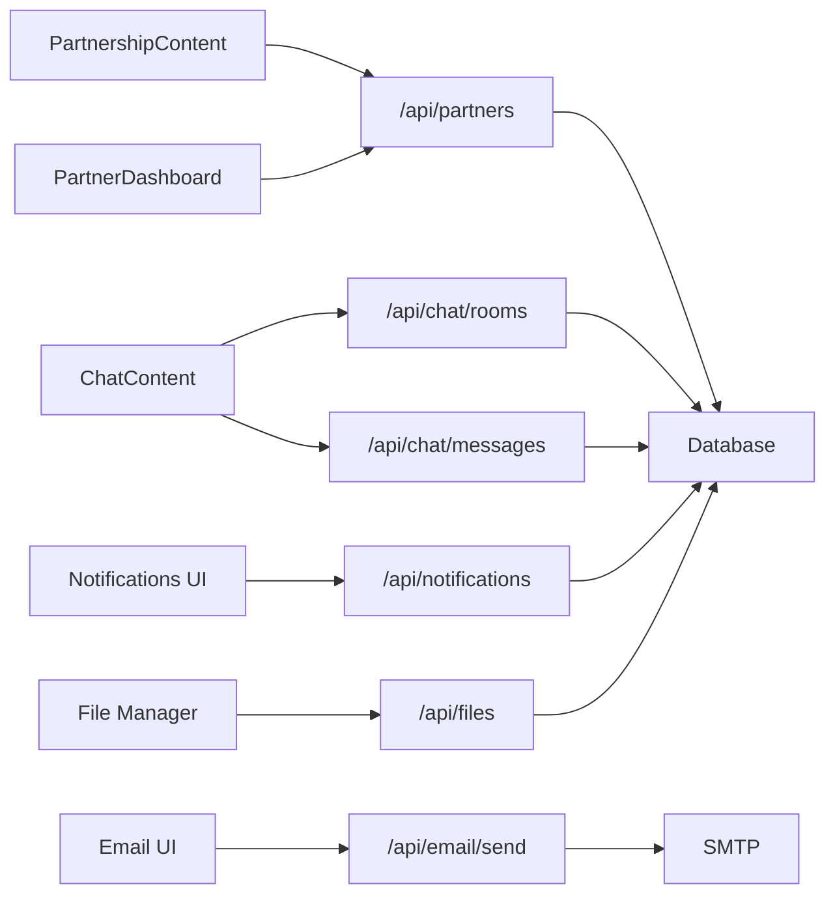

# Partner Communications & Portal

<cite>
**Referenced Files in This Document**
- [PartnershipContent.tsx](file://src/app/partnership/components/PartnershipContent.tsx)
- [PartnerDashboardContent.tsx](file://src/app/partner-dashboard/components/PartnerDashboardContent.tsx)
- [ChatContent.tsx](file://src/app/chat/components/ChatContent.tsx)
- [chat page](file://src/app/chat/page.tsx)
- [api/partners/route.ts](file://src/app/api/partners/route.ts)
- [api/chat/rooms/route.ts](file://src/app/api/chat/rooms/route.ts)
- [api/chat/messages/route.ts](file://src/app/api/chat/messages/route.ts)
- [api/notifications/route.ts](file://src/app/api/notifications/route.ts)
- [api/files/route.ts](file://src/app/api/files/route.ts)
- [api/email/send/route.ts](file://src/app/api/email/send/route.ts)
- [SupportContent.tsx](file://src/app/support/components/SupportContent.tsx)
</cite>

## Table of Contents
1. Introduction
2. Project Structure
3. Core Components
4. Architecture Overview
5. Detailed Component Analysis
6. Dependency Analysis
7. Performance Considerations
8. Troubleshooting Guide
9. Conclusion

## Introduction
This document explains the Partner Communications & Portal features, focusing on partner-facing interfaces, communication tools, and secure collaboration workflows. It covers:
- Partner portal interface and dashboard
- Real-time messaging (in-app chat)
- Document sharing and file management
- Email notifications and delivery configuration
- Partner onboarding and account management
- Access control and audit logging
- Security measures for data protection and permissions
- Best practices for effective partner engagement and troubleshooting

## Project Structure
The partner communications and portal functionality spans several pages and API routes:
- Partner management and dashboards
- In-app chat with rooms and messages
- Notifications system
- File management endpoints
- Email sending via SMTP

**Diagram sources**
- [PartnershipContent.tsx:85-148](file://src/app/partnership/components/PartnershipContent.tsx#L85-L148)
- [PartnerDashboardContent.tsx:100-148](file://src/app/partner-dashboard/components/PartnerDashboardContent.tsx#L100-L148)
- [ChatContent.tsx:58-99](file://src/app/chat/components/ChatContent.tsx#L58-L99)
- [api/partners/route.ts:19-63](file://src/app/api/partners/route.ts#L19-L63)
- [api/chat/rooms/route.ts:17-49](file://src/app/api/chat/rooms/route.ts#L17-L49)
- [api/chat/messages/route.ts:17-55](file://src/app/api/chat/messages/route.ts#L17-L55)
- [api/notifications/route.ts:18-143](file://src/app/api/notifications/route.ts#L18-L143)
- [api/files/route.ts:18-87](file://src/app/api/files/route.ts#L18-L87)
- [api/email/send/route.ts:8-104](file://src/app/api/email/send/route.ts#L8-L104)

**Section sources**
- [PartnershipContent.tsx:85-148](file://src/app/partnership/components/PartnershipContent.tsx#L85-L148)
- [PartnerDashboardContent.tsx:100-148](file://src/app/partner-dashboard/components/PartnerDashboardContent.tsx#L100-L148)
- [ChatContent.tsx:58-99](file://src/app/chat/components/ChatContent.tsx#L58-L99)
- [api/partners/route.ts:19-63](file://src/app/api/partners/route.ts#L19-L63)
- [api/chat/rooms/route.ts:17-49](file://src/app/api/chat/rooms/route.ts#L17-L49)
- [api/chat/messages/route.ts:17-55](file://src/app/api/chat/messages/route.ts#L17-L55)
- [api/notifications/route.ts:18-143](file://src/app/api/notifications/route.ts#L18-L143)
- [api/files/route.ts:18-87](file://src/app/api/files/route.ts#L18-L87)
- [api/email/send/route.ts:8-104](file://src/app/api/email/send/route.ts#L8-L104)

## Core Components
- Partner Management: Create, list, and search partner companies; associate universities with partners; view partner stats and student counts.
- Partner Dashboard: KPIs for partnerships, referred students, applications, and commissions; quick links to related modules.
- In-App Chat: Direct and group conversations with message history, user search, and room creation.
- Notifications: List, create, mark read, and delete notifications scoped to users or global.
- File Management: Secure listing and deletion of files within folders with ownership checks.
- Email Notifications: Send emails via configured SMTP; log activity and create notifications.

**Section sources**
- [PartnershipContent.tsx:238-647](file://src/app/partnership/components/PartnershipContent.tsx#L238-L647)
- [PartnerDashboardContent.tsx:183-428](file://src/app/partner-dashboard/components/PartnerDashboardContent.tsx#L183-L428)
- [ChatContent.tsx:43-483](file://src/app/chat/components/ChatContent.tsx#L43-L483)
- [api/notifications/route.ts:18-143](file://src/app/api/notifications/route.ts#L18-L143)
- [api/files/route.ts:18-87](file://src/app/api/files/route.ts#L18-L87)
- [api/email/send/route.ts:8-104](file://src/app/api/email/send/route.ts#L8-L104)

## Architecture Overview
The system uses a Next.js app with client-side components calling server-side API routes that enforce authentication and interact with the database. Email is sent through an SMTP provider.

**Diagram sources**
- [api/partners/route.ts:19-63](file://src/app/api/partners/route.ts#L19-L63)
- [api/chat/rooms/route.ts:17-49](file://src/app/api/chat/rooms/route.ts#L17-L49)
- [api/chat/messages/route.ts:17-55](file://src/app/api/chat/messages/route.ts#L17-L55)
- [api/email/send/route.ts:8-104](file://src/app/api/email/send/route.ts#L8-L104)

## Detailed Component Analysis

### Partner Portal Interface
- Partner registration form captures name, contact person, email, phone, address, and countries.
- Search and tabs allow switching between partnerships and partners views.
- Stats strip shows total partners, partnered universities, students via partners, and partnership value.
- University association supports selecting a partner when adding/editing university records.

**Diagram sources**
- [PartnershipContent.tsx:85-148](file://src/app/partnership/components/PartnershipContent.tsx#L85-L148)
- [PartnershipContent.tsx:238-647](file://src/app/partnership/components/PartnershipContent.tsx#L238-L647)

**Section sources**
- [PartnershipContent.tsx:238-647](file://src/app/partnership/components/PartnershipContent.tsx#L238-L647)

### Partner Dashboard
- Displays KPIs: total partners, partner universities, referred students, applications, and commissions.
- Lists recent partner universities and top partners by student count.
- Shows recently referred students with status indicators.

**Diagram sources**
- [PartnerDashboardContent.tsx:73-428](file://src/app/partner-dashboard/components/PartnerDashboardContent.tsx#L73-L428)

**Section sources**
- [PartnerDashboardContent.tsx:100-428](file://src/app/partner-dashboard/components/PartnerDashboardContent.tsx#L100-L428)

### Real-Time Messaging System
- Chat UI polls rooms and messages every few seconds to simulate real-time updates.
- Supports creating direct chats with other users and viewing conversation lists.
- Messages include sender info and timestamps; input handles Enter to send.

**Diagram sources**
- [ChatContent.tsx:58-99](file://src/app/chat/components/ChatContent.tsx#L58-L99)
- [ChatContent.tsx:104-158](file://src/app/chat/components/ChatContent.tsx#L104-L158)
- [api/chat/rooms/route.ts:17-49](file://src/app/api/chat/rooms/route.ts#L17-L49)
- [api/chat/messages/route.ts:17-55](file://src/app/api/chat/messages/route.ts#L17-L55)

**Section sources**
- [ChatContent.tsx:43-483](file://src/app/chat/components/ChatContent.tsx#L43-L483)
- [chat page:1-17](file://src/app/chat/page.tsx#L1-L17)

### Document Sharing Capabilities
- File listing requires folderId and enforces ownership: only the folder owner can list files.
- Deletion also validates ownership and logs the action.
- Support documentation describes file organization, permissions, and external sharing options.

**Diagram sources**
- [api/files/route.ts:18-51](file://src/app/api/files/route.ts#L18-L51)
- [api/files/route.ts:53-87](file://src/app/api/files/route.ts#L53-L87)

**Section sources**
- [api/files/route.ts:18-87](file://src/app/api/files/route.ts#L18-L87)
- [SupportContent.tsx:1773-1808](file://src/app/support/components/SupportContent.tsx#L1773-L1808)

### Communication Channels
- In-app messaging: direct and group chats with polling-based updates.
- Email notifications: send via SMTP with activity logging and notification creation.
- Support documentation outlines chat settings, notifications, and file sharing guidance.

**Section sources**
- [ChatContent.tsx:43-483](file://src/app/chat/components/ChatContent.tsx#L43-L483)
- [api/email/send/route.ts:8-104](file://src/app/api/email/send/route.ts#L8-L104)
- [SupportContent.tsx:1584-1609](file://src/app/support/components/SupportContent.tsx#L1584-L1609)

### Partner Onboarding Workflows
- Register new partners with required fields and country selection.
- Associate universities with partners during university creation/editing.
- View partner statistics and student counts post-creation.

**Section sources**
- [PartnershipContent.tsx:114-148](file://src/app/partnership/components/PartnershipContent.tsx#L114-L148)
- [PartnershipContent.tsx:261-420](file://src/app/partnership/components/PartnershipContent.tsx#L261-L420)

### Account Management and Access Control
- Authentication enforced via cookie-based token verification in API routes.
- Email sending restricted to specific roles (Admin, Super Admin, Staff).
- File operations validate ownership before allowing access.

**Section sources**
- [api/partners/route.ts:8-17](file://src/app/api/partners/route.ts#L8-L17)
- [api/chat/rooms/route.ts:6-15](file://src/app/api/chat/rooms/route.ts#L6-L15)
- [api/chat/messages/route.ts:6-15](file://src/app/api/chat/messages/route.ts#L6-L15)
- [api/email/send/route.ts:8-13](file://src/app/api/email/send/route.ts#L8-L13)
- [api/files/route.ts:7-16](file://src/app/api/files/route.ts#L7-L16)

### Notification Systems
- Fetch notifications scoped to current user or global.
- Create notifications with title, message, and type.
- Mark single or all notifications as read; delete single or all.

**Section sources**
- [api/notifications/route.ts:18-143](file://src/app/api/notifications/route.ts#L18-L143)

### Activity Logs and Audit Logging
- Creating a partner logs activity with actor and target.
- Deleting a file logs the action with actor and target.
- Sending an email logs activity and creates a notification.

**Section sources**
- [api/partners/route.ts:48-55](file://src/app/api/partners/route.ts#L48-L55)
- [api/files/route.ts:74-79](file://src/app/api/files/route.ts#L74-L79)
- [api/email/send/route.ts:55-65](file://src/app/api/email/send/route.ts#L55-L65)
- [SupportContent.tsx:1981-2009](file://src/app/support/components/SupportContent.tsx#L1981-L2009)

### Security Measures
- Session verification on sensitive endpoints prevents unauthorized access.
- Role-based restrictions for email sending ensure controlled communication.
- Ownership checks protect file integrity and privacy.

**Section sources**
- [api/chat/rooms/route.ts:17-21](file://src/app/api/chat/rooms/route.ts#L17-L21)
- [api/chat/messages/route.ts:17-26](file://src/app/api/chat/messages/route.ts#L17-L26)
- [api/email/send/route.ts:8-13](file://src/app/api/email/send/route.ts#L8-L13)
- [api/files/route.ts:18-35](file://src/app/api/files/route.ts#L18-L35)

## Dependency Analysis
- UI components depend on API routes for data and actions.
- API routes depend on database models and optional SMTP service.
- Activity logging depends on session context and user lookup.

**Diagram sources**
- [PartnershipContent.tsx:85-148](file://src/app/partnership/components/PartnershipContent.tsx#L85-L148)
- [PartnerDashboardContent.tsx:100-148](file://src/app/partner-dashboard/components/PartnerDashboardContent.tsx#L100-L148)
- [ChatContent.tsx:58-99](file://src/app/chat/components/ChatContent.tsx#L58-L99)
- [api/partners/route.ts:19-63](file://src/app/api/partners/route.ts#L19-L63)
- [api/chat/rooms/route.ts:17-49](file://src/app/api/chat/rooms/route.ts#L17-L49)
- [api/chat/messages/route.ts:17-55](file://src/app/api/chat/messages/route.ts#L17-L55)
- [api/notifications/route.ts:18-143](file://src/app/api/notifications/route.ts#L18-L143)
- [api/files/route.ts:18-87](file://src/app/api/files/route.ts#L18-L87)
- [api/email/send/route.ts:8-104](file://src/app/api/email/send/route.ts#L8-L104)

**Section sources**
- [PartnershipContent.tsx:85-148](file://src/app/partnership/components/PartnershipContent.tsx#L85-L148)
- [PartnerDashboardContent.tsx:100-148](file://src/app/partner-dashboard/components/PartnerDashboardContent.tsx#L100-L148)
- [ChatContent.tsx:58-99](file://src/app/chat/components/ChatContent.tsx#L58-L99)
- [api/partners/route.ts:19-63](file://src/app/api/partners/route.ts#L19-L63)
- [api/chat/rooms/route.ts:17-49](file://src/app/api/chat/rooms/route.ts#L17-L49)
- [api/chat/messages/route.ts:17-55](file://src/app/api/chat/messages/route.ts#L17-L55)
- [api/notifications/route.ts:18-143](file://src/app/api/notifications/route.ts#L18-L143)
- [api/files/route.ts:18-87](file://src/app/api/files/route.ts#L18-L87)
- [api/email/send/route.ts:8-104](file://src/app/api/email/send/route.ts#L8-L104)

## Performance Considerations
- Polling intervals for chat rooms and messages are set to refresh frequently; consider optimizing with WebSockets for large-scale deployments.
- Batch fetching multiple datasets in partner dashboard reduces round trips.
- Pagination and filtering reduce payload sizes for large lists.

[No sources needed since this section provides general guidance]

## Troubleshooting Guide
- Chat not updating: Ensure polling is active and network requests succeed; verify room ID and message endpoints.
- Cannot send email: Check SMTP configuration and role permissions; confirm active email settings exist.
- File access denied: Verify folder ownership and session validity; ensure correct folderId parameter.
- Notifications missing: Confirm user-scoped queries and that notifications are created successfully.

**Section sources**
- [ChatContent.tsx:58-99](file://src/app/chat/components/ChatContent.tsx#L58-L99)
- [api/email/send/route.ts:21-34](file://src/app/api/email/send/route.ts#L21-L34)
- [api/files/route.ts:18-35](file://src/app/api/files/route.ts#L18-L35)
- [api/notifications/route.ts:18-31](file://src/app/api/notifications/route.ts#L18-L31)

## Conclusion
The Partner Communications & Portal integrates partner management, real-time messaging, secure file sharing, and email notifications into a cohesive workflow. Authentication, role-based controls, and audit logging provide robust security and compliance. Use the dashboard and partnership tools to manage relationships, communicate efficiently, and track outcomes. For best results, configure SMTP, leverage notifications, and follow permission guidelines when sharing documents.

[No sources needed since this section summarizes without analyzing specific files]