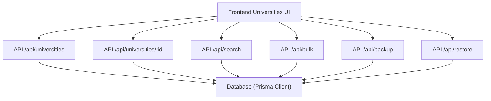
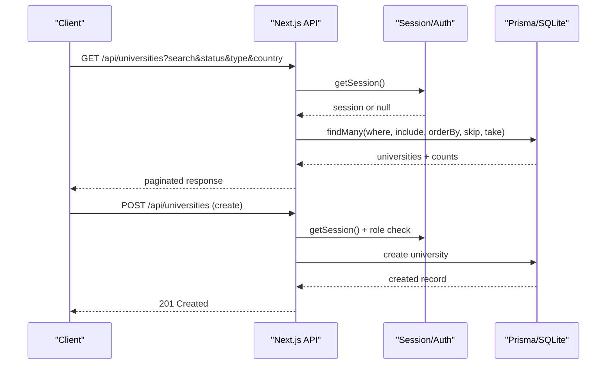
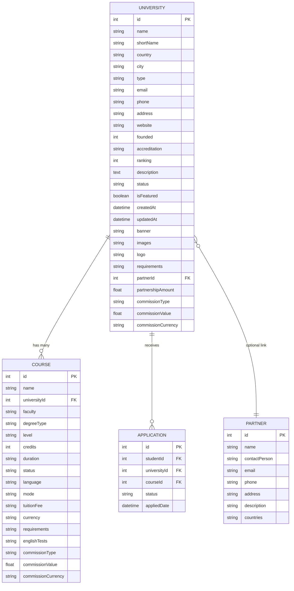
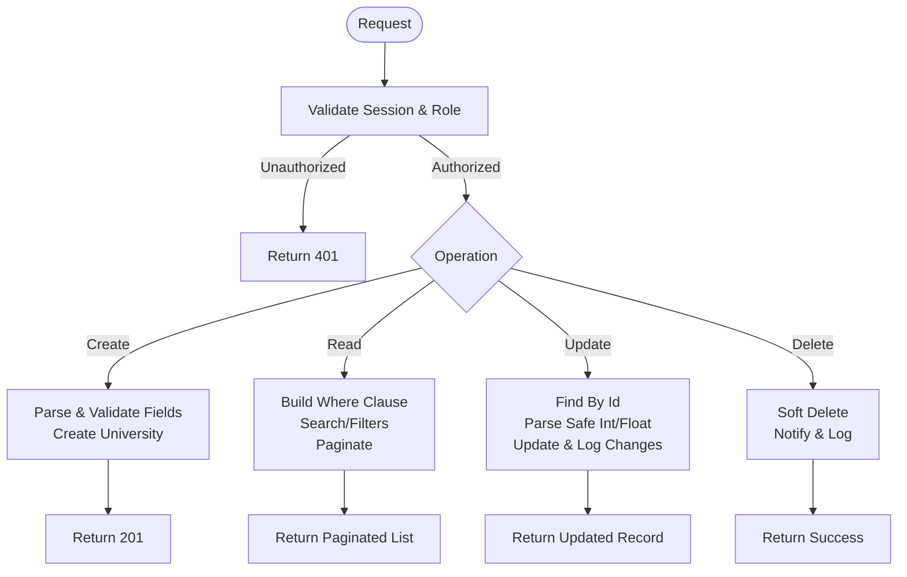
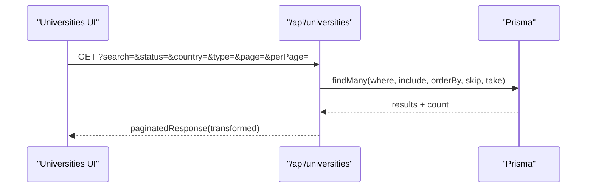
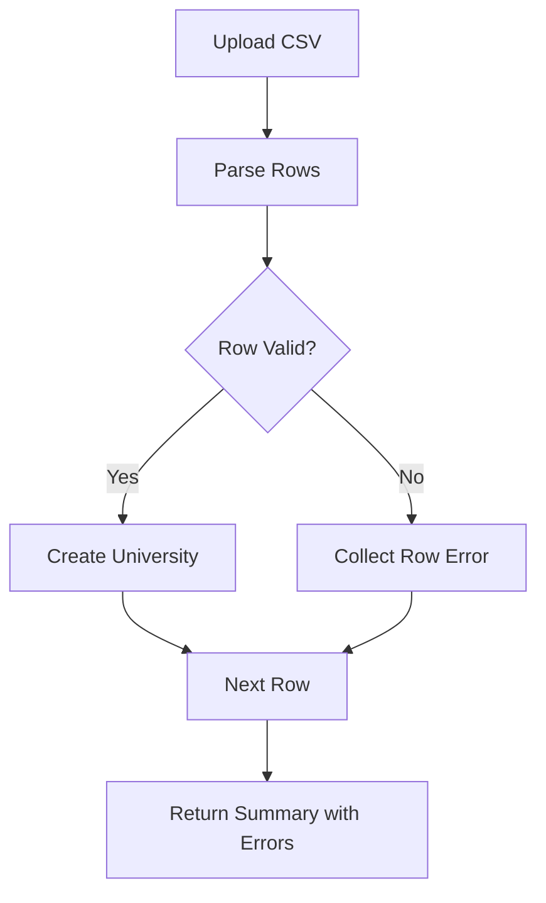
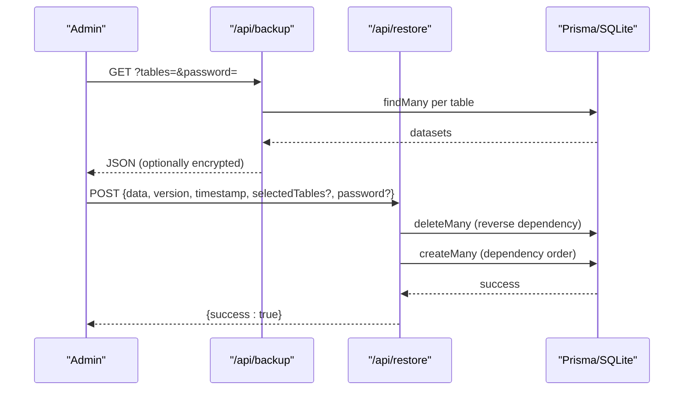
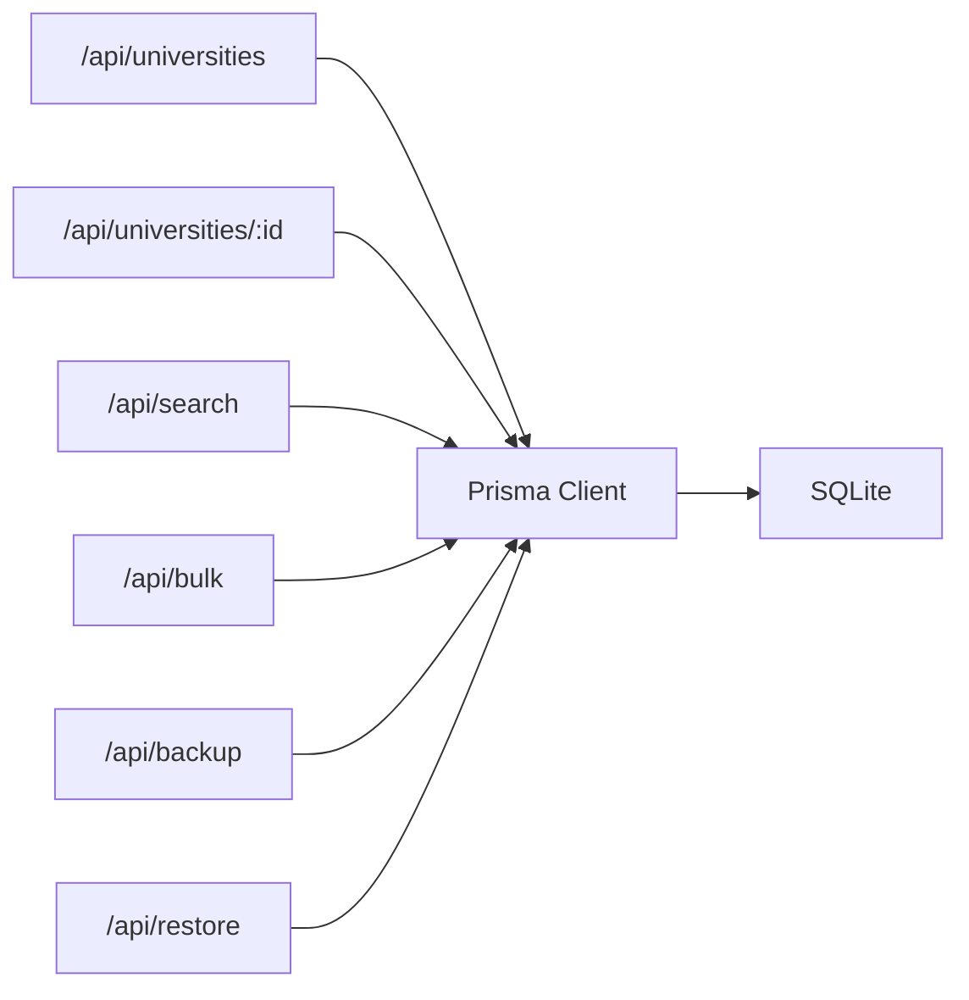

# University Database Management

<cite>
**Referenced Files in This Document**
- [schema.prisma](file://prisma/schema.prisma)
- [route.ts (universities GET/POST)](file://src/app/api/universities/route.ts)
- [route.ts (university by id GET/PATCH/DELETE)](file://src/app/api/universities/[id]/route.ts)
- [route.ts (bulk import/export)](file://src/app/api/bulk/route.ts)
- [route.ts (backup export)](file://src/app/api/backup/route.ts)
- [route.ts (restore data)](file://src/app/api/restore/route.ts)
- [db.ts (Prisma client)](file://src/lib/db.ts)
- [seed-universities.ts](file://prisma/seed-universities.ts)
- [UniversitiesContent.tsx](file://src/app/universities/components/UniversitiesContent.tsx)
- [route.ts (search)](file://src/app/api/search/route.ts)
</cite>

## Table of Contents
1. Introduction
2. Project Structure
3. Core Components
4. Architecture Overview
5. Detailed Component Analysis
6. Dependency Analysis
7. Performance Considerations
8. Troubleshooting Guide
9. Conclusion
10. Appendices

## Introduction
This document provides comprehensive documentation for managing university data within the system. It covers the university entity structure, relationships with courses and applications, CRUD operations, search and filtering, bulk import/export, validation rules, reporting, database schema, indexing strategies, query optimization, data integrity constraints, backup and restore procedures, and migration strategies. The goal is to enable administrators and developers to maintain a complete and reliable university information system.

## Project Structure
University-related functionality spans several layers:
- Data model definitions are declared in Prisma schema.
- API routes implement authentication, authorization, CRUD, search, and bulk operations.
- Frontend components consume APIs for listing, filtering, and editing universities.
- Backup and restore endpoints provide data portability and recovery.

**Diagram sources**
- [route.ts (universities GET/POST):1-158](file://src/app/api/universities/route.ts#L1-L158)
- [route.ts (university by id GET/PATCH/DELETE):1-193](file://src/app/api/universities/[id]/route.ts#L1-L193)
- [route.ts (search):42-146](file://src/app/api/search/route.ts#L42-L146)
- [route.ts (bulk import/export):147-174](file://src/app/api/bulk/route.ts#L147-L174)
- [route.ts (backup export):1-202](file://src/app/api/backup/route.ts#L1-L202)
- [route.ts (restore data):1-265](file://src/app/api/restore/route.ts#L1-L265)
- [db.ts:1-8](file://src/lib/db.ts#L1-L8)

**Section sources**
- [schema.prisma:19-50](file://prisma/schema.prisma#L19-L50)
- [route.ts (universities GET/POST):1-158](file://src/app/api/universities/route.ts#L1-L158)
- [route.ts (university by id GET/PATCH/DELETE):1-193](file://src/app/api/universities/[id]/route.ts#L1-L193)
- [route.ts (bulk import/export):147-174](file://src/app/api/bulk/route.ts#L147-L174)
- [route.ts (backup export):1-202](file://src/app/api/backup/route.ts#L1-L202)
- [route.ts (restore data):1-265](file://src/app/api/restore/route.ts#L1-L265)
- [db.ts:1-8](file://src/lib/db.ts#L1-L8)

## Core Components
- University entity: stores institution details, contact info, accreditation, partnership links, performance metrics (ranking), and status flags.
- Course entity: linked to University via foreign key; includes academic details and commission fields.
- Application entity: links Student, University, and Course; tracks application lifecycle.
- Partner entity: optional relationship to University for partnerships and commissions.

Key responsibilities:
- Provide secure, authenticated endpoints for CRUD on universities.
- Support search and filtering across name, country, city, type, and status.
- Enable bulk import/export for universities and related entities.
- Offer backup and restore capabilities with encryption support.
- Enforce data integrity through Prisma constraints and indexes.

**Section sources**
- [schema.prisma:19-50](file://prisma/schema.prisma#L19-L50)
- [schema.prisma:67-119](file://prisma/schema.prisma#L67-L119)
- [schema.prisma:411-428](file://prisma/schema.prisma#L411-L428)
- [schema.prisma:52-65](file://prisma/schema.prisma#L52-L65)

## Architecture Overview
The system uses a Next.js API layer backed by Prisma ORM and SQLite. Authentication and role checks gate administrative actions. Search and filtering leverage Prisma queries with OR conditions and pagination. Bulk operations process CSV-like rows with per-row error handling. Backup exports all relevant tables into a JSON payload, optionally encrypted. Restore validates and re-imports data using transactions to ensure consistency.

**Diagram sources**
- [route.ts (universities GET/POST):1-158](file://src/app/api/universities/route.ts#L1-L158)
- [route.ts (university by id GET/PATCH/DELETE):1-193](file://src/app/api/universities/[id]/route.ts#L1-L193)
- [db.ts:1-8](file://src/lib/db.ts#L1-L8)

## Detailed Component Analysis

### University Entity and Relationships
- University fields include identity, contact, accreditation, ranking, description, media assets, partner linkage, and commission settings.
- Relationships:
  - One-to-many with Course (Course.universityId -> University.id).
  - One-to-many with Application (Application.universityId -> University.id).
  - Optional one-to-one with Partner via partnerId.

**Diagram sources**
- [schema.prisma:19-50](file://prisma/schema.prisma#L19-L50)
- [schema.prisma:67-119](file://prisma/schema.prisma#L67-L119)
- [schema.prisma:411-428](file://prisma/schema.prisma#L411-L428)
- [schema.prisma:52-65](file://prisma/schema.prisma#L52-L65)

**Section sources**
- [schema.prisma:19-50](file://prisma/schema.prisma#L19-L50)
- [schema.prisma:67-119](file://prisma/schema.prisma#L67-L119)
- [schema.prisma:411-428](file://prisma/schema.prisma#L411-L428)
- [schema.prisma:52-65](file://prisma/schema.prisma#L52-L65)

### CRUD Operations for Universities
- Create: POST /api/universities requires Admin/Staff roles; accepts flexible field names and normalizes values (e.g., establishedYear vs foundedYear, imagesList to JSON).
- Read: GET /api/universities supports search, filters (status, country, type), pagination, and returns transformed data including computed initials, color, and parsed arrays for requirements/accreditation/images.
- Update: PATCH /api/universities/:id updates fields with safe parsing helpers; logs changes and creates notifications.
- Delete: DELETE /api/universities/:id soft-deletes via trash mechanism; logs activity and notifies.

**Diagram sources**
- [route.ts (universities GET/POST):1-158](file://src/app/api/universities/route.ts#L1-L158)
- [route.ts (university by id GET/PATCH/DELETE):1-193](file://src/app/api/universities/[id]/route.ts#L1-L193)

**Section sources**
- [route.ts (universities GET/POST):1-158](file://src/app/api/universities/route.ts#L1-L158)
- [route.ts (university by id GET/PATCH/DELETE):1-193](file://src/app/api/universities/[id]/route.ts#L1-L193)

### Search and Filtering
- Search supports case-insensitive matching across name, country, and city.
- Filters include status (default excludes Deleted), country, and type.
- Pagination parameters are normalized and applied to queries.
- Aggregated filter options can be retrieved via search endpoint for dynamic UIs.

**Diagram sources**
- [route.ts (universities GET/POST):1-158](file://src/app/api/universities/route.ts#L1-L158)
- [UniversitiesContent.tsx:137-158](file://src/app/universities/components/UniversitiesContent.tsx#L137-L158)

**Section sources**
- [route.ts (universities GET/POST):1-158](file://src/app/api/universities/route.ts#L1-L158)
- [UniversitiesContent.tsx:137-158](file://src/app/universities/components/UniversitiesContent.tsx#L137-L158)

### Bulk Import/Export
- Import: /api/bulk supports universities with row-level validation; required name field; errors collected per row.
- Export: /api/bulk returns universities with selected fields; also supports other entities like students and courses.

**Diagram sources**
- [route.ts (bulk import/export):147-174](file://src/app/api/bulk/route.ts#L147-L174)

**Section sources**
- [route.ts (bulk import/export):147-174](file://src/app/api/bulk/route.ts#L147-L174)

### Backup and Restore
- Backup: /api/backup exports all configured tables into a JSON payload; supports selective table export and optional encryption via password.
- Restore: /api/restore validates payload, enforces allowed tables, checks size limits, deletes existing data in dependency order, then re-inserts in correct order within a transaction.

**Diagram sources**
- [route.ts (backup export):1-202](file://src/app/api/backup/route.ts#L1-L202)
- [route.ts (restore data):1-265](file://src/app/api/restore/route.ts#L1-L265)

**Section sources**
- [route.ts (backup export):1-202](file://src/app/api/backup/route.ts#L1-L202)
- [route.ts (restore data):1-265](file://src/app/api/restore/route.ts#L1-L265)

### Data Validation Rules
- Field normalization:
  - Accepts multiple input names (e.g., establishedYear/foundedYear).
  - Converts arrays to JSON strings for fields like accreditation, requirements, images.
  - Uses safe parsing helpers for numeric fields to avoid invalid types.
- Required fields:
  - Name is mandatory for creation and bulk import.
- Status defaults:
  - Default status set to Active unless specified.
- Role-based access:
  - Creation/Update require Admin/Staff roles; Deletion requires Admin/Super Admin.

**Section sources**
- [route.ts (universities GET/POST):84-158](file://src/app/api/universities/route.ts#L84-L158)
- [route.ts (university by id GET/PATCH/DELETE):120-193](file://src/app/api/universities/[id]/route.ts#L120-L193)
- [route.ts (bulk import/export):147-174](file://src/app/api/bulk/route.ts#L147-L174)

### Examples of Common Tasks
- Add a new university:
  - Use POST /api/universities with fields such as name, country, city, type, website, ranking, description, status, and optional partner/commission fields.
- Update institution details:
  - Use PATCH /api/universities/:id to update name, contact, accreditation, ranking, media, and commission settings.
- Manage accreditation information:
  - Store accreditation as either a string or JSON array; the API normalizes inputs and transforms outputs for UI consumption.
- Generate university reports:
  - Use GET /api/universities with filters and pagination to extract datasets for analysis; combine with dashboard stats endpoints for KPIs.

**Section sources**
- [route.ts (universities GET/POST):84-158](file://src/app/api/universities/route.ts#L84-L158)
- [route.ts (university by id GET/PATCH/DELETE):120-193](file://src/app/api/universities/[id]/route.ts#L120-L193)
- [route.ts (universities GET/POST):1-158](file://src/app/api/universities/route.ts#L1-L158)

## Dependency Analysis
- Direct dependencies:
  - API routes depend on Prisma client for data access.
  - Authentication utilities enforce session and role checks.
  - Notification and activity logging integrate with user actions.
- Indirect dependencies:
  - Frontend components rely on consistent API responses and transformation logic.
  - Backup/Restore depends on table schemas and dependency ordering.

**Diagram sources**
- [db.ts:1-8](file://src/lib/db.ts#L1-L8)
- [route.ts (universities GET/POST):1-158](file://src/app/api/universities/route.ts#L1-L158)
- [route.ts (university by id GET/PATCH/DELETE):1-193](file://src/app/api/universities/[id]/route.ts#L1-L193)
- [route.ts (search):42-146](file://src/app/api/search/route.ts#L42-L146)
- [route.ts (bulk import/export):147-174](file://src/app/api/bulk/route.ts#L147-L174)
- [route.ts (backup export):1-202](file://src/app/api/backup/route.ts#L1-L202)
- [route.ts (restore data):1-265](file://src/app/api/restore/route.ts#L1-L265)

**Section sources**
- [db.ts:1-8](file://src/lib/db.ts#L1-L8)
- [route.ts (universities GET/POST):1-158](file://src/app/api/universities/route.ts#L1-L158)
- [route.ts (university by id GET/PATCH/DELETE):1-193](file://src/app/api/universities/[id]/route.ts#L1-L193)
- [route.ts (search):42-146](file://src/app/api/search/route.ts#L42-L146)
- [route.ts (bulk import/export):147-174](file://src/app/api/bulk/route.ts#L147-L174)
- [route.ts (backup export):1-202](file://src/app/api/backup/route.ts#L1-L202)
- [route.ts (restore data):1-265](file://src/app/api/restore/route.ts#L1-L265)

## Performance Considerations
- Indexing strategy:
  - Course model includes indexes on universityId, faculty, degreeType, level, and status to optimize queries involving courses and their associations.
- Query optimization:
  - Use where clauses with contains for search and exact matches for filters.
  - Apply pagination (skip/take) to limit result sets.
  - Include only necessary relations (e.g., partner, course counts) to reduce payload size.
- Bulk operations:
  - Process rows individually with error collection to avoid full rollback on single failures.
- Backup/Restore:
  - Selective table export reduces payload size.
  - Restore uses transactions and dependency-aware ordering to maintain integrity efficiently.

**Section sources**
- [schema.prisma:67-119](file://prisma/schema.prisma#L67-L119)
- [route.ts (universities GET/POST):1-158](file://src/app/api/universities/route.ts#L1-L158)
- [route.ts (bulk import/export):147-174](file://src/app/api/bulk/route.ts#L147-L174)
- [route.ts (backup export):1-202](file://src/app/api/backup/route.ts#L1-L202)
- [route.ts (restore data):1-265](file://src/app/api/restore/route.ts#L1-L265)

## Troubleshooting Guide
- Unauthorized access:
  - Ensure valid session and appropriate roles (Admin/Staff for create/update; Admin/Super Admin for delete/backup/restore).
- Master API not configured:
  - Some master endpoints return 503 if configuration is missing; verify environment setup for external master data.
- Failed to fetch universities:
  - Check network connectivity and server logs; validate query parameters and filters.
- Bulk import errors:
  - Review row-specific error messages; ensure required fields like name are present and correctly formatted.
- Restore failures:
  - Validate backup file format and size; ensure selected tables are allowed and data arrays are properly structured.

**Section sources**
- [route.ts (universities GET/POST):1-158](file://src/app/api/universities/route.ts#L1-L158)
- [route.ts (university by id GET/PATCH/DELETE):1-193](file://src/app/api/universities/[id]/route.ts#L1-L193)
- [route.ts (bulk import/export):147-174](file://src/app/api/bulk/route.ts#L147-L174)
- [route.ts (backup export):1-202](file://src/app/api/backup/route.ts#L1-L202)
- [route.ts (restore data):1-265](file://src/app/api/restore/route.ts#L1-L265)

## Conclusion
The university management system provides robust CRUD operations, flexible search and filtering, bulk import/export, and comprehensive backup/restore capabilities. The Prisma schema defines clear relationships and constraints, while API routes enforce security and validation. Indexing and query patterns optimize performance. Administrators can confidently manage university data, track accreditation and partnerships, and generate insights through dashboards and reports.

## Appendices

### Database Schema Highlights
- University fields capture institutional identity, contact details, accreditation, ranking, and media assets.
- Course fields include academic metadata, fees, and commission settings; indexed for efficient querying.
- Application links students, universities, and courses; tracked with workflow stages and notes.

**Section sources**
- [schema.prisma:19-50](file://prisma/schema.prisma#L19-L50)
- [schema.prisma:67-119](file://prisma/schema.prisma#L67-L119)
- [schema.prisma:411-428](file://prisma/schema.prisma#L411-L428)

### Seed Data
- Sample universities and courses are provided for development and testing.

**Section sources**
- [seed-universities.ts:5-800](file://prisma/seed-universities.ts#L5-L800)