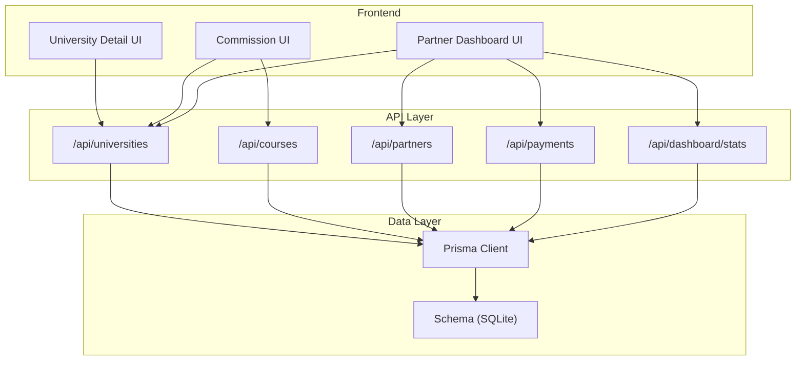
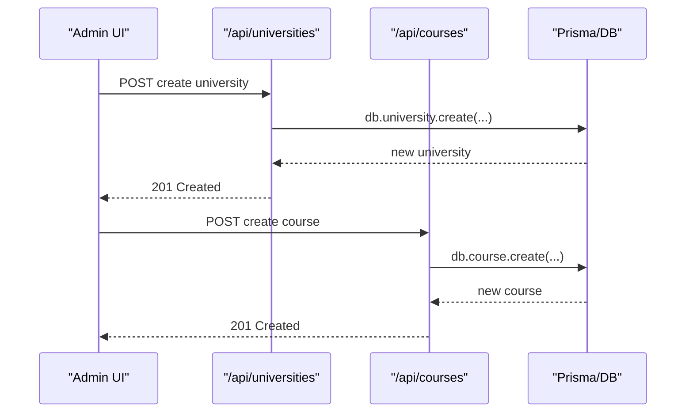
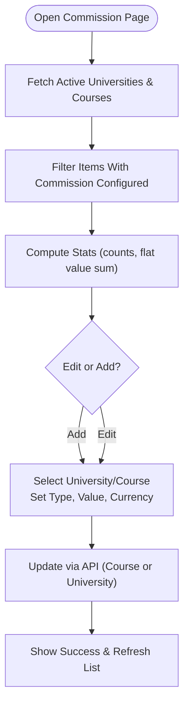
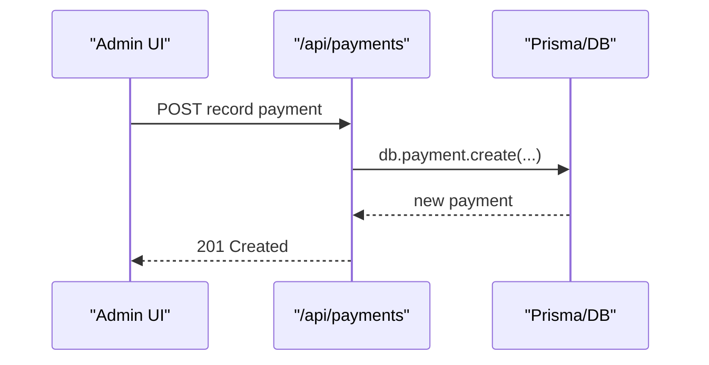
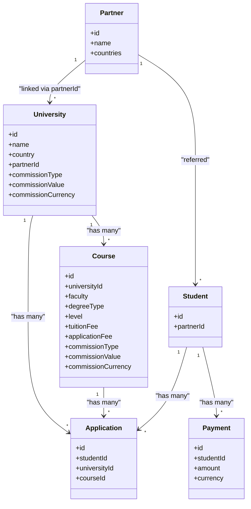

# University Partnership Management

<cite>
**Referenced Files in This Document**
- [schema.prisma](file://prisma/schema.prisma)
- [route.ts (Universities)](file://src/app/api/universities/route.ts)
- [route.ts (Courses)](file://src/app/api/courses/route.ts)
- [route.ts (Partners)](file://src/app/api/partners/route.ts)
- [route.ts (Payments)](file://src/app/api/payments/route.ts)
- [CommissionContent.tsx](file://src/app/commission/components/CommissionContent.tsx)
- [UniversityDetailContent.tsx](file://src/app/universities/components/UniversityDetailContent.tsx)
- [PartnerDashboardContent.tsx](file://src/app/partner-dashboard/components/PartnerDashboardContent.tsx)
- [route.ts (Dashboard Stats)](file://src/app/api/dashboard/stats/route.ts)
- [SupportContent.tsx](file://src/app/support/components/SupportContent.tsx)
</cite>

## Table of Contents
1. [Introduction](#introduction)
2. [Project Structure](#project-structure)
3. [Core Components](#core-components)
4. [Architecture Overview](#architecture-overview)
5. [Detailed Component Analysis](#detailed-component-analysis)
6. [Dependency Analysis](#dependency-analysis)
7. [Performance Considerations](#performance-considerations)
8. [Troubleshooting Guide](#troubleshooting-guide)
9. [Conclusion](#conclusion)
10. [Appendices](#appendices)

## Introduction
This document explains the University Partnership Management system with a focus on maintaining university relationships and course catalogs, managing accreditation and partnership agreements, tracking performance metrics, administering course offerings (programs, admission requirements, tuition fees), calculating commissions, processing payments, and generating financial reports. It also covers partner portal functionality, communication tools, analytics, guidelines for relationship management and KPIs, and troubleshooting guidance for data synchronization and commission calculation issues.

## Project Structure
The system is built as a Next.js application backed by a Prisma schema. Core entities include University, Partner, Course, Application, Student, Payment, and related models. APIs expose CRUD operations for universities, courses, partners, and payments, while UI components provide dashboards for administrators and partners.

**Diagram sources**
- [route.ts (Universities):1-158](file://src/app/api/universities/route.ts#L1-L158)
- [route.ts (Courses):1-161](file://src/app/api/courses/route.ts#L1-L161)
- [route.ts (Partners):1-63](file://src/app/api/partners/route.ts#L1-L63)
- [route.ts (Payments):1-97](file://src/app/api/payments/route.ts#L1-L97)
- [route.ts (Dashboard Stats):1-79](file://src/app/api/dashboard/stats/route.ts#L1-L79)
- [schema.prisma:19-119](file://prisma/schema.prisma#L19-L119)

**Section sources**
- [schema.prisma:19-119](file://prisma/schema.prisma#L19-L119)
- [route.ts (Universities):1-158](file://src/app/api/universities/route.ts#L1-L158)
- [route.ts (Courses):1-161](file://src/app/api/courses/route.ts#L1-L161)
- [route.ts (Partners):1-63](file://src/app/api/partners/route.ts#L1-L63)
- [route.ts (Payments):1-97](file://src/app/api/payments/route.ts#L1-L97)
- [route.ts (Dashboard Stats):1-79](file://src/app/api/dashboard/stats/route.ts#L1-L79)

## Core Components
- University database management: institution details, accreditation, partnerships, and performance metrics are modeled and exposed via APIs and UI.
- Course catalog administration: programs, admission requirements, tuition fees, and application deadlines are managed through dedicated endpoints and views.
- Commission engine: configurable per university or per course using percentage or flat values; persisted alongside university/course records.
- Payments and financial reporting: payment recording and dashboard statistics support financial oversight.
- Partner portal: overview of partners, referred students, and commission configurations.

**Section sources**
- [schema.prisma:19-119](file://prisma/schema.prisma#L19-L119)
- [route.ts (Universities):84-158](file://src/app/api/universities/route.ts#L84-L158)
- [route.ts (Courses):72-161](file://src/app/api/courses/route.ts#L72-L161)
- [CommissionContent.tsx:113-311](file://src/app/commission/components/CommissionContent.tsx#L113-L311)
- [route.ts (Payments):55-97](file://src/app/api/payments/route.ts#L55-L97)
- [PartnerDashboardContent.tsx:73-224](file://src/app/partner-dashboard/components/PartnerDashboardContent.tsx#L73-L224)

## Architecture Overview
The architecture follows a client-server pattern:
- Frontend pages call REST-like API routes to read/write data.
- API routes enforce session-based authorization and interact with Prisma.
- Data is stored in SQLite via Prisma, with rich relations between University, Partner, Course, Application, Student, and Payment.

**Diagram sources**
- [route.ts (Universities):84-158](file://src/app/api/universities/route.ts#L84-L158)
- [route.ts (Courses):72-161](file://src/app/api/courses/route.ts#L72-L161)

## Detailed Component Analysis

### University Database Management
- Institution details: name, shortName, country, city, type, email, phone, address, website, founded year, ranking, description, status, featured flag, media fields.
- Accreditation information: stored as string or JSON array; parsed and displayed in detail view.
- Partnership linkage: optional partnerId linking to Partner model; partnershipAmount and commission settings at university level.
- Performance metrics: counts of courses and applications; dashboard stats aggregate totals and recent changes.

Key implementation highlights:
- GET lists universities with filters (status, country, type), includes partner and course counts, transforms arrays for accreditation and requirements.
- POST creates universities with robust field mapping and notifications.
- Detail UI renders accreditation, contact info, and partnership sections.

**Section sources**
- [schema.prisma:19-50](file://prisma/schema.prisma#L19-L50)
- [route.ts (Universities):8-82](file://src/app/api/universities/route.ts#L8-L82)
- [route.ts (Universities):84-158](file://src/app/api/universities/route.ts#L84-L158)
- [UniversityDetailContent.tsx:458-575](file://src/app/universities/components/UniversityDetailContent.tsx#L458-L575)
- [route.ts (Dashboard Stats):14-73](file://src/app/api/dashboard/stats/route.ts#L14-L73)

### Course Catalog Administration
- Program details: name, faculty, degreeType, level, credits, duration, instructor, description, intake, language, mode, courseCode.
- Admission requirements: academicRequirement, percentageRequired, gpaRequired, englishLanguageType and scores, requirements list, applicationDeadline.
- Tuition fees and currency: tuitionFee, applicationFee, applicationFeeCurrency, currency.
- Indexes optimize queries by universityId, faculty, degreeType, level, status.

Key implementation highlights:
- GET supports search and filters (status, universityId, level, faculty, degreeType), returns transformed prerequisites/requirements arrays.
- POST persists full program metadata including English test requirements and commission fields.
- Detail UI groups courses by faculty, supports search, and displays fees with currency conversion options.

**Section sources**
- [schema.prisma:67-119](file://prisma/schema.prisma#L67-L119)
- [route.ts (Courses):9-70](file://src/app/api/courses/route.ts#L9-L70)
- [route.ts (Courses):72-161](file://src/app/api/courses/route.ts#L72-L161)
- [UniversityDetailContent.tsx:699-800](file://src/app/universities/components/UniversityDetailContent.tsx#L699-L800)

### Partnership Agreements and Partner Portal
- Partners: name, contactPerson, email, phone, address, description, countries (JSON array).
- Universities can be linked to partners via partnerId; partner student counts are included in listings.
- Partner dashboard aggregates partner universities, referred students, total applications, and commission configurations.

Key implementation highlights:
- GET /partners lists partners with student counts.
- POST /partners creates new partners and logs activity.
- Partner dashboard fetches current user, partners, active universities, students, and application totals to present KPIs and recent items.

**Section sources**
- [schema.prisma:52-65](file://prisma/schema.prisma#L52-L65)
- [route.ts (Partners):19-63](file://src/app/api/partners/route.ts#L19-L63)
- [PartnerDashboardContent.tsx:100-148](file://src/app/partner-dashboard/components/PartnerDashboardContent.tsx#L100-L148)
- [PartnerDashboardContent.tsx:150-224](file://src/app/partner-dashboard/components/PartnerDashboardContent.tsx#L150-L224)

### Commission Calculation Engine
- Commission types: Percentage or Flat; can be configured at university level or overridden per course.
- Values and currencies are stored alongside university/course records.
- UI provides add/edit flows to set commission structures and displays aggregated stats.

Key implementation highlights:
- Fetches all active universities and courses, filters those with configured commissions, computes summary stats.
- Save flow updates either course or university endpoints based on selection; validates inputs and shows feedback.
- Info text clarifies that course-level commission overrides university default for payouts.

**Diagram sources**
- [CommissionContent.tsx:113-311](file://src/app/commission/components/CommissionContent.tsx#L113-L311)
- [CommissionContent.tsx:549-563](file://src/app/commission/components/CommissionContent.tsx#L549-L563)

**Section sources**
- [schema.prisma:19-50](file://prisma/schema.prisma#L19-L50)
- [schema.prisma:67-119](file://prisma/schema.prisma#L67-L119)
- [CommissionContent.tsx:113-311](file://src/app/commission/components/CommissionContent.tsx#L113-L311)
- [CommissionContent.tsx:549-563](file://src/app/commission/components/CommissionContent.tsx#L549-L563)

### Payment Processing and Financial Reporting
- Payments: studentId, amount, currency, status, method, date, description, proofUrl.
- GET supports filtering by studentId, status, method, and search across student names/email.
- POST records payments with validation and activity logging.
- Dashboard stats include totals for universities, courses, enrollments, leads, students, applications, tasks.

**Diagram sources**
- [route.ts (Payments):55-97](file://src/app/api/payments/route.ts#L55-L97)

**Section sources**
- [schema.prisma:488-504](file://prisma/schema.prisma#L488-L504)
- [route.ts (Payments):7-53](file://src/app/api/payments/route.ts#L7-L53)
- [route.ts (Payments):55-97](file://src/app/api/payments/route.ts#L55-L97)
- [route.ts (Dashboard Stats):14-73](file://src/app/api/dashboard/stats/route.ts#L14-L73)

### Integration with External Systems and Automated Data Synchronization
- The system exposes API keys for integrations and includes restore capabilities for backups.
- Documentation references automation concepts such as “Auto-Sync University Data” and periodic syncs from external providers.
- While no explicit external sync endpoints are implemented here, the architecture supports integration via API keys and scheduled tasks.

Guidance:
- Use API Keys to authenticate external systems.
- Schedule background jobs to call relevant endpoints (/api/universities, /api/courses) to keep data synchronized.
- Validate incoming payloads and handle errors gracefully.

**Section sources**
- [SupportContent.tsx:2156-2180](file://src/app/support/components/SupportContent.tsx#L2156-L2180)
- [AutomationsContent.tsx:1-47](file://src/app/automations/components/AutomationsContent.tsx#L1-L47)

### Partner Portal Functionality, Communication Tools, and Performance Analytics
- Partner dashboard presents KPIs: total partners, partner universities, students referred, total applications, partner commissions.
- Recent partner universities and top partners are listed with quick links to detailed views.
- Communication tools: chat rooms and messages are available elsewhere in the app; partner interactions can leverage these channels.

**Section sources**
- [PartnerDashboardContent.tsx:73-224](file://src/app/partner-dashboard/components/PartnerDashboardContent.tsx#L73-L224)
- [PartnerDashboardContent.tsx:226-428](file://src/app/partner-dashboard/components/PartnerDashboardContent.tsx#L226-L428)

## Dependency Analysis
- Models and relationships:
  - University has many Courses and Applications; optional Partner link.
  - Course belongs to University; has many Applications.
  - Student has many Applications and Payments; optional Partner link.
  - Partner has many Students and Universities.
- API dependencies:
  - University and Course APIs depend on Prisma and session utilities.
  - Partner API depends on session verification and activity logging.
  - Payments API depends on session and activity logging.
  - Dashboard stats aggregate multiple models for KPIs.

**Diagram sources**
- [schema.prisma:19-119](file://prisma/schema.prisma#L19-L119)
- [schema.prisma:334-428](file://prisma/schema.prisma#L334-L428)
- [schema.prisma:488-504](file://prisma/schema.prisma#L488-L504)

**Section sources**
- [schema.prisma:19-119](file://prisma/schema.prisma#L19-L119)
- [schema.prisma:334-428](file://prisma/schema.prisma#L334-L428)
- [schema.prisma:488-504](file://prisma/schema.prisma#L488-L504)

## Performance Considerations
- Pagination and filtering:
  - University and Course APIs implement pagination and server-side filtering to reduce payload sizes.
- Indexing:
  - Course indexes on universityId, faculty, degreeType, level, status improve query performance.
- Aggregations:
  - Dashboard stats use efficient aggregations and distinct queries to compute KPIs quickly.
- UI optimizations:
  - Commission UI paginates data fetching and computes summaries client-side to minimize re-renders.

[No sources needed since this section provides general guidance]

## Troubleshooting Guide

### Data Synchronization Issues
Symptoms:
- Missing or outdated university/course data from external sources.
- Inconsistent accreditation or requirements across systems.

Steps:
- Verify API key permissions and authentication for external integrations.
- Check scheduled automation jobs for successful runs and error logs.
- Validate payload formats when syncing; ensure required fields like universityId, faculty, and status are present.
- Use backup/restore features cautiously; confirm allowed tables and size limits before restoring.

**Section sources**
- [SupportContent.tsx:2156-2180](file://src/app/support/components/SupportContent.tsx#L2156-L2180)
- [AutomationsContent.tsx:1-47](file://src/app/automations/components/AutomationsContent.tsx#L1-L47)

### Commission Calculation Problems
Symptoms:
- Incorrect commission values or types applied to payouts.
- Course-level overrides not taking effect.

Steps:
- Confirm commissionType and commissionValue are set correctly for both university and course levels.
- Ensure course-level configuration overrides university defaults as documented.
- Validate currency settings and numeric parsing in the UI/API.
- Review saved records via the Commission UI and verify persistence through API responses.

**Section sources**
- [CommissionContent.tsx:113-311](file://src/app/commission/components/CommissionContent.tsx#L113-L311)
- [CommissionContent.tsx:549-563](file://src/app/commission/components/CommissionContent.tsx#L549-L563)

### Payment Recording Errors
Symptoms:
- Failed to record payments due to missing fields or unauthorized access.
- Incorrect currency or status after creation.

Steps:
- Ensure required fields (studentId, amount) are provided.
- Verify session authentication and role permissions.
- Check response codes and error messages from the API.
- Confirm currency defaults and method values are acceptable.

**Section sources**
- [route.ts (Payments):55-97](file://src/app/api/payments/route.ts#L55-L97)

## Conclusion
The University Partnership Management system provides comprehensive tools to manage university relationships, course catalogs, accreditation, partnerships, and performance metrics. It supports configurable commission structures at university and course levels, payment recording, and partner dashboards for analytics. While external integrations are supported via API keys and conceptual automations, careful validation and scheduling are essential for reliable synchronization. The system’s architecture emphasizes clear separation of concerns, robust data modeling, and accessible UIs for administrators and partners.

[No sources needed since this section summarizes without analyzing specific files]

## Appendices

### Guidelines for Managing University Relationships and Tracking KPIs
- Maintain accurate accreditation and requirements data to ensure compliance and clarity for applicants.
- Link universities to partners where applicable and configure commission structures consistently.
- Track KPIs such as total universities, courses, enrollments, applications, and partner commissions via dashboard endpoints.
- Generate reports using saved report builders and export capabilities where available.

**Section sources**
- [route.ts (Dashboard Stats):14-73](file://src/app/api/dashboard/stats/route.ts#L14-L73)
- [SupportContent.tsx:574-595](file://src/app/support/components/SupportContent.tsx#L574-L595)

### Adding New Universities and Managing Course Offerings
- Create universities via the universities API with complete institution details and optional partner linkage.
- Add courses under each university with full program metadata, admission requirements, and fee structures.
- Use the university detail view to manage courses, filter by faculties, and update fees or deadlines.

**Section sources**
- [route.ts (Universities):84-158](file://src/app/api/universities/route.ts#L84-L158)
- [route.ts (Courses):72-161](file://src/app/api/courses/route.ts#L72-L161)
- [UniversityDetailContent.tsx:699-800](file://src/app/universities/components/UniversityDetailContent.tsx#L699-L800)

### Tracking Partnership Commissions and Generating Reports
- Configure commissions per university or course; review aggregated stats in the Commission UI.
- Export commission reports for accounting purposes using partner and university filters.
- Monitor partner performance metrics including referrals, enrollments, and conversions.

**Section sources**
- [CommissionContent.tsx:113-311](file://src/app/commission/components/CommissionContent.tsx#L113-L311)
- [SupportContent.tsx:574-595](file://src/app/support/components/SupportContent.tsx#L574-L595)