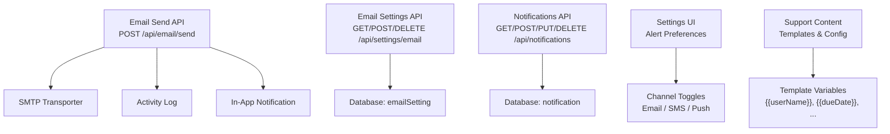
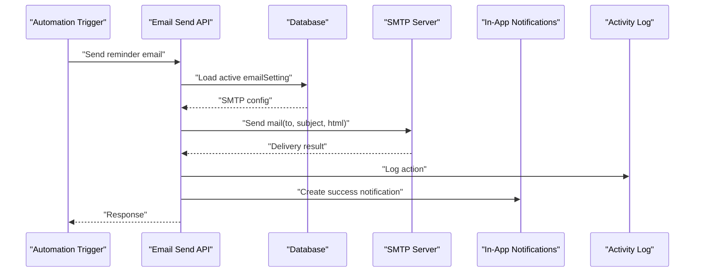
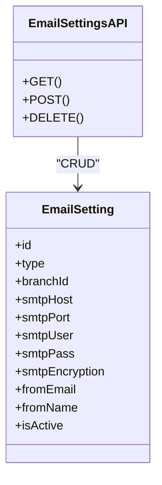
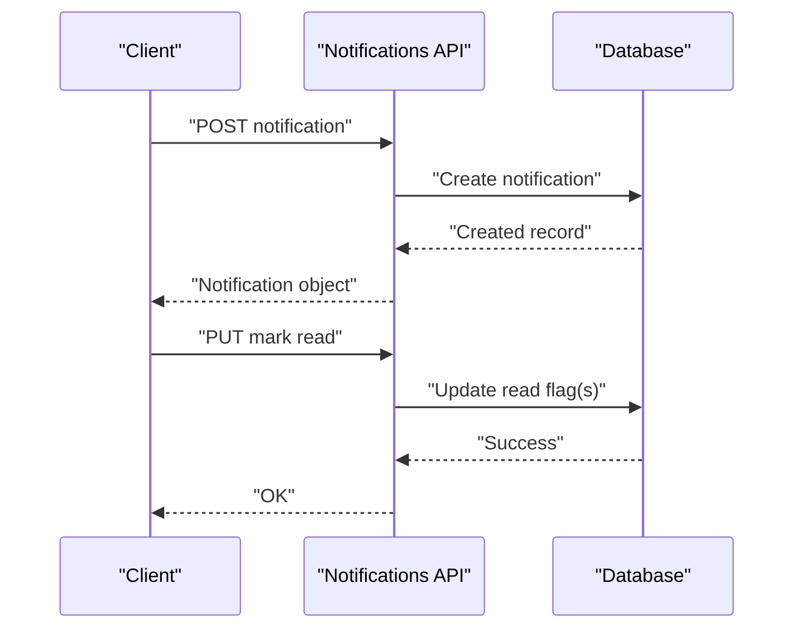
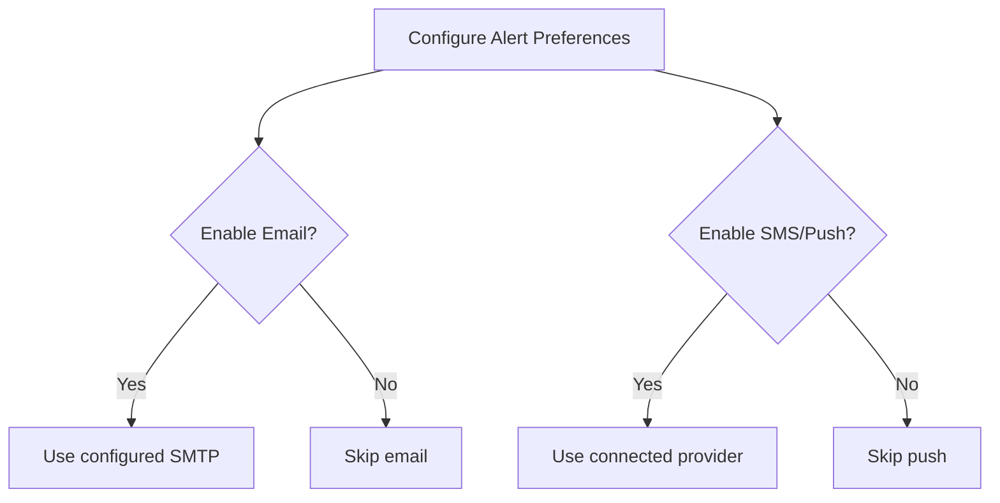
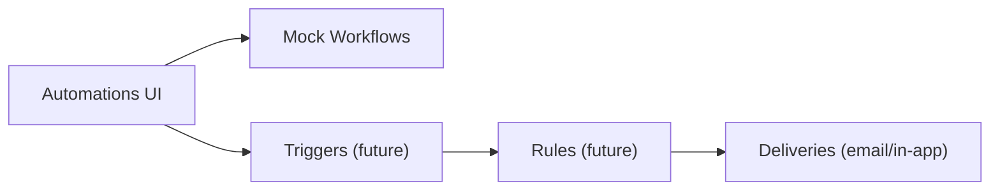
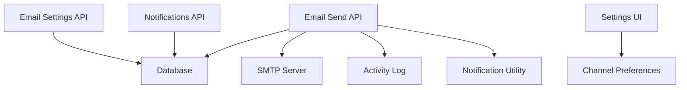

# Automated Reminder System

<cite>
**Referenced Files in This Document**
- [route.ts](file://src/app/api/email/send/route.ts)
- [route.ts](file://src/app/api/settings/email/route.ts)
- [route.ts](file://src/app/api/notifications/route.ts)
- [notifications.ts](file://src/lib/notifications.ts)
- [SettingsContent.tsx](file://src/app/settings/components/SettingsContent.tsx)
- [SupportContent.tsx](file://src/app/support/components/SupportContent.tsx)
- [AutomationsContent.tsx](file://src/app/automations/components/AutomationsContent.tsx)
- [AnalyticsContent.tsx](file://src/app/analytics/components/AnalyticsContent.tsx)
- [seed-notifications.ts](file://prisma/seed-notifications.ts)
</cite>

## Table of Contents
1. [Introduction](#introduction)
2. [Project Structure](#project-structure)
3. [Core Components](#core-components)
4. [Architecture Overview](#architecture-overview)
5. [Detailed Component Analysis](#detailed-component-analysis)
6. [Dependency Analysis](#dependency-analysis)
7. [Performance Considerations](#performance-considerations)
8. [Troubleshooting Guide](#troubleshooting-guide)
9. [Conclusion](#conclusion)
10. [Appendices](#appendices)

## Introduction
This document explains the Automated Reminder System used within the visa processing workflow to send proactive notifications to counselors, students, and administrators about upcoming deadlines, missing documents, and status changes. It covers how reminders are configured (frequency, recipients, templates), how they integrate with email services and in-app notifications, and how scheduling and delivery are managed. It also includes guidance for analytics tracking, troubleshooting delivery issues, and customizing templates.

## Project Structure
The reminder system is implemented across server-side APIs, a notification utility, settings UIs, and support documentation:
- Email sending API that uses SMTP settings from the database
- Email settings management API for global and branch-level configurations
- In-app notification storage and lifecycle endpoints
- Notification creation helper for system-generated messages
- Settings UI for alert preferences and channel toggles
- Support content describing template variables and configuration steps
- Automations UI for managing workflows (placeholder for future rule-based triggers)
- Analytics page placeholder for dashboards

**Diagram sources**
- [route.ts:8-80](file://src/app/api/email/send/route.ts#L8-L80)
- [route.ts:6-154](file://src/app/api/settings/email/route.ts#L6-L154)
- [route.ts:45-142](file://src/app/api/notifications/route.ts#L45-L142)
- [notifications.ts:3-40](file://src/lib/notifications.ts#L3-L40)
- [SettingsContent.tsx:3387-3456](file://src/app/settings/components/SettingsContent.tsx#L3387-L3456)
- [SupportContent.tsx:2314-2351](file://src/app/support/components/SupportContent.tsx#L2314-L2351)

**Section sources**
- [route.ts:8-80](file://src/app/api/email/send/route.ts#L8-L80)
- [route.ts:6-154](file://src/app/api/settings/email/route.ts#L6-L154)
- [route.ts:45-142](file://src/app/api/notifications/route.ts#L45-L142)
- [notifications.ts:3-40](file://src/lib/notifications.ts#L3-L40)
- [SettingsContent.tsx:3387-3456](file://src/app/settings/components/SettingsContent.tsx#L3387-L3456)
- [SupportContent.tsx:2314-2351](file://src/app/support/components/SupportContent.tsx#L2314-L2351)

## Core Components
- Email Sending API: Validates session and required fields, loads active SMTP settings, sends email via nodemailer, logs activity, creates an in-app success notification, and optionally updates student last activity.
- Email Settings API: Manages global or branch-specific SMTP configurations; enforces uniqueness constraints; masks passwords on read; logs create/delete actions.
- Notifications API: CRUD for in-app notifications; supports marking single or all as read; returns formatted list with time strings.
- Notification Utility: Creates user-scoped or global notifications with type classification.
- Settings UI: Provides per-alert-type toggles for Email and SMS/Push channels; informs about SMTP usage and provider integration.
- Support Content: Documents available email templates, customization steps, and dynamic variable syntax.
- Automations UI: Displays active workflows, run counts, success rate, and latency metrics; currently uses mock data but provides the operational surface for future rule-based triggers.
- Analytics Page: Placeholder dashboard for platform-wide statistics; extensible for reminder effectiveness metrics.

**Section sources**
- [route.ts:8-80](file://src/app/api/email/send/route.ts#L8-L80)
- [route.ts:6-154](file://src/app/api/settings/email/route.ts#L6-L154)
- [route.ts:45-142](file://src/app/api/notifications/route.ts#L45-L142)
- [notifications.ts:3-40](file://src/lib/notifications.ts#L3-L40)
- [SettingsContent.tsx:3387-3456](file://src/app/settings/components/SettingsContent.tsx#L3387-L3456)
- [SupportContent.tsx:2314-2351](file://src/app/support/components/SupportContent.tsx#L2314-L2351)
- [AutomationsContent.tsx:46-228](file://src/app/automations/components/AutomationsContent.tsx#L46-L228)
- [AnalyticsContent.tsx:6-62](file://src/app/analytics/components/AnalyticsContent.tsx#L6-L62)

## Architecture Overview
The reminder flow integrates event-driven triggers (future automation rules), email delivery via SMTP, and persistent in-app notifications for auditability and user visibility.

**Diagram sources**
- [route.ts:8-80](file://src/app/api/email/send/route.ts#L8-L80)
- [route.ts:6-154](file://src/app/api/settings/email/route.ts#L6-L154)
- [notifications.ts:3-40](file://src/lib/notifications.ts#L3-L40)

## Detailed Component Analysis

### Email Delivery Integration
- Authentication and authorization: Only Admin/Super Admin/Staff can send emails.
- Input validation: Requires recipient, subject, and body.
- SMTP configuration: Loads the active setting; supports host, port, encryption, credentials, and sender identity.
- Delivery: Uses nodemailer to send HTML content.
- Post-send actions: Logs activity, creates an in-app success notification, and optionally updates student last activity.

```mermaid
flowchart TD
Start(["POST /api/email/send"]) --> Auth["Validate session & role"]
Auth --> Validate["Validate to, subject, body"]
Validate --> |Invalid| Err400["Return 400 error"]
Validate --> LoadCfg["Load active emailSetting"]
LoadCfg --> |Missing| Err400
LoadCfg --> SendMail["Send via nodemailer"]
SendMail --> LogAct["Log activity"]
LogAct --> CreateNotif["Create in-app notification"]
CreateNotif --> UpdateStudent{"studentId provided?"}
UpdateStudent --> |Yes| UpdateLast["Update student.lastActivity"]
UpdateStudent --> |No| Done["Return success"]
UpdateLast --> Done
```

**Diagram sources**
- [route.ts:8-80](file://src/app/api/email/send/route.ts#L8-L80)

**Section sources**
- [route.ts:8-80](file://src/app/api/email/send/route.ts#L8-L80)

### Email Settings Management
- Supports Global and Branch scopes; prevents duplicates per scope.
- Masks sensitive fields on read; preserves password when updating without re-entering.
- Logs create and delete operations for auditability.

**Diagram sources**
- [route.ts:6-154](file://src/app/api/settings/email/route.ts#L6-L154)

**Section sources**
- [route.ts:6-154](file://src/app/api/settings/email/route.ts#L6-L154)

### In-App Notifications
- Creation: User-scoped or global notifications with type classification.
- Lifecycle: Fetch, mark read (single or all), delete (single or all).
- Seeding: Initial notifications for development/testing.

**Diagram sources**
- [route.ts:45-142](file://src/app/api/notifications/route.ts#L45-L142)
- [notifications.ts:3-40](file://src/lib/notifications.ts#L3-L40)
- [seed-notifications.ts:4-36](file://prisma/seed-notifications.ts#L4-L36)

**Section sources**
- [route.ts:45-142](file://src/app/api/notifications/route.ts#L45-L142)
- [notifications.ts:3-40](file://src/lib/notifications.ts#L3-L40)
- [seed-notifications.ts:4-36](file://prisma/seed-notifications.ts#L4-L36)

### Alert Preferences and Channels
- Per-alert-type toggles for Email and SMS/Push channels.
- Guidance indicates email delivery uses SMTP settings; SMS/push use connected providers.

**Diagram sources**
- [SettingsContent.tsx:3387-3456](file://src/app/settings/components/SettingsContent.tsx#L3387-L3456)

**Section sources**
- [SettingsContent.tsx:3387-3456](file://src/app/settings/components/SettingsContent.tsx#L3387-L3456)

### Template Customization
- Templates control content for system-generated emails.
- Dynamic variables supported using double-brace syntax (e.g., userName, dueDate, link).
- Steps include selecting a template, editing via rich text, previewing, and saving.

**Section sources**
- [SupportContent.tsx:2314-2351](file://src/app/support/components/SupportContent.tsx#L2314-L2351)

### Scheduling Engine and Automation Surface
- The Automations UI presents active workflows, runs today, success rate, and average latency.
- Currently uses mock data; intended as the operational surface for future rule-based triggers such as document submission deadlines, appointment reminders, and approval notifications.

**Diagram sources**
- [AutomationsContent.tsx:46-228](file://src/app/automations/components/AutomationsContent.tsx#L46-L228)

**Section sources**
- [AutomationsContent.tsx:46-228](file://src/app/automations/components/AutomationsContent.tsx#L46-L228)

### Analytics Dashboard
- Placeholder dashboard for platform-wide statistics; extensible to track reminder effectiveness and response rates.

**Section sources**
- [AnalyticsContent.tsx:6-62](file://src/app/analytics/components/AnalyticsContent.tsx#L6-L62)

## Dependency Analysis
- Email Send depends on:
  - Session/auth utilities
  - Database for emailSetting and optional student update
  - Nodemailer transport
  - Activity logging
  - Notification creation utility
- Email Settings API depends on:
  - Database for emailSetting records
  - Activity logging
- Notifications API depends on:
  - Database for notification records
  - Session/auth utilities
- Settings UI depends on:
  - Channel preference state and toggles
  - Informational guidance about SMTP and providers

**Diagram sources**
- [route.ts:8-80](file://src/app/api/email/send/route.ts#L8-L80)
- [route.ts:6-154](file://src/app/api/settings/email/route.ts#L6-L154)
- [route.ts:45-142](file://src/app/api/notifications/route.ts#L45-L142)
- [notifications.ts:3-40](file://src/lib/notifications.ts#L3-L40)

**Section sources**
- [route.ts:8-80](file://src/app/api/email/send/route.ts#L8-L80)
- [route.ts:6-154](file://src/app/api/settings/email/route.ts#L6-L154)
- [route.ts:45-142](file://src/app/api/notifications/route.ts#L45-L142)
- [notifications.ts:3-40](file://src/lib/notifications.ts#L3-L40)

## Performance Considerations
- SMTP reliability: Ensure correct host, port, and encryption; test connection before enabling production flows.
- Rate limiting: Built-in rate limiting utilities exist; apply where appropriate to protect endpoints.
- Database queries: Keep emailSetting lookups minimal and cached at application level if needed.
- Bulk notifications: For high-volume reminders, consider batching and background jobs to avoid blocking requests.

[No sources needed since this section provides general guidance]

## Troubleshooting Guide
Common issues and resolutions:
- No active email settings: Configure SMTP under Settings > Email; ensure one active setting exists.
- SMTP authentication failures: Verify credentials, encryption, and firewall access; test connection before saving.
- Missing recipients or content: Ensure to, subject, and body are provided when sending emails.
- In-app notifications not appearing: Check permissions and session; verify POST/PUT/DELETE endpoints respond successfully.
- Template rendering issues: Confirm dynamic variables are correctly referenced in templates.

**Section sources**
- [route.ts:8-80](file://src/app/api/email/send/route.ts#L8-L80)
- [route.ts:6-154](file://src/app/api/settings/email/route.ts#L6-L154)
- [route.ts:45-142](file://src/app/api/notifications/route.ts#L45-L142)
- [SupportContent.tsx:2314-2351](file://src/app/support/components/SupportContent.tsx#L2314-L2351)

## Conclusion
The Automated Reminder System integrates SMTP-based email delivery with persistent in-app notifications and configurable alert preferences. While the scheduling engine is represented by a placeholder automations interface, the core building blocks—email sending, settings management, and notifications—are fully implemented and ready to be wired into rule-based triggers. With proper configuration and template customization, the system can proactively notify counselors, students, and administrators about deadlines, missing documents, and status changes throughout the visa processing workflow.

[No sources needed since this section summarizes without analyzing specific files]

## Appendices

### Example Reminder Rules (Conceptual)
- Document Submission Deadline:
  - Trigger: Approaching deadline for required documents.
  - Recipients: Student and assigned counselor.
  - Channels: Email (via SMTP), In-App notification.
  - Template: Include student name, document list, due date, and link to upload portal.
- Appointment Reminder:
  - Trigger: Upcoming visa interview or counseling session.
  - Recipients: Student and counselor.
  - Channels: Email and In-App notification.
  - Template: Include appointment date/time, location/link, and preparation checklist.
- Approval Notification:
  - Trigger: Application status changes to approved.
  - Recipients: Student and administrator.
  - Channels: Email and In-App notification.
  - Template: Include application reference, next steps, and links to proceed.

[No sources needed since this section provides conceptual examples]