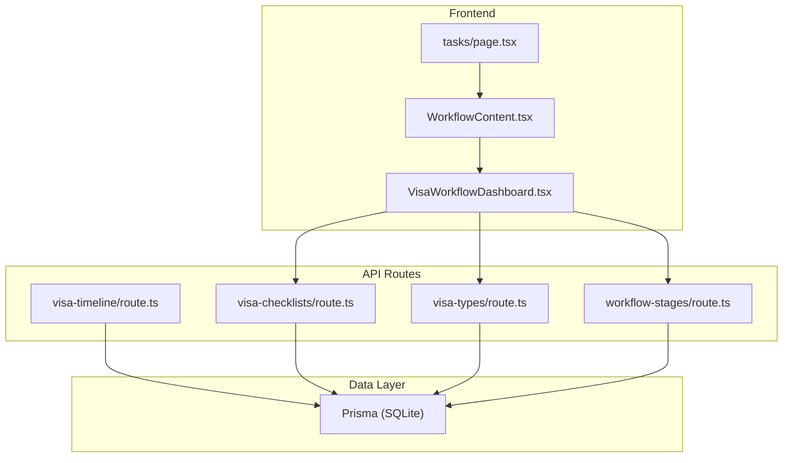
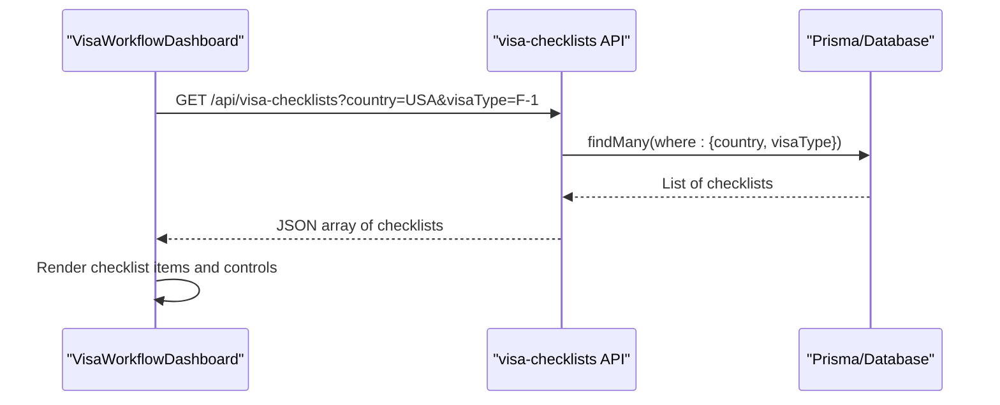
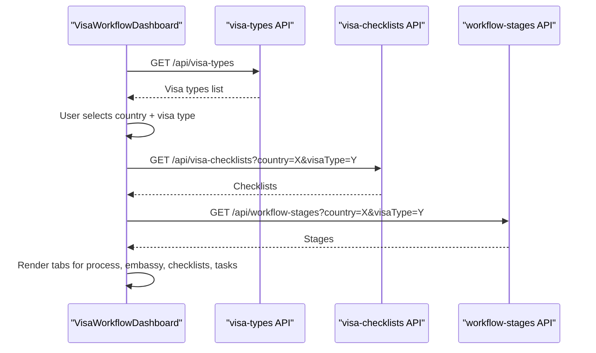
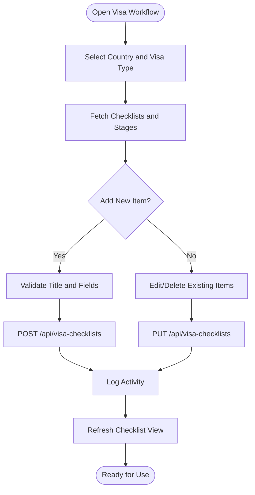
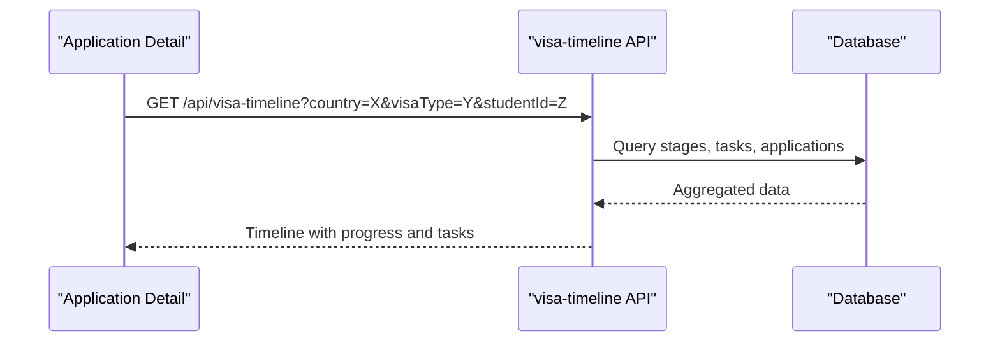
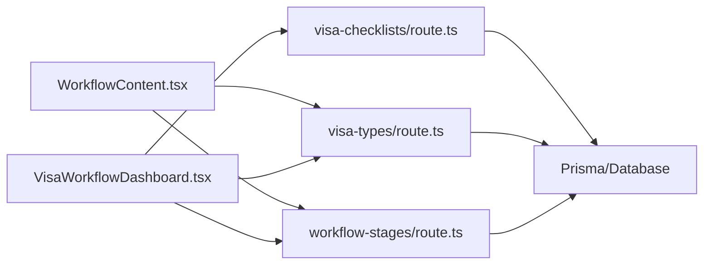

# Visa Checklist Management

<cite>
**Referenced Files in This Document**
- [route.ts](file://src/app/api/visa-checklists/route.ts)
- [route.ts](file://src/app/api/visa-types/route.ts)
- [route.ts](file://src/app/api/workflow-stages/route.ts)
- [schema.prisma](file://prisma/schema.prisma)
- [VisaWorkflowDashboard.tsx](file://src/app/tasks/components/VisaWorkflowDashboard.tsx)
- [WorkflowContent.tsx](file://src/app/tasks/components/WorkflowContent.tsx)
- [page.tsx](file://src/app/tasks/page.tsx)
- [route.ts](file://src/app/api/visa-timeline/route.ts)
</cite>

## Table of Contents
1. [Introduction](#introduction)
2. [Project Structure](#project-structure)
3. [Core Components](#core-components)
4. [Architecture Overview](#architecture-overview)
5. [Detailed Component Analysis](#detailed-component-analysis)
6. [Dependency Analysis](#dependency-analysis)
7. [Performance Considerations](#performance-considerations)
8. [Troubleshooting Guide](#troubleshooting-guide)
9. [Conclusion](#conclusion)
10. [Appendices](#appendices)

## Introduction
This document explains the Visa Checklist Management system that enables country-specific visa requirements to be defined and managed through customizable checklists. It covers how checklists are created, updated, and used within application workflows; how they automatically update based on selected visa types; and how related entities such as visa types and workflow stages integrate with the checklist system. It also documents API endpoints for CRUD operations on visa checklists and visa types, and outlines common use cases for configuring checklists for different countries.

## Project Structure
The Visa Checklist Management feature is implemented as a set of Next.js API routes backed by Prisma models. The primary components include:
- API routes for visa checklists, visa types, and workflow stages
- Database schema defining the data model for checklists, types, and stages
- Frontend components that fetch and render checklists and drive user interactions

**Diagram sources**
- [VisaWorkflowDashboard.tsx:180-228](file://src/app/tasks/components/VisaWorkflowDashboard.tsx#L180-L228)
- [WorkflowContent.tsx:194-212](file://src/app/tasks/components/WorkflowContent.tsx#L194-L212)
- [page.tsx:1-15](file://src/app/tasks/page.tsx#L1-L15)
- [route.ts](file://src/app/api/visa-checklists/route.ts)
- [route.ts](file://src/app/api/visa-types/route.ts)
- [route.ts](file://src/app/api/workflow-stages/route.ts)
- [route.ts](file://src/app/api/visa-timeline/route.ts)

**Section sources**
- [page.tsx:1-15](file://src/app/tasks/page.tsx#L1-L15)
- [VisaWorkflowDashboard.tsx:180-228](file://src/app/tasks/components/VisaWorkflowDashboard.tsx#L180-L228)
- [WorkflowContent.tsx:194-212](file://src/app/tasks/components/WorkflowContent.tsx#L194-L212)

## Core Components
- Visa Checklists: Country- and visa-type-scoped lists of required or optional documents with titles and descriptions.
- Visa Types: Global definitions of visa categories (e.g., Student Visa, Tourist Visa).
- Workflow Stages: Ordered steps per country and visa type, often paired with tasks and subtasks.
- Data Model: Prisma models define the structure and relationships for these entities.

Key responsibilities:
- Define and manage checklists per country and visa type
- Provide CRUD APIs for checklists and visa types
- Integrate with workflow stages and timeline views
- Support PDF generation of checklists for sharing

**Section sources**
- [schema.prisma:587-629](file://prisma/schema.prisma#L587-L629)
- [route.ts](file://src/app/api/visa-checklists/route.ts)
- [route.ts](file://src/app/api/visa-types/route.ts)
- [route.ts](file://src/app/api/workflow-stages/route.ts)

## Architecture Overview
The system follows a client-server architecture where the frontend requests data from API routes, which query the database via Prisma. Checklists are filtered by country and visa type, enabling dynamic configuration per destination and visa category.

**Diagram sources**
- [VisaWorkflowDashboard.tsx:204-213](file://src/app/tasks/components/VisaWorkflowDashboard.tsx#L204-L213)
- [route.ts:7-27](file://src/app/api/visa-checklists/route.ts#L7-L27)

## Detailed Component Analysis

### Visa Checklists API
- GET: Retrieves checklists filtered by country and visa type. Requires both parameters; returns ordered results by creation time.
- POST: Creates a new checklist item for a given country and visa type. Validates presence of country, visaType, and title. Logs activity.
- PUT: Updates an existing checklist item’s title, description, and optional requirement flag. Computes changes and logs activity.
- DELETE: Deletes a checklist item by ID. Logs activity.

Validation and error handling:
- Missing required fields return 400 errors
- Server-side errors return 500 errors with logged details

Activity logging:
- Create, update, and delete actions log actor and target information for auditability

**Section sources**
- [route.ts:7-27](file://src/app/api/visa-checklists/route.ts#L7-L27)
- [route.ts:29-63](file://src/app/api/visa-checklists/route.ts#L29-L63)
- [route.ts:65-98](file://src/app/api/visa-checklists/route.ts#L65-L98)
- [route.ts:100-127](file://src/app/api/visa-checklists/route.ts#L100-L127)

### Visa Types API
- GET: Lists all visa types ordered by creation date.
- POST: Creates a new visa type with label and optional description. Enforces uniqueness of labels and logs activity.
- PATCH: Updates a visa type’s label and/or description. Computes changes and logs activity.
- DELETE: Deletes a visa type by ID. Logs activity.

Error handling:
- Duplicate labels return 400
- Missing required fields return 400
- Server errors return 500

**Section sources**
- [route.ts:7-17](file://src/app/api/visa-types/route.ts#L7-L17)
- [route.ts:19-55](file://src/app/api/visa-types/route.ts#L19-L55)
- [route.ts:57-84](file://src/app/api/visa-types/route.ts#L57-L84)
- [route.ts:86-119](file://src/app/api/visa-types/route.ts#L86-L119)

### Workflow Stages API
- GET: Retrieves workflow stages for a specific country and visa type, ordered by stage order.
- POST: Creates a new stage with name, order, description, and optional subtasks stored as JSON. Logs activity.
- PATCH: Updates stage attributes including subtasks. Computes changes and logs activity.
- DELETE: Deletes a stage by ID. Logs activity.

Integration points:
- Used by the dashboard to display process steps alongside checklists
- Tasks can be associated with stages and contribute to progress metrics

**Section sources**
- [route.ts:8-28](file://src/app/api/workflow-stages/route.ts#L8-L28)
- [route.ts:30-65](file://src/app/api/workflow-stages/route.ts#L30-L65)
- [route.ts:67-101](file://src/app/api/workflow-stages/route.ts#L67-L101)
- [route.ts:103-131](file://src/app/api/workflow-stages/route.ts#L103-L131)

### Data Model (Prisma)
- VisaChecklist: Stores country, visaType, title, description, and isRequired flags. Supports per-country and per-visa-type customization.
- VisaType: Defines global visa categories with unique labels.
- WorkflowStage: Defines ordered steps per country and visa type, with optional subtasks stored as JSON.

Complexity considerations:
- Queries filter by two dimensions (country, visaType), requiring appropriate indexing for performance at scale
- Subtasks stored as JSON allow flexible task structures without schema migrations

**Section sources**
- [schema.prisma:587-629](file://prisma/schema.prisma#L587-L629)

### Frontend Integration and Automation
- The dashboard fetches checklists, embassy details, and workflow stages based on selected country and visa type
- Selecting a visa type triggers automatic loading of relevant checklists and stages
- PDF generation renders checklists into a printable document for sharing with applicants

**Diagram sources**
- [VisaWorkflowDashboard.tsx:180-228](file://src/app/tasks/components/VisaWorkflowDashboard.tsx#L180-L228)
- [WorkflowContent.tsx:194-212](file://src/app/tasks/components/WorkflowContent.tsx#L194-L212)

**Section sources**
- [VisaWorkflowDashboard.tsx:180-228](file://src/app/tasks/components/VisaWorkflowDashboard.tsx#L180-L228)
- [VisaWorkflowDashboard.tsx:329-433](file://src/app/tasks/components/VisaWorkflowDashboard.tsx#L329-L433)

### Checklist Creation Workflow
- Users open the Visa Workflow page and select a country and visa type
- They add required or optional checklist items with titles and descriptions
- Items are persisted via the checklist API and immediately reflected in the UI
- Changes are logged for audit purposes

**Diagram sources**
- [route.ts:29-63](file://src/app/api/visa-checklists/route.ts#L29-L63)
- [route.ts:65-98](file://src/app/api/visa-checklists/route.ts#L65-L98)

**Section sources**
- [route.ts:29-63](file://src/app/api/visa-checklists/route.ts#L29-L63)
- [route.ts:65-98](file://src/app/api/visa-checklists/route.ts#L65-L98)

### Country-Specific Configuration Examples
While the codebase does not hardcode country-specific templates, it supports creating checklists per country and visa type. Typical configurations might include:
- USA F-1 Student Visa: Passport, I-20, SEVIS fee receipt, financial proof, academic transcripts
- UK Tier 4 Student Visa: Passport, CAS letter, financial evidence, English proficiency certificate
- Canada Study Permit: Passport, acceptance letter, proof of funds, medical exam results
- Australia Student Visa (subclass 500): Passport, CoE, GTE statement, health insurance, financial capacity

These would be configured by adding checklist items under the corresponding country and visa type using the API or UI.

[No sources needed since this section provides conceptual examples]

### Application Workflow Integration
- The visa timeline aggregates stages and tasks to compute progress percentages
- Checklists are displayed alongside stages to guide applicants and staff through requirements
- PDF export allows sharing of the complete checklist for a selected visa type

**Diagram sources**
- [route.ts:21-56](file://src/app/api/visa-timeline/route.ts#L21-L56)

**Section sources**
- [route.ts:21-56](file://src/app/api/visa-timeline/route.ts#L21-L56)

## Dependency Analysis
The following diagram shows dependencies between frontend components and API routes, and their reliance on the database layer.

**Diagram sources**
- [WorkflowContent.tsx:194-212](file://src/app/tasks/components/WorkflowContent.tsx#L194-L212)
- [VisaWorkflowDashboard.tsx:180-228](file://src/app/tasks/components/VisaWorkflowDashboard.tsx#L180-L228)
- [route.ts](file://src/app/api/visa-checklists/route.ts)
- [route.ts](file://src/app/api/visa-types/route.ts)
- [route.ts](file://src/app/api/workflow-stages/route.ts)

**Section sources**
- [WorkflowContent.tsx:194-212](file://src/app/tasks/components/WorkflowContent.tsx#L194-L212)
- [VisaWorkflowDashboard.tsx:180-228](file://src/app/tasks/components/VisaWorkflowDashboard.tsx#L180-L228)

## Performance Considerations
- Filtering by country and visa type should leverage database indexes to optimize query performance
- Avoid excessive re-fetching by caching responses in the frontend when appropriate
- Batch operations are not currently exposed for checklists; consider implementing bulk create/update endpoints if large-scale updates are needed
- JSON subtasks storage simplifies schema but may require careful parsing and validation on the client side

[No sources needed since this section provides general guidance]

## Troubleshooting Guide
Common issues and resolutions:
- Missing parameters: Ensure country and visaType are provided for checklist queries; otherwise, a 400 error is returned
- Validation failures: Titles are required for checklist creation; ensure inputs are validated before submission
- Duplicate visa types: Labels must be unique; handle conflicts by updating existing entries or choosing a different label
- Activity logging: If audit logs are missing, verify session retrieval and activity logging utilities are functioning

**Section sources**
- [route.ts:7-27](file://src/app/api/visa-checklists/route.ts#L7-L27)
- [route.ts:29-63](file://src/app/api/visa-checklists/route.ts#L29-L63)
- [route.ts:19-55](file://src/app/api/visa-types/route.ts#L19-L55)

## Conclusion
The Visa Checklist Management system provides a flexible, country- and visa-type-driven approach to managing document requirements. Through well-defined APIs and a clear data model, administrators can configure checklists, integrate them with workflow stages, and present them to users in a cohesive interface. While template versioning and bulk operations are not explicitly implemented in the current codebase, the design supports future enhancements such as versioned templates and batch processing.

[No sources needed since this section summarizes without analyzing specific files]

## Appendices

### API Reference Summary
- Visa Checklists
  - GET /api/visa-checklists?country=&visaType=
  - POST /api/visa-checklists
  - PUT /api/visa-checklists
  - DELETE /api/visa-checklists?id=
- Visa Types
  - GET /api/visa-types
  - POST /api/visa-types
  - PATCH /api/visa-types
  - DELETE /api/visa-types?id=
- Workflow Stages
  - GET /api/workflow-stages?country=&visaType=
  - POST /api/workflow-stages
  - PATCH /api/workflow-stages
  - DELETE /api/workflow-stages?id=

**Section sources**
- [route.ts](file://src/app/api/visa-checklists/route.ts)
- [route.ts](file://src/app/api/visa-types/route.ts)
- [route.ts](file://src/app/api/workflow-stages/route.ts)